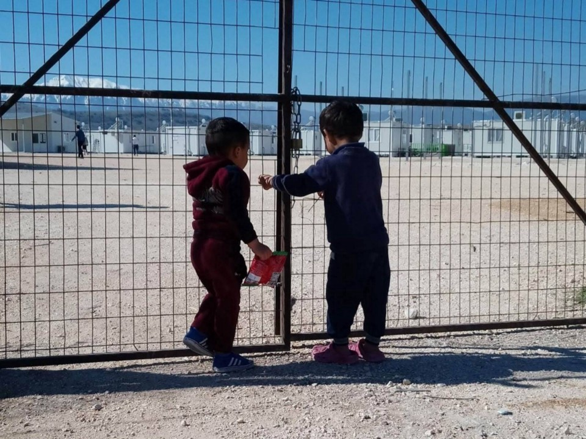
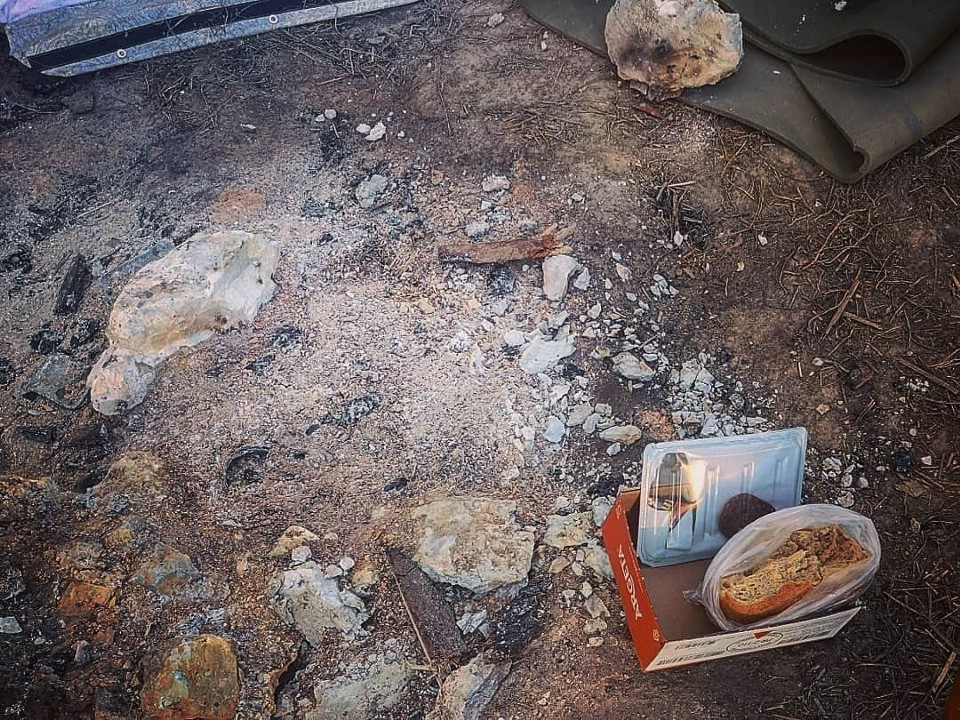

### عوض شدن قوانین پناهندگی در دانمارک
#### AYS Weekly News Summary in Persian, March 4— 10

Camp Katsikas, by RSE
### **ویژگی : ده شکست کلیدی**

چند روز قبل، کمیسیون اروپا بیانیه‌ای منتشر کرد و از “ تلاش‌های “ اتحادیه اروپا در مورد مهاجرت قدردانی کرد\. اتحادیه اروپا باید پیشرفت در طی چهار سال گذشته را حفظ کند

در واقع , این پیشرفت مرزها و کمک‌های انسان‌دوستانه است و وانمود می‌کند که حمایت مالی از کشورهایی که به حقوق بشر احترام نمی‌گذارند و استفاده از حمایت نظامی میکنند به معنای حمایت از افراد نیازمند است\. کمیسیون ده دستاورد کلیدی را لیست می‌کند که برخی از آن‌ها مقابله با آن‌ها آسان است

با این حال, این اولین بار نیست که دولت دانمارک مردم را لغو کرده و مردم را به کشورهای بی‌ثبات برگردانده است, این براساس گزارش‌های امنیتیه بسیار سوال‌برانگیز بوده است

گزارش منتشر شده توسط اداره مهاجرت دانمارکی در مورد وضعیت امنیتی در موگادیشو , در سومالی , نتیجه گرفت که موگادیشو مکانی امن برای بازگشت به افرادی است که شخصا ً تحت پی‌گرد قانونی قرار نیستند \. بعدها کشف شد که دولت دانمارک, به دلیل “ دلایل امنیتی “ , فرودگاه در موگادیشو را ترک نکرده است و دولت دانمارک با پیشنهاد دولت سومالی برای آموزش پلیس سومالی , در تجارت پذیرش اخراج غیرقانونی 12 نفر از دانمارک در یک سال , موافقت کرده‌است

به رغم انتقاداتی که این گزارش دریافت کرده‌است , همچنین اطلاع از توافق مشکوک با کشوری که به عنوان “ فاسدترین کشورهای جهان “ شناخته شده‌است, اداره مهاجرت دانمارکی تلاش خود را برای اخراج سومالی ها آغاز کرده‌است

دانمارک دو اردوگاه دیپورتی در کشور دارد \. طبق گزارش سازمان‌های مختلف رسانه‌ ای و حقوق بشر , شرایط در اردوگاه‌ها “ عمدا ً تا حد امکان ناخوشایند “ است , در حالی که برخی از این مکان‌ها را به عنوان زندان‌ باز می‌نامند

این متن میگوید: دست از کشتن ما بردارید که با آرامی از طریق آزادیه تحقیق جمعی در شرایط اردوگاه‌ها دست دارید

این هفته یک اخراج در مرکز دیپورت سالسمارک صورت گرفت \. رادیو پل روی صفحه فیسبوک آن‌ها نوشته شده بود: عکسی از زنی که پس از بی‌هوش شدن روی زمین افتاده بود \. پلیس در همه جا در این مرکز حضور داشت و تلاش می‌کرد تا یک خانواده ایرانی و فرزندانش را به فرودگاه منتقل کند تا آن‌ها را تبعید کنند \. با این حال , با توجه به شرایط پزشکی او , اخراج به عقب افتاد و او به بیمارستان منتقل شد

این ضربه به افرادی است که در اردوگاه زندگی می‌کنند \. خشونت این اخراج‌ها برای تمام زنان , مردان و کودکانی که در این اردوگاه زندگی می‌کنند , واقعی است \. این تنها غذای بد نیست , بلکه مشکل مدرسه یا بهداشت ضعیف در این مرکز دیپورت وجود دارد \. رادیو گزارش می‌دهد : این ترس واقعی است به دلیل فرستادن افراد به کشوری است که جانشان در خطر است

می‌توانید اطلاعات بیشتری درباره نحوه توقف دیپورت در اینجا بیابید

همچنین اگر در دانمارک زندگی می‌کنید می‌توانید دادخواست را امضا کنید \. برای رسیدن به پارلمان، 50000 امضا لازم است \. این دادخواست خواستار شرایط زندگی بهتر برای کودکان پناهنده در مراکز دیپورت سنتر شده‌است

بیشتر بخوانید:

### **لبنان**

به گفته ی [آلباوا](https://www.albawaba.com/editorchoice/only-14-refugees-attend-secondary-school-lebanon-why-1261056?fbclid=IwAR34Qs0IrStzco6k5dfqNAtlwoylMjLhUTkgd-bXdqCJ7DxOJ2nyRrx2eGw) ، تنها ۱\.۴ درصد از پناهندگان واجد شرایط سوری در دبیرستان ثبت‌نام کرده‌اند \. آلباوا با اشاره به بنیاد عبدالله ال قریر، برای تحصیل می‌گوید که تامین بودجه اغلب به سوی جوانان هدایت می‌شود
### **ترکیه**

ترکیه یک گذرگاه مرزی دیگر با سوریه را به عنوان آزادیه انتخاب گزارش‌ها، باز کرد \. گفته می‌شود که این گذرگاه از مسیر کسسب است، که در سال ۲۰۱۴ بسته شد

> ترکیه دو مرز سوریه را در این هفته بازگشایی کرده‌است و اولین بار در چندین سال است که آنکارا برای مردم سوریه و حلب در دسترس عموم قرار گرفته ‌است 

### **دریا**

خدمه مدیترانه [اعلام](https://www.facebook.com/Mediterranearescue/photos/a.275129016441663/334979070456657/?type=3&theater) کردند که این تیم برای حرکت آماده است \. کشتی لونیان در ۱۳ مارس عازم این ماموریت خواهد شد

تایمز مالت گزارش داد که در همان حال ، نیروی مسلح مالت ۸۷ نفر را از لمپدوسا نجات داد

خدمه ی گروه سی\.آی به مالورکا رسیدند \. در ماموریت اول خود ، کشتی به نام آلن کوردی که در هیچ عملیات نجات شرکت نکرده است \. در یک مورد ، آن‌ها می‌گویند که آن‌ها از جریان اطلاعات زمانی که یک قایق ، بنا بر گزارش‌ها ، در فلاکت است قطع شده‌اند \. کشتی تا ده روز در مالورکا خواهد ماند
### **یونان**

دادستان عمومی در یونان تحقیقاتی در مورد به عقب فرستادن مردم در رودخانه اوروس آغاز کرد

گروه پشتیبانی پناهندگان اروپا پس از ۱۴ ماه توسط دولت محلی از اردوگاه کاتیسکاس بیرون رانده شد و گفت: مقامات یونان هیچ برنامه‌ای برای جایگزینی هیچ یک از خدماتی که ما در اردوگاه کاتیسکاس در حال تحویل آن‌ها هستیم، ندارند
### **بوسنی**

داوطلبان “ کلوون بدون‌مرز “ گزارش می‌دهند که در حدود ۱۶۰۰ نفر در طول چند ماه گذشته از یک مکان در نزدیکی بیهاچ عبور کرده‌اند — و گاهی بیش از ۱۰۰ نفر در شب \. آن‌ها در سفر خود به بالکان در کلوتس ، ایست بازرسی که در آن پلیس محلی به طور غیرقانونی اتوبوس را متوقف کرده و پناهندگان را آواره کرده و آن‌ها را در جاده رها کرده‌است ، متوقف شدند \. اغلب در میان کسانی که کنار جاده رها می‌شوند ، خانواده‌ها ، از جمله آن‌هایی که بچه کوچک دارند ، وجود دارند

داستین آلن می‌نویسد : “هر اتوبوس و اتومبیلی از سارایوو تا بیهاچ بازرسی می‌شود و همه ی مهاجران توسط پلیس خارج می‌شوند که هیچ منبعی در اینجا رها می‌شوند “ و افزود که تنها کمک توسط صلیب‌سرخ محلی تامین می‌شود

Photo by Dustin J\. Allen\. — Ključ
### **ایتالیا**

بیش از ۱۵۰۰ نفر از اردوگاه سان\.فرنیناندو به بیرون رانده شده‌اند \. گاردین می‌نویسد : حدود ۱۰۰۰ مامور پلیس شبه‌نظامی در این اقدام شرکت داشتند
### **لتونی**

شورای اروپا علیه نژاد پرستی و تعصب \( ECRI \) این گزارش را درباره نژاد پرستی در لتونی منتشر کرد و متوجه شد که این کشور پیشرفت پناهندگان و افرادی که از حمایت تابعه بهره می‌برند پیشرفت کرده‌است ، اما گفت که اقدامات بیشتری لازم است
### **بریتانیا**

به گفته تلوزیوون س\.تی\.وی ، گلاسکو میزبان بیش‌ترین تعداد پناهجویان در هر منطقه مرجع محلی در بریتانیا است \. در حال حاضر برای کمک به گروه‌های آسیب‌پذیر ، یک اقدام اضطراری در شهر ارائه شده‌است \. این شامل اجازه دادن به پناهجویان می‌شود که از شش ماه بعد از درخواست پناهندگی خود تا زمانی که تصمیم نهایی گرفته شود ، کار می‌کنند
### **بریتانیا**

به گفته تلوزیوون س\.تی\.وی ، گلاسکو میزبان بیش‌ترین تعداد پناهجویان در هر منطقه مرجع محلی در بریتانیا است \. در حال حاضر برای کمک به گروه‌های آسیب‌پذیر ، یک اقدام اضطراری در شهر ارائه شده‌است \. این شامل اجازه دادن به پناهجویان می‌شود که از شش ماه بعد از درخواست پناهندگی خود تا زمانی که تصمیم نهایی گرفته شود ، کار می‌کنند

در همان زمان ، سرویس جستجوگر پناهندگی مستقر در گلاسگو گزارش منتشر کرد و نشان داد که مردم در هنگام تلاش برای اعمال حقوق خود از جمله دسترسی به آموزش ، بهداشت و خدمات مراقبت اجتماعی با مشکلاتی مواجه هستند \. همچنین نیاز به راهنمایی ملی برای کارکنان بخش دولتی که با مردمی که فقیر هستند کار می‌کنند را برجسته می‌کند

### **دانمارک**

اداره مهاجرت دانمارک و هیات پناهندگان \( flygtningenaevnet \) هفته گذشته اعلام کردند که روند درخواست پناهندگی برای سوری‌ها از شهر دمشق را تغییر خواهند داد ، گروهی که تا کنون به طور خودکار به دلیل شرایط عمومی در سوریه پناهندگی اعطا کرده‌اند \( ماده ۷ \) \. این تصمیم به دنبال گزارش تازه منتشر شده توسط اداره مهاجرت دانمارکی است که ادعا می‌کند مناطق تحت کنترل اسد در استان دمشق ایمن هستند \. در عمل به این معنی است که سوری‌ها از استان دمشق دیگر به طور خودکار به آن‌ها پناهندگی اعطا نخواهند شد \. علاوه بر این ، هیات پناهندگان ، پرونده‌های باز را با امکان لغو اقامت موقت آغاز خواهد کرد و بدین ترتیب اخراج به سوریه را آغاز خواهد کرد \. پس از تغییر قانون در سال ۲۰۱۵ پس از تغییر قانون توسط دولت ائتلافی به رهبری حزب سوسیال دموکرات ، روند لغو انحصار موقت ، هنگامی که وضعیت امنیتی کشور در حال بهبود است ، امکان پذیر شد \. گزارش امنیتی منتشر شده دانمارک در سوریه با نتایج گزارش امنیتی UNs در مورد سوریه ، که تنها چند روز بعد از آن منتشر شد ، مغایرت دارد \. سازمان ملل متحد آن را “ توهم “ برای دستیابی به بازگشت ایمن و پایدار پناهندگان به سوریه ، به دلیل شرایط کشور ، با “ خشونت و جنایات جنگی انجام‌شده در همه طرفین ، ترکیب با تخریب زیرساخت حیاتی و فقدان خدمات عمومی اجرا کرد \. “

بیشتر بخوانید

_Converted [Medium Post](https://medium.com/are-you-syrious/%D8%B9%D9%88%D8%B6-%D8%B4%D8%AF%D9%86-%D9%82%D9%88%D8%A7%D9%86%DB%8C%D9%86-%D9%BE%D9%86%D8%A7%D9%87%D9%86%D8%AF%DA%AF%DB%8C-%D8%AF%D8%B1-%D8%AF%D8%A7%D9%86%D9%85%D8%A7%D8%B1%DA%A9-7b984cac7a86) by [ZMediumToMarkdown](https://github.com/ZhgChgLi/ZMediumToMarkdown)._
