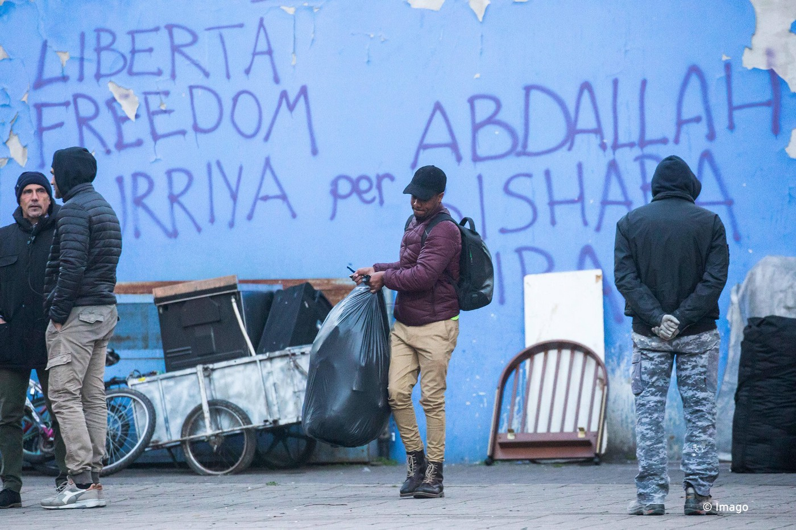
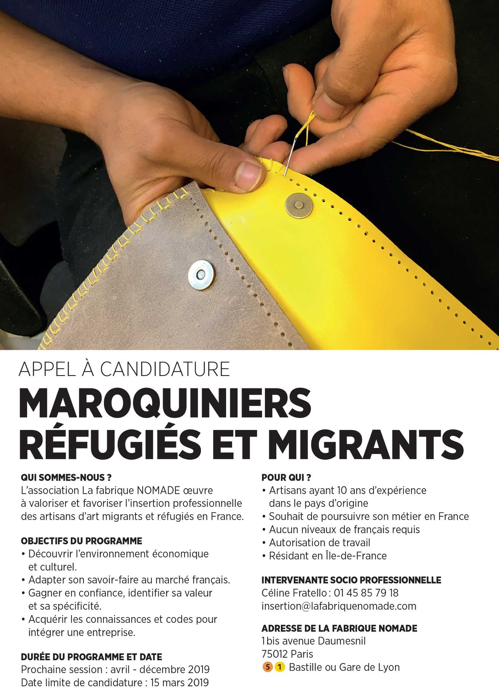

### AYS Daily Digest 11/3/19: Violent official reaction to peaceful protest in Iceland
#### Arrests and eviction of a protest in Iceland / Morocco drops case against human rights activist / Hunger strike in Malta / What’s going on in camps in Bosnia and Herzegovina / Eviction in Torino, march announced for Venice / next deportation to Afghanistan from Germany / more news

[Are You Syrious?](https://medium.com/@AreYouSyrious)

Mar 12

](assets/4e1f1fcae5df/1*D7TEdjd7aDxNc7-r9ff8TA.jpeg)

by [Refugees in Iceland](https://www.facebook.com/refugeesiniceland/?eid=ARAihDeR8kBWPrpiGKWqCMamYQ2Pb21YqB75k7NHNXbxYA38xVchyNV3pf3ZbBdvEg7HOAAZts1mL9DJ)
#### FEATURE

The police in Iceland used teargas and reacted rather violently when unarmed asylum seekers protested, wanting to draw attention to the inhumane conditions that asylum seekers live in, [Refugees in Iceland](https://www.facebook.com/refugeesiniceland/?tn-str=k%2AF) have reported\. 
In their invitation to the gathering, the [No Borders Iceland](https://www.facebook.com/nobordersiceland/?__tn__=kC-R&eid=ARA8re02-JXALlOz-08yDV1moJmapeWtflnhmFMuWlvjzFapk0ghG4ZLQJ73eYQHoeXbqU4cQH6q76bo&hc_ref=ARQhBgpa-Puj9lvMJkjx_piYuoGcPNpn90OcA4OrOiFtmKAeFRUAUk8UkZiuUvlx8Zs&__xts__%5B0%5D=68.ARBBZRClucXZ4z46cVMG0e-0CJjFcbJE6LNpGwGXprT26aci--D5b31CCV7eGKiQDyXyb4FMHXayEm7_owh6Dc_uzYYZ9_M2SnLy3qMnG02p2u0nZYP1RpZaBC_Py0p-4wTW_N_DFO0YsFXrhHRkUAP2nOHnpedGPACha6NYPoT90qppdaYuHvs39ysfLOHbyN6xaIGckAOY_NIApgNzQF_XfQeRwz5TwwG9sLI1E2g40p9KljnYqo1Rq7uXQKwTO37BVqTC_5ZfV_3QVfp65y_5NWZLFDbuAXaHjs8vZqTZYVZUYjUXCcf-S29U8QWw6HJXslqr28r0wx_K0fY-SmpwYg) stated:

> “In the past month, we have stood united as refugees and tried to make our voices heard so that we may claim our rights as human beings on this earth\. Show us solidarity by joining us in Austurvöllur on Monday at 15:00, listen to our demands and help us make the authorities listen as well\.“ 

Among other basic needs to be met, gathered in Austurvöllur, a location where Icelanders usually hold protests, the people protested in order for the remote Ásbrú camp to be taken down and their cases properly reviewed, according to the law\.

Three weeks have passed, according to protesters, from the time they sent a written letter to the government, with the assistance and support of the Red Cross, without receiving any answers\. When a protest meeting was held outside the Directorate of Immigration at the time, no agency representative stepped out to hear protest claims and demands, but on the contrary, security concerns were raised\.
So far, the only response has been both institutional and physical violence inflicted by the state, the group stated\.

Later on, a police officer said that when the police approached to confiscate the cardboard boxes people were holding with signs on them \(allegedly thinking they wanted to set them on fire\), some of the protesters responded badly and were arrested\.

> “We all sat on cardboard boxes because it was cold and we wanted insulation from the ground\. The police said they thought we were going to set them on fire\. We explained to the police that we were not going to start a fire, but this was to sit on\. Yet, they decided to attack us and tear us away\. Before I knew it, I’d been arrested and slammed into the ground\. “ — _Elinborg Harpa, an activist of the No Borders Association said to the media upon arrest\._ 

As an Icelander commented the situation, saying the people are “protesting the Icelandic government’s failure to comply with international law and human rights in their treatment of asylum seekers\. Among their demands are the right to work, which they are currently denied \(despite a labor shortage\), sometimes for years\. They are not asking for any handouts, only basic human liberties\.”

 on February 14, still no reactions](assets/4e1f1fcae5df/1*_OVLj5xEjKC8H8kSRFr5GQ.png)

Published by [No Borders Iceland](https://www.facebook.com/nobordersiceland/?tn-str=k%2AF) on February 14, still no reactions

A reaction protest is announced for March 12 — [Occupation against violence\!/Kyrrstaða til samstöðu](https://www.facebook.com/events/155208915425737/)
#### MOROCCO

Morocco has dropped the case against human rights activist ⁦Helena Maleno⁩ who was accused of human trafficking because of her calls alerting maritime rescue services of the presence of migrants crossing the Mediterranean Sea\.

As we’ve reported extensively, recently human rights activists in Europe have increasingly found themselves threatened and prosecuted for trying to help refugees and migrants and AYS has had these experiences, too\.
However, this case provoked a reaction in Spain, where more than 200 prominent Spanish figures signed a petition in support of Maleno, as the [media](https://www.theguardian.com/world/2019/mar/11/morocco-drops-case-spanish-activist-helena-maleno?fbclid=IwAR0hmBZmQd6wlg67kyuPl4I2sOdBoGCA2Cr0xOjI2W_NGbfJcFJvi5ZM3RQ) reported\.

On Monday, Walking Borders announced that the Moroccan court had dropped the case because of a lack of evidence against Maleno\.

> “At a time when defending the rights of migrants is becoming criminalised all over the world — and especially in Europe — the shelving of the case gives us exactly the kind of news we need to keep doing our job\.” — _Helena Maleno_ 

#### SEA

■■■■■■■■■■■■■■ 
> **[MSF Sea](https://twitter.com/MSF_Sea) @ Twitter Says:** 

> > Arrivals of #refugees, #asylumseekers &amp; #migrants to Europe may have decreased but at what cost? 

This year in the Central Med for every 9 people that attempt the crossing 1 will die. More than three times higher than 2018.

The cost is human lives.

[missingmigrants.iom.int/region/mediter…](https://missingmigrants.iom.int/region/mediterranean?migrant_route%5B%5D=1376) https://t.co/BfoWPvjPAj 

> **Tweeted at [2019-03-11 09:41:44](https://twitter.com/msf_sea/status/1105041104121065474).** 

■■■■■■■■■■■■■■ 

### Plan of Action to end the ship by ship approach in the Mediterranean Sea: 20 steps for a fair and predictable rescue system

#### GREECE
### Not much has changed on Lesvos

The people in Moria remain forgotten by most, locked up and stranded, victims of serious violations of many of their human rights “in what today has turned Lesbos into a paradigm of the failure of the supposed European model of attention to refugees,” Spanish outlets [re](https://cadenaser.com/ser/2019/03/09/sociedad/1552125031_992929.html?utm_campaign=coschedule&utm_source=twitter&utm_medium=MSF_Prensa&utm_content=Los%20refugiados%20olvidados%20del%20%22campo%20de%20concentraci%C3%B3n%22%20de%20Moria) call\. The situation is leading many, especially young people, reportedly even 10\-year\-old children, to attempt suicide\.
“It is very easy to criticize for NGOs, or for some who spend only half an hour here, and some journalists who then say that everything is wrong, but how to manage **17 nationalities, 5,200 people, 350 unaccompanied minors** ? We give them room to sleep, food to eat and we process their papers; notwithstanding many criticisms and many complaints, **this is not a hotel** “, says one of those responsible for the facility\.

■■■■■■■■■■■■■■ 
> **[MSF Prensa](https://twitter.com/MSF_Prensa) @ Twitter Says:** 

> > #Moria en #Lesbos es el paradigma del fracaso del modelo europeo de atención a los #refugiados. "Alambres de cuchillas rodean la oficina donde se presenta la petición de asilo, toda una metáfora de la bienvenida de Europa" @[NikoCastellano](https://twitter.com/NikoCastellano) @[Avivir](https://twitter.com/Avivir) @[La_SER](https://twitter.com/La_SER) [a.msf.es/2VPOkRF](https://a.msf.es/2VPOkRF) https://t.co/Dqn9i7Loco 

> **Tweeted at [2019-03-11 16:00:14](https://twitter.com/msf_prensa/status/1105136356869763074).** 

■■■■■■■■■■■■■■ 

#### MALTA
### Hunger strike

“Since the morning of March 5, many of those who disembarked in January have been on a hunger strike to protest the _de facto_ detention that they are subjected to and to demand clarification of the procedures for relocation that member states are using through mechanisms of entirely arbitrary selection,” said\.

They urge that the arbitrary detention of these people be put to an end and that they finally be allowed to access their rights and begin their lives in Europe\.
#### WEATHER REPORT for the WESTERN BALKANS, for March 12

Montenegro

In the central and southern part of the country there will be percipitation\. In the north, there will mostly be snow and blizzards throughout the day\. Very strong winds\. Highest temperature expected: \-3 to 14 degrees, but with the wind, the feeling is much colder\.

Serbia

The mountainous and hilly area of the western and southwest part of the country will see 20cm of snow, with a serious warning by meteorologists\. Temperatures will reach a maximum of 10 degrees Celsius\. Belgrade: cold, but no snow\. The weekend will see more sunny weather\.

Bosnia and Herzegovina

Cloudy with some snow until the afternoon\. Northern winds will blow, and in Herzegovina as well as southwest Bosnia the wind will be extremely strong\. Daily temperatures from 3 to 8\.

Croatia

The mainland will see some stronger wind, especially during the day\. Along the coast there will be very strong winds\. Highest temperatures will be from 7 to 12 Celsius\.
#### BOSNIA AND HERZEGOVINA

The No Name Kitchen team has published a report for February regarding the situation in the Una — Sana canton bordering with Croatia/EU, including the practice of push backs by the border police\. See the report here:

### The Ministry taking over reception centres

Bosnian media have reported that the temporary reception centres for migrants — the ex\-factory Bira, ex\-student dormitory Borići in Bihać, ex\-factory Miral in Velika Kladuša and ex\-hotel Sedra in Cazin — will be given for temporary management to the Office for Foreigners which is active as a part of the Ministry of Secrity, according to a decision made by the Council of Ministers\. All the costs of operation of the centres, the rent and setting up, is covered by the IOM\.

They said that the influx of migrants to Bosnia and Herzegovina has increased in comparison to the previous week and that more than 3000 people are now registered and lodged in the reception centres, meaning their biometric data has been taken\.

Beetween January 1 and February 21, the number of people registered with the Office was 1616\.

1402people have expressed the intention to ask for international protection and 32 applications were registered\.

Most of the people are from Pakistan, Iraq, Syria, Algeria and Marocco, the [report](https://l.facebook.com/l.php?u=https%3A%2F%2Fwww.biscani.net%2Funsko-sanski-kanton-privremeni-prihvatni-centri-za-migrante-bit-ce-predati-na-koristenje-sluzbi-za-poslove-sa-strancima%2F%3Ffbclid%3DIwAR3rTKJKvnoS_p6p2Luy01UJX3OhRrVxRIJgEwnVb6PmsAerLMRaYHxMHPA&h=AT0MsVNhIaVFX-cn__I3dvZlWqHMoDO3F3nUXhv504LHmBg-HtW-yYG0yo2c78rbKJdSqtGTJdwvNvdWvYhYIrB0-mWanaCIQJtuJNIJ4pgB-y_GcucLykKsJzoiV1Vs1A) concludes\.
### But, who runs it, and how?

In the meantime, a resident in Bira wrote to us, saying: “It’s awful here, everywhere is dirty, the doctor doesn’t care, the security and Red Cross also treat us like animals\. And IOM too\. The food is terrible\. Showers destroyed\. No warm water\.” Additionally, the residents reportedly complain about the violent treatment from the security guards of the private security agency engaged by the IOM at the premises\. On several occasions we wrote about the reported violence by the security guards in camps\. IOM responded earlier saying they do not tolerate that kind of behaviour\. Still, according to the people living there and some humanitarian workers with access to the camps, the situation seems not to have changed much, and there were no consequences for those who, paid by the citizens of the EU, treated people unfairly and unethically, and still seem to do so\. Even more, according to some of the reports, the staff is aware of it, sometimes even being present when such events occur\.
#### ITALY
### March for solidarity

This Saturday Venice announces a march for solidarity, share with your Friuli friends\!

### Torino

The police evicted one of the largest occupied residences in Turin\. Migrants were forced to abandon the site in the early hours of Monday morning, [InfoMigrants](https://www.facebook.com/InfoMigrants/?tn-str=k%2AF&hc_location=group_dialog) reported\. The eviction was agreed with the city authorities but it is as yet unclear where some of the inhabitants will be accommodated\.

](assets/4e1f1fcae5df/1*c6u-3_uzhPIyc-DAnI7Igg.jpeg)

Photos: [InfoMigrants](https://www.facebook.com/InfoMigrants/?tn-str=k%2AF&hc_location=group_dialog)
#### FRANCE

For refugees and migrant leatherworkers who want to continue working in their professional field in France, [La fabrique Nomade](https://www.facebook.com/LaFabriqueNomadeParis/?__xts__%5B0%5D=68.ARBSF4xnG_sdsFcIDMf7RQrveoRkwtc1CdogKIgWUh85wuOU9KVRCSDLPv5RntfC8oQSFC8-zH1pErqM2dJW2NE8cFFSewhysfqU_uPIn4Rt5uKTKm6LG-YhY49sV0ib_PakE9Trvg7L8pdGwKSxBQpaSNlgPtGFeI5pKv0EiYNoOQDIFx8w1D5YCKa7ul_Wa90Y1o641gu-tvtkxlxYKnTJvlsdY5Tm1UmgPFdompQaVdzwgApS7PVdoJpJBqEaCh2NhEUwIWMi3Q75Dsm7RtaIhnwOB-m2iJWsnbl4Tn-K0RHr7GzMZIwRKARFp8rgRvwnXo8NsrJ5Jd04deSyCXTZog&__tn__=k%2AF&tn-str=k%2AF) invites everyone to contact them as they wish to “accompany you in your professional integration”\.

Here are the conditions:
- Leatherworker with 10 years of experience in the country of origin
- Wishing to continue their job in France
- No level of French required
- Work Authorization
- Resident in Île\-de\-France

#### GERMANY

There are reasons to believe that the next deportation to Afghanistan is expected to take place at the beginning of next week, [Bayerischer Flüchtlingsrat](https://www.facebook.com/Bayerischer.Fluechtlingsrat/?__tn__=%2CdkCH-R-R&eid=ARDtXD7mCzELMze4n3ggv0elv1sov-ROQzM4dVWTk0T10iqajaH6plvGsDMCREeYYNrZEdXpHs1mjeYC&hc_ref=ARQApD6nyGNRnJpew36g9bV2VZqy_qR4lxe5UPA_13sCxbGF0dJw-YtjjRaawVY6Y-8&fref=nf&hc_location=group) reports:

> We don’t have an exact date yet, but are guessing a charter will take off on Monday, March 18 or Tuesday, March 19\. Information about a departure is not yet available\. We advise all Afghans to visit a counselling centre or a lawyer\. 

Find more information [here\.](https://www.fluechtlingsrat-bayern.de/abschiebungen-nach-afghanistan.html)

**Apart from daily news in English, we also publish weekly summaries in [Arabic](%D8%A7%D9%84%D8%AA%D8%BA%D9%8A%D9%8A%D8%B1%D8%A7%D8%AA-%D9%81%D9%8A-%D9%82%D8%A7%D9%86%D9%88%D9%86-%D8%A7%D9%84%D9%84%D8%AC%D9%88%D8%A1-%D9%81%D9%8A-%D8%A7%D9%84%D8%AF%D9%86%D9%85%D8%A7%D8%B1%D9%83-b99e429d54ad) and [Persian](%D8%B9%D9%88%D8%B6-%D8%B4%D8%AF%D9%86-%D9%82%D9%88%D8%A7%D9%86%DB%8C%D9%86-%D9%BE%D9%86%D8%A7%D9%87%D9%86%D8%AF%DA%AF%DB%8C-%D8%AF%D8%B1-%D8%AF%D8%A7%D9%86%D9%85%D8%A7%D8%B1%DA%A9-7b984cac7a86) \. Follow the links to read and share the ones from the week of March 4–10\.**

**We strive to echo correct news from the ground through collaboration and fairness\. Every effort has been made to credit organizations and individuals with regard to the supply of information, video, and photo material \(in cases where the source wanted to be accredited\) \. Please notify us regarding corrections\.**

**If there’s anything you want to share or comment, contact us through Facebook or write to: areyousyrious@gmail\.com**

_Converted [Medium Post](https://medium.com/are-you-syrious/ays-daily-digest-11-3-19-violent-official-reaction-to-peaceful-protest-in-iceland-4e1f1fcae5df) by [ZMediumToMarkdown](https://github.com/ZhgChgLi/ZMediumToMarkdown)._
