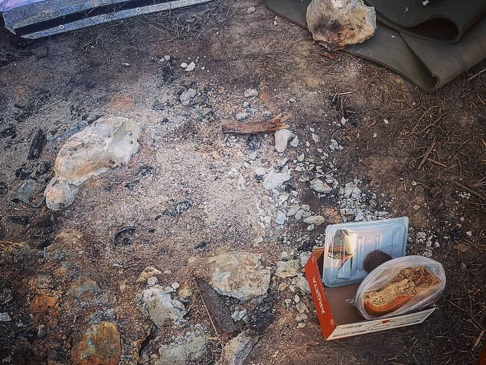

### التغييرات في قانون اللجوء في الدنمارك
#### AYS Weekly News Summary in Arabic, March 4–10

Camp Katsikas, by RSE
### **تقرير**

يوم الأربعاء ، أصدرت المفوضية الأوروبية بيانا ، أشادت فيه بـ “جهود” الأجندة الأوروبية حول الهجرة\. “الاتحاد الأوروبي” بحاجة إلى الحفاظ على التقدم المحرز على مدى السنوات الأربع الماضية “، كما تقول\.

في الواقع ، هذا هو تقدم الحدود الخارجية والمساعدات الإنسانية ، متظاهرين بأن الدعم \(المالي\) للدول التي لا تحترم حقوق الإنسان وتستعمل دعم التعزيزات العسكرية يعني دعم المحتاجين\. في ورقة الحقائق الخاصة بها ، تسرد اللجنة عشرة إنجازات رئيسية ، بعضها سهل المعالجة\.

ومع ذلك ، ليست هذه هي المرة الأولى التي تلغي فيها الحكومة الدنماركية أماكن الإقامة وترحل الأشخاص إلى بلدان غير مستقرة ، بناءً على تقارير أمنية مشكوك فيها للغاية\.

في عام ٢٠١٦، خلص تقرير أصدره ونشره مكتب الهجرة الدانمركي حول الوضع الأمني ​​في مقديشو ، في الصومال ، إلى أن مقديشو كانت مكانًا آمنًا للعودة إلى الأفراد الذين لم تتم مقاضاتهم شخصيًا\. اكتشف لاحقًا أن العمّال الذين يكتبون التقرير ، لم يغادروا المطار في مقديشو بسبب “أسباب أمنية” ، وأن الحكومة الدنماركية قد أبرمت اتفاقًا مع الحكومة الصومالية لعرض تدريب الشرطة الصومالية ، في مقابل قبول ١٢عملية ترحيل من الدنمارك في السنة\.

على الرغم من الانتقادات التي تلقاها التقرير ، فضلاً عن معرفته بالاتفاقية المشبوهة مع بلد معروف بأنه “من بين أكثر دول العالم فسادًا” ، فقد شرع مكتب الهجرة الدانمركي في جهودهم لترحيل الصوماليين\.

توجد في الدنمارك معسكرين للترحيل — سيولسمارك وكورشوفيدجارد — تم افتتاحهما في عامي ٢٠١٥و ٢٠١٦\. كما ذكرت مختلف وسائل الإعلام ومنظمات حقوق الإنسان ، فإن الظروف في المخيمات “غير متعمدة قدر الإمكان” ، في حين أن البعض يصفون هذه السجون بأنها مفتوحة\.

حدث هذا الأسبوع محاولة ترحيل في مركز الترحيل سيلسماك \. نشرت إذاعة بريدج على صفحتها ف ب الفيديو الذي أعدته سيلسماك عن امرأة ملقاة على الأرض بعد أن أغمي عليها خوفًا\. كانت الشرطة حاضرة بشكل واضح في كل مكان بالمركز ، وحاولت نقل عائلة إيرانية وأطفالها إلى المطار لمحاولة ترحيلهم\. ومع ذلك ، بسبب حالتها الصحية ، تم تأجيل الترحيل ، ونُقلت إلى المستشفى\.

هذه صدمة لكل من يعيش في المخيم\. وحشية عمليات الترحيل هذه حقيقية لجميع النساء والرجال والأطفال الذين يعيشون في هذا المخيم\. إنه ليس فقط طعامًا سيئًا ، ولا يقاتل الناس في مدرسة الترحيل في مركز ترحيل سيلسماك \. هذا هو الخوف الحقيقي من إعادتهم إلى بلد تتعرض فيه حياتهم للخطر\. “

\(يمكنك العثور على مزيد من المعلومات حول كيفية إيقاف الترحيل هنا\)

أيضا ، إذا كنت تعيش في الدنمارك ، فيمكنك توقيع العريضة\. للوصول إلى برلمان هناك حاجة إلى ٥٠٠٠٠ توقيع\. يطالب الالتماس بتوفير ظروف معيشية أفضل لطالبي اللجوء في مراكز الترحيل\.

### **لبنان**

ووفقاً للبوابة ، فإن٤\-١ في المائة فقط من اللاجئين السوريين المؤهلين مسجلون في المدارس الثانوية\. وفي إشارة إلى مؤسسة عبد الله الغرير للتعليم ، تقول البوابة إن التمويل غالباً ما يتم توجيهه إلى الشباب\.
### **تركيا**

فتحت تركيا معبرا حدوديا آخر مع سوريا ، حسب تقرير حرية الاختيار\. ويقال إنه معبر كساب الذي أغلق في عام ٢٠١٤\.

> “أعادت تركيا فتح المعبر الحدودي السوري هذا الأسبوع ، وهي المرة الأولى منذ عدة سنوات التي جعلت فيها أنقرة محافظتي اللاذقية وحلب السوريتين في متناول الشعب 

### **البحر**

أعلن طاقم ميديتيرانيا ، أن الفريق جاهز للمغادرة\. ستغادر سفينة البحر الأيوني لبعثتها في ١٣ مارس\.

في الوقت نفسه ، أنقذت القوات المسلحة المالطية \(ا م ف\) ٨٧ شخصا قبالة لامبيدوسا ، ذكرت صحيفة تايمز أوف مالطا\.

وصل طاقم عين البحر إلى مايوركا\. في مهمتها الأولى ، لم تكن السفينة ، التي سميت باسم آلان كردي ، متورطة في أي عمليات إنقاذ\. وفي إحدى الحالات ، يقولون إنهم قطعوا عن تدفق المعلومات عندما كان قاربًا في حالة استغاثة\. ستبقى السفينة في مايوركا لمدة عشرة أيام\.
### **اليونان**

بالاحتجاج على تعليم الأطفال اللاجئين في نفس مبنى المدرسة ، لم يرسل بعض الآباء في فاثي، ساموس أبنائهم إلى المدرسة لمدة أربعة أيام حتى الآن، تقارير

\.ي ا ت\. \(عبر ر س ا\) \. في غضون ذلك ، وصل ٤٧ شخصًا إلى الجزيرة ، حسب تقرير ايجينت بوينت\.

بدأ المدعي العام في اليونان تحقيقا بشأن عمليات الإيقاف في نهر إيفروس\.

طردت مجموعة دعم اللاجئين في أوروبا من مخيم كاتسيكس بعد ١٤ شهراً من قبل الحكومة المحلية\. “لا يصدق ، السلطات اليونانية ليس لديها خطط لاستبدال أي من الخدمات التي نقدمها في مخيم كاتسيكاس
### **البوسنة**

ويقول متطوعون من منظمة “مهرجون بلا حدود” الأمريكية إن حوالي ١٦٠٠ شخص قد مروا في مكان بالقرب من بيهاتش خلال الأشهر الأخيرة — وأحيانًا أكثر من مائة شخص في الليلة الواحدة\. وفي جولتهم في البلقان ، توقفوا في كلوج ، نقطة التفتيش حيث تقوم الشرطة المحلية بإيقاف الحافلات بشكل غير قانوني وخلع اللاجئين ، تاركينهم على الطريق\. في كثير من الأحيان ، من بين من تركوا الطريق ، هناك عائلات ، بما في ذلك الأطفال الذين لديهم أطفال صغار\.

“كل حافلة وسيارة في طريقها من سراييفو إلى بيهاتش يتم تفتيشها ، وأي مهاجرين يتم نقلهم من قبل الشرطة وتركوا هنا بدون موارد” ، كما يكتب داستن جيه ألين ، مضيفًا أن المساعدة الوحيدة المقدمة من الصليب الأحمر المحلي

Photo by Dustin J\. Allen\. — Ključ
### **إيطاليا**

تم طرد أكثر من ١٥٠٠ شخص من معسكر سان فرديناندو\. شارك حوالي ١٠٠٠ من ضباط الشرطة شبه العسكرية في العمل

### **فرنسا**

يتحدث مراقبو حقوق الإنسان في حافلة معلومات اللاجئين عن عمليات الإجلاء التي تحدث كل يومين في كل مكان يعيشون فيه في كاليه

### **لاتفيا**

أصدرت لجنة مجلس أوروبا لمكافحة العنصرية والتعصب \(ي س ر ا\) التقرير المتعلق بالعنصرية في لاتفيا ، حيث لاحظت أن البلد قد أحرزت تقدما في إدماج اللاجئين ومن يستفيدون من الحماية الفرعية ، لكنهم قالوا إن من الضروري اتخاذ مزيد من التدابير
### **الدنمارك**

أعلن مكتب الهجرة الدنماركي ومجلس اللاجئين الأسبوع الماضي أنهما سيغيران إجراءات إجراءات اللجوء للسوريين من محافظة دمشق ، وهي مجموعة تم منحها حتى الآن حق اللجوء تلقائياً بسبب الأوضاع العامة في سوريا \( § ٧ المادة ٣\) \. ويأتي هذا القرار في أعقاب تقرير نشر حديثًا لمكتب الهجرة الدنماركي ، والذي يزعم أن المناطق التي يسيطر عليها الأسد في محافظة دمشق آمنة\. عمليا يعني ذلك أن السوريين من محافظة دمشق لن يمنحوا حق اللجوء تلقائيا\. علاوة على ذلك ، سيبدأ مجلس اللاجئين في إعادة فتح القضايا مع إمكانية إلغاء الإقامة المؤقتة ، وبالتالي يبدأ الترحيل إلى سوريا\. إن عملية إلغاء الإقامة المؤقتة ، عندما بدأ الوضع الأمني ​​في البلد الأصلي في التحسن ، أصبحت ممكنة بعد تغيير قانون عام ٢٠١٥ من قبل الحكومة الائتلافية بقيادة الديمقراطيين آنذاك\. غير أن التقرير الأمني ​​المنشور عن سوريا حول سوريا يتعارض مع الاستنتاجات الواردة في التقرير الأمني ​​للأمم المتحدة عن سوريا ، والذي نشر بعد أيام قليلة من التقرير الدنماركي\. يصفها مفوضو الأمم المتحدة بأنه “وهم” للاعتقاد في عودة آمنة ومستدامة للاجئين إلى سوريا ، بسبب ظروف البلاد ، التي تتميز “بالعنف وجرائم الحرب المرتكبة من جميع الجهات ، بالإضافة إلى تدمير البنية التحتية الحيوية و نقص الخدمات العامة العاملة وما إلى ذلك\. “

اقرا المزيد

### المملكة المتحدة

وفقًا لـ تلفزيون س ت ف ، تستضيف غلاسكو أكبر عدد من طالبي اللجوء في أي منطقة سلطة محلية في المملكة المتحدة\. قامت الآن فرقة عمل اللجوء الخاصة بالمدينة بتقديم توصيات لمساعدة المجموعات الضعيفة\. وهذا يشمل السماح لطالبي اللجوء بالعمل ، بدءا من ستة أشهر بعد طلب اللجوء حتى يتم اتخاذ قرار نهائي\.

وفي الوقت نفسه ، نشرت خدمة ملتمس اللجوء التي تتخذ من غلاسكو مقراً لها تقريراً ، يظهر أن الناس يواجهون مشاكل عندما “يحاولون ممارسة حقوقهم بما في ذلك الوصول إلى خدمات التعليم والصحة والرعاية الاجتماعية\. كما أنه يسلط الضوء على الحاجة إلى التوجيه الوطني لموظفي القطاع العام الذين يعملون مع الأشخاص المعوزين “\.

يبحث بنك الطعام المساعد في ليفيشام عن تبرعات\.

_Converted [Medium Post](https://medium.com/are-you-syrious/%D8%A7%D9%84%D8%AA%D8%BA%D9%8A%D9%8A%D8%B1%D8%A7%D8%AA-%D9%81%D9%8A-%D9%82%D8%A7%D9%86%D9%88%D9%86-%D8%A7%D9%84%D9%84%D8%AC%D9%88%D8%A1-%D9%81%D9%8A-%D8%A7%D9%84%D8%AF%D9%86%D9%85%D8%A7%D8%B1%D9%83-b99e429d54ad) by [ZMediumToMarkdown](https://github.com/ZhgChgLi/ZMediumToMarkdown)._
