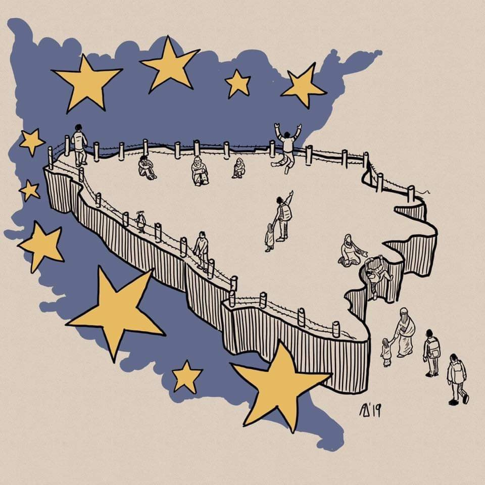

### AYS Daily Digest 12/3/19: Amnesty International demanding accountability from Croatian government

_Housing takeovers in Greece // border violence in Serbia // Denmark Immigration Services reassessing Syrian asylum claims // demands from Iceland protests // police surveillance in France // and more…_

Trapped\. By Admir Delić Stiki, Tuzla\.
### Feature: Thousands have been violently pushed back from Croatia, while police harass local NGOs, including AYS, cites new Amnesty International Report

Amnesty International published a new report “ [Pushed to the Edge: Violence and Abuse Against Refugees and Migrants Along Balkan Route](https://www.amnesty.org/en/latest/news/2019/03/croatia-eu-complicit-in-violence-and-abuse-by-police-against-refugees-and-migrants/?fbclid=IwAR3esdZnGN2Q7FpEwEgQyuTEgdMQC-TRvwBRofeccDl95HIajg6-aVGEEMI) ” to shed light on the human rights violations, focusing on Bosnia and Herzegovina, Croatia and Slovenia\. The report hopes to focus how these pushbacks, collective expulsions and border violence are not just actions taken by these individual countries and police forces, but rather part of the larger immigration policy of the EU to reduce border crossings and externalize migration\.

Police brutality on the Croatian border is particularly inhumane\. Of the 94 refugees and asylum seekers interviewed by Amnesty, many report accounts of being held in detention centers in Croatia for days, without any access to asylum procedures or due process, police beatings, and documents destroyed\.

As [No Name Kitchen](https://www.facebook.com/NoNameKitchenBelgrade/photos/a.312076942523930/684106208654333/?type=3&theater) in Bosnia accounts in their monthly Illegal Pushbacks and Border Violence Reports:

> “It is alarming how refugees and migrants return deported back to Bosnia with fractured bones or red and red eyes for the unnecessary use of chemical agents\.” 

In [an alarming video](http://hr.n1info.com/Vijesti/a376984/Osim-Dinamo-Zagreb-policajac-je-migrante-tjerao-da-vicu-Za-dom-spremni.html?fbclid=IwAR08lfiixYl35Tqb4k29XcW8OaGbwNvF1d5Ij2ZbB6vhDQjvJkzVYu2HAeM) published in Croatian media on Tuesday, a Croatian police officer forced a group of migrants to shout the name of the local soccer team and Croatian nazi salutes from WW2\. While the police officer in question is now under a criminal investigation, this kind of intimidation and harassment by the Croatian authorities is not unusual\.

**Amnesty International cited key recommendations** for a variety of stakeholders, but for the Croatian authorities they particularly called for:

→Stop using force and intimidation to prevent migrants and refugees from accessing Croatian territory;
 →Investigate the allegations of excessive use of force by the police against migrants and refugees at its borders and take appropriate action against the perpetrators;
 →Stop the campaign that seems to be deliberately designed to target and harass the organizations promoting refugee and migrant rights\.”

Their research also led them to overwhelmingly express how the EU needs to respond the the crisis on the Western Balkan Route:

> “The European Union must show leadership and decisively call on its Member States — Croatia, Slovenia and Italy — to immediately halt collective expulsions of refugees and migrants and take measures to prevent an emergence of a new humanitarian crisis at its doorstep\.” 

To read the report and other key recommendations, you can find it [here](https://www.amnesty.org/en/latest/news/2019/03/croatia-eu-complicit-in-violence-and-abuse-by-police-against-refugees-and-migrants/) \.
### Morocco

[It’s reported](https://twitter.com/alzoubeidi/status/1105524153912823809?fbclid=IwAR0XJt4Qur6-9t1yXeyOL7whlhnC99VVCUNJkFuVlZKHVftZdr6mI-07wRQ) that Moroccan authorities arrested 134 smuggled people in Rabat on Tuesday\. They were from Bangladesh, Burma, and India\.
### Libya

■■■■■■■■■■■■■■ 
> **[Sally Hayden](https://twitter.com/sallyhayd) @ Twitter Says:** 

> > Another reminder that at least 22 people from Eritrea &amp; Ethiopia are still believed to be underground in Triq al Sikka dc (undergoing torture &amp; abuse), following a protest two weeks ago today. 
It still seems no international org has managed to access them. 

> **Tweeted at [2019-03-12 12:41:15](https://twitter.com/sallyhayd/status/1105448669485117441).** 

■■■■■■■■■■■■■■ 

This reminder comes on Tuesday when the H\.E Mr\. Mark Harbers, Dutch Minister for Migration, visited UNHCR’s Gathering & Departure Facility in Tripoli\. The Netherlands’ official policy aims to help for the eventual closing of these centers\.

](assets/b090fb89091a/1*faXyTvS1QRJv_6wYVq2eIw.jpeg)

Mr\. Mark Harbers, Dutch Minister for Migration, visited UNHCR’s Gathering & Departure Facility in Tripoli\. Photo by [UNCHR Libya](https://twitter.com/unhcrlibya/status/1105504953815261186?s=21)

For more of a glimpse into the imprisonment in these detention centers, look [here](https://twitter.com/sallyhayd/status/1105461057349390336?s=19&fbclid=IwAR2ZBZWo5MQJ3CmnkPM6yEHEDvXOrxoILZMd6qeVZbDfmSyuBGd4QgduFco) \.
### Sea

IOM reports that migration did not switch from the Central Mediterranean Route to the Western Mediterranean Route, not adding to the increase of people traveling to Spain in 2018\. [The majority](https://twitter.com/fladig/status/1105499228196012034?fbclid=IwAR1NSvv2TIxZxjEAqswOxA_8xYtDOwyM2_9ml-ImI4KzeYIVeQu0w0B5NOk) of the demographics going to Italy were mostly likely deterred, stuck in Libyan detention centers\. The report did find alarming evidence of repeated exploitation of refugees on the Western Mediterranean Route\. Read more [here](https://www.iom.int/news/western-mediterranean-nearly-half-recent-spain-migrant-arrivals-report-exploitation-abuse) \.

[Mediterranea Saving Humans](https://www.facebook.com/Mediterranearescue/photos/a.275129009774997/337285640226000/?type=3&theater) reports that the the Ionian Sea rescue mission has started again towards the Central Mediterranean Route to attempt to save lives in a sea that has become a cemetery\.
### Greece

In an article for Vice Greece by Vasilis Papastergiou, lawyer and vice\-president of the Hellenic Association for Human Rights, it is cited that “On the basis of information and instructions issued by the Ministry of Immigration Policy to UNHCR and the other ESTIA program partners, refugees recognized prior to 31–7–2017 are r **equired to leave their apartments immediately on 31 March 2019\.”**

An account from an anonymous source:

_“All vulnerability assessments have been completed\. 287 cases \(cases not people\) were assessed\. This is the number of cases effected by the first round of evictions in town\. 165 cases have been granted extensions\. 22% due to school\. 2 cases due to pregnancy\. 16 cases due to serious illness\. 11 cases due to chronic illness\. 51 due to family member/ other resident is still an asylum seeker\. Each of these exceptions will be for up to 6 months and then reviewed\. **Therefore, 121 cases have been asked to leave \(43% of 287 cases\)** \._ 
_The Committee \(made up of UNHCR field staff\) were relatively flexible in accepting all cases that the ngos/ partners/ social workers declared as being vulnerable 1% of asylum seekers in ESTIA housing have bank accounts_ 
_3% of refugees in ESTIA housing have a bank account\. We still do not know if the 3 months cash card guarantee \(if leave voluntarily\) will be monthly or a lump sum\.”_

For more information read [here](https://www.vice.com/gr/article/eve84p/to-ypoyrgeio-metanasteytikhs-politikhs-bgazei-toys-prosfyges-apo-ta-spitia-toys?fbclid=IwAR3EqpwnkTa5tQK5eVf1nBen0ft8JZhZSTrvhd6_iw6m0dvowTQCBahuNwY) \.

[In an update from Samos](https://www.facebook.com/antifasamos/posts/1550224558443918?hc_location=ufi) : “Last week, boat with migrants capsized outside the island resulting in losing their lives three Afghans: Father and two brothers, twins\. The Mother survived, who is hospitalized in bad psychological situation in the hospital in deep\.”

People are dying at sea and then their family’s are forced to live in refugee camps, trying to overcome their grief\. This is Europe, 2019\.

In an update from UNHCR on the arrivals in Greece from the sea:

> “So far in 2019, a total of 3,337 refugees and migrants arrived in Greece by sea\. The majority are from Afghanistan \(42%\), Iraq \(12%\) and the State of Palestine \(12%\) \. More than half of the population are women \(23%\) and children \(39%\), while 38% are men\.” 

Find out more figures [here](https://reliefweb.int/report/greece/greece-sea-arrivals-dashboard-february-2019?fbclid=IwAR17kfJDoQsCIgNRgxvjOKt-sev4n5VHgp1wHBFlivE5R-lNhAHrXXOCknY) \.

There will be a protest at Sapfous Square in Mytilini, Lesvos against the 2 year anniversary of the signing of the EU Turkey deal\. Find out more [here](https://www.facebook.com/MareLiberumOfficial/posts/368412000554376?hc_location=ufi) \.

Zaatar in Athens will be holding a Graphic Design workshop starting now on every Monday\. Find out more [here\.](https://www.facebook.com/groups/204202716585823/permalink/848981908774564/?hc_location=ufi)

A huge reminder to take pictures of your white card and other important documents in case they are take away or lost\! \! \! You should upload the pictures online to access them even if your phone gets stolen\. For more helpful tips look [here\.](https://www.facebook.com/mobileinfoteam/posts/2393284314233617?hc_location=ufi)

[On Thursday](http://www.ekathimerini.com/238448/article/ekathimerini/news/govt-at-impasse-over-refugee-relocations-to-other-countries?fbclid=IwAR24HtJJmoGu4BkTGhzIZTpkpnSiJOmEiCuHH_sf2-KmKQOjP0aNBW7xYtY) the Greek government hopes to hear more about a relocation scheme were dashed\. The EU Turkey deal has not worked and Greece is just as overwhelmed as ever\.
### Serbia

The Border Violence Monitoring Project are reporting that on 24\.02\.19 three adolescent boys ages 13–15 were pushed back from Hungary to Serbia using “physical violence: beating, kicking, beating with sticks, pouring cold water; psychological violence: insulting\.” For more look [here](https://www.borderviolence.eu/violence-reports/february-24-2019-0300-railway-near-kelebija-hungary/?fbclid=IwAR1IYRUrRB5a6OPUlg5qrX-4q5k11scR5hxeAj6f5rbJWGuyE3TA_nClCiM) \.
### Italy

Refugee Info issues an article on how to change the details on your permesso di soggiorno \(permits to stay\) \. They answer many questions so find out more [here](https://www.refugee.info/italy/documents-it/how-to-change-details-on-your-permesso-di-soggiorno?language=en&fbclid=IwAR3GQIaAQmlA5rkLV2UkB-Vf5rO8uFUHPeNi1HdK3ovDsB9hGKmNGhc2wZI) \.
### France

CAMO is reporting of increased police harassment and violence towards young refugees from Ouistreham\. Volunteers are also being monitored very closely under this intensifying living environment\. Read more [here](https://www.facebook.com/CollectifAideMigrantsOuistreham/posts/2221825847876342?__tn__=K-R) \.
#### Update on [Calais](https://www.facebook.com/care4calais/posts/2357268197639457) :

> “Early \(Tuesday\) morning the police cordoned off and cleared the largest refugee settlement currently in Calais\. All roads and exits were blocked, people were rounded up and put on coaches, and tents and possessions cleared\. Police presence was heavy and intimidating\.” 

](assets/b090fb89091a/1*-YlKnLaOLgNXnhdJv1cUvQ.jpeg)

Photo by [Care 4 Calais](https://www.facebook.com/care4calais/photos/a.1046164975416459/2357676634265280/?type=3&theater&ifg=1)

[Médecins du Monde Hauts\-de\-France](https://www.facebook.com/medecinsdumondehautsdefrance/?tn-str=k%2AF) posted the press release on Tuesday of the Illegal Evacuation To Grande\-summary, the prefect of the north convicted\.

> “The Administrative Court of lille has just confirmed the illegality of the evacuation led by the prefect of the north in Grande\-Summary \(59\) on September 19, 2017\.” 

Read more about it [here](https://www.facebook.com/medecinsdumondehautsdefrance/photos/a.850189075034472/2119238441462856/?type=3&theater) \.
### Germany

A refugee named Jubilee needs your support in expressing outrage at the German authorities for taking her daughter away from her\. Find out more about this unjust case [here](https://www.facebook.com/RefugeeBlackBox/videos/304580386905332/) \.
### Denmark

Denmark’s Immigration Service announced it would start reassessing residency permits of Syrian refugees from Damascus, in late February\. Officials are citing that the security situation in the city has improved and many people were granted asylum based on the “general situation” in Syria rather than personal reasons for asylum\.

However, [Syria:direct](https://syriadirect.org/news/%E2%80%98my-life-is-here%E2%80%99-syrian-refugees-in-denmark-at-risk-of-asylum-denials-future-returns-under-new-danish-policy?fbclid=IwAR3LGZlRYN-ucZ-B4wYBbbuif-vp-EdKJPiw6s79KtSxr_-mvXcJ4NFal0U) cites

> “Experts warn that the Immigration Service’s change of policy makes Denmark the first European country to even start contemplating involuntary returns of Syrians — a potentially dangerous precedent as more and more European countries become increasingly inhospitable to refugees…Thousands of Syrians across Denmark, have been left despairing over uncertain futures\.” 

The Danish TV2 runs a feature series throughout the week focusing on the prison\-like detention center Ellebæk\. In a report from Tuesday, the local chaplain through 10 years explain how he has witnessed the increasingly devastating effects from the detention on the humans in Ellebæk\. See video [here](http://nyheder.tv2.dk/samfund/2019-03-12-faengselspraest-gennem-ti-aar-staar-frem-for-foerste-gang-folk-gaar-langsomt-i?fbclid=IwAR0NOi0z8smDOm8F-rixmPdfE3UJqQMhe0nQt-EiBEygv5yWF8Qk8SIgbUA) \.

[Denmark](http://nyheder.tv2.dk/samfund/2019-03-11-afvist-flygtningefamilie-adskilt-paa-sjette-maaned-mor-og-boern-bor-en-kilometer?fbclid=IwAR0zjp0_MBghY2C9kZA9BSqyHAaS8ByqJ7hrbmBJ0-VyMeLhRPHwZjwbZkU) continues to separate family’s with the motivation for getting them to leave the country\.
### Iceland

As reported by AYS in Monday’s [digest](ays-daily-digest-11-3-19-violent-official-reaction-to-peaceful-protest-in-iceland-4e1f1fcae5df) , police in Iceland used teargas and violence against refugee protesters, protesting against the inhumane conditions in Iceland’s camps and the governments continued deportations\.

The organization Refugees in Iceland is continuing to try and spread the word about their demands and continued [occupation of Austurvöllur](https://www.facebook.com/events/155208915425737/) in Reykjavík\.

You can find their demands and more information [here](https://www.facebook.com/watch/?v=390946401701295) \. **Help spread the word in solidarity\! \! \!**

](assets/b090fb89091a/1*ziRlDmLMqyCTZEA_oDQINA.jpeg)

Photo by [Refugees in Iceland](https://www.facebook.com/refugeesiniceland/photos/pcb.350142355599091/350141572265836/?type=3&theater)

**Apart from daily news in English, we also publish weekly summaries in [Arabic](%D8%A7%D9%84%D8%AA%D8%BA%D9%8A%D9%8A%D8%B1%D8%A7%D8%AA-%D9%81%D9%8A-%D9%82%D8%A7%D9%86%D9%88%D9%86-%D8%A7%D9%84%D9%84%D8%AC%D9%88%D8%A1-%D9%81%D9%8A-%D8%A7%D9%84%D8%AF%D9%86%D9%85%D8%A7%D8%B1%D9%83-b99e429d54ad) and [Persian](%D8%B9%D9%88%D8%B6-%D8%B4%D8%AF%D9%86-%D9%82%D9%88%D8%A7%D9%86%DB%8C%D9%86-%D9%BE%D9%86%D8%A7%D9%87%D9%86%D8%AF%DA%AF%DB%8C-%D8%AF%D8%B1-%D8%AF%D8%A7%D9%86%D9%85%D8%A7%D8%B1%DA%A9-7b984cac7a86) \. Follow the links to read and share the ones from the week of March 4–10\.**

**We strive to echo correct news from the ground through collaboration and fairness\. Every effort has been made to credit organizations and individuals with regard to the supply of information, video, and photo material \(in cases where the source wanted to be accredited\) \. Please notify us regarding corrections\.**

**If there’s anything you want to share or comment, contact us through Facebook or write to: areyousyrious@gmail\.com**

_Converted [Medium Post](https://medium.com/are-you-syrious/ays-daily-digest-12-3-19-amnesty-international-demanding-accountability-from-croatian-government-b090fb89091a) by [ZMediumToMarkdown](https://github.com/ZhgChgLi/ZMediumToMarkdown)._
