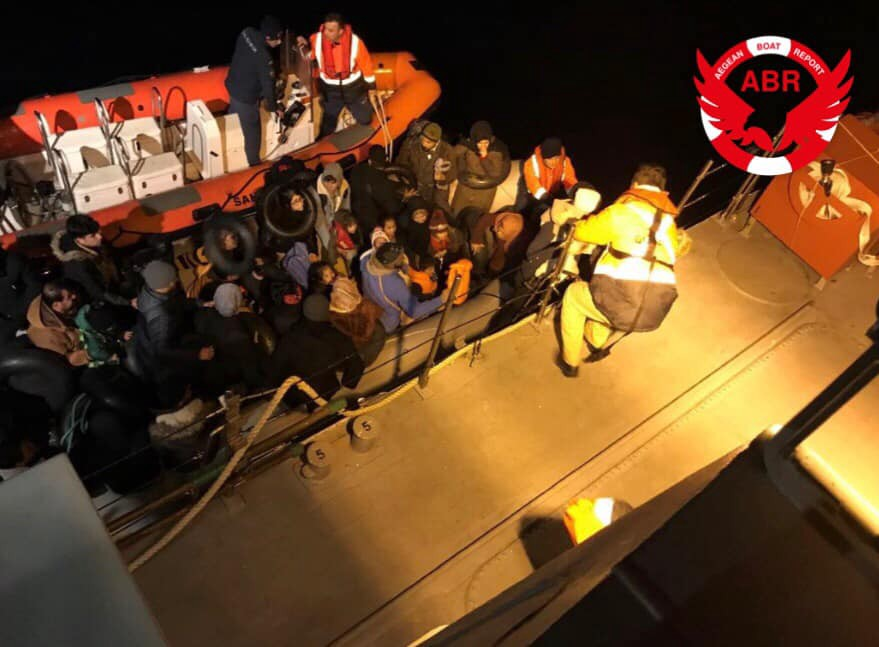
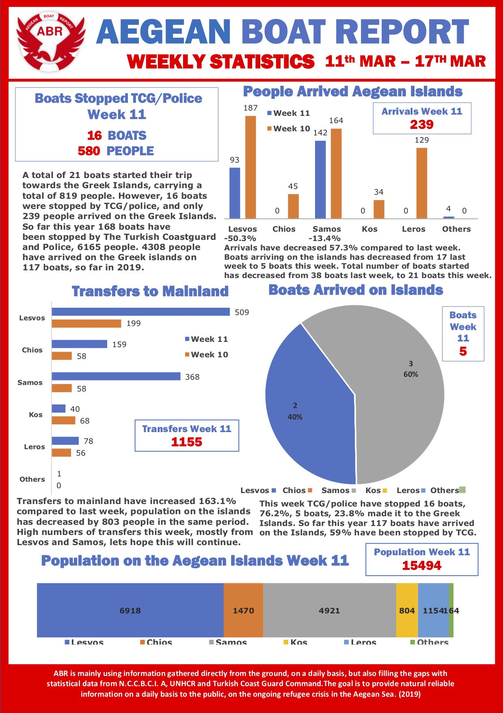

### AYS Daily Digest: 18/3/19: Hungary to teach Bosnia on how to protect borders

Bosnian government spreading fear and encourages hate speech toward people on the move // More people registered by volunteers in Serbia // UK statistics on asylum // MSF report on the 3rd year of the EU\-Turkey deal

People kicked out from the bus from Sarajevo to Bihac and left by the road in Velecevo, near Kljuc, Bosnia, with no help\. On Monday night, it was snowing and raining in Bosnia\. This family with kids stayed out in the open all night\. Photo by Red Cross Kljuc\.
### Feature

Dragan Mektić, Bosnian Minister of Security, announced the possibility that freedom of movement of people on the move will be even more restricted in the country\. He announced the possibility that in the near future measures could be introduced to limiting people residing in the camps from leaving in the evenings\.

At the moment, people living in existing camps — run by IOM — have to be in the camp before 6 pm, and it is not clear what this measure will mean in practice\.

Mektić also announced that the state will take over all camps from IOM soon, a measure many local and international human rights groups and individuals have called for on a number of occassions, including Amnesty International in their [latest report](https://www.amnesty.org/en/latest/news/2019/03/croatia-eu-complicit-in-violence-and-abuse-by-police-against-refugees-and-migrants/) \.

The Bosnian government considers what is happening in the country at the moment a security — rather than humanitarian — issue\. The proof can be found in the announcement that more police could be placed at the borders, but also the on\-going negotiations with the Hungarian government about an additional 100 to 150 police officers to help at the eastern border\.

Additionally, from the coordination meeting, a call was sent to the prosecution to engage more actively in processing people who’ve committed any type of crime in Bosnia\. Government and the media that are largely controlled by the political parties in the power are using every possibility to portray people on the move as a threat and as criminals, and this call seems to align with that purpose\.

While statistical data show that some of the people who came to Bosnia have committed crimes \(mostly minor, which is still not acceptable\), there is no proof that the level or gravity of crimes committed by refugees and migrants should be cause for alarm for citizens\.

At the same time, Bosnian police and the government continue to ignore the local laws and international obligation, which should be cause for alarm amongst citizens\. Big international organizations present in the country, like IOM or other UN agencies, are currently in charge of the well being of refugees and migrants in Bosnia, yet do little to nothing to fulfill their tasks or warn about all the irregularities and thus give a realistic picture of the situation\.

The best example is an ongoing situation, since October in Ključ area, in central Bosnia\. On Monday evening, another group of people \(19, including children\) were kicked out from the bus going from Sarajevo to Bihać and left by the road with no help\. Usually, local Red Cross and volunteers provide help\. They also call IOM, UNHCR, DRC and other organizations to help, and they come, but it takes them time, sometimes up to hours\. In the meantime, people are standing, sleeping, eating by the road\.

For families, big INGOs will find a way to take them to Bihać, but a single man, even if he’s a minor, will be forced or to go back or to find another way to the north\. So far, none of these organizations publicly condemn this practice, which appears to be further manifestation of hate and fear mongering; local people who showed huge solidarity so far are starting to fear refugees and migrants and being more reluctant to help\.

If single men find a way to reach Velika Kladuša or Bihać and camps in that area, they are not allowed to enter or recive any type of help\.

](assets/1976fd0e8465/1*9Ubge0gML4x5WZ6KOPWKjw.jpeg)

“In this tent of five people staying under the snow in front of the Bira camp in Bihać, I asked IOM to help them, but they said that they have no time, they don’t care about them and this is humanity in Europe\.” By [Bahman Mousalou](https://www.facebook.com/profile.php?id=100007866196589&__tn__=%2Cd%2AF%2AF-R&eid=ARD27dh7qwwj86I-jdBjJbin96238fjGG4rR2WU6JwOS6qWM4sYY6AlgslhnZOqtH8_Ku5b-JNYfWtiR&tn-str=%2AF&hc_location=group_dialog)

More and more international volunteers are coming, but luck of coordination with local networks is what is missing\. Additionally, it’s common that international volunteers present in the country are unaware of a difficult political situation or laws, or even international regulations, or consciously decide to ignore them\. Many \(not all\) are staying quiet about violation of basic human rights, while showing good intention to help\.

Since recently, AYS recived many reports \(mostly from victims themselves\) about violence and push\-backs from Bosnia\. The same trend is noticed by Info Park team in Belgrade who regularly encounters groups of people coming back from Bosnia\. This weekend, another group that claimed to be pushed back arrived\. Among them is a group of 15 persons from Kashmir who returned to Belgrade after they failed to cross into Bosnia\. Reportedly, they have experienced violence by Bosnian police, while their money and personal belongings were taken away from them\.

Due to unbearable living conditions in Bosnia, many people give up, for now, and go back to Serbia or even Greece\. Info Park team met during the weekend a 17\-year\-old boy from Tunisia who claimed to have returned from Bosnia after an unsuccessful attempt to continue further\. He expressed the intention to return to his country of origin\. Moreover, an Iranian family, consisting of two men, a woman, and a boy, returned to Belgrade after an unsuccessful attempt to cross into Bosnia\. In addition to this, Info Park identified another group of six persons from Pakistan, including one unaccompanied boy, who returned on their own will to Belgrade from Bosnia\. They stated unbearable living conditions in Bosnia and lack of feasible opportunities for providing a minimum living standards as the main reasons for their return\.

Unbearable living conditions are what shocked Italian journalist [Gabriele Proglio](https://www.facebook.com/gabriele.proglio?__tn__=%2CdlCH-R-R&eid=ARB7GRXRCi13NxQi3Xa_DycPMu4YpcIexXQq-noqTjfPcTm9PLmR6a4GkN5EyICgEYC4DlDC80J8tfbV&hc_ref=ART4F7oT2Lu7rCIvU5V2a9IUEvxQ0_VcP6gxzDcQZ_ro38pBfEkw5DnqD__NJt2yfY4&hc_location=group) while visiting camp Bira last week\.

Encouragingly, people do find a way to continue their journey, and at the moment, about 3,800 people are in the country \(over 25,000 entered since January 2018\) \.
### Sea

NGO ships saved at least 50 lives on Monday\. The [@RescueMed](http://twitter.com/RescueMed) team provided help for nine people on the Mare Jonio ship after they saved 49 people who were on board a sinking dinghy\.

People who were rescued were drifting on the sea for at least two days\. All of them were very tired with dehydration problems when rescued\.

The ship that saved them has an Italian flag and they officially requested disembarkment in Lampedusa\.

By ABR

NGOs engaged in sea rescue issued another call to Europe, “to demonstrate a sense of responsibility and solidarity\.”

■■■■■■■■■■■■■■ 
> **[MOAS](https://twitter.com/moas_eu) @ Twitter Says:** 

> > "Today, we call on Europe to demonstrate a sense of responsibility and #solidarity towards #migrants and #asylumseekers. We firmly believe that Europe must resume #SAR operations to combat #humantrafficking and ensure that maritime rescues are carried out as they should be." 

> **Tweeted at [2019-03-18 17:41:15](https://twitter.com/moas_eu/status/1107698491525074946).** 

■■■■■■■■■■■■■■ 

■■■■■■■■■■■■■■ 
> **[MOAS](https://twitter.com/moas_eu) @ Twitter Says:** 

> > "We condemn the criminalisation of solidarity &amp; obstruction of humanitarian action in the #Mediterranean. However, since NGOs are prevented from running #SAR operations, we hope EU institutions will seize this opportunity to reflect on their responsibilities." @[ReginaCatrambon](https://twitter.com/ReginaCatrambon) 

> **Tweeted at [2019-03-18 17:37:07](https://twitter.com/moas_eu/status/1107697451480334338).** 

■■■■■■■■■■■■■■ 

### Morocco

[Watch The Med — Alarmphone](https://www.facebook.com/…/a.15261827976…/2331859703754926/…) registered more reports about discrimination and violence against people on the move in Morocco\.

> “Alarm Phone Morocco and the Moroccan Association of Human Rights in Oujda reported of increasing arrests of mostly Sub\-Saharan migrants in several Moroccan cities\. This included an operation in Oujda on March 11, in which 81 people were arrested, including 7 minor children and 26 women\.” 

### Turkey

Turkish coast guard continues stopping and arresting people who are trying to reach Greece\. On Monday morning, one boat was stopped by outside Cesme\. The boat was heading towards Chios, and 54 people were arrested \(31 children, 12 women, and 11 men\) \.

On Saturday, the same thing happened with another boat with 38 people\.

All the people were arrested, AGR informs\.
### Greece

Aegean Boat Report recorded two boats landing on Monday, one outside Tsonia, Northern Lesvos, with 42 people, and another outside Nenita, Chios with 53 people\.

In their weekly report, they stress that many boats have been stopped by the Turkish coast guard and police — 16 boats altogether with 580 people arrested\.

At Samos, besides unbearable living conditions for the people in the overcrowded camp, people on the move have to deal with racism, too\. On Monday, the number of parents of kids at the local primary school kept their children away from classes to protest the admission of refugees\.

Parents made the decision to [boycott school last week](http://www.ekathimerini.com/.../samos-protest-against...) , and they plan to call parents around the island to do the same\.

Health\-Point Foundation needs dentists to fill urgent gaps in April, May and June\. Dentists need to have been qualified for two years to complete registration with the Greek health authorities\.

If you may be available for the dates above, please get in touch ASAP by email on [dental@healthpointfoundation\.org](mailto:dental@healthpointfoundation.org)

[Volve’s Irida Women’s Centre](https://www.facebook.com/groups/infopointfornortherngreecevolunteers/permalink/835484820131146/) will stop accepting new registrations on a daily basis for the following months starting this Wednesday, March 20, and will only accept new registrations every first Friday of each month\. However, specific protection cases will be dealt with individually and should be referred to us in advance to be able to consider them for registration outside the monthly registration schedule\.

[Call for female volunteers](https://www.facebook.com/groups/AthensVolunteersInformation/permalink/1645976605534630/) in Athens\.
### Serbia

INFO park registered over the weekend that Hungarian authorities prevented 93 persons from entering the country irregularly\. At the same time, their mobile team counted 622 people sleeping in the parks and street in central Belgrade, which is a significant increase since the last week\.
### BALKAN WEATHER

MONTENEGRO
Changeably cloudy with sunny intervals\. Before noon, local rain or showers with thicker clouds mostly in the southwest and west\. Wind weak to moderate blowing from the south; during the night, amplified northern wind\. Lowest temperatures from 2 to 13 and highest daily from 8 or 20 degrees\.
SERBIA
Clouds from the northwest spreading to the rest of the country causing a drop in temperatures and local rain\. Longer sunny intervals in the southeast\. Wind weak to moderate from the northwest; in the east, strong from time to time\. Lowest temperatures from 2 to 8 and highest daily from 9 to 18 degrees\.
BiH
Cloudy with rain in the lower parts of the country and snow in the higher regions\. Wind weak from the north and northwest\. Lowest temperatures from 1 to 11 and highest daily from 4 to 16 degrees\.
CROATIA
Predominantly cloudy with rain in the morning at some places, locally snow\. Showers with thunder in Dalmatia\. Wind will be moderate, from time to time strong, from the north and northeast\. Alongside the coast, moderate to strong Bura and southern wind turning to Bura\. Lowest temperatures from 0 to 12 and highest daily from 7 to 15 degrees\.
### France

On Sunday, 17 March, at 7:15 pm, some 60 people gathered in front of the Administrative Detention Center \(a prison for foreigners awaiting deportation\) from Lyon St Exupéry to support the hunger strike collectively initiated by detainees day before\.

[In their communique](https://rebellyon.info/Rassemblement-en-soutien-a-la-greve-…) , they declare to have, “no right with neither the policemen nor refugee forum \[association mandated to manage the CRA\] one is like animals\.”

Indeed, they denounce the physical and psychological violence exerted by the PAF \(police at the borders, in charge of maintaining the order of the detention centre\); the absence of essential care while being over\-medicated \(abusive distribution of anxiolytics such as valium, tercian …\); the infected and outdated food…
### UK

Asylum seekers made up around five percent of immigrants to the UK in 2018\. In 2018, 37,453 people applied for asylum\. This number has been roughly constant over the past five years and is substantially lower than in 2002 when the number of applications peaked at 103,000\.

If you have more questions about migration statistics in UK, see [lates report](https://commonslibrary.parliament.uk/insights/migration-statistics-how-many-asylum-seekers-and-refugees-are-there-in-the-uk/?fbclid=IwAR3a-6gfaezIY6hY3az9hvPYwVcCrtV7CjvshyqAS3PRaYrCLFA-6DhC3MM) \.

[The Bike Projects](https://thebikeproject.co.uk/?fbclid=IwAR3l_70fziCJIabmZZlrbwY2epnr4Zej7hPWvrsnnNXT13YXl2ILNgjWdrk) mission is simple: to get refugees cycling\. They get second\-hand bikes donated to them, fix them up and pass them on to refugees and asylum seekers\. A bike helps people access food banks, legal advice, healthcare, education and many other services without having to pay for the travel between them\. They also run cycle training for refugee women empowering them to take control of their own transport\. Since 2013, they have given away over 4000 bikes\. Check out more about what they do and get involved via [their website](https://thebikeproject.co.uk/?fbclid=IwAR3l_70fziCJIabmZZlrbwY2epnr4Zej7hPWvrsnnNXT13YXl2ILNgjWdrk) \.
### General

A new report, [“Distant Dreams — Understanding the aspirations of Afghan returnees](http://www.mixedmigration.org/resource/distant-dreams/) ,” by the Danish Refugee Council, shows that after Afghan migrants return to their home country, either due to pressure or being forced to return, they often suffer from depression, anxiety, isolation and stress\. These hardships make it difficult for the migrants to reintegrate and start a new life in Afghanistan, according to the report\.

“Our research shows that if people have returned due to pressure or force, they are often more traumatised and disillusioned about trying to establish a future for themselves in Afghanistan and more eager to attempt to migrate again,” said Bram Frouws, who heads the DRC’s Mixed Migration Centre\.

MSF issued an [report on the third anniversary of the EU\-Turkey](https://www.msf.org/eu-turkey-deal-continues-cycle-containment-and-despair-greece-refugees) deal which trapped of people on the move on Greek islands\.

> Médecins Sans Frontières calls on European leaders to take action to end the harmful policy of containment on the Greek island ‘hotspots’\. 

> MSF also urges the immediate evacuation of all vulnerable people, especially children, from these locations to suitable accommodation on the Greek mainland or in the other EU Member States\. 

**Apart from daily news in English, we also publish weekly summaries in [Arabic](%D9%85%D8%B9-%D8%B2%D9%8A%D8%A7%D8%AF%D8%A9-%D8%B9%D8%AF%D8%AF-%D8%A7%D9%84%D9%88%D8%A7%D9%81%D8%AF%D9%8A%D9%86-%D8%A5%D9%84%D9%89-%D8%A3%D9%88%D8%B1%D9%88%D8%A8%D8%A7-%D9%8A%D8%B1%D8%AA%D9%81%D8%B9-%D8%B9%D8%AF%D8%AF-%D8%B9%D9%85%D9%84%D9%8A%D8%A7%D8%AA-%D8%A7%D9%84%D8%B7%D8%B1%D8%AF-%D8%A3%D9%8A%D8%B6%D9%8B%D8%A7-f20d1e8f3229) and [Persian](%D8%A8%D8%A7-%D9%88%D8%B1%D9%88%D8%AF-%D8%A8%DB%8C%D8%B4%D8%AA%D8%B1-%D8%A8%D9%87-%D8%A7%D8%B1%D9%88%D9%BE%D8%A7-%D8%AA%D8%B9%D8%AF%D8%A7%D8%AF-%D8%A7%D8%AE%D8%B1%D8%A7%D8%AC-%D9%87%D8%A7-%D9%86%DB%8C%D8%B2-%D8%A7%D9%81%D8%B2%D8%A7%DB%8C%D8%B4-%D9%85%DB%8C-%DB%8C%D8%A7%D8%A8%D8%AF-5d4e3d41c7f6) \. Click on those links to check out the ones about the week from the 11th to the 17th of March\.**

**We strive to echo correct news from the ground through collaboration and fairness\. Every effort has been made to credit organizations and individuals with regard to the supply of information, video, and photo material \(in cases where the source wanted to be accredited\) \. Please notify us regarding corrections\.**

**If there’s anything you want to share or comment, contact us through Facebook or write to: areyousyrious@gmail\.com\.**

_Converted [Medium Post](https://medium.com/are-you-syrious/daily-digest-19-3-2019-hungary-to-teach-bosnia-on-how-to-protect-borders-1976fd0e8465) by [ZMediumToMarkdown](https://github.com/ZhgChgLi/ZMediumToMarkdown)._
