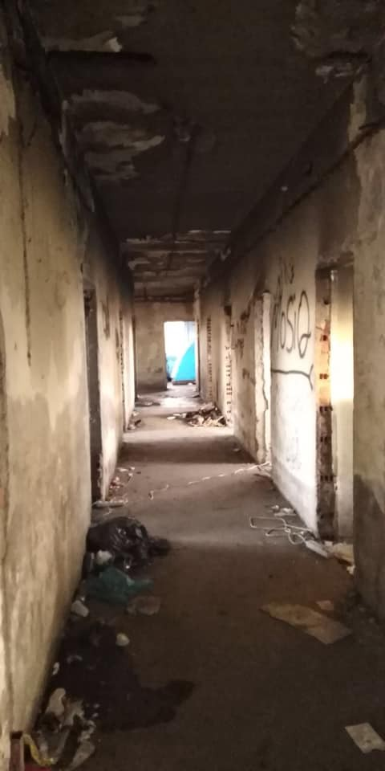
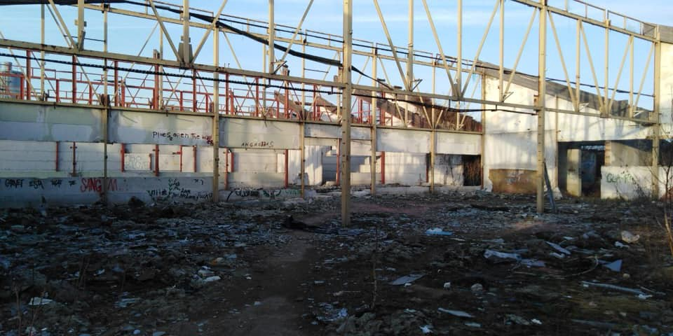
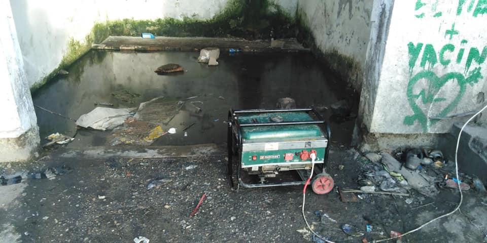
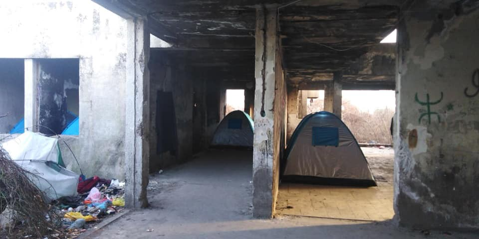
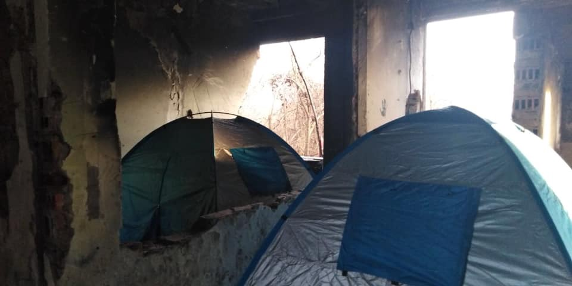
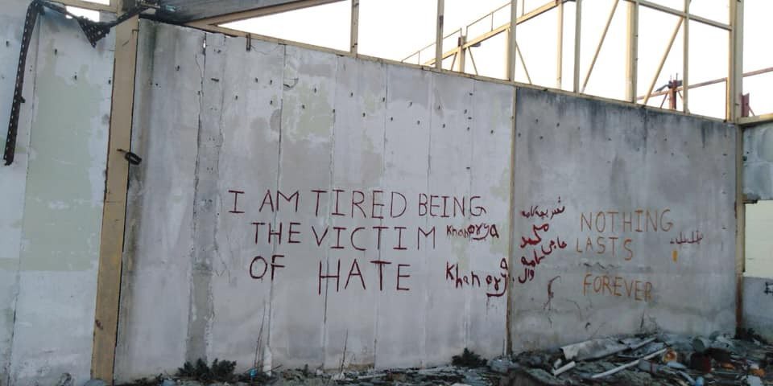
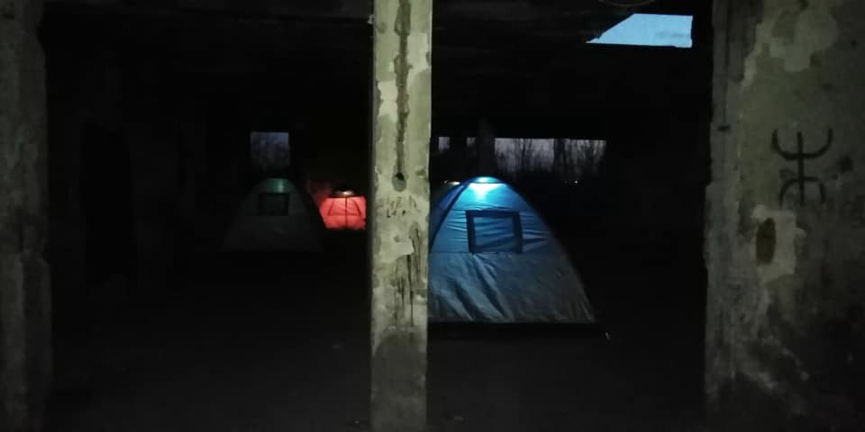

### AYS Daily Digest 19/3/19: Violence with the blessing of authorities
#### Racist attacks in Greece, even to children and minors, in several places — reportedly, the authorities aid the perpetrators / A boat with at least 44 people sunk off Libyan shore / Feature: AYS visited people on the move in Serbia / Can Germany deport people to poorer EU countries? / landing of a rescue vessel in Italy in spite Salvini/ and more news

Photo: AYS
#### FEATURE

Everyday image one can see in front of the squat in Šid, a Serbian small town bordering with Croatia that AYS visited, is that of frightened very young people ‘negotiating’ with a ‘taxist’ who might help them get away from there and reach a European country\. Still, some don’t have the means to afford themselves a ride, so they ride a short ride and walk through the woods the rest of the way\.

The squat usually sees about a hundred people staying, mostly minors, aged 14 to 19, mostly Afghans\. According to the volunteers who spoke to AYS, the locals are closed and unfriendly towards the people on the move and those helping them at the moment\.

Photo: AYS

Living conditions in the facility where the squat is are inhumane, undecent and simply unacceptable for anyone\. It looks like an improvised dump rather than a place to stay, everyone agrees\. It is filled parts of the old factory, now pilled up with rubish and faeces around the place\. There is no roof anywhere and people staying don’t have basic life amenities: no water, electricity, toilet, sewage, medical help\.

Photos: AYS

Some of the volunteers had organized a small power generator just so the mobile phones can charge and to use it for the few lamps they have there\. They also provided them with some tents and food for 2 meals a day that they prepare themselves on a provisional stove — when there is food, that is\. Most of the time there isn’t enough\. The only time they have a shower is when the volunteers manage to organize some improvised system for a one time shower \(with buckets, a hose or so\) \.

There are often police raids\. The last one was done so that the police came in at 5 a\.m\., loaded all the sleeping bags, personal belongings and tents where people were sleeping in, onto a truck \(rented by a private company\), drove it to a dump and burried in the ground\. That is one of the usual techniques used to destroy the little those people have\. Both people from the squat and the volunteers were taken to a precinct, questioned, intimidated and threatened\. They are often the target of threats and abuse\. Additionally, smugglers are all the time present around the place, threatening as well, hurting people and creating fear among these young people\. Reportedly, the personnel from the nearest reception camp comes in and calculates an estimated number of people in order to get them to the camp, even if the people do not want to leave\. Most of them return after being previously unwillingly taken to the camp\. They claim that in the squat at least they have **some** sort of freedom of movement and the volunteers seem to be the only people treating them in a decent manner\.

AYS volunteers spoke to at least 30 people and all of them said the same about their previous experience with the Croatian police, that they beat them, strip and hurt them, humiliate, intimidate and finally, pushed back Most of them had scars and bruises they pointed to, showing fresh signs of abuse\. 
Many are trapped there for months, some over half a year already\.

Photo: AYS

The worrying fact is that we realized from talking to them that they are not familiar with their basic rights, including the right to ask for international protection\. Some were not even aware Croatia was in the EU\. Therefore, it seems that, regardless of the time spent in the reception camps and contacts made so far, the real support is lacking\. The exhausted group of volunteers who have been helping them survive there are alone in this story and discriminated against, as the trend is all over the continent\.

They need help, support and donations — tents, sleeping bags and mats, blankets, disinfection gels, and other essentials\.

Photo: AYS
#### LIBYA

■■■■■■■■■■■■■■ 
> **[MSF Sea](https://twitter.com/MSF_Sea) @ Twitter Says:** 

> > Local sources in #Libya report that a boat carrying at least 44 people has sunk off the coast of #Sabratha. It's impossible to know how many other shipwrecks go unnoticed due to poor and insufficient search and rescue capacity in the #Mediterranean. 

> **Tweeted at [2019-03-19 11:49:10](https://twitter.com/msf_sea/status/1107972276140552192).** 

■■■■■■■■■■■■■■ 

At least 10 migrants died when their boat sank off the Libyan coast near the western town of Sabratha on Tuesday, a Libyan security official said\.

About 17 others were rescued, Aiman Dabbashi, Sabratha’s security operations spokesman, said\. A pregnant woman, along with a child, has been reported dead in the shipwreck, a member of the Red Crescent in Sabratha told local media\.

■■■■■■■■■■■■■■ 
> **[Flavio Di Giacomo](https://twitter.com/fladig) @ Twitter Says:** 

> > In 2019 about 1280 people departed from North Africa to Europe, and over 154 died at sea.
The death rate is impressive.

And another shipwreck happened today off the Libyan coast.

Saving lives at sea is an absolute necessity. Today more than ever. 

> **Tweeted at [2019-03-19 11:43:20](https://twitter.com/fladig/status/1107970807807033344).** 

■■■■■■■■■■■■■■ 

In the last seven months of “information blackout” on [m](https://www.facebook.com/hashtag/migrant?hc_location=ufi) igrant departures from [L](https://www.facebook.com/hashtag/libya?hc_location=ufi) ibya, we can say with certainty that at least 6,400 people have left\. Of these, at least 1,300 departed between January and February\. 75% were intercepted by the Libyan Coast Guard, MOAS reported\.
#### GREECE
### Racist attacks upheld by the authorities

Five refugee children from Afghanistan have been attacked by masked assailants near a reception facility in the town of **Konitsa** in northwestern Greece, [media](https://greece.greekreporter.com/2019/03/19/refugee-children-attacked-by-masked-men-in-greece/?fbclid=IwAR27Ofs320PMafrzlOVu4P_Rgog3X_1GPviC9nU7Pg5du9fLx6ZVLma1IRk) have reported\. This worrying incident is unfortunately not an isolated event\.

An attack happened at a hotel hosting refugees at Vilia, in **Attika** \. The mayor allegedly participated at a racist gathering that occurred at the city council\. Some said they will repeat threats and mobilizations\. Many Greeks speak of it as a disgrace\. Reportedly, the ex mayor supported by the right wing New Democracy party, declared that he supports those protesting against refugees\.

On the island of **Salamina** , there were 2 documented arrests of fascists who were reportedly connected to the fascist group Golden Dawn\. It was the second attack against the same Pakistani immigrants, but the previous time the Greek police did not arrest them, as they ignored the Pakistani’s report on the event\. According to t [hese accounts](https://l.facebook.com/l.php?u=https%3A%2F%2Fwww.alfavita.gr%2Fkoinonia%2F283867_salamina-gnostos-stin-astynomia-hrysaygitis-o-enas-apo-toys-drastes-poy%3Ffbclid%3DIwAR317eTCOJLTJMgi8rDYVjf7M4MRdYGYP6UhE1pOo4qjGFpnZK3CM4mhgzc&h=AT3CtebjW1bVu1mpuaiT2hUniYoxXAC7gQ4ZbQPSKlQ-D7fn2BouS-4NOjFEg5fcao__JadakZO9OKRXLtjguJ4ZHv3dUCl6hgJy8JvduwKBdrYzgIbk09ki22HpnwHq_Q) , the policemen tried to threaten them not to sue the alleged fascists, and the arrests happened only after the case reached the police department in charge of racist attacks, Greece sources report\.

■■■■■■■■■■■■■■ 
> **[Aegean Boat Report](https://twitter.com/ABoatReport) @ Twitter Says:** 

> > Two boats have so far arrived on the Greek islands, 82 people.

First boat was picked up outside Tsonia, Lesvos north east 03.30.
16 people 
8 children 
3 women 
5 men

Second boat arrived on Samos at first light.
66 people 
No further information available. 

> **Tweeted at [2019-03-19 09:52:57](https://twitter.com/boataegean/status/1107943028193411072).** 

■■■■■■■■■■■■■■ 

#### BALKAN WEATHER forecast for March 20

Montenegro:

Partly cloudy with sunny periods, and in the north moderate to heavy rain\. The wind is moderate to stronger, north and north\-east\. Morning air temperature 0 to 12, highest day temperature 5 to 22 degrees\.
Podgorica: Cloudy with sunny periods\. Occasionally it will span between a moderately to a stronger, northeasterly wind\. Morning air temperature is about 10, highest daily to 20 degrees\.

Serbia: 
9\. Wednesday Moderate to cloudy and dry\. In the morning and in the afternoon, several sunny periods in the south, and later in the afternoon in the north of Serbia\. The wind is weak to moderate, in the north of Vojvodina, and in the mountains is strong, to the north and northwest\. The lowest temperature is from 2 to 8, and the highest is from 10 to 16 degrees\.

BiH: 
Tomorrow, mostly cloudy weather is expected\. In the morning and throughout, in the central, eastern, western and partly northern regions of Bosnia, a rain or drizzle\. Wind in Bosnia is weak to moderate northeast, and in Herzegovina moderately stormy\. Morning temperatures range from \-1 to 5, in the south from 5 to 10, and daily from 6 to 12, in the south of 14 to 19 ° C\.

Mostly cloudy weather in Sarajevo\. In the morning and during the afternoon with a low rainfall or a drizzle\. Morning temperature around 2, and daily around 7 ° C

Croatia:

Partly sunny and slightly warmer along the coast, although windy\. Morning in the east and south of the country will be with several clouds, and in the afternoon, sunny everywhere\. There could be some snow in the mountains, and in Dalmatia mostly rain in the morning\. The wind is a weak to moderate northerly, along the coast of moderate and strong burrs with storms, at the foot of the Velebit mountains\. Morning temperatures from \-1 to 4, mostly in the Adriatic from 5 to 10, and the highest daily between 10 and 15 ° C, in the colder climates\.
#### ITALY
### Another rescue boat criminalized in Italy

Mare Jonio, an Italian vessel run by an Italian, rescued people who were sure to drown or be pushed back into torture detention centres in Libya\. 
However, the official Italy didn’t initially accept it and refused its landing\. Mr Salvini said that “like other ships before it, has rescued people in the designated Libyan search and rescue region\. This [means](https://www.infomigrants.net/en/post/15794/mare-jonio-saving-humans-and-sailing-into-a-stand-off-with-the-italian-government?fbclid=IwAR1wBZuKctcQ4x_r0F6aCFUnQSKNxfkPDNyRooC7n754QeQ_v0BAe1skTpc) that they should follow Libyan directives and disembark anyone rescued in the nearest safe port”\. Naturally, all organisations in their sane mind and with available information argue that human rights are repeatedly being violated in Libyan detention centers, both official and unofficial ones and that people should not be sent back there\. Therefore, they insisted on the vessel being allowed to land in Italy, where the usual disparities between the local and national governments still persist in this issue\.

The infamous Italian minister is arguing national security to deny access to Italian territorial waters and ports\.

■■■■■■■■■■■■■■ 
> **[Giorgia Orlandi](https://twitter.com/giorgiaorlandi_) @ Twitter Says:** 

> > Hours after Italian Charity ship #mareIonio rescued 49 migrants off the coast of #Libya #salvini releases directive to sanction NGOs that enter Ita waters refusing to bring migrants back to Libya contradicting  #UN abuse report. He requested authorities “to arrest” staff on board 

> **Tweeted at [2019-03-19 14:03:34](https://twitter.com/giorgiaorlandi_/status/1108006099305799680).** 

■■■■■■■■■■■■■■ 

■■■■■■■■■■■■■■ 
> **[Matteo de Bellis](https://twitter.com/matteodebellis) @ Twitter Says:** 

> > Yesterday the Italian Minister of Interior adopted a Directive to justify refusal to offer disembarkation to people rescued in the Med. Here a short thread with initial thoughts. [interno.gov.it/sites/default/…](http://www.interno.gov.it/sites/default/files/direttiva_ministro_su_controllo_frontiere_marittime_18.03.2019.pdf) 1/5 

> **Tweeted at [2019-03-19 13:04:48](https://twitter.com/matteodebellis/status/1107991311636934656).** 

■■■■■■■■■■■■■■ 

Even Vincent Cochetel of the UNHCR repeatedly said: Italy’s Salvini lays down law for migrant rescue ships\. But maritime law is clear\. Libya is not a place of safety \(Maritime Safety Committee, 167 \(78\) \. Italy and other Med countries are places of safety\.

Ultimately:

■■■■■■■■■■■■■■ 
> **[Sergio Scandura](https://twitter.com/scandura) @ Twitter Says:** 

> > #migranti UPDATE/8 via Radio Radicale 20:38 🔴 

ITALIA PAESE MEMBRO UE E DEL G7?

GIORNALISTI TENUTI FUORI DALL'AREA, DIETRO LA RETE DI RECINZIONE, CONFINATI.

LE IMMAGINI DELLO SBARCO DEI #MIGRANTI DA #MAREJONIO, DAL TELEFONINO DEL DEPUTATO PALAZZOTTO.

[twitter.com/EPalazzotto/st…](https://twitter.com/EPalazzotto/status/1108084854422491136) https://t.co/S80sNA90wk 

> **Tweeted at [2019-03-19 19:48:45](https://twitter.com/scandura/status/1108092968697819136).** 

■■■■■■■■■■■■■■ 

#### SPAIN

■■■■■■■■■■■■■■ 
> **[ACNUR España](https://twitter.com/ACNURspain) @ Twitter Says:** 

> > Semana 11 (11 al 17 de marzo), llegadas marítimas y terrestres a España [ow.ly/rKVw30o6s0W](http://ow.ly/rKVw30o6s0W) https://t.co/secU3Nc0Vw 

> **Tweeted at [2019-03-19 13:45:11](https://twitter.com/acnurspain/status/1108001471352766465).** 

■■■■■■■■■■■■■■ 

#### GERMANY
### Is Germany eligible to deport refugees to EU countries with poor living conditions?

According to the EU’s highest court — yes\. Exceptions apply only in extreme cases, cases of extreme poverty such is not expected to be inflicted upon an individual in any of the EU member state countries, supposedly\.

> An asylum seeker may be transferred to the Member State that is normally responsible for processing his application or that has previously granted him subsidiary protection unless the expected living conditions in that Member State of those granted international protection would expose him to a situation of extreme material poverty, contrary to the prohibition of inhuman or degrading treatment\. 

> Inadequacies in the social system of the Member State concerned do not warrant, in and of themselves, the conclusion that there is a risk of such treatment\. 

The Court concluded that EU law does not preclude the transfer of an applicant for international protection to the Member State responsible or the rejection of an application for the grant of refugee status as being inadmissible on the ground that the applicant has been previously granted subsidiary protection by another Member State, unless it is established that the applicant would, in that other Member State, be in a situation of extreme material poverty, irrespective of his wishes and personal choices\.

See details: [**here**](https://curia.europa.eu/jcms/upload/docs/application/pdf/2019-03/cp190033en.pdf) \.
### **Protest and intervention in Nuremberg\-Gostenhof**

An incident occurred during a planned deportation, that we wrote about earlier, as the police cordoned off the area around the Austraße in Nurmberg\.
A young Afghan whose deportation was about to be proceeded defied the police and tried to run away, while about 30 people protested the deportation, according to the German [media](http://www.nordbayern.de/region/nuernberg/geplante-abschiebung-sorgt-fur-sek-einsatz-in-gostenhof-1.8715975?fbclid=IwAR2CjfMRW-a4vF8jTg7CO1wHVCr22GEqNhu3V61nRL4RZ_-IAi8dqSZtl4Y) \. However, he was eventually apprehended and taken away\.

On the other hand, the [Bavarian Refugee Council](https://www.fluechtlingsrat-bayern.de/wir-ueber-uns.html) state this about the young man:

> Jan Ali H\. and his family participated in a week\-long protests campaign by refugees in Nuremberg in 2015\. His father was killed by the Taliban, he, his seriously ill mother, and his two siblings fled together to Germany, where they have been living since 2010 — long since as tolerated refugees\. Jan Ali H\. graduated from high school and is currently attending evening secondary school and is expected to graduate in June 2019\. Due to the long\-term lack of prospects, Jan Ali H\. has developed a depression and is suicidal\. 

**Apart from daily news in English, we also publish weekly summaries in [Arabic](%D9%85%D8%B9-%D8%B2%D9%8A%D8%A7%D8%AF%D8%A9-%D8%B9%D8%AF%D8%AF-%D8%A7%D9%84%D9%88%D8%A7%D9%81%D8%AF%D9%8A%D9%86-%D8%A5%D9%84%D9%89-%D8%A3%D9%88%D8%B1%D9%88%D8%A8%D8%A7-%D9%8A%D8%B1%D8%AA%D9%81%D8%B9-%D8%B9%D8%AF%D8%AF-%D8%B9%D9%85%D9%84%D9%8A%D8%A7%D8%AA-%D8%A7%D9%84%D8%B7%D8%B1%D8%AF-%D8%A3%D9%8A%D8%B6%D9%8B%D8%A7-f20d1e8f3229) and [Persian](%D8%A8%D8%A7-%D9%88%D8%B1%D9%88%D8%AF-%D8%A8%DB%8C%D8%B4%D8%AA%D8%B1-%D8%A8%D9%87-%D8%A7%D8%B1%D9%88%D9%BE%D8%A7-%D8%AA%D8%B9%D8%AF%D8%A7%D8%AF-%D8%A7%D8%AE%D8%B1%D8%A7%D8%AC-%D9%87%D8%A7-%D9%86%DB%8C%D8%B2-%D8%A7%D9%81%D8%B2%D8%A7%DB%8C%D8%B4-%D9%85%DB%8C-%DB%8C%D8%A7%D8%A8%D8%AF-5d4e3d41c7f6) \. Click on those links to check out the ones about the week from the 11th to the 17th of March\.**

**We strive to echo correct news from the ground through collaboration and fairness\. Every effort has been made to credit organizations and individuals with regard to the supply of information, video, and photo material \(in cases where the source wanted to be accredited\) \. Please notify us regarding corrections\.**

**If there’s anything you want to share or comment, contact us through Facebook or write to: areyousyrious@gmail\.com\.**

_Converted [Medium Post](https://medium.com/are-you-syrious/ays-daily-digest-19-3-19-violence-with-the-blessing-of-authorities-cc8216fd5ea) by [ZMediumToMarkdown](https://github.com/ZhgChgLi/ZMediumToMarkdown)._
