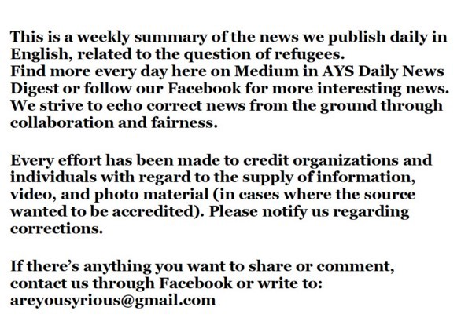

### با ورود بیشتر به اروپا، تعداد اخراج ها نیز افزایش می یابد
#### AYS Weekly News Summary in Persian, March 11–17

 \)](assets/5d4e3d41c7f6/1*W3cauJrZ7HDpuCDzQGkdWQ.jpeg)

Ključ, BiH by [Crveni Križ Općine Ključ](https://www.facebook.com/profile.php?id=100009318317491&__tn__=%2CdlC-R-R&eid=ARC0xZksQoizmI6jEFBjfbJgqUrIyYFpy-cPLS5PoIw_ImAR91S6k0F14Em0feB0BkXh6uHTZuZOwy8b&hc_ref=ART0idDSQP1XSR1wz8rx9_byyVWCXMSxgYWQJwErZ3Ow0050ZCFCdrv17eESPtk24ks) \)
### ترکیه

پس از اینکه ترکیه دوباره تهدید کرد مرز خود را برای پناهندگان باز خواهد کرد که هدف آن رسیدن به اتحادیه اروپا است , بروکسل انتقال یک کمک بلاعوض دیگر برای سوری‌ها در این کشور را اعلام کرد

> فرمانده سیاست خارجی اتحادیه اروپا گفت : “ من می‌خواهم تایید کنم که یک میلیارد یورو کمک یورو برای سوری‌ها در ترکیه انتقال خواهیم داد 

این امر در آغاز کنفرانسی در سوریه توسط اتحادیه اروپا و سازمان ملل در بروکسل اعلام شد

ترکیه میزبان بیش از ۳\.۵ میلیون پناهنده سوری , بیش از هر کشور دیگری در جهان است

حمایت مالی به ترکیه بخشی از قرارداد به اصطلاح اتحادیه اروپا — ترکیه است که در ماه مارس ۲۰۱۶ امضا شد که مرزهای اروپا را مهر و موم کرد و سفر را برای همه مردم در مهاجرت سخت‌تر کرد

اتحادیه اروپا موظف است تا ۶ بیلیون یورو به ترکیه کمک مالی بپردازد \. این توافقنامه همچنین تسریع مذاکرات الحاق اروپا و سفر بدون ویزا برای شهروندان خود را پیش‌بینی می‌کند
### مونته نگرو

تعداد افرادی که از میان مونته نگرو گذر می‌کنند نیز در حال افزایش است و همچنین از گفتار و ترس و وحشت در رسانه‌های محلی نفرت دارند \. همانند دیگر کشورها ، رسانه‌ها مردم را به حرکت به سمت تقریبا ً هر چیز بدی که در حال رخ دادن است متهم می‌کنند و می‌گویند که مردم از پناهندگان و مهاجران می‌ترسند \. آن‌ها اغلب از عبارت “ مهاجران غیرقانونی “ استفاده می‌کنند که این تبعیض‌آمیز است

هر روز ده‌ها نفر در پلیولیا ، منطقه مرزی مونته نگرو ، به سمت بوسنی حرکت می‌کنند \. عکس : بونا فیده

براساس آمار رسمی ، در طی سال ۲۰۱۸ تعداد ۴\.۵۷۰ نفر در مرکز پناهندگی در اسپوز ثبت‌نام کرده‌اند\. افرادی که بیش از چند روز در آنجا هستند مستحق دریافت کمک‌های مادی از سوی دولت هستند که ۵۵ یورو را برای هر فرد واحد و یا ۱۲۶ یورو برای یک خانواده پنج ‌نفره شامل می‌شود

در پایان سال گذشته ، سازمان آی\.ا\.ام شروع به ساخت یک مرکز ترانزیت دیگر در بزای در نزدیکی مرز بوسنی کرد
### صربستان

گروه نظارت بر خشونت مرزی گزارش می‌دهد که در حدود ۲۴\.۲\.۲۰۱۹ نوجوان ۱۳ تا ۱۵ ساله با استفاده از خشونت فیزیکی از مجارستان به صربستان بازگشته اند : کتک زدن، لگد زدن، کتک زدن با چماق ، ریختن آب سرد ؛ خشونت روانی انجام شده : و برای دیدن بیشتر اینجا را کلیک کنید
### بوسنی

تعداد از افرادی که در مسیر خود به سوی اتحادیه اروپا هستند ، دوباره در حال افزایش است \. براساس آمار رسمی ، در سال جاری بیش از 2,500 نفر وارد این کشور شده‌اند \. بسیاری از آن‌ها از یونان از طریق آلبانی و مونته نگرو ، یا از طریق کوزوو ، مقدونیه و صربستان می‌آیند

در عین حال ، بسیاری از مردم در حال جابه جایی هستند و تخمین می‌زنند که در حال حاضر در حدود 3,900 نفر در این کشور هستند \( بیش از ۲۴\.۰۰۰ نفر در سال ۲۰۱۸ وارد این کشور شدند \) \. با این حال ، این اعداد حتی با وجود اینکه از منابع رسمی می‌آیند ، قابل‌اعتماد نیستند \. هنوز مشکل روند ثبت‌نام و دسترسی به پناه‌گاه و همچنین دیپورت های درون مرزی است

ایست بازرسی در کلوس ، از سارایوو تا بیهاچ \. پلیس محلی اتوبوس‌ها را در این مسیر متوقف می‌کند و مردم را بیرون می‌اندازد و آن‌ها را در جاده رها می‌کند \. این کمک توسط داوطلبان صلیب‌سرخ محلی ارائه می‌شود \. عکس از صلیب‌سرخ

از ابتدای سال جاری ، آر\.یو\.س چندین گزارش درباره خشونت پلیس در داخل بوسنی از جمله گزارش‌هایی از ولیکا کلادوشا و اخیرا ً مستار دریافت کرده‌است \. ظاهرا ً پلیس محلی به طور تصادفی مردم را در خیابان‌ها متوقف می‌کند و آن‌ها را به محلی می‌برد که در آنجا آن‌ها را کتک می‌زنند ، از قبیل پاسگاه‌های پلیس و یا فقط مناطق مخفی در شهرها

 \-Photo](assets/5d4e3d41c7f6/1*USBAhlqjfPvRNBXk8WwwYw.jpeg)

[Sanella Lepirica](https://www.facebook.com/sanela.lepirica?__tn__=%2Cd%2AF%2AF-R&eid=ARB_I5mUi8o0vZYp7fZoFvYmeyzItOB6kbyu7LYftvvKQMN68f8ZO5DFOwnyXNI5VulXK91qv5IhDWgF&tn-str=%2AF) \-Photo
### کرواسی

سخنگوی کمیسیون اروپا به طور مبهم به گزارش بین‌المللی عفو بین‌الملل در مورد خشونت‌های مرزی که توسط مقامات کرواسی انجام شده‌است , واکنش نشان می‌دهد

آن‌ها انتظار دارند که کرواسی از این ادعاها پیروی کند و به نظارت بر وضعیت \( هر چیزی که بدان معنی است\) ادامه دهد \. اظهارات کامل را می‌توان در اینجا یافت , گرچه واقعا ً ارزش دید

### ایتالیا

بین ماه‌های مارس و اوایل ماه مارس, دو تن از مردم از ابتدای سال وارد ایتالیا شدند \. صد و پنجاه نفر کشته یا مفقود شده بودند
### فرانسه

پنج سازمان برای محکوم کردن و اعتراض به جرم‌انگاری توسط مقامات فرانسوی در مرز فرانسه — ایتالیایی فعالان که کمک می‌کنند , آمده‌اند \. این یک خطر جدی برای مردم در حال حرکت به خاطر زمین کوهستانی است

سازمان‌های بین‌المللی , پزشکان بدون‌مرز و پزشکان بدون‌مرز و پزشکان بدون‌مرز از جمله سازمان‌های عفو بین‌الملل هستند

> وضعیت بدتر می‌شود زیرا مرز بطور فزاینده‌ای کنترل می‌شود \. پلیس هر شب گشت زنی می‌کند و مهاجران را مجبور می‌کند بدون اینکه بتوانند ادعای حق پناهندگی کنند , به ایتالیا بازگردند \. در نتیجه تبعید شدگان خطرات بیشتری برای فرار دارند 

### آلمان

Bayerischer Fluchtlingsrat گزارش می‌دهد که دلایلی وجود دارد مبنی بر این که انتظار می‌رود دیپورت بعدی به افغانستان در آغاز هفته ی آینده رخ دهد \.

ما هنوز تاریخ دقیقی نداریم ، اما حدس می‌زنیم که یک پرواز در روز دوشنبه ، ۱۸ مارس یا سه‌شنبه ، ۱۹ مارس رخ خواهد داد \. اطلاعات مربوط به پرواز هنوز در دسترس نیست \. ما به همه افغان‌ها توصیه می‌کنیم که به یک مرکز مشاوره یا یک وکیل بازدید کنند

اطلاعات بیشتر را در اینجا پیدا کنید
### انگلستان

دادگاه عالی دستور داد که تاکتیک “ هیچ هشداری “ که توسط مقامات مهاجرتی به کار گرفته شده‌بود فورا ً متوقف شد و حذف ۶۹ نفر مهاجرت برنامه‌ریزی‌شده حذف شد

گفته می‌شود که بسیاری از خانواده‌های نومید این پول را رد کرده‌اند که آن‌ها مستحق ترک “ شهر مجاز “ خود هستند \. علاوه بر این, در بریتانیا , پناهجویان تنها مجاز به کار در مشاغلی هستند که در لیست مشاغل کمبود بریتانیا قرار دارند \. این مشاغل در زمینه‌های بسیار تخصصی مانند رقاصان باله هستند
### دانمارک

اداره مهاجرت دانمارک اعلام کرد که مجوز اقامت پناهندگان سوری را از دمشق در اواخر فوریه آغاز خواهد کرد \. مقامات اشاره می‌کنند که وضعیت امنیتی در شهر بهبود یافته‌است و بسیاری از مردم به جای دلایل شخصی برای گرفتن پناهندگی از “ وضعیت عمومی “ در سوریه پناهندگی گرفته‌اند

با این حال ، سوریه : استناد مستقیم

متخصصان هشدار می‌دهند که تغییر سیاست خدمات مهاجرت ، دانمارک را به اولین کشور اروپایی تبدیل می‌کند که حتی شروع به فکر کردن به بازگشت ناخواسته سوریه می‌کند — که بیشتر کشورهای اروپایی برای پناهندگان غیرقابل‌تحمل هستند … هزاران سوری در سراسر دانمارک از آینده ی نامطمئن نومید شده‌اند

شبکه TV۲ این کشور در سراسر این هفته یک مجموعه از ویژگی‌ها را اجرا می‌کند که بر زندان مانند الباعک تمرکز دارد \. طی گزارشی از سه‌شنبه ، کشیش محلی تا ۱۰ سال توضیح می‌دهد که چگونه شاهد اثرات مخرب فزاینده‌ای از بازداشت انسان‌ها در الباعک بوده‌است \. ویدئو را اینجا ببینید

دانمارک با انگیزه برای خروج از کشور به خانواده جداگانه خود ادامه می‌دهد

**اخبار بیشتری به انگلیسی در صفحه رسانه ما در دسترس است \. در مواردی که شما سوالاتی دارید و یا مایلید برخی اطلاعات مربوط به روند پناهندگی شما یا کشور مورد نظر را منتشر کنید , لطفا ً برای نوشتن پیغام روی فیس بوک یا نوشتن یک ایمیل به آر\.یو\.س تردید نکنید**

[**areyousyrious@gmail\.com**](mailto:areyousyrious@gmail.com)

_Converted [Medium Post](https://medium.com/are-you-syrious/%D8%A8%D8%A7-%D9%88%D8%B1%D9%88%D8%AF-%D8%A8%DB%8C%D8%B4%D8%AA%D8%B1-%D8%A8%D9%87-%D8%A7%D8%B1%D9%88%D9%BE%D8%A7-%D8%AA%D8%B9%D8%AF%D8%A7%D8%AF-%D8%A7%D8%AE%D8%B1%D8%A7%D8%AC-%D9%87%D8%A7-%D9%86%DB%8C%D8%B2-%D8%A7%D9%81%D8%B2%D8%A7%DB%8C%D8%B4-%D9%85%DB%8C-%DB%8C%D8%A7%D8%A8%D8%AF-5d4e3d41c7f6) by [ZMediumToMarkdown](https://github.com/ZhgChgLi/ZMediumToMarkdown)._
