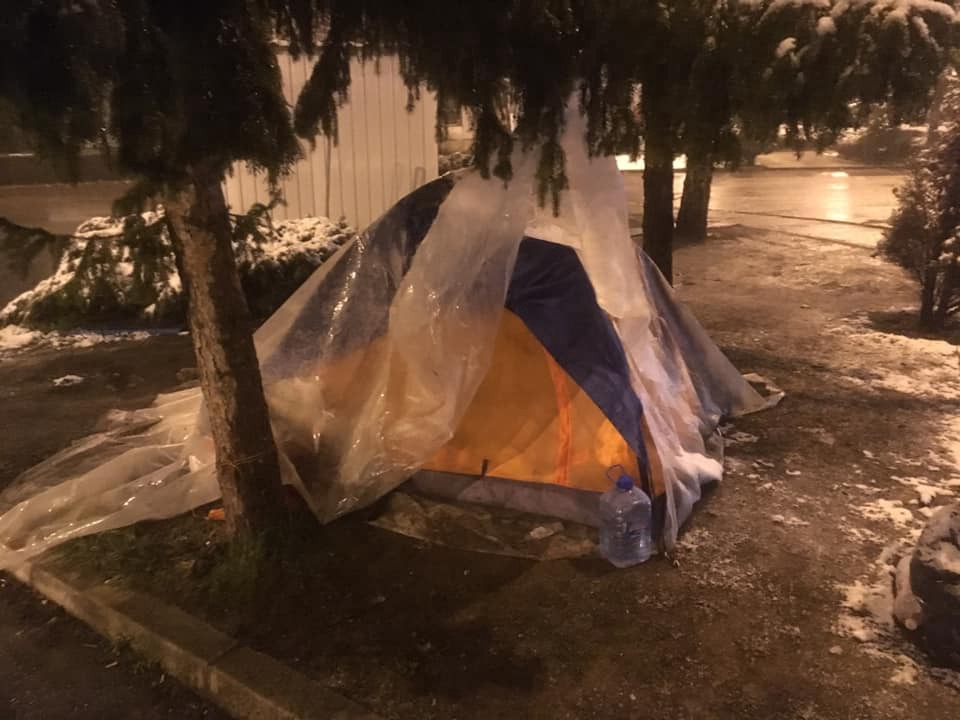

### آلمان و بعضی کشورهای دیگر میتوانند پناهندگان را به کشورهای ضعیف تر عضو اتحادیه برگردانند
#### AYS Weekly News Summary in Persian, March 18–24

](assets/154b61d8f8e0/1*yDyfgaHQ3-S2kX08JK1yRg.jpeg)

[MEDU — Medici per i Diritti Umani](https://www.facebook.com/MEDUonlus/?__tn__=%2CdkCH-R-R&eid=ARBwmfM3ziMCJmMx1hS_BWCFXt60_DryIbqrXrCUtVdkwPVtZb0ZCzKFLIu81v3caSIG7odxy3B6XVRU&hc_ref=ARQAZlJryAxE_VsajT22vNmigT77JFds7sZq2DoDxFIDOjZEktjoAhVB4KKWuJ54oC8&fref=nf)
### **عمومی**

یک گزارش جدید، رویاهای دوردست _—_ **درک اهداف آوارگان افغان** _”_ توسط شورای پناهندگان دانمارک نشان می‌دهد که پس از بازگشت مهاجران افغان به کشورشان، یا به دلیل فشار یا اجبار به بازگشت، اغلب از افسردگی، اضطراب، انزوا و استرس رنج می‌برند _\._ براساس این گزارش، این دشواری‌ها برای مهاجران دشوار است تا بازگشت شوند و در بازگشت زندگی جدید در افغانستان را آغاز کنند _\._

برام فراس که ریاست مرکز مهاجرت ترکیبی جمهوری دموکراتیک کنگو را برعهده دارد گفت _:_ تحقیقات ما نشان می‌دهد که اگر مردم به دلیل فشار یا زور به کشور بازگشته اند، در تلاش برای ایجاد آینده‌ای برای خود در افغانستان و اشتیاق بیشتر برای مهاجرت مجدد هستند _\._
### **مراکش**

_Watch Med — Alarmphone_ گزارش‌های بیشتری درباره تبعیض و خشونت علیه مردم در مهاجرت در مراکش ثبت کرد _\._

هشدار به مراکش و انجمن حقوق بشر مراکش در اووجدا، از افزایش دستگیری‌های بیشتر مهاجران جنوب صحرای آفریقا در چندین شهر مراکش خبر داد _\._ این عملیات شامل عملیاتی در _Oujda_ در ۱۱ مارس بود که در آن ۸۱ تن از جمله ۷ کودک خردسال و ۲۶ زن دستگیر شدند _\._
### **ترکیه**

گارد ساحلیه ترکیه به توقف و دستگیری افرادی ادامه می‌دهد که تلاش می‌کنند به یونان برسند _\._ صبح روز دوشنبه، یک قایق در خارج از _Cesme_ متوقف شد _\._ قایق به سمت چیوس می‌رفت و ۵۴ نفر بازداشت شدند ۳۱ کودک، ۱۲ زن و ۱۱ مر

روز شنبه، همان اتفاق با قایق دیگری با ۳۸ نفر اتفاق افتاد _\._

_AGR_ اطلاع می‌دهد که همه افراد دستگیر شده‌اند _\._
### **دریا**

کشتی‌های غیر دولتی حداقل ۵۰ تن را در روز دوشنبه نجات دادند _\._ گروه _“RescueMed”_ پس از نجات ۴۹ نفر که سوار قایق پارویی در حال غرق شدن بودند، به نه نفر در کشتی دریای ماره کمک کرد _\._

مردمی که نجات داده شده‌ بودند حداقل به مدت دو روز در دریا شناور بودند _\._ همه ی آن‌ها در هنگام نجات از مشکلات بسیار خسته بودند _\._

این کشتی که آن‌ها را نجات داد یک پرچم ایتالیا دارد و آن‌ها رسما از مهاجرت در _Lampedusa_ درخواست کرده‌اند _\._

■■■■■■■■■■■■■■ 
> **[Sea-Watch International](https://twitter.com/seawatch_intl) @ Twitter Says:** 

> > “Myself and the crew would like to deliver a strong message of support to captain Pietro of #MareJonio for doing the right thing and for rescuing people at sea, getting them to a safe place”.

Captain Joe, #SeaWatch3

@[RescueMed](https://twitter.com/RescueMed) #United4Med https://t.co/NpFLmS7GTq 

> **Tweeted at [2019-03-22 16:11:53](https://twitter.com/seawatch_intl/status/1109125553720885257).** 

■■■■■■■■■■■■■■ 

### **یونان**

در گزارش هفتگی خود، آن‌ها تاکید کردند که قایق‌های بسیاری توسط نگهبانان ساحلی ترکیه و قایق‌های پلیس _—_ ۱۶ قایق متوقف‌شده و ۵۸۰ نفر دستگیر شده‌اند _\._

در ساموس، علاوه بر شرایط زندگی غیرقابل‌تحمل برای مردم در اردوگاه شلوغ هم هستند

](assets/154b61d8f8e0/1*zDouLmlEitgEFqbpWCZtpg.jpeg)

، [https://www\.facebook\.com/AegeanBoatReport/](https://www.facebook.com/AegeanBoatReport/)

### **صربستان**

پارک اطلاعات در آخر هفته ثبت شد و مقامات مجارستان از ورود ۹۳ نفر به کشور به طور نامنظم جلوگیری کردند _\._ در عین حال، تیم م\.ب آن‌ها ۶۲۲ نفر است که در پارک‌ها و خیابانی در مرکز بلگراد می‌خوابند که این یک افزایش قابل‌توجه از هفته پیش است
### **ویژگی‌های مشخصه**

_Dragan Mektic_ ، وزیر امنیت بوسنی، این احتمال را اعلام کرد که آزادیه تظاهرات مردم در این حرکت حتی بیشتر در کشور محدود خواهد بود _\._ او این احتمال را که در آینده ی نزدیک، برای محدود کردن افرادی که در اردوگاه‌ها اقامت دارند را اعلام کرد _\._

در حال حاضر، افرادی که در کمپ‌های موجود زندگی می‌کنند _—_ که توسط سازمان آی\.ا\.ام اداره می‌شوند قبل از ۶ بعد از ظهر در اردوگاه باید خواهند بود و مشخص نیست که این اقدام در عمل چه معنایی خواهد داشت _\._

مکتیک همچنین اعلام کرد که دولت به زودی تمام اردوگاه‌ها را از سوی سازمان آی\.ا\.ام خواهد گرفت، که بسیاری از گروه‌های حقوق بشر محلی و بین‌المللی از جمله عفو بین‌الملل در آخرین گزارش خود درخواست کرده‌اند

Bira Camp, Bihać
### کرواتی

### **فرانسه**

در روز یکشنبه، ۱۷ مارس، ساعت ۱۵ _:_ ۷ بعد از ظهر، حدود ۶۰ نفر در مقابل مرکز بازداشت اداری _\(_ زندان برای خارجیان در انتظار اخراج _\)_ از لیون برای حمایت از اعتصاب غذا که توسط روز پیش از بازداشت زندانیان آغاز شده بود، جمع شدند _\._

آن‌ها در اعلامیه خود اعلام کرده‌اند که _“_ هیچ حق با نه پلیس و نه انجمن آوارگان _\[_ انجمن الزامی برای اداره امور مذهبی _\]_ مانند حیوانات وجود ندارد _\.”_

در حقیقت، آن‌ها خشونت فیزیکی و روان‌شناختی که توسط نیروی هوایی پاکستان _\(_ در مرزها، مسئول نگهداری دستور مرکز بازداشت _\)_ اعمال می‌شود را محکوم می‌کنند؛ فقدان مراقبت ضروری در حین اینکه بیش از حد مورد استفاده قرار می‌گیرد توزیع بد \. \. \.؛ غذای آلوده و خراب _…_

 ‎](assets/154b61d8f8e0/1*Ybqq0ooGTCV2UIdfg18CEw.jpeg)

Photo: [Paris Refugee Ground Support](https://www.facebook.com/PRGS.team/?ref=gs&tn-str=k%2AF&fref=gs&dti=1006253006128240&hc_location=group_dialog) ‎
### **آلمان**
#### آیا آلمان واجد شرایط تبعید پناهندگان به کشورهای اتحادیه اروپا با شرایط زندگی ضعیف است؟

به گفته عالی‌ترین دادگاه اتحادیه اروپا — بله\. استثناها تنها در موارد شدید اعمال می‌شوند، مواردی از فقر شدید که انتظار نمی‌رود به فردی در هر کدام از کشورهای عضو اتحادیه اروپا تحمیل شود\.

یک پناهنده ممکن است به کشور عضو ارسال شود که معمولا مسیولیت پردازش درخواست خود را برعهده دارد یا این که قبلا به او اجازه حفاظت فرعی داده باشد مگر اینکه شرایط زندگی مورد انتظار در آن عضو که تحت حمایت بین‌المللی قرار گرفته او را در معرض خطر فقر مواد مخدر قرار دهد، برخلاف ممنوعیت رفتار غیر انسانی یا تحقیر کننده\.

Inadequacies در نظام اجتماعی عضو مربوط به دولت مربوطه، به خودیه خود، این نتیجه‌گیری را که خطر چنین درمانی وجود دارد، تضمین نمی‌کنند
### بریتانیا

پناهندگان در سال ۲۰۱۸ حدود ۵ درصد مهاجران را به بریتانیا اختصاص دادند _\._ در سال ۲۰۱۸، ۳۷،۴۵۳ نفر درخواست پناهندگی دادند _\._ این تعداد در طول پنج سال گذشته تقریبا ثابت بوده‌است و در مقایسه با سال ۲۰۰۲ زمانی که تعداد برنامه‌های کاربردی به ۱۰۳،۰۰۰ رسیدُ کم‌تر است _\._

اگر شما سوالات بیشتری در مورد آمار مهاجرت در انگلستان دارید، گزارش آخر را ببینید

**اخبار بیشتری به انگلیسی در صفحه رسانه ما در دسترس است \. در مواردی که شما سوالاتی دارید و یا مایلید برخی اطلاعات مربوط به روند پناهندگی شما یا کشور مورد نظر را منتشر کنید , لطفا ً برای نوشتن پیغام روی فیس بوک یا نوشتن یک ایمیل به آر\.یو\.س تردید نکنید**

[**areyousyrious@gmail\.com**](mailto:areyousyrious@gmail.com)

_Converted [Medium Post](https://medium.com/are-you-syrious/ays-weekly-news-summary-in-persian-march-18-24-154b61d8f8e0) by [ZMediumToMarkdown](https://github.com/ZhgChgLi/ZMediumToMarkdown)._
