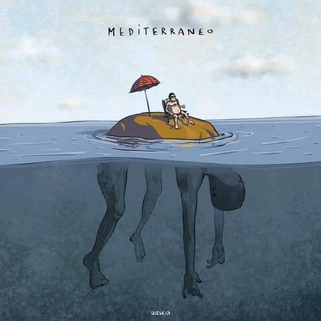
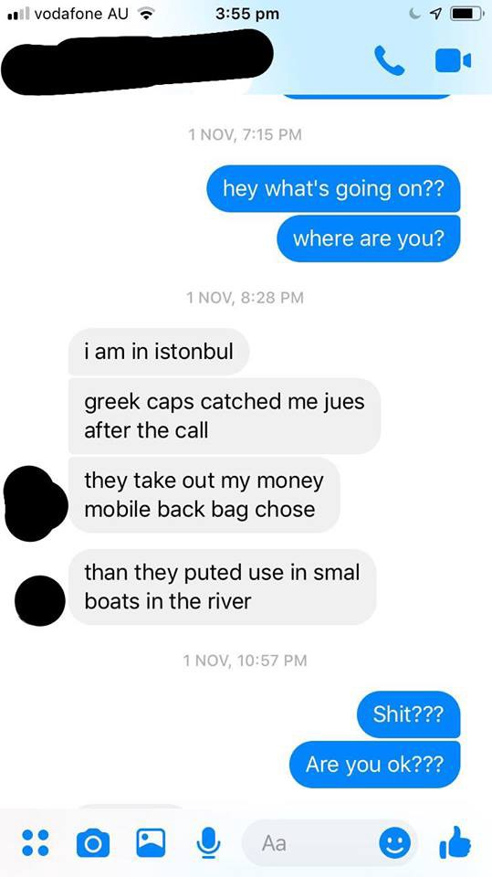
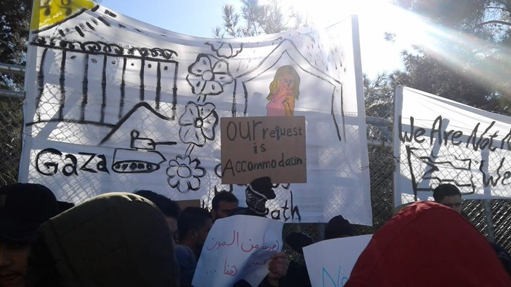
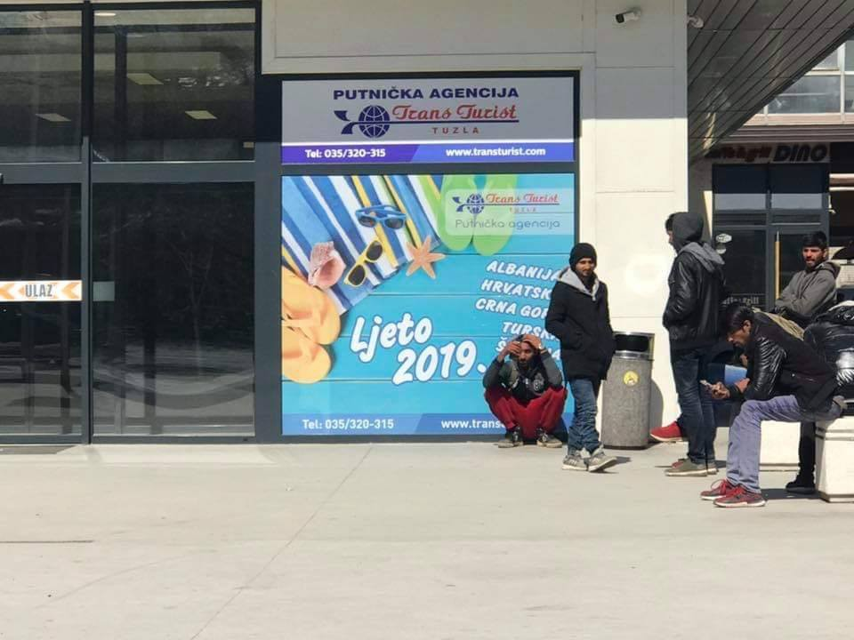
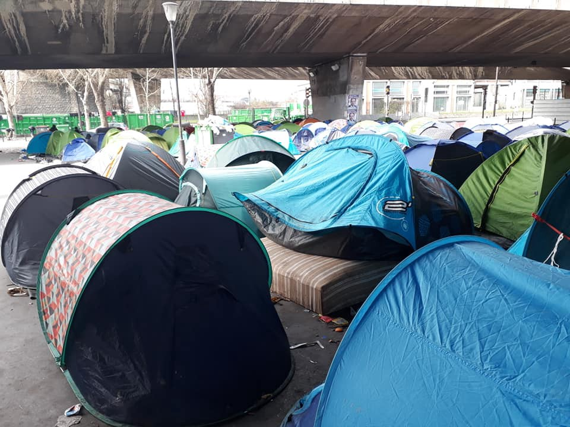
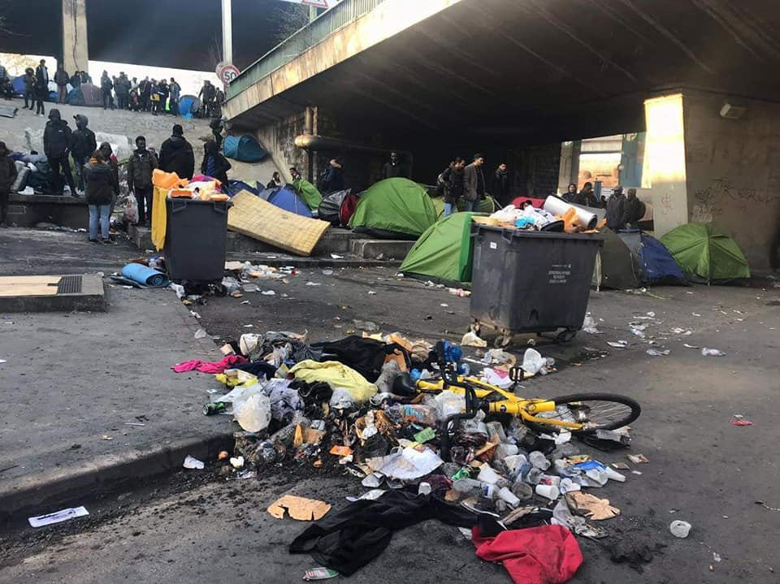

### AYS Daily Digest 29/03/2019: Disillusioning Statistics — A Look At Greece in 2018\.
#### 311 people reported drowned in Mediterranean so far this year//Operation Sophia to continue without Maritime presence//Frontex to be granted more power in the future//News from the Balkans , France & more…

Source: Open Arms Australia
#### Feature: Looking back on the developments \(and lack thereof\) in Greece in 2018…

[The latest AIDA yearly country report](https://www.ecre.org/aida-2018-update-greece/?fbclid=IwAR3HG6u1GDSe8gs3mFELN5xqunVcfp0Tl505vib6vrHIhNfZOGO97P7aRts) for Greece has been released, and the trends found are disheartening to say the least\.

**We summarise them here:**
- An increasing number of push\-backs by Greek Police at the Greek\-Turkish border of Evros have been reported\.

A conversation AYS volunteers had with a man who was Pushed back at Evros River by Greek Police\. They stole his money, bag, phone and shoes\.
- Average processing time in 2018 from the first moment of arrival in Greece was 8\.5 months\. Furthermore it is stated that out of the 58,793 asylum applications recorded in 2018, 80\.5% were yet to have had their first interview\.
- Out of all applications that were appealed, 91% were given a negative response after a secondary interview\.
- People applying for asylum on Greek Islands are still being rejected on the basis of inadmissibility \(due to Turkey being seen as a safe third country\) unless they are identified as ‘vulnerable’\. Therefore the asylum process continues to fail to individually assess asylum claims\. In addition it has also been found that there was a lack of qualified staff to appropriately and efficiently assess ‘vulnerability’ on the Greek islands\.

**Note:** decisions made based on inadmissibility began in mid 2016 and continue to affect Syrians\. Many are Kurdish and from regions such as Afrin, meaning that Turkey is definitely not safe for them\. It should also be noted that Turkey does not abide by the principle of non\-refoulment, and therefore is not safe for anyone who is fleeing war, poverty or persecution\.
#### CAMPS:
- Mainland: Most camps on the mainland, despite being initially created as ‘temporary emergency facilities,’ continue to operate without clear legal grounds or site management\. It was reported that 16,110 people were accommodated in camps on the mainland in September 2018\. [Read our AYS special on one of the camps on the mainland ‘Oinofyta’in 2018 here\.](ays-special-oinofyta-camp-the-overwhelming-sense-of-nothingness-c37d4037a65)
- Islands: Inhospitable and inhumane conditions remain\. This includes overcrowding, lack of basic services such as hygiene facilities and medical assistance\. [Read our AYS special about Samos here\.](ays-special-prison-island-surviving-another-winter-on-samos-72ead10d5096)

A photograph from Protests in Samos in January of 2019, where over 4500 people were accommodated in a place with a capacity for 700\.
- People will be forced out of UNHCR’s \(ESTIA\) accommodation scheme 6 months after being granted international protection\. This is an **extremely concerning development,** which will see many people who are unable to find work being made homeless\.

#### **DETENTION CENTRES** : Incredibly Concerning Developments\!
- 8 pre\-removal detention centres were active in Greece in 2018\.
- 31,126 orders for detention were made in 2018\.

#### 18,205 people were detained throughout the year\. This is almost double the number of people detained through 2017 \(9,534\) \.
- Police centres are still being used for prolonged immigration detention\.
- Many of the centres have a prison\-like design, and are not considered suitable for detention exceeding 24 hours, as they fall short of basic standards\. Medical care is considered inadequate; there are no psychiatrists or provision for mental health; medical services were not provided at police stations\. AYS has also received reports that people in detention were forced to take prescription drugs three times daily\.

#### GENERAL

[Operation Sophia, an EU Common Security and Defence Policy \(CSDP\)](https://reliefweb.int/report/libya/last-breath-operation-sophia-should-push-coalition-willing?utm_medium=social&utm_campaign=shared&utm_source=facebook.com&fbclid=IwAR0nsmxXC4dqeYATfE-DSQMqP7ty3VferumVFH0B_VWUk1g7boySILgXdCI) against smugglers, will continue for another 6 months, but ships will no longer be deployed to the Mediterranean sea\.

It was perhaps not the intention of the mission by EU member states, but since 2015 nearly 50,000 people have been saved by the mission\. This was as a result of its maritime presence, combined with the duty of rescue at sea\. The impact of this change is likely to cause a rise in death rates at sea during attempts to cross to Europe\.

[The EU member states and Parliament](https://www.infomigrants.net/en/post/16002/eu-looks-to-expand-coast-guard-by-2027) have agreed to expand Frontex’s coast guard service from 1,500 to 10,000 by 2027, despite the initial plan, which was to reach 10,000 personnel by 2020\. Increases in Frontex staff is said to begin in 2021\.

Furthermore, Frontex will have greater influence in border regions should host nations approve their presence\. They will be given increased power, including border control and deportations, and may even be allowed to carry weapons\.
#### SEA

IOM Missing Migrants Project reports that so far this year \(until 27\.03\.2019\) 311 people have died in the Mediterranean sea routes, but it must be taken into consideration that the actual number of deaths is likely to be higher\. This week alone, at least 16 women, men and children drowned in the Mediterranean\.

Furthermore, 506 arrivals in Italy, 5,537 arrivals in Spain and 5,482 arrivals in Greece have been recorded thus far this year\.
#### GREECE

A man is reported to have been deported from Samos back to Turkey on 27\.03\.2019 according to [**Deportation Monitoring Aegean**](https://dm-aegean.bordermonitoring.eu/) **\.**
#### BOSNIA

Photo by Senad Kupo: People on the move standing in front of a travel agency\. A sign behind them reads ‘Summer 2019 — Albania, Croatia, Montenegro…Places many people on the move have passed on their journey\.

In 2018 the EU Commission provided IOM, who is responsible for caring for people on the move in the country, 9 million dollars\. A further 13 million will be provided in 2019\. Despite this extremely high sum of money, the accommodation for people on the move in Bosnia remains desperately sub\-standard\.

In Velika Kladusa, police have increased measures to keep people on the move out of the town\. Police have been restricting movement in public spaces in Kladusa, including in parks, where they have been telling people to ‘go to camp\.’ Police also went to a number of squats, breaking down doors and asking people inside what they were doing there\. They counted the number of people that lived in each, asking about their nationality\. Supposedly this is in response to a robbery that occurred\.
#### CROATIA

An increased number of arrivals, mainly returns, is noticeable among residents of the reception centre in Zagreb, counting seven new arrivals in one day\. More than 100 people will arrive via resettlement to Croatia and will be lodged in Kutina for an initial period of time\. The announced number confirms that it will be most likely families who will arrive\. Up until now, it has not proven to be a successful practice, for instance with the families resettled in Zadar, where the average salary barely covers the expenses of rent and basic costs\. This is partly due to the high living costs in Zadar, which is one of the most desirable tourist locations on the Adriatic coast\. They also have no proper integration support, and nobody to lean on in any organisational sense\. We hope to witness a change with the next group of resettled people, who are planned to arrive during April and May\. In the meantime, IOM has reactivated at the Reception centre in Zagreb, working of course on Assisted Voluntary Return and Reintegration\.
#### FRANCE

It is reported that approximately 700 people are sleeping in tents just 15 minutes from Sacre Coeur in Paris\.

> Some of these brave souls are awaiting a decision from the French government on their asylum claim\. 

> Some have had their decision, and it’s a firm “No, now fuck off back to that war, famine, poverty and persecution you fled from\.” 

> Some have fled here from other EU countries who refused them asylum and plan to deport them back to whatever hell they escaped\. They now must wait 18 months before they can claim somewhere else in Europe \(thanks to the EU Dublin regulation\) \. 18 months without food, shelter, medical care or basic human rights\. — Harriet Crook 

**Apart from daily news in English, we also publish weekly summaries in Arabic and Persian\. Click on those links to check out the ones about the week from the 25th to the 31st of March\.**

**We strive to echo correct news from the ground through collaboration and fairness\. Every effort has been made to credit organizations and individuals with regard to the supply of information, video, and photo material \(in cases where the source wanted to be accredited\) \. Please notify us regarding corrections\.**

**If there’s anything you want to share or comment, contact us through Facebook, Twitter or write to: areyousyrious@gmail\.com\.**

_Converted [Medium Post](https://medium.com/are-you-syrious/ays-daily-digest-29-03-2019-disillusioning-statistics-a-look-at-greece-in-2018-c68c8b3b2d8a) by [ZMediumToMarkdown](https://github.com/ZhgChgLi/ZMediumToMarkdown)._
