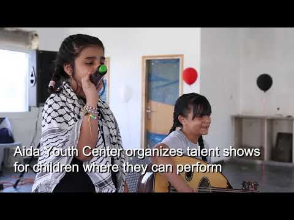
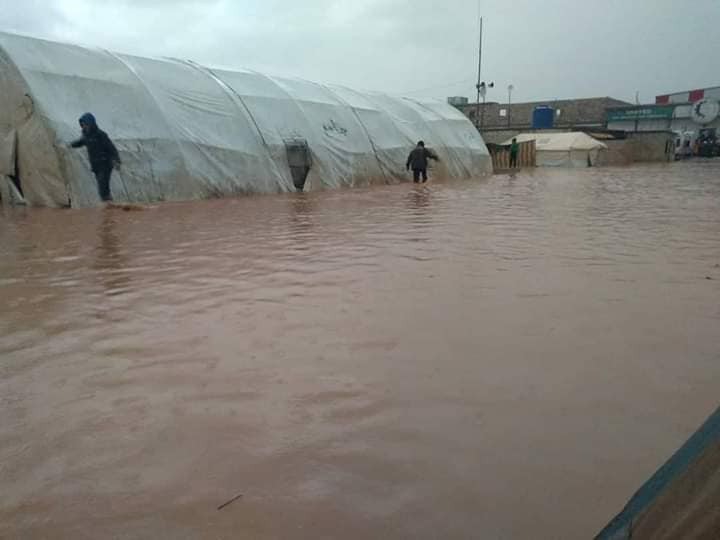
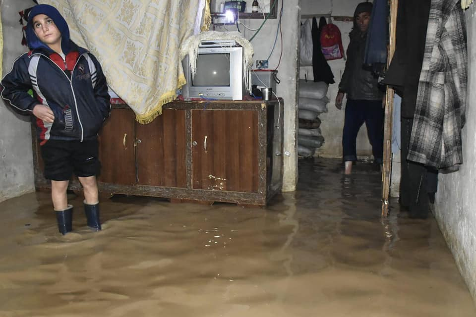
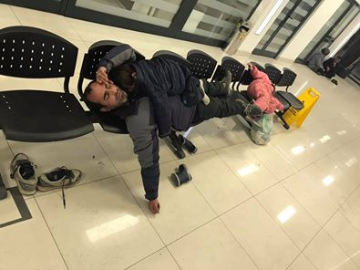
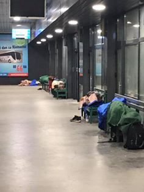

### AYS Weekend Digest 30–31/03/2019 Minors in France: controversial assessments and unfair treatment

Syria — floods hit camps in Idlib and Aleppo /// Malta — Updates on the El Hiblu 1 case /// Italy — New arrivals in Lampedusa /// France — Asylum lawyers on strike against new implementations /// Germany — Report on protests in Bremen against ‘Dublin’ deportation /// Bosnia — 100 people arrive in Tuzla /// Greece — baby injured in a fire in Skaramangas camp

 \) — [\#noborders](https://www.facebook.com/hashtag/noborders?epa=HASHTAG)](assets/86f92c2ce2bc/1*mmU4iqzrYBKRBIlUKhqjzQ.jpeg)

Kilkis, Greece 29 March 2019: 500 refugees arrived from the Greek islands and were placed in tents in Nea Kavala camp for refugees in Northern Greece\. \(Photograph by [Nada JT](https://www.facebook.com/nada.jt) \) — [\#noborders](https://www.facebook.com/hashtag/noborders?epa=HASHTAG)
#### FEATURE — Minors in France: controversial assessments and unfair treatment as the Constitutional Council rules in favour of bone testing to determine age of people on the move

Despite widespread criticism in France and in the international community, [the French Constitutional Council ruled that bone tests to assess the age of young migrants are not unconstitutional](https://www.conseil-constitutionnel.fr/decision/2019/2018768QPC.htm) \. Many recent studies and cases have proved the inadequacy and fallacies of such a practice\.

[ECRE](https://www.ecre.org) report that the case brought forward to the court was about Adama S\., a young Guinean who had “declared himself to be 15 years old upon his arrival in France in 2016”\. Through bone testing the French authorities had concluded that he was instead between 20 and 30 years old\.

Adama S\., supported by a number of organisations, had brought the the case before the Constitutional council, stating that “the radiological examination of bones violated the principle of the ‘best interests of the child’”, especially because of the well\-known margin of error of the test which has led to many minors being refused the benefit they were entitled to\.

> Although the Court confirmed the constitutional character of the principle of the ‘best interest of the child’, it stated that the existence of a margin of error does not make the use of the test unconstitutional\. 

Concerns were expressed by several civil society organisations and NGOs and also by both French and international medical experts\.

As Quartz magazine [report](https://qz.com/1580186/french-court-upholds-a-controversial-bone-test-for-migrants/) s, the most common test \(and the one used by French authorities\) consists of [scanning](https://www.ncbi.nlm.nih.gov/pmc/articles/PMC3999020/) a child’s wrist and hands and comparing the degree of ossification of the bones to an [atlas of X\-rays](https://www.sup.org/books/title/?id=2696) compiled in 1959\. This database was built from mostly white and well\-off American children\. More modern studies have found that the test is not reliable in determining the age of children from different backgrounds such as [Asia](https://www.ncbi.nlm.nih.gov/pmc/articles/PMC3955574/) and [Africa](http://www.scielo.org.za/scielo.php?script=sci_arttext&pid=S0038-23532012000500015) , as growth is influenced by several factors \(such as nutrition, genetics, and exposure to different environments\) \.

> “It’s not possible to make a definitive, single age determination from X\-rays or examination of bones or teeth\. _\[That’s why\]_ forensic anthropologists report age estimations as a range,” \( [_Elizabeth DiGangi_](https://theconversation.com/immigration-agents-x-raying-migrants-to-determine-age-isnt-just-illegal-its-a-misuse-of-science-96771) _, a forensic anthropologist at Binghamton University, interviewed for Quartz magazine\. \)_ 

The French Constitutional Court pointed out that in case of uncertainties or where the bone test contradicts other evidence, the test cannot be conclusive\.

While this was also highlighted by the UN Committee on the Rights of the Child \(CRC\), [AIDA’s vulnerability report from 2017](http://www.asylumineurope.org/sites/default/files/shadow-reports/aida_vulnerability_in_asylum_procedures.pdf?utm_source=ECRE+Newsletters&utm_campaign=944dfb4c3a-EMAIL_CAMPAIGN_2019_03_29_10_06&utm_medium=email&utm_term=0_3ec9497afd-944dfb4c3a-422320969&fbclid=IwAR2k1L5OC-OXEqa91dFUmGH8fs2bQ3DRBTlTOxE2goqLRzRE1M7Qoegfox0) warns that while both French Law and court cases have already established the need for a multidisciplinary approach to age assessment, the practice is far from “uniform throughout the country and only a few départements have followed the guidance so far”\.

La Cimade has indeed [reported about the story of Solange](https://www.lacimade.org/mise-abri-jeune-mineur-danger-cedh-rappelle-france-obligations/?fbclid=IwAR3Tri0Bjj-1h3jl1aTSiuJ9mA6TWU9WrjsA6O_o1rVN2OGAb0rgjRNXgYU#.XJ4ivt3h3eA.twitter) , a young Cameroonian who has been living in limbo since September 2018, when the city council of Angers decided he was an adult, basing the decision only on the absence of official documentation and throwing him out of the hostel where he was residing\. Thanks to the support of activists and lawyers, he appealed this decision a number of times, while the council tried to keep him out of the accommodation\. By the end of March the European Court of Human Rights demanded that France accommodate Solange until a proper assessment of his age was carried out\.

> Dramatic as it may be, Solange’s situation is that of thousands of young people in danger, who are considered fraudulent by departmental councils\. 

> The introduction in France from next April of files with photos and fingerprints will only reinforce this trend\. In 2018, 17,000 people were recognised as minors out of the 40,000 who required assessment\. In Angers, less than one out of ten minors is recognised as such by the public authorities\. _\( [La Cimade](https://www.lacimade.org/mise-abri-jeune-mineur-danger-cedh-rappelle-france-obligations/?fbclid=IwAR3Tri0Bjj-1h3jl1aTSiuJ9mA6TWU9WrjsA6O_o1rVN2OGAb0rgjRNXgYU#.XJ4ivt3h3eA.twitter) \)_ 

As AYS we stand with ECRE when they say that:

> being misidentified as an adult rather than a child when seeking international protection can have considerable implications on the level of rights and protections afforded to them by a receiving state\. This ranges from being unable to access welfare services and support, to being detained as an adult, to not receiving publicly funded legal representation during the asylum process\. 

Also, read below about the series of strikes carried out by asylum lawyers against the “heavy climate” imposed by the latest governmental guidance\.

PALESTINE
#### Donation needed for Aida Youth Centre in Bethlehem

[Aida Youth Centre](https://www.aidacenter.org/) in the Aida Refugee Camp in Bethlehem, Palestine, which is run by people who once grew up in the camp, is trying to raise funds to ensure they can continue their much\-needed work\. The youth centre, which has been open since 1968, works tirelessly to create a safe recreation space for the youth stuck in the camp\. The centre has recently started to focus more and more on education programmes including extra\-curricular activities such as arts and crafts, music, sport, scouts and the occasional excursion, due to the damaging impact of prolonged occupation on Palestinian children and the undercapacity of other groups offering educational support\. It also provides social workers and counselling support for students and their families\.

The work of the centre has become more necessary than ever as larger organisations such as UNRWA \(United Nations Relief Work’s Agency\) face funding cuts\.

**For more information please see their [website](https://www.aidacenter.org/) , and to donate please follow [this link\.](https://www.gofundme.com/evp4f-save-aida-youth-center?teamInvite=K9zuCpvq2bvdxaNXaJfxbpq167L3jBqIbk783t99GasceH8LSQtSIf2Eu5ASPWbl&fbclid=IwAR2lE4b5MFUzkVcAyl8d96BF-Ue1KFQ5D0XTrMi_KE1faU68t5dI8PhKxp8)**

SYRIA

Photos and videos have emerged of serious floods in camps surrounding Aleppo and Idlib\.

](assets/86f92c2ce2bc/1*gp1zrsTk6iXf6RHge4R6Zw.jpeg)

Photos by [Tally Oliver](https://www.facebook.com/tally.oliver/posts/10157255812334343?hc_location=ufi)

](assets/86f92c2ce2bc/1*TqptRl0IRr3ydbXa9J8XOg.jpeg)

Photos by [IHH Insani Yardim Vakfi](https://www.facebook.com/ihhinsaniyardim/posts/10157382432705229?hc_location=ufi)

After years of war and tragedy, these people deserve better than this\.

TURKEY
#### 3 people died in a fire in Ankara

[A local news source in Turkey reports](https://www.gazeteduvar.com.tr/turkiye/2019/03/29/ankaradaki-yanginda-olen-afgan-isciler-50-liraya-17-saat-calisiyordu/?fbclid=IwAR0MytKJDMNOUf2Jgt9PyjsUZE4NGJXUvUtFrvRX1d5VDWzx7x2XMGqVoRs) on a fire in Ankara which claimed the lives of three people from Afghanistan and injured 11 more\. Those caught in the fire were working as waste collectors in the city, earning just 50 liras per day for 16–17 hours work\. The building was not fit for living, yet the workers had no option\. They were not able to pay for decent housing despite working long hours, seven days a week\. The building had been condemned as unfit, and local authorities apparently knew people were living in unsafe conditions there but did nothing\. As yet the cause of the fire is unknown\. This case is sadly not uncommon, with local sources stating that upwards of 2,500 people live in similar conditions; in unstable, exploitative jobs, and living in unsafe, unsanitary conditions despite working almost every hour of the day\. The report also notes that this is not the first incident of its kind\. In January, five people from Syria were killed in similar circumstances, and a further eight wounded\. The precarious position of people on the move in Turkey is clearly unlawful, leaving them exposed to serious risks whilst living and working in dangerous situations\.

SEA

](assets/86f92c2ce2bc/1*rRcCEDb-CkXt1c-AW3VSBA.jpeg)

Photo by [Sea\-eye](https://www.facebook.com/seaeyeorg/photos/a.732203640218869/1837167366389152/?type=3&theater&ifg=1)

Whilst it seems arrivals have been quiet over the weekend and official Search and Rescue missions have ceased, [Sea\-eye assure](https://www.facebook.com/seaeyeorg/photos/a.732203640218869/1837167366389152/?type=3&theater&ifg=1) people that the crew of the Alan Kurdi ship is still hard at work, with the help of the sailors from Ghana\.

GREECE
#### Fire at Skaramangas camp

A fire broke out on Saturday night at 2am at Skaramangas camp on the outskirts of Athens\. [Χώρος Στέγασης Προσφύγων City Plaza](https://www.facebook.com/cityplazaathens/?__tn__=%2CdkCH-R-R&eid=ARA5sJzJRX_WRDJwIzeQgRsYS3YIBE78EqViyOq6b8yHhQ3mh8RWrNeO6wRW3bq3q5VXsVWuk5m93kj5&hc_ref=ARRg0vqXwuLpayJGx3OhcJ0BrmnWI325KX_qGzd3hoYsDXz39ItjBfuDBxABdkksCb0&fref=nf) have released a video of the incident:

The victims of the fire are a family with two small children — including a baby who was badly burnt — who were all taken to the hospital where they are still receiving treatment\. Following this, at around 3am roughly 50 residents attempted to block the road to the camp to protest the awful conditions they face\.

Sources on the ground report that there are ongoing protests at the gate of the camp demanding that people be housed in containers, as many believe such an incident would not have occurred had the family not been living in a tent\.

This incident follows the arrival of hundreds of people transferred from the islands to the camp on 14th and 15th March\. Across Greece [high numbers of transfers from the islands are being dumped into already overcrowded, unsafe conditions on the mainland](ays-special-the-case-of-oinofyta-from-one-hell-to-another-island-to-mainland-ae38893f9cbc) \.

Unfortunately, cases such as this fire are unlikely to be the last, as thousands are forced to live on top of each other in flimsy, flammable tents\.

[Dråpen i Havet](https://www.facebook.com/drapenihavet/?__tn__=%2CdkCH-R-R&eid=ARBONtwnx3b3N3R3hHLqzk98HW9CQpltnb8LEuiZr5xM0Srqwb8Ub6zWOijoSnf7Edlvohjs7eNJxgFn&hc_ref=ARTR-P6P_GVtmuMVOT1audSwgsR-8dvRsGj9KdC2yXSda6qcxM5KvhpKDr9tZZ1jVik) report that protests have been a common occurrence since the new arrivals got to the camp, with daily protests at the terrible conditions they face there\. People were placed in tents that flooded, with no heating, floor, electricity or washing facilities\. The stormy weather and high winds in the past few days have further aggravated the terrible conditions, with tents breaking up and freezing temperatures for those living in them\.

The tragedy of transferring people from camps such as Moria to these conditions is shameful, and goes to show that transfers alone are not the answer\. People who are already traumatised from years in Moria should not be forced to live like this\. No human should be forced to live like this\. A further problem with these transfers is that they hide the problem from the international community\.

While it is likely many people have heard of the horrors of the island camps due to mainstream media coverage, scarcely anyone will hear about this tragic fire and other similar incidents\. This needs to change\.
#### ECHR rules in favour of unaccompanied girls detainened in Greece

The Greek Council for Refuges reports on a ruling by the European Court of Human Rights on March 28th which sees an interim measure in favour of two unaccompanied girls who had been detained in an adult detention centre, forcing their transfer to an appropriate accommodation facility for minors\. While this is an important victory, there is much work still needed to ensure the safe and dignified treatment of unaccompanied minors in Greece\.

> **The Court ordered the Greek authorities to transfer the minors immediately to a shelter for unaccompanied minors and to ensure that the reception conditions provided for them would be in accordance with article 3 of the ECHR\.** 

The case was supported by the Legal Unit of the Greek Council for Refugees \(GCR\), who argued that despite the fact that an application for accommodation in a shelter was immediately submitted to the National Centre for Social Solidarity \(EKKA\), which is responsible for housing minors, the two girls in question remained homeless and without a legal guardian\. On March 13th they were taken to a police station where they were supposed to be detained temporarily in a children’s hospital until other accommodation was found — this is the standard procedure for any unaccompanied minors under 15 in Greece\.

However, they were instead transferred to Petrou Ralli, a detention centre for adults, where they remained in dangerous conditions for over 2 months\. The minors were transferred to other accommodation on 23rd March\. GCR not only highlight the unforgivable gaps in sufficient protection measures for unaccompanied minors in Greece, but also decry the very real dangers these children face:

> This case shows the huge existing gaps in the protection of unaccompanied minors in Greece, due to which unaccompanied minors, boys and girls, remain exposed to grave dangers\. It also comes only one month after GCR’s public appeal to end the detention of unaccompanied minors, following the statements of the Minister of Migration that there are no unaccompanied minors detained in Greece\. 

> GCR reiterates that the protection of the rights of children is a fundamental state obligation, according to national law and Greece’s international obligations, and calls on the Greek authorities to take all necessary measures for the protection of minor refugees, including the immediate application of an effective guardianship system of unaccompanied children, the increase of the number of available accommodation places for minors, the prohibition by law of the detention of minors in the context of asylum and migration procedures and the immediate termination of the relevant practice\.” 

Updates on the so\-called Caravan of Hope

An update on the so\-called ‘Caravan of Hope’ from [Mobile Info Team for refugees in Greece — الفريق المتنقل](https://www.facebook.com/mobileinfoteam/?__tn__=%2CdkCH-R-R&eid=ARCScPKXsVRg0MoueZttrhTszi-36S5raratwL8FtuDgFKR9OPqOvB07u-dTLAW2mkoleHzqulHeNdT6&hc_ref=ARTeiLv38VMxpwNmpWn9p5BcHcgJEsQNSWi1n9w5ZggFKzsxX54bIfB3xe11ePkc9ZY&fref=nf) :

> We share this information just to inform and not to encourage or suggest any action for people on the move\. The ‘Caravan of Hope’, which sees organisers wanting a large number of people on the move to gather at the Northern borders of Greece in an attempt to cross, now seems to be shifting the meeting point from Ioannina to Thessaloniki and looks set to leave in a few days\. Mobile Info Team reiterate that it is highly unlikely the movement will be successful, and the borders will not simply open\. On top of this, participants face the risk of losing both their cash assistance and accommodation if they take part, and if they miss any appointments at the asylum office during this time they could face a discontinuation decision\. 

#### International Transgender Day of Visibility

A message from [Samos Volunteers](https://www.facebook.com/samosvolunteers/) on International Transgender Day of Visibility \(31st March\) \. They wish to remind anyone in need that they have a specific LGBTQI project within their Legal Centre, and that being LGBTQI can be grounds for international protection 🏳️‍🌈\.

If anyone is in need of their support then please contact them at the Legal Centre, or text LGBTI to \+491772131739, all communication will be anonymous\.
#### Updates on UNHCR ESTIA housing evictions, scheduled to begin yesterday, 31st March\.

There is an open call for NGO workers to resist the evictions, taking place Tuesday April 2nd at Gkini, Politechnio\. The link for the event can be found [here\.](https://m.facebook.com/events/1948847331907766/?ti=icl) This call out highlights the power and responsibility of NGO workers in halting the evictions\.

Further to this the group [Against Refugee Evictions Greece](https://www.facebook.com/AgainstRefugeeEvictionsGreece/) has released the following statements:

> Today, 31st March, is the day that approximately 200 people have been told to leave the homes they have lived in under the ESTIA Accommodation Scheme\. It is not clear how many will actually leave or what the consequences are for those that stay\. Those that leave have been promised €450 and little other support to enable them to find accommodation, to secure employment or to access state and non\-state services\. 

For more info on details on the evictions, including what advocacy and resistance can be done, please [follow this link](https://www.campfireinnovation.org/campfire-blog/greece-phasing-out-housing-for-recognized-refugees?fbclid=IwAR0HotEo7NcAwoeZ39epX33xeCBLv9J9EatOkpM84oL3gswKfsiQuxqYPJ0) to Campfire Innovations comprehensive summary of the situation\.

Finally, [Against Refugee Evictions Greece](https://www.facebook.com/AgainstRefugeeEvictionsGreece/) has also released some practical advice for those affected:

> \* **Request your home contract** :
 

>  You have the right to request a copy of the contract \(between you and the organisation\) in your native language\. 

> \* **Refuse to sign any paper** :
 

>  You have the right to refuse to sign any document if your native language is not detailed and understandable\. 

> \* **Request a translator** :
 

>  You have the right to request a translator for your native language, and the evacuation is considered illegal if there is no translator\. 

> \* **Request to change translator if needed** :
 

>  You have the right to change the translator if the communication is not going well or if you do not understand the language of the translator\. 

> \* **Refuse to meet the social worker and avoid physical communication and reject any other possible criminal charges / breach of the contract** \.” 

Anyone affected is invited to follow their Facebook page where they can message for further information and support\.
#### Update from Khora Community Centre

> Khora asylum support team continue to run sessions around Athens\. They provide information and support about the Greek asylum system, as well as assistance with other services such as housing and health care\. 

> Here is our latest schedule: 

> Tuesdays & Thursdays : 12–5pm 
 

>  ‎مؤسسة جفرا في اليونان/Jafra foundation in Greece
 

>  Kallidromiou 49, 10681 Athens 

> Wednesday afternoons : Do Your Part centre near Oinofyta & Lavrio Camps 

> Our work ranges from ;
 

>  — accompanying people to asylum offices and hospitals
 

>  — arranging appointments with qualified lawyers
 

>  — keeping up to date with information related to asylum & welfare in Greece
 

>  — running outreach & information sharing sessions across the city 

> If you would like more information about what we do feel free to email [khoralegal@gmail\.com](mailto:khoralegal@gmail.com) ” 

#### New arrivals in Nea Kevala

[Dråpen i Havet](https://www.facebook.com/drapenihavet/?__tn__=%2CdkCH-R-R&eid=ARBONtwnx3b3N3R3hHLqzk98HW9CQpltnb8LEuiZr5xM0Srqwb8Ub6zWOijoSnf7Edlvohjs7eNJxgFn&hc_ref=ARTR-P6P_GVtmuMVOT1audSwgsR-8dvRsGj9KdC2yXSda6qcxM5KvhpKDr9tZZ1jVik) have called out for help in Nea Kavala camp following the arrival of 500 people who have been transferred from the islands — doubling the number of people resident in the camp in just one day\. They say they need help and support urgently to meet the demand for clothes, diapers and food they now need to provide\. The new arrivals comprise both families and individuals, children and elderly people, many of whom will be living in tents\. Please [follow this link](http://www.drapenihavet.no/eng/support) to donate to the group to support their ongoing work in the camp\.
#### Volunteers needed in Lesvos

[Rowing Together NGO](https://www.facebook.com/RowingTogetherNGO/) are in need of volunteers to carry out admin work and volunteer coordination for their Women’s Healthcare Project in Moria Hotspot/RIC in Lesvos \( Greece\) \. They also need someone willing to assist with bureaucratic work relating to the NGO\. Please check their [Facebook](https://www.facebook.com/RowingTogetherNGO/) or send an email to [rowingtogethervoluntarios@gmail\.com](mailto:rowingtogethervoluntarios@gmail.com) for more information\.

MALTA
#### Updates on the El Hiblu 1 case

We extensively reported on the case of the El Hiblu 1 vessel\. The ship, after having rescued 108 people in the Central Med on Wednesday, was heading towards Libya, but the crew was forced by the rescued people to head towards Malta\. The Captain stated no violence was used, but the people threatened to jump off board, hurt themselves and damage the boat if they were to be taken back to detention centres in Libya\.

Police and magistrates are now investigating the case and according to Maltese media, three teenagers \(19, 16, 15 years old\) are being charged with seizing control of the ship, which under local laws “ [can be considered a terrorist activity and is punishable by anything between seven and 30 years in prison](https://www.itv.com/news/2019-03-30/three-migrants-charged-in-malta-over-oil-tanker-hijack/?fbclid=IwAR1-nQ43gYNkUJBC6DMdBvkKImptPaVz3XVxFags0EiIHzUgVNF3J6xS4J4) ”\. Police are also considering pressing charges against the captain of the vessel, doubting the veracity of his statements: “ [investigators are not ruling out that he could have reported such a situation over the radio to be allowed to enter Maltese waters](https://www.timesofmalta.com/articles/view/20190330/local/migrant-ship-captain-could-face-trafficking-charges.705904?fbclid=IwAR1xaFdZhwp8bmRU0YGvj3FOcnAFmj1H10QA_bpTz4_xCrEmzYh9n3H_iyI) ”\.

European authorities seem to be doing whatever they can to dissuade people on the move from trying to cross the Mediterranean — by making the crossing more dangerous and threatening terror\-related sentences upon arrival\. They also continue criminalising every form of rescue and support\.

In the meantime, UNHCR Malta has talked to the people rescued by the tanker:

■■■■■■■■■■■■■■ 
> **[Paolo Biondi](https://twitter.com/PaoloBiondi82) @ Twitter Says:** 

> > @[UNHCRMalta](https://twitter.com/UNHCRMalta) talked to the people disembarked from #ElHiblu1 the same day of arrival. All haven’t eaten in days, were severely dehydrated and showed clear evidence of torture and ill treatment. #Libya remains an unsafe place for returns. https://t.co/WTy9EwL6qj 

> **Tweeted at [2019-03-30 10:33:31](https://twitter.com/paolobiondi82/status/1111939505542651904).** 

■■■■■■■■■■■■■■ 

ITALY
#### 11 people arrived on Lampedusa on Saturday

Local media [report](https://livesicilia.it/2019/03/30/dieci-migranti-e-un-bambino-un-altro-mini-sbarco-a-lampedusa_1047720/) that 11 people were sighted not far from the coast of Lampedusa and were rescued by Italian authorities\. On board there was a child\. Not much information has been released so far about the origin of the people or where the boat came from\.

Lampedusa is becoming \(again\) the first point of disembarkation for people trying to reach Italy\. The number of small boats has also risen since last year\. Criminalisation of rescue and the greater role accorded to the Libyan coast guard seem to have pushed more people to face the journey across the Central Mediterranean in even more dangerous conditions\. [According to national media](https://www.repubblica.it/cronaca/2019/03/30/news/migranti_ancora_sbarchi_a_lampedusa_nel_porto_dell_isola_piu_della_meta_degli_arrivi_di_tutta_italia-222891951/) , 262 people have arrived in this way on the Italian island, accounting for more than half of the 517 people arrived in 2019 so far\.

MONTENEGRO
#### One person arrested at the US embassy in Podgorica

In Montenegro, a [local newspaper reports](http://ba.n1info.com/Svijet/a324917/Incident-pred-Ambasadom-SAD-u-Podgorici.html?fbclid=IwAR0pPxiSgiWqX01w2k_3aYsNuvb0hmqBy4CYvLgTF7uV_0UAbQDXOKIXdus) on an incident as the US embassy in Podgorica, which saw one person arrested\. A group of people on the move tried to enter the yard of the embassy but were met with a heavy police presence\. Police then proceeded to block off the surrounding streets\. Only one person made it into the yard and was subsequently arrested and later taken to the Podgorica security centre\. Whilst it is not clear why the group tried to enter the embassy, it could be that they believed they would be able to apply for asylum in the US by doing so\.

However, while some argue that being in the embassy means you are under the jurisdiction of that country and therefore the country has a duty under [Art\. 32 of the Refugee Convention](https://www.unhcr.org/4ca34be29.pdf) which states “not expel a refugee lawfully in their territory”, it seems to be the current view that an embassy, whilst falling under a state’s jurisdiction [, does not count as official territory](https://www.politifact.com/truth-o-meter/statements/2018/jul/10/raul-labrador/no-immigrants-cannot-apply-asylum-us-embassies-or-/) \.

BOSNIA
#### Possible transferrals from Bihac centres to Buzim municipality

It has [been reported](https://www.cazin.net/vijesti/migranti-sele-u-buzim-turska-gradi-kamp-za-5000?fbclid=IwAR1u9O1sXrTCJuAbY_RQAPBT24tp6ilQJVcfP6oUbw_vRcJPuC4xWTCunFM#sthash.WBuG24ZU.dpbs) that people currently living at the reception centers in Bihać will be moved to an isolated location in the municipality of Bužim, close to the Croatian border\. Though it has not yet been confirmed, there is an idea that the camp at Turska Gata would be modeled on camps at the Syrian border, holding thousands of people in isolated spaces\.
#### Locals support people on the move in Tuzla

Tuzla bus station\. \(Photo by Senad Cupo\)

Also in Bosnia, the arrival of over 100 people on Saturday in Tuzla, a small city close to the border with Serbia, sees local volunteers doing their best to provide support in the face of neglect by the government, which refuses to take action\. There are very scant resources in Tuzla to help those newly arrived, and despite the best efforts and tireless work of local volunteers, the demand cannot be met, and support is unsustainable as numbers continue to grow\.

Among the 100 people there are many families, who have all gathered at the bus station due to the lack of accommodation available\. There are no facilities accessible here, and even the toilets close in the evenings\. Volunteers have stated that if the official response continues to be ignoring the problem they will have no choice but to withdraw their support in protest at the government’s inaction\.

> We no longer have the strength or the resources, all of this is difficult and emotional to handle, because the scenes that we encounter in the field are really upsetting\. 

Many volunteers have also reported that they face hateful comments and threats as a result of their work, which they argue prevents a much greater problem in the area\.

> These people are not really aware that with my work and action we are preventing a general catastrophe\. 

A group of local residents has submitted plans to the city council, which include suggestions for a reception centre\. They argue that as numbers are set to rise as the weather improves, the situation could soon turn into a full\-blown humanitarian crisis\.

FRANCE
#### 238 camp evictions in Calais since January

[Independent publication Basta\!](https://www.bastamag.net/) reports on the long\-term consequences of the eviction of the Jungle in Calais\.

> It has given way in recent months to camps scattered on the margins of the city, which continue to undergo police harassment and evictions\. “Every camp is evicted, reoccupied, and then evicted again, every 48 hours or so” says Human Rights Observers\. These operations are aimed at exacerbating the situation for people on the move by imposing an excessive police presence, with the constant threat of losing their belongings or being placed in detention\. “Between January 1 and March 26, the organization already lists 238 evictions of camps”\. 

Read the full article \(in French\) [HERE](https://www.bastamag.net/A-Calais-les-expulsions-se-poursuivent-grilles-et-barbeles-continuent-de?fbclid=IwAR136Q9et4XNbGSvTfnjAD-XOEyJLT7_KU0v4I_-Uih4YU0SBPz49z82T2s) \.

**Strike in asylum appeal court against new implementations**

French Media [report](https://www.lemonde.fr/police-justice/article/2019/03/28/la-cour-nationale-du-droit-d-asile-en-pleine-tourmente_5442588_1653578.html?fbclid=IwAR0LD7HYLwBLEo2TN16T60MqPSnhPVuJCyW7zOGfSLuhIlhLWayo1cxfyh8) that since March 14th, asylum lawyers in the National Court of Asylum \(CNDA\) have been on strike\. The CNDA examines the appeals of asylum seekers who have been dismissed by the French Office for the Protection of Refugees and Stateless Persons \(Ofpra\) \.

Lawyers are protesting against the provisions introduced by the asylum and immigration law of 2018, “which makes it mandatory to make video\-hearings for asylum seekers under the administrative courts of Nancy, Lyon and Strasbourg”\.

Lawyers and unions denounce the “heavy climate” imposed on the courts by government indications and guidance\. Courts are instructed to speed up cases and avoid any postponement in order to present positive statistics to the government, regarding the number of cases judged and the duration of the cases\.

According to the SIPCE union, as part of these _“instructions”_ , judges are suggesting to applicants that they give up their right to legal aid, in case their lawyers are on strike, so the cases can be judged quickly

> This was confirmed by a magistrate: “Without giving us instructions, we are asked to do everything possible to discourage requests for referrals\. There is a very heavy climate right now at the court\. _\(Magistrate interviewed by [Le Monde](https://www.lemonde.fr/police-justice/article/2019/03/28/la-cour-nationale-du-droit-d-asile-en-pleine-tourmente_5442588_1653578.html?fbclid=IwAR0LD7HYLwBLEo2TN16T60MqPSnhPVuJCyW7zOGfSLuhIlhLWayo1cxfyh8) \)_ 

#### Updates on scheduled deportation to Sudan

As we reported recently, Husman Abdalla, a 44\-year\-old Sudanese, is currently awaiting deportation, scheduled for next Tuesday\.

By deporting to Sudan, France is acting as an accomplice of a dictatorial state and is condemning innocent people to death\.

[**Read the full statement by the Collectif Asuad, and ACT to stop this deportation by contacting French authorities and the flight company\.**](https://www.facebook.com/collectifasuad/photos/a.2020674731341638/2129536893788754/?type=3&theater&ifg=1)

If you can, [sign the petition to stop the deportation](https://www.change.org/p/fabien-sudry-pas-de-calais-pref-gouv-fr-pour-emp%C3%AAcher-l-expulsion-de-husman-vers-le-soudan-ou-de-toute-autre-personne?recruiter=20395553&utm_source=share_petition&utm_medium=facebook&utm_campaign=share_petition&utm_term=share_petition&recruited_by_id=93af7260-fb38-012f-cd91-4040f855b16c&utm_content=fht-14667508-en-us%3Av5) \.
#### Young man injured after jumping from the second floor of the structure where he was under house arrest

Local media [report](https://www.lanouvellerepublique.fr/indre-et-loire/commune/saint-pierre-des-corps/un-jeune-migrant-saute-du-2e-etage-du-cao?fbclid=IwAR1qDc2J8wek1-6bPtWNp4YH3xcDtr2nrazPKiefpr4mj47PELzjVnnX1Tk) that Reza, a 22\-year\-old Afghan migrant under house arrest at the reception and orientation center \(CAO\) in Saint\-Pierre\-des\-Corps, jumped from the window of his accommodation on Friday\.

He was taken to hospital, but has already been released\. He was due to be forcibly transferred to Germany under the Dublin regulation\. As the migrants collective from Saint\-Pierre\-des\-Corps stated:

> We know that the deportation to Germany of an Afghan migrant leads almost always to a deportation to Afghanistan \[…\], a risky operation for Reza because he belongs to a Shiite ethnic allegiance, that is not tolerated in the area\. \[…\] He has learned French and wants to stay in France\. 

> The only solution for him: wait eighteen months to make a new asylum application\. Without the slightest guarantee\. 

**Blankets and sleeping bags rescued from landfill in Paris**

In response to the brutal practice of the French police \(as well as of the authorities of many other European countries\) of throwing away personal belongings, blankets, tents and sleeping bags of people on the move forced to sleep in makeshift camps, The Paris Refugee Ground Support has managed to salvage tons of items from landfill\.

](assets/86f92c2ce2bc/1*VGqx4i455md3uizBdyjNTA.jpeg)

Paris, photo by [Paris Refugee Ground Support](https://www.facebook.com/PRGS.team/photos/pcb.2334826283464145/2334825683464205/?type=3&theater)
#### Fundraising for the Brittany — Calais solidarity truck

Various Breton collectives and associations are asking for fundrainsing to fund the transport of donations collected for people on the move in Calais and Dunkirk\.

Support them [HERE](https://www.lepotcommun.fr/pot/srkqb0yd?fbclid=IwAR1mSoL13VCWoMM3298B6GtkV8ZnuTnrUNIQjoI7rBCdECq-TCkluFn-59w) \.

GERMANY
#### Protests against the deportation of Momodou from Bremen

From [Together We Are Bremen — Shut down Gottlieb Daimler Straße Camp](https://www.facebook.com/TogetherWeAreBremen/posts/657829517971320) :

Last Thursday a protest was held in front of the pre\-deportation prison in Bremen for the fourth week in a row\.

> Again we came for Momodou, Godstime\. We stayed to call the Dublin regulation out for what it is — Racist, inhumane and something that should be abolished immediately\! 

> As it was the night before Momodou’s scheduled deportation operated by Eurowings, a daughter company of Lufthansa, we wanted to be there for him as long as possible to give him the support he deserved and needed for whatever he would face\. 

The next morning several activists decided to take their protest and anger to the Hamburg Airport, to make travellers aware of the deportation that was taking place\.

> We were too loud and visible for them to look away\. The response of the
 

> Hamburg Airport Security was to physically attack and insult a black
 

> female protestor\.
 

> Again no surprise\. Neither was it surprising that this very Security
 

> employee was calm and friendly when she approached the white protestors
 

> for negotiations\. 

Momodou has since then been transported to Italy, two supporters flew with him to at least make the first steps less stressful and to find structures that would keep him from homelessness\. At his arrival at Malpensa airport, Italian authorities isolated him for more than 8 hours\.

**If you have contacts in Milan, please inform them of the situation and help Momodou finding a place to stay\. Donations for a place to stay, and transportation within Italy and other costs of living are more than welcome\.**

Read the full report [here](https://www.facebook.com/TogetherWeAreBremen/posts/657829517971320?__tn__=K-R)
#### Protest in Berlin

6,000 people protested on Saturday in Berlin for a humane asylum policy, for safe ports and solidarity cities\.

 \)](assets/86f92c2ce2bc/1*zR5iAzH-ANdh5Zx3Lcfd4Q.jpeg)

Solidarians take the streets in Berlin \(photo by [Seebrücke — Schafft sichere Häfen](https://www.facebook.com/SeebrueckeSchafftsichereHaefen/) \)
#### SOS Mediterranee initiatives in Berlin and Hamburg

](assets/86f92c2ce2bc/1*i0H7aB3m9izCG-mac_dthA.png)

[SOS Mediterraneè](https://www.facebook.com/SOSMEDITERRANEE/photos/a.806663182774325/2138143982959565/?type=3&theater)

**We are an entirely volunteer\-run media team, and we rely on our supporters to share our news\. So please share, and never forget to ACT\!**

**Apart from daily news in English, we also publish weekly summaries in [Arabic](%D8%A3%D9%84%D9%85%D8%A7%D9%86%D9%8A%D8%A7-%D9%85%D8%A4%D9%87%D9%84%D8%A9-%D9%84%D8%AA%D8%B1%D8%AD%D9%8A%D9%84-%D8%A7%D9%84%D9%84%D8%A7%D8%AC%D8%A6%D9%8A%D9%86-%D8%A5%D9%84%D9%89-%D8%AF%D9%88%D9%84-%D8%A7%D9%84%D8%A7%D8%AA%D8%AD%D8%A7%D8%AF-%D8%A7%D9%84%D8%A3%D9%88%D8%B1%D9%88%D8%A8%D9%8A-%D8%A7%D9%84%D8%AA%D9%8A-%D8%AA%D8%B9%D8%A7%D9%86%D9%8A-%D9%85%D9%86-%D8%B8%D8%B1%D9%88%D9%81-%D9%85%D8%B9%D9%8A%D8%B4%D9%8A%D8%A9-%D8%B3%D9%8A%D8%A6%D8%A9-72e5eeb62e92) and [Persian\.](ays-weekly-news-summary-in-persian-march-18-24-154b61d8f8e0) Click on those links to check out the ones about the week from the 18th to the 24th of March\.**

**We strive to echo correct news from the ground through collaboration and fairness\. Every effort has been made to credit organizations and individuals with regard to the supply of information, video, and photo material \(in cases where the source wanted to be accredited\) \. Please notify us regarding corrections\.**

**If there’s anything you want to share or comment, contact us through Facebook, Twitter or write to: areyousyrious@gmail\.com\.**

_Converted [Medium Post](https://medium.com/are-you-syrious/ays-weekend-digest-30-31-03-2019-minors-in-france-controversial-assessments-and-unfair-treatment-86f92c2ce2bc) by [ZMediumToMarkdown](https://github.com/ZhgChgLi/ZMediumToMarkdown)._
