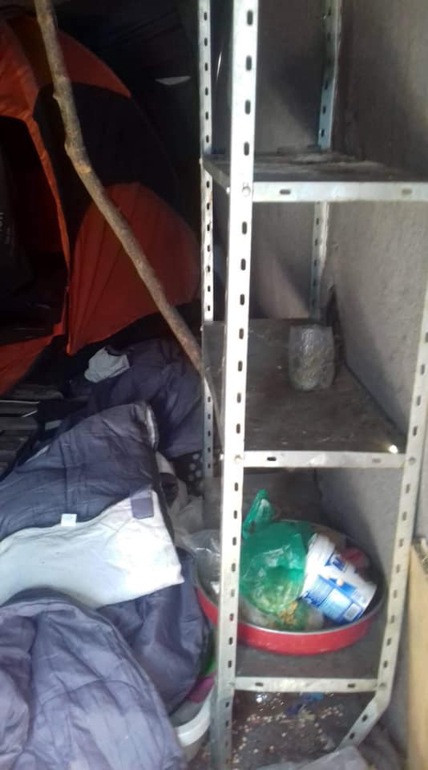
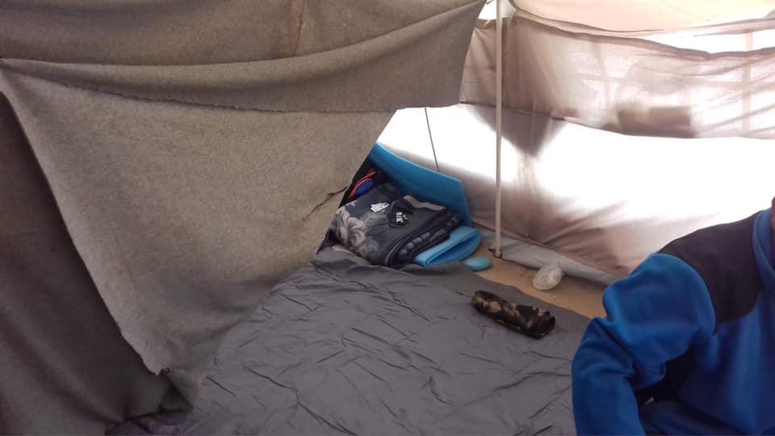
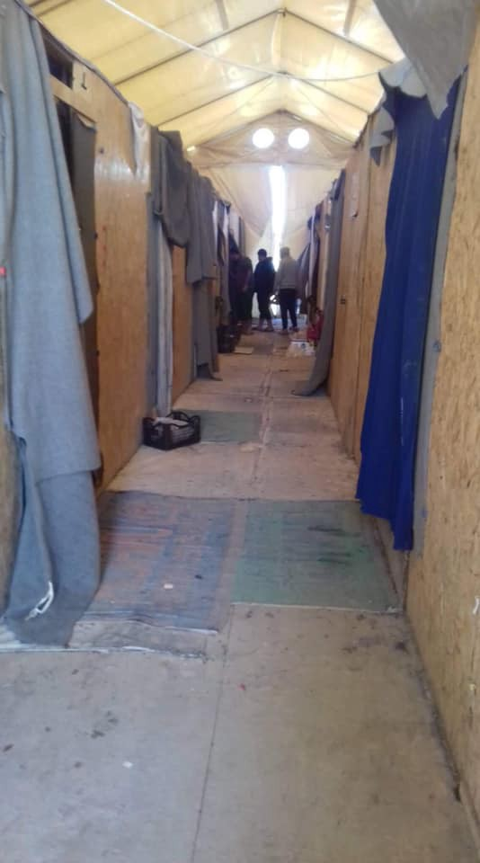
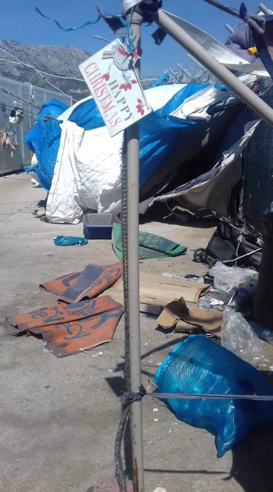
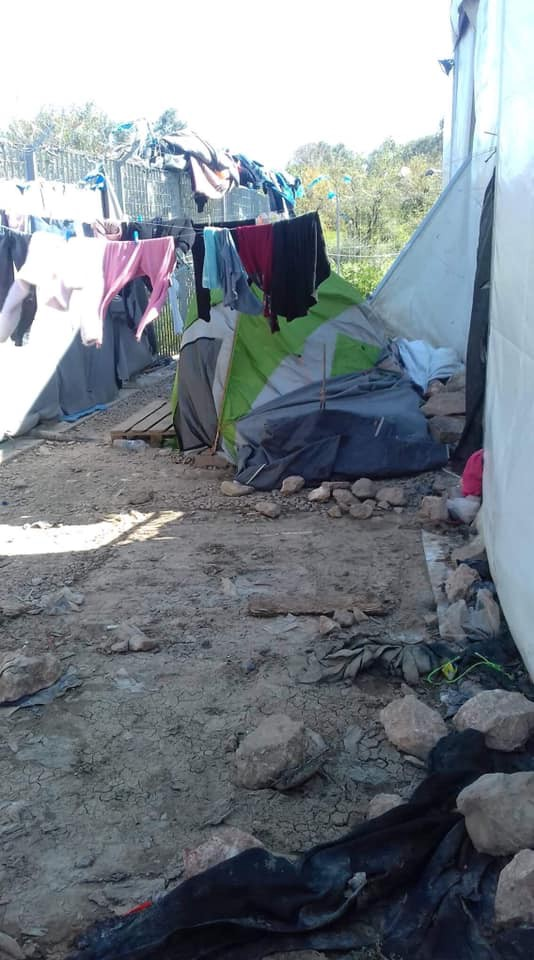
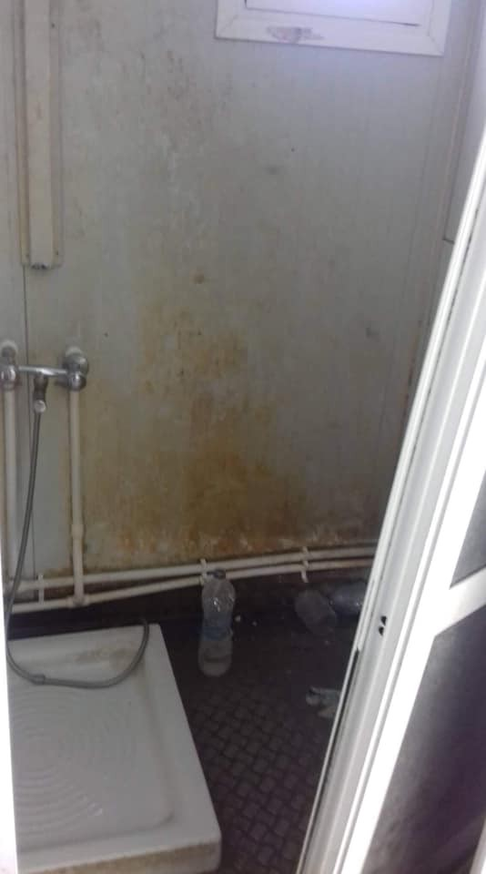
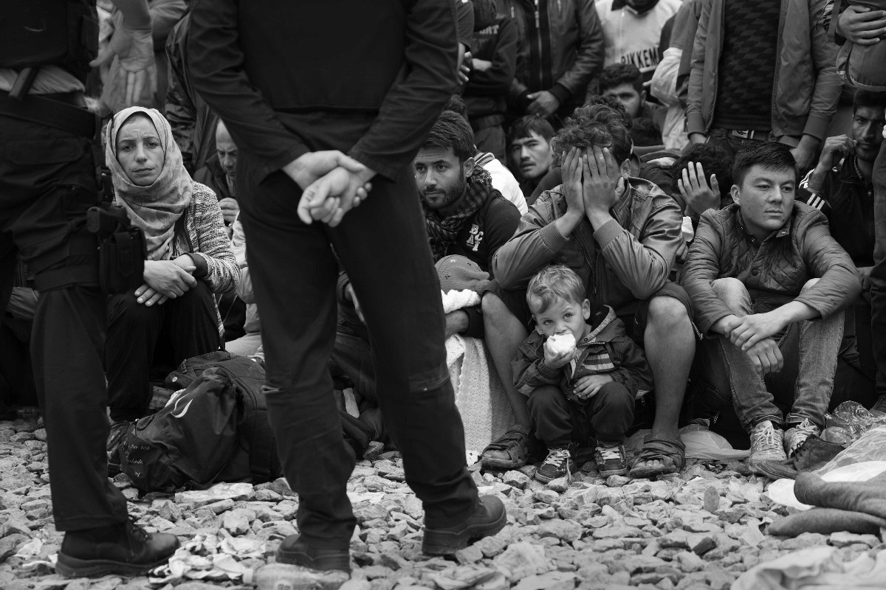

### AYS Daily Digest 1/4/19: Croatia called out by the members of the EP
#### 30 members of the European Parliament publicly called out Croatia for the illegal practice of pushbacks and acts leading to criminalisation of solidarity / Greece: Poor conditions remain in Vial, Chios; Xenophobic requests of parents on Samos against children’s school enrollment / violence by the authorities ongoing in France / more news…

[Are You Syrious?](https://medium.com/@AreYouSyrious)

Apr 2

 , by Hrvoje Polan, “ [master of photography and a brave man](http://novilist.hr/Vijesti/Hrvatska/Preminuo-Hrvoje-Polan-majstor-fotografije-i-hrabar-covjek) ”](assets/9cb5bc1c1800/1*mkZKKuWnGo0atPGcPxQr4g.jpeg)

This news digest features photos by Hrvoje Polan, a photographer and storyteller who tirelessly sought to tell the world what was unfolding in front of his eyes, covering refugee routes and war zones across the globe, and for his work and selfless dedication we give him a modest homage this way — in memoriam\. Feature photo from a series titles Stories about nonsence, source: [grain\.rs](https://grain.rs/2018/09/14/hrvoje-polan-price-o-besmislu/?fbclid=IwAR03YtcPiFSYRLrAGFEZYfhjn31W8ODVvfrQ_LhtbvI-Hb1U2_pGxmVKhXI) , by Hrvoje Polan, “ [master of photography and a brave man](http://novilist.hr/Vijesti/Hrvatska/Preminuo-Hrvoje-Polan-majstor-fotografije-i-hrabar-covjek) ”
#### FEATURE

At least 7,000 people have been pushed back by Croatian border police from Croatia to Bosnia and Serbia in violation of international, European and national laws\. As a consequence and direct result of the many reports of several NGOs and many individuals present on the ground, in a long awaited coordinated action, 30 members of the European Parliament have published a [letter](https://www.guengl.eu/content/uploads/2019/04/Croatia-and-Bosnia-push-backs-Letter-EC.pdf) in which they publicly denounce the pushbacks of refugees and criminalisation of human rights defenders through pressure on NGOs and activists\. The letter explicitly states the case of an AYS volunteer as an example, and refers to the reports we helped form and push forward, alongside activists from Bosnia and Herzegovina, NGOs No Name Kitchen, MSF, Amnesty International, and others\.

■■■■■■■■■■■■■■ 
> **[The Left in the European Parliament](https://twitter.com/Left_EU) @ Twitter Says:** 

> > 7000+ #refugees have been violently pushed back & denied asylum by #Croatia border police to #Bosnia & #Serbia over past year: a violation of international & EU law! 

Read our letter to @[EU_Commission](https://twitter.com/EU_Commission) demanding action-both procedural & financial now! ⤵️

[guengl.eu/content/upload…](https://www.guengl.eu/content/uploads/2019/04/Croatia-and-Bosnia-push-backs-Letter-EC.pdf) https://t.co/tRj6YtgSmI 

> **Tweeted at [2019-04-02 08:30:58](https://twitter.com/guengl/status/1112995826291408896).** 

■■■■■■■■■■■■■■ 

At the same time, we spoke out in the Parliament against the practices of our own governments and their border allies, Frontex, the criminal Libyan Coast Guard, and others, following the European Parliament Resolution from July last year on [Guidelines](http://www.europarl.europa.eu/doceo/document/O-8-2018-000065_EN.html) for Member States to prevent humanitarian assistance being criminalised, in a follow up that took place in the EP on the morning this news digest was finalized, April 2\.

> At the same time, hypocritical deals continue: 

■■■■■■■■■■■■■■ 
> **[EU Council Press](https://twitter.com/EUCouncilPress) @ Twitter Says:** 

> > Council confirms agreement on stronger mandate for @[Frontex](https://twitter.com/Frontex)

Find out more ⬇ 

> **Tweeted at [2019-04-01 10:30:31](https://twitter.com/eucouncilpress/status/1112663525514723329).** 

■■■■■■■■■■■■■■ 

The deterrent effect that is widely created by the individual prosecutions is shown in detail in a study that was unfortunately not read by most of the people present at the Committee meeting of the Committee on Civil Liberties, Justice and Home Affairs\. “You have to understand the chilling effect of what is happening”, Claude Moraes said, adding: “I don’t want to ask Frontex anything\!”, though the representative of Frontex had no problem in stating a number of things that simply aren’t true\. Most of the EP members, however, seem to have seen through that\. 
The president of AYS spoke of our own cases of pressure put on our volunteers who are constantly working to help inform the public of what is taking place out there on our borders, but also inland\. We have decided to come forth, as the only NGO who was present during the discussion, because our responsibility as European citizens asks us to speak directly in the faces of those who decide and because our anonymous defeatism would not bring about any change or help the lives of those we strive to support\. We spoke on behalf of our volunteer and activists friends all over the continent who have faced persecution and restrictions to their SAR and other work, and hope that these sort of small actions contribute to bringing about a visible change\.

by Hrvoje Polan, published in: Pescanik
#### SEA

As the EU is leaning toward reinforcing support to the Libyan Coastguard and Navy, while suspending its own boats for SAR missions, red flags are coming from many sides\.

■■■■■■■■■■■■■■ 
> **[sea-eye](https://twitter.com/seaeyeorg) @ Twitter Says:** 

> > Trotz schlechtem Wetter verbleibt die #AlanKurdi weiter in der #SAR Zone. Wir bleiben, weil sonst niemand hier ist, um Wache zu halten. 

Sea-Eye schützt #MenschenstattGrenzen. Bitte unterstützt Sea-Eye: [sea-eye.org/spenden](http://sea-eye.org/spenden) https://t.co/i5PwPqHZTZ 

> **Tweeted at [2019-04-01 13:36:51](https://twitter.com/seaeyeorg/status/1112710418773012481).** 

■■■■■■■■■■■■■■ 

■■■■■■■■■■■■■■ 
> **[sea-eye](https://twitter.com/seaeyeorg) @ Twitter Says:** 

> > Trotz schlechtem Wetter verbleibt die #AlanKurdi weiter in der #SAR Zone. Wir bleiben, weil sonst niemand hier ist, um Wache zu halten. 

Sea-Eye schützt #MenschenstattGrenzen. Bitte unterstützt Sea-Eye: [sea-eye.org/spenden](http://sea-eye.org/spenden) https://t.co/i5PwPqHZTZ 

> **Tweeted at [2019-04-01 13:36:51](https://twitter.com/seaeyeorg/status/1112710418773012481).** 

■■■■■■■■■■■■■■ 

#### TURKEY

The [German Alliance for Civilian Assistance e\.V\. — gemeinnützig](https://www.facebook.com/germanallianceforcivilianassistance/?__tn__=%2CdkCH-R-R&eid=ARBHYYj0a9gk5xljUkOI-cDxVZm9zq7RJoXyFHCYXn2OrHh-82tSXkdxDQogYy43GMMlCMO_Hexz9f4b&hc_ref=ARQQ7fFTSZpuy2HfF7CEZcfXe6aN-4dqdDOrjukpIcv7Alrruz17J1Ssc3GJNn-p4yA&hc_location=group) is no longer active in Turkey, as of March 30, they announced\.
#### GREECE
### A photo story from Chios

New photos from a long\-term resident of Vial Camp were shared with us, followed by what he wrote:
“There are many tents and containers\. People are in very difficult situations\. There are three sections in all of Vial Camp, Sections A, B and C\.
In Section C, all new arrivals are living there\. Inside the big tents we have small tents\. They have bad situations for health care and for cooking places and for other things\. There people ask for many things like shoes, summer clothes, etc\. \[Right now\] these are the most important things as they said, and as I noticed\.”

[Mobile Info Team](https://www.facebook.com/mobileinfoteam/?__tn__=%2CdkCH-R-R&eid=ARAlFpEgcWT8ZnDXJTFvD20ePW8Hqk0ZvP8sUATYS3IL2yzaOYC92UFfYB9RSF63_gO0krVraETh8r_t&hc_ref=ARRbOt4ZOsAdsG4oyFJAl8z5-NAWitcT_bCNxQlVYIHj0TgiSntKoLqJS7mhGCJq-j8&fref=nf) reported on the updated situation regarding people who left Greece illegally and went on to Germany\. They write:

> New statistics by the Greek Asylum Service show that the vast majority of asylum seekers that leave Greece illegally cannot be returned back to Greece\. Please keep in mind that these statistics only cover asylum seekers and not people who have already received asylum status\. Greece is responsible for the asylum claims of people currently in the Greek asylum procedure, and they should be transferred back if they leave illegally\. However, the Greek state is rejecting applicant take back requests in over 97% of cases, so people instead are allowed to stay in the country to which they went\. In 2018, out of 9000 requests from European countries, Greece only accepted 233 cases and only 18 people were actually transferred\. Germany is the country with the highest requests with more than 6500, followed by Sweden, Belgium and Norway, with around 500 requests each\. 

### Samos

The majority in the North Aegean Regional Council supports the xenophobic resolution of The Parents ‘ Association on the island of Samos, an NGO reports:

■■■■■■■■■■■■■■ 
> **[Seebrücke Frankfurt](https://twitter.com/SeebrueckeFfm) @ Twitter Says:** 

> > 🇬🇷 Eine ausländerfeindliche Entscheidung bestreitet das Recht von Flüchtlingen auf Bildung: Mehrheit des Nordägäis-Regionalrates unterstützt xenophobe Resolution der Elternvereinigung auf #Samos
#Refugeesgr #MigrationEU

via @[_Wiesenthal_S_](https://twitter.com/_Wiesenthal_S_)
[voreioaigaio.ert.gr/eidiseis/lesvo…](http://voreioaigaio.ert.gr/eidiseis/lesvos/antarsia-sto-aigaio-quot-xenofoviki-apofasi-arneitai-to-dikaioma-ton-prosfygopoylon-stin-ekpaideysi-quot/) 

> **Tweeted at [2019-04-01 12:19:55](https://twitter.com/seebrueckeffm/status/1112691056292839424).** 

■■■■■■■■■■■■■■ 

### The March — what is going on?

We are forwarding information regarding the recently often mentioned possibility of a big march from Greece\. Refugee Info writes: “At a meeting in Athens last week, the major national and international organizations in Greece confirmed that they will not escort or support the march in any way\.”

> “Attempts to cross borders irregularly are often unsuccessful, and can bear serious consequences including arrest, detention, family separation and even death\.”

You can read the joint statement [**here**](http://goo.gl/XPqWnN) \.
#### FRANCE

Unprecedented and disproportionate violence is ongoing by the authorities, [Solidarité migrants Wilson](https://www.facebook.com/Solidarit%C3%A9-migrants-Wilson-598228360377940/?__tn__=%2CdkCH-R-R&eid=ARA8Y_T8hgh2FaIMw0AIPFSGSGdPbwNzb-0Y2lwwG1WrmnTzxoOS0ZT38Ndgkl52zyAkD3DVK_APa0zI&hc_ref=ARQukNu5nccyXGhg8SB5fcMBJ2iqTlE1muprU1h-dxlfyd6SMSd0eLeGCPJ3D4q3pnc&fref=nf&hc_location=group) team reports, claiming this video also goes to prove the opposite of what has been said in the past days regarding the behavior of people on the move\.

[[ ALERTE INFO ] Vidéo qui infirme la déclaration (au micro de France3), de M. le Préfet du Doubs](http://www.youtube.com/watch?v=5m_Ntz5uXH8)
### Paris

There are many newly arrived people in the city\.

The volunteer teams distributing meals need help and people are welcome to join them at the next distribution:
Tuesday, April 2, at 20h near the l’Église Saint Geneviève which is at the address 139 avenue du Président Wilson 93210 La Plaine Saint Denis\. \(Come from 19:45h onwards so everything can get organized on time\)

Write to: wilsonsolidaire@gmail\.com to announce you’re coming\.

[Faces Before Numbers](https://www.facebook.com/FacesBeforeNumbers/?__xts__%5B0%5D=68.ARCv1BtR1VRS72shaK9hoezcQfcg5EZraJHSDqD1aly1Eff83UpMZdtqhdAIWhelDkXP9hB03QkgfGcXFDuAbgAVZ6MgbqXAihrTCRr64q1xlOD_LsZ7cBogpZ6xWQarsg1OG1iqhIW0RAi-wS9vb3432TRnQTXAX9U6IY09PNCAKB2mWyrZDHKuruUBlr4Nfje5hA0_ICBI28zHRm6HJ3uDVnNlwzDUAxotkMiVL4j600krkYZ570ydgNfLAz_Pfd8gJHMmM9XlJqJYdU27TSBEpDv7fTKd-MtZ9V7ZInDnSV3L7VPr0tezG9FZnXT6oOaABsRNEoBl9SUcQREGd0A&__xts__%5B1%5D=68.ARAMU7nVQB7ApYJbjoY7oXAug0yyHu5GqYvMLwmJB-OIMAt-ewCdKXgHTjTG_QmJQE4tz4-fDsoJNJ605eMZ5ff4hb0aJV5A7y2IKe71rWLyl91BTd_r1LlCtn_ztQSsSoIhRuXpICR1Pf0EQJ_gs_sZ2Fs3wRdplFBI_vZgXzt3W-xn1myO_R1ZFYLRB8bS26JxTRLNvn2eSgTreZtcbKnr1NJ11wo8b_yf1RGWY3JgV3aBQ8eMG6Sxl0xNcpAPIi-xarljEIZxaWbnXGS6n-L5jNBsg-6Sh2lpEdvblBi_diCz1KELVzevSmLy27XPuRIkcHV3K3VkY_OaiFFa9BU&__tn__=kC-R&eid=ARBACyj6ObcPWvYL7JTsRLSQDUgc5MCiW2KBVAQVLEAoVgKiEJI0dnLus4jBTj7Wlq3UHXmoQeSnqqby&hc_ref=ARQJIYL690jD3nMRfvGjsDijJA579DoTNH4P4AX-012hjnv5YdSyiygxGxiBk9Ttack&fref=nf) report of worrying conditions in the city:

> This is one of about thirty tents or makeshift huts used as shelters by close to 50 people\.
 

> This place runs along a highway, meaning the noise is never ending & pollution is high\.
 

> It is also a grassy area, meaning the place becomes extremely muddy when it rains\.
 

> That’s not it — this place is full with rats — huge rats\. 
 

> Rats that crawl all over the place, walk on feet and get into tents with no fear\.
 

> Rats that eat people’s most important papers and only backpacks\.
 

> Rats that are full of diseases and do not hesitate to bite, to defecate in people’s blankets during the day and climb on sleeping bodies during the night\.
 

> A friend who sleeps there tried to laugh about it saying they were their sisters, before actually explaining that it was unbearable\.
 

> All the people sleeping there have claimed asylum in France and have the right to be in France\. They are also theoretically entitled to get accommodation and a small financial support\.
 

> Yet they’re all sleeping rough among rats and depend on food & clothes distribution to survive\.
 

> The guys explained that the city hall of Paris used to come & pick up the garbage — like they do everywhere else — but stopped doing so weeks ago\.
 

> This means garbage is left two meters away from tents and is attracting more & more rats\.
 

> Men & women sleeping there incredibly manage to keep their sense of humour, resilience and strength in these terrible conditions but who can decently live in these conditions?
 

> It is a disgrace that people seeking refuge are abandoned the way they are in Paris makeshift camps\. 

](assets/9cb5bc1c1800/1*diXOgUUfrT367MqEWvFxMw.jpeg)

[Faces Before Numbers](https://www.facebook.com/FacesBeforeNumbers/?__xts__%5B0%5D=68.ARAMU7nVQB7ApYJbjoY7oXAug0yyHu5GqYvMLwmJB-OIMAt-ewCdKXgHTjTG_QmJQE4tz4-fDsoJNJ605eMZ5ff4hb0aJV5A7y2IKe71rWLyl91BTd_r1LlCtn_ztQSsSoIhRuXpICR1Pf0EQJ_gs_sZ2Fs3wRdplFBI_vZgXzt3W-xn1myO_R1ZFYLRB8bS26JxTRLNvn2eSgTreZtcbKnr1NJ11wo8b_yf1RGWY3JgV3aBQ8eMG6Sxl0xNcpAPIi-xarljEIZxaWbnXGS6n-L5jNBsg-6Sh2lpEdvblBi_diCz1KELVzevSmLy27XPuRIkcHV3K3VkY_OaiFFa9BU&__tn__=k%2AF&tn-str=k%2AF)
#### IRELAND

The Irish Refugee and Migrant Coalition expressed serious concerns over the announced termination of Operation Sophia in six months\. The Coalition comprises 23 organisations that seek to advance the rights and dignity of people on the move and those in need of international protection\. They have called on the Irish Government to try to work with other EU governments with a view to maintaining the presence of the Irish navy “and to **continue but improve** Operation Sophia\.”

> Ireland’s response must find solutions based on the legal frameworks and human rights principles to which we are already committed; instead of rowing back, Ireland can and should do more, along with other EU leaders, to increase resources for the real integration of migrants, who have so much to offer our societies\. 

Photo by Hrvoje Polan, published in kulturista\.hr

**Apart from daily news in English, we also publish weekly summaries in Arabic and Persian\. Click on those links to check out the ones about the week from the 25th to the 31st of March\.**

**We strive to echo correct news from the ground through collaboration and fairness\. Every effort has been made to credit organizations and individuals with regard to the supply of information, video, and photo material \(in cases where the source wanted to be accredited\) \. Please notify us regarding corrections\.**

**If there’s anything you want to share or comment, contact us through Facebook, Twitter or write to: areyousyrious@gmail\.com\.**

_Converted [Medium Post](https://medium.com/are-you-syrious/ays-daily-digest-1-4-19-croatia-called-out-by-the-members-of-the-ep-9cb5bc1c1800) by [ZMediumToMarkdown](https://github.com/ZhgChgLi/ZMediumToMarkdown)._
