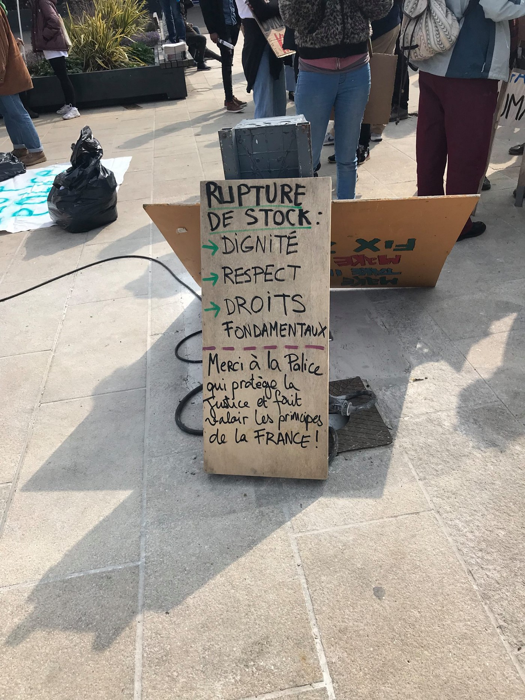

### AYS Daily Digest 3/4/19: The most severe verdict in trials over anti\-deportation protesters for acts of solidarity
#### Iceland court sentenced two young activists / 50 people missing at sea, LCG ignores calls for help / Resettlement plans the Croatian way don’t sound good / PACE rapporteur expresses extreme concerns after the visit to Bosnia and Herzegovina / more news

](assets/89b57b2dcc87/1*ZbXPEpOSEatTOtzN_vdUzw.jpeg)

Photo: [**PROEMAID**](https://twitter.com/proemaid)
#### FEATURE

A decision by an Icelandic court was reported as the most severe verdict in any trial over anti\-deportation protesters for acts of solidarity, throughout Europe, in recent years\.
In May 2016 they entered an airplane at Keflavík Airport as passengers, but then stood up \(inside a still\-standing plane\) \. Then, they explained to passengers that “a man was being unjustly deported on that flight, that his life was thereby threatened, and that they would refuse to sit until he had been safely escorted out of the airplane\.”

For their act of nuisance during a deportation, Jórunn Edda Helgadóttir and Ragnheiður Freyja Kristínardóttir were sentenced to two years on probation\. As those involved in recent such cases were not sentenced \(in the Stansted 15 case the activists were released and Elin Ersson was fined, but received no prison sentence\), this decision comes as a precedent that could possibly be used for justifying further pressure on human rights defenders\.
As in the case of the AYS volunteer who was wrongfully accused of aiding an illegal border crossing, the arguments of the judge in the case of Helgadóttir and Kristínardóttir were vague, as she stated: „Freedom of expression and assembly have certain limitations and cannot justify the defendants’ actions“\.

> The court sentenced Jórunn and Ragnheiður to three months in prison, to be served on probation for two years, and to bear the cost of court proceedings, amounting to over €8,000 for each of them\. 

#### SYRIA
### Floods in the north of Syria

Storms swept away hundreds of tents used by internally displaced families, with rainwater damaging the few goods and possessions they had with them, reported the [media](https://www.middleeastmonitor.com/20190403-floods-in-north-syria-destroy-camps-hosting-40000-people/?fbclid=IwAR3_WwRnp7kRb94pjb3adTZ3HmHCAvYB69O8wKoo_AUWtrbKBm2U2OvL1OI) \.

More than 40,000 displaced people are living in refugee camps near the Turkish border, announced the UN\.
#### MOROCCO

[Association Marocaine des Droits Humains — Section Nador](https://www.facebook.com/AmdhNador/?__xts__%5B0%5D=68.ARBhLyaRhczyl9mwIQPSzMjUCXMrWtkdOHIdA_G_lJNb5FvrDRhSTKY4LjlKwICFPXKjppVV9j469C_9k42EiOy9TqqUe48aDKWfqcOQrGr4oHJuO9qAd-kjQfpiOGdcNlW44AhI-v2HUxsBkmPnUVBjzikYwNuzPX5BbHBwYONvuVjGXlPhabjRm3QvRHmDRXny8-FAlE24fA-2lTfgMMxha2H4Lui_RmwzlVqL9G47ewwc86BxQRXqRw-ndqWFNn92duQM37wehNt4TCLv-x3YVq8m3clj4uzwqc0324wVctL4iTVRbyDphDcPoehLmLgL3ylRNi6Nx6Vje5HNF7kgNWGuYWwp13eCKdx4h-WAePAEjnuTqSCS&__tn__=k%2AF&tn-str=k%2AF) reports that more than 50 people managed to reach the Moroccan shores during the day\.

](assets/89b57b2dcc87/1*1LKRn2BLCFWG0dihW0y2Tg.jpeg)

Photo: [Association Marocaine des Droits Humains — Section Nador](https://www.facebook.com/AmdhNador/?__xts__%5B0%5D=68.ARBhLyaRhczyl9mwIQPSzMjUCXMrWtkdOHIdA_G_lJNb5FvrDRhSTKY4LjlKwICFPXKjppVV9j469C_9k42EiOy9TqqUe48aDKWfqcOQrGr4oHJuO9qAd-kjQfpiOGdcNlW44AhI-v2HUxsBkmPnUVBjzikYwNuzPX5BbHBwYONvuVjGXlPhabjRm3QvRHmDRXny8-FAlE24fA-2lTfgMMxha2H4Lui_RmwzlVqL9G47ewwc86BxQRXqRw-ndqWFNn92duQM37wehNt4TCLv-x3YVq8m3clj4uzwqc0324wVctL4iTVRbyDphDcPoehLmLgL3ylRNi6Nx6Vje5HNF7kgNWGuYWwp13eCKdx4h-WAePAEjnuTqSCS&__tn__=k%2AF&tn-str=k%2AF)

■■■■■■■■■■■■■■ 
> **[Alarm Phone](https://twitter.com/alarm_phone) @ Twitter Says:** 

> > BREAKING: another boat off #Libya in distress! At 10.30 CEST, we were called by 64 people, including up to 10 women, 5 children and 1 infant, in urgent #distress. Later we received their GPS position, near Zuwarah. Authorities called to this case couldn't be reached. https://t.co/02fkeGQWii 

> **Tweeted at [2019-04-03 13:18:43](https://twitter.com/alarm_phone/status/1113430631852199941).** 

■■■■■■■■■■■■■■ 

At around 11:00 a\.m\. CEST, the people on board informed Alarm Phone that they needed medical aid\. The team then contacted the Libyan authorities and the Alan Kurdi SAR vessel that have been searching for a group of 50 people who were missing on Monday\. The vessel was closest, they spotted the boat, and carried out a successful rescue operation, rescuing the lives of 64 people\.

■■■■■■■■■■■■■■ 
> **[sea-eye](https://twitter.com/seaeyeorg) @ Twitter Says:** 

> > ⭕️ Manuel ist 6 Jahre alt. Er wurde gerade von der Crew der #AlanKurdi gerettet. 

@[alarm_phone](https://twitter.com/alarm_phone) meldete heute Vormittag einen weiteren #Seenotfall. Alle 64 Personen sind sicher an Bord unseres Schiffes. 50 weitere Personen werden nach wie vor vermisst ‼️ https://t.co/tI1mRprdNK 

> **Tweeted at [2019-04-03 14:16:16](https://twitter.com/seaeyeorg/status/1113445115434033153).** 

■■■■■■■■■■■■■■ 

50 people are still missing\. The coordinate has reportedly been known to the Libyan coast guard since the morning of 2 April\. [Watch The Med\- Alarmphone](https://www.facebook.com/watchthemed.alarmphone/?__xts__%5B0%5D=68.ARDaHbKwy7Yo7sS0Z7RFpeURlctuRAhp6mhG1-EP9wjblBeL6167d3PkYakmpZwa0bb8MUp_hyA48Eb6KYWNrKPQG14Bia2gQMDIofNjRpHh0zwMX5NtVY-PCn_JCmssgkHwD_IpYTdD0VH5QyZBfPrHzeNl7SZTE-JksnJodvNX1AekbXfylNTSWstftRgRXpXeokMHI9c8Spm7xA0gUn_TGaNeiBhqDhtmV-_K7xktjb91S_EgCTFR4_pRxIen4g_YUnB3Rf0p288DmNdLbyPRM72vcrV0DXJr-0ojvIwD_F9A8r7CVMDJ_A6-BBxX6Ck4gpx9dX5EQkbYDWZO7bfOKg&__xts__%5B1%5D=68.ARAgiZYowBkVhKLTiBOLOfZjQqYWX4UpPup9GxliytVXJ45BPIxUAIH71gEv5OufO7QIsfs0Wh8u4bE_r7j-g4lUK0sdTkg4qiUk0PLyFrplhQjpRMJVxn8w8O3AnQdPPdHGYyjhtEDrli1qZlYl9d0cYgQR6DPqDdhI6yMjDRwFNVLEGo5zcKjh2sfo_tloGIMeO5t9MFK5XcP7WXUStOdx_wLQbAJenc4MiLfu8szUx9KR8LoUL91hp9ovk_osszb7wC2Y3uI0q6YM_U8uQNFiXpm3XA5ARZZlUQ1cRjNnJIMwjlwf2hQwztioYl08YgE7LCenqAbx_Xr7O0kkZMkU2Q&__tn__=K-R&eid=ARBFiQ1GSZxvRGowZX8wsOd9zvgw2fy_dIJ4P_8o-3Cbl2nMsYxE2Kpt4aRDlpOQXPDp8oC4Hlp67AoM&fref=tag) shared the last known position\. However, the EU backed Libyan Coast ‘Guard’ allegedly won’t be setting out to find the vessel if the location is unknown\. They seems to be missing the point of the search and rescue mission, as many have noticed\. Other organisations are doing all they can to organize an aerial search\.

■■■■■■■■■■■■■■ 
> **[ProemAID](https://twitter.com/proemaid) @ Twitter Says:** 

> > 🔴 La tripulación del #alankurdi,  el barco de @seaeye_org rescata a 64 personas en el #Mediterráneo. El Alan Kurdi (con un equipo de @[proemaid](https://twitter.com/proemaid) a bordo) es el único barco en el mar, es la última esperanza para los que lo han perdido todo y para los que nunca tuvieron nada. https://t.co/LVlWBfDYu9 

> **Tweeted at [2019-04-03 18:46:41](https://twitter.com/proemaid/status/1113513166883958784).** 

■■■■■■■■■■■■■■ 

#### TURKEY

A boat was reportedly stopped outside Yaliköy, Didim, by TCG\. The boat was heading towards Agathonisi, carrying 41 people, 17 children, seven women and 17 men were arrested\.
#### GREECE

Arrivals

■■■■■■■■■■■■■■ 
> **[Aegean Boat Report](https://twitter.com/ABoatReport) @ Twitter Says:** 

> > One boat arrived on Nero island north east of Agathonisi 06.30. Will most likely be transported to Samos.
32 people 
Numbers not confirmed.

Also reports on a n a speedboat that put off 9 people on Kos 02.00.
Numbers not confirmed. 

> **Tweeted at [2019-04-03 05:37:01](https://twitter.com/boataegean/status/1113314441234395136).** 

■■■■■■■■■■■■■■ 

One boat arrived on Nero Island northeast of Agathonisi at 6:30 a\.m\. It will most likely be transported to Samos, reported [Aegean Boat Report](https://www.facebook.com/AegeanBoatReport/?__tn__=%2CdkCH-R-R&eid=ARBtUBxCpyW8jK8t-4SgOmrKO2zO91bPTdR8-ERmGs12dNl7ZqPv2kNVwCW6QqTNRW8uxtIvbsZQ8jXL&hc_ref=ARRYREhIZ17T1s8KwruWz6-BU6Ai_ov3FoXnyYEqTVU3r9MOxqGCGEyid86QNdZCEx4&fref=nf) \.

> One hundred forty\-one boats arrived at the different islands in March, while 214 were stopped and sent back, amounting to almost 3,000 people who will have to pull themselves together and try once more to make the treacherous crossing in search of hope\. — Samos Volunteers 

■■■■■■■■■■■■■■ 
> **[Doctors w/o Borders](https://twitter.com/MSF_USA) @ Twitter Says:** 

> > After fleeing violence or poverty, people crossed the seas only to be stranded in Moria, often re-traumatized in unhygienic, inhumane conditions.

Kids need a safe environment to come to grips with what they've been through. #LetThemOut #mentalhealth
[bit.ly/2YVPsFY](https://bit.ly/2YVPsFY) https://t.co/ZjX3op5lyj 

> **Tweeted at [2019-04-03 20:46:59](https://twitter.com/msf_usa/status/1113543439105363968).** 

■■■■■■■■■■■■■■ 

According to the official statistics by the Ministry, on 1 April there were 7041 people on Lesvos, 1548 on Chios, 3967 on Samos, 1042 on Leros, 828 on Kos and 77 on the other islands\.
### The right to an education

The president of the Greek Primary Teachers’ Federation spoke at a meeting at the Samos Town Hall about marginalized refugee children and Greek families who have known long\-term hardship, with a focus on education\. At the meeting, where there were discussions between teachers associations, parents’ associations, and the Greek Primary Teachers’ Federation, among others, he stated:

\(…\) And these problems would not exist if there were better organisation, if there were no waiting lists for asylum interviews and relocations, if funding could have been released and meaningfully channeled\.
We all agree that the education of children should be the main concern of teachers and parents, and we offer our support to public schools to ensure they can continue to function with our help\.” See more [here\.](https://www.facebook.com/JacobWarn/posts/10156059009426190?hc_location=ufi)
### Volunteering

[InterVolve](https://www.facebook.com/InterVolve/?__xts__%5B0%5D=68.ARBqhvIfCH3-v04XPkx_nBlZ3xEdvb4D84vCiMbk1omLf8lsbEEeO2tqZAxN56aBwUbj0RAgpn7cjv9yxgMIgWdjPx3fgUxVaohUpfs_ZWfF9ICTuHW6QV1HqgY_i8psOTCsShD9JnR7f0OioxKimJklBymByKBedFp35h2ZGX768uee-xGws_eN-f6I3o3oSOu0dt4ZC_USiUN31DsW37c84oKwMv76cXRgfX3P45bI36F76WBWuFg6gpZSabz9iLcovuyIAoacZP2vxNS4CPuym-Z3bxdex3pFLPqgrI4hdytCQnyfvrLTBPKPJY6NNgx1Y8u7T4MUd9cKa2N5874&__tn__=k%2AF&tn-str=k%2AF) is looking for a Persian\-speaking mediator\. This is a volunteer position in Larissa, and we work six days per week\. They are looking for candidates who can commit to at least a three\-month stay\. See their [Facebook page](https://www.facebook.com/InterVolve/photos/a.256091268062602/826757200996003/?type=3&eid=ARARtvSDZHD9_Q2Q2PiA0woKh4vtH6F-V_dB2hzfkPuhlPB3Q-a_yUgM-3WrdWxZRfavl6OA6acazdG5&__tn__=EEHH-R&hc_location=ufi) for more information\. If interested, please e\-mail Matthew at info@intervolvegr\.com\.

[No Name Kitchen](https://www.facebook.com/NoNameKitchenBelgrade/?__xts__%5B0%5D=68.ARDkiV740llmZv-dlpW2tIWS_hLwuW7vMVCkfOvZYnJH14oLnIdv84JFV3qSanRB5G-WixVf8rdLja1KBo5O4AScj-r9Hx4nz7dkh2UjxQupp6u4XQpodLUwfRpMR2sS9FkIZxWKiT_gSo4XQDYQyD_uflXzInD-arIM_YMBLVhj0pQ4CwrPVgNflnuaWlTv1x0s-5s80P2ZFWALki4EDqPfc-i4_MLkReNU2W26FckOjopZOTQ7Q9rT6EJIAvRUBFBqhdQAXOdfC5DyYHs8MzjqUIWcLu_UKE72JEdPC6PeDA93cefOD2S58S5SAy6FbCL9mkRd9QmRZlZn48I7scY&__tn__=k%2AF&tn-str=k%2AF) needs a health professional in Patras, contact them directly if you or someone you know might help\.
### Solidarity assembly

Following the assembly of the NGOs concerning the recent plans by the Ministry, here is a part of what the statement to the assembly said —

The existing form of ‘’NGO\- management’’ of refugee needs in health, housing, education, legal support, transportation, interpretation, etc\. creates and maintains, with the approval of the state, a marginal situation that contributes to their victimization and control, the repression of refugee populations and the containment of refugee flows, while leaving room for a large profitable “pool” for its partners, the NGOs\. 
They also said that the Greek government does not hesitate to use the asylum\-seekers who are stranded in Moria due to the state’s decisions to justify the cruelty it imposes on the lives of the refugees in the center of Athens\.

The managements of big NGOs in Greece accepted the decision and share responsibility in implementing the eviction plan by adapting it to their own business plan\.

> Following the logic of maximizing profit, NGO managerial bodies have over the years been basing their function on a series of employers’ arbitrary decisions and have invested in overexploitation of their labor by violating labor legislation while creating and maintaining a working galley status\. 

> We demand resistance to the application of the decision of the ministry and its partners which enforces the homelessness of refugees\. 

> We call and support NGO employees not to implement orders which stand contrary to the assurance of decency in living and to abstain from any kind of implementation or preparation of eviction\. 

> We resist the orders of the NGO managers in implementing this decision\. 

> Solidarity to the refugees who will resist the implementation of this decision\! 

Find the whole text at the site of [Σωματείο Βάσης Εργαζομένων σε ΜΚΟ](https://www.facebook.com/svemko/?__tn__=%2CdkCH-R-R&eid=ARDBStEsi-d3SOGM_Gr-XGvqMDLU69FUqeM8l05HqZ2cy418F0eDYq88yUTep0gQa6ZKWplEgZ1lezCz&hc_ref=ARRL4VyPusmQ1dv_HjcNPk6fjQF6d1KrouT5peg9PkhaX5rmjKt3XIB3QmEi8NEOVeA&fref=nf) \.
#### SERBIA
### The game and the violence continue

No Name Kitchen volunteers have been supporting the people staying at the border town squat in Šid, providing food and basic amenities to those stuck in the limbo of the route\. They claim that on a daily base they meet many young people who come back in the morning, tired, some without their belongings, and tell the volunteers about attempts to stay within the EU but that this doesn’t work even if some have in fact requested asylum, they write\.

> After thorough interviews to ascertain what really happened during the long nights locked in trucks or walking through the weeds, we transcribed and re\-wrote the material to bring this reality to the maximum number of people possible\. Human rights violations cannot go unpunished and on behalf of No Name Kitchen we will continue to denounce what really happens at the doors of the European Union\. 

#### MONTENEGRO

70 people were granted international protection in Montenegro, of whom 35 are still in the country, UNHCR reported\.

3075 persons applied for asylum in Montenegro, and 4,625 people expressed their intention to seek asylum, [the media](https://l.facebook.com/l.php?u=https%3A%2F%2Fm.cdm.me%2Fdrustvo%2Fazil-u-crnoj-gori-trazilo-vise-od-3-000-migranata%2F%3Ffbclid%3DIwAR1PnaNZTR1xFfDdJb1tSOzKN-whHySnwviIN6QKCLK7ad4_V_1JstB931M&h=AT0Kw4AO2CL-KPFXrMJEz6G0MEoqtRPlIbDasZ1_q9Kb3PGdZHtD8iqwk4xklblZQZi9-6JOGTtqroqHK4e-a8Ww7n9I-SDVzVG_5blhjl-XqQxRzNpzhyoRNLAiUcPH5pCqzZo5afTCAs92W4pjmOqHkEI6kWYbW_qOK-MhQN0kDR2MZ8ko_lXzDLwzroOPnnkTOX2rZT_y8p4zVz63GuFNhs8YtTTKclYKb0_n-I-3JhDD4fXPPKowoRjyHDGkhktB59p_yDRfZqaoEakZE8oxN-FfTWmJGQ8IoHqbu3Vl5ASaziJ6NsXkuQefHrMXGBilFQaW7OLdUZf-ypxafOTWKdyuUgFPhTkzxuYI0wboDbSspy3J6yXkamkUOwBoFa1EgGAPMDZrWoM87TPkOGSD8P_B34SV7slcrkA97wD3bCdd8PH-XPotq57Fgd-6fKTa5JVq17p74M5joKNyQEySyPFc3ziAfU0wBdz5E6kLs7P--G0TyBNMfLKEjmdn4BU2XNw62W6hevruBVelaTQJClcx3MVofMTtrkVDHh0LiSzirmBpqHzj5Qwk01lU1MbdPJODnOZej72vdGyY8tU3vYAZ1pBP) reported after the UN agency published their statistics\.
The largest number of asylum seekers originated from Syria, Pakistan and Algeria\.
#### BOSNIA AND HERZEGOVINA

> “The discrepancy between the statements of the Croatian authorities and the worrying and consistent reports by other actors remains problematic and will be further analysed in my report\.”

The Council of Europe has [reported](https://reliefweb.int/report/bosnia-and-herzegovina/rapporteur-ending-balkan-visit-expresses-concern-reception-centre?fbclid=IwAR0Bz9o3blEW6rLJsHv6BbE_WpNzb3PpAPO1M8G3NtCktxD2yNml6PxrKPs) that PACE rapporteur Tineke Strik, upon ending a two\-day visit to the Balkans, has expressed extreme concern about the conditions at two reception centres for asylum\-seekers which she visited in Bosnia and Herzegovina — and has questioned Croatian denials that “pushbacks” onto Bosnian territory are taking place, as have so many more and less official entities by now\. While stating that basic humanitarian conditions have not been ensured for the many hundreds of migrants stranded at centres at Velika Kladuša and Bihać, she announced more details will be available in her final report and this will be further debated at the Assembly’s June session\.

](assets/89b57b2dcc87/1*sHBkz2t0PxUlmu3Ye83rkw.jpeg)

A group of 31 person was met at the check point in Velčevo\. — Photo: [Crveni Križ Općine Ključ](https://www.facebook.com/profile.php?id=100009318317491&__tn__=%2Cd%2AF%2AF-R&eid=ARAv6vhm38Xo-9uAyImku7zteK0U7n6sTc-WSD3Z4qyo_cWIUajNluX556z6pFbo49bumiJSOiiH-U3I&tn-str=%2AF&hc_location=group_dialog)
#### CROATIA
### Vetting people to receive them with a faulty system?

Several bungalows in Mala Gorica, a village six kilometers from the town of Petrinja, will be prepared to lodge vulnerable groups, though the village is not very well connected to public transport\. Four million euros from AMIF is planned to be spent on this project that is apparently full of faults\. Furthermore, in Petrinja there is widespread disapproval of this decision by locals who oppose the arrival of these people and have even gathered 3000 signatures protesting it \(in a country and region where people are not very active with the mechanisms of civil society that’s a lot\), and the mayor of Petrinja has reportedly refused to sign certain obligatory documents\. The Ministry of the Interior along with their partners, the Jesuit Refugee Service, gave a public talk to introduce the idea and inform the public, but at the same time the associations of the war veterans held theirs too, and they are the ones who oppose the idea the most\.
Although some of the activists and NGOs have had the idea of collaborating with locals and groups to foster a friendlier environment, we believe we shouldn’t be doing the job of the Ministry and working on sensibilisation of the local population, and we oppose this idea of placing people in the middle of nowhere, while at the same time the capital city has an operating reception centre and the city \(among others\) has all the available services they will surely need\. By supporting these ideas and policies that are wrong to begin with, we would be aiding the officials in creating a ghetto and pushing the question of asylum seekers even further beyond the eyes of the public and beyond the already reduced reach of associations and groups such as ours\. Although this may look and sound like the consistent behaviour and decision\-making logic of the official policies, we oppose the UN agencies taking the money, inviting the ‘selected’ people and ultimately sending them — nowhere\.
#### FRANCE

On Sunday 31 March, around 150 people came together in peaceful protest, to get the message across that another way is possible, there are viable solutions that would be far less damaging than the current system\.

> \-We support Appel d’air and their right to protest the illogical, inhumane treatment of the transient communities living in Northern France\. 

> \-We reject the notion that Dublin III is a workable solution to the current refugee crisis\. 

> \-We implore the French and British governments to find a more humane way to process people’s asylum\. 

Photos: Refugee Info Bus

**Apart from daily news in English, we also publish weekly summaries in [Arabic](%D8%AA%D9%85-%D8%A7%D9%84%D8%A5%D8%A8%D9%84%D8%A7%D8%BA-%D8%B9%D9%86-%D8%B9%D8%AF%D8%AF-%D9%85%D8%AA%D8%B2%D8%A7%D9%8A%D8%AF-%D9%85%D9%86-%D8%B9%D9%85%D9%84%D9%8A%D8%A7%D8%AA-%D8%A7%D9%84%D8%A5%D8%B1%D8%AC%D8%A7%D8%B9-%D9%85%D9%86-%D9%82%D8%A8%D9%84-%D8%B9%D9%84%D9%89-%D8%A7%D9%84%D8%AD%D8%AF%D9%88%D8%AF-%D8%A7%D9%84%D9%8A%D9%88%D9%86%D8%A7%D9%86%D9%8A%D8%A9-cc1329fc0ca9) and Persian\. Click on those links to check out the ones about the week from the 25th to the 31st of March\.** 
**If you think you could contribute to the work of our info team, write us\.**

**We strive to echo correct news from the ground through collaboration and fairness\. Every effort has been made to credit organizations and individuals with regard to the supply of information, video, and photo material \(in cases where the source wanted to be accredited\) \. Please notify us regarding corrections\.**

**If there’s anything you want to share or comment, contact us through Facebook, Twitter or write to: areyousyrious@gmail\.com\.**

_Converted [Medium Post](https://medium.com/are-you-syrious/ays-daily-digest-3-4-19-the-severest-verdict-in-trials-over-anti-deportation-protesters-for-acts-89b57b2dcc87) by [ZMediumToMarkdown](https://github.com/ZhgChgLi/ZMediumToMarkdown)._
