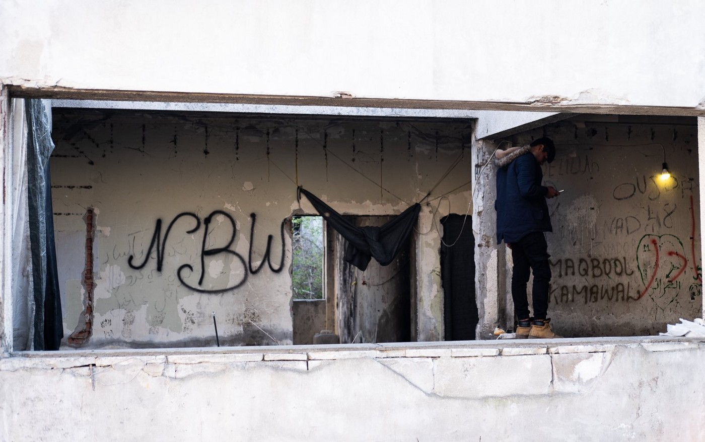

### بعد از کاروان امید
#### AYS Weekly News Summary in Persian, April 1–7

![ما درک می کنیم که زرق و برق امید یک رسانه های اجتماعی جعلی برای پناهندگان و پناهجویان برای دیدار در اردوگاه پناهندگان دیاواتا، در نزدیکی تسالونیکی است و به سمت یونان — مرز مقدونیه شمالی، به این دلیل که شایعه برای باز شدن است؛ ارائه یک دروازه حقوقی برای ادامه سفر به اروپای غربی\. این به این معنی است که هزاران نفر به مرز وارد شده اند و البته از جنایت که گاز را تکان می دهند توجه زیادی را جلب کرده است\. اما این مرز باز نشده است و این یک سفر بسیار خطرناک برای این افراد آسیب پذیر است خصوصا اطفال و سالمندان \. کمیساریای عالی پناهندگان سازمان ملل متحد،و همکارانش یک بیانیه مشترک را منتشر کرده اند [https://help\.unhcr\.org/greece/](https://l.facebook.com/l.php?u=https%3A%2F%2Fhelp.unhcr.org%2Fgreece%2F%3Ffbclid%3DIwAR0ovmshHt0qTOAEzAdjqi3N6cWJImrFh0QlzRNqwxkpqf_60SC88MVZSm4&h=AT0LWCSPuqVZ--nx9xy3jjyLF2coSr8UFB2nMK9bi7XDf1jYvHVQ_LCyltCMqyAVpWMRUW0CXERbjBuyKGhVUsqgJol899N7-aA6-MHJbuuchnm0MKqT5q9IaNNDYsNox2N9Z5rnTTsXddiBp0h8pKaAlPw2p0uNgmlYipSCWErUh_vQiq5DgvkSBCBwSmsYWv-jrUycVDY1QwerAOYpCiuxOVV5JHRYs1fAP6vImZoEK6lVYX8Cv-tlSDwiOAsx4uYzDHZDsFdZt0Wy9e22fdzG4scrLnRdet7Lss-Wblc9T1Bwn5tqGIw__Mm6aa1jzfzT26eqOXpIOMPzaNpvlU1lvrUEsHIGXRPOAtOoxtER3OnN4SFew1Ww8uEkwNiilJ4qR48K3n-4NO0MLEZtAuqiryVg33fq_S_PKDS5tslfUjIGaORvj5tV_gXCY-eGN23wWHkX-57Udz492b96G6TSqWqSnBw-OTJzO4ir_eIlAIfLP1wh3qHLDbKHSqkTIpK378DgjWNzHXbBQL6infF16ke9MBCX8JhKgtQwI0mtGd61g8jK_lQrY90w6IjhC4O1cZY9SAY6oCfXZA3-_TOxnvnBFBivoMSJdIdj39H71CqCcATEtU35AYVrJyeV_UyNfw) \. با این حال، ما از سازمان ها و داوطلبان در یونان آموخته ایم که مردم همه ملیت ها — افغانستان، ایران، کشورهای آفریقایی و عربی — به هر حال به نظر می رسد\.آنها قبل از حرکت به مرز، از سراسر یونان به اردوگاه خارج از دیووا می روند\.داوطلبان به طور طبیعی برای ایمنی و آینده همه جانبه تر می ترسند\.در حالی که ما به جنبش آزاد و حقوق انتخابی اعتقاد داریم، می دانیم که مرزها باز نیستند و ما به یاد می آوریم قبل از این چه اتفاقی افتاده است…\. \.”در اردوگاه ایدئومی، پلیس مردم را ضرب و شتم و از گاز اشک آور استفاده کرد و چند نفر در تلاش برای عبور از رودخانه بودند\.” “اگر مردم دستگیر شوند درخواست پناهندگی شان در یونان میتواند لغو شود” ما خیلی متاسف هستیم که آرزوی زرق برق حقیقت ندارد امید برای مردم 😔💔\.لطفا در امنیت بمانید\.لطفا مراقب باشید، و ما خیلی خیلی خجالت میکشیم از اروپا که چنین اتفاقی می افتاد وقتی شما سعی میکنید سفر کنید\.این خیلی اشتباه است که شما نمیتواندی سفر کنید\_ اما مراقب باشین در مورد اینکه چقدر خطرناک است، آگاه باشید\. — [مسیر راهنمای پناهندگان](https://www.facebook.com/RefugeeInfoBus/)](assets/84a81fbac011/1*M7Ny_Avl46ZBt6JjenvRQw.jpeg)

ما درک می کنیم که زرق و برق امید یک رسانه های اجتماعی جعلی برای پناهندگان و پناهجویان برای دیدار در اردوگاه پناهندگان دیاواتا، در نزدیکی تسالونیکی است و به سمت یونان — مرز مقدونیه شمالی، به این دلیل که شایعه برای باز شدن است؛ ارائه یک دروازه حقوقی برای ادامه سفر به اروپای غربی\. این به این معنی است که هزاران نفر به مرز وارد شده اند و البته از جنایت که گاز را تکان می دهند توجه زیادی را جلب کرده است\. اما این مرز باز نشده است و این یک سفر بسیار خطرناک برای این افراد آسیب پذیر است خصوصا اطفال و سالمندان \. کمیساریای عالی پناهندگان سازمان ملل متحد،و همکارانش یک بیانیه مشترک را منتشر کرده اند [https://help\.unhcr\.org/greece/](https://l.facebook.com/l.php?u=https%3A%2F%2Fhelp.unhcr.org%2Fgreece%2F%3Ffbclid%3DIwAR0ovmshHt0qTOAEzAdjqi3N6cWJImrFh0QlzRNqwxkpqf_60SC88MVZSm4&h=AT0LWCSPuqVZ--nx9xy3jjyLF2coSr8UFB2nMK9bi7XDf1jYvHVQ_LCyltCMqyAVpWMRUW0CXERbjBuyKGhVUsqgJol899N7-aA6-MHJbuuchnm0MKqT5q9IaNNDYsNox2N9Z5rnTTsXddiBp0h8pKaAlPw2p0uNgmlYipSCWErUh_vQiq5DgvkSBCBwSmsYWv-jrUycVDY1QwerAOYpCiuxOVV5JHRYs1fAP6vImZoEK6lVYX8Cv-tlSDwiOAsx4uYzDHZDsFdZt0Wy9e22fdzG4scrLnRdet7Lss-Wblc9T1Bwn5tqGIw__Mm6aa1jzfzT26eqOXpIOMPzaNpvlU1lvrUEsHIGXRPOAtOoxtER3OnN4SFew1Ww8uEkwNiilJ4qR48K3n-4NO0MLEZtAuqiryVg33fq_S_PKDS5tslfUjIGaORvj5tV_gXCY-eGN23wWHkX-57Udz492b96G6TSqWqSnBw-OTJzO4ir_eIlAIfLP1wh3qHLDbKHSqkTIpK378DgjWNzHXbBQL6infF16ke9MBCX8JhKgtQwI0mtGd61g8jK_lQrY90w6IjhC4O1cZY9SAY6oCfXZA3-_TOxnvnBFBivoMSJdIdj39H71CqCcATEtU35AYVrJyeV_UyNfw) \. با این حال، ما از سازمان ها و داوطلبان در یونان آموخته ایم که مردم همه ملیت ها — افغانستان، ایران، کشورهای آفریقایی و عربی — به هر حال به نظر می رسد\.آنها قبل از حرکت به مرز، از سراسر یونان به اردوگاه خارج از دیووا می روند\.داوطلبان به طور طبیعی برای ایمنی و آینده همه جانبه تر می ترسند\.در حالی که ما به جنبش آزاد و حقوق انتخابی اعتقاد داریم، می دانیم که مرزها باز نیستند و ما به یاد می آوریم قبل از این چه اتفاقی افتاده است…\. \.”در اردوگاه ایدئومی، پلیس مردم را ضرب و شتم و از گاز اشک آور استفاده کرد و چند نفر در تلاش برای عبور از رودخانه بودند\.” “اگر مردم دستگیر شوند درخواست پناهندگی شان در یونان میتواند لغو شود” ما خیلی متاسف هستیم که آرزوی زرق برق حقیقت ندارد امید برای مردم 😔💔\.لطفا در امنیت بمانید\.لطفا مراقب باشید، و ما خیلی خیلی خجالت میکشیم از اروپا که چنین اتفاقی می افتاد وقتی شما سعی میکنید سفر کنید\.این خیلی اشتباه است که شما نمیتواندی سفر کنید\_ اما مراقب باشین در مورد اینکه چقدر خطرناک است، آگاه باشید\. — [مسیر راهنمای پناهندگان](https://www.facebook.com/RefugeeInfoBus/)
### **ویژگی**

در شمالی ترین نقطه ی یونان، جایی نامیده میشود به اسم کاروان امید ،که در نزدیکیه کمپ دیاواتا قرار دارد \.ده ها پناهنده ،این کمپ را در حدود دو روز قبل ترک کرده اند و در زمینی با چادر زندگی میکنند \.

چند روز گذشته ،پلیس شروع به جلوگیریه افراد از نزدیک شدن به دیاواتا کرده است \.که به صورت کلی میتوان گفت بعد از آن کل این منطقه بلاکه شده است \.در حال حاضر این خبر را به اتمام می رسانیم و تا اطلاع ثانوی هیچ تظاهراتی در کمپ دیاواتا صورت نمی‌گیرد \.

تیم داوطلبان ار\.یو\.س گزارش داده است که در این منطقه کاملا تنش های ملموسی از طرف پلیس حس می‌شود\.

داوطلبان تیم ا\.ه در تلاش برای رساندن غذا به بانوان و کودکان هستند ،اما متاسفانه، این کمک از طرف پلیس ممنوع اعلام شده است\.بعضی از مردم، کسانی که عضو گروه امید هستند ،به ار\.یو\.س گفته اند که هیچ آمبولانسی در محل برای کمک وجود ندارد ،در صورتی بسیاری از مردم در اینجا نیازمند کمک هستند \.

در طول روز ،چندین گزارش در مورد درگیری بین پلیس و مردم داده شده‌است ،در حالی که پلیس از گازهای اشک آور برای پراکنده کردن و مقابله با مردم استفاده میکند \.

حدودا بیش از هزار نفر در منطقه هستند \.

#### **سوریه**
### سیل در شمال سوریه

رسانه ها گزارش دادند که طوفان صدها چادر که توسط خانواده های آواره داخلی مورد استفاده قرار می گیرند را آب باران خراب کرده است، چندین کالای و دارایی که آنها داشتند را خراب کرده است\.

سازمان ملل متحد اعلام کرد بیش از 40،000 آواره در اردوگاه های پناهندگی در نزدیکی مرز ترکیه زندگی می کنند\.
### **ترکیه**

گفته می شود یک قایق در خارج از Yaliköy، Didim، توسط TCG متوقف شده است\. این قایق به سمت آگاتونیزی حرکت کرد که 41 نفر، 17 کودک، 7 زن و 17 مرد دستگیر شدند\.
### **صربستان**

مجارستان، B92 گزارش داد که مجارستان 15 پیشنهاد پلیس بین صربستان و مقدونیه شمالی را انجام می دهد\. آنها با وسایل نقلیه غیر دوردست، دنده دید در شب و دوربین های حرارتی مجهز خواهند شد\.

No Name Kitchen
### **بوسنی**
#### گزارش دیگری در مورد خشونت در Velika Kladusa توسط پلیس محلی است\.

بر اساس گزارش، چهار نفر از سوی پلیس محلی در پارک مرکز شهر به دلیل هیچ دلیلی واضح نیستند\. پلیس چهار نفر را دستگیر کرد و آنها را به ایستگاه پلیس بردند، جایی که آنها دستور دادند که مقابل دیوار روبرو شوند\. در آن لحظه پلیس شروع به ضرب و شتم مردم کرد\. ظاهرا، 10 افسر پلیس درگیر شدند\.

علاوه بر این، آنها تمام پولی را که از سوی افرادی که ضرب و شتم آنها را پیدا کرده اند، گرفته بودند؛ یکی 150 و دیگری 100 یورو داشت\.

تیم اطلاعات AYS گزارش مشابهی در مورد خشونت های ناحیه دابوج، Mostar، Posušje، Bihać دریافت کرده است، در حالی که گزارش های بیشتر و بیشتر به نیروهای خشونت آمیز از شهر Goražde، نزدیک به سارایوو و Čajniče اشاره دارد\. پس از پشت سر گذاشتن در این منطقه، مردم مجبور به رفتن به مونته نگرو می شوند\.
### **کرواسی**

حداقل 7000 نفر توسط پلیس مرزی کرواسی از کرواسی به بوسنی و صربستان مورد نقض قوانین بین المللی، اروپایی و ملی قرار گرفته اند\. به عنوان یک نتیجه و نتیجه مستقیم گزارش های بسیاری از چند سازمان غیر دولتی و بسیاری از افراد موجود در محل، در یک اقدام هماهنگ در انتظار طولانی مدت، 30 عضو پارلمان اروپا نامه ای را منتشر کرده اند که در آن عموم مردم را مجبور می کند که از پناهندگان و مجازات مدافعان حقوق بشر از طریق فشار بر سازمان های غیر دولتی و فعالان انجام شود\. این نامه به صراحت یک مورد داوطلب AYS را به عنوان مثال می گوید و به گزارش هایی که ما در تشکیل و پیشبرد آن، همراه با فعالان بوسنی و هرزگوین، سازمان های غیردولتی No Name Kitchen، MSF، سازمان عفو بین الملل و دیگران، اشاره می کنیم\.

### **ایتالیا**

سیاسی های جناح راست در ایتالیا همچین نتیجه های درباره ی سطح محلی را نشان میدهند \.بر طبق سوشیال\. [رداتور ،لغو حفاظت انسانی منجر](http://www.redattoresociale.it/Notiziario/Articolo/631337/Migranti-l-Italia-passa-dall-emergenza-alla-precarieta-E-il-disagio-aumenta?UA-11580724-2&fbclid=IwAR1LRKajXaOpaumJ1HZUFIbgJOG8tBUO1Lqf1wf6ycS3_f4VWP8hKLnlIxs) به افزایش تقاضا برای پایین آمدن خدمات دوش ،لباس و بسته ی غذایی میشود\.

گفته می‌شود چهار هزار نفر در روز در روم و نهصد نفر در پالرمو هستند \.در ترونتو نیاز است که یک مرکز پناهندگیه دیگر باز شود \.
### **فرانسه**

> ارزیابی بحث برانگیز و رفتار ناعادلانه به عنوان شورای قانون اساسی به نفع آزمایش استخوان برای تعیین سن افراد در حال حرکت است 

علیرغم انتقاد گسترده در فرانسه و جامعه بین المللی، شورای قانون اساسی فرانسه تصریح کرد که تست های استخوان برای ارزیابی سن مهاجران جوان غیرقانونی نیستند\. بسیاری از مطالعات و موارد اخیر ناکافی و اشتباه چنین عمل را ثابت کرده اند\.

ای\.سی گزارش داد که پرونده ای که به دادگاه منتقل شد، مربوط به آداما S\.، یک گینس جوان بود که اعلام کرده بود که او پس از ورود به فرانسه در سال 2016 به 15 سال سن برسد\. از طریق آزمایش استخوان مقامات فرانسوی نتیجه گرفتند که او به جای آن بین 20 تا 30 سال سن دارد\.

آداما S\.، که توسط تعدادی از سازمانها پشتیبانی می شد، این پرونده را پیش از شورای قانون اساسی آورده بود، و اظهار داشت که “معاینه رادیولوژیک استخوان، اصل” بهترین منافع کودک “را نقض کرده است، به ویژه به خاطر شناخته شده حاشیه خطا از آزمون که منجر به بسیاری از کودکان و نوجوانان که از مزایایی که به آنها داده شد، رد می شود\.

حدود 400 نفر — که در حال حاضر در شرایط وحشتناکی قرار دارند — و حامیان امروز در خارج از اردوگاه پورت د لا چپلل حضور پیدا کردند\. گفته می شود حدود 200 نفر باقی مانده اند\.

واتزات یک راهنمای جدید در مورد نحوه درخواست پناهندگی در پاریس منتشر کرد\. در صفحه اصلی سایت آنها ، می توان به زبان فرانسه، انگلیسی و عربی یافت\. به دلیل شرایط وخیم، چندین سازمان در روز شنبه، 7 آوریل، به اعتراض در محل پلاتو دات لات Rotonde در پاریس ابلاغ شده است
### **آلمان**

هفته گذشته، بایرن گزارش داد که بایرن یک نویسنده و فعال حقوق بشر ویتنامی و همسرش به هانوی فرستاده است\. او برای جایزه نوبل ادبیات در سال 2017 و 2019 نامزد شده است\. او نیز در حال حاضر برای جایزه روحانی حقوق بشر رابرت کندی و برای جایزه حقوق بشر وکلای هول نامزد شده است\. در ویتنام، نویسنده شناخته شده به طور گسترده تهدید می شود\.

معمولا درخواست های پناهندگی شهروندان ویتنام در بایرن، اما در برلین، براندنبورگ، نوردراین وستفالن و ساکسونی که مقامات و دادگاه های اداری واجد شرایط تصمیم گیری در زمینه آزار و اذیت در ویتنام هستند، پردازش نمی شوند\. روشن نیست که چرا درخواست پناهندگی این خانواده به طور استثنایی در بایرن پردازش شده و به یکی دیگر از ایالت های فدرال رجوع نمی شود\.
### ایسلند

> در سال های اخیر تصمیم دادگاه ایسلندی به عنوان محکومترین حکم در هر محاکمه ای علیه معترضان ضد تبعید برای اقدامات همبستگی در سراسر اروپا گزارش شد\. 

در ماه مه سال 2016 هواپیمای خود را در فرودگاه کافلاویک به عنوان مسافر وارد کردند، اما بعد از آن برخاستند \(در هواپیما ایستادند\) \. سپس، آنها به مسافران توضیح دادند که “یک مرد به طور ناعادلانه در این پرواز اخراج شده بود، زندگی او به این ترتیب تهدید شد و آنها حاضر به نشستن نشدند تا او بی درنگ از هواپیما بیرون برود\.”

**اخبار بیشتری به انگلیسی در صفحه رسانه ما در دسترس است \. در مواردی که شما سوالاتی دارید و یا مایلید برخی اطلاعات مربوط به روند پناهندگی شما یا کشور مورد نظر را منتشر کنید , لطفا ً برای نوشتن پیغام روی فیس بوک یا نوشتن یک ایمیل به آر\.یو\.س تردید نکنید**

[**areyousyrious@gmail\.com**](mailto:areyousyrious@gmail.com)

_Converted [Medium Post](https://medium.com/are-you-syrious/%D8%A8%D8%B9%D8%AF-%D8%A7%D8%B2-%DA%A9%D8%A7%D8%B1%D9%88%D8%A7%D9%86-%D8%A7%D9%85%DB%8C%D8%AF-84a81fbac011) by [ZMediumToMarkdown](https://github.com/ZhgChgLi/ZMediumToMarkdown)._
