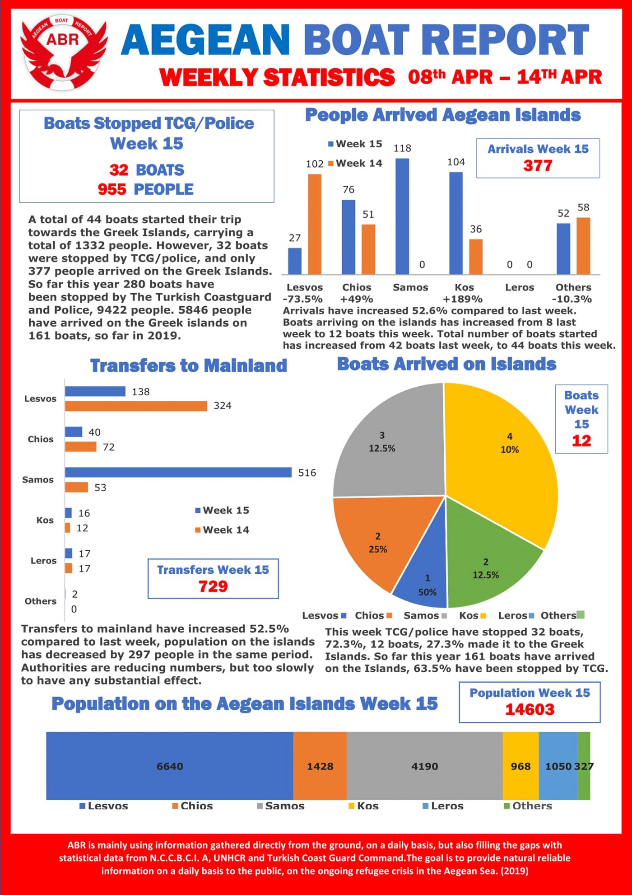
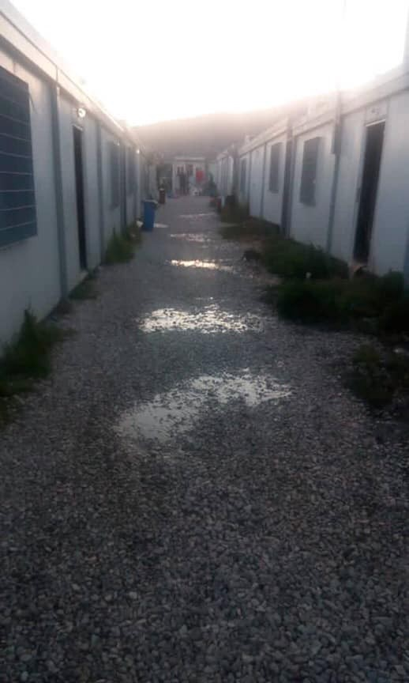
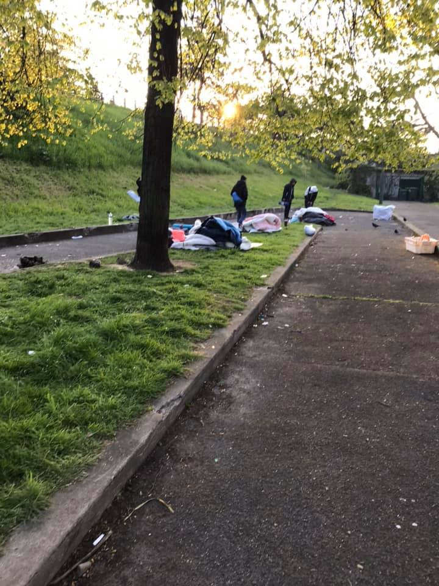
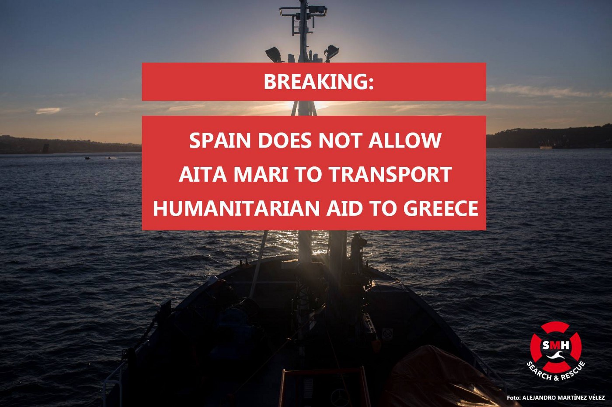

### AYS Daily Digest 15/4/19: Locked and detained in the midst of fights in Libya
#### People still detained in centres just next to the armed fights in Libya // People stopped from disembarking in Morocco // After the evictions in Athens // Spain denies SAR teams to deliver aid to Lesvos // & more updates

 Twitter account](assets/4ebbfd25ae20/1*HE1L-jmTrh4O4FAr4LlfhA.jpeg)

Photo credits: [Sally Hayden](https://twitter.com/sallyhayd) Twitter account
#### FEATURE

The dire situation in Libyan detention centres continues\.

As hundreds of people in Libya were trapped in a detention centre in Qasr bin Ghasher in close proximity to intense armed clashes in Tripoli, an Amnesty International representative has also [reacted](https://www.amnesty.org/en/latest/news/2019/04/libya-release-migrants-and-refugees-trapped-in-detention-centres-amid-escalating-clashes/?fbclid=IwAR3XdC9BcjGskKbO4OKq0YC6IAD1DkX_-ERO4IwbXmB8gKQYE2LGQqQTJ3s) to the situation, among other things, stating clearly:

> The renewed conflict in Tripoli shows yet again how crucial it is for EU member states to ensure safe routes out of Libya for migrants and refugees\. EU member states must also reconsider their support for the Libyan Coast Guard, which has returned countless migrants and refugees back to Libya where they face arbitrary and indefinite detention, torture, extortion and sexual violence, among other serious violations\. 

3000people are trapped in detention centres in Abu Salim, Gharyan and Qasr bin Ghasher, close to the fighting, as we wrote earlier\.

“We even washed the cars that were full with the blood of the soldiers who were killed on the war front,” one refugee told the journalist Sally Hayden\. “They put the dead bodies in the military cars\. I’m not feeling good but I don’t have a choice here\.”

■■■■■■■■■■■■■■ 
> **[Sally Hayden](https://twitter.com/sallyhayd) @ Twitter Says:** 

> > Message from Abu Salim dc, south Tripoli, saying bombs or rockets are hitting 20m from the detention centre. The guards drove away & left them after it started. More than 800 refugees/migrants reportedly still there. #libya https://t.co/YB2U6xi7Q2 

> **Tweeted at [2019-04-14 23:23:27](https://twitter.com/sallyhayd/status/1117569081698324480).** 

■■■■■■■■■■■■■■ 

As a primary destination, the EU should ensure that none of its training, financing, or material assistance to the Libyan Coast Guard and other Libyan authorities contributes to human rights abuses\.

Human Rights Watch also previously urged the EU to support UN and EU monitoring and public reporting on migrant detention centre abuses\.
#### MOROCCO

More than 150 people, reportedly of Sub\-Saharan origin, have been stopped on the coast, including women and small children, [Association Marocaine des Droits Humains — Section Nador](https://www.facebook.com/AmdhNador/?__xts__%5B0%5D=68.ARAD_H0d6coF_3hkLlWgqHegC69rD42-6YxZoyy_0BNusxwBRcIfZyio5eSXr3-fu-S4VTZwBoRjvazXGXbKKPe7HMZA7OC7Uo1KVwObuGD4k-_X6IotEYVPZ2d1nyi9Z-OgrDVXXpEpRSNMUluCrySW1vzlJATzpb0yiNXttG5Ig32BjOEFIZPw82s9B9hFpPsi7TutDeEiYklw6dxG6UHV5gQVNPnfXIkHFjvYRS-QSEmpVUcZQFWza9nNtjwpBmguNZT5EcRz5J_O0Ym8QTo5e1FO4tKOwbtVCGS2FuK0_cBZFiCZGv0CfszMERk_36S4UPIr1J5thLQDNm48LBOfFC71Yb7g8zsZ-uOl-n8aJbf5kXcXQSZMhA&__tn__=k%2AF&tn-str=k%2AF) reports\. It happened close to Dar Kebdani, 70km west of Nador\. 
AMDH is reortedly collecting information on the role of the local coast guard, as well as that of the Spanish and Frontex teams\.

](assets/4ebbfd25ae20/1*zz_on2SyZZ_6PciqTKbclg.jpeg)

Photo: [Association Marocaine des Droits Humains — Section Nador](https://www.facebook.com/AmdhNador/?__xts__%5B0%5D=68.ARAD_H0d6coF_3hkLlWgqHegC69rD42-6YxZoyy_0BNusxwBRcIfZyio5eSXr3-fu-S4VTZwBoRjvazXGXbKKPe7HMZA7OC7Uo1KVwObuGD4k-_X6IotEYVPZ2d1nyi9Z-OgrDVXXpEpRSNMUluCrySW1vzlJATzpb0yiNXttG5Ig32BjOEFIZPw82s9B9hFpPsi7TutDeEiYklw6dxG6UHV5gQVNPnfXIkHFjvYRS-QSEmpVUcZQFWza9nNtjwpBmguNZT5EcRz5J_O0Ym8QTo5e1FO4tKOwbtVCGS2FuK0_cBZFiCZGv0CfszMERk_36S4UPIr1J5thLQDNm48LBOfFC71Yb7g8zsZ-uOl-n8aJbf5kXcXQSZMhA&__tn__=k%2AF&tn-str=k%2AF)
#### SEA

■■■■■■■■■■■■■■ 
> **[SOS MEDITERRANEE](https://twitter.com/SOSMedIntl) @ Twitter Says:** 

> > 🇪🇺 OUT NOW! #RespectLawOfTheSea First episode.

Tracing the erosion of maritime law in the central Mediterranean within the last 5 years, we call on all EU-canditates to fight to save lives at sea and respect the law!

#EUelections2019 https://t.co/MWZYRlOuVO 

> **Tweeted at [2019-04-15 17:02:06](https://twitter.com/sosmedintl/status/1117835500604350466).** 

■■■■■■■■■■■■■■ 

As of 31 March, over 350 people have died or gone missing this year while trying to reach Europe by sea\.

■■■■■■■■■■■■■■ 
> **[Missing Migrants Project](https://twitter.com/MissingMigrants) @ Twitter Says:** 

> > Today, we remember the 733 men, women and children whose deaths we have documented in 2019. 733 people who just wanted to live in peace, free from danger and economic dispossession. People who wanted to rebuild their lives where it's safe #MissingMigrants [missingmigrants.iom.int](http://missingmigrants.iom.int) https://t.co/7pkAQI6tbd 

> **Tweeted at [2019-04-15 16:53:46](https://twitter.com/missingmigrants/status/1117833403829837826).** 

■■■■■■■■■■■■■■ 

#### GREECE

3160 people arrived by sea and by land in March, the UN reported, while the number of persons rescued or intercepted by the Turkish Coast Guard after departing from the Turkish coastline is 4,316 since the beginning of the year\.
### Chios

A boat landed on Chios on early Monday morning with 25 people on board:
6 children, 11 women and 8 men\. Here is the overall statistics of arrivals in the previous week:

### Samos

Urgent measures are needed to improve conditions in Vathy, where 3,500 people live in a space designed for 700\.
In their recent report of March this year, the UN reminded us of the culmination of tensions between the locals and the residents of the camp\. Also included was details about those who are forced to live in makeshift shelters in the fields next to the centre, with no access to toilets and showers or lighting\. We have already reported on the reactions to the unimaginable situation when parents of elementary school children in Vathy kept their children from school for two weeks in protest to refugee children attending afternoon classes in the same premises\.
### Athens

](assets/4ebbfd25ae20/1*fDr6nPDQeM5-7xG9uKJF_w.jpeg)

Photo: [Azadi Squat Athens](https://www.facebook.com/AzadiSquatAthens/?__xts__%5B0%5D=68.ARCxTsi38dovOPaQvFPnDl6q1uyv02KeKqvohuEDzYepRq1ZyNvTHo4Nr-6Z5TfzeUsZl2z0n7Pc2wEl46olYzrwglcskAxGGetVRd0YmEFdFgaIyZH5uwon6S6bXAOGxUN1g_AzGSFgobBTbAsFa4SZS7xGZIF2TShUIkeZ7pXVYmIGwm3XslWkxNjbT08m6akuT2yiCydRUUHJtNjvxf3ulVx6HjwdGIkzWg4VRNMLyANu2fZXdGn2D2DQGkHJrfAAC0Zg2I0iAI36ZGImvKMpV92GnXlUF_vG-IHDngJLr07CFhQ1wUHH5HzMvyks3payfBhVv5uxFfTuw4rwXFDlCv5b6Px8U6MeBHKywB_ATha-VaBXQr41NA&__tn__=k%2AF&tn-str=k%2AF)

It is reported that after the eviction of the [Azadi Squat Athens](https://www.facebook.com/AzadiSquatAthens/?__xts__%5B0%5D=68.ARCxTsi38dovOPaQvFPnDl6q1uyv02KeKqvohuEDzYepRq1ZyNvTHo4Nr-6Z5TfzeUsZl2z0n7Pc2wEl46olYzrwglcskAxGGetVRd0YmEFdFgaIyZH5uwon6S6bXAOGxUN1g_AzGSFgobBTbAsFa4SZS7xGZIF2TShUIkeZ7pXVYmIGwm3XslWkxNjbT08m6akuT2yiCydRUUHJtNjvxf3ulVx6HjwdGIkzWg4VRNMLyANu2fZXdGn2D2DQGkHJrfAAC0Zg2I0iAI36ZGImvKMpV92GnXlUF_vG-IHDngJLr07CFhQ1wUHH5HzMvyks3payfBhVv5uxFfTuw4rwXFDlCv5b6Px8U6MeBHKywB_ATha-VaBXQr41NA&__tn__=k%2AF&tn-str=k%2AF) , the owner of the building emptied the place of everything that was inside, organising rubbish collection to pick up the left over belongings of the residents\.

Their only possessions were now taken away by the city company in charge of collecting the trash\.

Some of the residents who had no documents or regulated stay in the country were transferred to Amygdaleza Detention Camp, which is a close by camp with bad conditions\. They are now being provided with some aid in there by those outside the camp, while the others have been left homeless and have received solidarity and help from Pampiraiki, Our House and the 5th School Squat\.

](assets/4ebbfd25ae20/1*cBwhBZt9_6TEYAqyxF_EIg.jpeg)

Photos: [Refugee Accommodation and Solidarity Space City Plaza](https://www.facebook.com/sol2refugeesen/?tn-str=k%2AF)
#### SERBIA

Info Park reported some newly arrived people to Belgrade, less than usual \(due to the weather conditions\), from Afghanistan, Iran, Pakistan and Syria\. Among them was a family that had reportedly taken the route from Greece via Albania, Montenegro and Bosnia where they spent **7 months in Sarajevo before coming to Serbia** \.
#### CROATIA

In Croatia, there is a growing problem with the lack of proper contact to people being detained in one of the so called transit centres in the country, but firstly with people detained in Ježevo\. They regularly have little to no contact with the outside world, as the organisations and activists asking for permission for a visit or to perform activities within the centre are constantly forbidden to do so\. Access to legal aid has also reportedly been prevented several times in the past months, and people have trouble accessing the lawyers in order to express the intention to seek asylum in the country\.

At the same time, we must mention a certain lack of solidarity by some of the aid workers, particularly within the Red Cross, who are not only unsupportive of the other organisations whose work has been restricted or denied, and who are working with the same goal, but are also — intentionally or unintentionally — going along with the repressive and exclusive terminology the state has been using \(with a certain purpose, though\), such as the ‘illegal migrants’, etc\. This has potentially dangerous consequences in the long term, but also questions the understanding of the situation and rights stemming from the existing laws, regardless of the way people had entered the country, which is the usual justification for the particular terminology used\.
#### AUSTRIA
### Warnings of possible deportations

There are hints of a mass charter deportation soon\. Probably 29/30 April\. It can happen anytime and anywhere in Austria that you get to the deportation prison\.

Ask for legal advice\. If you can be deported: please don’t stay where there are many controls \(your official residential address, Prater, westbahnhof, meidling, U6\) — reported by:
 [No Border\. No Nation\. Stop Deportation\.](https://www.facebook.com/stopdeportation/?__tn__=%2CdkCH-R-R&eid=ARBKzd-XMeh8kW-cpVzDoWuvorF0Df8Y2AXVZ89ilEDwgk_IoBrlio49SNpOa8ffx0rDMg1T_afII-Pb&hc_ref=ARQJjVddYqd61CQa_Kb_Bg4mspVBGovFUCFLFr_bQ8OeIM604iPu_KAiA6bITg57FzA&fref=nf&hc_location=group) Follow them for more information\.
#### FRANCE
### Paris

40–50 people were evicted by the Parisian police, a volunteer team of [Rastplatz](https://www.facebook.com/rastplatz/?tn-str=k%2AF&hc_location=group_dialog) witnessed\. As they did not receive any alternative for where to go, tents were put up in a place that surely awaits the same action — it is only a question of time\. A sustainable solution should be found for people in this situation\.

](assets/4ebbfd25ae20/1*Gbw0pOZj-ZN3iNMUK3HHug.jpeg)

Photos: [Rastplatz](https://www.facebook.com/rastplatz/?tn-str=k%2AF&hc_location=group_dialog)
#### SPAIN

On Saturday afternoon the Aita Mari rescue ship was heading to Lesvos with medicines and sanitary equipment, when they received a message from the Spanish Maritime Authority telling them they could not go to Greece, [Salvamento Marítimo Humanitario](https://www.facebook.com/smhumanitario/?tn-str=k%2AF&hc_location=group_dialog) reported\.

They had previously obtained a permission in Portugal to transport humanitarian aid \(medical materials, milk powder for babies and other basic hygiene products\) to the registration camps on Lesvos and the Spanish authorities have been informed\. However, they were still not allowed to help, even in this way\. All the SAR teams \( [Sea\-Watch](https://www.facebook.com/seawatchprojekt/?__tn__=%2CdK%2AF-R&eid=ARD8BAndzeifXX4GBaGq45jm461mCKcgy65Vd1wyJnYOu8oHAoEETeNapJXKIZYgJs9fE41tGMtkx7CG&hc_location=group_dialog) [Seebrücke Berlin](https://www.facebook.com/SeebrueckeBerlin/?__tn__=%2CdK%2AF-R&eid=ARBl5tGODtE074IA0ic5wJNmX-f8nIlLaGaquPJJVzSFUzrQHxgDnVr_OtYZ2NR9TdqPlCy1A8i6DXkZ&hc_location=group_dialog) [sea\-eye](https://www.facebook.com/seaeyeorg/?__tn__=%2CdK%2AF-R&eid=ARACZjvy4l7MYT-dDtdsyJRv7Qgens4KEMR4KFPRDBCt4KdVlpGUYISVnXjBpfSOb0_4mODvq658AHpJ&hc_location=group_dialog) [LIFELINE](https://www.facebook.com/seenotrettung/?__tn__=%2CdK%2AF-R&eid=ARB4fMWSyWq3nsO6q-Zaci6tXlVF5x4FVboqO6cQOm9i54Bo0hMhMQa3yZm6B677TLaeVlBjggCZXSny&hc_location=group_dialog) [RESQSHIP](https://www.facebook.com/resqship/?__tn__=%2CdK%2AF-R&eid=ARB66b7gjM1fd9Li5WbKPIcfoHthyNL_KN88Qsq6hFXW-d7zqm_U-IWuPROOyIKDhEQVJTOZWV7VEYVu&hc_location=group_dialog) \) oppose such restrictions in doing what they know and have means to do, in order to help fellow human beings\.

**Apart from daily news in English, we also publish weekly summaries in Arabic and Persian\. Find specials in both languages on our medium site\.**

**If you think you could contribute to the work of our info team, write us\.**

**We strive to echo correct news from the ground through collaboration and fairness\. Every effort has been made to credit organizations and individuals with regard to the supply of information, video, and photo material \(in cases where the source wanted to be accredited\) \. Please notify us regarding corrections\.**

**If there’s anything you want to share or comment, contact us through Facebook, Twitter or write to: areyousyrious@gmail\.com\.**

_Converted [Medium Post](https://medium.com/are-you-syrious/ays-daily-digest-15-4-19-locked-and-detained-in-the-midst-of-fights-in-libya-4ebbfd25ae20) by [ZMediumToMarkdown](https://github.com/ZhgChgLi/ZMediumToMarkdown)._
