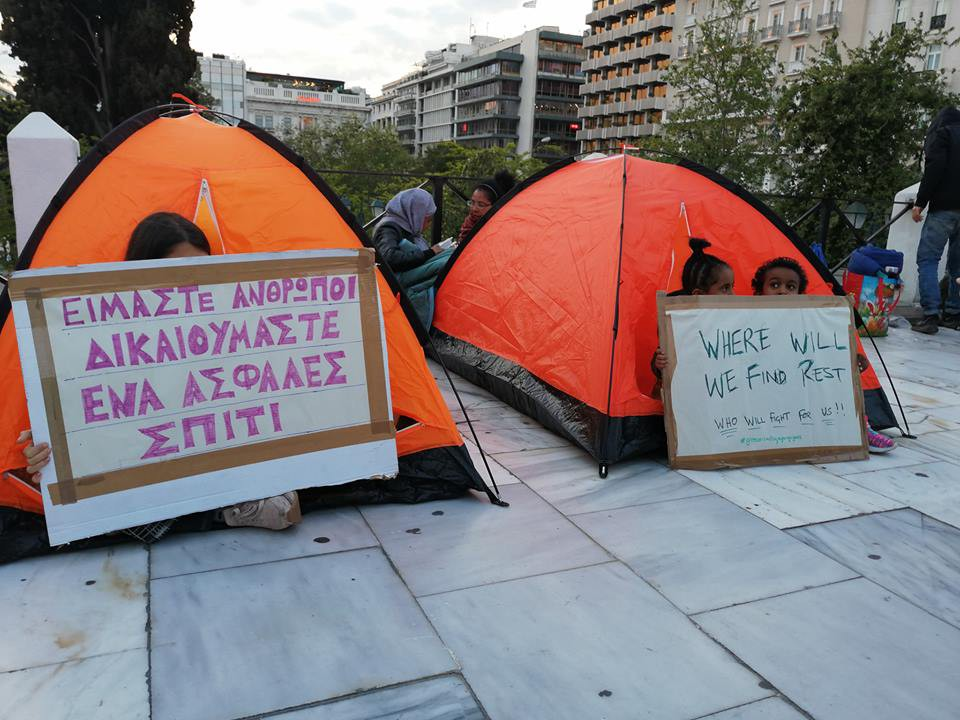
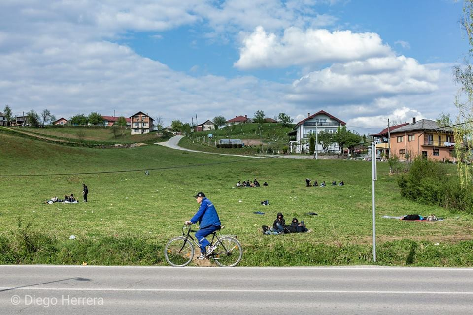

### AYS Daily Digest 18/4/19: Two squats evicted
#### More than 70 people in Exarchia now left abandoned in the streets / Application at ECHR against Greece / Help needed in Bosnia / Netherlands implement area bans for trouble makers

](assets/c069c9232ad1/1*cJowmmeQ3x_K5QX5lWs8mA.jpeg)

The police came in the morning\. Credits: [NoBorders/Nikos Christofakis](https://www.facebook.com/nobordersnetwork/photos/pcb.2223621697705710/2223619424372604/?type=3&theater&ifg=1)
### Greece

Today, two squats in Exarchia have been evicted, NoBorders reports\. Police arrived to the buildings at 6am, one of which was the Clandestina squat\. It is said that there have been more than 80 prosecutions\. Most of the people were families, and everyone was released later in the day; the ones without papers seem to have left before\. Around 50 people are protesting now at Syntagma with tents and sings\. The plan is to stay the night and demonstrate that it was not drug dealers who were evicted from the squats\. Police have so far offered to take people to detention centers to get them off the streets, but obviously people refused\.

Team Humany founder Salam Kamal\-Aldeen filed an unprecedented application against the Greek government at the European Court of Human Rights\. This is a consequence of his trial in the country, which accused him of helping people in need illegally\. “It challenges \[Greece’s\] abuse of power to arbitrarily prosecute and expose Mr Aldeen to a minimum ten years’ imprisonment, only to suspend his life\-saving activities,” Glanlaw [writes](https://www.glanlaw.org/single-post/2019/04/18/Case-filed-against-Greece-in-Strasbourg-Court-over-Crackdown-on-Humanitarian-Organisations?fbclid=IwAR3EsHodPD6DxGqztAsmc0b4yaT5o_VVTr6547k5MSutkowH1svjNzoK2f8) \.

According to [Aegean Boat Report](https://www.facebook.com/AegeanBoatReport/photos/a.285312485325196/559098304613278/?type=3&theater) , around 1,000 people have been transferred from Samos\. While this is a positive development, their new shelters seem to be no improvement at all: “People that have been transferred to \[the\] mainland \[have\] been offered tents as their new home, in various camps\.” Other new arrivals were transferred to Kos and Lesvos, where the conditions are barely better than on Samos\.

The Mobile Info Team [informs](https://www.mobileinfoteam.org/travel-from-greece?fbclid=IwAR1shcO3UXnmg_CfWEzd1N-Cce3YSIyKg2r_zryR78-_Pka1uSQAvgEgXIw) that the Greek approved refugee status travel document permits normal travel to any country worldwide— just not in the country of origin\. Within the Schengen countries, a visa free travel is possible for up to three months, however it is not permitted to stay there or work\.
### Bulgaria

Bordermonitoring [reports](https://bulgaria.bordermonitoring.eu/2019/04/18/bulgaria-is-about-to-deport-a-political-refugee-to-turkey/?fbclid=IwAR3VTsAxQ0g907x8-ZBS-Rh6yvdspA2mOWypmlxYtI8QjHHJZnV3SJRv6ag) a planned deportation of a Turkish citizen from Bulgaria\. The Kurdish man lived in Bulgaria for three years and did not commit any crime\. He was arrested on a request of the Turkish government as he is accused of being member of a forbidden organization\. He would face a long prison sentence in Turkey\.
### Bosnia

No Name Kitchen [warns](https://www.facebook.com/NoNameKitchenBelgrade/posts/703494006715553) that the situation in Velika Kladusa is still dire\.

> The official camps are full and whoever wants to enter is denied access\. That leaves hundreds of people sleeping in abandoned buildings at this border town, as happened a year ago\. 

People are lacking basic necessities, which causes health issues\. They call for donations urgently and in large quantities: pants of small and medium sizes, short and long\-sleeved shirts, underwear, socks and winter underwear for cold nights\. Sports shoes are required \(sizes 41,42 and 43 especially\), sleeping bags, backpacks, belts, smartphones, towels, shampoo, and soap\.

People sitting on a field in Kladusa\. Credits: Diego Herrera

Official numbers say that there have been over 3,500 arrivals Bosnia and Herzegovina \(BiH\) since the beginning of 2019, with 1,700 in March, which is approximately three times as many as over the same period in 2018\. It is estimated that around 5,500 migrants and refugees are in BiH with around 4,000 of these accommodated in established reception centres\. Around 2,900 are in Una\-Sana Canton \(USC\) \. UNHCR estimates that there are 560 registered asylum seekers still in the country and that a further 1,000 have signed power of attorney with Vaša Prava \(VP\) and are awaiting asylum registration, often pending registration of their address\. IOM counts for the Ušivak camp near Sarajevo 520 people, including 35 families comprised of 111 members\. Bira camp in Bihac has 1,651 people, including 27 families comprised of 145 members in total\. Miral in Kladusa has 603 people\. Sedra, near Bihac, has 299 people, all families\. The government in the Una\-Sana Canton, Bihac area, is requesting for the camp to be moved from the city, but for the moment there are no confirmed alternative locations\.
### Netherlands

Junior justice minister Mark Harbers told members of the parliament that the government wants to implement new laws to deal with asylum seekers causing problems\. Dutchnews [writes](https://www.dutchnews.nl/news/2019/04/137455/?fbclid=IwAR3t0TDYC6JDUOUhG8HS9H3G5ZYy2pOW8np2wTE-pzOt0ES65L3SimpW2dw) , that the country currently hosts two centers for problem cases\. The new measures shall include curfews and bans of certain areas\. In Heerenveen, this includes the local shopping centre\. “They will only now be able to visit a store on a supervised visit,” the portal writes\. Also, deportations of people from safe countries should be accelerated, according to the proposed plan\.
### Denmark

A new protest against the Danish detention centers takes place tomorrow at Ellebæk in North Zealand\. The event is planned to make use of more confrontational but non\-violent forms of civil disobedience, and bus transport from Copenhagen is being arranged\.

**Apart from daily news in English, we also publish weekly summaries in Arabic and Persian\. Find specials in both languages on our medium site\.**

**If you think you could contribute to the work of our info team, write us\.**

**We strive to echo correct news from the ground through collaboration and fairness\. Every effort has been made to credit organizations and individuals with regard to the supply of information, video, and photo material \(in cases where the source wanted to be accredited\) \. Please notify us regarding corrections\.**

**If there’s anything you want to share or comment, contact us through Facebook, Twitter or write to: areyousyrious@gmail\.com\.**

_Converted [Medium Post](https://medium.com/are-you-syrious/ays-daily-digest-18-4-19-two-squats-evicted-c069c9232ad1) by [ZMediumToMarkdown](https://github.com/ZhgChgLi/ZMediumToMarkdown)._
