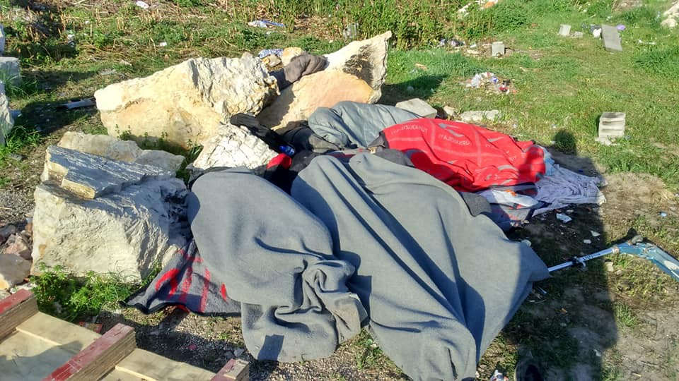
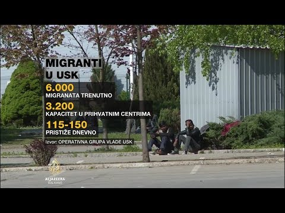
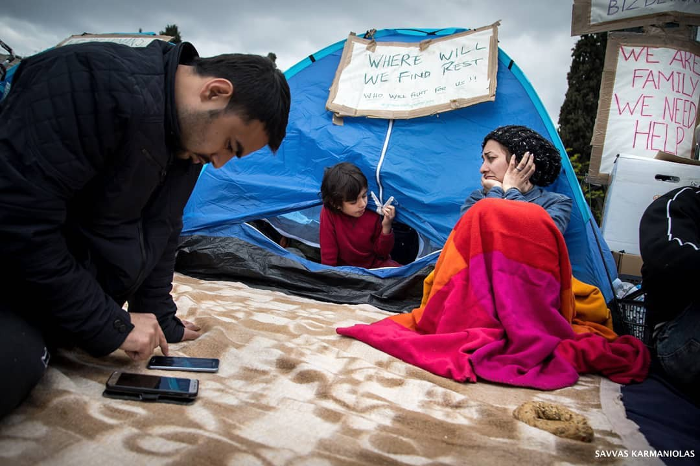
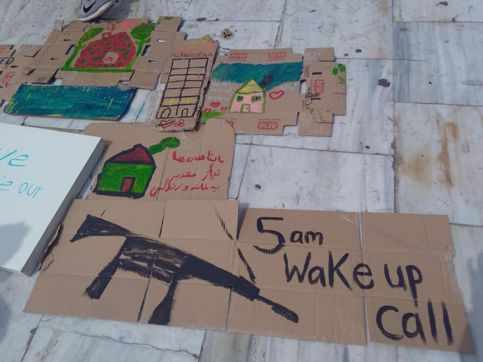

### AYS WEEKEND DIGEST 20–21/4/1019: Chaos in Bosnia

_Who is responsible for the situation with people on the move in Bosnia and Herzegovina, if anybody? // Some people from Syntagma taken to Eleonas camp in Athens // Help is needed in Greece, Belgium, France, Bosnia…_

](assets/1865e3f5b203/1*RtVLtOb3XM5N4aNPRDKr0g.jpeg)

Refugees looking to the border from Velika Kladusa \(Bosnia\) \. By [@dherreraphoto](http://twitter.com/dherreraphoto)
### Feature

The living conditions for people on the move who have reached Bosnia, as the last stop before the EU, are not getting any better\. Even more, living conditions are getting more precarious, even dangerous, for people on the move but also for those who are providing help\.

At the moment, hundreds are sleeping rough all over the country\. Those who are aiming to get to the north of the country, where they will try to continue their journey, are often deprived of freedom of movement and left without food or any kind of help at police check\-points in the area of Ključ \(Velečevo\) and Bosanska Krupa\.

After being stopped at one of the checkpoints, people are kicked off the buses and trains, and forced to find their way forwards or back\. It means that they are forced to walk kilometres over the mountainous area, and they arrive with injuries that nobody treats properly due to the lack of medical care\.

People who went through this kind of humiliation are talking about police abuse they witnessed or experienced, but also about help they got from the local people they met on the road\. As we were told by more then one person, police officers are using violence, even against minors, while in several cases police threaten to people if they walk toward Bihać they will shoot at them\.

Velečevo\. After being kicked off the bus, people are left by the road with no help, except what local people and the local branch of Red Cross provides\. Photo by Sanella Lepirica\.

Recently, authorities in the Bihać area \(Una\-Sana Canton\) announced that they will start controlling even private vehicles looking for refugees and migrants\. This is against the law, but they issued a decision they consider obligatory\. However, there are no public reactions from the state authorities, or any international organisations who are in charge for the well being of people on the move, or human rights in general\.

It is important to remember that Bosnia and Herzegovina is a post\-war country, dysfunctional, and with problems that persist for years, like the problem with the implementation of the existing laws, or even the constitution\. The country has three levels of government, and even local people are often victims of this system which was established with the Peace Agreement that ended the war in 1995\.

People on the move, as a very vulnerable category, are falling into this abyss of Bosnian madness, the abyss where people from Bosnia and Herzegovina have been living in for over 20 years\.

At the same time, international organizations, led by the IOM and UNHCR, who are supposed to fill these gaps and provide help, are failing to do so\.

Nevertheless, people are walking toward Bihać and Kladuša\. Once they reach these cities, most of them are left outside existing camps\. The government in this area insists that no more than 3,200 people can be accommodated in existing centres\. The number of people who are in the area, according to some estimates, is at least double that\.

If they are not in the official accommodation, people have no access to registration or food, water, toilets or showers… The unsurprising consequences of this are that many are sick\. For example scabies is outspread to the level that it is almost possible to talk about an epidemic among people on the move in Bosnia\.

IOM and UNHCR, are not doing enough to improve this situation\. Help is provided mostly by the local people, and groups of volunteers present in the country\. However, what they can offer is very limited\. Apparently, MSF and MDM will soon start operating in Kladuša\.

In the meantime, since last week, the operational group established in the Bihać area, is in “permanent assembly,” making decisions related to the life of people on the move\. These decisions are sometimes not in compliance with the existing laws\.

In a public statement, Una\-Sana government said that they will “intensify all the activities related to people on the move, including public health and policing”\. They demanded an urgent reaction from the entity and the state governments, asking them to find alternative accommodation to relocate people from urban areas in Una\-Sana Canton\.

“Children, families with children and refugees from areas where there is ongoing war, will have a possibility to be placed in Borići and Sedra centres, and can remain as vulnerable categories\. We call all the citizens to partner with us in these efforts,” the statement claims\. It is not clear what kind of partnership with the citizens they expect\.

The group issued a deadline of May 10th to the state authorities to find a solution for new centres\. So far, nobody knows how this can be done\.

It has to be reminded that since the election in October last year, Bosnia does not have a state government\.

Authorities in Bihać also announced that they will file criminal or misdemeanour charges against anybody who is transporting people toward Una\-Sana Canton, being official transportation companies \(public or private ones\), but also the state office for foreigners, part of the state Ministry of Security\.

And that is not all\.

Existing camps, run by IOM, are often in rented private properties\. IOM claimed that they had to do that since the state authorities did not find any location for the camps, and it was necessary to accommodate people before the winter\.

They do not give any explanations for why living conditions in these camps are humiliating, or responding to the violence and force used by the private security agencies engaged by the IOM inside of the camps\.

Nevertheless, while making deals with the local private business owners to use their facilities, paying with the money coming from the EU, the IOM ignored the fact that some of these places could not be rented at all due to debts made by the owners during the previous years\. This is the situation with Hotel Sedra, where families are placed, and BIRA\. Hotel Sedra was supposed to go on public bid on August 25, 2018, but a couple of days before, IOM made an agreement with the owner\. In the case of BIRA, some people claim that the factory owes them money announcing they will block all the entrances to the centre on April 24th\. They claim that the owner of BIRA owes them over 200,000 euro, saying that under the court decision, IOM or anybody, cannot use parts of BIRA\.

Beside the Bihać area, many people are still arriving at other cities all over Bosnia, including Trebinje, Doboj, Foča, Goražde, Mostar, Čapljina, Posušje, Orašje…
### Libya

Shelling continues in Libya, and hundreds of refugees are trapped in the front lines\.

■■■■■■■■■■■■■■ 
> **[Sally Hayden](https://twitter.com/sallyhayd) @ Twitter Says:** 

> > Shelling tonight in Tripoli. Here are some messages from Sebha detention centre. 
“Praying is the only solution.”
“No words for these terrifying moments.” https://t.co/PCkOGdcB1J 

> **Tweeted at [2019-04-20 23:36:00](https://twitter.com/sallyhayd/status/1119746567966216193).** 

■■■■■■■■■■■■■■ 

They beg for help, but little has been done so far\.

[In a video from Abu Salim](https://www.facebook.com/sally.hayden.12/videos/10155932852647085/) , a detention centre in south Tripoli, people are protesting because they are abandoned, but it does not look like anybody hears them\.

Like everywhere else, state and big international organizations are playing the game or shifting responsibility\. UNHCR says it is Libyan authorities, which is an absurd for anybody knowing the situation in this country to say\.

[Giulia Tranchina](https://www.facebook.com/758288620/posts/10156592456418621?sfns=mo) on her FB page keeps reporting about conditions in the Sabaa centre, that is in the middle of the fighting\.

### Italy

The [updated report](https://www.ecre.org/aida-2018-update-italy/) about the situation in Italy is available at AIDA web site\. It brings a detailed analysis of legislative developments introduced by the Decree Law 113/2018, as well as practice relating to asylum procedures, reception conditions, detention and content of protection\.
### Greece

In the meantime, people keep coming to Greece\. During the weekend, [Aegean Boat Report](https://m.facebook.com/story.php?story_fbid=560051847851257&id=285298881993223&fs=0&focus_composer=0) registered arrivals on Lesvos\. One boat landed in Anaxos, Lesvos north\-west carrying 21 people\. Another one was picked up outside Korakas, Lesvos north, with 29 people\.

In the north, near Thessaloniki, on Friday afternoon, police stopped a truck with stolen Bulgarian license plates and found 59 people inside\. People were hiding behind boxes of insulation materials\. People told the police they paid 1,500 euros each in Turkey to cross into Greece by boat, before boarding the truck\.

The 61\-year\-old Bulgarian driver was arrested\.

“This could have been a daily life scene, but it’s not\. Refugees stranded in Greece, set up tents in Syntagma, central Athens, after the squat they were living in was evacuated by police on Thursday\.” By Savvas Karmaniolas

After three days of protest outside the parliament at Syntagma square in Athens, about 50 people who were previously forcefully evicted from squats in Exarchia were taken to Eleonas camp\. However, some refused to go to a camp\.

Our House group reports that on Sunday around 5am, IOM and Greek police came and offered to the people at Syntagma to stay at different places\. Some of these places were 7–8 hours away from Athens\.

_“IOM and the state hand in hand… I worked in many places and IOM is one of these organisations that makes you expect the worst as soon as they show up\. It’s also not exactly the first time that they are working hand in hand with cops\.”_

At first, many people refused the offer, and police threatened to use force, once again\.

People evicted from Clandestina squat came out with [the statement](https://m.facebook.com/story.php?story_fbid=2227287127339167&id=657905327610696&fs=0&focus_composer=0) describing why they do not want to be taken to the camps\.

“ _At 5:00 AM, Thursday 18th April, Greek riot police violently stormed the Clandestina Squat\. All residents, including children and women, were forcefully arrested and taken to prison\. We were later released and told to spend the night in the streets\. With no place to go, we resorted to staying in tents in Syntagma\._

_At 5am on Saturday morning police and IOM tried to split our group\. They offered accommodation in Nea Makri for 10 people, while the others were asked to go to Grevena, 7 hours from Athens\. We stood together and refused their offer\._

_We simply want safe shelter within Athens and for families and friends to remain together\._

_We will not leave until this basic demand is met\._

_We stand in solidarity with all homeless refugees and Greek people\._ 
_Please show your solidarity with us in any way you can\.”_

Our House has placed a number of women \(14\), and some very small children, in a temporary shelter\. They can only stay longer with help\.

_“Our House does not have the appropriate resources for housing these women with babies\. We call out to other groups, can you help these women\. Please message us if you can help them\.”_

Our House keeps providing food for homeless people in Victoria square\. You can send Our House a message on their [Facebook page](https://www.facebook.com/ourhousegr/) or on Twitter for more info how to help, or you can use their [PayPal](https://www.paypal.me/Helphumaninneed) \.

Additionally, some of the people who were evicted were taken to the detention centre in Amygdaleza\. According to some unconfirmed reports, they have been forced into signing deportation papers, given to them only in Greek\. Some refused and took pictures for translation to find it is regarding deportation\.

_It is important to send them a message that no signature is valid without proof of the presence of an official translator\!_

On Monday, a“silent protest” will take place on Lesvos to mark one year since far\-right extremists violently attacked a group of asylum seekers who had camped in the main square of the island’s capital, Mytilene\.

A year on, perpetrators remain unpunished\.

On the night of April 22, 2018, some 200 men chanting far\-right slogans attacked dozens of migrants who had been occupying the square in protest at their detention at the Moria camp and delays in their asylum processing\.

See more in our [digest from last year](ays-daily-digest-22-04-2018-italian-court-to-decide-over-release-of-rescue-ship-iuventa-d43005ed6ffa) \.

The [government announced](ays-daily-digest-22-04-2018-italian-court-to-decide-over-release-of-rescue-ship-iuventa-d43005ed6ffa) that Greek passports are due for an upgrade along with plans for more secure identity cards for Greeks\.

The EU is pushing for an overhaul of the ID issuing system to target terrorism and curb the spread of fake documents\. As a member\-state of the EU, Greece has been obliged since 2000 to upgrade its ID cards but has yet to overhaul the current system\.

Apparently, many of Greece’s passports were forged in 2017 and used to fly into German airports, which gave an excuse to the border police to introduce even harsher controls of passengers from Greece\.
#### Did you know you could apply for asylum while in detention?

Check out [RefuComm](http://www.refucomm.com) ’s materials to get the basics\.

### Bosnia

On Saturday night, a young man was found dead in Tuzla\. Police believe that the cause of death was an overdose\.

After he was found dead in a hostel where he and four of his friends were staying, paid by the local people, none of them was offered any kind of support by the local institutions or the international organizations who are financed from the EU to provide support for people on the move in Bosnia\.

The man who died in Tuzla previously lost his brother on the way to Europe\.

Due to the fact that his family is still not informed, we are not publishing the name of the person who died in Tuzla\.
### Belgium

Plateforme citoyenne de soutien aux réfugiés Bruxelles is asking for donations\.

[![https://www\.facebook\.com/bxlrefugees/posts/837645986574365?\_\_xts\_\_\[0\]=68\.ARCqA7gdF2jFbt\_waGYrca2Oc89nQK\-SoYQyHlvMHrAp9WHsfqAleEktfqK8Avx0FBRo1O5pR\_ovgTSmK0jJs9QEXrnTzTJm26pZGkTsMMpih1tx3bx5kbvC4pqDkEOFaYqNONibshUvlm8IS7Ouy32CHPuPuchU5bCijBawbd2LgtBrvQ7SKuuu4VTXstODibsfVUCWo0tQbNRRUcMgG7mpPA5SekTiY5SwbraxNQxFfJjxyRHkHiiC3Eor81M\_FnjVX5I9pGVQedDGyx\-3L14w\-cNyYQOd1QaHHPZXNpNY2NLk7TRUUCXWiczuL7Zp1YvB3P6a5KlIMhSmQd6D3bE]( "https://www\.facebook\.com/bxlrefugees/posts/837645986574365?\_\_xts\_\_\[0\]=68\.ARCqA7gdF2jFbt\_waGYrca2Oc89nQK\-SoYQyHlvMHrAp9WHsfqAleEktfqK8Avx0FBRo1O5pR\_ovgTSmK0jJs9QEXrnTzTJm26pZGkTsMMpih1tx3bx5kbvC4pqDkEOFaYqNONibshUvlm8IS7Ouy32CHPuPuchU5bCijBawbd2LgtBrvQ7SKuuu4VTXstODibsfVUCWo0tQbNRRUcMgG7mpPA5SekTiY5SwbraxNQxFfJjxyRHkHiiC3Eor81M\_FnjVX5I9pGVQedDGyx\-3L14w\-cNyYQOd1QaHHPZXNpNY2NLk7TRUUCXWiczuL7Zp1YvB3P6a5KlIMhSmQd6D3bE")](https://www.facebook.com/bxlrefugees/posts/837645986574365?__xts__[0]=68.ARCqA7gdF2jFbt_waGYrca2Oc89nQK-SoYQyHlvMHrAp9WHsfqAleEktfqK8Avx0FBRo1O5pR_ovgTSmK0jJs9QEXrnTzTJm26pZGkTsMMpih1tx3bx5kbvC4pqDkEOFaYqNONibshUvlm8IS7Ouy32CHPuPuchU5bCijBawbd2LgtBrvQ7SKuuu4VTXstODibsfVUCWo0tQbNRRUcMgG7mpPA5SekTiY5SwbraxNQxFfJjxyRHkHiiC3Eor81M_FnjVX5I9pGVQedDGyx-3L14w-cNyYQOd1QaHHPZXNpNY2NLk7TRUUCXWiczuL7Zp1YvB3P6a5KlIMhSmQd6D3bE)

### France

Water has been in short supply in St\. Denis\.

For more details on the current situation, and how to help, visit [Solidarity Wilson groups FB page\.](https://www.facebook.com/permalink.php?story_fbid=1119013244966113&id=598228360377940&__xts__%5B0%5D=68.ARA_dMslLl7JV8_njeqlFE7G2OdRFj7wmdFZkkY9A4UfP3VR2YmF9y0gicasioizRJbq455r07KCiImfHXfxyfJND_7jqt3An3cCgCb70JlkV9ArA9F_Kq77Iqpd8gpp3gpdQuNAvULaTN_5JXbjHrEJmFeb7HPEHF04ujcbmiOJG9KQM_RcfBKvImOLYvmBVL5KBMH4t_Ph5TA95_UTeAaxHTQEZhzzHJ_BVtU1XfHx3U8gxK40sUklFuuXE6B1NsESRFOSIn2k5VewAYZw9j6ncRCiSBQc7zbPI505vLgLAsdd_StjQAEZC9ezCSYHHTz3RB3kgUtpdiBnjZHzgt-Asg&__tn__=-R)

Donations of [tents needed in Lille](https://www.facebook.com/.../a.369415.../867661796908739/...) , too
### Denmark

 \.](assets/1865e3f5b203/1*DdL_woi4HSmHDJesk5w0-g.jpeg)

By [Melting Pot Europe](https://www.facebook.com/meltingpoteuropa/posts/2394852453879801?__xts__%5B0%5D=68.ARDyU2Vv6v3Iv_oJ7cmsTNa4SMXnuIMZtidVeQyur33jUZJEpYwYjFQaH7aJltSXK5XfZuOUYX2htS9HJ7KRyEgjLo3T-CFSd609tO6ZmGF4yODLwOY9mFtjC9D2nPheX1ctVCvXruoqNIqJL7O7vJZuT02HMiJIjAN09_zeS7V2-hJa6Iq_me_dpeKjju-2QhwRkGbDMVPVlqgu2bqSb90puQdFYHGPtG0XjeFcld1Rz7SmjjTaVP-c7PV5SQP3Jy62CKfDOqiuOflifnkVisIeaLmTSLsrqNjhd9ut5KaYHlb42GXhSJDxb_hHl2KhZis67_zqRomwU5ED0-W7Gh5Ytg&__tn__=-R) \.

Protests in front of Ellebæk prison are still happening\. Protesters are [demanding](https://www.facebook.com/meltingpoteuropa/posts/2394852453879801?__xts__%5B0%5D=68.ARDyU2Vv6v3Iv_oJ7cmsTNa4SMXnuIMZtidVeQyur33jUZJEpYwYjFQaH7aJltSXK5XfZuOUYX2htS9HJ7KRyEgjLo3T-CFSd609tO6ZmGF4yODLwOY9mFtjC9D2nPheX1ctVCvXruoqNIqJL7O7vJZuT02HMiJIjAN09_zeS7V2-hJa6Iq_me_dpeKjju-2QhwRkGbDMVPVlqgu2bqSb90puQdFYHGPtG0XjeFcld1Rz7SmjjTaVP-c7PV5SQP3Jy62CKfDOqiuOflifnkVisIeaLmTSLsrqNjhd9ut5KaYHlb42GXhSJDxb_hHl2KhZis67_zqRomwU5ED0-W7Gh5Ytg&__tn__=-R) the closing of all deportation camps\.

Find more about the center in [our special](ays-special-from-ellebæk-deportation-camp-denmarks-forgotten-closed-prison-bc7b5aa587f8) \.

**Apart from daily news in English, we also publish weekly summaries in Arabic and Persian\. Find specials in both languages on our medium site\.**

**If you think you could contribute to the work of our info team, write us\.**

**We strive to echo correct news from the ground through collaboration and fairness\. Every effort has been made to credit organizations and individuals with regard to the supply of information, video, and photo material \(in cases where the source wanted to be accredited\) \. Please notify us regarding corrections\.**

**If there’s anything you want to share or comment, contact us through Facebook, Twitter or write to: areyousyrious@gmail\.com\.**

_Converted [Medium Post](https://medium.com/are-you-syrious/ays-weekend-digest-20-21-4-1019-chaos-in-bosnia-1865e3f5b203) by [ZMediumToMarkdown](https://github.com/ZhgChgLi/ZMediumToMarkdown)._
