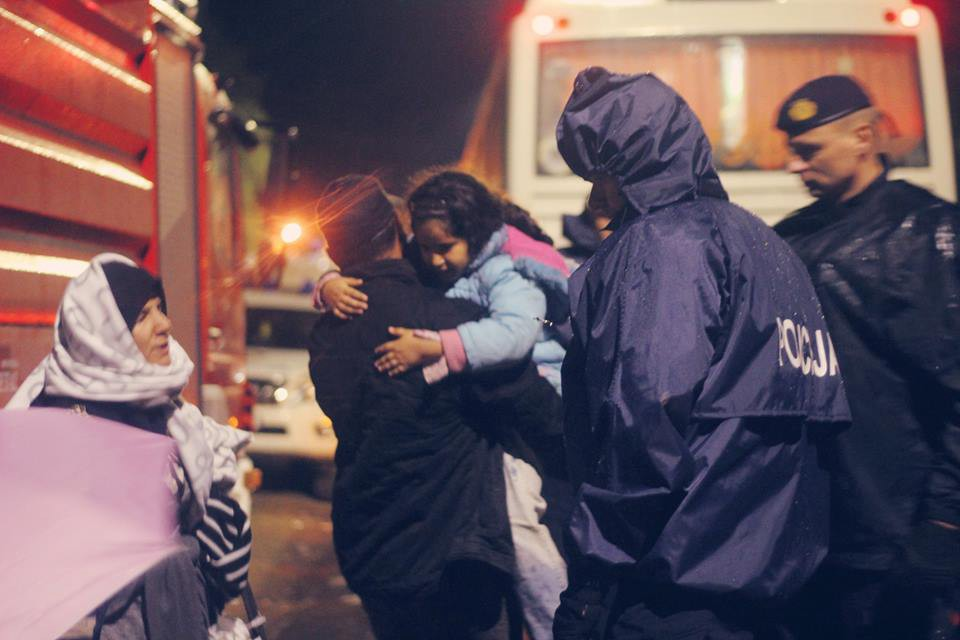
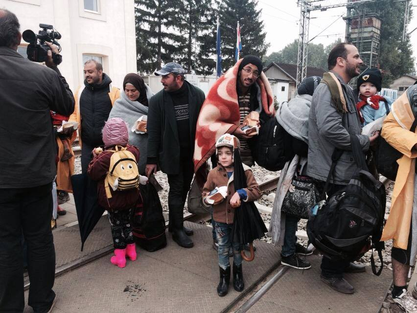
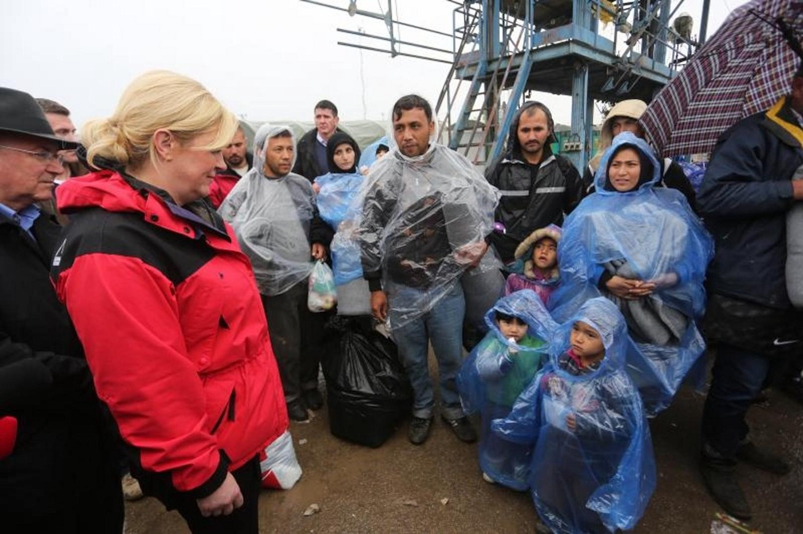
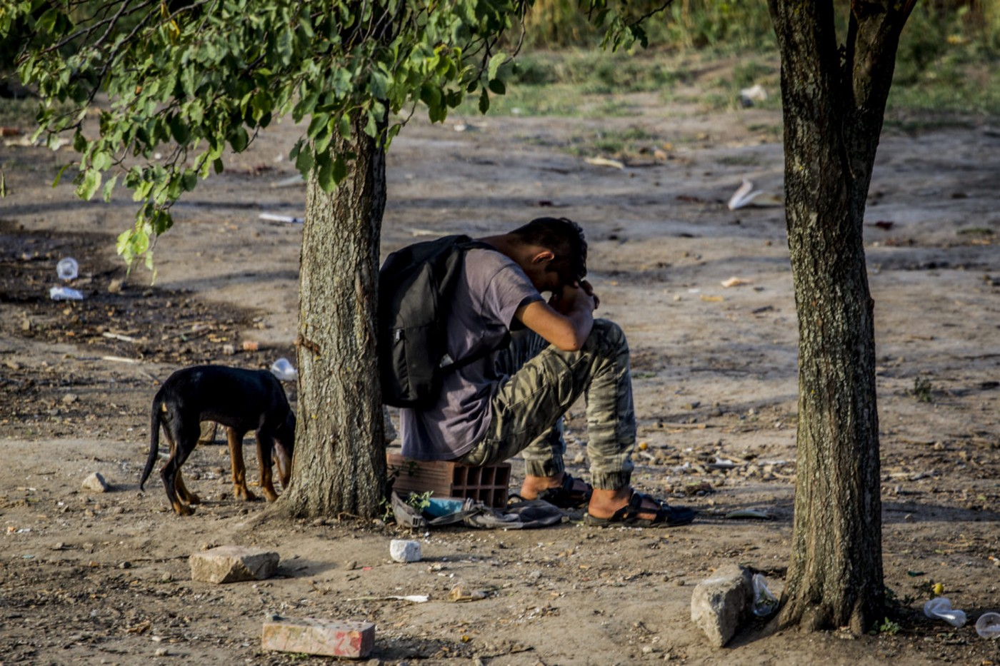
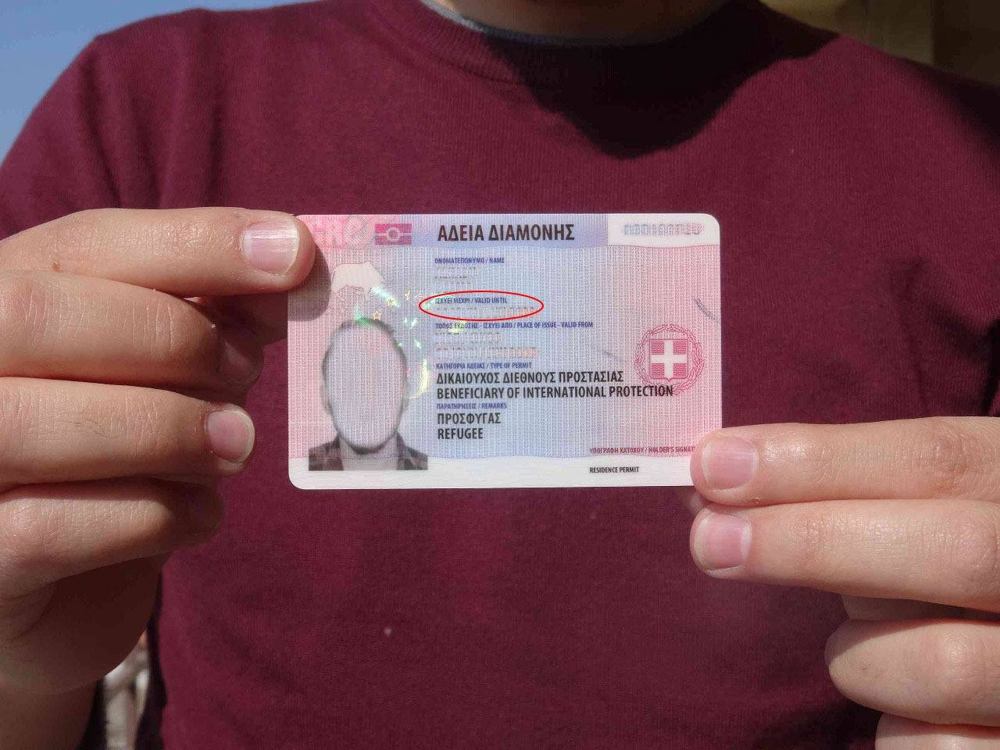
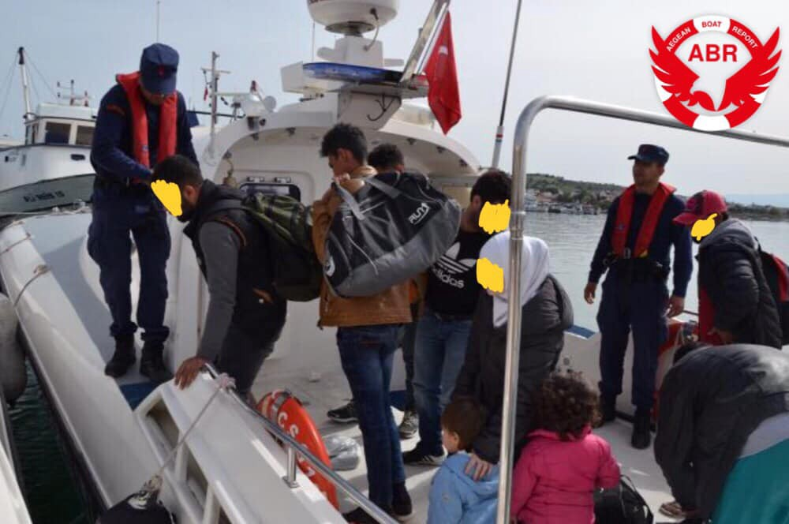
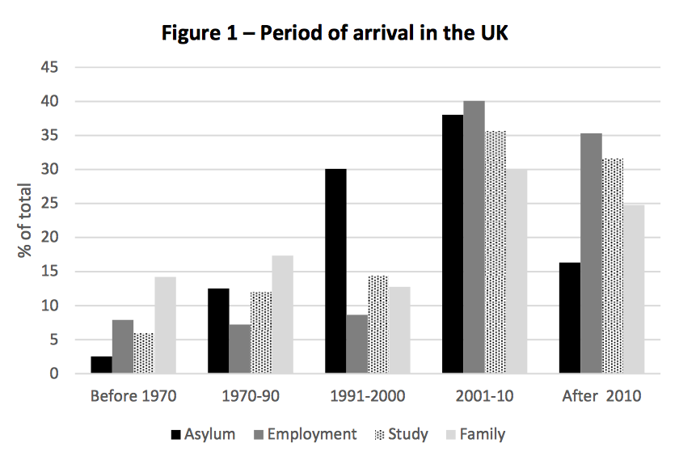
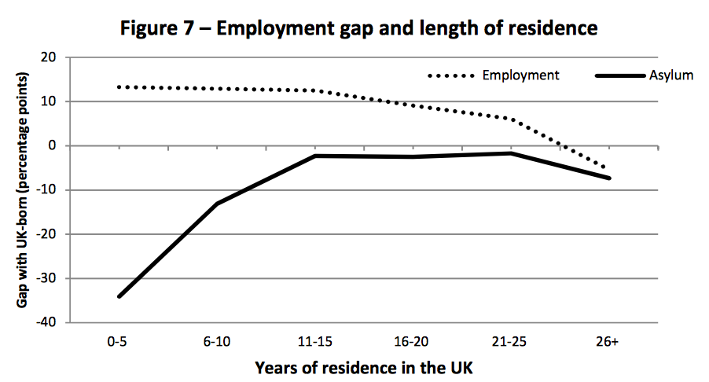

### AYS Daily Digest 26/4/19\- Croatian president: We’ve let in migrants who had money and knew how to run fast
#### Scandalous remarks on refugees come after years of anti\-migrant rhetoric by the Croatian leader\. Asylum Service warns refugees to renew their Greek residence permits ASAP\. Oxfam releases legal info for asylum seekers in 10 languages\. A group of 15 people deported to Afghanistan from Germany\. University of Oxford explores barriers to employment for “asylum migrants”

Croatian police had assisted almost 700 thousand exhausted people to pass the humanitarian corridor through Croatia until the final closure of the official route in March 2016\. Photo: Ines Tinka Kalajdzic / AYS
### FEATURE STORY: Croatian ex\-migrant president spreading the toxic narrative for her political gain

It was the late summer of 2015, when the Balkan route switched from Hungary to Croatia\. Thousands of refugees who were passing through Serbia got stuck in the mud at Croatian border, hoping to enter European Union\. Hundreds of volunteers rushed to the border area to support them\. This was how and when AYS was formed\. The political climate was very different back then: instead of the policy of closed borders and push\-backs that we see now, the Croatian ministry of interior struggled, but quickly found a way to organise a safe, humanitarian corridor through the country\. The corridor headed towards Slovenia and through Austria, finally reaching Germany, the preferred destination of the majority of the people on the move at that time\. This idealistic phase didn’t last long, and ended in March 2016, when a more conservative political party was elected, and the Balkan route was closed for good\.

More than 600 thousand refugees managed to enter Croatia in an organised manner while the humanitarian corridor was still open\. Photo: Hrvatska uživo

Even before this, in the late summer of 2015, one politician started using anti\-refugee rethoric for her own political gain\. This politician was Kolinda Grabar Kitarović, who was soon elected as Croatia’s first female president\. At the beginning of her mandate, she had briefly visited the border area\. We remember her very obvious resentment towards people who were sleeping on the cold, wet ground, cluelessly happy to see a political leader walking among them, inquiring about their situation\.

> “Only one family told me they were from Syria\. Most of them are coming from Afghanistan and Pakistan\. They’re all going to Germany\. Most of them are migrants for economical reasons\. You can feel sorry for them, but non EU nor Croatia can accept all the misery of this world”, she said a few months later, during her visit to Opatovac camp in October 2015\. 

President Kolinda Grabar Kitarović \(in red\) during her visit to Opatovac border camp, Croatia, October 2015\. Photo: Marko M\.

Shortly before this, she had paid a visit to Viktor Orban, notorious Hungarian leader who had just raised a fence on the Hungarian borders with Serbia and Croatia\. “We should learn from Hungarian example”, she told journalists back then\. And learn they did: during her rule, and after her Croatian Democratic Party got the majority in the Parliament, the Croatian interior ministry adopted the Hungarian model of violent push\-backs and total disregard for the human rights and basic safety of refugees\. Today, Croatian president Kolinda Grabar Kitarović went even further in her clueless hatred\.

> “Migrations are a natural phenomenon, but they mustn’t be chaotic and hypocritical\. And it’s hypocritical to say that we’ve helped all migrants by letting 700 thousand of them to pass \(in 2015\) \. We’ve let in those who were quick, who had money, who were young, healthy, who could walk and run fast\. At the same time, we’ve been helping those who are inciting human trafficking”, said Kolinda Grabar Kitarović on a panel discussion at the Faculty of Economy in Zagreb, Croatia\. 

Refugees stuck on outer borders of EU are slowly losing hope due to the violent behaviour of Croatian police, perpetrated by adopting practices of their Hungarian colleagues\. Photo:Border Violence Monitoring

But her mindless comments didn’t stop there\. While referring to that brief visit to the field in 2015, she described her bizarre perception of the situation:

> “When I’d see migrants, I’d often ask myself if that child, who looked terrified while holding someone’s hand, really belonged to that people? Or was it some random child that was taken with them to make it easier to pose as a refugee family?” the Croatian president said\. 

While spreading her toxic views in front of students, researchers and journalists, she forgot to mention that she was also a migrant, who went to school in the United States and worked for NATO before returning to Croatia\. Before she decided to run for president, she went on missions to Afghanistan where she happily posed with military weapons\. Today, she is one of the most popular Croatian politicians and a well\-known fan of president Trump and his anti\-immigrant politics\. Did someone mention hypocrisy?
#### Greece
### Asylum Service warns refugees to renew their Greek residence permits ASAP

The Asylum Service in Greece has announced that every person who has been granted asylum and has a residence permit that expires before 30th September 2019 can apply to renew it now\. According to the announcement, people should apply to renew their residence permits at the latest by 31st July, if their residence permit expires on 30th September\. In general, it is advisable to apply for the renewal of the residence permit as soon as possible, as processing times for the renewal can typically take longer than 2 months\.

People should apply to renew their residence permits at the latest by 31st July, if their residence permit expires on 30th September\. Photo: Mobile Info Team

> **After you have made your application for renewal, please check regularly if your permit was renewed [here](http://asylo.gov.gr/en/?page_id=3376) \. If your residence permit is about to run out, please go to the Regional Asylum Office at least 5 days before it expires and ask for an interim certificate\. This certificate proves that you have applied to renew your residence permit but the renewal is still pending\. For more info on renewing the residence permit, please click [here](https://www.mobileinfoteam.org/residence-permit) \.** 

Mobile Info Team has translated these instructions into Arabic and Farsi\. They can be found [on their Facebook page](https://www.facebook.com/mobileinfoteam/photos/a.1800063030222418/2421937128035002/?type=3&__tn__=-R&hc_location=ufi) \.
### Basic legal information for asylum applicants in Greece available in 10 languages

Greek Council for Refugees, Oxfam and European Lawyers in Lesvos have released the pamphlet titled “Seeking Asylum: basic legal information for applicants of international protection” in Lesvos\. This legal information pamphlet — which is available in ten different languages, including Greek, English, Farsi, Arabic, Somali, French, Kurmanji, Urdu, Sorani and Amharic — aims at improving access to information about the asylum process and the available legal advice for asylum applicants residing in Lesvos\. It also aims to support other actors to have a better understanding of the asylum process\. **Pamphlets can be downloaded [here](https://www.gcr.gr/en/news/press-releases-announcements/item/1135-gcr-oxfam-and-european-lawyers-in-lesvos-elil-publish-legal-information-pamphlet-aimed-at-helping-asylum-seekers-in-lesvos?fbclid=IwAR1VeiUW8cie3vTpaNw_CEI0GEW8HHGYWzz9y_KShr_luW04wW0XspQLGTU) \.**
### Only 9 boats arrive in the last 3 days, but 25 more boats have been stopped by the Turkish Coastguard

The Turkish Coastguard has been extremely active in the last few days\. Photo: ABR

In the last three days, only 9 boats carrying approximately 280 people have arrived on the Greek islands, according to the Aegean Boat Report\. The group added that in the same period, Turkish Coastguard and police have stopped 25 boats, carrying 700 people\.
### Athens: Statement by Spirou Trikoupi 17 squat, about the evictions in the past weeks

Spirou Trikoupi 17 is a a housing squat for refugees and migrants, which has been running for more than two and a half years\. In their new statement, they’re warning about three housing squats for refugees/migrants, and one feminist squat \(shelter for lgbtqi\+ people\) being evicted in the neighborhood of Exarcheia\. As a result, a large number of people have been made homeless, with many minors among them in the streets of Athens, as well as others imprisoned in detention centers\.

> “It doesn’t seem to us to be a coincidence that these evictions are happening during a very busy elections agenda\. Indeed, this year, the elections for local and regional government will take place on the same time as the elections for the European Parliament: in May 2019\. Why did they wait until now to proceed with these expulsions, if not to please the conservative tendencies, as well as to flirt with those of the racist far right?”, they’re asking\. 

Read the full statement by Spirou Trikoupi 17 [here](https://athens.indymedia.org/post/1597381/) \.
### Stuck in the limbo of Greek islands: asylum interviews scheduled for dates as far as 2023\.

According to Samos Volunteers, asylum interviews in Greece are now being scheduled for dates as far away as 2022/2023, meaning that people will live in overcrowded camps for not months but years, waiting\.

There is not much hope for people stuck in overcrowded camps\. Photo: Samos Volunteers
#### Germany
### A total of 563 people returned to Afghanistan, including a person who tried to commit suicide

According to [Saxon Refugee Council](https://www.saechsischer-fluechtlingsrat.de/de/2019/04/25/kurzinfo-zwei-personen-aus-sachsen-am-24-april-nach-afghanistan-abgeschoben/) , 15 more people were deported from this German region to Afghanistan two days ago, including a person who tried to commit suicide before being returned to the war zone\. Saxony participates in collective returns to Afghanistan since October 2017\. The number of deported Afghani people has increased to 563 with this new group of deportees\. Officials are trying to legitimize such returns by saying that deported people have been violating German laws, but 11 out of 15 people who were deported do not fit this category\.
### Posters telling Syrians to go home emerge in Berlin

■■■■■■■■■■■■■■ 
> **[Mazen Hassoun](https://twitter.com/HassounMazen) @ Twitter Says:** 

> > Wer denkt, dass der Krieg in Syrien zwischen Assad und ISIS ist, weiß nichts über Syrien und wieso die Syrer geflüchtet sind. Dieser Plakt ist sehr naiv, oberflächlich und provokant. https://t.co/SZfjK5wm9O 

> **Tweeted at [2019-04-26 10:04:26](https://twitter.com/hassounmazen/status/1121716660187074564).** 

■■■■■■■■■■■■■■ 

Identitarian posters have emerged all over Berlin, misrepresenting Syrian conflict as “Assad vs\. ISIS” and calling for refugees to go home “now that the conflict is done”\. Two different posters have been spotted, both with the text that states: “With the fall of the last IS stronghold, Syria needs young men and women to help rebuild their country after the years of war\.”
#### UK
### New University of Oxford report explores barriers to employment for “asylum migrants”

The Centre on Migration, Policy and Society \(COMPAS\) at the University of Oxfor has published [a new report](https://www.compas.ox.ac.uk/2019/refugees-and-the-uk-labour-market/) that focuses on “asylum migrants\.” The term refers to people who report moving to the UK for asylum reasons, and now remain in the UK without being dependent on refugee status\. According to the researchers, most asylum migrants have spent many years in the UK and are now British nationals\. This group should not be confused with asylum seekers, who are still waiting for a decision on their asylum application\. Results of this study can be seen as the possible forecast of the future on the labor available for people who’ve recently arrived to the UK\.

#### Key findings of the report include:
- **Asylum migrants are less likely to be in employment than individuals born in the UK and other migrant groups\.** The employment rate among asylum migrants is 51%, compared with 73% for those born in the UK\. The gap narrows over time but remains present even after more than 25 years of residence in the country\.
- **Asylum migrants who are employees earn less and work fewer hours than UK\-born and other migrant workforces\.** Asylum migrants earn an average of £9 per hour and £284 per week — 55% less per week than the UK\-born and 38% less per hour\.

- **Asylum migrants are more likely to be in self\-employment than the UK\-born and other migrants\.** In total, 21% of asylum migrants in employment are self\-employed compared to 14% among UK\-born workers\. Self\-employed asylum migrants are more likely to have employees than self\-employed UK born\.
- **Asylum migrants are more likely to report a long\-term health condition that affects their labour market performance\.** Close to 37% of asylum migrants report a health condition lasting longer than 12 months\. The likelihood of reporting this type of condition is 4 percentage points greater among asylum migrants than the UK\-born\.

#### AYS and the Daily News Digest — how to get involved?

**We strive to echo correct news from the ground through collaboration and fairness\. Every effort has been made to credit organizations and individuals with regard to the supply of information, video, and photo material \(in cases where the source wanted to be accredited\) \. Please notify us regarding corrections\.**

**Apart from daily news in English, we also publish weekly summaries in Arabic and Persian\. Find specials in both languages on our medium site\.**

**If there’s anything you want to share or comment, contact us through Facebook, Twitter or write to: areyousyrious@gmail\.com\.**

**We’re open to expanding our team of volunteer researchers, editors and info gatherers\.**

_Converted [Medium Post](https://medium.com/are-you-syrious/ays-daily-digest-26-4-19-croatian-president-weve-let-in-migrants-who-had-money-and-knew-how-to-1b7031ac18ba) by [ZMediumToMarkdown](https://github.com/ZhgChgLi/ZMediumToMarkdown)._
