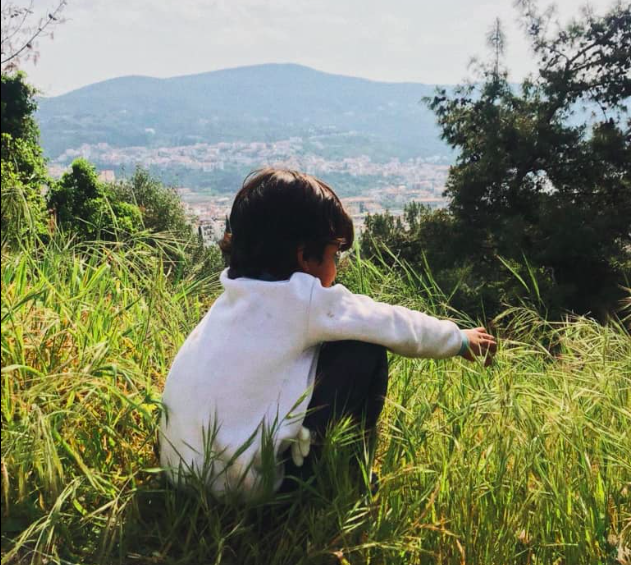
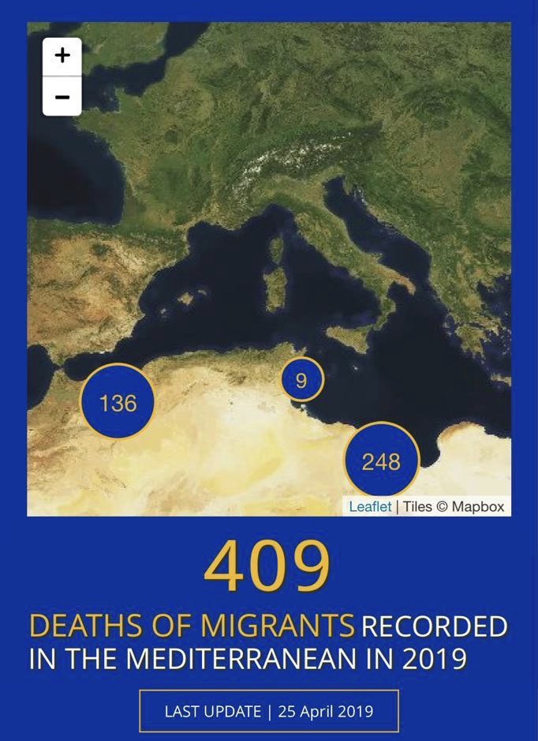

### تعرض الكثير من الأطفال في طريقهم إلى أوروبا للعنف وسوء المعاملة ، بينما يُحتجز بعضهم في الحجز
#### AYS Weekly News Summary in Arabic, April 22–28

بسیاری از کودکان در راه خود به اروپا خشونت و سو استفاده را تجربه کرده‌اند
### **البـــحر**
#### **الانقاذ ليس جريمة \!**

لقد أصبح البحر الأبيض المتوسط ​​أكبر مقبرة جماعية في العالم\. لقد مات أكثر من ١٨٠٠٠شخص وهم يحاولون المرور خلال السنوات الخمس الماضية\. “

### **الــــيونان**

تأكد من أن الجميع يعلم أنه سيتم إغلاق مكاتب اللجوء في اليونان في الأول من مايو بسبب العيد الوطني\. أيضا في عطلة نهاية الأسبوع هذه هي عيد الفصح ، لذلك عليك أن تضع في اعتبارك أنه

سيتم إغلاق الكثير من المكاتب\.

#### **الـــقادمون**

وصل ٤٤٤ شخصًا إلى جزر بحر إيجة في الأسبوع الماضي ، أي بزيادة عن الأسبوع السابق \(٣٧٧\) ، لكن بانخفاض عن ٥٠٢ الوافدين في العام الماضي خلال نفس الفترة ، وفقًا لتقرير الأمم المتحدة الأسبوعي\.

\* \* \*

يمكن العثور على بعض المعلومات الأساسية المتعلقة بطالبي اللجوء وممارسات الإدماج في كرواتيا

وسلوفينيا والنمسا وإيطاليا \(حتى الآن باللغة الإنجليزية فقط\) على هذا الموقع:

معلومات مفيدة للاجئين والمهاجرين حول دول الاتحاد الأوروبي

معلومات عن النقل وإعادة التوطين

إرشادات التوجه الاجتماعي والثقافي

دورات اللغة الكرواتية والسلوفينية الإلكترونية للمستخدمين الأساسيين

روابط إلى دورات مفيدة في اللغة الإيطالية والألمانية الإلكترونية لجميع المستخدمين

### **صــــربيا**

يدعي مركز حماية اللجوء \(ا ب س\) أنه خلال فترة خمسة أيام في أبريل ، تم ترحيل أكثر من ٥٠ شخصًا إلى صربيا\. يقولون إن \(اب س\) ليست على علم بأي رد فعل رسمي من السلطات الصربية ، أو أي نوع من التدابير التي اتخذتها الدولة\.

في القرفصاء بالقرب من \(بلدة حدودية في صربيا بالقرب من كرواتيا\) ، يوجد العديد من الشباب الذين يعيشون في ظروف سيئة للغاية أثناء انتظار عبور الحدود\. يسيطر عليهم المهربون في الغالب الذين يقنعونهم بأنهم السبيل الوحيد لعبور الناس إلى كرواتيا\. لا أحد يستطيع أن يضمن لك أي نوع من الأمن وكل محاولة لعبور تمثل عملا خطيرا ، وخاصة بالنظر إلى ردود الفعل العنيفة من شرطة الحدود\. هناك مجموعات جيدة من المتطوعين \(فريق مطعم بدون اسم — ن ن ك\) يزورون ويساعدون الناس في القرفصاء\. إذا كنت أنت أو أي شخص تعرفه بحاجة إلى مزيد من المعلومات أو المساعدة

هناك ، فيمكنك الكتابة إلينا أو سؤال المتطوعين في الموقع\.
### **الــبوسنة والــهرسك**

يتم توقيف العديد من الأشخاص الذين يحاولون الوصول إلى بيهاتش أو فيليكا كلادوسا القادمين من سراييفو أو الجزء الجنوبي الشرقي من البلاد وإقلاعهم من الحافلات عند وصولهم إلى منطقة أونا سانا ، وبالتالي لا يمكنهم الوصول إلى المنطقة الحدودية مع كرواتيا\. هذه ممارسة شائعة ، رغم أنها

غير قانونية ، من قبل الشرطة البوسنية

### من اجل حرية التنقل : معلومات مستقلة للآجئين و المهاجرين القادمين الى اوروبا

### **كــــــــرواتيا**

في مركز الاستقبال في زغرب \(بورين\) لبضعة أيام ، لم يكن هناك طبيب \(م د م\) متاح للمقيمين عادةً\. في هذه الحالات ، إذا كنت مقيمًا في بورين ، يجب عليك الذهاب إلى المركز الصحي \(دوم زدرافلييا \) في دوكافا والتحقق من ذلك هناك\. يرجى أيضًا ملاحظة أنه إذا كنت بحاجة إلى إشعار بالإجازة المرضية \(بولوفانية \) لمكان عملك ، فلن تحصل على هذه الوثيقة من أطباء \(م د م\) في بورين ، لكن يجب عليك أيضًا الذهاب إلى المركز الصحي في دوكافا\.

فيما يتعلق بالعمل ، يرجى الأخذ في الاعتبار أنه قبل التقدم للعمل أو الذهاب لمقابلات العمل ، يجب أن تحصل على تصريح عمل لأنه بخلاف ذلك لا يمكنك الحصول على وظيفة بطريقة شرعية ، وبالتالي لا يمكنك إعمال حقوق العمل الخاصة بك\. أخبرنا \(أرسل بريدًا إلكترونيًا أو اكتب إلى \(ا ي س\) على الفيسبووك إذا كنت بحاجة إلى أي معلومات أو مساعدة بخصوص ذلك\.

إذا كنت أنت أو أي من الأشخاص الذين وصلوا حديثًا ، بمن فيهم أولئك الذين انتقلوا من بوريين إلى شقة ، بحاجة إلى أي مساعدة في التوجيه أو مستلزمات النظافة أو الملابس أو الأدوات المنزلية ، فيمكنك القدوم الى المحل المجاني في \( ا ي س\) واسأل المتطوعين لدينا ، الذين سيقومون بعملهم أفضل للمساعدة\.
### **إيـــطاليا**

يبرز انفو ميكرانت أن عددًا متزايدًا من الأشخاص يحاولون الوصول إلى أوروبا عبر قبرص ، على الرغم من وجود صعوبات كبيرة تواجههم عندما يتعلق الأمر بدخول سوق العمل والوفاء بالمتطلبات\.

ويذكر أيضًا أن عمليات الإرجاع من إيطاليا إلى اليونان تحدث باستمرار بطريقة لا يُسمح فيها للناس بالنزول ، ولكن يتم إعادتهم إلى اليونان \(إذا كانوا قادمين من باتراس في اليونان أو في أماكن قريبة\) \.
### **ألـــــمانيا**

قامت السلطات الألمانية بترحيل رجل إيراني بطريق الخطأ إلى أفغانستان قبل حوالي شهرين\. على الرغم من أنهم أدركوا خطأهم ووعدوا بإعادته إلى ألمانيا ، إلا أنه لا يزال ينتظر خوفًا ، ويعيش في بلد لعدة أشهر ليس حتى بلده\. اكتشف كيف يمكنك أن تساعد\. تقف \(ا ي س\)في تضامن مع الأشخاص

الذين تم ترحيلهم خطأً في المقام الأول
### **الـــدنمارك**

استمرت الاحتجاجات أمام سجن ايلبيك خلال الأسبوع الماضي\. طالب المتظاهرون بإغلاق جميع معسكرات الترحيل\.

للمزيد من المعلومات عن المراكز في صفحتنا
### **المـملكة الـمتحدة**

تم العثور على رجل ميت تحت عربة حافلة متجهة من بروكسل إلى المملكة المتحدة\. من المحتمل أن موته كان فوريًا تقريبًا بالنظر إلى الموقف الذي عثر عليه تحت الحافلة\. تم التعرف عليه من بصمات أصابعه الموجودة في نظام الانتربول\. يقف \(ا ي س\) في تضامن مع كل شخص يوضع في مواقف يائسة بما يكفي ويضع نفسه في خطر جسيم ويبدو أنه السبيل الوحيد للخروج\.
### **الأطـفال والـقصر**

خلال الأشهر الأربعة الأولى من عام ٢٠١٩، وصل ١٦٠٠٠ شخص إلى أوروبا ، من بينهم أكثر من ٣٨٠٠ طفل ، أو واحد من بين كل أربعة من الوافدين\. في الوقت الحالي ، تشير بيانات اليونيسف إلى وجود ١٧٣٠٠ طفل غير مصحوبين بذويهم ومنفصلين مسجلين في اليونان وإيطاليا وبلغاريا وصربيا والبوسنة والهرسك\.

> تعرض الكثير من الأطفال في طريقهم إلى أوروبا للعنف وسوء المعاملة ، بينما يُحتجز بعضهم في الحجز\. 

في اليونان — حيث وصل خلال هذا العام وحده ٢٠٧٧ طفلاً — يوجد حالياً حوالي ٢٨٠٠٠ طالب لجوء طفل \(منهم ٣٥٣٥ غير مصحوبين بذويهم\) \. أسوأ وضع لهؤلاء الذين يتم حفظهم في المناطق الساخنة\. أكثر من نصف القاصرين غير المصحوبين بعمر ١٨ سنة خلال هذا العام ، مما سيضعهم في وضع أكثر خطورة ، مما يتركهم دون بعض المزايا التي يحق لهم الحصول عليها كقاصرين\. هذا هو الحال أيضًا بالنسبة للعديد من الأطفال الذين جاءوا مع أسرهم ، والذين رأى آباؤهم رفض طلبات اللجوء الخاصة بهم\.

في البوسنة ، التي تحولت إلى نقطة ساخنة ، وصل أكثر من ٣٦٠٠ شخص \(في توزلا وحدها يوم الأربعاء ، وصل أكثر من ٢٠٠ شخص\) حتى الآن هذا العام\. تشير التقديرات إلى وجود حوالي ٦٥٠٠ شخص في البلاد في الوقت الحالي ، ومن بينهم ١٩ في المائة على الأقل من الأطفال ، و ٧ في المائة من الأطفال غير المصحوبين بذويهم\. تشكل الظروف المعيشية للأطفال ، غير المصحوبين أو غير المصحوبين ، مخاطر جسيمة على الصحة والسلامة\. عدد الأطفال الذين ينامون في العراء مرتفع ، على الرغم من أن العديد منهم في مراكز إقامة مؤقتة تديرها المنظمة الدولية للهجرة ، ولكن حتى هناك ، فإن الرعاية الأساسية محدودة\.

في الوقت نفسه ، نشرت يورو ستيت أحدث بياناتها التي تبين أنه خلال عام ٢٠١٨ ، منحت الدول الأعضاء في الاتحاد الأوروبي وضع الحماية لحوالي٣٣٣٤٠٠ طالب لجوء ، وهو ما يقل بنسبة ٤٠ في المائة عن العام السابق\.

من بين جميع الأشخاص الذين مُنحوا وضع الحماية في عام ٢٠١٨ في الاتحاد الأوروبي ، مُنح ١٦٣٨٠٠ شخصًا وضع اللاجئ \(٤٩٪ من جميع القرارات الإيجابية\) ، وتم منح ١٠٠٣٠٠حماية فرعية \(٣٠٪\) وتم منح ٦٩٣٠٠ تصريحًا بالبقاء لأسباب إنسانية \(٢١ ٪\) \.

أكثر من ثلث قرارات اللجوء الممنوحة في المقام الأول في الاتحاد الأوروبي أسفرت عن حالة الحماية\. في نفس الفترة الزمنية ، تم تقديم أكثر من ٢٤٨٠٠ طلب لجوء جديد في الدول الأعضاء\.

معظم الأشخاص الذين منحوا حق اللجوء في الاتحاد الأوروبي هم من سوريا \(٩٦١٠٠ شخص ، أو ٢٩٪ من العدد الإجمالي\) ، يليهم مواطنو أفغانستان \(٥٣٥٠٠أو 16 ٪\) ومن العراق \(٢٤٦٠٠ أو ٧٪\) \.

معظم السوريين الذين حصلوا على اللجوء هم في ألمانيا \(٦٧٠٠٠\) \.

**يتوفر الكثير من الأخبار باللغة الإنجليزية يوميًا على صفحتنا في موقع الميديوم**

**في حال كان لديك أسئلة أو ترغب في نشر معلومات معينة ذات صلة بإجراءات اللجوء أو بلد اخباره مهمة ، يرجى عدم التردد في الكتابة إلينا — إما عن طريق إرسال رسالة إلينا على فيسبوك أو إرسال بريد إلكتروني إلى**

[**areyousyrious@gmail\.com**](mailto:areyousyrious@gmail.com)

_Converted [Medium Post](https://medium.com/are-you-syrious/%D8%AA%D8%B9%D8%B1%D8%B6-%D8%A7%D9%84%D9%83%D8%AB%D9%8A%D8%B1-%D9%85%D9%86-%D8%A7%D9%84%D8%A3%D8%B7%D9%81%D8%A7%D9%84-%D9%81%D9%8A-%D8%B7%D8%B1%D9%8A%D9%82%D9%87%D9%85-%D8%A5%D9%84%D9%89-%D8%A3%D9%88%D8%B1%D9%88%D8%A8%D8%A7-%D9%84%D9%84%D8%B9%D9%86%D9%81-%D9%88%D8%B3%D9%88%D8%A1-%D8%A7%D9%84%D9%85%D8%B9%D8%A7%D9%85%D9%84%D8%A9-%D8%A8%D9%8A%D9%86%D9%85%D8%A7-%D9%8A%D9%8F%D8%AD%D8%AA%D8%AC%D8%B2-%D8%A8%D8%B9%D8%B6%D9%87%D9%85-%D9%81%D9%8A-%D8%A7%D9%84%D8%AD%D8%AC%D8%B2-aac68aceb83b) by [ZMediumToMarkdown](https://github.com/ZhgChgLi/ZMediumToMarkdown)._
