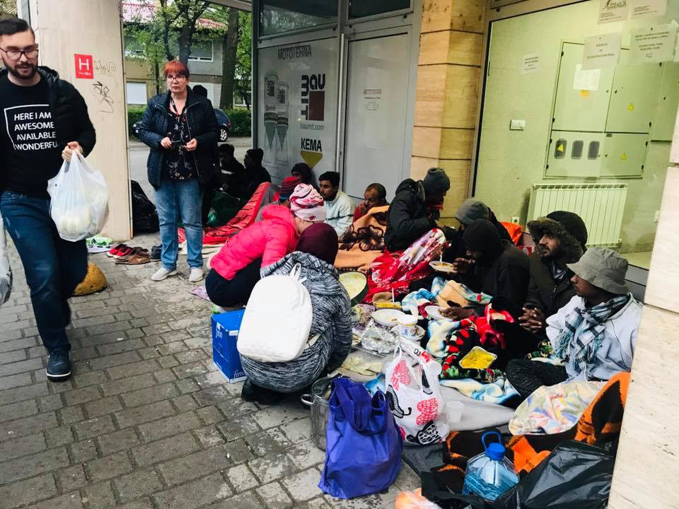
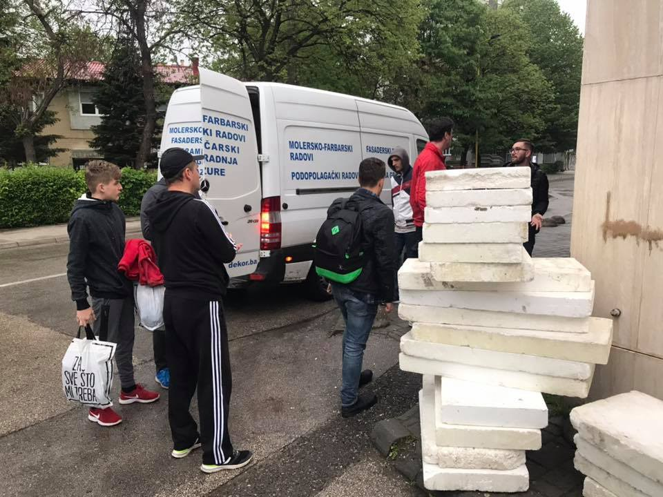
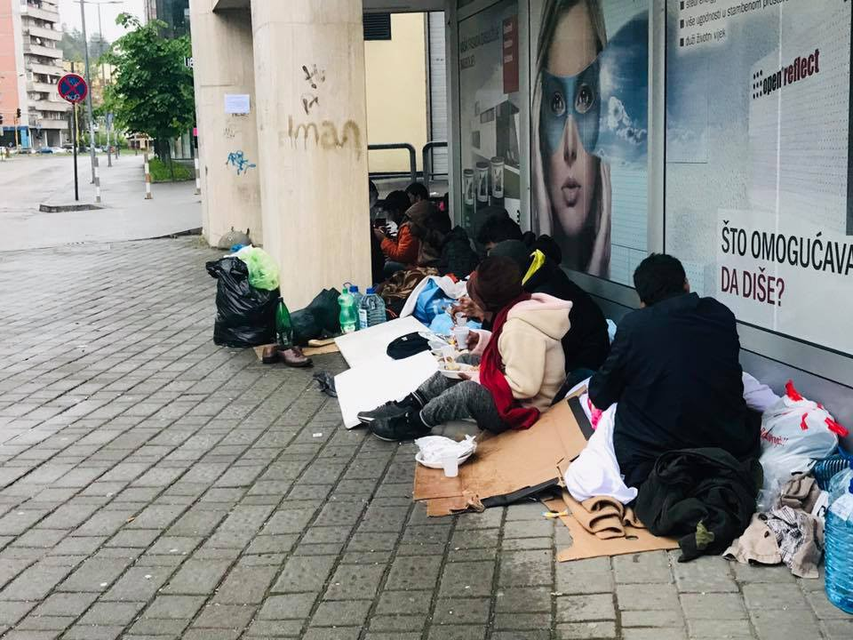
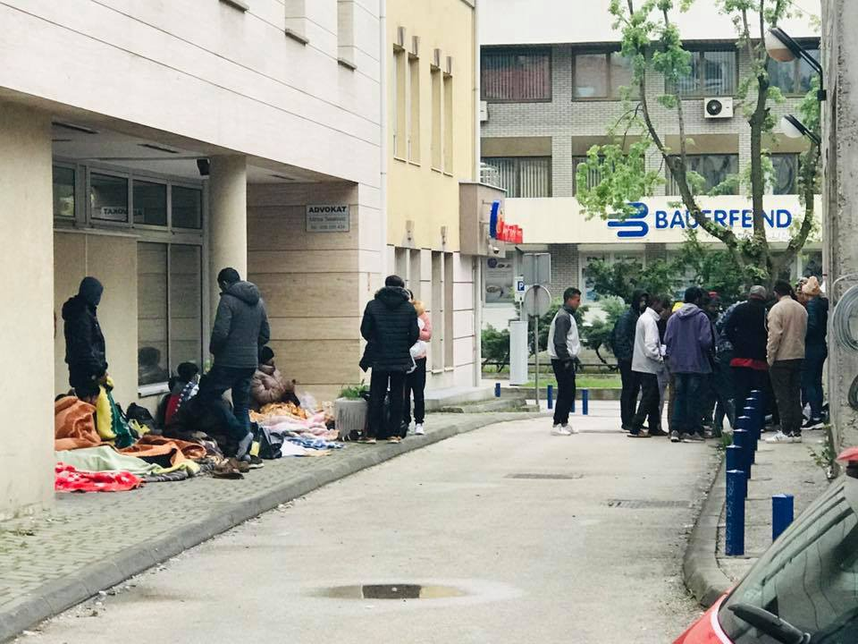
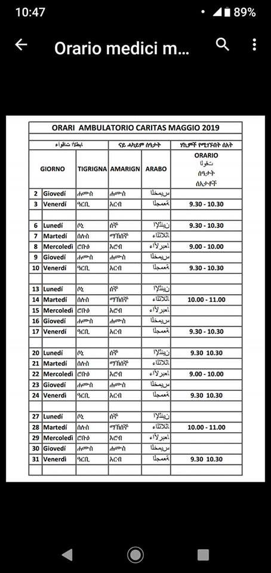
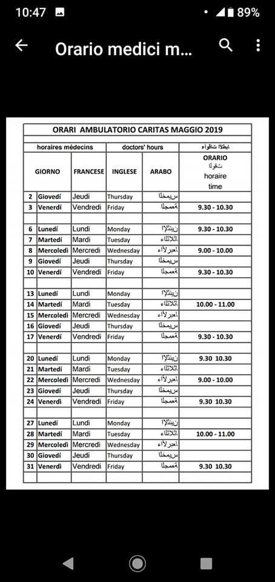

### التحديثات الأسبوعية والأخبار من جميع انحاء العالم
#### AYS Weekly News Summary in Arabic, April 29–May 5

 \)](assets/6ad1f1a96889/1*RCDv4yGz4yoGGOvtiRwp9w.jpeg)

حدث إخلاء آخر في سانت دينيس ، باريس ، دون سابق إنذار للناس أثناء التنقل — \( [Solidarité migrants Wilson](https://www.facebook.com/Solidarit%C3%A9-migrants-Wilson-598228360377940/?__tn__=%2CdkCH-R-R&eid=ARD0jtiUPhxFLVkOnJJiC506s4XksCMPwSYKznvcNgdN-jlIFd6lKZ8fpbL9OPY_bOuSRdf_C5f9RGHB&hc_ref=ARSPUqvrSVareKqujU5Z9GNXZ2GIa8uXDN620TdPX-O16awckWc9e9URAoqsbfNzbnI&hc_location=group) \)
### **ليبيا**

ليس فقط يتم إعادته الأشخاص قسراً إلى بلدانهم الأصلية ، بل يتم تركهم يتضورون جوعًا بسبب مضاعفة أسعار المواد الغذائية فقط في الشهر الماضي ، [وفقًا لتقرير](https://www.aljazeera.com/news/2019/05/tripoli-conflict-continues-detained-migrants-run-food-190502135744216.html) سالي هايدن الأخير من مركز احتجاز أبو سليم ، حيث يوجد أكثر من ٤٠٠ شخص \(بما في ذلك ٣٠ طفلاً\) منعزلون

### **اليونان**
#### أهمية البيانات الشخصية الصحيحة من البداية

أفاد فريق معلومات الجوال للاجئين في اليونان أنهم غالبًا ما يتلقون طلبات من أشخاص يطلبون المساعدة في تغيير التفاصيل على بطاقاتهم البيضاء لأن الاسم أو تاريخ الميلاد غير صحيح\. بشكل عام ، ليس من السهل تغيير المعلومات غير الصحيحة على البطاقة البيضاء\.

> غالبًا ما نتلقى طلبات من أشخاص يطلبون المساعدة في تغيير التفاصيل على بطاقاتهم البيضاء \(الاوزفايز \) لأن الاسم أو تاريخ الميلاد غير صحيح\. بشكل عام ، ليس من السهل تغيير المعلومات غير الصحيحة على البطاقة البيضاء\. لذلك ، من الضروري التأكد من قيامكم بتزويد الشرطة بتفاصيلكم الصحيحة عندما تحصلون على مذكرة الشرطة الخاصة بكم \(الخارطية\) والأهم من ذلك مكتب اللجوء عندما يطلبون بياناتكم\. يرجى التحقق مرة أخرى من المعلومات التي تقدمونها للسلطات والإصرار على تصحيح البيانات الخاطئة\! إذا احتجتم إلى تغيير بياناتكم على البطاقة البيضاء \(الاوزفايز\)، فستحتاجون إلى جواز سفر أصلي أو بطاقة هوية أصلية من بلدكم الأصلي\. إذا لم يكن لديكم ، فسيتعين عليكم تقديم شهادة ميلاد أو شهادة زواج ، والتي ستحتاجون إلى التحقق من صحتها وترجمتها رسميًا إلى اليونانية\. يجب أن تكون جميع المستندات التي تحضرونها لتقديم التفاصيل الصحيحة أصلية ، فالصورة أو النسخة ليست كافية\. مع الوثيقة التي تثبت تفاصيلكم الصحيحة ، يجب عليكم الذهاب إلى مكتب اللجوء الإقليمي \(المحلي\) المسؤول عنكم وتقديم طلب لتغيير بياناتكم\. للمساعدة في تغيير بياناتكم ، يرجى الاتصال بمحاميكم أو مرشد اجتماعي أو إرسال رسالة إلينا\. 

للحصول على مساعدة في تغيير بياناتك ، يرجى الاتصال بمحاميك أو أخصائي اجتماعي أو إرسال رسالة [الفريق المتنقل لمعلومات اللاجئين](https://www.facebook.com/mobileinfoteam/?__tn__=kC-R&eid=ARANn0_tpx_GlTaOCnYPq0skkbONmaEQMr0gLeerHQAk-YH1hXhXaZX8JMas0QgyTK3yFxJs6hrQokN1&hc_ref=ARS1iudm96ZkFl_5GoAMbLduGmsg_ihYk2JeU55QLs1RsQGK8sY_9BJAowINvCUqYrw&fref=nf&__xts__%5B0%5D=68.ARCAPA6HDzKLEmR4fvcwA_Z66VHsbXh6BDu9fsKpZynhPQSLzZNNG9dF-imSrizYrv9SnIpARKCEolr7tOSbXsGC2hL24XYAasOoLs6CsKjZrSN0SLyIJQO4MUarTXdJ21vsjLdfs9IyLsEMiJaDf-5z6b1WTrRHmEh1rceCZdCbPQppeao6yY-79DTA1dfLcFyQg4FXfypRrVF4-MUczU83r7ZibFacJ8rbTqQGAVdBh2JjUver-XoGV0AuqcO8MGPQc5DV1vOjZSPbTjl2_8gaMzOPAKgJG3qcYxtL4z25_pl66Pbkexy2rBtELSmrbGXjDaHDi3pwci1Ijh3nvBsriTyj) \.
#### **معلومات قانونية**

يتوفر كتيب المعلومات القانونية بعشر لغات مختلفة: اليونانية والإنجليزية والفارسية والعربية والصومالية والفرنسية وكورمانجي والأردية والسورانية والأمهرية\.

تهدف إلى تحسين الوصول إلى المعلومات حول عملية اللجوء والمستشارين القانونيين المتاحين لطالبي اللجوء المقيمين في ليسفوس ، وكذلك دعم الفاعلين الآخرين للحصول على فهم أفضل\.

### **البوسنة والهرسك**
#### توزلا

السكان المحليون في توزلا هم الأشخاص الذين يساعدون الأشخاص أثناء التنقل عبر مدينتهم في طريقهم نحو الجزء الغربي \(الحدودي\) من البوسنة والهرسك\. لقد مضى وقت طويل على اقتراح المتطوعين بتغيير على مدار ٢٤ ساعة في خدمة شؤون الأجانب ، لذلك لن يضطر الناس إلى النوم بقسوة ولن يزداد عدد الأشخاص\. ومع ذلك ، فإن الوضع الحالي هو أنه إذا وصلت إلى المدينة خلال المساء أو عطلة نهاية الأسبوع أو العطلات ، فسوف تضطر إلى النوم في الخارج والانتظار لفتح المكتب\. يعمل كل يوم عمل من٩ إلى ١٧ \.

توزلا

تتوفر المعلومات القانونية من خلال [فاشا برافا](https://help.unhcr.org/bosniaandherzegovina/where-to-seek-help/vasa-prava-bih/) ، وهي خدمة قانونية مجانية تعمل جنبًا إلى جنب مع مفوضية الأمم المتحدة لشؤون اللاجئين في البوسنة والهرسك ، في المكاتب الميدانية في مدن مختلفة\.
### **كرواتيا**

تتوفر المساعدة القانونية المجانية من خلال مركز القانون الكرواتي \(ه ب س\) لطالبي اللجوء والأشخاص الذين مُنحوا اللجوء في مراكز الاستقبال في زغرب \(بورين\) و كوتينا، مركز استقبال الأجانب ، ييشيفو، لأولئك الأطفال والقصر الذين البقاء في أنواع مختلفة من مراكز الرعاية الاجتماعية ، ودمج دار الصليب الأحمر ، وفي مكتب القانون الكرواتي مركز \(ه ب س\) \.

[إليك المزيد من](https://gov.hr/moja-uprava/pravna-drzava-i-sigurnost/pravna-zastita/besplatna-pravna-pomoc/486) المعلومات حول المساعدة القانونية المجانية ، وهي مكتوبة بوضوح ، لذلك إذا كنت تستخدم مترجمًا عبر الإنترنت ، فستتمكن من فهم كل شيء جيدًا\. من المهم أن تكون على علم بحقك في الحصول على مساعدة قانونية مجانية ، وحقك في الحصول على المعلومات ، وكذلك الرعاية الصحية والتعليم لأطفالك ، إذا كنت تحت حماية فرعية أو مع اللجوء في كرواتيا\.

**خلال الأسبوع القادم في مركز استقبال بورين، لن تكون هناك أنشطة يقيمها متطوعو \(ا ي س\) أو حضور فريقنا في بورين\. هذه هي المعلومات الوحيدة التي يمكننا مشاركتها حتى الآن ، لكننا سنبقي الجميع على اطلاع دائم بالنتائج التي تؤثر على عملنا بعد هذا الأسبوع\. في الوقت الحالي ، نحن تحت تصرف الجميع في متجرنا المجاني ومن خلال الاتصال المباشر\.**
### **هنكاريا**

في الآونة الأخيرة ، هناك العديد من التقارير المثيرة للقلق والتي تفيد بأن المهاجرين في مراكز الاحتجاز في المجر قد حرموا عمداً من الطعام بما يتعارض مع القوانين والمعايير الدولية\. كل هذا نتيجة للسياسات الهنغارية المناهضة للهجرة التي لن تتغير في أي وقت قريب ، لذلك على أي شخص يسافر من صربيا أو بلغاريا أن يضع ذلك في الاعتبار\.

في مقطع فيديو تم التقاطه أثناء رحلته ونشر على صفحته على فيسبووك، قال الوزير الإيطالي الشهير سالفيني إن السياج \[بين صربيا والمجر\] تم بناءه لمنع الهجرة غير الشرعية وأن الدخول إلى أوروبا كان ممكنًا فقط بإذن\.

أظهر شريط فيديو آخر سالفيني وأوربان وهو يحتضن ويمتد على طول السياج الحدودي معًا\.

### **إيطاليا**
#### فينتيميليا

ساعات العمل لعيادة كاريتاس لشهر مايو

#### الشمال

أمرت محافظة أوديني بترحيل العائلات والأطفال والأشخاص المستضعفين إلى الثكنات السابقة كافارزراني ، والتي تحولت إلى \(مركز للاستقبال غير العادي\) في أبريل ٢٠١٥، على الرغم من سعة غير واضحة\. لقد تم استيطان حوالي ٣٠٠\- ٤٠٠ شخص في الأشهر الماضية ، لكن ذلك وصل إلى ذروة ١٠٠٠ شخص حاضر في نفس الوقت في الهيكل\.

> مع وجود أعداد كبيرة غير واضحة مثل هذه ، ليس من المستغرب أن تكون الظروف المعيشية قاسية بشكل لا يصدق ، ولا يتم مراعاة الحد الأدنى من الاعتبار من قبل السلطات التي تدير الهيكل ، ولا سيما الصليب الأحمر الإيطالي ، في احترام الخصوصية والرعاية الكافية للحالات الضعيفة للغاية\. 

لذلك ، من المثير للصدمة أن نسمع أن محافظ أوديني أمر بنقل ٧٠ شخصًا ، وهم في حاجة إلى علاج نفسي — بعضهم انتحاري أيضًا ، وأمهات عازبات مع أطفال \(أحدهن معوقات\) ، والنساء الحوامل والأسر التي لديها أطفال في سن الدراسة — إلى الهيكل مع إشعار أقل قدر من شهر واحد\.
#### **روما**

مكتب الهجرة في كويستورا في روما لم يجدد تصاريح الإقامة لحاملي الحماية الدولية الذين يقدمون شهادة إقامة بعنوان “تقليدي” ، وهذا يعني أن جميع أولئك الذين يحملون ورقة حماية دولية ، ولكن بلا مأوى أو ليس لديهم الإقامة المستقرة أو عقد الإيجار ، يتم استبعادها بحكم الواقع من تجديد التصريح\. يبدو أن هذا القرار قد اتخذ بسبب تدابير الأمن العام ، مما يجعل من دون عنوان “تقليدي” لا يمكن تعقبه تقريبًا\.

قدمت المنظمات بون بون ديريتو ، بالتعاون مع \(س ي ر\)، المجلس الإيطالي للاجئين ، استئنافات قانونية ضد هذا القرار من قبل مكتب الهجرة ، وفي إحدى الحالات العاجلة ، أمرت المحكمة بالإفراج الفوري عن التصريح الجديد\.

[شاهد هنا](https://www.facebook.com/abuondiritto/posts/2407234219506882?hc_location=ufi)
### **فرنسا**

حدث إخلاء آخر في سانت دينيس ، باريس ، دون سابق إنذار للناس أثناء التنقل ، ولا للجمعيات العاملة في المنطقة\. لم تشرح السلطات أين سيتم نقل الأشخاص وما الذي سيحدث لهم ، ولكنها دمرت جميع ممتلكاتهم الشخصية لأولئك الذين لا يريدون ركوب الحافلات\.

على الرغم من أن السلطات لا تعرف من أين ستنقل طالبي اللجوء الذين يعيشون في سانت دينيس ، إلا أنه ما زال يتم التعرف على الأشخاص وربما يتم نقلهم إلى مراكز الاستقبال في المنطقة ، لكن الإجراءات لا تزال غير واضحة\.

](assets/6ad1f1a96889/1*saIphOiyT-BY1HaiRuNsbw.jpeg)

[Solidarité migrants Wilson](https://www.facebook.com/Solidarit%C3%A9-migrants-Wilson-598228360377940/?__tn__=%2CdkCH-R-R&eid=ARD0jtiUPhxFLVkOnJJiC506s4XksCMPwSYKznvcNgdN-jlIFd6lKZ8fpbL9OPY_bOuSRdf_C5f9RGHB&hc_ref=ARSPUqvrSVareKqujU5Z9GNXZ2GIa8uXDN620TdPX-O16awckWc9e9URAoqsbfNzbnI&hc_location=group)
### **إسبانيا**

احتُجز ٣١ شخصاً فروا من الاضطهاد السياسي في المغرب في مركز ما قبل الترحيل في فالنسيا لمدة ١٠ أيام\.

ويمكن الاطلاع على مزيد من المعلومات هنا\.

**يتوفر الكثير من الأخبار باللغة الإنجليزية يوميًا على صفحتنا في موقع الميديوم**

**في حال كان لديك أسئلة أو ترغب في نشر معلومات معينة ذات صلة بإجراءات اللجوء أو بلد اخباره مهمة ، يرجى عدم التردد في الكتابة إلينا — إما عن طريق إرسال رسالة إلينا على فيسبوك أو إرسال بريد إلكتروني إلى**

[**areyousyrious@gmail\.com**](mailto:areyousyrious@gmail.com)

_Converted [Medium Post](https://medium.com/are-you-syrious/%D8%A7%D9%84%D8%AA%D8%AD%D8%AF%D9%8A%D8%AB%D8%A7%D8%AA-%D8%A7%D9%84%D8%A3%D8%B3%D8%A8%D9%88%D8%B9%D9%8A%D8%A9-%D9%88%D8%A7%D9%84%D8%A3%D8%AE%D8%A8%D8%A7%D8%B1-%D9%85%D9%86-%D8%AC%D9%85%D9%8A%D8%B9-%D8%A7%D9%86%D8%AD%D8%A7%D8%A1-%D8%A7%D9%84%D8%B9%D8%A7%D9%84%D9%85-6ad1f1a96889) by [ZMediumToMarkdown](https://github.com/ZhgChgLi/ZMediumToMarkdown)._
