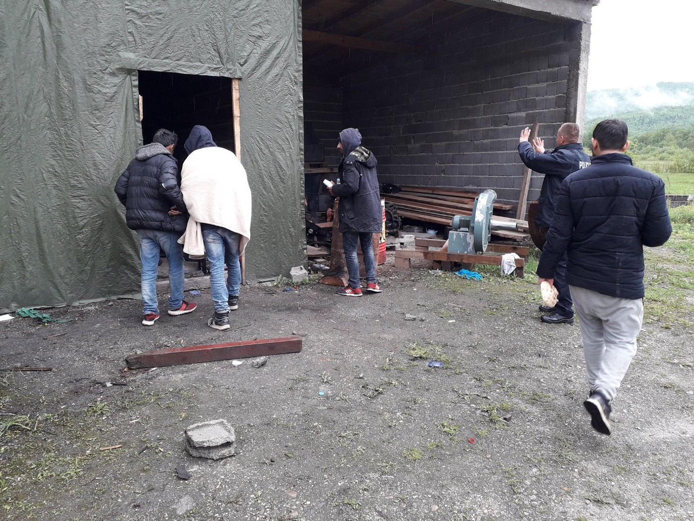
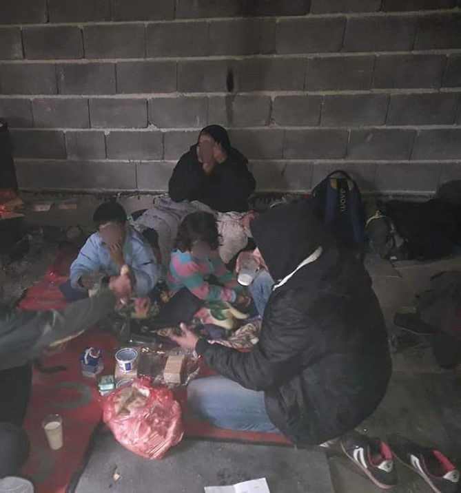
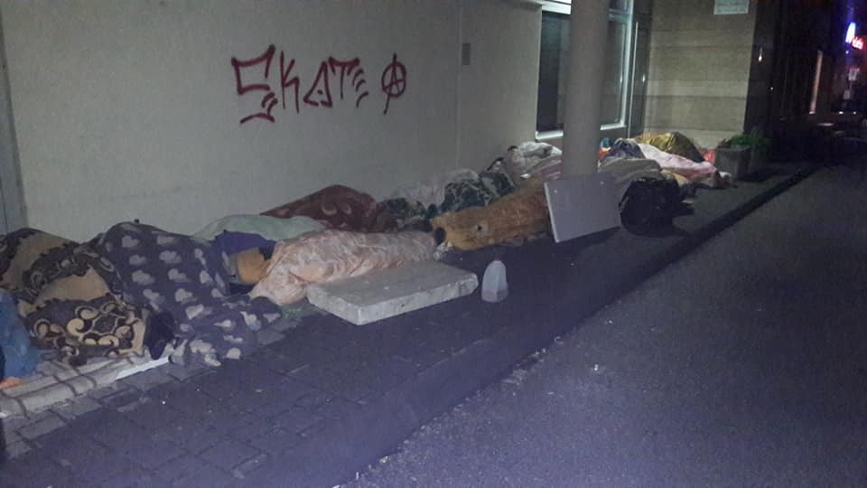

### AYS Weekend Digest 04–05/5/19: Border agreement with Albania now operational
#### Frontex to be deployed at the border with Greece / Surge of arrivals to the northwest Bosnia and Herzegovina, still no adequate official response / Turkish bar association letter / Protest march against deportations in Iceland / Update from the Mediterranean

](assets/cef3237366b5/1*7ZvR29MH8p8FGOt2tIunKw.jpeg)

By the end of May, Frontex staff will be deployed at the Greek\-Albanian border\. Photo: [Frontex](https://www.facebook.com/frontex/photos/a.449361672224673/539438209883685/?type=3&theater)
### FEATURED STORIES
#### EU: Border Guard agreement with Albania

Since the beginning of this month, an agreement between Albania, and the European Border and Coast Guard, also known as Frontex, is [operational](http://europa.eu/rapid/press-release_MEX-19-2336_en.htm?fbclid=IwAR0eOswgdY82vT6MjIjETttmvpWrS3IuOpXVcMnIZSrGqDYqby1WBQoRJlw) \. It is the first time cooperation with a neighboring non\-EU country\. It allows the agency “to carry out joint operations and deploy teams at the borders shared by Albania and the EU to help tackle irregular migration, especially in the case of sudden changes in migratory flows and cross\-border crime, in agreement with the Albanian authorities and the authorities of those EU Member States bordering the area of operations\.” This allows the agency to intervene on Albanian territory, the activities include tackling illegal migration, sudden changes in migratory flows and cross\-border crime\. The plan for each operation has to be [agreed](https://www.consilium.europa.eu/de/press/press-releases/2018/10/05/border-management-eu-signs-agreement-with-albania-on-european-border-and-coast-guard-agency-cooperation/) with Albania\.

The first teams shall be deployed at the Greek\-Albanian border at the end of May\. The EU is working on similar agreements with North Macedonia, Serbia, Bosnia and Herzegovina, and Montenegro\. By 2027 the agency is supposed to be supplied with a standing corps of 10,000 border guards; the EU Parliament [adopted](http://europa.eu/rapid/press-release_IP-19-2166_en.htm) the Commission’s proposal in April this year\. This new corps is expected to be available for deployment from 2021 on\. The European Border and Coast Guard was established in 2016 on the existing structures of Frontex\. It is responsible for the border control in the Schengen area in coordination with the national authorities\. The full agreement can be found [here](http://data.consilium.europa.eu/doc/document/ST-10290-2018-INIT/en/pdf) \. And more info about the agency [here](https://ec.europa.eu/home-affairs/sites/homeaffairs/files/what-we-do/policies/european-agenda-migration/20190401_managing-migration-factsheet-european-border-and-coast-guard_en.pdf) \.
#### Bosnia and Herzegovina — a tough weekend for people on the move — waiting, tired, sick and ignored

With rain and strong winds, several days of public holidays and persistent ignorance by the authorities, this has been a difficult few days for everyone\.

Many were stopped midway to the north\-west and, once again, illegally and unfairly removed from the buses, as a part of the racially profiled activity of the police that has been going on for a while now\. The police of the Republic of Srpska also took a group of people who were traveling from Jajce towards Banja Luka and brought them to the infamous point in Velčevo\. Those spotted in Bosanski Petrovac and Sanski Most, as local Red Cross volunteers write, are also brought to that point\. At this place there is no electricity, no water, toilets or showers, so being dropped off this way in the middle of nowhere is even more devastating to \.

The nearest camp is the one in Bihać \(100 km away\) and people are not allowed to move there, nor to go back to Sarajevo, being refused by the police, who state as their reason that “they’re not allowed to drive people in that direction\.” People are forced to stay there for a long time, desperate and abandoned, sometimes squatting in empty houses, most of the time sleeping in the rough literally in the middle of nowhere, assisted in clothes and food by the local volunteers\.

> 75 adults, 11 unaccompanied minors, four families \(four women and four children aged 1 to 5, with serious bronchitis and pharyngitis\) were stopped and left this way in the past few days, as Red Cross volunteers from Ključ report\. 

Photos: Crveni Križ Općine Ključ

There are more and more people arriving in Tuzla, more young people and families with children\. The locals are also increasing their solidarity, day and night, but the needs are growing\. This weekend has seen many small groups, some people found in garages and seen in the streets of smaller villages on their way towards Tuzla, so more are expected\. While women from Tuzla have arranged shifts for cooking meals for supper, food and clothes are being brought to the few overwhelmed coordinators of the group, the government continues to ignore everything, even their own citizens, with no interest for what is going on, how to assist, let alone how deal with the matter in the town\. Many are unanswered questions, and arrivals continue\.

On Sunday evening, sometime after midnight, three babies arrived among the latecomers…

Photos by N\.M\., volunteer from Tuzla’s Refugees Welcome citizens group

The questions volunteers have still remain — are they “allowed” to house the people in private homes? What to do when people have nowhere to go and they can’t be taken to a hostel without official documentation? When will the officials finally create decent conditions for people waiting to be received in the office that has working hours as if it’s operating under normal conditions, oblivious to the reality of the situation?

Monday is the first working day of the office after several days of holidays \( \! \) during which many people arrived and have been **waiting to receive a paper that in fact doesn’t mean or guarantee anything, all the while sleeping in the rough** in yet another city that’s relying on the kindness of strangers, a small group of citizens\.

Bihać is seeing extensive crisis, too\. The locals there are struggling with trying to assist many people, but are without basic things to be able to answer the needs\. If you can and wish to help them, let us know and we will put you in contact with those active 24/7\.

From the experience of other such cases we are aware of, regardless of the will and hearts invested, without substantial support from the officials and organizations working in the area, the current function is not sustainable\. If you wonder what to do and how to help, apart from funding the existing local efforts, contact your representatives in Bosnia and Herzegovina, let them know that it’s widely known what is taking place and that nobody is reacting as they should, exert pressure so they can \(and they can, mind you\! \) pressure the right people for this to change\.
#### TURKEY
### “Those who grieve before photos of dead refugee children while denying their own responsibility in the matter are in grave conflict”

An open letter from the İzmir Bar Association was published following the deaths we previously reported on\.
Here is the entire letter they published, in translation:

> We learned with great sorrow of the sinking, around noon on 3 May 2019 of a boat carrying 17 refugees hoping to seek asylum in Greece\. So far nine bodies including those of three children have been recovered, and a search is currently underway for seven victims, including three children\. 

> This tragedy has shown us yet again that as long as the laws of this country are not aligned with international standards, and as long as conditions under which refugees live do not allow them to conceive of a safe future, the long\-standing refugee drama on the Aegean shores will continue\. 

> Responsibility for the increasing numbers of refugee deaths lies with the government which is unable to ensure a minimal standard in humanitarian conditions, with politicians who do not hesitate to use refugees as a political cause, and with persons and organizations that provoke racist and discriminatory policies against refugees through the dissemination of false news\. Those who grieve before photos of dead refugee children while denying their own responsibility in the matter are in grave conflict\. 

> In our capacity as the Bar Association of İzmir, we call upon authorities to create lasting solutions for the four million refugees in our country, to end the racist and discriminatory language used in reference to refugees, and to take all necessary steps to align with international laws in accordance with the 1967 Protocol\. 

> Our condolences to all of humanity\. 

> The İzmir Bar Association 

■■■■■■■■■■■■■■ 
> **[Moving Europe](https://twitter.com/MovingEurope) @ Twitter Says:** 

> > #StopPushBacksInGreece #RefugeesGr #Greece #Turkey https://t.co/3HQUaJFFeo 

> **Tweeted at [2019-05-05 09:38:46](https://twitter.com/movingeurope/status/1124971687877988352).** 

■■■■■■■■■■■■■■ 

#### SERBIA

Organizations present in the field reported 154 identified new arrivals over
the holiday days off, in the period 26 April–2 May\. 
According to Info Park database, the number of new arrivals in April was **717\.**
#### ICELAND
### Protests against deportations

Activists from the groups Refugees in Iceland and No Borders Iceland finished their 48 km long protest march from Ásbrú refugee camp to Þinghóll, Kópavogur\. The march followed several actions to respond to an increased number of deportations to Greece and Italy\. The Minister of Justice, Þórdís Kolbrún Reykfjörð Gylfadottir, did not give a statement the last weeks since a 30\-minute meeting about it two months ago, saying that this was enough\.

They are [demand](https://www.facebook.com/events/1017700705284825/) ing:

1\. No more deportations — starting with the end of deportations to Italy and Greece\. These countries are overburdened with refugees seeking asylum\. As a consequence — people are pushed to life on the streets\.

2\. Substantial review for all — starting with asylum seekers who were given a negative response elsewhere — otherwise they are deported to their country of origin — and to persecution and death\.

3\. A work permit during the application process\.

4\. Equal access to health care\.

5\. The closing of the isolated refugee camp in Ásbru\.

#### SEA
### More casualties this week

Alarmphone reported that nine of twelve people died when their boat capsized in the western Mediterranean on 30 April\. The group was from one village in Senegal\. “When they called the Alarm Phone and tried to send us their GPS, a large wave broke, the boat capsized, and they had no way of reaching out anymore,” says the group \. After they were told by what was probably a Spanish boat to wait for Moroccans to help, they were rescued in the afternoon of 1 May\. One of the nine people drowned during the rescue\.

Walking Borders reported another incident on Thursday, when four people died in the Strait of Gibraltar\. Fishermen managed to rescue at least eight people, [writes](https://apnews.com/61ce269017c34006bf443ffdcf9db298) the AP\.

Meanwhile, the Spanish Coast Guard rescued 359 people this weekend, [according](https://www.publico.es/sociedad/salvamento-maritimo-rescata-359-personas-nueve-pateras-semana.html?utm_source=twitter&utm_medium=social&utm_campaign=publico) to Publico\. Four hundred and five people arrived in Spain over the last 48 hours, says [activist](https://www.publico.es/sociedad/salvamento-maritimo-rescata-359-personas-nueve-pateras-semana.html?utm_source=twitter&utm_medium=social&utm_campaign=publico) Ali Zoubeidi on Twitter\.

■■■■■■■■■■■■■■ 
> **[Canarias Ahora](https://twitter.com/Cahora) @ Twitter Says:** 

> > 🔴🔴 Una patera con 26 migrantes a bordo llega a la playa grancanaria de Meloneras #Sucesos #Canarias
[eldiario.es/canariasahora/…](https://www.eldiario.es/canariasahora/sociedad/patera-migrantes-bordo-grancanaria-Meloneras_0_895910473.html) https://t.co/FZgmjkOCZk 

> **Tweeted at [2019-05-05 09:25:00](https://twitter.com/cahora/status/1124968224267726848).** 

■■■■■■■■■■■■■■ 

On the Eastern Mediterranean, the Chios People’s Warehouse [reports](https://www.facebook.com/chiospeopleswarehouse/photos/a.482913128873094/591596204671452/?type=3&theater) that nine people drowned in Turkish waters near Ayvalik\. Alarmphone [tracked](https://alarmphone.org/en/2019/05/04/people-refugees-push-back-samos-turkey-greece-coast-guard-refoul-alarm-phone-border-control/?fbclid=IwAR0xpvBBbKfVeD90uH58_VdyUHJBjDZedGYG5jT1hVshcmoGwhjmJ3FbGX4) a push\-back of 51 people north\-west of Samos\. They all were from Syria\. “ The masked people had a long stick with a knife on top\. With that they destroyed our petrol bin and the engine\. Our boat couldn’t move anymore\. The waves were carrying us back to Turkey\. After maybe 30 minutes the Turkish Coast Guard arrived and arrested us”, said one survivor\.
### UK

_Bail for Immigration Detainees_ published a guide for people in immigration booking or at risk of being detained\. It is available in [Arabic](http://hubble-live-assets.s3.amazonaws.com/biduk/redactor2_assets/files/834/Arabic_Final_Version_2018.pdf?fbclid=IwAR1DhgpLQlYZsAXKaP0mkkgX7CFmIih_yE1TmrYgRJkgqCj9v3LX7Tce79o) \.

#### AYS and the Daily News Digest — how to get involved?

**We strive to echo correct news from the ground through collaboration and fairness\. Every effort has been made to credit organizations and individuals with regard to the supply of information, video, and photo material \(in cases where the source wanted to be accredited\) \. Please notify us regarding corrections\.**

**Apart from daily news in English, we also publish weekly summaries in Arabic and Persian\. Find specials in both languages on our medium site\.**

**If there’s anything you want to share or comment, contact us through Facebook, Twitter or write to: areyousyrious@gmail\.com\.**

**We’re open to expanding our team of volunteer researchers, editors and info gatherers\.**

_Converted [Medium Post](https://medium.com/are-you-syrious/ays-weekend-digest-04-05-5-2019-border-agreement-with-albania-now-operational-cef3237366b5) by [ZMediumToMarkdown](https://github.com/ZhgChgLi/ZMediumToMarkdown)._
