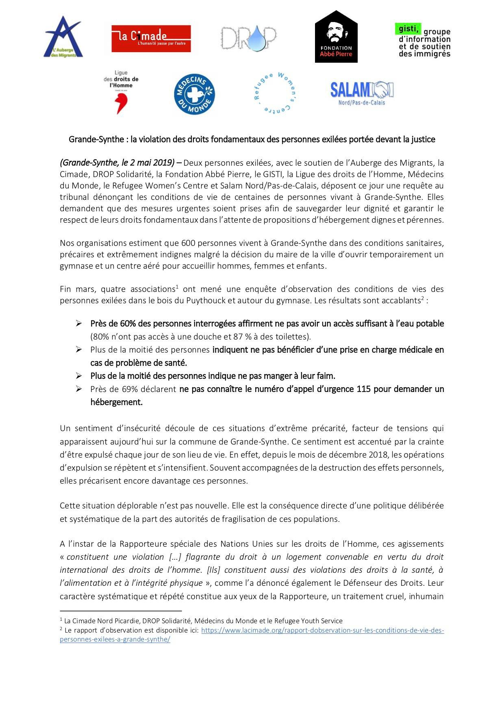
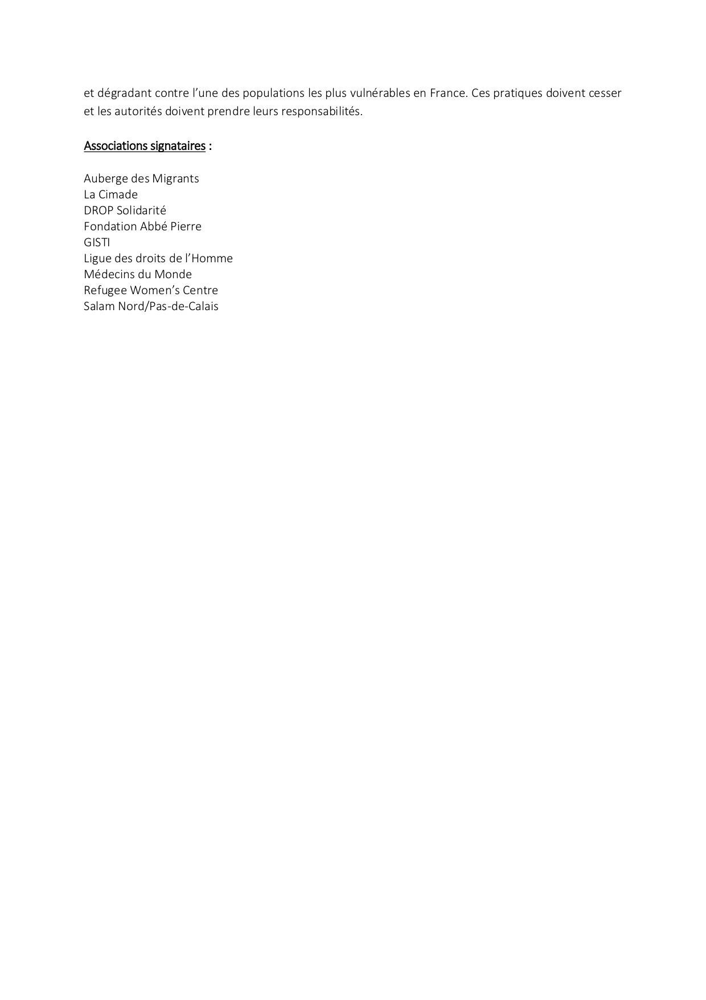

### AYS Daily Digest 7/5/19: EU member states normalizing detention
#### Detention in Greece and Bulgaria / Sea Watch wins in court against the Netherlands / French associations file a lawsuit against the French state / deportations from Sweden

![Sea\-Watch wins in court in DenHaag — The new Dutch regulation, which has kept the Sea\-Watch 3 in port for a month is not to be enforced without a transitional period, the court stated\. The Sea\-Watch 3 will thus be able to resume their activities\.
The organisation claims that one in ten people die trying to flee, crossing the Mediterranean\. 
“The Dutch Government is to blame for this, as it has unlawfully prevented rescue in recent months,” they clearly state\. 
The Sea\-Watch 3 will continue as soon as possible to prevent further deaths\.](assets/68f6138dc599/1*H64Vw-5hVzpDjm07RSd-tw.jpeg)

Sea\-Watch wins in court in DenHaag — The new Dutch regulation, which has kept the Sea\-Watch 3 in port for a month is not to be enforced without a transitional period, the court stated\. The Sea\-Watch 3 will thus be able to resume their activities\.
The organisation claims that one in ten people die trying to flee, crossing the Mediterranean\. 
“The Dutch Government is to blame for this, as it has unlawfully prevented rescue in recent months,” they clearly state\. 
The Sea\-Watch 3 will continue as soon as possible to prevent further deaths\.
#### FEAURED STORIES
### Detention still a common practice in Bulgaria

As months pass, news coming from different places change, but Bulgaria remains one of the countries with least information coming out on the conditions and general situation for refugees, detainees and people on the move in general\. Many of the young people, including unaccompanied minors, who passed through Bulgaria speak of several months of abusive treatment in detention, having understood that as a part of their way, and a common thing in this country\. In fact, Save the Children has confirmed that the largest number of violent pushbacks \(involving children in 2018\) was reported at the borders between Bulgaria and Turkey\.

Bulgarian Helsinki Committee said that in practice unaccompanied children continue to be detained in pre\-removal detention centres\. Unaccompanied children arrested by the Border Police upon entry or, if arrested during their attempt to exit Bulgaria irregularly, are assigned \(“attached”\) to any of the adults present in the group with which the children travelled, which has been a steady practice ongoing for last couple of years\.

Apart from detention, in the asylum system itself there are many obvious and intended discrimination practices, especially towards specific groups:

> Often held in detention for more than three months while their applications are assessed, asylum seekers from countries like Pakistan, Ukraine, Algeria, and Turkey have reportedly had their claims systematically rejected, resulting in a zero percent recognition rate for those nationalities\. 

Some of the representatives of international organisations with whom we have previously spoken about this say that their fear deploying volunteers in Bulgaria as the general attitude seems to be a very agressive negative one\.

Detention remains a key feature in the country’s response to migration flows, despite a 91% drop in irregular arrivals since 2015, and where detention facilities are “prison\-like”, [Global Detention Project](https://www.facebook.com/globaldetentionproject/?__tn__=%2CdkCH-R-R&eid=ARBdjfQfYnrzFyz8DUwvmeheBl10NKcWZXjTO8vaeSw2isfVkzfGIHn32poet1_iMHPRCmvIA44_7Dff&hc_ref=ARQJzvLdmWlB1i0s33_ZImtbimfKv1i6NHNptzTa-kIFB5p3y6APeJIUjmIB_gcqrfY&fref=nf&hc_location=group) [reported](https://www.globaldetentionproject.org/countries/europe/bulgaria) \.

> Bulgaria’s detention centres reportedly lack appropriate health care services, have substandard conditions, and fail to provide adequate access to procedural guarantees, spurring criticism from civil society organisations and international watchdogs\. 

The introduction of short\-term detention \(which was allowed in 2016 after some changes in the national legal system\) legalised the existing practice of detaining third country nationals, even though it contravenes Article 31 of the Convention Relating to the Status of Refugees\. 
Although these detention policies and practices in Bulgaria have received regular and in\-depth scrutiny from regional and international human rights mechanisms and bodies, it seems that these sort of violent measures, criminal acts and detention of Bulgaria \(and other border EU countries\) serves someone’s political purposes which outweigh EU’s commitment to respecting the human rights and rights of the child\.
### Detention in Greece

The Greek Council for Refugees published a report on immigration detention as a systematic practice in Greece, targeting mainly those who tried to apply for asylum and got caught in the difficulties of the system, as well as extremely vulnerable cases\. 
**Access to applications from detention is, of course, difficult and delays in presenting the applications could take up to 4 months\.**

People were detained for various reasons, including being pushed back from the Greek\-Turkish border and violations of geographic restrictions on the Eastern Aegean Islands\.

> Grounds for detention of asylum seekers are widely read and applied without a thorough individualised assessment\. Some groups of asylum seekers are automatically detained either upon arrival on the Eastern Aegean islands under a “pilot project” implemented on Lesvos, Kos and Leros, or following a second\-instance rejection of their asylum applications\. The effectiveness of judicial review of detention through the “objections” procedure remains limited since Administrative Courts do not hold hearings and do not scrutinise detention conditions, while their decisions cannot be appealed to a higher court\. Automatic \( _ex officio_ \) review of detention is also ineffective, with the Administrative Court of Athens ordering release from detention only in 4 out of 1,359 cases examined in 2018\. 

The number of people detained in immigration detention centres reached 31\.126 in 2018\.

> “According to GCR findings, these detention places have no access to a yard, and detainees never have the opportunity of outdoor exercise or access to an outdoor area, third\-country nationals \(administrative\) detainees are detained together with persons facing criminal proceedings, there is lack of sufficient natural light and ventilation, sanitation conditions are poor, the use of mobile phones is not allowed, there is no recreational activity whatsoever, no medical services are provided, and there is no appropriate space for visits or cooperation with a lawyer”\. 

Please, read the full report [**here**](https://www.gcr.gr/media/k2/attachments/GCR_Ekthesi_Dioikitik_Kratisi_2019_en.pdf) \.
#### GREECE
### Open Arms still not allowed to disembark

Open Arms has been awaiting for a permit to dock in Lesvos for 6 days now\. On board the ship there is humanitarian aids for Moria\.

The ship left Barcelona on 23rd April, after more than 100 days administrative block in Spain, and was firstly directed to Samos, where they could not distribute the aids and where told to leave the dock few hours after their arrival\.

Since May 3rd, the boat is outside the port of Mitilini, [reportedly](https://www.pressenza.com/it/2019/05/open-arms-da-5-giorni-fuori-dal-porto-di-mitilini-a-lesbo-senza-poter-attraccare-e-consegnare-gli-aiuti-umanitari-a-bordo/?fbclid=IwAR0YlDb5inNbmHyqBrP6RURWOunpUAp0Z7SLNgxHVKddgwPZlXY0t-tzlKg) awaiting for directions and unable to unload the aid\.
### Athens

#### AUSTRIA

**Deportation planned from Vienna to Lagos \(Nigeria\) on 16th May\!**

#### FRANCE
### Calais

600 people live in Grande\-Synthe in precarious and undignified health conditions despite the decision of the mayor of the city to temporarily open a gymnasium and an aerated centre in order to receive men, women and children, organisations present in the field claim\.

At the end of March, four associations directed an observation of living conditions inquiry for exiled people in the woods of Puythouck and around the gymnasium\. The results are as follows:

> \-Nearly 60% of people interviewed maintained they did not have sufficient access to drinkable water\. \(80% had no access to a shower and 87% to toilets\)
 

> \-More than half of the people indicated that they were not being helped medically in the case of health problems
 

> \- More than half the people indicated they did not eat enough
 

> \-Nearly 69% declared not knowing the emergency number 115 to seek shelter\. 

The [Refugee Women’s Centre](https://www.facebook.com/refugeewomenscentre/?tn-str=k%2AF&hc_location=group_dialog) , along with eight other organisations, have submitted a lawsuit against the state, specifically against the Sous\-Préfecture of Dunkirk, regarding the deplorable living conditions experienced by refugees\. On Monday there was a hearing in Lille, the result of which they should have later this week\.

#### SWEDEN
### Deportation

At least 10 Afghan asylum seekers were [allegedly](https://www.facebook.com/AmasoAfg/posts/2479292802100989) deported back to their country of origin on Tuesday evening\.

“The returnees will also be handed over leaflets with a list of hotels where returnees can go, including the previous accommodation hotel for returnees” which they will have to pay with money they receive from the Swedish authorities\.
#### AYS and the Daily News Digest — how to get involved?

**We strive to echo correct news from the ground through collaboration and fairness\. Every effort has been made to credit organizations and individuals with regard to the supply of information, video, and photo material \(in cases where the source wanted to be accredited\) \. Please notify us regarding corrections\.**

**Apart from daily news in English, we also publish weekly summaries in Arabic and Persian\. Find specials in both languages on our medium site\.**

**If there’s anything you want to share or comment, contact us through Facebook, Twitter or write to: areyousyrious@gmail\.com\.**

**We’re open to expanding our team of volunteer researchers, editors and info gatherers\.**

_Converted [Medium Post](https://medium.com/are-you-syrious/ays-daily-digest-7-5-19-eu-member-states-normalizing-detention-68f6138dc599) by [ZMediumToMarkdown](https://github.com/ZhgChgLi/ZMediumToMarkdown)._
