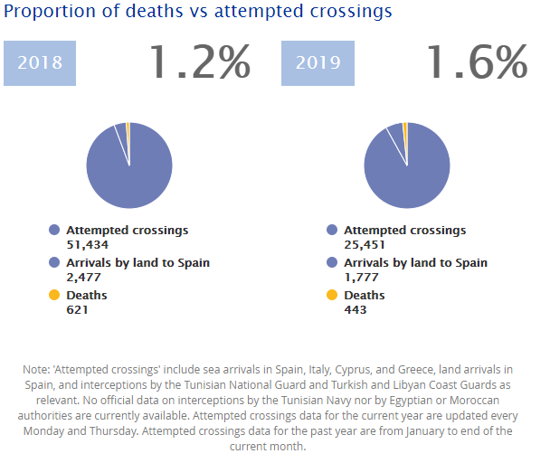

### AYS Daily Digest 10/05/2019: 70 People Died at Sea, 100 Others Sent to Death in Libya\.
#### At least 70 people have died in a shipwreck off the coast of Tunisia// Airstrikes are hitting close to detention centres in Libya// 420 people arrested in Turkey as they attempt to flee to Greece// 70 people rescued at sea disembarked in Italy// Croatian Interior Minister still denying push\-backs// Complicated Swedish laws leave children without food

Source: Samos Volunteers
#### FEATURE

At least 70 people have died in the Mediterranean, off the coast of Tunisia today\. It is the deadliest incident in the Mediterranean since January\. 443 deaths have been recorded in the Mediterranean in 2019, but unfortunately the actual figure is much higher\. It should be noted that the proportion of deaths versus attempted crossings has risen from 1\.2% in 2018 to 1\.6% in 2019, as reported by The Missing Migrants project\.

Alarm Phone reports that the boat most likely departed from Libya and the numbers of deceased are likely to rise\. 16 people were saved by fishermen\.

In another incident that occurred off the coast of Libya, 100 people, including 24 women and 8 children, have been intercepted and returned to Libya by the Libyan Coast Guard\. Their boat was in distress due to engine failure, reports Alarm Phone\.

[_Today a report was released by Channel 4 News \(UK\)_](Revealed: human rights abuses in Libyan migrant camps As many as 70 people have died trying to reach Europe after their boat capsized in the Mediterranean Sea on the way…www.channel4.com) that showed an attack that occurred on a detention center in Libya\. Truly horrific scenes are witnessed as at least two refugees were killed and dozens injured by gunfire in the detention center\.

In this report, Dimitris Avramopolous, the EU Migration Commissioner has admitted to the hypocrisy of EU policy in Libya, but the question remains… What will be done to stop these EU funded and EU orchestrated atrocities? What policies will be changed to stop people being sent back to Libya where they risk death? When will rescue boats be allowed to operate in the Mediterranean to save the lives of people fleeing to Europe via the sea? When will Europe stop funding the Libyan Coast Guard?

UNHCR and IOM are quick to denounce the conditions in Libya and deaths in the Mediterranean, but fail to offer any practical solutions that are of much value to the people affected\. Their outrage on social media platforms is no consolation to the people who die at sea while trying to flee Libya, while rescue boats are criminalized and prevented from saving lives by EU Authorities\. Are these genuine advocacy efforts or well\-developed government approved PR stunts?

#### LIBYA

141 people have been transferred from Zawiya Detention centre yesterday to the UNHCR GDF Centre\. Sally Hayden reports that people described feelings of guilt as they had to leave others behind\.

People stuck in Tajoura detention centre in Tripoli are terrified due to an airstrike that occurred very close to where they are staying\.

■■■■■■■■■■■■■■ 
> **[Sally Hayden](https://twitter.com/sallyhayd) @ Twitter Says:** 

> > Breaking: Another air strike in or very close to Tajoura detention centre. People there are terrified &amp; asking if there's any hope of help for them. 

> **Tweeted at [2019-05-10 16:58:26](https://twitter.com/sallyhayd/status/1126894275625660416).** 

■■■■■■■■■■■■■■ 

■■■■■■■■■■■■■■ 
> **[Sally Hayden](https://twitter.com/sallyhayd) @ Twitter Says:** 

> > Got sent this video showing what detainees could see from Sabaa detention centre, Tripoli, last night. 
"Hits the military camp located few meters from behind our wall" - a refugee there messaged me.
[twitter.com/sallyhayd/stat…](https://twitter.com/sallyhayd/status/1126611425663881216) https://t.co/wIpe0ZM7YJ 

> **Tweeted at [2019-05-10 19:25:09](https://twitter.com/sallyhayd/status/1126931199094611974).** 

■■■■■■■■■■■■■■ 

Meanwhile, the UN Security Council has called for the warring side to commit to a ceasefire in Tripoli\. Furthermore, the ICC prosecutor Fatou Bensouda has issued a warning that her office is prepared to investigate and prosecute anyone responsible for war crimes or crimes against humanity\.
#### MOROCCO

■■■■■■■■■■■■■■ 
> **[Ali Zoubeidi](https://twitter.com/DrAZoubeidi) @ Twitter Says:** 

> > Moroccan authorities had prevented 25,000 illegal crossings  From January 1st  to April 30th 
#migration #morocco #borders #spain #EU 

> **Tweeted at [2019-05-10 20:43:18](https://twitter.com/alzoubeidi/status/1126950863992446976).** 

■■■■■■■■■■■■■■ 

#### TURKEY

#### SEA

Despite Salvini’s closed port policy, around 70 people arrived in Italy after being rescued at sea\. 36 people were rescued by an Italian Navy Ship and a further 31 were rescued by RescueMed’s Search and Rescue Vessel Mare Jonio\. They were allowed to dock and disembark on the ports of Lampedusa and Augusta\. Mare Jonio has since been seized by Italian authorities due to a pending investigation into their involvement of “aiding illegal immigration” — also known as saving lives\.

■■■■■■■■■■■■■■ 
> **[Sea-Watch International](https://twitter.com/seawatch_intl) @ Twitter Says:** 

> > @[ItalianNavy](https://twitter.com/ItalianNavy) @[[RescueMed](https://twitter.com/RescueMed)](https://twitter.com/[RescueMed](https://twitter.com/RescueMed)) Of course state authorities have (once again) found alleged "irregularities" on #MareJonio and therefore (once again) temporarily seized the ship. However, we hope to see @[[RescueMed](https://twitter.com/RescueMed)](https://twitter.com/[RescueMed](https://twitter.com/RescueMed)) out on mission soon enough, for the last days have proven: all #rescue ships are urgently needed! https://t.co/U0bAgn5yug 

> **Tweeted at [2019-05-10 12:22:46](https://twitter.com/seawatch_intl/status/1126824901980164096).** 

■■■■■■■■■■■■■■ 

#### GREECE:

Arrivals:

According to Aegean Boat Report, a boat has arrived on the small island of Nimos, North of Symi\.

Over one hundred refugees, who were arrested after they were attacked by a large group of Fascists in Lesvos in April 2018, have been acquitted by a Greek court\. They were protesting their conditions at the central square of Mytilene in Lesvos\.

[According](http://legalcentrelesvos.org/2019/05/09/trial-of-sapfous-122-today-in-mytilene/) to Legal Centre Lesvos

> While 26 people are now facing criminal charges related to the attack against the migrants, during the night not a single attacker was arrested\. Only the 122 people facing trial today were arrested, after facing a night of racially motivated violence against them, which left many people, including migrants, journalists, and children injured\. 

[For a comprehensive summary of the incident and the repercussions, please read this report\.](https://www.thecanary.co/global/world-analysis/2019/05/10/over-a-hundred-refugees-arrested-after-being-attacked-by-fascists-in-greece-are-finally-acquitted/?fbclid=IwAR3YiVDw8rb2-Z5rcSrYcUaRRxNkTM3JAfEW0Sw7UlbOhEPje1Mpt0WtUo8)

[An interesting episode of Insiders](https://www.euronews.com/2019/05/10/refugees-on-samos-live-in-a-huge-camp-of-lost-souls?fbclid=IwAR3lY6rta1q-MmStWZPJ91g-yDlu05mZN-z8-v6dptLxWf_Fum1fqsqbwO8) focuses on the Greek island of Samos\. An inspiring story attempts to bridge the divide between islander locals and asylum seekers\.

> For the past few years Manolis Mantas and his wife Vasilika, a retired Greek couple, have lived on the frontline of Europe’s refugee crisis\. Their summer house, which they built on the beautiful Greek island of Samos a few years ago, now backs onto a miserable collection of tents amongst a maze of paths strewn with rubbish\. There, asylum seekers and other migrants eke out an existence whilst they wait for their papers to be processed\. 

> When we meet Manolis is keen to show us his “many friends\.” We walk to the fence at the bottom of his garden where he and his wife hand out cakes to two of the children waiting patiently on the other side of the divide\. 

#### SERBIA

Info Park Belgrade reports that Hungarian authorities pushed 37 people back to Serbia, after they had attempted to enter Hungary\.

Furthermore, they report:

> Outreach social workers of Belgrade Center for Social Welfare accompanied 12 boys recognized as UASC to an asylum center \(AC\) in Belgrade area\.
 

> Info Park is a part of a growing debate that points to the need to enhance and support refugees’ resilience and self\-support through financial access\. However, current set\-up ensures that refugees and other migrants can only become autonomous by accepting the restrictions imposed on them\. This analysis published on The Conversation by Martina Tazzioli reports on how cashless programes to support refugees’ independence can restrict their freedoms\. 

#### BOSNIA

[Bosnia’s Ministry of Security](https://news.cgtn.com/news/3d3d774e7955544e34457a6333566d54/index.html?fbclid=IwAR3BLvmsQQv8x7W6WpEO7-FJlxvooGZEWLUvb80rfKneQ9Q-_kfdXeve2S0) has stated that approximately 30,000 people arrived in Bosnia between the periods of January 2018 and April 2019\. This is a huge increase compared with 755 arrivals in the same period in 2017–2018\.
#### CROATIA

Speaking at the [press conference](https://www.youtube.com/watch?feature=share&v=5lg3Q6yd0XE&fbclid=IwAR03GlJO_K977uQHw--tqihSJbjwuJGBg7J8RoYqzDJOnMNinn46v1T0kYs&app=desktop) during a meeting with his Bavarian counterpart, the Croatian Minister of the interior said that the people crossing into Croatia should do so in a legal and legitimate way\. He said that they should ask for international protection, while also saying \(and repeating\) that it seems he is oblivious to the fact that the people SHOULD have the right to ask for asylum\. However, this right is not respected, and in practice people are still being taken to Bosnia and Herzegovina, even from police stations within the country\. The minister also claims that there is no proof of any of the accusations regarding police violence and ill\-treatment\. However, these are not merely accusations: there are already large stores of statistics outlining different periods of beatings, robberies, and torture, inflicted on migrants by Croatian police\.

These accounts are also in line with Slovenian police practice, for which expulsion is one of the steps in the obviously arranged MO based on the policies of securitisation\. Here is a report on push backs from Slovenia:

#### GERMANY

[A new resettlement program titled NesT](https://www.euronews.com/2019/05/10/refugees-on-samos-live-in-a-huge-camp-of-lost-souls?fbclid=IwAR3lY6rta1q-MmStWZPJ91g-yDlu05mZN-z8-v6dptLxWf_Fum1fqsqbwO8) will provide housing for initally 500 refugees who are in classified as particularly vulnerable\. In the beginning, it is anticipated that locals will act as sponsors or mentors for the refugees, in order to help them settle into their new homes\.

> At a launch event in Berlin on Monday, different stakeholders presented the program\. The way it stands out — at least in Germany — is that the government and civil society will work hand in hand from the get\-go: Groups of at least five mentors are supposed to help one individual or one family with their arrival and support them financially and offer advice to help navigate their new situation\. 

#### SWEDEN

[Thousands of unaccompanied minors will be left without food for the second summer in a row, according to activists\.](https://www.thecanary.co/global/world-analysis/2019/05/10/over-a-hundred-refugees-arrested-after-being-attacked-by-fascists-in-greece-are-finally-acquitted/?fbclid=IwAR3YiVDw8rb2-Z5rcSrYcUaRRxNkTM3JAfEW0Sw7UlbOhEPje1Mpt0WtUo8) At the same time, the question about amnesty, which several politicians were very vocal about before, has cooled down\.

Last year in June it became clear that young, unaccompanied minors who had applied for asylum again in Sweden, wouldn’t get any financial contribution during the time the waited for the new answer\. This is according to the new asylum law\. This summer the situation will once again be the same\. With a few exceptions, mainly Afghans will be affected\. The laws have received severe criticism for being poorly thought out, and much too exclusive\. Far from everyone is eligible to apply, as the application conditions are very strict\.

It is important to note that there is one old and one new high school law\. The first law was implemented during the summer of 2017, and the second one, a year later\. The old high school law, which is still valid and in use, states that someone who has a time limited residence permit can prolong it due to high\-school studies\. The person must have a residence permit in order to apply for prolonged residency in the way the old high school law allows\. It is prolonged by 13 months at the time\. The new asylum law is an addition to the old one, with very strict limitations: in order to be eligible to claim asylum again according to this law the person must have arrived in Sweden and been registered as an asylum seeker no later than November 24th 2015\. The person must have been a minor at the time, turned 18, been rejected AFTER he turned 18 and waited for the decision for 15 months \(not 14 months and 28 days, not applied for asylum on the 25th of November 2015 and not have turned 18 two days after the first rejection — it is VERY limited who can apply\. \)

6500 people have now gotten residence permits according to the new high school law, not 9000 as the Migration Agency and the government claimed\. In addition to this, 9000 people who arrived at the same time \(2014–2015\) are not eligible to apply for residency in accordance to the new high school law — based on the very limited criteria\. Also, in 2015, 35,000 unaccompanied minors arrived in Sweden\. Of those, 23,000 were from Afghanistan\. Some got rescidence permits\. But 18,000 people are in the group that could be helped by the new asylum law — this means, that even if 9000 people would have been granted protection based on this law — 9000 people would still be left outside\. Now, these minors are either waiting for deportation or have gone into hiding\. Those, and people waiting for answers are the ones without food this upcoming summer\. The network Stöttepelaren have collected 1 million SEK \(100 000 euro\) to provide support over the past year, but that is not nearly enough, they say\.

The new high school law was agreed on after very loud protests and debates about amnesty for unaccompanied minors, which has now cooled off completely, even though the issue remains\. At a vote earlier this spring only the left wing party voted in favour of amnesty, whereas the green party, who used to be very vocal about this, voted against\.

Both of these laws are very complicated, and for a while last summer, courts refused to use the new asylum law as it was too hard to interpret\. Anyhow, activists encourage the civil society to step up: when summer approached young people won’t have access to lunch in school, and some will be paperless, and so on… More and more people also chose to go underground, as they don’t want to get deported back to Afghanistan\.
#### EU GENERAL

### European Ombudsman: EASO Role in EU Hotspots not found to be unlawful or unfair

The European Ombudsman has issued her final reply to a [complaint](https://www.ecchr.eu/nc/en/press-release/european-ombudsperson-refuses-to-hold-easo-to-account/) submitted by the European Centre for Constitutional and Human Rights \(ECCHR\) in April 2017\. The complaint regards the involvement of the European Asylum Support Office \(EASO\) in admissibility interviews in the EU Hotspots in Greece\. The [response of the Ombudsman](https://www.ombudsman.europa.eu/en/decision/en/98711) was first released on 5 July 2018, and following a request for review from the ECCHR, the Ombudsman has released her final response and re\-affirmed her statement from 2018\.

The submission concerned the scope of EASO’s mandate in the EU Hotspots following the implementation of the EU\-Turkey Statement\. First, the ECCHR complained that EASO was involved in making decisions on the admissibility of applications for international protection by conducting the admissibility interviews, going beyond the scope of legal powers granted to the agency\. Second, the ECCHR complained that EASO failed to comply with both its own guidelines and Article 41 of the Charter of Fundamental Rights on the right to be heard by not conducting fair and proper individual hearings\.

The Ombudsman recognized the concerns raised in the complaints, however, she found that the ultimate decision\-making responsibility fell upon the Greek Asylum Service\. The Ombudsman acknowledged that EASO’s regulations were soon to be amended to clarify the activity in which EASO is engaged\. She also acknowledged that EASO is making considerable efforts to improve its practice in the conduct of interviews\. Moreover, the Ombudsman affirmed that the Greek authorities can make decisions in examining the quality and conduct of each admissibility interview conducted by EASO and can ask for the interview to be conducted anew\.

In her reply to the request for a review, the Ombudsman reiterated her recognition of the concerns raised by ECCHR, but also recognized the continued efforts by EASO to improve\.
#### AYS and the Daily News Digest — how to get involved?

**We strive to echo correct news from the ground through collaboration and fairness\. Every effort has been made to credit organizations and individuals with regard to the supply of information, video, and photo material \(in cases where the source wanted to be accredited\) \. Please notify us regarding corrections\.**

**Apart from daily news in English, we also publish weekly summaries in Arabic and Persian\. Find specials in both languages on our medium site\.**

**If there’s anything you want to share or comment, contact us through Facebook, Twitter or write to: areyousyrious@gmail\.com\.**

**We’re open to expanding our team of volunteer researchers, editors, and info gatherers\.**

_Converted [Medium Post](https://medium.com/are-you-syrious/ays-daily-digest-10-05-2019-70-people-died-at-sea-100-others-sent-to-death-in-libya-16095f4e81a1) by [ZMediumToMarkdown](https://github.com/ZhgChgLi/ZMediumToMarkdown)._
