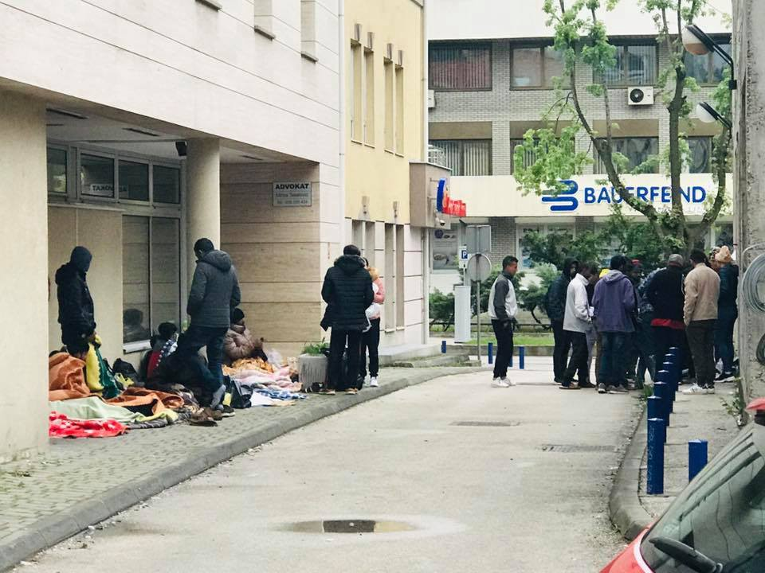

### خبرهای به روز هفتگی
#### AYS Weekly News Summary in Persian, April 29–May 5

 \) یکی دیگر از تخلیه در سنت دنیس، پاریس، بدون هشدار دادن به مردم در حال حرکت بود](assets/aa1ff2314966/1*E3Z5GhKJMEkklYqAKsNKWQ.jpeg)

\( [Solidarité migrants Wilson](https://www.facebook.com/Solidarit%C3%A9-migrants-Wilson-598228360377940/?__tn__=%2CdkCH-R-R&eid=ARD0jtiUPhxFLVkOnJJiC506s4XksCMPwSYKznvcNgdN-jlIFd6lKZ8fpbL9OPY_bOuSRdf_C5f9RGHB&hc_ref=ARSPUqvrSVareKqujU5Z9GNXZ2GIa8uXDN620TdPX-O16awckWc9e9URAoqsbfNzbnI&hc_location=group) \) یکی دیگر از تخلیه در سنت دنیس، پاریس، بدون هشدار دادن به مردم در حال حرکت بود
### **لیبی**

براساس گزارش آخرین گزارش سالی هایدن از مرکز بازداشت،گزارش رسیده از ابوسلیم که بیش از ۴۰۰ نفر \( از جمله ۳۰ کودک \) در آن زندان زندگی می‌کنند ، نه تنها مردم را به زور به کشورهای مبدا باز می‌گردند، بلکه از گرسنگی می‌میرند \.

### **یونان**
#### اهمیت داده‌های شخصی صحیح از ابتدا

تیم اطلاعاتی، برای پناهندگان در یونان گزارش داد که آن‌ها اغلب درخواست‌هایی از سوی افرادی دریافت می‌کنند که خواستار کمک به تغییر جزییات کارت‌های سفید خود هستند چون نام یا تاریخ تولد اشتباه است \. به طور کلی ، تغییر اطلاعات نادرست در کارت سفید شما، به آسانی نیست \.

برای کمک به تغییر دادن داده‌های خود لطفا ً با وکیل یا مددکار اجتماعی تماس بگیرید و یا پیغامی به تیم اطلاعاتی برای پناهندگان در تیم یونان ارسال کنید \.

**اطلاعات حقوقی**

یک جزوه اطلاعات قانونی در ده زبان مختلف موجود است : یونانی ، انگلیسی ، فارسی ، عربی ، سومالی ، فرانسوی ، اردو ، سورانی و امهاریک \.

هدف از آن بهبود دسترسی به اطلاعات در مورد فرآیند پناهندگی و مشاوران حقوقی موجود برای متقاضیان پناهندگی در لیسووس ، و همچنین حمایت از سایر فعالان برای درک بهتر است \.

### **بوسنی و هرزگووین**
#### توزلا

مردم محلی در توزلا افرادی هستند که در حال عبور از شهر خود به سمت غرب \( مرز \) بوسنی و هرزگوین به مردم کمک می‌کنند \. مدت زیادی است که داوطلبان ۲۴ ساعته خدمات برای امور خارجی‌ها را پیشنهاد داده‌اند ، بنابراین مردم مجبور نیستند سخت بخوابند و تعداد افراد افزایش نیابد \. با این حال ، وضعیت فعلی این است که اگر شما در طول شب ، آخر هفته یا تعطیلات به شهر بیایید ، مجبور به خوابیدن در بیرون و انتظار برای باز شدن دفتر خواهید بود \. در هر روز کاری از ۹ تا ۱۷ ساعت کار می‌کند \.

اطلاعات حقوقی از طریق Vasa prava ، خدمات حقوقی آزاد در کنار کمیساریای عالی پناهندگان سازمان ملل در بوسنی و هرزگوین ، در دفاتر اصلی در شهرهای مختلف در دسترس است \.
### **کرواسی**

کمک‌های قانونی رایگان از طریق مرکز حقوق کرواسی، شورای عالی صلح یا ها\.پ\.س، به پناهجویان و افرادی که در مراکز پذیرش در زاگرب، پورین و کوتینا ، مرکز پذیرش خارجی‌ها و کودکان که در انواع مختلفی از مراکز مراقبت‌های اجتماعی ، خانه اتحاد صلیب‌سرخ و در دفتر مرکز قانون کرواسی بسر می‌برند ، در دسترس است \.

در اینجا اطلاعات بیشتری در مورد کمک‌های حقوقی رایگان وجود دارد ، به طور واضح نوشته شده‌است ، پس اگر مترجم آنلاین استفاده کنید ، قادر خواهید بود همه چیز را خوب درک کنید \. مهم است که از حق خود برای آزاد کردن کمک‌های حقوقی ، حقوقتان ، و همچنین مراقبت بهداشتی و آموزش برای کودکان خود آگاه باشید ، اگر تحت حفاظت فرعی یا با پناهندگی در کرواسی باشید

طی هفته آینده در مرکز پذیرش پورین هیچ فعالیتی توسط داوطلبان آر\.یو\.س یا حضور تیم ما در پورین برگزار نخواهد شد \. تا کنون این تنها اطلاعاتی است که می‌توانیم به اشتراک بگذاریم، اما ما هر کسی را که بعد از آن هفته بر روی کار ما تاثیر می‌گذارد، به روز نگه می‌داریم \. فعلا ً ما نسبت به همه در مغازه رایگان و از طریق تماس مستقیم با هم در ارتباط هستیم \.

در ویدیویی که در طول پرواز وی گرفته شد و در صفحه فیسبوک منتشر شد ، salvini ، وزیر بدنام ایتالیا ، گفت که حصار \( بین صربستان و مجارستان \) برای جلوگیری از مهاجرت غیرقانونی ساخته شده‌است و ورود به اروپا تنها با مجوز ممکن است \.

یک ویدیو دیگر salvini و Orban را نشان داد که در امتداد نرده‌ها به دور حصار کشیده شده‌بودند \.

### **ایتالیا**
#### ونتیمیگیلا

ساعات کاری کلینیک کاریتاس در ماه می

### **شمال**

این اداره به اخراج خانواده , کودکان و افراد آسیب‌پذیر به سربازخانه‌ها دستور داد که در ماه آوریل با وجود یک ظرفیت نامشخص , به cas \( مرکز پذیرش فوق‌العاده عادی \) تبدیل شدند \. در طی چند ماه گذشته , افراد زیادی در این زمینه اسکان داده شده‌اند , اما این امر به اوج رسیده‌است \.

> با تعداد زیاد آن‌ها , تعجب‌آور نیست که شرایط زندگی به طرز شگفت انگیزی خشن است و احترام به حریم خصوصی و مراقبت‌های کافی برای موارد بسیار آسیب‌پذیر به حداقل در نظر گرفته نمی‌شوند \. 

بنابراین , شنیدن این مطلب تکان‌دهنده است که دانش‌آموز ارشد فرمان به حرکت 70 مردم , مردم نیازمند درمان روانی — برخی از آن‌ها خودکشی می‌کنند — برخی از آن‌ها خودکشی می‌کنند , زنان باردار و خانواده‌هایی با کودکان در سن مدرسه — به ساختار با توجه کمی به یک ماه \.
#### **رم**

اداره مهاجرت در رم , مجوزهای اقامت را به دارندگان حمایت بین‌المللی که یک گواهی اقامت را با نشانی “ مرسوم “ ارائه می‌دهند , تمدید نکرده است , به این معنی که همه آن‌هایی که یک روزنامه حمایت بین‌المللی دارند , اما بی‌خانمان هستند یا قرارداد اجاره ندارند , از تمدید مجوز حذف شده‌اند \. این تصمیم ظاهرا ً به دلیل اقدامات امنیتی عمومی اتخاذ شده بود که بدون یک نشانی “ معمولی “ تقریبا ً غیرقابل ردگیری بودند\.

سازمان‌ها و سازمان‌های بین‌المللی برای پناهندگان سازمان ملل متحد برای پناهندگان , در حال حاضر درخواست‌های قانونی علیه این تصمیم توسط اداره مهاجرت ارائه کرده‌اند و در یکی از موارد اضطراری , دادگاه دستور آزادی فوری مجوز جدید را صادر کرد \.

منبع اصلی اینجا را ببینید
### **فرانسه**

یک تخلیه دیگر در سنت دنیس در پاریس بدون توجه به افراد در حال حرکت و انجمن‌های کاری در منطقه رخ داد \. مقامات توضیح نداده اند که مردم کجا خواهند رفت و چه اتفاقی برای آن‌ها می‌افتد , اما همه وسایل شخصی آن‌هایی که نمی‌خواهند سوار اتوبوس شوند را نابود کرد \.

با وجود اینکه مقامات نمی‌دانند که پناهجویان در ،سنت دنی کجا زندگی می‌کنند , مردم هنوز شناسایی شده‌اند و احتمالا ً به مراکز پذیرش در منطقه منتقل شده‌اند , اما روش‌ها هنوز نامشخص باقی مانده‌اند

### **اسپانیا**

31 فردی که از تعقیب سیاسی در مراکش فرار کرده‌اند در یک مرکز پیش از تبعید در والنسیا به مدت 10 روز بازداشت شده‌اند \.

اطلاعات بیشتری در اینجا یافت می‌شود

**اخبار بیشتری به انگلیسی در صفحه رسانه ما در دسترس است \. در مواردی که شما سوالاتی دارید و یا مایلید برخی اطلاعات مربوط به روند پناهندگی شما یا کشور مورد نظر را منتشر کنید , لطفا ً برای نوشتن پیغام روی فیس بوک یا نوشتن یک ایمیل به آر\.یو\.س تردید نکنید**

[**areyousyrious@gmail\.com**](mailto:areyousyrious@gmail.com)

_Converted [Medium Post](https://medium.com/are-you-syrious/%D8%AE%D8%A8%D8%B1%D9%87%D8%A7%DB%8C-%D8%A8%D9%87-%D8%B1%D9%88%D8%B2-%D9%87%D9%81%D8%AA%DA%AF%DB%8C-aa1ff2314966) by [ZMediumToMarkdown](https://github.com/ZhgChgLi/ZMediumToMarkdown)._
