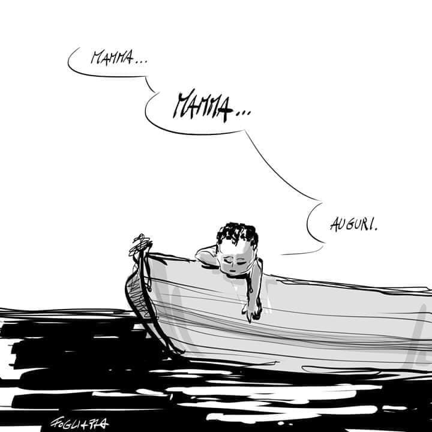
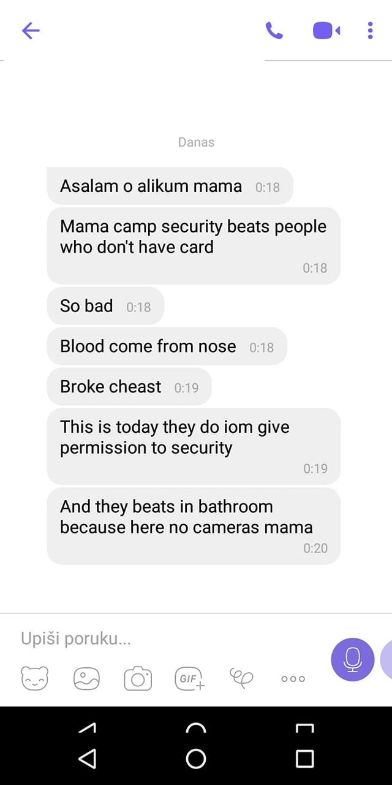
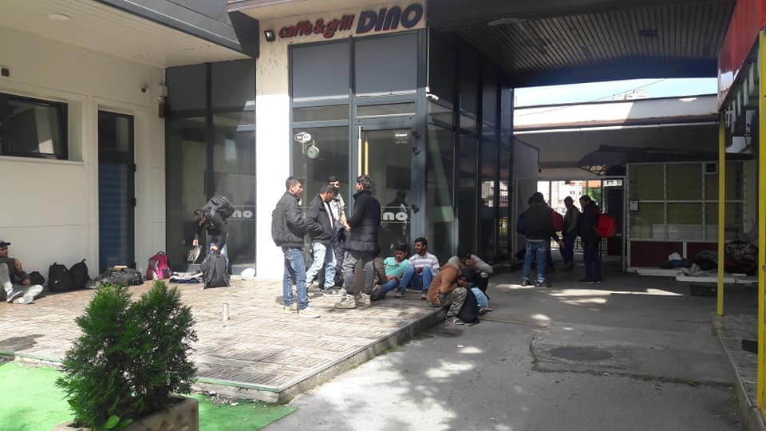
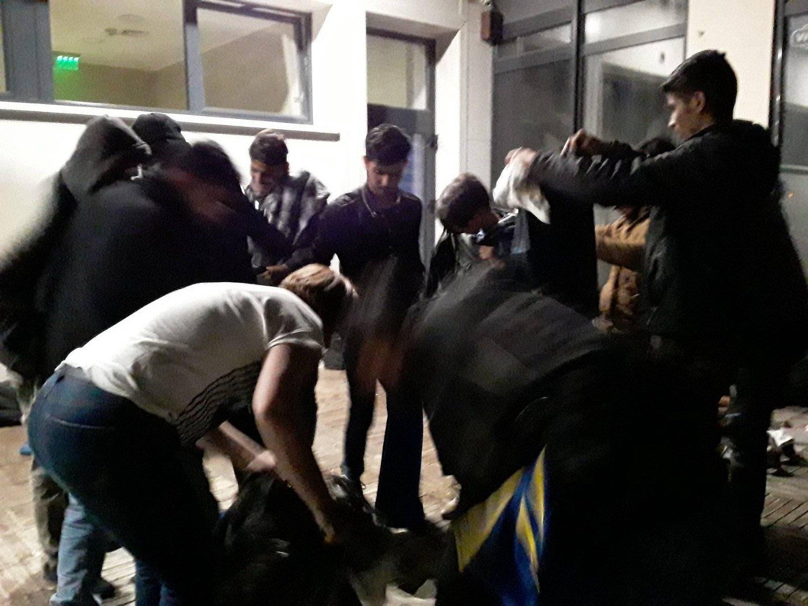
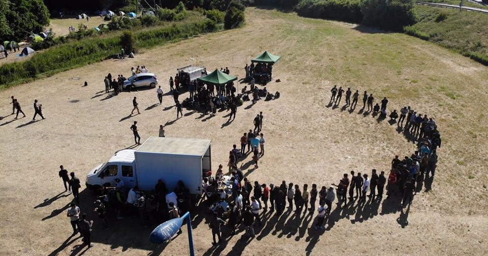

### AYS WEEKEND DIGEST 11–12/2019: Price per head, Salvini proposes 5,500 euro fine per person saved\.

Repressive proposed law in order to quash dissent // SAR vessel launches again\!// 600 people have tried to leave Libya in four days // Turkish Coast Guard Updates on those intercepted // Death in Bosnia and Security Contractors’ Brutality against Refugees in Camps// Needs in France

Photo Credit: Sea Eye
### FEATURE: Proposed Law Tightens the Noose around Resistance and Solidarity

How much is a human life worth? It’s impossible to put a number on it, but it appears that Minister of the Interior Matteo Salvini has perhaps picked up a tip or two from chum Viktor Orban in new barriers to humanitarian aid — through fines\. In recent years, Human Rights organizations saw an unprecedented crackdown on their activities in Hungary, with solidarity becoming criminalized to an extreme extent\. Organizations involved in work with refugees, stateless persons, and other vulnerable people on the move saw a tax imposed on all “foreign funding\.”

In a newly proposed law, Matteo Salvini, emboldened by his recent visit to Orban’s very big wall, is presenting draconian measures directly targeting search and rescue operations as well as new ways to crack down on protestors\.

A Google translation of an analysis of the proposed law provided by Alterego:

_“\-Sanctions of up to 5,500 euros for each migrant transported on an NGO that has carried out a sea rescue, with an ad hoc norm for Mediterranea \(adding that if the ship flies the Italian flag, then the license is revoked up to 12 months\);_

_\-Changes to the navigation code with limitations of the competences of the Ministry of Infrastructure \(greetings to Toninelli\) and attribution to the Ministry of the Interior of the competence to limit and prohibit the transit and stop in the territorial sea when \(guess what\) there are safety reasons ;_

_\-Use of wiretapping and undercover police \(with a funding of 3 million for the next 3 years\) to flush out those who are facilitating illegal immigration;_

_\- Amendments to the consolidated text of the laws on public security, to give an example: in the case of meetings not forewarned OR the penalty for offenders is imprisonment up to one year \(amendment to Article 24\);_
- _Changes to the law n\.152 / 75 provisions for the protection of public order: the use of protective helmets during demonstrations is punished with imprisonment up to two years \(amendment to paragraph 5\); addition of a fantastic paragraph 5 bis in which it is stated that anyone, during demonstrations, to oppose a public official using shields or OTHER PASSIVE PROTECTION OBJECTS or DAMAGING MATERIALS IS PUNISHED WITH RECLUSION UP TO 3 YEARS while those who allow themselves to launch any type of thing \(with a list that goes from a generic “blunt objects” up to “rockets”\) it gets up to 4 years\.”_

It is crucial to recognize the continued insistence upon grouping together people who are providing humanitarian aid with “those facilitating illegal migration\.” This is a consistent tactic that is used to legitimize attacks against solidarity activity under the guise of public security\. It is parallel to governments using the argument of “human shields” to ignore conventions of war in attacking civilian targets or medical targets\.

Additionally, the extent to which ‘public safety’ is a major concern for Salvini seems laughable considering this video, which has recently surfaced, of the horrific police brutality that was used against a refugee in Italy\. Everywhere, those who are deemed to be second class citizens or who are without the protection of a state entity, see the most brutal end of police violence\.

Monitoring the passage or hopefully blocking this proposed law is crucial as if it goes forward, and it could set the precedent elsewhere\. Read more, and the original text of the proposed law in Italian, [here](https://www.facebook.com/fabbricadeidiritti/posts/1630546527089924?hc_location=ufi) \.

Already a ship with 80 people in distress was being ignored by merchant ships in the Mediterranean\. Clearly, these intimidation tactics work to drive a wedge of fear between ordinary citizens who would otherwise be eager to help, but who now face additional punishment\. They were later “rescued” by the Libyan Coast Guard to a fate that few wish to think about\. However although some people will be intimidated by these rules, others will continue to stand up to them, understanding the terrible situation that people are fleeing\.

■■■■■■■■■■■■■■ 
> **[MSF Sea](https://twitter.com/MSF_Sea) @ Twitter Says:** 

> > In the last 4 days, over 600 #refugees &amp; #migrants have attempted to flee #Libya.

The majority were forcibly returned &amp; placed in detention centres - including in #Tripoli where there is active conflict.

#Libya is not safe to bring people back to!

[thenewhumanitarian.org/photo-feature/…](https://www.thenewhumanitarian.org/photo-feature/2019/05/09/Libya-war-refugees-seek-safety-tripoli-school) 

> **Tweeted at [2019-05-12 08:00:00](https://twitter.com/msf_sea/status/1127483551035940865).** 

■■■■■■■■■■■■■■ 

Salvini smugly tweeted after the temporary seizure of the Mare Jonio, “BYE BYE”, but those in favour of solidarity in the Mediterranean remain strong\. The Crew of the [Mare Jonio are quick to point out that this seizure is standard](http://sheikyermami.com/2019/05/salvini-last-voyage-for-mare-jonio-blocked-seized-bye-bye/) practice and nothing new\.

And again, other crews remain unfazed: Sea Watch has started again in the Mediterranean as of this weekend\! On May 11th, Sea Watch left the port in Marseille after a long blockade\. Additionally, Moonbird, the glider sent to monitor the situation in the Med, posted a harrowing video of a man fleeing the Libyan Coast Guard in favor of a different vessel\.

■■■■■■■■■■■■■■ 
> **[Sea-Watch International](https://twitter.com/seawatch_intl) @ Twitter Says:** 

> > 🔴 On the busiest weekend in the #Mediterranean 2019 our #Moonbird aircrew witnessed this desperate attempt of people trying to escape the so-called #Libya|n Coast Guard swimming:

[youtu.be/x0Ms4YspebQ](https://youtu.be/x0Ms4YspebQ) 

#VosTriton #DefendSolidarity 

> **Tweeted at [2019-05-12 17:46:51](https://twitter.com/seawatch_intl/status/1127631234346233857).** 

■■■■■■■■■■■■■■ 

### GREECE

There is an extreme weather warning through Tuesday\! [Strong storms across islands in Greece\!](https://www.keeptalkinggreece.com/2019/05/11/weather-greece-forecast-may-12-16/)

In spite of this, Aegean Boat Report notes that around 117 people have landed on the Greek islands over the weekend\. Additionally, even more have been stopped and arrested by the Turkish Coast Guard\.

■■■■■■■■■■■■■■ 
> **[Aegean Boat Report](https://twitter.com/ABoatReport) @ Twitter Says:** 

> > Since yesterday, at least 5 boats have been stopped by Turkish Coastguard, while trying to cross to the Greek Aegean Islands. 185 people, 56 children, 50 women and 89 men have been arrested.. 

> **Tweeted at [2019-05-12 21:33:05](https://twitter.com/boataegean/status/1127688169745416200).** 

■■■■■■■■■■■■■■ 

In a report from a Turkish News Outlet, the Turkish Coast Guard released a report on its to date figures\.

_“ 7378 refugees were arrested by the Turkish coast guard so far in the 2019 calendar year\. 15 refugees lost their lives in the Aegean in 2019\._ 
_The Turkish coast guard was involved in some capacity in 211 attempted boat crossings in 2019\. 15 people were arrested on smuggling charges\._ 
_In the month of May so far 297 refugees were arrested while attempting to cross, and 9 lost their lives”_

[See here for the source\.](https://www.haberturk.com/balikesir-haberleri/69003058-ozel-egede-duzensiz-gocmen-akini-suruyor2019da-7-bin-378-duzensiz-gocmen-egede-yakalandi)

Khora, in Athens, is in need of donations for summer\! Clothing donations welcome\. See the original post [here](https://www.facebook.com/KhoraAthens/posts/1145021905670416?hc_location=ufi) \.
### BOSNIA

Three men died in Bihac from carbon monoxide poisoning resulting from a fire in the makeshift shelter in which they were staying\. Tragically, much initial media coverage afforded the dead no dignity in death and referred to these souls in rather callous terms\. For more updates on the situation, in Bosnian, go [here](https://www.facebook.com/izbjeglickeprice/posts/822840034762760?hc_location=ufi) \.

Many people question why, when there are camps available in Bihac, people would stay in makeshift shelters with unsafe conditions\. However, the conditions in nearby Bira camp are truly intolerable\. Not only are they overcrowded, there are repeated reports of security guards \(those on contract with IOM\) beating residents \(or shall we say “inmates”\) \.

Recently, Udruzenje Solidarnost Bosnia posted a screenshot from someone in Bihac camp\.

This is not the first time that security guards in official camps in Bosnia have been reported for violence against residents\. Although IOM has allegedly fired the security officers who were reported for violence, and they claim that this activity is not widespread in Bira, there are many other accounts of this happening\. We have statements from several different people who have witnessed security employees being aggressive with residents in the camp, and those trying to get in the camp, but especially at the parking lot and in front of the camp\. The reoccurring testimonies keep appearing: claims such as this should make everyone wonder, worry and demand answers, which is something we hope fellow journalists, if not the citizens whose taxes pay for this, and the police, will do\.

On the flipside, many people are persecuted for NOT residing in camps, and yet if they attempt to comply with the law and enter a camp, they are often turned away\. A volunteer from Tuzla reported that a young man who went from Tuzla to Bihac to go to camp Bira was turned away and is now sleeping outside in the cold and rain\.

Just like this man, many people are having to endure the terrible weather, which is only getting worse\. Rain is expected all throughout the week, and volunteers fear for those arriving, since they already have people who have become seriously ill on their journeys\. Although the local hospital has been opened to care for a woman who is really sick, she may have to leave sooner than she should\. She is with her children, and the deadline to reach the camp in Bihać, according to the migrations officers’ plan, is getting near, so instead of a recommended week long stay at the hospital, she will continue\.

Photo: Nedžla Masri

The news is that the office now works during the weekends, from 8 to 16h\.
Photo: Just as the office closed, a group of about 20 people arrived to spend the night sleeping outside, waiting for the next working day of the office\.

Credit: Lejla Dervisevic\.

People in Tuzla remain the sole support of those on the move\. On each of the points where they welcome people, they have now organised a provisional ‘walking boutique’ — people can take what they need and others can give what they don’t need\. Backpacks, blankets, socks and other necessities are exchanged\.

No Name Kitchen team is looking for volunteers for May and June in Velika Kladuša \(BiH\), Šid \(Serbia\) and Patras \(Greece\) \.
Also, the team is active in providing information, food, basic amenities, running a free shop, and supporting people on the move in different ways\. Donations are very much welcome, and we invite you to support their efforts in different places and in that way, to support the least protected people who are on their own\. Please go to their Facebook page for more information\.
### FRANCE

Refugee Community Kitchen has announced that in spite of other organisations possibly debating whether to continue work, that they will continue to provide hot meals throughout the winter in Calais, Dunkirk, and Brussels\. They will need your help to continue their work, however\. To find out how to volunteer or donate, go [here](https://mailchi.mp/b630b6ad623c/rck-future-in-calais-and-northern-france) \.

Other teams that need help are FAST \(First Aid Support Team\) which you can learn more about donating to [here](https://www.facebook.com/FASTFirstAidSupportTeam/photos/a.646833725751987/678649282570431/?type=3&__xts__[0]=68.ARBhnnnbjGYdlUlohrqgUIz-LYtKSH6HMz0tvf8AAOmiPLXUjlSu44umg5mJGZGF9ks273M7oPGCeZwj-2S02f9AYqUdaE488rLUu9P0grv0AcGQLyJb2qBadT234Vc4WG6lWcg2hpGDNHk0Zpg0YyeYeWlmZeb5eNw24PAHDCCuCMZEmWmDo2Gl46mxDlJSwz3DY4AKR73owy2AzPHrEP0Ew8ycktbx8rqeW0u52CZ6DOppWKW06K81IJbzVz-uLbXOxu5kQQIDSqgogcHLPCJ0bLKXc6unv9Xal7tX28j6AA-8EbjCvn7dEltNT-_Cr84fI0zl6jb8xbL_RtLjH-U&__tn__=-R&hc_location=ufi) and volunteering with [them here](https://www.facebook.com/FASTFirstAidSupportTeam/posts/678648379237188?hc_location=ufi) \.

**Apart from daily news in English, we also publish weekly summaries in [Arabic](%D8%A7%D9%84%D8%AA%D8%BA%D9%8A%D9%8A%D8%B1%D8%A7%D8%AA-%D9%81%D9%8A-%D9%82%D8%A7%D9%86%D9%88%D9%86-%D8%A7%D9%84%D9%84%D8%AC%D9%88%D8%A1-%D9%81%D9%8A-%D8%A7%D9%84%D8%AF%D9%86%D9%85%D8%A7%D8%B1%D9%83-b99e429d54ad) and [Persian](%D8%B9%D9%88%D8%B6-%D8%B4%D8%AF%D9%86-%D9%82%D9%88%D8%A7%D9%86%DB%8C%D9%86-%D9%BE%D9%86%D8%A7%D9%87%D9%86%D8%AF%DA%AF%DB%8C-%D8%AF%D8%B1-%D8%AF%D8%A7%D9%86%D9%85%D8%A7%D8%B1%DA%A9-7b984cac7a86) \. Follow the links to read and share the ones from the week of May 6th to 12th\.**

**We strive to echo correct news from the ground through collaboration and fairness\. Every effort has been made to credit organizations and individuals with regard to the supply of information, video, and photo material \(in cases where the source wanted to be accredited\) \. Please notify us regarding corrections\.**

**If there’s anything you want to share or comment, contact us through Facebook or write to: areyousyrious@gmail\.com**

_Converted [Medium Post](https://medium.com/are-you-syrious/ays-weekend-digest-11-12-2019-price-per-head-salvini-proposes-5-500-euro-fine-per-person-saved-6824c5e82443) by [ZMediumToMarkdown](https://github.com/ZhgChgLi/ZMediumToMarkdown)._
