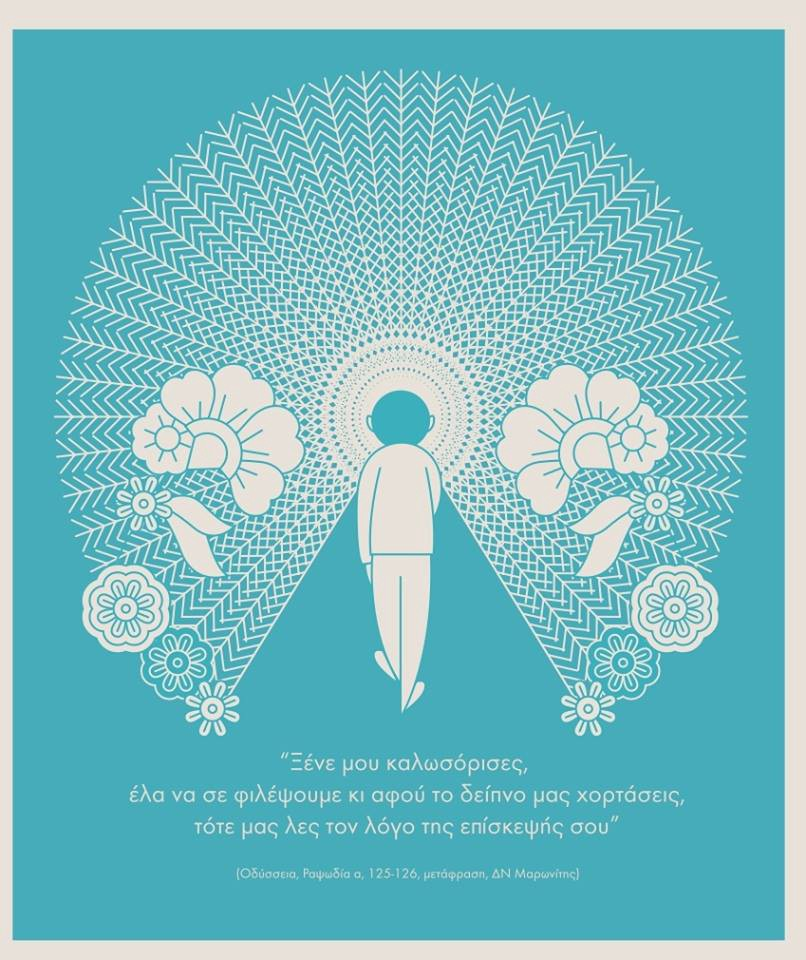

### AYS Daily Digest 13/5/19: Greece sending children to smugglers in the name of “reunification”
#### _More people missing en route from Lebanon to Cyrus // reports of the LCG shooting at people they took back to detain // Austria debuts the “Ten Commandments for Refugees” // new case law compilation for deportations to Afghanistan // and more…_
### There are some new, very concerning family reunification practices happening in Greece\.

Greece has increasingly been sending “out of date” family reunification requests, against the Dublin regulations\. As the Athens Volunteers Information and Coordination Group reports:

> “Lately, more and more, the regulations were being abused with many late requests for reunification\. But the most concerning aspect \(which has led to the changes in practices\) was that a huge number of unaccompanied minors were being sent with smugglers to other countries with reunification claims being made once the child had reached another country\. An intentional illegal child smuggling / trafficking ring was being created putting the lives of these minors \(often 1 or 2 year\-old\-babies\) at risk\.” 

Apparently, the Greek authorities are saying that sending children to smugglers, as long as the family approves, is “voluntary separation\.” They are saying this is NOT “coerced separation” under the Dublin regulations\. Find out more [here](https://www.facebook.com/Oinofyta/posts/873476152999742?hc_location=ufi) \.
#### LEBANON

A boat heading to Cyprus with eight people on board capsized off the coast of Lebanon on Monday\. The Lebanese Navy detained the three people they found but the other five are still missing\. While the focus of AYS primarily involves Europe, we cannot forget that **Lebanon is hosting the highest number of refugees per capita in the world and is facing overwhelming issues, which are certainly not present in European countries\.**
#### LIBYA

Migrant Rescue Watch reports that the Libyan Coast Guard \(LCG\) picked up 102 people from a boat on Sunday\. Find out more [here](https://twitter.com/rgowans/status/1127677612975960064?s=21) \.

[Upsetting footage](https://www.youtube.com/watch?v=x0Ms4YspebQ&feature=youtu.be) from the Sea Watch Moonbird crew, where a person tries to swim away from the Libyan Coast Guard to a European Boat, but ends up [getting caught](https://twitter.com/sallyhayd/status/1127926836195987456?s=19&fbclid=IwAR1SMIZPoucVUk-txjQsi9-3kwSPGqbqcVnSMg8v72uQd3JGUqBmtQMgbts) by the LCG anyway\.

[Reports](https://twitter.com/sallyhayd/status/1128014261563871233) are also surfacing of people getting caught by the LCG, escaping, and then getting shot at\. The EU cannot be in denial that the situation in Libya is treacherous and against international law\.
#### TURKEY

[A longer video](https://www.youtube.com/watch?v=Ai0hZyJyNPs&fbclid=IwAR0wIxBW5wFV6uS9yTLa17LTLnNO_UBDG9mRyr7X2asmTjO-LwQ0dsfM5MY) has surfaced detailing the specifics of a pushback that occurred on May 4\. İhsan Erdoğan, the man being interviewed, has been living in Athens as a political refugee for the past 11 months\. His twin sister, Ayşe Erdoğan, had been imprisoned in Turkey for 28 months\. Once she arrived in Greece, she was pushed back to Turkey, and the police accounts of this operation are apparently very concerning and untruthful\.

> **It is heartbreaking that people can try so hard to make it to Europe, only to be pushed back to Turkey and imprisoned\.** 

The numbers of deportations and “voluntary returns” in April 2019 have been released: Ten men in total, from three different Greek islands, withdrew their asylum claims\. Find out more [here](https://dm-aegean.bordermonitoring.eu/2019/05/09/deportations-to-turkey-overview-april-2019/?fbclid=IwAR3k4Tk-Wia5Fy2hQayXmSdaUpzj0jMYWYG1QWSdYx01f2nl4whG0MuOg7U) \.
#### GREECE

[Aegean Boat Report](https://www.facebook.com/AegeanBoatReport/posts/572777633245345?hc_location=ufi) posts the latest on **new arrivals** on the islands:

CHIOS → one boat: 32 people \(13 children , 6 women , and 13 men\)

SAMOS → two boats with 94 people in total \(the first with 56 people, the second with 38 people\)

428 people arrived in the week of May 6–12, according to the [UNHCR’s latest snapshot](https://reliefweb.int/sites/reliefweb.int/files/resources/69469.pdf) of the Aegan islands\. This is “an increase from last week’s 362 arrivals but a decrease from last year’s 636 arrivals during the same period\.” The **island with the most arrivals this week was Chios** \.

A total of 14,750 people are now on the islands, where 20% are women and 34% are children\. Of the children, 60% are under 12 years old\. Also, according to latest S [tatistical Data of the Greek Asylum Service](http://asylo.gov.gr/en/wp-content/uploads/2019/05/Greek_Asylum_Stats_Apr2019_EN.pdf) \(30\.04\.2019\) there are still 62,312 pending applications for asylum\.

](assets/8f447cb4d1e3/1*p0RBAafhUZpZgtWEHy_6UA.jpeg)

Photo by [Chios Eastern Shore Response Team](https://www.facebook.com/chiosesrt/posts/2153605498041956)

With the eight new landings on Chios last week, Chios Eastern Shore Response Team made sure to give everyone an emergency pack\. They also report:

> “A huge EMERGENCY showed up in Vial camp and we had to provide wood and palettes for 8 big tents as there wasn’t ANY accommodation for the new arrivals \! \! Our donors responded to this emergency and we haven’t left even one person to sleep outside\!” 

If you want to join this dignity\-providing crew, please find out more [here](https://www.facebook.com/chiosesrt/posts/2153605498041956) \.

ERMES — Εffective and Respectful Mental Health Support — will have some mental health workshops on the following days:

**1\)24/05 and 21/6: Cultural Diversity workshops** 
**2\)31/05 and 28/6: The role of interpreters in mental health workshops** 
**3\)14/06 and 5/7: Mental health in the world workshops**

Find out more [here](https://www.facebook.com/gfr.ermes/posts/2034915193477468?hc_location=ufi) about their mission and if you can help\!

Photo by ERMES
#### AUSTRIA

[Reports](https://www.dw.com/en/austrian-state-plans-ten-commandments-for-refugees/a-48712265?maca=en-rss-en-all-1573-rdf&fbclid=IwAR2wQz3R2FObNS2YeXnNngEvM81baqnCjoZAHrjIsXHTzWp5I2zVdYZ8zxI) of a new code of conduct for refugees in lower Austria, called “The Ten Commandments for Refugees,” surfaced on Monday\. Among the rules are the following:

Learn German
Adhere to Austrian laws
Adopt “Austrian values” and raise children in accordance with them
Resolve conflicts nonviolently
Respect religious freedom
Prevent unnecessary suffering to animals
**Show gratitude to Austria**

People would have to sign written agreements to adhere to the commandments and the commandments would underpin integration courses\.
#### GERMANY

A Europe for everyone — **in Munich, a protest** will be happening on **May 19th** \! Find out more [here](https://www.facebook.com/SeebrueckeSchafftsichereHaefen/photos/a.640137809691739/842877539417764/?type=3&theater) and don’t forget to **wear orange** \!
#### BELGIUM

Women Refugee Route will hold a training session for women of refugee backgrounds who want to learn more about: the concept of advocacy, stereotypes and how to break them, the Belgian legal framework, and the Belgian labor market and labor rights\.

They **need translators** so everyone can participate\! If you speak any of the following please reach out to them [here](https://www.facebook.com/WRRoute/photos/a.318518021861964/852399581807136/?type=3&theater) : — French, Arabic, Kurdish, Farsi, Dari, or Tigrinya\.
#### FRANCE

[Paris d’Exil](https://www.facebook.com/parisexil/posts/2077191798996782) is looking for hosts to help give people shelter, especially young people, who are living in the streets\. Find out more [here](https://www.facebook.com/parisexil/posts/2077191798996782) if you can help\!
### EU

The EU Council of Refugees and Exiles\(ECRE\) and the European Legal Network on Aslyum \(ELENA\) have compiled information on domestic & recent case law on returns to Afghanistan\. Find out more [here](https://www.facebook.com/asylumlawdatabase.eu/photos/a.377298708966409/2748045908558332/?type=3&theater) \.

](assets/8f447cb4d1e3/1*rQ2f98mDiyBnPD_DCSx0Vg.jpeg)

Photo by E [DAL European Database of Asylum Law](https://www.facebook.com/asylumlawdatabase.eu/photos/a.377298708966409/2748045908558332/?type=3&theater)
#### AYS and the Daily News Digest — how to get involved?

**We strive to echo correct news from the ground through collaboration and fairness\. Every effort has been made to credit organizations and individuals with regard to the supply of information, video, and photo material \(in cases where the source wanted to be accredited\) \. Please notify us regarding corrections\.**

**Apart from daily news in English, we also publish weekly summaries in [Arabic](%D8%A7%D9%84%D8%AA%D8%BA%D9%8A%D9%8A%D8%B1%D8%A7%D8%AA-%D9%81%D9%8A-%D9%82%D8%A7%D9%86%D9%88%D9%86-%D8%A7%D9%84%D9%84%D8%AC%D9%88%D8%A1-%D9%81%D9%8A-%D8%A7%D9%84%D8%AF%D9%86%D9%85%D8%A7%D8%B1%D9%83-b99e429d54ad) and [Persian](%D8%B9%D9%88%D8%B6-%D8%B4%D8%AF%D9%86-%D9%82%D9%88%D8%A7%D9%86%DB%8C%D9%86-%D9%BE%D9%86%D8%A7%D9%87%D9%86%D8%AF%DA%AF%DB%8C-%D8%AF%D8%B1-%D8%AF%D8%A7%D9%86%D9%85%D8%A7%D8%B1%DA%A9-7b984cac7a86) \. Follow the links to read and share the ones from the week of May 6th to 12th\. Find specials in both languages on our medium site\.**

**If there’s anything you want to share or comment, contact us through Facebook, Twitter or write to: areyousyrious@gmail\.com\.**

**We’re open to expanding our team of volunteer researchers, editors, and info gatherers\.**

_Converted [Medium Post](https://medium.com/are-you-syrious/ays-daily-digest-13-5-2019-greece-sending-children-to-smugglers-in-the-name-of-reunification-8f447cb4d1e3) by [ZMediumToMarkdown](https://github.com/ZhgChgLi/ZMediumToMarkdown)._
