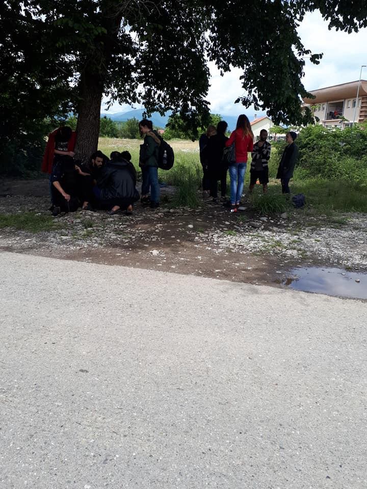
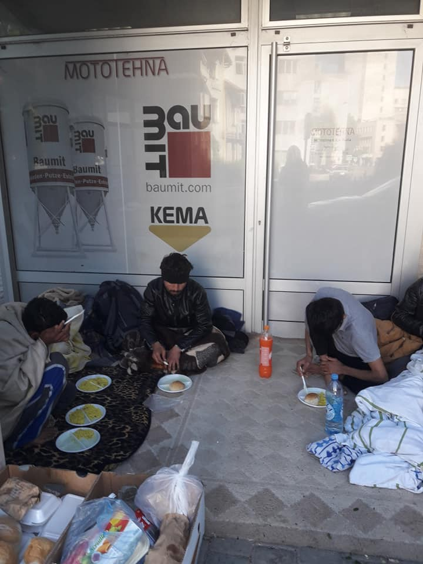

### AYS Daily Digest 21/05/19: Report shows that 1,007 children went missing in Greece between 2018 and 2019
#### Four unconscious people found in a tanker in Serbia//Italy transforming former prison in pre deportation centre//More deaths and violence in France//Pregnant women in Morocco denied access to doctors//Updates from Zintan//Deportations from Germany and Sweden\. \.

Lesvos, Greece, 1 April 2019\.
A refugee girl holds a puppy in the Moria refugee camp in the island of Lesvos\. Credit: Aris Messinis \-Art Against
### FEATURED STORIES

According to a [report presented by the Hellenic Police](https://www.keeptalkinggreece.com/2019/05/20/greece-children-missing-data/?fbclid=IwAR0sK-ukCHUCDO2muee2JBCFVNsvQwRtym00HfXPOi6p6acTBrQZKJO2snk) , 299 children went missing in Greece during the course of 2018\.

The report also underlines that 257 of these children were eventually found\.

> From the 299 children who went missing last year, 123 were boys and 176 were girls\. Of these, 96 boys and 161 girls were found, leaving 27 boys and 15 girls still missing\. \[…\] 

> In the first four months of 2019, 45 boys and 71 girls went missing, of whom 39 boys and 58 girls were found, leaving 6 boys and 13 girls still missing\. 

These data, though, refers to children who could, most probably, return to a family\. But when it comes to unaccompanied minors, the data are extremely worrying, giving that:

> as 1,110 children went missing in Greece in 2018 with only 421 found, while in the first four months of 2019 some 404 children went missing, of whom only 137 were found\. 

#### **This means that a total of 1\.007 children \(both accompanied and unaccompanied\) disappeared between 2018 and the end of April 2019\!**

The reasons to disappear could be multiple: lack of trust in authorities, “ _the threat of bureaucratic procedures and the fact that reception hospitality facilities are often inadequate or unsuitable for children_ ”\.

Children disappearing were mostly Greek, Albanian and Pakistani, of an age range between 13 and 18, according to officials\.

■■■■■■■■■■■■■■ 
> **[The Flying Seagull Project](https://twitter.com/FlyingSeagullUK) @ Twitter Says:** 

> > We've been coming to Moria since 2015 &amp; we're going to keep coming as long as there are kids here. We'll keep bringing moments of kindness &amp; joy &amp; we'll make sure they know you haven't forgotten about them. Everyone has the right to a happy and healthy childhood #charitytuesday https://t.co/F4bwXE9QHu 

> **Tweeted at [2019-05-21 11:10:23](https://twitter.com/flyingseagulluk/status/1130792953608318976).** 

■■■■■■■■■■■■■■ 

#### Around noon today four unconscious refugees have been found in a tanker on a parking lot of a auto wash company in Futog \(Serbia\); the doctors are fighting for their lives\.

The four bodies of the young men, aged between 20 and 30 years old, showed symptoms of heatstroke/hyperthermia and hypoxia\. All four patients are in a life threatening situation and at the IC\-unit of the Clinical Center of Vojvodina where they are being reanimated and treated whit intensive care\. 
The driver of the truck allegedly doesn’t know how or when the young men have entered the tanker\.

Original source [here](https://www.blic.rs/vesti/hronika/jeziva-scena-u-futogu-migranti-u-pronadeni-u-cisterni-u-besvesnom-stanju-njihovo/rq4cmzf?fbclid=IwAR2vXTyMbUp0CTfXkDbF8te-OSUjdkoavhpPw8ofL4qNbShzzj5CZhdckiA) \.
#### Italy is converting a former prison, closed because unsuitable even to host detainees, into a Cpr, a centre for pre deportation\.

This is happening in Marcomer \(Nuoro, Sardinia\), where the planned capacity of the new prison for deportations will be of around 100 people\. According to orders from the Ministry of Interior, the structure could be available to host around 50 people even by the end of the year\.

Following the logic of the Ministry, the new structure should deter arrivals to Sardinia, more frequent in the past months, especially on dinghies departing from Algeria\. Data coming from \(surprise, surprise\) the Interior Ministry states, though, that the arrivals to Sardinia are decreasing if compared to the ones of last year: 2\.101 presences by 13th May 2019 against the 4\.155 of 2018\.

The structure was previously closed because both the cells and the external areas were considered too small to host people, according to minimum parameters\.

Even though strong negative critiques were raised by local authorities and religious personalities, Salvini is convinced and proud of his choices\.

Original source [here](https://www.lasciatecientrare.it/in-sardegna-il-carcere-diventa-un-cpr-la-casa-circondariale-di-macomer-era-stata-chiusa-perche-inadatta-ad-ospitare-anche-i-detenuti-di-massima-sicurezza/?fbclid=IwAR1ZemFS7v9rbXVtv9p3Qd3EwFX1ZrdPXcItsD8VP07VMzI5HwrlrAnP3cA) \.
#### A refugee died yesterday around midnight, on the A16 motorway in the direction Calais to Dunkirk\.

Hit by a car he was killed instantly, and the driver and passenger are in deep shock because he was already on the ground at the time, having jumped from a moving truck\.

Documents were found, but authorities say it’s impossible to give his nationality or age because of the state of the body\.

He is not the only one to have lost his life in the region this year\. Two others have died in similar circumstances\. Until refugees are given a safe passage to UK to be reunited with family there, and a proper processing system to gain asylum in France they will keep on taking dangerous and desperate measures\. This young mans death is a cold reminder of how much Europe is failing to resolve the crisis\! \! \! They continue to have blood on their hands…\.

Original source in French [here](https://www.lavoixdunord.fr/586240/article/2019-05-21/un-migrant-est-mort-sur-l-autoroute-a16-cette-nuit?fbclid=IwAR2p64GnFMaUEzpFXITafgsbUn-I7SjO9u7vrfJo9uiGs8nK7sDKaWsIlg8) and translation into English [here](https://www.facebook.com/VZWBelgiumGent4Humanity/photos/a.1625929201058233/2293040561013757/?type=3&theater) \.

UPDATE: The man was finally identified\. His name was Mule and he was from Eritrea\. The family has been contacted\.
### MOROCCO

AMDH visited camps in Akdim and Bekoya, right in the middle of the country, to find out that the [pregnant women detained there are not followed by doctors](https://www.facebook.com/AmdhNador/photos/a.1693125780899690/2333862760159319/?type=3&theater) \.

At the same time, these women refuse to go to the hospital as they fear to be deported or abused by authorities; the migration delegation’s vehicle, which used to bring them back and forth to the hospital, is no longer in service\.

AMDH demand that Moroccan authorities stop the indiscriminate arrest of people which intimidate these women \(and not only\), in order to allow them to see a doctor and get checked as soon as possible\.
### LIBYA

■■■■■■■■■■■■■■ 
> **[Giulia Tranchina](https://twitter.com/GiuliaRastajuly) @ Twitter Says:** 

> > 4th day without any food &amp; water for hundreds of refugees detained in #Zintan.Doors are locked &amp; they are being starved to death, killed slowly by TB, hunger &amp; thirst, in inhuman conditions, after years of torture and unlawful detention. They need immediate help &amp; evacuation https://t.co/N8F7oQngUB 

> **Tweeted at [2019-05-20 16:09:58](https://twitter.com/giuliarastajuly/status/1130505954968121344).** 

■■■■■■■■■■■■■■ 

More detailed information on the critical situation in Zintan, in yesterday’s [digest](https://medium.com/are-you-syrious/ays-daily-digest-20-05-2019-tortured-starved-shot-the-dramatic-situation-of-zintan-c0fcfe7bca40?fbclid=IwAR2_xsAqlbcl-LlMFpkYsYP1bhyQ8vBj7_UQ6WyAk9xqu4-qPxeZJRQOav4) \.

Meanwhile, 18 people tried to escape the hell they live in, but 2 of them were captured again and beaten up badly\.

■■■■■■■■■■■■■■ 
> **[Sally Hayden](https://twitter.com/sallyhayd) @ Twitter Says:** 

> > Messages from Zintan saying around 18 people escaped, but two were captured, badly beaten &amp; isolated. Water was turned on for about 10 mins last night so they could drink, but they've still had no food since last week. People are critically sick, he says. [twitter.com/sallyhayd/stat…](https://twitter.com/sallyhayd/status/1130553600047013889) 

> **Tweeted at [2019-05-21 10:03:16](https://twitter.com/sallyhayd/status/1130776063162896384).** 

■■■■■■■■■■■■■■ 

### SEA

■■■■■■■■■■■■■■ 
> **[Alarm Phone](https://twitter.com/alarm_phone) @ Twitter Says:** 

> > After over 8 hours at sea, the 8 people who called us this morning are  still in distress in the #Mediterranean, near #Tangier. The Moroccan  authorities refuse to state whether a rescue operation has been launched  or not. Migrating is not a crime. Letting people drown is. 

> **Tweeted at [2019-05-21 08:46:49](https://twitter.com/alarm_phone/status/1130756822242078720).** 

■■■■■■■■■■■■■■ 

After long hours of absence of communication from the authorities and loss of contact with the boat itself:

■■■■■■■■■■■■■■ 
> **[Alarm Phone](https://twitter.com/alarm_phone) @ Twitter Says:** 

> > After many hours at sea, the 8 people who left Achakar in a small boat have finally been rescued, as confirmed by the Moroccan Navy. They were returned to #Morocco. They have suffered a terrible ordeal and risked their lives to reach Europe. 

> **Tweeted at [2019-05-21 16:54:18](https://twitter.com/alarm_phone/status/1130879500659695617).** 

■■■■■■■■■■■■■■ 

Arturo Centore, captain of the Sea Watch 3, has been heard today by the authorities for more than 6 hours, stating that [he would take exactly the same decisions again](https://www.repubblica.it/cronaca/2019/05/21/news/sea_watch_il_giorno_dell_interrogatorio_del_comandante_i_pm_il_nostro_lavoro_e_prendere_i_cattivi_neri_o_bianchi_che_s-226801419/) in order to save lives at sea\.

Investigations and search are ongoing and the ship remains seized for probatory reasons and not as an indefinite preventive measure\.

■■■■■■■■■■■■■■ 
> **[Sea-Watch International](https://twitter.com/seawatch_intl) @ Twitter Says:** 

> > Today, in the Public Prosecutor's Office of Agrigento, the Captain of the #SeaWatch 3 will be heard.

To our commander Arturo: the embrace and the support of the crew and all of Sea-Watch.

Saving lives is not a crime. https://t.co/Yx0WjnQKvO 

> **Tweeted at [2019-05-21 07:18:40](https://twitter.com/seawatch_intl/status/1130734639407149056).** 

■■■■■■■■■■■■■■ 

### GREECE

Residency permits could now be received online by the end of 2019, according to [this source](https://www.infomigrants.net/en/post/17003/greece-migrants-can-soon-apply-for-residency-permit-online?fbclid=IwAR1XxDQdIZOuC3az0Zj19JbJCraqaTBx1S0BxYw1qalhdQ5WgHQW8IMylIc) \.

Apparently, from June on, it will also be possible for foreigners, or their legal representatives, to make appointments with aliens bureaus in Attica online\.
### MONTENEGRO

> Some people arrived today at the reception center in Spuz, Montenegro\. We had the chance to talk and listen to them and answered some of their questions\. We hope the tired and exhausted people can find a bit of rest in all the misery surrounding them\. 

 in refugee organisation in Montenegro](assets/52c10a72ea86/1*JGe42PUOk_bBwZHoGaMBcA.jpeg)

Credit: [فراس شامي](https://www.facebook.com/profile.php?id=100011544815460&fref=gs&__tn__=%2CdC-R-R&eid=ARD_ZKheQ1_gMiNShqmg0zN4tXFI0Kq6e12GVYK8-TINHGky4EdQJTfenJrGxIJFk9M-bzIOWhghkFK3&hc_ref=ARTZwJbv4fdqHouMpEuZipfbDHANn_DtpskvqhufH1JD2oRAGX6W4IDfD382dwqFs1k&dti=1157824667713728&hc_location=group) in refugee organisation in Montenegro
#### BOSNIA

New arrivals in Tuzla, people are sleeping rough all night\. \.

](assets/52c10a72ea86/1*lqxaCwakrhC5vEdY_2tidA.jpeg)

Credit: Senad Cupo in [Pomoc izbjeglicama u BiH/Help to refugees in Bosnia and Herzegovina](https://www.facebook.com/groups/144469886266984/permalink/352874732093164/)
### ITALY

New [arrivals to Italy](https://twitter.com/AngiKappa/status/1130844666713083904?fbclid=IwAR1LxssoepC0MnUekB-IbZN4s92T2ID87WLT_cKJ_Q0Ip96ADTeZJ6wGOq4) today: 8 people \(4 men, 1 woman and 3 children\) landed in Lampedusa on a dinghy, after being intercepted by the ICG\. They stated to be from Tunisia\.

A [new report](https://antennemigranti.it/along-the-brenner-route-report/?fbclid=IwAR1dIjvIGgazvnL_DImYOfcRyuaaGb-PCdQAdeJg3kAYy-ZgR8hmAARWtA4) by Antenne Migranti and Fondazione Alexander Langer has been published, reporting about the living conditions of all those migrants who slipped out of the reception system net in the forgotten Brenner route\.

> The report sheds light on the emerging of informality in Italy, particularly in the Bolzano region and the implications and living conditions migrants are facing due to the legal framework of Italy and the EU regarding reception and migration management\. 

> The report explains informality and its role in the Italian scenario, providing background information regarding migration and informal living\. \[…\] \. 

After the entry into force of the Salvini Decree at the end of 2018, Riace \(the city in Calabria famous for its innovative integration policy carried out by the mayor Domenico Lucano\) had been excluded from participating to Sprar\*’s calls and de facto banned from the access to resources\.

Today, the regional administrative court of Reggio Calabria lifted the ban, [annulling the exclusion](https://www.ciavula.it/2019/05/tar-annulla-provvedimento-riace-sprar/?fbclid=IwAR0sfpbXsZPEushm9V0a0tLX_SVsVNGXRdY0JBuDm-wybc5L9Ct3Oo1Jykg) \.

Another victory for solidarity\!

\*Sistema di protezione per richiedenti asilo e rifugiati = Protection system for asylum seekers and refugees
### FRANCE

This is the price you pay when you don’t have the money to afford a ticket for the metro\.

One man stopped and severely injured by police forces, a disproportionate use of violence and a blatant silence from the public surrounding the scene; even if you want to film the abuse, there will be someone trying to impede you so\.

Abuse of power and impunity, a dangerous combo that is expanding more and more all over Europe\.

[Clothes are needed](https://www.facebook.com/care4calais/photos/a.1046164975416459/2470637506302525/?type=3&theater) in Northern France\.
### GERMANY

[Demo in solidarity with Seebrücke](https://twitter.com/MedinetzMainz/status/1130798193644593152?fbclid=IwAR02CGJPaMCcqp0-6bQzCg_Hvt1kD64buMldm0VYL8tuE6_gDnWwWHC1Nho) on Friday at 3 PM in Mainz\.
### SWEDEN

### UK

#### AYS and the Daily News Digest — how to get involved?

**We strive to echo correct news from the ground through collaboration and fairness\. Every effort has been made to credit organizations and individuals with regard to the supply of information, video, and photo material \(in cases where the source wanted to be accredited\) \. Please notify us regarding corrections\.**

**Apart from daily news in English, we also publish weekly summaries in [Arabic](أخبار-من-طريق-البلقان-والتغييرات-في-إجراءات-اللجوء-في-الاتحاد-الأوروبي-19b405bdab20) and [Persian](خبرهایی-از-مسیر-بالکان-و-تغییراتی-در-پروسه-پناهندگی-در-اروپا-6ebea1c73206) \. Follow the links to read and share the ones from the week of May 13th to 19th\. Find specials in both languages on our medium site\.**

**If there’s anything you want to share or comment, contact us through Facebook, Twitter or write to: areyousyrious@gmail\.com\.**

**We’re open to expanding our team of volunteer researchers, editors, and info gatherers\.**

_Converted [Medium Post](https://medium.com/are-you-syrious/ays-daily-digest-21-05-2019-report-shows-that-1-007-52c10a72ea86) by [ZMediumToMarkdown](https://github.com/ZhgChgLi/ZMediumToMarkdown)._
