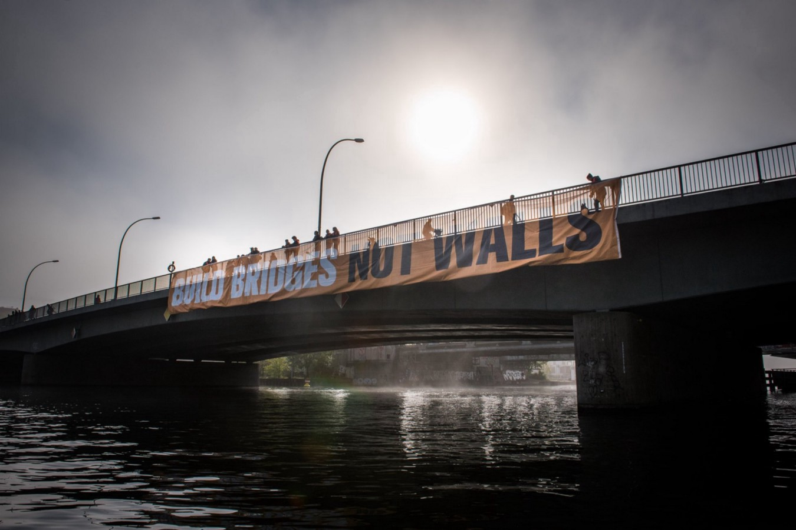
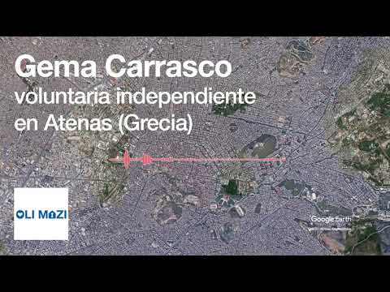

### أخبار من طريق البلقان والتغييرات في إجراءات اللجوء في الاتحاد الأوروبي
#### 19\-AYS Weekly News Summary in Arabic May 13

### **البحر**

قامت\(مراقبه البحر\) \-بإنقاذ ٦٥ شخصًا من مياه البحر المتوسط\. أبلغت مجموعة الإنقاذ على الفور إيطاليا ومالطا وليبيا وهولندا عن عملية الإنقاذ ، لكن وزير الداخلية الإيطالي ماتيو سالفيني حُرم من دخول ميناء آمن\. “” لقد وقعت للتو على أمر إعدام ضدهم بالقرب من المياه الإقليمية الإيطالية\. وكتبت سالفيني على تويتر: “إن موانئنا مغلقة وتظل مغلقة أمام قارب إنقاذ المهاجرين”\. لا تزال مجموعة الإنقاذ تحاول التفاوض على ميناء الهبوط ، ولكن مع مرور الوقت ، تمر أيام أخرى بينما يمكن أن تنقذ المجموعة الأرواح في منطقة \(سار\) \.

### **صربيا**

**تحديث من \(مطبخ بدون اسم\) في شيد**

نشر فريق\(مطبخ بدون اسم\) الذي يعمل على طول الحدود الصربية في شيد اليوم معلومات محدثة عن عملهم والوضع بالنسبة للاجئين في المنطقة\.

### **البوسنة والهرسك**

لا تزال الظروف السائدة في المراكز الموجودة في بيهاتش \(بيرا\) وكازين \(سيدرا\) وفيليكا كلادوسا \(ميرال\) سيئة والعديد من الأشخاص الذين يرفضون البقاء هناك أو يُحرمون من الوصول إلى حلول خطيرة للبقاء في مبان غير آمنة وغير مكتملة\. سقط رجل مؤخرًا من أحد هذه المباني وتوفي ، بينما توفي ثلاثة أشخاص آخرين بسبب الاختناق بعد اندلاع حريق في مكان كانوا يجلسون فيه\. يرجى محاولة التحقق من السكان المحليين أو الأشخاص الذين يساعدون المباني غير الآمنة ، وما هي البدائل وكيف يمكن مساعدتكم ، من أجل العثور على البديل الأكثر أمانًا\.
### **كرواتيا**
#### **تحذير**

بسبب الفيضانات الأخيرة ، فإن التضاريس في المناطق الحدودية غير آمنة للغاية ، والأنهار أوسع وأعمق من المعتاد ، مما يجعل الحركة أكثر خطورة\. من فضلك ، لا تشرع في رحلة إلى المناطق غير المعروفة إذا لم تكن متأكدًا من المكان الآمن للمشي\.
#### **النصيحة**

أيضًا ، اقتحم مؤخرًا منازل الناس في منطقة ليكا و كورسكي كوتار كثيرًا من الاهتمام السلبي من قبل الشعب في كرواتيا وقد يؤدي إلى خوف السكان المحليين من المهاجرين \(بسبب ما ورد في الصحف حول هذا الموضوع\) و المزيد من الشرطة في المنطقة\. نحن نشجع الجميع على كبح جماح أعمال العنف على ممتلكات الناس ومنازلهم ، لأن هؤلاء الأشخاص يتصلون بنا أيضًا لسؤالهم عن كيفية مساعدتهم ، ويفهم معظمهم لماذا يمر الناس بهذه الطريقة ، ومن خلال تخريب المنازل ، قد يتغير هذا الأمر وستتغير الظروف حتى أصعب\.
#### **على الحدود**

](assets/19b405bdab20/1*-0hzmrH69crQkv3m8qAT0w.jpeg)

[الفريق المتنقل لمعلومات اللاجئين](https://www.facebook.com/mobileinfoteam/?tn-str=k%2AF)

لا تزال عمليات الطرد الجماعي على الحدود الكرواتية مستمرة ، وعلى الرغم من أنها غير قانونية تمامًا ، إلا أن الشرطة لا تسمح للأشخاص بطلب اللجوء في كرواتيا / الاتحاد الأوروبي\. إننا نجمع بيانات وشهادات الأشخاص الذين تعرضوا للعنف أو السرقة على الحدود من الشرطة أو الذين تم طردهم من كرواتيا إلى البوسنة والهرسك دون فرصة لطلب اللجوء\. من فضلك ، إذا واجهت أنت أو أي شخص تعرفه هذا ، اتصل بنا حتى نتمكن من استخدام المعلومات لإثبات أنها لا تزال مستمرة ومكافحتها داخل كرواتيا ، حتى يتوقف هذا السلوك\. نحن نحمي المعلومات الشخصية للجميع ونشكرك إذا قررت المساعدة\.

يجب أن يُعطى كل شخص يعرب عن نيته في طلب اللجوء ويوجد على أراضي كرواتيا وثيقة تشرح الخيارات والخطوات ويجب أن تدلي ببيان في أحد مراكز الشرطة وأن تُودع في أحد مراكز الاستقبال\. يمكنك الاتصال بمركز القانون الكرواتي للحصول على مزيد من المعلومات والمساعدة القانونية\. هنا المزيد من المعلومات:

### حاسب الأقوياء\.
### صوّر الأدلة\. حقق العدالة\.

يسعى تطبيق “شاهد على الفظائع” [eyeWitness to Atrocities](http://www.eyewitnessproject.org/ar) إلى تقديم مرتكبي الفظائع للعدالة من خلال توفير تطبيق كاميرا سهل الاستخدام
يلتقط البيانات الوصفية اللازمة لضمان إمكانية استخدام الصور في التحقيقات أو المحاكمات\.

### **النمسا**
#### **إعادة فتح قضايا اللجوء بعد أن فقد “خبير” أفغانستان وضعه**

أعيد فتح عدد من قضايا اللجوء المرفوضة في النمسا بعد أن حرم “الخبير” الوحيد منذ فترة طويلة في أفغانستان وسوريا والعراق من وضعه\. كارل ماهرينجر رجل أعمال قضى عدة سنوات في أفغانستان ، وبناءً على هذه التجربة ، أعلنت الحكومة النمساوية أنها خبير في البلاد\. أدى تصويره المتفائل للحياة في أفغانستان إلى قرارات اللجوء السلبية للعديد من اللاجئين الأفغان في النمسا\. تم إلغاء وضعه كخبير مؤخرًا بعد أن تحدى عدد من الباحثين في نتائجه\.
### **ألمانيا**

لم يعد من الضروري أن يخشى اللاجئون من سوريا من أن المكتب الفيدرالي للهجرة واللاجئين \(ب ا م ف \) سيقرر طلبات اللجوء الخاصة بهم بشكل مختلف عن ذي قبل\. وقال وزير الداخلية الاتحادي هورست سيهوفر : “لن نغير المبادئ التي تستند إليها ممارسة صنع القرار في\(ب ا م ف\) في الوقت الحالي حتى نرى تطورات جديدة في سوريا”\. تم إيقاف القرارات المعلقة بعد هذا القرار\.
### **إيطاليا**
#### **تحاول كاريتاس وسلطات المعسكر الإيطالي أخذ مواقد الغاز الخاصة باللاجئين وتوجيه الاتهام لهم مقابل الطعام**

دخلت كاريتاس والسلطات الإيطالية الخيام في “معسكر” سان فرديناندو \(المعسكر الذي تم إعلانه رسميًا وليس المعسكر المؤقت\) ، في محاولة لسحب جميع علب الغاز التي يستخدمها الناس لطهي طعامهم\. كانت اسطوانات الغاز في السابق سبب حرائق قاتلة في المخيم المؤقت\.

ومع ذلك ، لم يكن هذا هو الدافع الرئيسي لهذا العمل\. لقد فعلوا ذلك ليس بسبب القلق من الحرائق المحتملة ، ولكن لأنه يمكنهم إنشاء خدمة \(مينسا\) لأولئك الذين يعيشون في المخيم ، والتي تديرها كاريتاس ، بتكلفة ١ / ١\.٥٠ يورو لكل شخص لكل وجبة\. وهذا يعني أن الناس سوف تحتاج إلى دفع ثمن طعامهم\! يحصل الأشخاص الذين يعيشون في مخيم سان فرديناندو على أقل من ٢٠ يورو يوميًا ، ويتم استغلالهم في الحقول لمضاعفة الوقت الذي يسمح به القانون ، بدون عقد أو تأمين\. والآن تحاول كاريتاس استغلالهم مقابل بضعة دولارات إضافية أيضًا\.
### **فرنسا**

تم إحراق جزء من مركز الاحتجاز احتجاجًا على الترحيل الوشيك لمغربي يبلغ من العمر ١٨عامًا\. كان هناك انتقادات لممارسة الاحتجاز هذه\. وحُكم على الأشخاص الثلاثة الذين قُبض عليهم في الهجوم المتعمد بالسجن لمدة عامين على الفور

يبحث فريق \(باص معلومات اللاجئيين\) عن هواتف محمولة قابلة للاستخدام لتقديمها للاجئين في فرنسا الذين يحتاجون بشدة إلى الاتصال بالعائلة \. إذا كان لديك هاتف تود التبرع به ، فيرجى الاتصال بالمجموعة هنا\.
### **العامية**
#### محكمة العدل الأوروبية تحكم على أنه لا يمكن ترحيل اللاجئين تلقائيًا بسبب الجنايات

لا يمكن للاجئين اللجوء إلى إجراءات الترحيل التلقائي للجرائم إذا كانوا معرضين لخطر جسيم في بلدانهم الأصلية ، حكمت محكمة العدل الأوروبية هذا الأسبوع\. قد لا يزال الناس يواجهون فقدان مركز اللاجئ الرسمي إذا أدينوا بارتكاب جرائم خطيرة ، ولكن قد لا يتم ترحيلهم ، وفقًا للمحكمة\.
#### أكثر من 150،000 شخص في 50 مدينة أوروبية يتظاهرون لتكون أوروبا مكان مرحب به أكثر مما هي عليه

](assets/19b405bdab20/1*zUIIWLkXnJgSTHGE9bS_Jw.jpeg)

[الفريق المتنقل لمعلومات اللاجئين](https://www.facebook.com/mobileinfoteam/?__xts__%5B0%5D=68.ARCsL2Dr2_jqWdDYLBuWz5iUDwUqcj6drGtPVMO2XxeOsbun3BSkx5M0fhH2US09b_lo7Gjbotx_ivJYwcqJDVGriKyxhgEliORWmLLC_VPGTm4MrdGcXAPTqSHcK3Uj6BaIRQ6lH09aRzEVdKRYNjaDdw7vGgRyha8n4KDDeNJTfrAVbf87nF1nS8u48IzqPIgEofKsF3SLok1gKxVi-HHIMhWAl9dkvWtOa5MPTdXz0pkAUcHNhFmPFMypaeYCz0XQCrp8FN4qIQB4pNkKpqRiHzl8NbppomLIkNGSbywNUDpHgAR4ZFq-LGZSpU4SjzaY9BO3JE8YsIcVdRBk5ZiYgJ0n&__tn__=k%2AF&tn-str=k%2AF)

ستجري انتخابات البرلمان الأوروبي هذا الأسبوع\. للاحتجاج على الأحزاب القومية والعنصرية التي تزداد قوة وشعبية ، تظاهر أكثر من 150،000 شخص بسلمية يوم الأحد الماضي في أكثر من 50 مدينة أوروبية\. من بين أمور أخرى ، كانوا يطالبون بأن تكون أوروبا مكاناً أكثر ترحيباً للمهاجرين واللاجئين\. وبدلاً من تعزيز حدود أوروبا ، طلبوا طرق ضمان آمنة و مضمونة وإجراءات لجوء عادلة\. دعى المتظاهرون جميع المواطنين الأوروبيين للتصويت في الانتخابات الأوروبية ضد القومية والعنصرية لضمان أوروبا ديمقراطية وسلمية وموحدة\. وحمل المتظاهرون لافتات كتب عليها “من أجل أوروبا بدون أسوار” و “قلبي ينبض من أجل التنوع”\.

> قلبي ينبض من أجل التنوع\! 

**يتوفر الكثير من الأخبار باللغة الإنجليزية يوميًا على صفحتنا في موقع الميديوم**

**في حال كان لديك أسئلة أو ترغب في نشر معلومات معينة ذات صلة بإجراءات اللجوء أو بلد اخباره مهمة ، يرجى عدم التردد في الكتابة إلينا — إما عن طريق إرسال رسالة إلينا على فيسبوك أو إرسال بريد إلكتروني إلى**

[**areyousyrious@gmail\.com**](mailto:areyousyrious@gmail.com)

_Converted [Medium Post](https://medium.com/are-you-syrious/%D8%A3%D8%AE%D8%A8%D8%A7%D8%B1-%D9%85%D9%86-%D8%B7%D8%B1%D9%8A%D9%82-%D8%A7%D9%84%D8%A8%D9%84%D9%82%D8%A7%D9%86-%D9%88%D8%A7%D9%84%D8%AA%D8%BA%D9%8A%D9%8A%D8%B1%D8%A7%D8%AA-%D9%81%D9%8A-%D8%A5%D8%AC%D8%B1%D8%A7%D8%A1%D8%A7%D8%AA-%D8%A7%D9%84%D9%84%D8%AC%D9%88%D8%A1-%D9%81%D9%8A-%D8%A7%D9%84%D8%A7%D8%AA%D8%AD%D8%A7%D8%AF-%D8%A7%D9%84%D8%A3%D9%88%D8%B1%D9%88%D8%A8%D9%8A-19b405bdab20) by [ZMediumToMarkdown](https://github.com/ZhgChgLi/ZMediumToMarkdown)._
