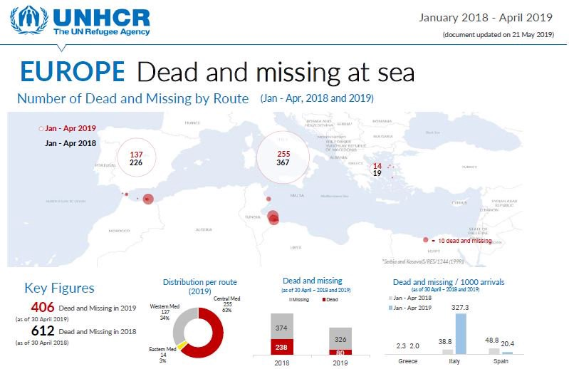
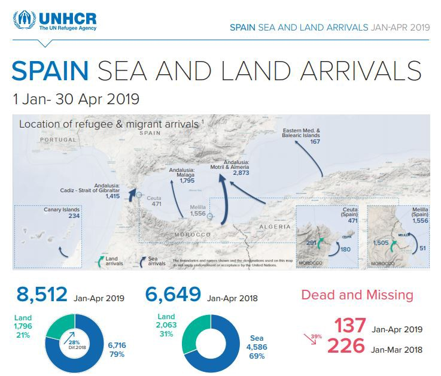

### AYS Daily Digest 22/5/19: EU’s hypocrisy effects in the Balkans, across the Mediterranean, all the way to ‘a glass of water a day’ in Libya
#### **Deadly deterrence strategies of the EU border regime and poor partnership deals effects documented in a recent report by Alarm Phone / Testimonies from Morocco and from the French capital / tragedies in the Mediterranean and across the ‘Balkan Route’ / Three women die off Spanish coast / Frontex deployed in Albania**

Illustration by: Marilena Nardi, via ArtAgainst
#### FEATURED STORIES
### Testimonies from Morocco

> ”Can you believe — the slave trade is still going on”, 

says a young man from a West African nation in a video\.

He is describing an illegal deportation carried out by Moroccan police, and the inhuman treatment he and the group were exposed to\. He managed to hide his phone, and discreetly filmed when the police stopped alongside a road to let people go on the toilet, still in handcuffs, two by two\. The video is filmed a five\-hour drive from the coastal city of Tangier\.

A group of around 16 people were temporarily staying in an apartment in Tangier, aiming at crossing the sea to reach Spain and the EU\. The day before the police rushed in and put them in handcuffs, they had held a surprise party for one of the women in the group as it was her birthday and they wanted to celebrate\. Lamin, as we will call him, went out and bought the cake with a friend\. They informed their migrant friends in the neighborhood about the party, and told them to come over\.

The morning after the party, the police entered the flat\. According to Lamin their neighbor ”didn’t like them at all” as they all are black, and racism is very common in Morocco\. He thinks that the neighbor called the police, who brought the group to a police station, took photos and asked them about their nationality\.

> ”The police need some documentation to send to the EU to show them that they are doing their jobs\. The EU gives them money to deport us, but the police don’t deport us\. They are not doing the right thing”, Lamin\* says\. 

The group of 11 men and five women, some of them pregnant, [were dumped in the middle of nowhere at the Mauretanian border](https://tidningensyre.se/2019/nummer-366/marocko-sa-lange-havet-finns-har-vi-hopp/?fbclid=IwAR1UdDhpNt_4o0r_9bP0SHvMAEjrFOCukexfwHJ4FM9Nj7BqXLZEC53LvTs) \. They walked to the nearest village, arranged for cars and buses, and came back to Casablanca\. Even though Lamin knows that the EU pays Morocco to keep him away, his goal remains to reach the bloc\.

> ”As long as the sea is there, we have hope”, he explains\. 

All they want is to find some peace\. Before the police left them in the jungle, they called the group all kinds of bad and racist nicknames\.

Last year, the [**EU gave Morocco**](http://europa.eu/rapid/press-release_IP-18-6705_en.htm) **€ [148 million](http://europa.eu/rapid/press-release_IP-18-6705_en.htm) to tackle the increasing migratory flows** through the country\. Most of the money was taken from the EU Trust Fund for Africa, which was implemented in 2015\. 
Researcher Ruben Andersson at the University of Oxford told the _Dagens ETC_ that since 2015 the will to keep people away has “escaleted”\. Since then, people on the move have increasingly been perceived as threats or risks\.

L’Association Marocaine des Droits Humains \(AMDH\) has frequently stated that **Morocco isn’t a safe collaboration partner and that human rights violations are common\.** We reported earlier and [_El Pais_ also said](https://elpais.com/…/21/inengl…/1550736538_089908.html%C2%A0) that since the beginning of 2019, the Spanish coast guard together with their Moroccan colleagues have started to return some people intercepted at sea to Morocco\.

> After intense repression campaigns by the Moroccan government, which are demanded and supported by Europe, the record\-breaking figure of January this year, when over 4,600 people reached Spain within the month, could not be replicated\. 
 

> Still, movements continue along this route where over 800 people lost their lives in 2018\. 

### The situation has never been this dire in Paris

The number of tents has increased considerably these last days around the areas of Wilson Avenue and Saint Denis, and the accounts of a volunteer, published by [Solidarité migrants Wilson](https://www.facebook.com/Solidarit%C3%A9-migrants-Wilson-598228360377940/?__xts__%5B0%5D=68.ARAeJOeAtqieajTGl6O7NMK6dah8GaAgDer7h5gBV2qqG-eEHbLY9tci0fy8ejTlBP0yq_U_jxE8D3bkJ1YNUTQrLjdH77J-cPLAXe2LGxeFTyT81yDYaL39bPGiNuPqv_hg-TE6bzygs7VBx-vtOC582Icaa1rvt43PX_4RV1BXhaINoPCsE0yeaom1RJWOCrn_TBUp_iTUSk8ZttwFXvNx_OcWX7xki17cYNzHaPJHmvUph_pKYkfUqWZSsOjRv79JvYz-Wy0PvPf2l4Hd7QL14-Xc_qeANBZHh6R5dmRupLbV-x8xWYfFsk10aoVHAsvgTFRCZsm0TXoxtld8QrqISQ) perhaps best describe the current state:

“When you arrive along the highway, there are dozens of tents, even more than the previous Tuesday\. Some sleep on the floor, with nothing over their head and I hear some echoes of volunteers who inform us that there are children as well\. Babies on the street\. My heart is tightening more and more, I try to hold back the tears but it’s too much for me\. In spite of my efforts, I collapse\. How can we let children live in deplorable conditions in the middle of rats, with nothing …? I go through all the emotions: anger, sadness but also shame\. Shame to be French at this moment, shame to leave them and go home to a warm house\. \(…\) This evening will remain etched in my memory\. This feeling is shared by all\. Even the hardest, most ‘anesthetized’ of us have the feeling of heartbreak tonight\.”

](assets/be0b114bc6a5/1*AUV_DYpNQIlF727q08Zkrw.jpeg)

Photo: [Solidarité migrants Wilson](https://www.facebook.com/Solidarit%C3%A9-migrants-Wilson-598228360377940/?__xts__%5B0%5D=68.ARDiAp4kll2W06bX6BZptXVpkQOQbMKTYQgaARuzNvcbdDTrAyP1GXMuEejxl1hXQDwlWVkyaxHv_H0MSZ2njah-gL27JucZLXTCVnO7n0B-cFNg3CXNThp-2XSTp-ed3g9zJMp5PrZvY1bQv-MTTZ5rb-Cn4auv_E6uzMl2oO-WT0X6BOcsSkuHJkbyM7q-JU9CDskCA2S6LhVZeoby79ZdubzyXd4JGKBb7hKRW9-7QwsIO9McM3EXAyfKc3ZnpR8qla-5KwrjIek8pvLqJMQ6FixSHlBavNR8zHbUAitx8vqJqXAKqPf99KHzxhOhcImdZWr_S1RjYwZHekaRh3JFxw&__tn__=k%2AF&tn-str=k%2AF)

Surely a consequence of yet another evacuation here and there, closures of emergency shelters after the winter, returns to the street with no prior solutions in mind\.

During the distribution of about 300 meals prepared last Sunday by volunteers, we meet a Somali born in 1951, who after a few years in Germany without regularization found refuge in a tent without mattress on the avenue, before receiving a notice of expulsion from France … to Germany\. How to explain the lack of logic in the decision? We also met several minors from Afghanistan, 15 years old at most, who share a tent\. In the direction of La Chapelle, we try in vain to take several people with psychological difficulties and severe trauma to St\. Anne and other hospitals\.

**I also listen to the story of a young man who was raped, tortured and left starving in Libya, who does not know whom to trust anymore\.**

Libya, a country that many refugees whose name can not even pronounce for fear of stirring the worst memories\. Next to the Port d’Aubervilliers, we encounter a women and a family\. A frightened father of the family shares a tent with his wife and three children, desperate to have no other solution\. For an hour we try to call the social SAMU who do not pick up\. By the time we were all thinking we’d go home, we are meeting the Association Amicale du Nid and Utopia 56, who share the same feelings as we do: for a long time, **the situation has not been this serious\.**

](assets/be0b114bc6a5/1*lHC_TZYG77lrOVh_VezF_g.jpeg)

Photo: [Solidarité migrants Wilson](https://www.facebook.com/Solidarit%C3%A9-migrants-Wilson-598228360377940/?__xts__%5B0%5D=68.ARDiAp4kll2W06bX6BZptXVpkQOQbMKTYQgaARuzNvcbdDTrAyP1GXMuEejxl1hXQDwlWVkyaxHv_H0MSZ2njah-gL27JucZLXTCVnO7n0B-cFNg3CXNThp-2XSTp-ed3g9zJMp5PrZvY1bQv-MTTZ5rb-Cn4auv_E6uzMl2oO-WT0X6BOcsSkuHJkbyM7q-JU9CDskCA2S6LhVZeoby79ZdubzyXd4JGKBb7hKRW9-7QwsIO9McM3EXAyfKc3ZnpR8qla-5KwrjIek8pvLqJMQ6FixSHlBavNR8zHbUAitx8vqJqXAKqPf99KHzxhOhcImdZWr_S1RjYwZHekaRh3JFxw&__tn__=k%2AF&tn-str=k%2AF)

And yet, in the midst of all the sadness, the chain of solidarity worked again last night\.

Between collectives, we will continue to stand together for this chain of solidarity to continue\! This same channel is also strengthened thanks to new volunteers who join us every week to bring us the new energy needed, and thanks to your donations \( [www\.lepotcommun\.fr/pot/tusyjrwc](http://www.lepotcommun.fr/pot/tusyjrwc) \) — to not stop\.”
#### Degrading the people even more in Libya’s camps

700 people in Zintan were documented on video receiving a glass of water each, from a few common buckets, after having been deprived of basic needs and left to suffer the severe consequences of detention and conditions in the centre\. Reportedly, people started fighting once they realised the bucket was nearly empty and some people wouldn’t be able to drink anything\.

People inside the centre tell one of the journalists that UNHCR officers have not been seen for a while now…

■■■■■■■■■■■■■■ 
> **[MSF Sea](https://twitter.com/MSF_Sea) @ Twitter Says:** 

> > "Detention centres were not built to house people. They’re often warehouses that have now been used for the storage of people instead of for goods," says MSF's Sam Turner.

People intercepted at sea &amp; illegally returned to #Libya are put in these centres.

[euronews.com/2019/05/20/the…](https://www.euronews.com/2019/05/20/they-sprayed-the-room-with-bullets-migrants-in-libyan-detention-centres-living-in-fear) 

> **Tweeted at [2019-05-22 06:27:23](https://twitter.com/msf_sea/status/1131084118551351296).** 

■■■■■■■■■■■■■■ 

The people inside the centre say they receive food through holes in the doors\.

](assets/be0b114bc6a5/1*1v_QGzvt1dwbg5v5EWQ4SA.jpeg)

Photo: [Anette Kjær Jørgensen](https://www.facebook.com/anettesaw?__tn__=%2Cd%2AF%2AF-R&eid=ARDLi180FePPhxPe31xElFvmpg7OcWlEtHQJ9Ob-yqeMfJoBipElELg3tbUvp7ONHSJaWDAJIYZpeDCU&tn-str=%2AF)

■■■■■■■■■■■■■■ 
> **[Sally Hayden](https://twitter.com/sallyhayd) @ Twitter Says:** 

> > I've repeatedly tried to speak to the International Medical Corps, who are supposed to be providing medical care to detainees in Zintan, about what's happening there - but they refuse to answer. From just now: https://t.co/PLk4dqUK2W 

> **Tweeted at [2019-05-22 18:36:19](https://twitter.com/sallyhayd/status/1131267563051200512).** 

■■■■■■■■■■■■■■ 

For direct updates on Libya, please follow Sally Hayden and other investigative journalists in contact with people from the area\.
#### SEA

Over **400 people have lost their lives** at sea trying to reach security in Europe in the first four months of this year\.

### The Mediterranean Border: Mass Abductions, Push\-Backs, People Left to Die

In their most recent report, Alarm Phone focuses on their experiences over the last two months\.

> _Besides assisting dozens of boats that successfully reached European shores, we had to witness several severe human\-rights violations at sea, including forms of push\-back, refoulement, and non\-assistance, as well as cases involving loss of life\. At the same time, struggles continue in the highly contested space of the Mediterranean Sea where some enact their freedom of movement and are supported by allies while others do what they can to thwart these expressions of freedom at every turn\._ 

A constant practice seems that the authorities reject responsibility and allow for more boats being ‘left\-to\-die’, yet another example of the **deadly deterrence strategies of the EU border regime\.**

Many cases described in the report highlight the ‘ **refoulement industry’** in the Mediterranean Sea, with European state and supra\-state authorities orchestrating the eventual capture and abduction of escaping people, sending them back to a war zone\.

3 women have lost their lives on board a boat that came out last morning with the aim of reaching the coasts of Cadiz in Spain\.
69 survivors have been assisted reportedly by the Moroccan Navy\.

#### ALBANIA
### EU’s response to border violence — deploying more watchdogs at the borders?\!

Frontex is deploying 50 officers with 16 patrol cars and one thermo\-vision van from 12 EU Member States “to support Albania in border control and tackling cross\-border crime\.” Allegedly they have been following the completion of the Status Agreement on border cooperation between the EU and Albania from earlier this month\. This is the first agreement of this kind with a neighbouring non\-EU country and the EU\. Yet another unfit reaction by those behind the restrictive, one\-way, securitisation \(only\) obsessed decisions\.
#### BOSNIA AND HERZEGOVINA
### Time for transparency

It is time to finally find out where all the millions have gone and to whom\. 
The amounts are discussed, responsibilities are avoided and shared — money given to one side, responsibility asked from another\. We invite journalists to investigate this matter so we can all finally know what the recent ways are to manipulate both the people living there and those trying to pass through or seek protection\.

Those shaping the policies within the Balkan countries \(or ignoring the issues\), those in the EU behind the decisions, and the international organisations turning a blind eye to everything that’s taking place within their area of responsibility \(having only blind eyes to turn at this point\) should also be aware of the real life stories such as this one —

The body of the man who died tragically on April 20, about whom we reported, was returned home to Morocco yesterday, as volunteers reported who are in touch with the family\. The family is grateful at least to the local people of Tuzla for having cared about their son and for having given him attention and respect\. 
The overwhelming sadness of the boy’s mother is even greater as she had already lost one son who drowned in the Mediterranean, and whose body was never found\.
### Support and assistance

Local initiatives as well as some of the international groups who have a long presence in the area are still helping the people in Velika Kladuša, Bihać, Tuzla and other places throughout the path the people are passing while in Bosnia and Herzegovina\. They rely only on donations and the needs are growing, people are coming in greater numbers and not that many manage to leave, so apart from those who can’t get a place in the dreadful camps in the area, many who are there rely on the local volunteers to get proper food and other amenities\. The situation in Bosnia is a very specific one in more than one way, so please be well informed before you set out for any ‘mission’ or trip there\. Do not forget also that the country is outside the EU and therefore special rules apply when it comes to the import of used goods such as shoes etc\. Contact those on the ground or let us know where and how you can help and we will do our best to connect you to the right people\.
#### HUNGARY
### Council of Europe harsh on Hungary’s rights abuses

The European Court of Justice [ruled](https://curia.europa.eu/jcms/upload/docs/application/pdf/2019-05/cp190065en.pdf?utm_source=POLITICO.EU&utm_campaign=4320136ece-EMAIL_CAMPAIGN_2019_05_21_09_26&utm_medium=email&utm_term=0_10959edeb5-4320136ece-189694413) that a Hungarian law stopping foreign investors from using agricultural land violates property rights\.

Hungary has also received harsh criticism from Dunja Mijatović, the human rights commissioner of Council of Europe, who [said](https://www.coe.int/en/web/commissioner/-/hungary-should-address-interconnected-human-rights-issues-in-refugee-protection-civil-society-space-independence-of-the-judiciary-and-gender-equality) that the rights abuses in Hungary must be addressed “as a matter of urgency” when she outlined the findings of her report, stressing that Viktor Orbán’s government had resulted in “a legislative framework which undermines the reception of asylum seekers and the integration of recognised refugees\.”

She raised concerns over the widely known situation in the transit zones, saying that many of the detained refugees have been deprived of food and that government policy had “resulted in practically systematic rejection of asylum applications\.”

Here is the video summary of the Report:

> Round up the usual suspects 

And, while we absolutely support and comment the Commissioner’s work, we can’t escape asking the obvious \(long question\) of the EU — will the EU at some point stand behind it’s decisions that result in police violence in Croatia and Bosnia and Herzegovina? Will they admit to be funding an oppressive system through Frontex at the border instead of pushing for a concrete solution to people’s issues? Will they stop making the worst deals with the worst partners that result not only in some of the most horrid human rights abuse in African countries, but also in very poorly executed and hardly planned reallocation from Turkey? Will they stop tacitly accepting fascist policies as legitimate and stop criminalising those of their citizens who still dare to be humane and stand up to what has now become a historical injustice? 
Or, will they continue to hide behind the political ‘food for masses’ disguised under securitisation while ignoring the entire history of human rights and laws we are built upon, call out Hungary over something they too are doing in other ways, be ‘amazed’ at the findings and reports on the abuse at the borders and hide behind supposedly human rights organisations whose acronyms at this moment in history to most people out there represent a big disappointment?
I guess we will see…
### FRANCE

If you are in Paris, join the protest:

> Saturday, May 25th @ Place de la Chapelle , 14h 

> Pays des droits de l’Homme : Mais bien sûr que tu peux demander l’asile en France \! Euh, attention quand même : pour vraiment bénéficier de ce droit, t’as plutôt intérêt à avoir débarqué en parachute\. Ah, ce n’est pas ton cas ? Dommage \! 

> Ta vie est en danger dans ton pays ? Welcome in France \! On ne te refuse pas le droit, d’asile, simplement on te renvoie dans un pays qui va te renvoyer dans ton pays… T’as compris ? L’Europe n’a pas aboli le droit d’asile, elle applique les accords de Dublin\. 

> Bilan carbone : En vertu des accords de Dublin, les pays européens passent leur temps à se renvoyer les réfugiés, les uns les autres\. A renvoie vers B, qui renvoie vers A, C renvoie vers A, etc,etc\. Cela te parait absurde? Ne juge pas trop vite et n’oublies pas que cela permet de subventionner chaque année des dizaines de milliers de billets d’avion aux exilés ainsi qu’aux escortes de policiers \! 

> Cohérence européenne : En Méditerranée il est interdit de ne pas noyer\. En Lybie, l’UE subventionne des centres où l’on pratique de manière systématique la torture, le viol et l’esclavage\. En France les exilés n’ont pas accès aux droits fondamentaux et sont brutalisés chaque jour\. Partout, on criminalise l’aide\. Finalement les accords de Dublin participent d’une logique certaine \! 

#### AYS and the Daily News Digest — how to get involved?

**We strive to echo correct news from the ground through collaboration and fairness\. Every effort has been made to credit organizations and individuals with regard to the supply of information, video, and photo material \(in cases where the source wanted to be accredited\) \. Please notify us regarding corrections\.**

**Apart from daily news in English, we also publish weekly summaries in [Arabic](أخبار-من-طريق-البلقان-والتغييرات-في-إجراءات-اللجوء-في-الاتحاد-الأوروبي-19b405bdab20) and [Persian](خبرهایی-از-مسیر-بالکان-و-تغییراتی-در-پروسه-پناهندگی-در-اروپا-6ebea1c73206) \. Follow the links to read and share the ones from the week of May 13th to 19th\. Find specials in both languages on our medium site\.**

**If there’s anything you want to share or comment, contact us through Facebook, Twitter or write to: areyousyrious@gmail\.com\.**

**We’re open to expanding our team of volunteer researchers, editors, and info gatherers\.**

_Converted [Medium Post](https://medium.com/are-you-syrious/ays-daily-digest-22-5-19-eus-hypocrisy-effects-in-the-balkans-across-the-mediterranean-all-the-be0b114bc6a5) by [ZMediumToMarkdown](https://github.com/ZhgChgLi/ZMediumToMarkdown)._
