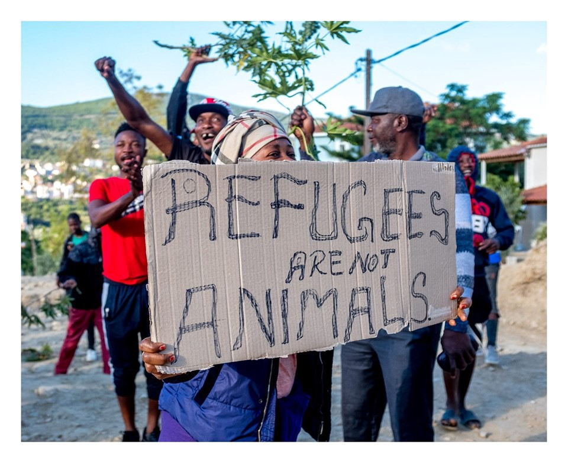

### AYS Weekend Digest 25–26/5/19: Protestors on Samos met with Batons and Tear Gas
#### _Syrian refugees deported from Beirut airport // Arbitrary detention of refugees in Nador // More people left outside the official accommodation in Bosnia // Deportation warning in Austria // Rescues off coast of Malta // 21 missing in Alboran sea // And more…_

Refugees protesting in Vathy, Samos\. Photo Credit: © Jérôme Fourcade / Abisto
#### Feature: Police Brutality on Greek island of Samos

Refugees protesting the deplorable conditions in the Samos camp were met with tear gas and police batons this Saturday morning\. According to statements by NGO workers and refugees, a protest began around 7:30 on Saturday morning when a line of police officers blocked the path of refugees\.

An independent photojournalist who is working on the island, Jérôme Fourcade, was detained by the police, who demanded to see the contents of his camera\. Fourcade and a number of NGO workers at the scene were taken to the police station, but were released without charges after a few hours\. It seems that the police took advantage of the absence of journalists and NGO eyes on the scene, and began firing tear gas canisters and attacking people with batons\. One man [sent an image to the media](https://www.euronews.com/2019/05/25/exclusive-violence-breaks-out-between-residents-of-refugee-camp-and-police-on-greek-island?fbclid=IwAR0I48sa1hw-S0H5FrzOjODRC7L2XyuJIBIvbXaZfbj6CXvLyYRaz_BbuGw) of severe welts on his back after being beaten by the police\. Fourcade witnessed some of the violence before being detained, and described the police “charging” at the peaceful protestors\.

The Samos camp is considered to be one of the worst refugee camps in Greece, and in Europe over all\. There are over 4,000 people crammed into the hillside camp that was intended for 700\.
### Lebanon
#### Syrian refugees deported directly from Beirut Airport upon landing

16 Syrian refugees were summarily deported after arriving at the Beirut airport, according to a joint statement by Human Rights Watch, the Lebanese Center for Human Rights \(CLDH\), Legal Agenda, Frontiers Rights, and the Access Center for Human Rights\. 5 of the 16 had official UNHCR status as refugees within Lebanon, and at least 13 expressed fear of being tortured or killed if they were returned to Syria, [according to HRW](https://www.hrw.org/news/2019/05/24/lebanon-syrians-summarily-deported-airport?fbclid=IwAR1L-uxMZ8bzTkSeAcSknYqk7IVSDNrHZZGLPb8qFCNO_MRtdAp3vG0ZKEk) \.
### Morocco

](assets/67d9bee5cd51/1*kn6DsdimsszkFHnMs_Eg_g.jpeg)

A group of young refugees being detained by the Moroccan police\. Photo Credit: [AMDH Nador](https://www.facebook.com/AmdhNador/photos/a.1693125780899690/2337214049824190/?type=3&theater&ifg=1)

A group of approximately 60 young refugees were arrested without cause over the weekend by authorities in Nador, according to the [Moroccan Association for Human Rights](https://www.facebook.com/AmdhNador/photos/a.1693125780899690/2337214049824190/?type=3&theater&ifg=1) \. In addition, many of the people arrested were taken to Casablanca and Fez, where they have no connections or support\.
### Sea
#### Sea\-Eye fundraises for repairs to “Alan Kurdi” rescue ship

](assets/67d9bee5cd51/1*buo2K1zqQP5LEBd9L9qC4g.jpeg)

A volunteer at work aboard the Sea\-Eye\. Photo Credit: [Sea\-Eye](https://www.facebook.com/seaeyeorg/photos/pcb.1942978005808087/1942972909141930/?type=3&theater&ifg=1)

> There’s a lot to do\! On Thursday the [\#alankurdi](https://www.facebook.com/hashtag/alankurdi?source=feed_text&epa=HASHTAG) should go to the dry dock\. Our appointment has been postponed to Monday\. The ship in front of us has more repairs\. More than a dozen women and men use the time and work day by day on our “Alan kurdi”\. 

> We don’t have enough [\#donations](https://www.facebook.com/hashtag/donations?source=feed_text&epa=HASHTAG) yet to ensure the shipyard and the subsequent operations\. Please help us with your online donation at: [sea\-eye\.org/spenden](http://sea-eye.org/spenden?fbclid=IwAR19myKNpEwLDrpcq5CXwdYIH3GEUWT6TW5yh3ijb1zgIirWsGDq4y0GvxQ) 🧡 

### Greece

**Open Letter published by Greek Border guard in Evros**

An open letter has been published by a Greek Border guard who works in the Evros region, along the Greek\-Turkish land border\. The officer described the brutality with which the officers are expected to track and capture migrants\. Perhaps the most incendiary part of the letter was the officer’s claim that the police often use regular, non\-rubber coated bullets when apprehending refugees, rather than the rubber bullets dictated by law \(which are still very dangerous\) \. You can read the letter in full \[Greek\] [here](https://diktiospartakos.blogspot.com/2019/05/blog-post_472.html?fbclid=IwAR0ceEBVucncXdoZIgJSWvHqSe5zO8YzjFRh_EQ9a4h3Mp6iFsGu-mfi6w0) \.
#### New Arrivals

43 people arrived on Oinousses island on Sunday \(numbers via [SMH](https://twitter.com/smhumanitario/status/1132550815363870721) \) \.

33 people were rescued off the island of Agathonisi on Saturday, according to the Hellenic Coast Guard\.

\(Remaining numbers from [Aegean Boat Report](https://www.facebook.com/AegeanBoatReport/posts/580912829098492?__xts__[0]=68.ARDMJjdD8242HC2KuilOeP2rxQkZ7yU6JzaJQDLjHSBdjB-J-2rutZWYfPYzrJ1stwDksw11uuau2h5TtUBJQ1YFd7QWjfWT9KLS9SB732WK0Ot439EyTgrcDSwa0_sECgJm2mOGYsL5ZrD4eBNvz3EvtkQfIfCRzCwLvmX13YH4FIrEVvx9K8HLXAIHoAQeaOgbH3-uMfH6OkO3G65fPwJ_XMNlqq1pMhIZzavX4GOWMfithHCBerFW2NZqLr1XTQfpJqNj5YXN7CzGkFM8q_TgENbn41M_J_Jn_8AoqwNGeyiaWG_oEJLs2Vlv5Ysh6p7jRNZuBvfCqESuOpk0Oko&__tn__=-R) \)

Second boat landed in Thermi, Lesvos east 03\.00\.
21 people 
No breakdown available\.

Third boat landed in Skala Mistegnon, Lesvos east 07\.00\.
21 people 
No breakdown available\.

A boat was transported to Mytilíni from Limnos\. Arrived on Limnos yesterday, carrying 27 people\. \(No breakdown available\. \)

A boat landed on the east coast off Samos 04\.30\. Carrying 54 people, 24 children, 10 women and 20 men\. \(Numbers not confirmed\. \)

A sixth boat also arrived on Samos, reported to be carrying 51 people\.
\(Numbers not confirmed\. \)

■■■■■■■■■■■■■■ 
> **[RSA](https://twitter.com/rspaegean) @ Twitter Says:** 

> > Rain in Hotspot of #Moria today. Refugees try to protect themselves again from weather conditions. More than 4340 live there while capacity is for 3100 #stopthetoxicdeal https://t.co/7JOZ2GNB37 

> **Tweeted at [2019-05-24 12:56:04](https://twitter.com/rspaegean/status/1131906712749973505).** 

■■■■■■■■■■■■■■ 

### Bosnia and Herzegovina
#### No Happy Ramadan

 \)](assets/67d9bee5cd51/1*pTo3qvBB8vuZE_pawu0YPA.jpeg)

People outside the Bira camp in Bihać \(Photo Credit: [Udruženje Solidarnost — Bosnia](https://www.facebook.com/solidarnostbosnia/?__tn__=%2CdkCH-R-R&eid=ARCcnvC49YTIQ4FiDVnWPSMZ1BFcAFoGOcYoAq3LZcU_pTGXVN0DLoiRHCBogzOLyJItlxg549bypQk-&hc_ref=ARQvGZrskbIQdawD9OuoA4215N84i4E11Ps_BIAas8hxZ3cpk6uCdzW1jkHt83TmkeY&hc_location=group) \)

This is the month of Ramadan, but for the many refugees who are currently in Bosnia, there is no “Ramadan Kareem”\. As solidarity volunteers stated this weekend,

> “the month of Ramadan is the hope of all Muslims, that this will be a sacred month\. That’s how it should be\. But here in our city people live next to us in inhuman conditions, humiliated, in the meadow, sidewalk, without the possibility to eat, bathe even in cold water, use toilets, have health protection, nutrition,\. \. there are around 500 migrants\. Sleeping on concrete, icy, wet land, many sick\. Every raindrop is on them\.” 

Once again, those who are mostly supporting them are the locals across the country who show solidarity from day to day, as well as volunteers in Kladuša and Bihać, assisting those with no lodging\.

The volunteers from [Udruženje Solidarnost](https://www.facebook.com/solidarnostbosnia/?__tn__=%2CdkCH-R-R&eid=ARCcnvC49YTIQ4FiDVnWPSMZ1BFcAFoGOcYoAq3LZcU_pTGXVN0DLoiRHCBogzOLyJItlxg549bypQk-&hc_ref=ARQvGZrskbIQdawD9OuoA4215N84i4E11Ps_BIAas8hxZ3cpk6uCdzW1jkHt83TmkeY&hc_location=group) recently shared a video of refugees sleeping in a parking lot in Bosnia, where they are sleeping out in the open, totally exposed to the cold and the rain\.

#### Shipping containers sent from Germany to Bosnia to serve as refugee housing

36 shipping container housing units have been sent from Diedorf to Bihac in Bosnia, where they will serve as housing for refugees in the camp there, according to [German media](https://www.augsburger-allgemeine.de/augsburg-land/Fluechtlingsunterkuenfte-reisen-800-Kilometer-weit-nach-Bosnien-id54384036.html?fbclid=IwAR0hgBjYjB64jXiNu7g4McMAJrTFGm83IzbwP71IDikz3mo979bgIX_wovg) \.
### Germany
#### Security forces in the Lindenstraße camp in Bremen attack young refugees

Activists from the Together We Are Bremen group reported an attack against refugees by the security forces in the Lindenstraße camp over this weekend\. The attack was preceded by months of provocations and racist insults by the security forces, according to Together We Are Bremen\. The group posted a public statement today:

> The situation \[in Lindenstraße\] has become unbearable\. The inhabitants feel threatened\. The security service deliberately escalates situations, attacks people, throws them to the ground, chokes them and threatens them\. The attacks take place under the eyes of the AWO\. They do not only tolerate them but respond to the many complaints of the residents in saying that the AWO is not responsible for the security forces and therefore they could do nothing…\. 

> Just a few weeks ago, security forces at the University Hospital in Hamburg killed William Tounou\-Mbobda with a brutal and racist assault\. In order to avoid more deaths, we demand the ministry of social affairs to immediately terminate the contract with the security group in Lindenstraße \! 

The group is calling for a rally in front of the Ministry of Social Affairs, on Tuesday, 28\.05\. at 1pm, Bahnhofsplatz 29, Bremen, in order for people to show their solidarity with the people facing violence in Lindenstraße camp\.
### Austria
#### Deportation Warning for Afghans

Solidarity groups have been warning Afgani migrants that the number of deportations seems to heavily increasing this month\. Many Afghani refugees are being detained and served with deportation papers\. Those who may be facing this situation are advised to consult their legal advisor\. For more info, click [here](https://www.facebook.com/stopdeportation/?__tn__=%2CdkCH-R-R&eid=ARBTxCqZRQHu-g9qrMDj_j7VnSWyo0_rzjNOcg2X-zmylxYbxPv_lql5S1rYcISU4SD-Qt3uPhJ0_Jjv&hc_ref=ARRKpw3CQCvnDzzDznRI4j9RFkQp0ATXCaBk3cx0FWpGf8cbTCmqzgD0ONj7I6YRZ6g&fref=nf&hc_location=group) \.
### Sweden
#### Deportation Update \( [Via Afghanistan Migrants Advice and Support](https://www.facebook.com/AmasoAfg/?__tn__=%2CdkCH-R-R&eid=ARCgDcVv0GHBSqkDKyn5f_W1SeD3JaJB1scobc5EMRdnJjm0OlPcrPXoxoOmihscUEL3mO8KMh6S7MfF&hc_ref=ARSi1nJj-E32tB4jEpDC5Kn8aXtYPOQHhVqflA75Uq2gpPAlpRPyRHucQQmAw6vi7Ss&fref=nf&hc_location=group) \)

> Sweden is planning to deport unconfirmed number of Afghan asylum seekers from Sweden back to Afghanistan on 28th of May 2019\. One of those facing deportation has been in contact with AMASO and is seeking for information about the services available post deportation to Afghanistan\. 

> The person concerned doesn’t have family or friends in Afghanistan and is entering the country for the first time\. 

### Malta
#### 216 people rescued off the coast of Malta

Over 200 people were rescued from dinghies on Friday by the Armed Forces of Malta \(AFM\) \. According to AFM, there were many minors and at least one pregnant woman among the group\. According to Maltese authorities, those rescued will have the opportunity to apply for asylum within the country\. While this is what is dictated by EU and international law, it can never be assumed the law will be followed\. According to a [Maltese journalist](https://twitter.com/ReginaCatrambon/status/1132560551178055680?fbclid=IwAR13lvvuAoTbWPyYHKEIhnM_lqYIixrZnfplomk0ldIi2DxpUo1r8OlyHFY) , all of those rescued are in good condition\.
### Italy
#### Update from Ventimiglia, refugees describe beatings by French border police \(via [Progretto20k](http://Progetto20k) \)

In the last few weeks our monitoring efforts in Ventimiglia have detected between 20\-30 rejections per day, and several instances of violence against detained people committed by the PAF \(French border police\) \. As a witness explained to us, during the night of May 21st, the PAF beat a pregnant girl and then refused to call the ambulance, despite rescue requests\. On May 23, two young boys were beaten by the same cop, who also broke the phone of one of them \(the phone contained the photos of his documents\) \. During detention in the French container people are often denied food and water, despite various people who are following Ramadan and need water and food at night\. Following the request to have food or simply water many boys have been threatened with physical violence\.
#### Court decided in favor of refugees who comandeered ship when threatened with return to Libya

■■■■■■■■■■■■■■ 
> **[Sea-Watch International](https://twitter.com/seawatch_intl) @ Twitter Says:** 

> > 🔴 Court finds: No ship abduction but legitimate self-defense. Once again Italian courts rule against interior minister #Salvini and his illegal policy of port closure - #CivilDisobedience by the refugees meet  #ConstitutionalObedience by the authorities!

[ilfattoquotidiano.it/2019/05/24/mig…](https://www.ilfattoquotidiano.it/2019/05/24/migranti-che-dirottarono-nave-assolti-per-legittima-difesa-ora-ricorso-a-corte-strasburgo-contro-salvini-e-toninelli/5204596/) 

> **Tweeted at [2019-05-25 14:27:59](https://twitter.com/seawatch_intl/status/1132292230713098240).** 

■■■■■■■■■■■■■■ 

#### Boat lands during the night in Vibo Valentia

A boat carrying 52 refugees [was intercepted by Italian authorites](https://twitter.com/AngiKappa/status/1132249880443936768?fbclid=IwAR3f0slY8OkiwnHzAf-G8fr8uVnvVfFDlbHaJ07v2xBPiN4vd_sVwNS46JQ) in Vibo Valentia, in the Calabria region, as those on board were disembarking\. According to the Italian police, two people of Russian nationality were arrested, who are believed to be people\-smugglers\.
### Spain

A boat carrying 21 people, including a 15 year old girl has been reported missing in the Alboran sea\. As human rights jounralist Helena Garzon bitterly noted, “If this girl were European her disappearance would open t\.v\. news, but as a migrant there will be no means to ensure her recovery\.”
### France
#### Another death near the UK/French border, brother seeks funds for repatriation of body

A 23 year old Eritrean refugee who was living in France died this past week on the A16 motorway between Calais and Dunkirk when he was struck by a vehicle\. It is believed he was trying to reach Calais in order to seek passage to the UK\. The man’s brother, who is a student in Sweden, in seeking funds for the repatriation of his brother’s body, so that he may be buried with his family\. If you are able to help, you can donate [here](https://www.helloasso.com/associations/l%20auberge%20des%20migrants/collectes/collecte-pour-le-rapatriement-de-mulue-en-erythree?fbclid=IwAR3z9XLBKYGF0XwvqSNRKlVNJi-3CqoruVQPcl4zYWBpN2O4uKXWmo92874) \.
#### Protest against the Dublin agreement in Paris

](assets/67d9bee5cd51/1*EsuvMzGSGojmre9wb8pVtw.jpeg)

Photo Credit: [Utopia 56](https://www.facebook.com/U56ParisIDF/photos/pcb.2107526476213468/2107525389546910/?type=3&theater)

> We were more than 500 to mobilize against the Dublin regulation\! 

> We have gathered to challenge this system that imposes migrants to stay in the first country by which they have through; without taking into account neither the presence of their family nor the language they practice\. 

#### Young Man kills himself in Park in Strasbourg

A 27 year old refugee named Habib [hung himself in a park](https://france3-regions.francetvinfo.fr/grand-est/bas-rhin/strasbourg-0/strasbourg-migrant-27-ans-se-suicide-parc-du-glacis-1675387.html?fbclid=IwAR3f0slY8OkiwnHzAf-G8fr8uVnvVfFDlbHaJ07v2xBPiN4vd_sVwNS46JQ) where he had been sleeping in Strasbourg\. According to his companions, he had been living in France for 6 months, and had become increasingly desperate over his situation and inability to find help or move onwards\. “It was the state that killed him,” said one of his companions\. “He was not a martyr, he was not an example, but still, we do not want his death to go unnoticed\.”
### UK

New drop\-off point for Care 4 Calais donations in Hastings: We have a new drop off point for donations\! Contact Paul Barnett to arrange: paul\.barnett53@googlemail\.com\. You can see the list of things we’re currently most in need of here: 
[https://care4calais\.org/get\-involved/collect\-donate/](https://care4calais.org/get-involved/collect-donate/?fbclid=IwAR07mofxEEEq7CQa8sRBbn2IffV8eQHXlSyOMuvAmodTQmP-wymUF27CT-I)
### General

May 25th is International Missing Children’s Day\. On this day of remembrance, the Refugee Women’s Center in Northern France has sent a reminder of how many refugee children are missing in Europe\. While there are approximately 10,000 child refugees missing in Europe, the number missing in Turkey is nearly 100,000\. From the [Refugee Women’s Center](http://Refugee Women's Centre) :

> According to UNICEF, one third of all refugees and migrants in Europe are children\. The most recent information about how many of those children are missing comes from a Europol report that is now over 3 years old\. That report stated there were an estimated 10,000 missing child refugees\. In February of this year, the deputy chair of human rights in the ruling Justice and Development Party of Turkey stated that since 2015 over 96,000 refugee children have gone missing and their whereabouts are still unknown\. 

> Nearly 100,000\. 

#### AYS and the Daily News Digest — want to get involved?

**We strive to echo correct news from the ground through collaboration and fairness\. Every effort has been made to credit organizations and individuals with regard to the supply of information, video, and photo material \(in cases where the source wanted to be accredited\) \. Please notify us regarding corrections\.**

**Apart from daily news in English, we also publish weekly summaries in [Arabic](%D8%A7%D9%84%D8%AA%D8%BA%D9%8A%D9%8A%D8%B1%D8%A7%D8%AA-%D9%81%D9%8A-%D9%82%D8%A7%D9%86%D9%88%D9%86-%D8%A7%D9%84%D9%84%D8%AC%D9%88%D8%A1-%D9%81%D9%8A-%D8%A7%D9%84%D8%AF%D9%86%D9%85%D8%A7%D8%B1%D9%83-b99e429d54ad) and [Persian](%D8%B9%D9%88%D8%B6-%D8%B4%D8%AF%D9%86-%D9%82%D9%88%D8%A7%D9%86%DB%8C%D9%86-%D9%BE%D9%86%D8%A7%D9%87%D9%86%D8%AF%DA%AF%DB%8C-%D8%AF%D8%B1-%D8%AF%D8%A7%D9%86%D9%85%D8%A7%D8%B1%DA%A9-7b984cac7a86) \. Follow the links to read and share the ones from the week of May 6th to 12th\. Find specials in both languages on our medium site\.**

**If there’s anything you want to share or comment, contact us through Facebook, Twitter or write to: areyousyrious@gmail\.com\.**

**We’re open to expanding our team of volunteer researchers, editors, and info gatherers\.**

_Converted [Medium Post](https://medium.com/are-you-syrious/ays-weekend-digest-25-26-5-19-protestors-on-samos-met-with-batons-and-tear-gas-67d9bee5cd51) by [ZMediumToMarkdown](https://github.com/ZhgChgLi/ZMediumToMarkdown)._
