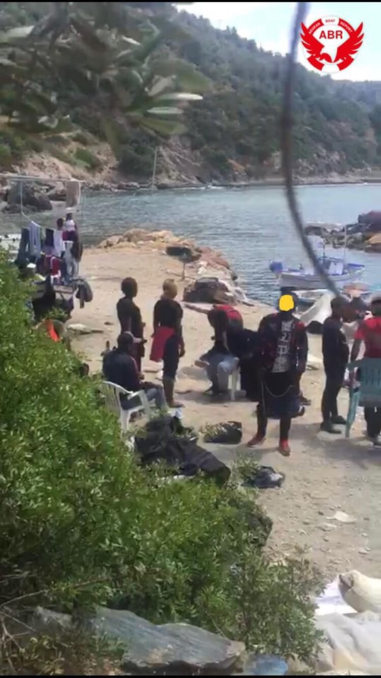
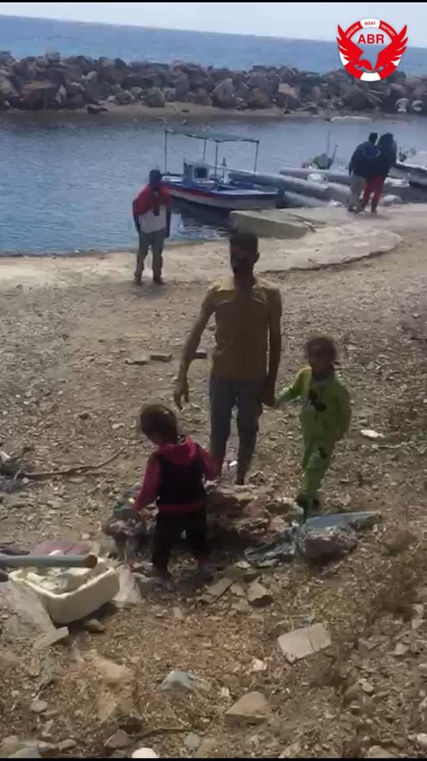

### AYS Daily Digest 4/6/19: Boat in distress with 50 people taken by Libyan Coast Guard
#### _Many new arrivals in Greece // more on Sudan’s paramilitary assaults // Libyan police brutality in Zawiya // situation in Montenegro detention centers // and more…_

](assets/2cdb345a6bf5/1*RaNH0VCqaG_OG0xmE25drA.jpeg)

“Refugees from \#Moria hotspot wish Eid Mubarak” Photo by [RSA](https://twitter.com/rspaegean/status/1135985288772227072?fbclid=IwAR3LXe3k7JxhUYjVXdwUkorTei1ZroRi2VBfMEf6Bj8kegs-nuIDisrzsgc)
### Sudan

_While Sudan is not one of our focus areas, we are continuing to report on the devastating news concerning the revolution\._

[New reporting](https://www.theguardian.com/world/2019/jun/04/sudans-military-council-calls-for-snap-elections-in-wake-of-deadly-protests?fbclid=IwAR01F-ekLfu2_WF-_9ySGFISszeUhNDPSreyR4mnR7aKDFeSJrZCVzaJstY) has surfaced that the paramilitaries who killed 35 people during pro\-democracy demonstrations on Monday also raped and assaulted several women\. Some of the assaults happened on the street while others happened when the military entered hospitals\.

Witnesses also said they “beat up medical staff and volunteers at clinics, looted and destroyed property in hospitals and threatened doctors and medical workers with reprisals if they provided care to the wounded\.”

In a statement by Human Rights Watch, Jehanne Henry, Associate Africa Director at Human Rights Watch, said:

> “The decision to unleash violence against peaceful protesters is absolutely unjustified and unlawful, and a slap in the face for those who have been pursing dialogue to achieve a handover to civilian government…UN member states should urgently establish an impartial, independent UN inquiry into these atrocities, and ensure that those responsible for killings, detentions, destruction, and looting are held accountable\.” 

### Libya

[Reports](https://www.facebook.com/rastajuly/posts/10156697313073621) from on the ground in Libya recount devestating acts of police brutality in Zawiya:

\(you can find audio of the shooting [here](https://twitter.com/sallyhayd/status/1135837908412313600?fbclid=IwAR0cBCE9jKPe2idcMCSQ9SSoXgBoQ6d8op6_xLfh1vokHX6RsHc7jBEa-EY) \)

> “Refugees in \#Zawiya tell us how last night a group of Sudanese who had been kept locked all day and night in a separate hangar got beaten by the police and some were was shot in their legs, one in the stomach\. information about what happened is still confused as it is very dangerous for refugees to speak out\. It would appear that 1 died and 3 got badly injured\. They have apparently been taken away, while one boy whose leg was shot was taken back from hospital at 3am and has been in pain all night\. Zawiya detention centre is very unsafe for the vulnerable and traumatised refugees held there, many of whom survived the previous shooting in \#QaserBinGashir and are suffering from psychological trauma\. Almost all of them were caught at sea and illegaly deported back to Libya\. Europe is complicit in these human rights violations and must immediately change its criminal policies in Libya and in the Med\. \#EvacuateRefugeesFromLibya” 

[70 Sudanese](https://www.facebook.com/anettesaw/posts/10219537781060009?hc_location=ufi) refugees came last week to Zawiya and were locked up with everyone else\. The number of people coming from Sudan to Libya seems to be increasing\.

[The Libyan Report](https://thelibyanreport.com/libya-unhcr-calls-for-closure-of-zintan-migrant-center/?ref=facebookBot&fbclid=IwAR2JuJY9ymkfWTt8K0ND4PY5y7BAAQkXvYVbADmNuNTWcOyDC5q2qwjix9Y) also talked about how UNHCR called for the closure of Zintan Migrant Center since the 96 people transferred from there were living in “terrible conditions…\(that need to\) be dismantled as soon as possible\.”

**“It is necessary to immediately adopt all the available options to release the remaining detainees…Since at the moment there is no adequate center to host refugees and migrants in Tripoli, in part due to the ongoing hostilities, UNHCR urges once again the international community to carry out further evacuations of refugees from the capital\.” \-UNHCR**
### Morocco

[100 people](https://www.facebook.com/AmdhNador/photos/a.1693125780899690/2343416585870603/?type=3&theater) were arrested by Moroccan authorities yesterday, including 20 women and children\. They were taken to a new migrant detention centre in dar kebdan\.

This comes with the news that [Moroccan authorities](https://www.infomigrants.net/en/post/17290/morocco-claims-success-in-slowing-migrant-departures-to-europe) are boasting their effect on curtailing migration to Spain\. Spanish and Moroccan authorities continue to work together to stop people from crossing, yet many human rights activists are increasingly concerned about the treatment of refugees in Morocco\. Learn more here\.
### Sea

Early on Tuesday Alarm Phone tweeted about a distress signal they received:

■■■■■■■■■■■■■■ 
> **[Alarm Phone](https://twitter.com/alarm_phone) @ Twitter Says:** 

> > BOAT IN DISTRESS: In the morning we were alerted by a wooden boat with 50ppl in immediate distress in front of #Libya. Water is entering the boat, 2 ppl are unconscious. 11:12CEST Authorities are informed, until now no rescue is underway.
Don't let them drown! 

> **Tweeted at [2019-06-04 10:46:39](https://twitter.com/alarm_phone/status/1135860410383552512).** 

■■■■■■■■■■■■■■ 

[Hours later](https://twitter.com/alarm_phone/status/1135912627253567488) they reported that the Libyan Coast Guard intercepted the boat and brought it back\.

In a separate but continuing statement today [UNHCR reported](https://twitter.com/sallyhayd/status/1135895646991540224?fbclid=IwAR3W739R_crCB1UuGw1O6eUMRWA-ZiDMGpTWbV5mXttRB-1iKTMUFC1otfs) that:

> “More people \(1,224\) were returned to Libya by the Libyan Coast Guard in May alone than in the rest of 2019 combined\.” 

[Since departures](https://twitter.com/MSF_Sea/status/1135881387268091904?fbclid=IwAR26OnZ4IJuBUbSR1Tj_nvHh-9J0-1NYLN4zfdyevNzTHHWt1kGtP8fC420) from Libya are coming daily now, much more needs to be done to insure that Europe isn’t dehumanizing lives and breaking international law by keeping people in Libya\.

](assets/2cdb345a6bf5/1*IMAFjLFEHa3rfXRdcNh9kw.jpeg)

Where the call of 50 people, 2 of which were unconscious, met their captors\. Photo provided by [Sergio Scandura](https://twitter.com/scandura/status/1135868702220529664)

[MSF](https://www.infomigrants.net/en/post/17294/msf-says-tunisia-not-place-of-safety-for-refugees) is still urging that Tunisia is not a safe place for refugees, with no functioning asylum procedures in place\. The Maridive 601 vessel carrying 75 people is still being refused at the port of Zarzis, Tunisia\. There are at least 5 critical health conditions on board\.

](assets/2cdb345a6bf5/1*eCZGF1PptBJyzO51CgBdoQ.jpeg)

The Maridive 601 vessel Photo by [Forum Tunisien pour les Droits Economiques et Sociaux \(Ftdes\)](https://www.infomigrants.net/en/post/17294/msf-says-tunisia-not-place-of-safety-for-refugees)

[Salvamento Maritimo](https://twitter.com/alzoubeidi/status/1135942544205000706?fbclid=IwAR2bHUdHJ1bzPpHUtGR941EleKWMIjO2exLMoHY4ZE-rqixET_Pe7XNYmX0) rescued 15 people on Tuesday including 3 children and 2 women\. They were crossing from Morocco to Spain\.

[Almería Red Cross](https://twitter.com/CruzRojaAlmeria/status/1135941023484526602?fbclid=IwAR2Li56oDa6P9XZFeYlebAlmW8zCjrfL5LoYGMCbL5cpg7Te5e4yUi8v1xM) also reports that that 15 people were brought to the port in Almería\.

](assets/2cdb345a6bf5/1*8faMjbUxitpiy3J0xdMlbg.jpeg)

Photo by [Almería Red Cross](https://twitter.com/CruzRojaAlmeria/status/1135941023484526602?fbclid=IwAR2Li56oDa6P9XZFeYlebAlmW8zCjrfL5LoYGMCbL5cpg7Te5e4yUi8v1xM)
### Greece

New arrivals according to Aegean Boat Report:

> “As far as we know, 8 boats have arrived on the Greek Aegean Islands, carrying a total of 260 people\.” 

](assets/2cdb345a6bf5/1*r2ZtiLSlxqnmidcUOEWI9Q.jpeg)

Photos by [Aegean Boat Report](https://www.facebook.com/AegeanBoatReport/posts/586663665190075?__xts__[0]=68.ARCBo2dGr1JKHjftJsbydExqrd0_mXDf3kra2TxHrR47lAhcJ7ZiEh-8NpL5SU1nSanEVcSN_RfOJiKWMtBukX7TAKmdqOJZOtkZ0kYlP3ztB4xFK9GxdHr2cfdJmIKpoy1cUC025labcZnaB5aW7A1pAq9QAbOF22ECoQeyLXHEZjKcX8fFO4N48ecB86R017X2z-k7pWOf3ANhFg7cJApr5FUEbu3GBFilTDdQe-V0UtcZFUckmxZm4guqCxvqGyEYZyKsx8Si17s1BE3fR9iYe-Q0ArOpXxSufMlFUsM98i-nTXZN73Hus3DsE1V7PPW57VdNtTx8W_BECwH6C98&__tn__=-R)

**4 Boats** around Lesvos:

→ First boat with 15 people \(4 children, 3 women, and 8 men\)

→ Second boat with 46 people \(No breakdown available\)

→ Third boat with 45 people \(No breakdown available\)

→ Fourth boat with 28 people \(6 chilldren, 7 women, and 15 men\) \*They had to wait 4 hours before police reached them

**2 boats** arrived on Samos:
 → First boat with 21 people 
 → Second boat with 58 people 
No breakdown available for either\.

**1 boat** was transported to Leros with 36 people \(No breakdown available\)

**1 boat** picked up outside Kos with 11 people \(Numbers not confirmed\)

_1 boat_ was also stopped by the [Turkish Coast Guard](https://www.facebook.com/AegeanBoatReport/videos/vb.285298881993223/442450062983599/?type=2&theater) off the coast of Samos this morning with 35 people being arrested\.

■■■■■■■■■■■■■■ 
> **[RSA](https://twitter.com/rspaegean) @ Twitter Says:** 

> > “Architecture” in #Moria. More than 3 years after the Turkey-EU agreement and despite the money that has been given to GR, refugees live in conditions similar to those in the Third World. Families who have to share a container, separate with blankets the space in order to coexist https://t.co/qFa4aM8bj8 

> **Tweeted at [2019-06-04 17:04:33](https://twitter.com/rspaegean/status/1135955511566897159).** 

■■■■■■■■■■■■■■ 

20 people were relocated to Nea Kavala Refugee Camp in Northern Greece on Tuesday\. The numbers are expected to continue to rise to uncomfortable crowded levels\. But the volunteers there are hard at work and staying positive\! Find out more [here](https://www.facebook.com/groups/763313107147281/permalink/1790721324406449/) \.
### Italy

Salvini needed to be told by a doctor that migrants don’t bring disease; poverty and lack of access to proper health care create conditions for the spread of disease\. This incident was brought on after Salvini’s racist remarks supposing that people migrating have a high percentage of cases of tuberculosis and scabies\. Find out more [here](https://www.infomigrants.net/en/post/17297/salvini-and-doctor-clash-over-link-between-migrants-and-the-spread-of-diseases?fbclid=IwAR1yFg0WK1lsFcIetfnC_dsWRVzFjWFQ6HYR0A0Wzsx_pgzyu5rn-vA2RMI) \.
### Montenegro

](assets/2cdb345a6bf5/1*hG2E-Bi80av98whequxF-A.jpeg)

A refugee in a camp in Podgorica says the conditions are prison like and people are forgetting that they are there\. Photo by [Aldar Aldar](https://www.facebook.com/groups/1157824667713728/permalink/1186051594891035/)

Another family in a camp post [a video](https://www.facebook.com/groups/1157824667713728/permalink/1184907081672153/?hc_location=ufi) of their son in bad condition and their feelings of helplessness\. More needs to be done for the psychological health of refugees\.
### Serbia

No Name Kitchen in Sid Serbia shares some devastating news:

> “Approximately two weeks ago, 4 young men from Afghanistan passed away trying to reach Europe\. The incident happened as they were attempting to go out from Serbia by crossing inside a truck, unfortunately without any possibility of air circulation\. For respect for the family and for themselves, we are not exposing any private information in this post\. 

> A member of one of the families contacted us, and following this, we reached Novi Sad Hospital\. This is why we feel like it is important to write about it, as humans, and as an organisation who collaborate closely with people in movement\.” 

### Bosnia

In an update from [ECHO](https://reliefweb.int/report/bosnia-and-herzegovina/bosnia-and-herzegovina-fire-refugees-and-migrants-reception-centre-dg?fbclid=IwAR2ClH793RCR05nHLP_2YDHFj-s_6sclEE5ffW0Mm5PDMEtSdj0vESygaGM) :

“Since January 2019, **over 8,211** detected refugees, asylum seekers and migrants have passed through Bosnia and Herzegovina\. An estimated **7,680** are still in the country, including **over 6,300** present in the Una\-Sana Canton \(USC\) in the north\-western part of the country\.”
### Germany

The Federal Office for Migration and Refugees \(BAMF\) reported that their language courses have over 1 million participants\. Find out more [here](https://twitter.com/BAMF_Dialog/status/1135853645973659648?fbclid=IwAR0eoVbO2fLosLNjloJcFMSckehkWoCr3bWbsFat59iZ8jqo0cWHOlten24) \.

The leader of the Protestant Churches in Germany and the mayor of Palermo are calling for sea rescue and solidarity relocation within Europe\. They are particularly calling for an emergency plan for the summer with the growing number of new arrivals\. Find out more [here](https://www.ekd.de/verteilmechanismus-fuer-bootsfluechtlinge-gefordert-46692.htm?fbclid=IwAR0zj14-bJtm4ZmgzXa_f3C10OJwSFyt2WJVg1nVUz0GnvRJHTRv-lehQWo) \.
### France

A squat with 200 people, ironically called “5 stars,” was invaded by Police Tuesday morning\. 180 people were taken to various reception centers\. What a great way for the French authorities to celebrate the first day of [Eid](https://olieux.herbesfolles.org/?fbclid=IwAR0w30_rKqXSFHtlp-aU-2Ft1N8jOWPUHNANBBWlVPjoEijglCuzqaPhVxk) \. Find out more [here](https://france3-regions.francetvinfo.fr/hauts-de-france/nord-0/lille/lille-squat-5-etoiles-qui-accueillait-200-migrants-cours-evacuation-police-1680050.amp?fbclid=IwAR2ArN16oW6yYKytoy98bmYCypuZP5NTfHezUofJ4T3ZlA-H5uNTVDXdUwQ) \.
### EU

The European Commission does not agree with the 245\-page report brought in front of the International Criminal Court of **THEIR crimes against humanity\.** They continued to cite on Monday the lives that they have saved at Sea, while conveniently forgetting the far greater amount of lives they purposefully lost\. The document clearly indicates several factors of Europe’s relationship with Libya as the main contributor to their crimes\. Find out more [here](https://www.euractiv.com/section/justice-home-affairs/news/commission-unmoved-by-accusations-of-crimes-against-humanity/?fbclid=IwAR1tXqr1v8WuR69xGgkJA6I3IGCirUwQOrYM-TM4mRqeCqYXJHuHDqKIHRI) \.

In the words of a detainee currently in Libya:

](assets/2cdb345a6bf5/1*f9-aIfvzI4f2F9vDe9pPeg.jpeg)

Photo by [Sally Hayden](https://twitter.com/sallyhayd/status/1135942726283866113?fbclid=IwAR2Rfhs5y4lE_ZuArlmgzmKbI_xj_ZcCUB1aNJLIzCWf3uVeXqS0_SyjZfA)

**Apart from daily news in English, we also publish weekly summaries in Arabic and Persian\. Find them all on our Medium page\.**

**We strive to echo correct news from the ground through collaboration and fairness\. Every effort has been made to credit organizations and individuals with regard to the supply of information, video, and photo material \(in cases where the source wanted to be accredited\) \. Please notify us regarding corrections\.**

**If there’s anything you want to share or comment, contact us through Facebook or write to: areyousyrious@gmail\.com**

_Converted [Medium Post](https://medium.com/are-you-syrious/ays-daily-digest-4-6-19-boat-in-distress-with-50-people-taken-by-libyan-coast-guard-2cdb345a6bf5) by [ZMediumToMarkdown](https://github.com/ZhgChgLi/ZMediumToMarkdown)._
