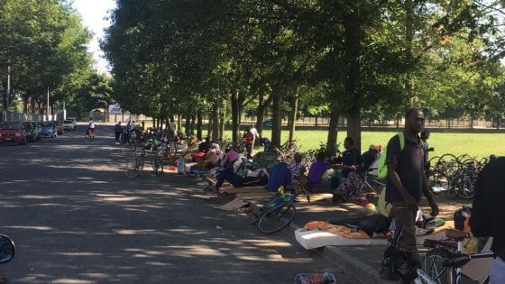

### AYS Daily Digest 14/06/2019: People are being moved to new “camp” in Vučjak, Bosnia
#### New testimony of brutality by Croatian police// Hundreds of seasonal workers exploited in Italian fields// 53 people still stranded off Italian shores// Cases of police violence at the French\-Italian border// Violent pushback from Bulgaria to Greece// First deportation from France to Eritrea// 50\+ people detained in Morocco// News from Malta, Italy, Switzerland, the UK…

[Are You Syrious?](https://medium.com/@AreYouSyrious)

Jun 15

Saluzzo\. Credit: Spazio Popolare Autogestito Gabrio
#### FEATURED STORIES

**Today, authorities at Una San canton, in Bosnia and Herzegovina, started moving people “residing in private accommodations” from Bihać to Vučjak** , a small town around 10 km from the main centre, in the middle of nowhere\.

Sources on the field confirmed that, just after a food distribution by the local volunteers yesterday evening, the police took all the people — except one group — to Vučjak area, where they had just started flattening the ground, clearing it in order to place temporary campsite\.

Ironically, the UN and IOM, who have been running the show in BiH until now, are against this solution\. As we reported earlier, the IOM had proposed building a new camp that would have all the standards etc\., which would be extremely costly, and very likely take at least months to be built\.

However, local authorities — in the midst of tourist season \(they are close to the Croatian National park, Plitvice Lakes, as well as the Bosnian National park on Una river\) — pretty much want to make those people to “disappear” from their city and daily lives\. As well as marginalising these communities in a despicable way, these authorities are ignoring the fact that forceful solutions never stopped migration; nor did the overwhelming aggression of the Croatian police; nor will their forced unfit “solution”\.

No international organisation is so far involved in assisting the people forcefully moved to Vučjak area\.

The UN has stated that:

> \[…\] we firmly believe that this location is entirely inadequate for the purpose of accommodating people there\. We call upon the authorities to immediately cease this relocation until a more suitable place is available\. The UN urges the authorities to allow migrants and refugees already relocated to “Vucjak” to return\. 

Vučjak is dangerous not only in terms of conditions of accommodation \(there is a severe lack of running water and electricity\) \. It is also located close to landmine infected areas, was there was previously a landfill\. They area is also at high risk of fires, due to the high concentration of methane gas underground\.

> The UN understands the concerns of the local population and the Una Sana Canton authorities regarding migrants and refugees residing outside of the four official reception centres in the Canton, especially those squatting in public spaces and empty houses, and the need for additional accommodation space\. The UN would like to emphasize, however, that such measures need to be taken with full respect of migrant and refugee rights under international and national law, including humanitarian standards for accommodation sites\. 

Read the full statement [here](http://ba.one.un.org/content/unct/bosnia_and_herzegovina/en/home/presscenter/un-country-team-in-bih--joint-statement-on-relocation-of-migrant.html?fbclid=IwAR0Elk5ULI5b6dG6_e8UA1r19nRR14NO_5PrbJ-d0dYPgrR96jR4kfKKN_k) \.

No surprise, then, that people who were moved during the day, started to walk back towards Bihać in the evening, as reported by [this source](http://www.rtvusk.ba/vijest/vucjak-vec-napustilo-50-ak-migranata-uputivsi-se-nazad-u-grad-bihac/30836?fbclid=IwAR265KqJp6dmussXR4rwBS-WTbmYBPCx7AwbDcolixPcGWYfbv_PUwLmFJM) and [this one](https://usn.co.ba/usn-novosti/bihac/policija-ne-dozvoljava-migrantima-da-se-vrate-u-bihac-foto/2019/150944/?fbclid=IwAR0S2C3aYm-alGJrphTktyPEuot_kPVmGJ9kMjs-2VKIV-G3UHDmKxC-7nM) \.

**A new testimony of Croatian police violence** has reached AYS, in addition to what we reported already in [Wednesday’s digest](https://medium.com/are-you-syrious/ays-daily-digest-12-06-2019-a-year-after-ports-closed-italy-passes-new-deadly-decree-dae50baa800b?fbclid=IwAR1e577KoxtOa7B1CHbL5BqMxLl7N3Yi-NCszzkgZmuqv56xHXnhe_wG3MA) \.

This recent testimony was taken by a volunteer on the ground and it perfectly describes the goose game people on the move are forced to “play” in an attempt to escape the Bosnian maze, where people are stuck, forced there by the negligence of European authorities\.

> Police don’t give water, don’t give food, don’t give anything, they just say “ok, go back to Sarajevo”, but then I go to Sarajevo and police there don’t take me, don’t take anybody, it doesn’t matter if I stay in Sarajevo or Bihać, I live in disguise\. 

The young man then proceeds to describe the violence inflicted on them by Croatian police, when trying to cross the border near Velika Kladuša\.

> When they catch you, they beat you a lot \[…\], I go in the jungle, on the way, maybe it’s Croatian military police, he put a gun on my head, he doesn’t say anything to me, nor listen, but he just says “can you speak English?” and if you say yes, he beats you and he doesn’t look where he hits, which body part, he hits you on your eyes, head, leg, foot\. He beat me a lot on my legs, on my arms\. It was me and 2 other friends and the Croatian police also beat my friends\. And then the police caught us and took us to the police station and then they beat us and don’t give anything, no water… 

He proceeds to recall an incident where children were thrown into the river\.

> It was midnight, in the night and they say “come out of the car \[police car\], one by one” and there were maybe 7–8 police agents and they have electric sticks and they put them maybe over your head, they did this to me, to all people, if you run away you’re safe, if you don’t run away, they beat you\. There was a river and the water is very dirty and they throw you in water \[…\] \. They also put children in the water, one of 7 years and one of 3 years, and two Pakistani guys took the children out of the water and save them and then ran away\. 

#### Saluzzo, Italy

This year is no different than the ones that have been before, for those field workers exploited in the agricultural sector\.

Dozens of men are reaching the area for the season, in the hopes of earning some money to send home, or to save for the low season ; they are sleeping on benches, under a makeshift shelter in an abandoned building, with no basic services at all\.

Repeatedly surveilled, racially profiled, woken up even 2 or 3 times per night just to be told to go away from the public squares, to hide somewhere where the average Italian would not see them — but to go where?

There is no place with enough capacity to host all the workers exploited in the fields, who are present in the territory\. This is even keeping in mind that the majority of these people have regular documentation, released by the Questura, that allows them not only to stay in the Italian territory, but also to have rights associated with it, such as the basic rights of having a roof over your head, a place to sleep, cook and take a shower\.

The only structure available for the workers, is the former barracks Filippi, which can host up to 368 people, but that would not be enough to accommodate all those who will come in the next weeks\. The previous squats and buildings, like Foro Boario, where people used to live, are now closed and sealed, empty for no apparent reason\.

Therefore, workers have to walk kilometres a day to ask for a daily employment in the fields, humbly asking how much their pay would be, a pay that can change every day, as can the possibility to get a job, and the chance to get hosted; yes, because this is the only possibility to sleep in an enclosed, “safe” space\.

**At the moment, the people present at Foro Boario, sleeping rough, number around 100 and are constantly increasing; some are with a contract; others are still waiting to be recruited by a “good employer”\. A modern slavery business\.**

Every night, the police come and take personal belongings, cardboards, blankets and even food\! In a ridiculous attempt to make the workers leave, and carrying on a clear abuse of power\. These workers are afraid to denounce the mistreatment, as they fear for their permit renewal\.

> There are a gas canister and a camping cooker, wet cardboards and few blankets…and we are told that the tarpaulin to find shelter from the rain has been confiscated by the police; but it is immediately clear that [just one wall is separating them from having an appropriate accommodation](https://www.facebook.com/spacciopopolareautogestitogabrio/posts/2138222342942711?hc_location=ufi) : the dormitory opened last year, called PAS: Prima Accoglienza Stagionale \[the fomer barracks Filippi\] \. 

In the building, there are big communal rooms with bunkbeds, 12 showers and a few cookers to prepare your meal\. Queues to cook or take a shower are extremely long\.

Freedom of movement is limited inside the structure as well, through the use of passes and schedules, organised by CGILFLAI \(a union for agricultural workers, oddly enough\) \.

Moreover, another clear abuse is represented by the fact that it is still unclear when the picking season is going to officially start, leaving hundreds of people in limbo\.

Donations of blankets, shoes \(42 \+ \), socks and towels are, therefore, extremely needed for workers in the area\.

Caritas is organising a [shop](https://www.facebook.com/SaluzzoMigrante/posts/1063902677150780?hc_location=ufi) , where people can receive clothes, shoes and other items; the shop is open every Wednesday from 10 to 12\.30\.

For more information, follow [Comitato Antirazzista Saluzzese](https://www.facebook.com/comitatoantirazzista.saluzzese/) and [Saluzzo Migrante](https://www.facebook.com/SaluzzoMigrante/) \.

Note that the exploitation is ongoing in other areas too, most notably San Ferdinando in Calabria and [San Severo](https://www.facebook.com/SaluzzoMigrante/posts/1059968014210913?hc_location=ufi) in Puglia\.
#### Greece

**Violent pushback from Bulgaria to Greece\.**

Twenty seven migrants crossing from Turkey to Bulgaria were violently beaten by border agents and pushed back to Greece, in the Evros region\. 

In video recordings taken of the event, there are visible signs of bumps on their backs, abrasions and blood in their hands, head and face\.

Police also robbed those attempting to cross of their money and valuable possessions, including shoes\. 

See original source [here](https://tvxs.gr/news/eyropi-eop/metanastes-kataggelloyn-agrio-ksylodarmo-apo-boylgaroys-synoriofylakes?utm_source=FacebookE&utm_campaign=userBaseE&utm_medium=294046&fbclid=IwAR0Gf07PyEHbVNWooTKo3oi0ap0978HxUhXxCPkR4zFzGl8tXBN5AJyuytQ) \.
#### SEA

Sea Watch 3 is still stranded off the Italian shores with 53 people on board\.

#### MOROCCO

In addition to daily detentions, authorities in Nador have [burnt down and destroyed personal possessions](https://www.facebook.com/AmdhNador/posts/2351036875108574?hc_location=ufi) of unaccompanied minors and young migrants on the move\.
#### MALTA

Malta will create a “special unit” to fight illegal exploitation of workers in the territory, but, [as reported](https://www.infomigrants.net/en/post/17525/malta-creates-unit-to-control-undocumented-workers) , the task force will mainly be in charge of controlling residency and working permits\.

> Officials working for the special unit against illegal immigration will be able to inspect sites where migrants might work, study or live \(including schools and private education centers\) without a warning\. These random inspections will be carried out with the assistance of police\. 

> Attempts to hinder these inspections or providing false information can be punished with fines of up to 5,000 euros and up to six months in jail\. 

#### GREECE

■■■■■■■■■■■■■■ 
> **[Mare Liberum e.V.](https://twitter.com/teammareliberum) @ Twitter Says:** 

> > Asylum seekers regularly spend 2-3 years in inhumane camps on the Greek islands before getting an interview for their asylum application.  #safepassage https://t.co/6Bcohn2wRv 

> **Tweeted at [2019-06-14 15:46:16](https://twitter.com/teammareliberum/status/1139559688402550789).** 

■■■■■■■■■■■■■■ 

#### ITALY

_Ventimiglia_

Testimonies of police violence\.

From Monday 10/06, [Caritas Intemelia](https://www.facebook.com/caritasventimiglia/posts/2674274009267408?hc_location=ufi) extended their opening hours for the support service they offer\. The programme is for migrants with regular permits, who have been excluded from the reception network due to the effects of the Salvini Decree\.

_Converted [Medium Post](https://medium.com/are-you-syrious/ays-daily-digest-14-06-2019-people-are-being-moved-to-new-camp-in-vu%C4%8Djak-bosnia-d6b5bfad5ecd) by [ZMediumToMarkdown](https://github.com/ZhgChgLi/ZMediumToMarkdown)._
