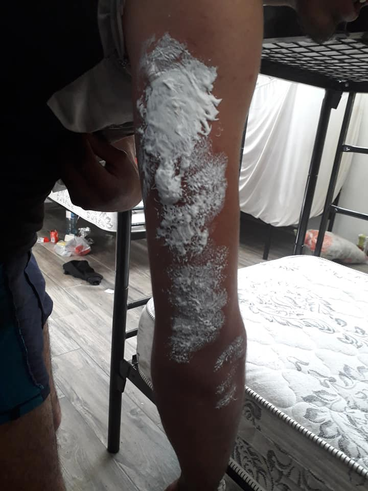
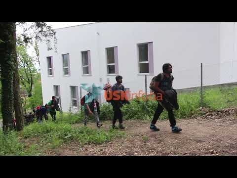
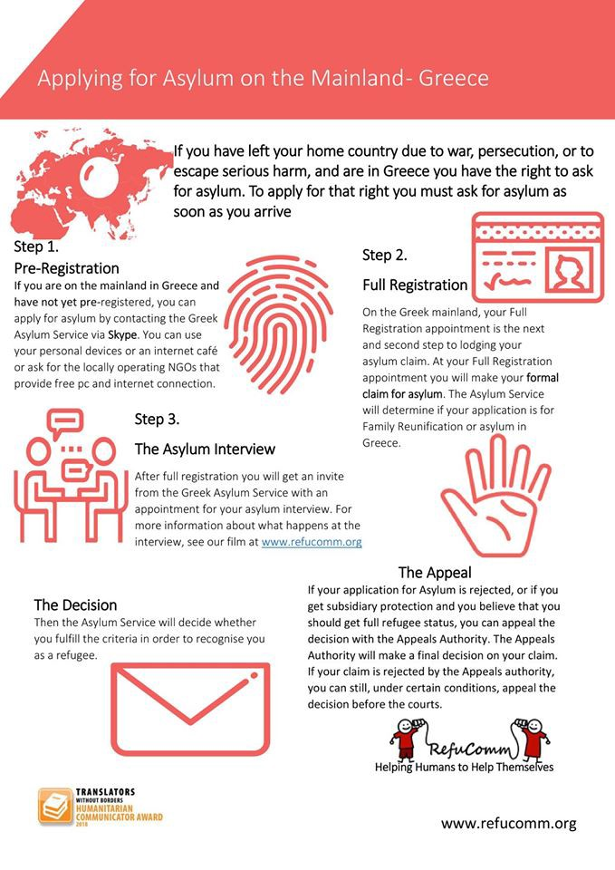
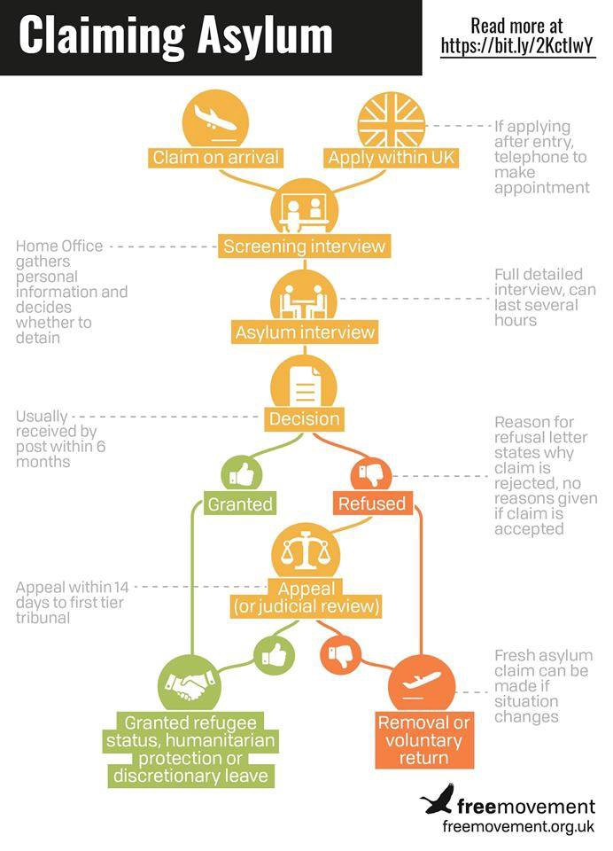

### AYS Daily Digest 17/06/19: Postcards of desperate conditions in Montenegro and Bosnia
#### Lebanese government moving Syrian refugees to a new area with no services//More deaths in the Aegean Sea//Message from Hermann on board the Sea Watch//Deportation of Afghan family from Norway//…

Warning signs in the area around Plješivica mountain, where people pass through on their way towards Croatia\. Near the ridge there is a hazardous area due to possible mine fields, these days used for expanding the criminal activities of smugglers posing as mine field guides\. \(Photo: AYS\)
#### FEATURED

> This is S\. , 23 years old from Iraq\. We met him in the camp here in Podgorica\. S\. has been fleeing since about five years ago\.
 

> This week, he decided to have another try to reach Europe\. S\. had already tried four times to reach Bosnia on foot and got illgealy pushed back by the Bosnian police each time\. He decided to try again and to hide in the baggage compartment of a coach leaving from Montenegro for Croatia\. 
 

> As you can imagine, the baggage compartment is not a safe place, especially not for a human being, and as expected, S\. got seriously injured\. He sustained several severe burns on his arms and legs\. Back in the camp, there was no doctor available and the security also refused to take him to a hospital\. With some help from friends in the camp, he was able to see a doctor the next day, only to get some creams\. We are of the opinion that this is not acceptable and at least basic medical care has to be available\. 

 \.](assets/9f11b8da4175/1*uIXlW7uvwchKyesQc0Gmlg.jpeg)

Credit: Aldar Aldar in [refugee organization in Montenegro](https://www.facebook.com/groups/1157824667713728/permalink/1195137637315764/) \.

Another [young man from Morocco broke his leg](https://www.facebook.com/groups/1157824667713728/permalink/1195359863960208/?hc_location=ufi) while trying to cross the border between Albania and Montenegro in order to reach Europe\.

> He broke his leg when he fell due to the dangerous route through the forest, on mountainous and uneven terrain in the dark and on a cold night\. It was only an unexpected blessing in disguise that he made it to the city and was found by a friendly police officer who was willing to help him and brought him to hospital, where he got basic medial care\. 

As we reported also in yesterday’s digest, [police is now raiding local houses where migrants could be hosted](https://balkaninsight.com/2019/06/17/bosnia-police-search-homes-for-migrants-refugees/?fbclid=IwAR34s8Vy8rJoqazqSF2sCjKpljmfrlX46AheoM_Ut26lvTslySYwH7ckkjM) , mainly in the areas around Bihać and Velika Kladuša\.

> During the police search of one house, police said they found 130 people, mostly elderly and without any identification documents \[…\] Another 150 located in private houses have also been transferred to the tents at Vučjak\. 

Also, after storming a house in which about 80 people were staying, the police continued chasing the people who tried to flee towards Borići, as the local media reported\. Some have reportedly [willingly approached](https://youtu.be/FQERxVtilPA) the police forces in Bihać to be taken away\.

These people’s free movement has been restricted, they are given no options apart from being taken to the “camp” in Vučjak, in reality several tents and a place in the middle of nowhere that provides absolutely no conditions for a person to stay there for longer than a day, with no medical support, no ability to freely move, to reach any facility, shop or even a place where one could sit on a chair at least, with multiple security hazards etc\.

 \(the largest underground airbase in the SFRY\), located inside Plješevica \(Photo: AYS\)](assets/9f11b8da4175/1*zaPpbywbxXPKjPB0nJoM0Q.jpeg)

Plješivica from the Bosnian side as seen from [Željava Air Base](https://en.wikipedia.org/wiki/%C5%BDeljava_Air_Base) \(the largest underground airbase in the SFRY\), located inside Plješevica \(Photo: AYS\)

The area is also known for mine fields and people are now paying extra to the so called “guides” through the mine fields who provide them with a map and lead them through the [Plješivica](https://www.dangerousroads.org/eastern-europe/bosnia/6487-gola-pljesevica.html) area\. The area is also known for the wildlife whose habitat is the entire region, throughout Gorski kotar, and [bears were seen just a few days ago in the proximity\.](https://www.facebook.com/FederalnaUpravaCivilneZastite/videos/413580089227876/?t=6)

The UN IGOs don’t support this project and are therefore not available for support in that area, but the people wouldn’t have been searching for alternative solutions had they fought to provide suitable accommodation with enough capacity in the first place, so this growing disaster is the responsibility of all of us\.
#### LEBANON

The Lebanese government has transferred people from the “Caritas” Syrian refugee camp in Deir al\-Ahmar to the outskirts of Maqne, a town in the Baalbek governorate\. They are faced with a total absence of services such as electricity, water, and sanitation in their new camp, which is several kilometers away from the nearest market\.

> In order to buy bread from outside the camp, “it will take twenty minutes if you are taking private transport\.” 

Apart from the security threats, the area is located along a smuggling route, something which frightens the residents\.

> Despite verbal commitments from UNHCR representatives to give basic support to the refugees in the new camp, there still has not been “any UNHCR activity in the camp\.” 

Without any assistance from the NGOs, people in the camp now depend on the camp’s “supervisor” \( _Shaweesh_ \), who [reportedly](https://syriadirect.org/news/syrian-refugees-relocated-to-%E2%80%9Cmiserable-campsite%E2%80%9D-following-dispute-with-lebanese-civil-defence-2/?utm_source=ECRE+Newsletters&utm_campaign=c30852ef64-EMAIL_CAMPAIGN_2019_06_17_12_10&utm_medium=email&utm_term=0_3ec9497afd-c30852ef64-422316653&fbclid=IwAR3XsANmAbB6C4JVrohPLJov133qkucpe2FhGgaGfZL5Itx2WFi_9MY2eDA) employs a number of residents in agriculture or workshops, and helps facilitate necessary activities, such as transport, for a fee\.

Read the full story [here](https://syriadirect.org/news/syrian-refugees-relocated-to-%E2%80%9Cmiserable-campsite%E2%80%9D-following-dispute-with-lebanese-civil-defence-2/?utm_source=ECRE+Newsletters&utm_campaign=c30852ef64-EMAIL_CAMPAIGN_2019_06_17_12_10&utm_medium=email&utm_term=0_3ec9497afd-c30852ef64-422316653&fbclid=IwAR3XsANmAbB6C4JVrohPLJov133qkucpe2FhGgaGfZL5Itx2WFi_9MY2eDA) \.
#### TURKEY

A boat capsized off the Turkish coast this morning\. Twelve people are reported dead, among them three children, while 31 were rescued\. Specific details on the people who lost their lives are still unknown\. What is certain is that they were not wearing life jackets and that they paid 5000 euros each for the journey\.

#### SEA

“ _I would rather give my life to the fishes than be tortured again_ ”\.

“ _We have the right to freedom too, like others_ ”\.

A total of [75 people are still stranded off the Tunisian coast](https://www.facebook.com/watchthemed.alarmphone/photos/a.1526182797655958/2390353414572221/?type=3&theater) , half of them minors, after 15 days from their rescue\. Most of them come from Bangladesh and fear being deported back to their country of origin\.
#### GREECE

A total of [45 people arrived](https://www.facebook.com/AegeanBoatReport/posts/595236437666131?hc_location=ufi) on the Greek islands today\.

Infographic on the asylum procedure, published by RefuComm\. Credit: RefuComm\.

Mobile Info Team has published [information on how it is possible to report pushbacks](https://www.facebook.com/mobileinfoteam/photos/a.1800063030222418/2457568804471834/?type=3&theater) from Greece to Turkey\.
#### NORWAY

Eshan Abbasi \(16\), his sister Taibeh \(20\) and brother Yasin \(22\) were deported on Saturday to Istanbul, as a first stop before being definitely deported back to Afghanistan, a country they have no common history with\.

The mother of the three children was supposed to be deported too, but, due to her health condition, is supposed to return to Norway from Istanbul, leaving her three children alone, one of them still a minor\.

Amnesty International is following the case and stated that:

> Uprooting these three young siblings from the communities where they have lived for more than seven years and deporting them alone to a warzone is an unconscionable abuse of power\. 

Since Saturday, the family has not been allowed to communicate with external channels and are to be escorted by 10 Norwegian immigration police officers to Kabul\.

Norway has been defending the decision, stating that Afghanistan is a safe country\.

> Norway appears to deport more Afghans than almost any other European country — not just in proportion to its population, but in sheer total numbers\. According to the Afghan authorities, 32% \(97 out of 304 people\) of forcible returns from Europe in the first four months of 2017 came from Norway\. 

See more on the Amnesty campaign [here](https://www.amnesty.org/en/latest/news/2019/06/norway-stop-the-deportation-of-three-young-unaccompanied-siblings-to-afghanistan/?utm_source=FBPAGE-IS&utm_medium=social&utm_content=2409275822&utm_campaign=Amnesty&utm_term=News&fbclid=IwAR1exTSGe0Ul94mD5I2OlODayTVGybKMVLD6aLLO6hMeW_J4K1WR2Y4Ig0A) \.
#### UK

Credit: Freemovement\.

Under this [link](https://www.refugeesupportnetwork.org/resources/11-university-scholarships-for-asylum-seekers?fbclid=IwAR3p7riN13Sw-zNlH-S7mh_Sivnx1wHwWsQznGKD05eZ0ZIPQpje1-Ssl3w) , you can find different scholarship possibilities for asylum seekers\.
#### DEPORTATIONS

#### AYS and the Daily News Digest — how to get involved?

**We strive to echo correct news from the ground through collaboration and fairness\. Every effort has been made to credit organisations and individuals with regard to the supply of information, video, and photo material \(in cases where the source wanted to be accredited\) \. Please notify us regarding corrections\.**

**Apart from daily news in English, we also publish weekly summaries in Arabic and Persian\. Find specials in both languages on our medium site\.**

**If there’s anything you want to share or comment, contact us through Facebook, Twitter or write to: areyousyrious@gmail\.com\.**

**We’re open to expanding our team of volunteer researchers, editors, and info gatherers\. Get in touch\!**

_Converted [Medium Post](https://medium.com/are-you-syrious/ays-daily-digest-17-06-19-postcards-of-desperate-conditions-in-montenegro-and-bosnia-9f11b8da4175) by [ZMediumToMarkdown](https://github.com/ZhgChgLi/ZMediumToMarkdown)._
