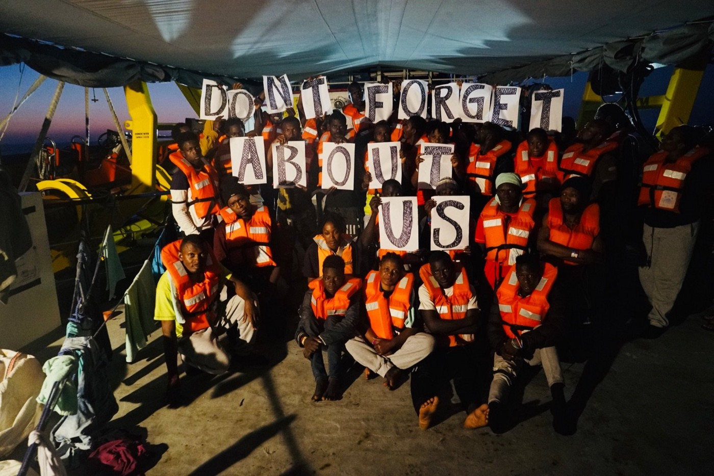
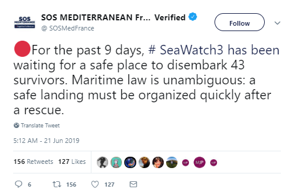

### AYS Daily Digest 21/06/2019: Greek Reception is a ‘Structural Failure’
#### Video report from Libyan Detention Centres// 43 people still stuck on board Sea\-Watch 3// Austria increasing immigration detention// Evictions in France// Arrests in Brussels

Photo by Sea\-Watch International

Feature

A study by RSA has described the Greek reception system as a structural failure that does not provide sustainable solutions\.

■■■■■■■■■■■■■■ 
> **[RSA](https://twitter.com/rspaegean) @ Twitter Says:** 

> > The failure of the Managing Authority in planning long-term solutions according to the needs of the reception system is mostly portrayed in the under-performance of the funds in supporting grass-route organizations that run unaccompanied minors’ shelters
[rsaegean.org/en/why-greece%…](https://rsaegean.org/en/why-greece%CE%84s-reception-systems-failed-to-provide-durable-solutions/) 

> **Tweeted at [2019-06-21 14:10:56](https://twitter.com/rspaegean/status/1142072413850669056).** 

■■■■■■■■■■■■■■ 

While reception center conditions vary significantly from place to place, this demonstrates that serious reception decisions have been made using a patchwork approach that has been unclear and unsystematized\.

> On June 6th 2019, there were [16,108 refugees,](http://mindigital.gr/index.php/%CF%80%CF%81%CE%BF%CF%83%CF%86%CF%85%CE%B3%CE%B9%CE%BA%CF%8C-%CE%B6%CE%AE%CF%84%CE%B7%CE%BC%CE%B1-refugee-crisis/3984-apotyposi-tis-ethnikis-eikonas-katastasis-gia-to-prosfygiko-metanasteftiko-zitima-tin-5-6-2019) asylum\-seekers and migrants stranded on the Greek islands of Samos, Chios, Lesvos, Leros and Kos\. Out of those, 12,628 lived in the hot\-spots while the capacity of these centres was for 6,438… Meanwhile, an estimated 16,457 refugees, asylum\-seekers and migrants were living in 25 refugee camps in Greece’s mainland\. 

■■■■■■■■■■■■■■ 
> **[RSA](https://twitter.com/rspaegean) @ Twitter Says:** 

> > In #Moria hotspot where refugees have to queue for hours under the hot sun for a meal, a woman from Afganistan is making bread. "I am searching the normality that i cant find here", she says. #RefugeesGr #Stopthetoxicdeal https://t.co/ZhMo3ddc5x 

> **Tweeted at [2019-06-21 15:30:15](https://twitter.com/rspaegean/status/1142092372450451457).** 

■■■■■■■■■■■■■■ 

The study concludes that Greece’s reception system has been constantly focused on urgent needs, rather than providing long term solutions\. The authorities continue to operate as if they are dealing with an ‘emergency’ situation that needs a bandaid solution\.

> Refugee Support Aegean \(RSA\) and PRO ASYL have studied and analyzed three key elements of the reception system in order to produce a narrative on why state interventions, co\-planned and subsidized by the EU, have not managed to produce long term sustainable solutions\. 

Issues with the reception system outlined in the study are summarised below:
1. **Funding management by the National Authority**

_The failure of the Managing Authority in planning long\-term solutions according to the needs of the reception system is mostly portrayed in the under\-performance of the funds in supporting grassroots organizations that run unaccompanied minors’ shelters\._

**2\. The PHILOS project**

This project was designed to provide a comprehensive emergency health response while supporting Greece’s Public Health System structures\.

However _… From early on the project’s capacity in deploying personnel has been seriously hampered mostly by the unattractive compensation scheme KEELPNO was able to offer to doctors and nurses, as well as auxiliary staff due to financial as well as bureaucratic constraints\._

**3\. Philoxenia: Winterisation project**

Lack of plans for winterisations for the hot\-spots in Greece and especially the Greek islands have had tragic consequences\. In the winter of 2016–2017, seven people on Lesvos lost their lives while dealing with the cold weather in Moria hotspot\.

Philoxenia was an ad hoc project designed to evacuate thousands of people out of hotspots and into accommodation centres created in hotels and apartment buildings across mainland Greece\.

However… _Come winter 2018, the situation was again the same\. No consistent plans for winterisation had matured while a number of hot\-spots on Greek islands were operating way over their capacity\. In September 2018, Samos hot\-spot near Vathy town was hosting regularly over 4000 people which was about six times its capacity\._
#### GENERAL:

This is a link to a [Pushback Map\.](https://pushbackmap.org/?fbclid=IwAR0E_YBoOfquXht47WbckF5SgMrH18oCJjC57g7LohLdyzG_mpuyAIWU3eM)

While this is a link to the latest R [efugee Deaths List](http://www.unitedagainstracism.org/wp-content/uploads/2017/06/ListofDeathsActual.pdf) compiled by United against Racism\.
#### LIBYA:

> [Video stories of people stuck in Libya](https://www.itv.com/news/2019-06-11/harrowing-tales-tell-story-of-migrants-desperate-to-reach-europe-from-libya/) \.
 

> “We almost died,” recounts one Nigeria\-born woman, trapped in a Libyan migrant camp after a failed attempt to cross the Mediterranean to Italy\. 

#### SEA:

[It has been eight days](https://www.acnur.org/es-es/noticias/press/2019/6/5d0c0e324/acnur-hace-un-llamado-a-europa-para-que-permita-el-desembarque-de-los-pasajeros.html) since a group of 43 people who were rescued from a shipwreck have been stranded on board Sea Watch 3 unable to disembark\. So far just ten people have been evacuated from the boat for medical reasons\. Onboard remain 3 unaccompanied minors\.

UNHCR and IOM have called for the urgent disembarkation of the 43 passengers in Lampedusa\.

However, in recent days, the Sea\-Watch 3 had been invited only to bring migrants to Tripoli, Libya\. The situation in Libya remains very unstable and extremely dangerous, and it cannot be considered a safe port\.

A group of protestors slept in front of the churchyard of the San Geraldo di Lampedusa Parish demanding the disembarkation of the 43 survivors in Italy\.

■■■■■■■■■■■■■■ 
> **[Sea-Watch International](https://twitter.com/seawatch_intl) @ Twitter Says:** 

> > Good morning everyone, but in particular to those who slept in the churchyard of the San Gerlando di Lampedusa Parish […] to ask the disembarkation of the 43 shipwrecked aboard #Seawatch3. You are not alone.
[twitter.com/RescueMed/stat…](https://twitter.com/RescueMed/status/1141942508580216838) 

> **Tweeted at [2019-06-21 10:30:53](https://twitter.com/seawatch_intl/status/1142017035938992129).** 

■■■■■■■■■■■■■■ 

Meanwhile, an investigation into the detention of people on Sea Watch 3 which was eventually allowed to disembark in Catania in January — against the wishes of Matteo Salvini — has been opened by the Rome Public Prosecutors office\.
#### GREECE

Two boats have arrived on Chios carrying 84 people\. 36 children are amongst them\. One boat has also arrived on Lesvos carrying 27 people\.
#### SERBIA

#### ITALY

Activists supporting for the right to migration met with the mayor of Naples who declared solidarity with sea rescue\.

■■■■■■■■■■■■■■ 
> **[Alarm Phone](https://twitter.com/alarm_phone) @ Twitter Says:** 

> > From the Sea to the Cities! Many who fight for the right to #migration &amp; against death at sea met in #Italy &amp; met the mayor of #Naples @demtagistris who declared his #solidarity with sea rescue! @[_Seebruecke_](https://twitter.com/_Seebruecke_) @[jugendrettet](https://twitter.com/jugendrettet) @[MSF_Sea](https://twitter.com/MSF_Sea) @[seawatchcrew](https://twitter.com/seawatchcrew) @[SOSMedIntl](https://twitter.com/SOSMedIntl) @[w2eu](https://twitter.com/w2eu) @[BorderlineEurop](https://twitter.com/BorderlineEurop) https://t.co/gtsCtqq6Js 

> **Tweeted at [2019-06-21 14:23:10](https://twitter.com/alarm_phone/status/1142075492578861056).** 

■■■■■■■■■■■■■■ 

#### AUSTRIA

According to ECRE, the latest statistics show that Austria is increasingly detaining refugees and using immigration detention\. This information was obtained from the Federal Ministry of Interior\. In 2018 5,242 people were detained, while in 2017 4,962 people were detained\.

> In the last four years, detention cases before the Court have grown exponentially from 596 in 2015 to 1,873 in 2018 of which detention was upheld in 1,075\. The BVwG found that 23\.8% of the detention orders issued in 2018 by the BFA were unlawful\. 

#### FRANCE

[8 families of approximately 40 people \(26 children\)](https://www.facebook.com/TeleiaLuttes/photos/a.1188042674706645/1196006500576929/?type=3&theater) face eviction from a reception centre in France after a notice was issued to them\. The families are being evicted based on the idea of ‘welcoming other people who are in dramatic situations\.’

A collective of teachers, parents of students and human rights activists has formed and launched an online petition reception, family regulation and schooling for the youth of each person\. [Please follow this link to the petition\.](https://www.change.org/p/pr%C3%A9fecture-des-landes-accueil-scolarisation-des-jeunes-titres-de-s%C3%A9jour-pour-les-familles-du-cada-m-de-marsan-6fa05677-1ab1-422e-b72e-51c4f6b67aad?recruiter=452944042&utm_source=share_petition&utm_medium=facebook&utm_campaign=psf_combo_share_abi&utm_term=share_petition&recruited_by_id=4e29d940-1eb8-11e6-bb7a-cb42df7e69c4&share_bandit_exp=abi-16190623-fr-FR&share_bandit_var=v1&utm_content=fht-16190623-fr-fr%3Av2&fbclid=IwAR31et6DzWTx7Pc9VVO7rpq1Q-B4vICBXuT3ueH1BtINDg6Gv567uRScbsI)

> Following our duty to protect children, we are committed to doing our best to ensure the sustainability of their education, as well as their safety and that of their families\.We demand a quick and effective response to the emergency as soon as possible\. 

**A mobilization against this eviction is scheduled tonight at 21:00, place de la town hall in Mont de Marsan\.**

Another solidarity concert will be held at 17:00 in solidarity with all seeking asylum and all showing compassion to impacted groups in France\. [Please follow this link to find out more\.](https://www.facebook.com/events/2373538586264951/)

> Let’s meet on Sunday to celebrate solidarity together, claim the right to help without being worried\. The right to eat and live for all\! 

Minors on the street of Rennes are increasingly being refused services by child welfare\. Solidarity from the public is requested to provide them shelter and safety\. [To find out more please follow this link\.](https://www.facebook.com/utopia56Rennes/posts/1329771523840792?hc_location=ufi)

> Today, we accompany five 16\-year\-old boys and girls who have been released from the street because they were declared adults by the child welfare service, and we are still waiting for more to be put on the street in the coming weeks\.
 

> We have no solution to offer them and we will have to resign ourselves to leaving them outside\. Their age does not even allow them to access 115\.
 

> If you do not want to see them sleep outside Rennes, and you have a small place at home, do not hesitate\! 

#### BELGIUM

16,000 people were targeted in a large raid in Belgium train station Mechelen\. 30 people were arrested, with alleged links to people smuggling\.
#### AYS and the Daily News Digest — how to get involved?

**We strive to echo correct news from the ground through collaboration and fairness\. Every effort has been made to credit organisations and individuals with regard to the supply of information, video, and photo material \(in cases where the source wanted to be accredited\) \. Please notify us regarding corrections\.**

**Apart from daily news in English, we also publish weekly summaries in Arabic and Persian\. Find specials in both languages on our medium site\.**

**If there’s anything you want to share or comment, contact us through Facebook, Twitter or write to: areyousyrious@gmail\.com\.**

**We’re open to expanding our team of volunteer researchers, editors, and info gatherers\. Get in touch\!**

_Converted [Medium Post](https://medium.com/are-you-syrious/ays-daily-digest-21-06-2019-greek-reception-is-a-structural-failure-b90571f1384b) by [ZMediumToMarkdown](https://github.com/ZhgChgLi/ZMediumToMarkdown)._
