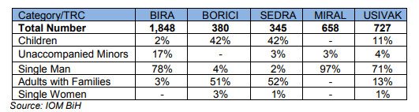
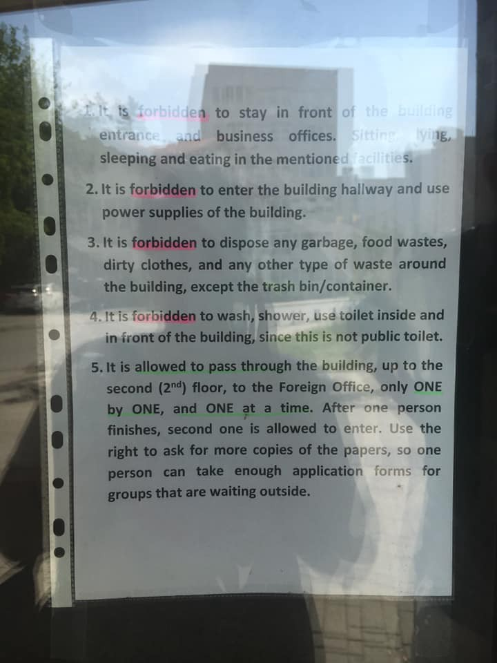
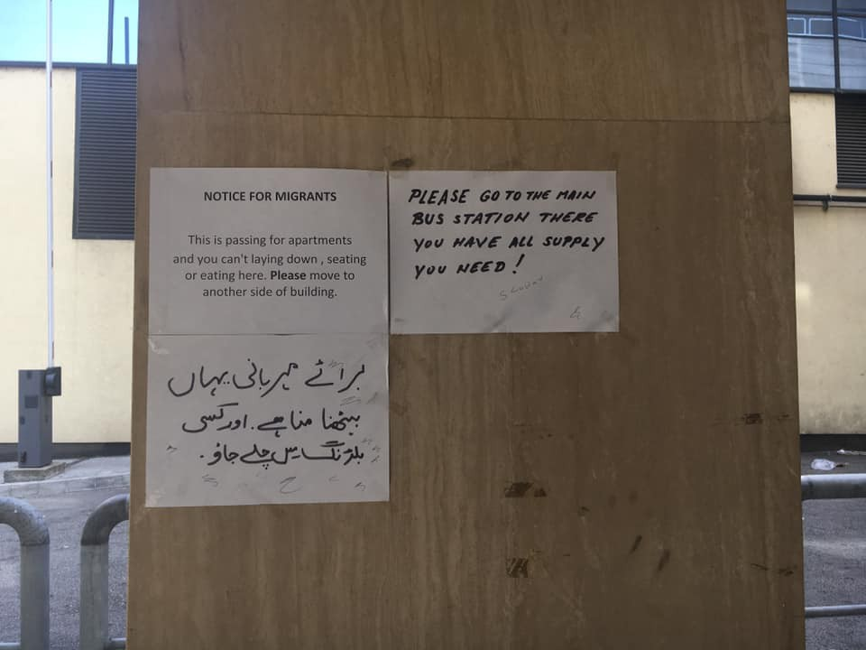
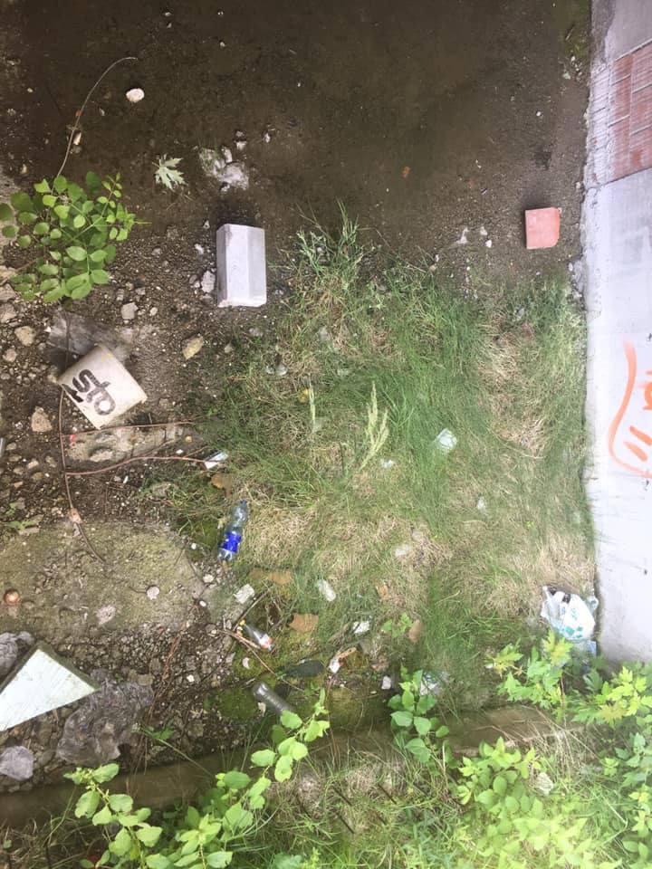
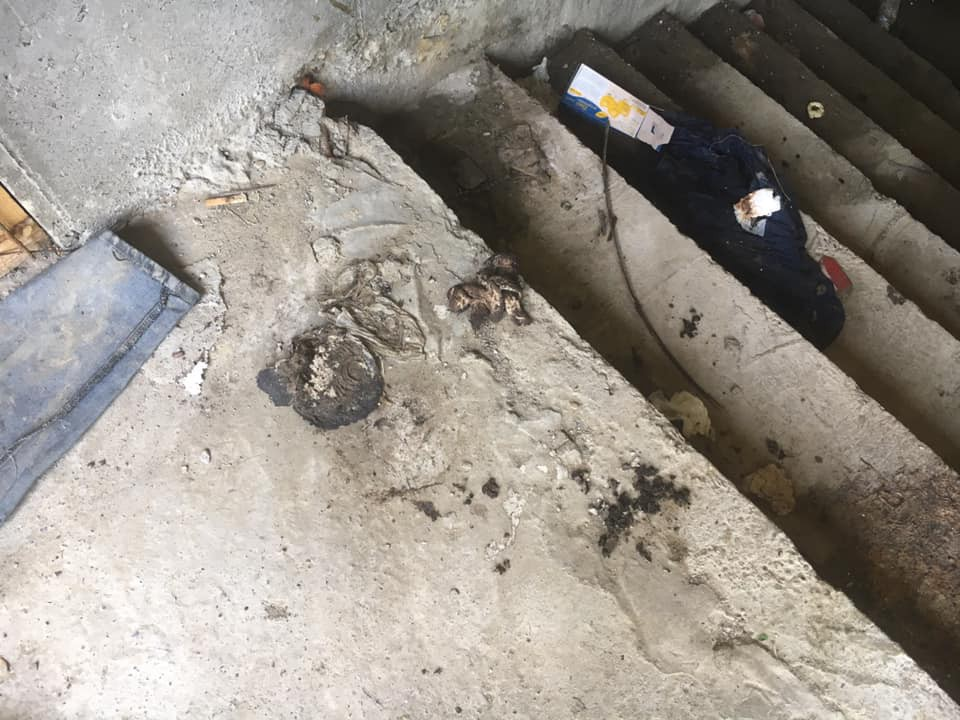
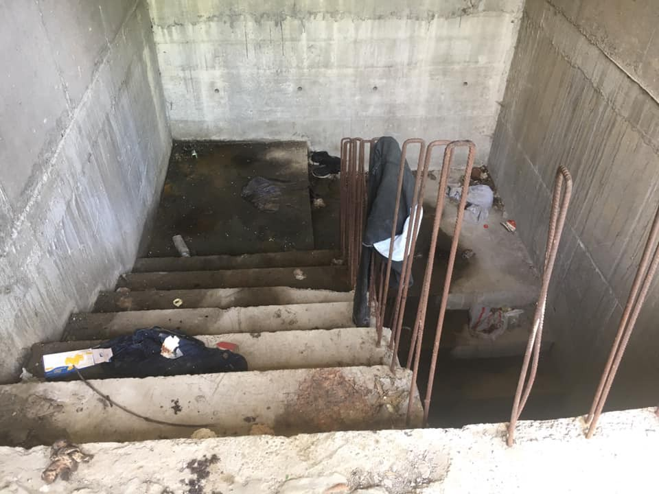
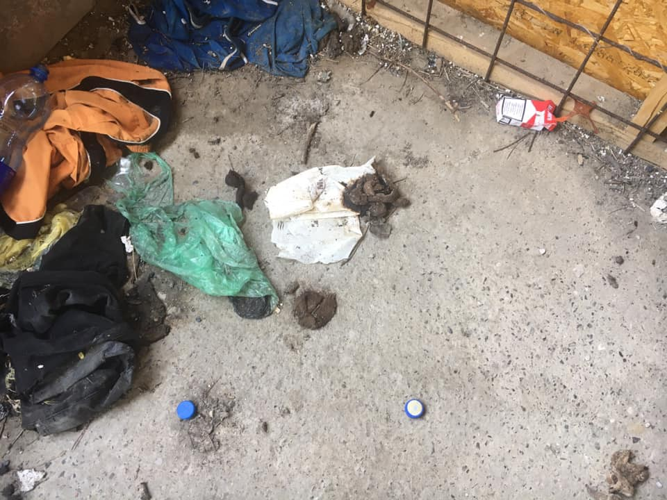

### AYS Weekend Digest 22–23/06/2019 Slovenian authorities publish country’s first strategy on migration

Libya: protests and new reports from migrant detention centres /// BiH: 1 week since the opening of Vucjak /// Western Med: 280 people rescued from 8 dinghies /// Italy: the price of 1 year of closed ports /// Malta: 37 people rescued /// more…

 the last days\. **It draws the border between Italian territorial water and international water\. Can you see it?** 42 people are forcibly kept outside\. 42 people that Europe, a continent of over 500 million inhabitants, does not want\. **Forty\-two** \.](assets/861bbc0f23dc/1*a6bphCwGpGJIHocmhEtrYg.jpeg)

Sea watch is now at its 10th day stranded in the central med — This is the track of the [SeaWatch 3](https://twitter.com/seawatch_intl/status/1142855755579703296) the last days\. **It draws the border between Italian territorial water and international water\. Can you see it?** 42 people are forcibly kept outside\. 42 people that Europe, a continent of over 500 million inhabitants, does not want\. **Forty\-two** \.

FEATURE STORY — SLOVENIA’S FIRST STRATEGY ON MIGRATION

Recently, an interdepartmental working group composed of various ministries, police, the intelligence and security agency, the government office for the support and integration of migrants and others presented Slovenia’s first strategy for migration in the history of the country\. Although the initiative was welcomed by civil society, many also expressed disagreement with the procedure as well as with the content of the strategy\.

Not only was the strategy done in a rush; the coordination of the process was left to the Ministry of the Interior \(instead of, for example, the Prime Minister’s cabinet\) \. This has been visibly reflected in the content of the document, where two out of six sections were prepared by the police, largely focusing on ‘illegal migration and deportation’ and ‘security’\. Although regular migration \(particularly migrant workers\) represents the highest percentage of migration to Slovenia \(at the end of December 2018, a total of 176,000 foreigners had a valid residence permit\) only one section, titled ‘legal migration’, deals with this field\. Three other sections include international protection, integration and the international framework of migration\.

NGOs have called upon the prime minister to take over the coordinating role and to extend the deadline for the preparation of the strategy, underlining the need for other entities, such as NGOs and researchers, to be included in the process\. Nevertheless, the strategy was made public at the beginning of June, leaving only 15 days open for comments\.

The security focus of the strategy is also reflected in the terminology of the document, which distinguishes between regular and illegal migration, using illegal and irregular migration interchangeably\. NGOs have underlined the importance of consistent and adequate terminology in order to prevent the dangerous criminalisation and marginalisation of migrants, suggesting the use of the terms regular and irregular migration\. Furthermore, the document regularly refers to “abuse of the asylum procedure”, a term which is not legally defined nor statistically controlled, making it impossible for the ministry to monitor it\. In order to prove that an individual or a group are abusing the system, unambiguous and measurable data is needed, otherwise room is left for interpretation and manipulation\. The same goes for the term ‘abuse in the issuance of residence permits through the family reunification process or the use of social transfers’ as used in relation to regular migration\. This has never been monitored, researched or statically controlled and its only purpose is to legitimise the shrinking of migrant’s social rights\.

The strategy also fails to address the link between regular and irregular migration in dealing with Slovenia’s trend of population decline\. While the statistical data presented in the strategy shows the need for increasing migration to the country, the document does not recognise the value of asylum seekers and those coming to the country through irregular ways\. Instead, a large amount of financial resources is used to prevent those flows; and additional financial resources are used for encouraging migration, such as for example making the country attractive for Slovenian emigrants abroad\.

There are several other issues which should have been more adequately addressed in the strategy, from the process of integration to the rights of unaccompanied minors, the length of the asylum procedure and human trafficking\. While the strategy remains open for comments till the end of June, it is very unlikely any fundamental changes can be made to its content, although this represents an important document which will pave the way for Slovenia’s future migration policies\.

This is happening at a time when Italian Interior Minister Salvini [announced](https://english.sta.si/2651091/slovenia-and-italy-to-launch-mixed-border-patrols-on-1-july) that an agreement has been signed between the Italian and Slovenian police to increase border security at the frontier between the two countries\. Joint patrols should start on July 1st\. The Slovenian general police administration stated that the start date is yet to be confirmed\.

LIBYA
#### Protests and cries for help from Libyan detention centres

For World Refugee Day, people detained in the Abu Salim migrant detention centre staged a protest\.

 / [Sally Hayden](https://twitter.com/sallyhayd/status/1142397741131337728) \)](assets/861bbc0f23dc/1*kDCLb4v6Mze5md7gwzOjbg.jpeg)

World Refugee Day: Protests in Abu Salim detetion centre \( [Giulia Tranchina](https://www.facebook.com/rastajuly/posts/10156740622943621) / [Sally Hayden](https://twitter.com/sallyhayd/status/1142397741131337728) \)

They are scared as the centre is situated very close to the fighting lines\.

> There are c\.615 people in Abu Salim, including minors\. They say they’re not getting food & need protection\. They regularly hear fighting nearby: “big sounds of heavy weapons\.” _\( [Sally Hayden](https://twitter.com/sallyhayd/status/1142396822687834112) \)_ 

Also at least 40 of them are sick and are not receiving adequate care\. [UNHCR has not visited the camp for months\. Only MSF continue their activities in the camp](https://www.facebook.com/rastajuly/posts/10156740622943621) \.

MSF also published a recent [report on the Zintan and Gharian detention centres](https://www.msf.org.uk/article/msf-team-finds-catastrophic-medical-situation-libya%E2%80%99s-zintan-and-gharyan-detention-centres) , to which they were recently granted access\. They found a “catastrophic medical situation among the people detained”\. A number of people were immediately referred to hospital structures for lifesaving treatments\.

> Hundreds of people in need of international protection and registered with UNHCR as asylum seekers or refugees have been left stranded in Zintan and Gharyan detention centres for months — and in some cases years — with virtually no assistance\. 

Some 900 people are detained in Zintan, “700 of them in an overcrowded hangar with four barely functioning toilets, no shower and only sporadic access to water, which was not suitable for drinking”\.

In the Gharian centre, located on the frontline of the conflict, there are 29 detainees in a particularly hazardous situation\. “The area can be inaccessible to ambulances because of the fighting, making it difficult to organise life\-saving referrals to hospital when needed”\.

SEA
#### Busy weekend on the Western Mediterranean

■■■■■■■■■■■■■■ 
> **[Europa Press](https://twitter.com/europapress) @ Twitter Says:** 

> > Unas 280 personas han sido rescatadas en todo el fin de semana de ocho pateras que navegaban por aguas del Estrecho de Gibraltar y del Mar de Alborán [europapress.es/andalucia/alme…](https://www.europapress.es/andalucia/almeria-00350/noticia-rescatan-78-personas-tres-pateras-avisos-pescadores-mar-alboran-20190623180616.html) 

> **Tweeted at [2019-06-23 18:07:45](https://twitter.com/europapress/status/1142856783154864130).** 

■■■■■■■■■■■■■■ 

MALTA

A total of 37 people were [rescued](https://twitter.com/UNHCRMalta/status/1142775711507394560) off the coast of Malta and disembarked safely on Sunday\.

ITALY
#### The price of the Porti Chiusi policy

MSF reminds Italian and European citizens of the cost [of the criminal policy](https://www.medicisenzafrontiere.it/news-e-storie/news/un-anno-dopo-valencia-le-politiche-europee-continuano-a-causare-morti-in-mare/) that bans rescue ships from disembarking in Italian harbours\.

In one year of Porti Chiusi, a total of 1,151 people have died, and more than 10,000 were forcibly returned to Libya, where they are exposed to further violence\.

BOSNIA AND HERZEGOVINA

The International Federation of the Red Cross and Red Crescent Societies \(IFRC\) published an information bulletin on the situation in BiH since the beginning of the year\.

> In the first half of 2019, the number of migrants in BiH is estimated at around 11,000 \(up to 9,000 migrants and refugees registered and at least 2,000 people — approx\. 25 per cent of total arrivals — being unregistered\) \. Entry points to BiH are in the areas of Trebinje, Foča and Višegrad in the Republic of Srpska \(RS\) and Goražde in the Federation of Bosnia and Herzegovina \(FBiH\) \. The majority of people arriving are heading towards the Una\-Sana Canton and seeking to enter the European Union through Croatia\. After an initial increase in the number of migrants since the beginning of 2018, the number of new entries stabilised over the winter period and late spring in 2019 with an average of 25–50 people arriving each day\. With increasingly strict border controls, it became more difficult for migrants to leave the country, so the number of migrants within country at any certain given time is much higher than the figures from 2018\. 

\[…\]

Numbers of people in IOM run facilities

Read the [full report](https://reliefweb.int/sites/reliefweb.int/files/resources/IB_BiH_Population_Movement_210619.pdf) \.

Also ECRE published some [figures](https://www.ecre.org/bosnia-and-herzegovina-local-authorities-relocate-people-to-middle-of-nowhere/?fbclid=IwAR22i3KsxDxe4LbS84MCtNLGXzff5TJiHj6EKI6rmyza3ZhbVZ_OPba364Y) on the numbers of asylum seekers in BiH\. They reckon that there were 6,000–6,500 refugees and migrants in the country as of 30 April 2019, with a maximum available accommodation capacity of 4,294 \(Data from Interagency Update\) \.
#### Vucjak, 1 week later\.

It has been a week since the ‘camp’ in Vucjak was hurriedly set up and since then hundreds of people have been taken from their accommodation in Bihac to this new place in the middle of nowhere\. \(We reported about it in several digest of the past week\)

[Border Violence Monitoring](https://www.borderviolence.eu/) has summed up the first week of the existence of this ‘camp’\.

> This “camp”, if we can call it so, has not improved in its short existence\. Two water tanks have been added\. A power generator has been on service a few hours a day, allowing the people forced to inhabit this place the chance to charge their phones for 20 minutes each\. Several hours of lighting are provided at night\. Who can call this a success? 

> For a week now, medical care has been limited, if not absent, on a daily basis\. 

> For a week now, people lack access to toilets and showers\. 

> For a week now, people have suffered under skin diseases linked to the lack of hygiene and the living conditions\. 

Read the full article [here](https://www.borderviolence.eu/for-a-week-now-in-vucjak/?fbclid=IwAR34CoDVP_7FUxgdHpDMaayeXJZ2TdEXhOg6UpacaRERHtQJ7dzpaUEBRaQ) \.

In Tuzla, AYS volunteers report that the asylum office has removed all electric plugs from communal spaces within its building, to stop people from charging their phones there\.

Tuzla Asylum office \(Photos by AYS\)

With an increasing number of people reaching this area in the last months, a lot of those lacking a place to sleep have used an empty building situated in front of the office\. Especially during the winter months, up to 200 people found shelter there\.

Tuzla, squatted building that hosted up to 200 people during the winter \(Photo AYS\)

FRANCE
#### Fundraising for expected heatwave in Paris and France

A local volunteer is promoting a [fundraiser](https://www.facebook.com/donate/405021980103505/) :

> We are expecting a heatwave this upcoming week with temperatures so high that they have never been recorded in this part of the world\. There are still hundreds of refugees sleeping rough in the streets, with no sufficient protection or water sources to keep themselves hydrated\. 
 

> Water bottles, tents, light clothes are very much needed in the camps and this is why we’re starting this fundraiser\. 
 

> We will be present in the camps with cars full with water and other supplies, making sure everyone goes through this disaster safely\. 
 

> Just remember, climate change is real, it has just started\! 
 

> Thank you for any kind of support you can give\! 

DENMARK
#### ‘Letters from a deportation camp’ movie series

[Other Story](https://www.facebook.com/ootherstory/videos/384947428893443/) , an ongoing documentary project based in Copenhagen, is producing a series entitled ‘Letters from a deportation camp’\.

They have published a first video, portraying Jay, an artist and activist from Iran, who was detained in Udrejsningscenter Sjælsmark deportation centre\. Jay was phisically unable to leave his bed\.

The day after the video was shot, Jay was deported\.

#### AYS and the Daily News Digest — how to get involved?

**We strive to echo correct news from the ground through collaboration and fairness\. Every effort has been made to credit organisations and individuals with regard to the supply of information, video, and photo material \(in cases where the source wanted to be accredited\) \. Please notify us regarding corrections\.**

**Apart from daily news in English, we also publish weekly summaries in Arabic and Persian\. Find specials in both languages on our [medium site](https://medium.com/are-you-syrious/ays-weekly-in-arabic-and-persian/home) \.**

**If there’s anything you want to share or comment, contact us through Facebook, Twitter or write to: areyousyrious@gmail\.com\.**

**We’re open to expanding our team of volunteer researchers, editors, and info gatherers\. Get in touch\!**

_Converted [Medium Post](https://medium.com/are-you-syrious/ays-weekend-digest-22-23-06-2019-slovenian-authorities-publish-countrys-first-strategy-on-861bbc0f23dc) by [ZMediumToMarkdown](https://github.com/ZhgChgLi/ZMediumToMarkdown)._
