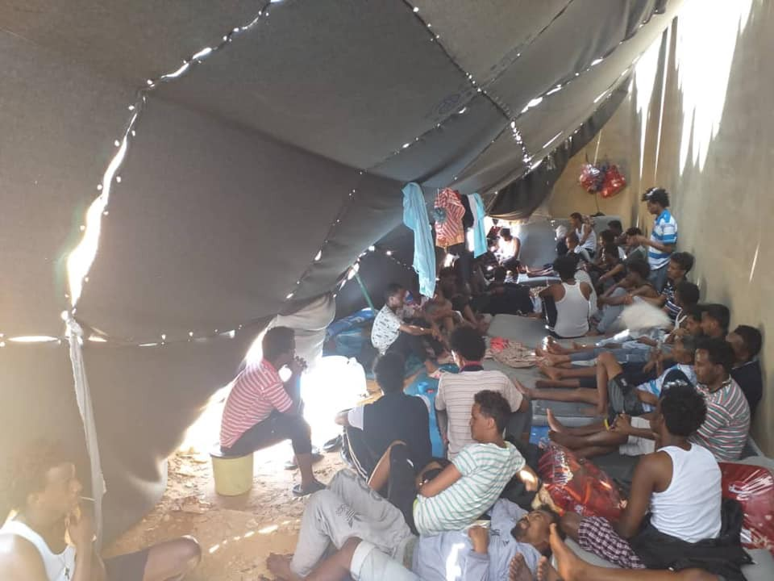

### AYS Daily Digest 25/6/19: The European Court has ruled against Sea\-Watch 3’s emergency
#### _Deportations to Syria from Lebanon // almost deportations from Denmark to Syria // new arrivals in Greece // and more…_

](assets/3f93066ba816/1*53PCzKRn0p82fjHLzwu2iA.jpeg)

Borders, refugees and EU’s anti\-migration policies\! by [Moria Refugee Razieh](https://www.facebook.com/sol2refugeesen/photos/a.1572069656418705/2107928092832856/?type=3&theater)
### Lebanon

People are being deported from Lebanon to Syria\.

_“ After Lebanon was committed to the principle of non\-refoulement by refraining from [forcibly](http://legal-agenda.com/en/article.php?id=675&folder=articles&lang=en) deporting people to Syria since 2012, two new decisions issued by the Lebanese authorities have allowed for the forcible deportation of Syrians who entered the country through unofficial border crossings\.”_

Find out more [here f](https://www.legal-agenda.com/en/article.php?id=5684&fbclid=IwAR2WWqsEJMBjPAOPIdckSyft3qLQXnkdAHVH-4vY3NRWA7HBmtARxy4cMrk) rom the 8 organizations standing up against this\!

SB OverSeas needs volunteers in their schools in Beirut\! Look them up [here\!](https://www.facebook.com/groups/1666846223566047/permalink/2265694567014540/?hc_location=ufi)
### Libya

](assets/3f93066ba816/1*QanWYmbaN1JNGMHy35xNBA.jpeg)

“Refugees in \#Zintan are still slowly dying of TB and malnutrition in inhuman and degrading conditions of overcrowsing and lack of access to sanitation\. The halls where they were recently transferred are so small that many have to sleep outdoors\. UNHCR have not evacuated anyone else from \#Zintan and, despite attending in 6 members of staff for 5 days, they only interviewed 40 refugees\.” Photos by [Guilia Tranchina](https://www.facebook.com/rastajuly/posts/10156748122343621)
### Sea

The European Court has ruled against Sea\-Watch 3’s emergency disembarkment, since they hold 42 people who have escaped from Libya detention prisons\. **BUT** the court still finds it acceptable to say that they Italian Government:

> [“is relying on the](https://twitter.com/TilleyMarc/status/1143612995043581952?fbclid=IwAR1gVu5ojzsbAAsYh9jDpRJ9Z4QZLdukGvr-U0uqNQpYogbTXnIABnjxtjk) Italian authorities to continue to provide all necessary assistance to those persons on board Sea\-Watch 3 who are in a vulnerable situation **on account of their age or state of health** \.” 

[The captain](https://www.france24.com/en/20190625-captain-sea-watch-threatens-run-italy-blockade?ref=tw&fbclid=IwAR1cP6fy_LPJF3N3JYBfK4mZJ4TJoF48LGdp8CP4CfSCmwbkdPp0S8OUVQI) of Sea\-Watch 3 \(which has been stranded at sea for [12 days](https://twitter.com/alarm_phone/status/1143529260075900928?fbclid=IwAR0fFGUptCBVdaO5CQb6qUPXes8nCDeP0IL_aNGa4b-jqpjcv_GYf4oOVsg) without any government's permission to come to a port\) said this on Tuesday:

> “I will enter Italian waters and bring them to safety on Lampedusa,” Carola Rackete said in an interview with La Repubblica daily, in reference to Italy’s southernmost island\. 

](assets/3f93066ba816/1*0Rv6LLSjys-KoP5oyRMjFA.jpeg)

“‘I am responsible for the 42 people I have recovered at sea and who can’t take it anymore\. How many more abuses have to endure? Their life comes before any political game or incrimination ‘\. Our Commander on @ repubblica \. We are with her whatever happens\.” Photo by [Sea\-Watch Italy](https://twitter.com/SeaWatchItaly/status/1143592634692358144?fbclid=IwAR3shK0surbpmboLSc2rXymayL4vdv7ZqcZrLLGYE7zbREl5Mrg583orj78)

[The 42 people](https://twitter.com/alarm_phone/status/1143529260075900928?fbclid=IwAR0fFGUptCBVdaO5CQb6qUPXes8nCDeP0IL_aNGa4b-jqpjcv_GYf4oOVsg) on board Sea\-Watch 3 deserve a safe harbor\. Find video of them [here](https://www.facebook.com/angela.caponnetto.54?eid=ARDKNy3jmefRZYbTVGSc7y2l2R3sD5e00By6zORq3qD-W8fK5NUUfiOS58PLwWUd2r9ZOpLj8rOaDc0c) \.

[The body of a man](https://www.tgcom24.mediaset.it/cronaca/sicilia/cadavere-trovato-in-una-rete-da-pesca-al-largo-dell-agrigentino_3216626-201902a.shtml) was found in a fishing net off the coast of Italy\. He could of been a victim of one of the many ship wrecks of people trying to find safety from Libya\.

A new study indicates that **1,020 people died when crossing the Strait of Gibraltar by boat since January 2018** \(to June 2019\) \. Only 25% of the bodies between this strip between Morocco and Spain have been recovered\. Find out more [here\.](https://elpais.com/politica/2019/06/25/actualidad/1561450292_606532.html?id_externo_rsoc=TW_CM)

**IN A CALL FROM maydayterraneo** : Please help them [here](https://www.gofundme.com/f/trabajemos-juntos-por-los-refugiadosse-lo-merecen) \!

> “SMH has ‘Aita Mari’ a refurbished fishing ship that now tries to operate in the Mediterranean sea which needs an extra small boat to work safely\. The new boat will cost around 7000€ and we are trying to fundraise part of this money by doing the famous pilgrimage of Santiago \(north Spain\) in 7 days in our mountain bikes\.” 

> “ [\# LAST MINUTE \# FronteraSUR Alert](https://twitter.com/SRodrigoruiz/status/1143525561488302080?fbclid=IwAR1cP6fy_LPJF3N3JYBfK4mZJ4TJoF48LGdp8CP4CfSCmwbkdPp0S8OUVQI) of a raft with some 57 people adrift navigating in precarious conditions between the coasts of Morocco and \#Andalucia \. There is a Second with difficulties\.” 

### Greece

[Aegean Boat report’s weekly report](https://www.facebook.com/AegeanBoatReport/photos/a.285312485325196/600472500475858/?type=3&theater) is out for June 17th\-23rd\! 38 boats were stopped by the Turkish Coast Guard this week BUT 940 people arrived on the Greek islands\. There were also 347 people transferred to the mainland this week\.
### Serbia

In their most recent newsletter, the Serbian InfoPark team reported, among other things, that they assisted three underage nationals of Morocco _“who claimed brutality of Croatian police on few occasions\. One of the boys suffered visible leg injures and was observed in an apparent state of distress\. They were not willing to communicate,but after getting involved in some creative activities they showed interest in legal options and accommodation possibilities\.”_
### Italy

8 people were intercepted off the coast of Lampedusa, and there were probably coming from Tunisia\. Find out more [here\.](https://twitter.com/Medhope_FCEI/status/1143606377438490625?fbclid=IwAR1mAdVVeygLHoESuNTXE5lVAvOHuB4dOt_iBBJcq5XxBSYec147nLIMNJg)

](assets/3f93066ba816/1*2WbnFrIf32taz5sj-hLICg.jpeg)

“Since early morning we received notice of a gomona with 57 people aboard lost in the area\. We are available to SM for the search, they reject our help\. We can not patrol under threat of fine” Photo by [maydayterraneo](https://twitter.com/maydayterraneo/status/1143600680243990535)

> “Let’s try to give some truth back to the events of the last days\. On the Italian\-French border, people are rejected on a daily basis, and in this period we are talking about 30–40 people a day forced to travel, in any weather condition, 6 kilometers to return to the city of Ventimiglia\.” 

](assets/3f93066ba816/1*597mMnyOTQfnnHqq1P383w.jpeg)

“For months the solidarity of the territory have been organizing a fixed sit\-in close to the border together with the other solidary people who cross the territory, a safe “port” in the territory of Ventimiglia to guarantee a first support to the rejected people\. Water and food are distributed, as well as other basic necessities, but evidently even this type of support is not contemplated by those who have governed the city for a few months\.” Photo by [Project20K](https://www.facebook.com/progetto20k/posts/891284521231463)
### Germany

](assets/3f93066ba816/1*sklP6HUtd3GL9LoCAPeoBw.jpeg)

“The Sea\-eye rescue ship will return home to Germany this weekend\. In the future, it should be permanently as an information and memory site in Hamburg\.” Photo by [Sea Eye](https://www.facebook.com/seaeyeorg/photos/a.732203640218869/1993390967433457/?type=3&theater)
### France

According to Human Right’s Watch \(HRW\), a decision was made on Monday which could severely affect the _“escalation in harassment and intimidation of aid workers in France\.”_

An Aid working is having to pay a fine for a tweet he made in response to police activity in Calais\. Find out more [here](https://www.hrw.org/news/2019/06/25/france-aid-workers-defamation-conviction-upheld?fbclid=IwAR3CGDn1gj8hqSYpeVZ_Gp0nCo8JNpxj4-m3g9D0in84KoDWdM0UafnnyJU) \.

](assets/3f93066ba816/1*z8M1qXuH0Tf5XsTV8mNopA.jpeg)

“The Council of State on Friday enjoined the northern prefecture to install water points, showers and toilets near a gymnasium of Grande\-Synthe, around which live some 700 migrants, and organize marauding to inform them of their rights\.” Photo provided by [With Afp](https://www.lavoixdunord.fr/602628/article/2019-06-21/la-prefecture-l-obligation-d-installer-douches-et-sanitaires-pour-les-migrants#Echobox=1561150824)
### Denmark

[**Denmark**](https://www.berlingske.dk/samfund/her-er-de-seks-syriske-proevesager-dyk-ned-i-afgoerelserne-en-for-en?fbclid=IwAR1DQVzQlWaODXMLizMcA2D4OLah4aodiMizAS8e6Z9TwChdR0ylV4Wz0Fk) **WAS becoming the first country in the West to send people back to Syria\.**

BUT 6 trial cases of Denmark trying to uplifted the protections status and event of sending these people back to Syria has stopped\. The ministry of immigration\- and integration lost, which means that the refugee board in all 6 cases decided that these Syrians will keep their protection status in Denmark\.
Small victory for humane asylum politics\.

In all 6 cases the refugee board stated individually reason for keeping the protection status\. This means we are still lacking to see a principal statement from the board that Syria is not safe for anyone to be deported to\. Find out more [here](https://www.fln.dk/da/GlobalMenu/Nyheder/Nyhedsarkiv/2019/21062019.aspx?fbclid=IwAR3IqGNLZiXO7UWM3tWS6qctI_gnK6mXC25ZEpQ0Cu1wnfMLQedUMTP1Am0) and [here\.](https://www.facebook.com/CLOSETHECAMPSDK/posts/3044448828932050)
### General

[Help support](https://www.facebook.com/groups/informationpointforlesvosvolunteers/permalink/1145943605613085/) the solidarity march of the year\! If you can help this man below with accommodation, much would be appreciated\!

> “Over the course of this fall, Arne Martin Thingnes will demonstrate his solidarity with refugees and asylum seekers by walking the so\-called ‘Balkan route’ \(one of the main migratory paths into Europe\) in reverse\.
 

> Arne Martin will start walking on the 12th of August from the coastal city of Arendal, south in Norway\. He is planning to reach the infamous Moria Camp on Lesvos in December, about four months later\.” 

#### AYS and the Daily News Digest — how to get involved?

**We strive to echo correct news from the ground through collaboration and fairness\. Every effort has been made to credit organisations and individuals with regard to the supply of information, video, and photo material \(in cases where the source wanted to be accredited\) \. Please notify us regarding corrections\.**

**Apart from daily news in English, we also publish weekly summaries in Arabic and Persian\. Find specials in both languages on our [medium site](https://medium.com/are-you-syrious/ays-weekly-in-arabic-and-persian/home) \.**

**If there’s anything you want to share or comment, contact us through Facebook, Twitter or write to: areyousyrious@gmail\.com\.**

**We’re open to expanding our team of volunteer researchers, editors, and info gatherers\. Get in touch\!**

_Converted [Medium Post](https://medium.com/are-you-syrious/ays-daily-digest-25-6-19-the-european-court-has-ruled-against-sea-watch-3s-emergency-3f93066ba816) by [ZMediumToMarkdown](https://github.com/ZhgChgLi/ZMediumToMarkdown)._
