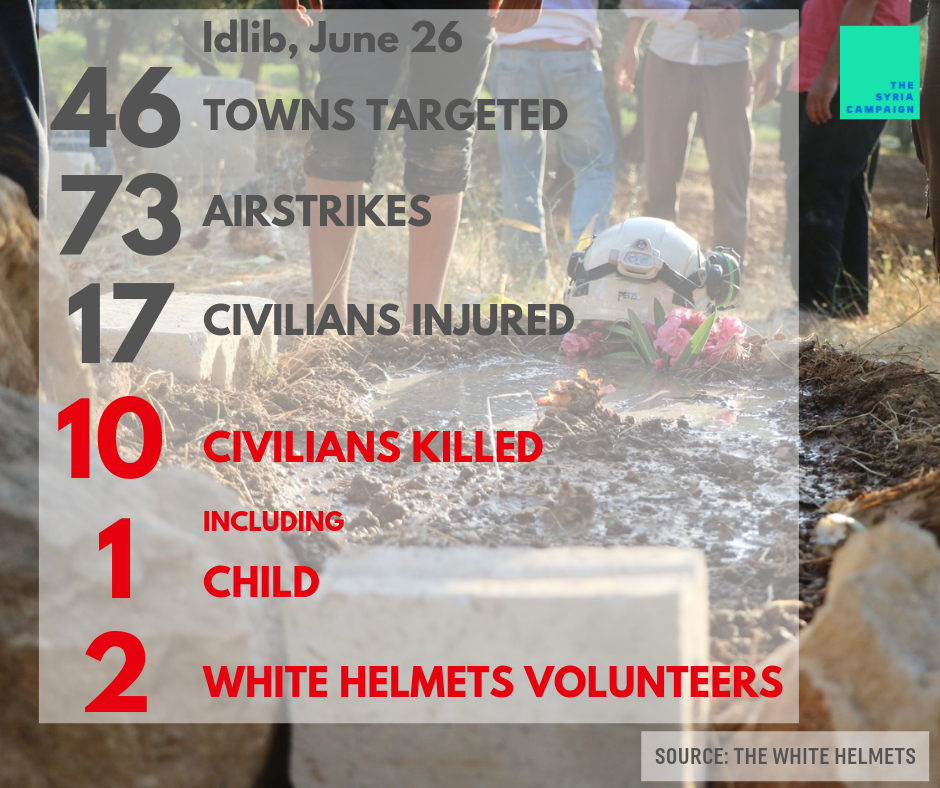

### AYS Daily Digest 27\.06\.19: Sea\-Watch 3 Still Stranded

_Strikes in Idlib / Three drown en route to the Canary Islands / Open Arms ship resumes mission / New arrivals in Greece / Fire in Lavrio camp / Demonstrations across Italy / Police harassment in Ventimiglia / and more…_

](assets/f9ed6dd3fd51/1*qtwzBw-auzC5w50a_6xW8Q.jpeg)

Photo Credit: [Sea\-Watch](https://www.facebook.com/seawatchprojekt/photos/a.1579563625595046/2275597085991693/?type=3&theater)

The Sea\-Watch 3 is entering its 16th day of waiting to disembark the 42 people on board, having been denied any port of entry by Italy or Malta\. Today, the ship entered Italian territorial waters in a self\-described act of desperation\. “It’s been 23 hours since the [Sea\-Watch 3](https://www.facebook.com/hashtag/seawatch3?hc_location=ufi) entered Italian waters in a state of necessity,” wrote the group in a public post\. “We were forced to do so because for \[two\] weeks not a single [EU](https://www.facebook.com/hashtag/eu?hc_location=ufi) institution took responsibility\. Do we have to continue on our own or is there anyone who remembers their duty to protect life at sea?” From the group’s [statement](https://www.facebook.com/seawatchprojekt/posts/2284758061742262) :

> Yesterday, we drove into territorial waters of [Italy](https://www.facebook.com/hashtag/italy?source=feed_text&epa=HASHTAG) out of necessity\. We already had the Guardia Costiera and the Guardia die Finanza on board\. We waited one night\. We cannot wait another\. Desperation of people in need is nothing to gamble with\. 

Today a man and his brother were evacuated from the ship due to urgent medical needs\. “We cannot wait for every single person to become a medical emergency until Europe recognizes they have basic rights,” said captain Carola Rackete\.

](assets/f9ed6dd3fd51/1*Lz_Yink_h8dVe0aCRmN0wA.jpeg)

A man being evacuated from the Sea\-Watch, 27/06\. Photo Credit: Till Egen / [Sea\-Watch](https://www.facebook.com/seawatchprojekt/photos/a.1579563625595046/2285204505030951/?type=3&theater)

■■■■■■■■■■■■■■ 
> **[Sea-Watch International](https://twitter.com/seawatch_intl) @ Twitter Says:** 

> > 15 DAYS the #SeaWatch3 is stuck at the shores of #Europe. 
15 DAYS the world's deadliest border is left abandoned, without any rescue ship.

Now old friends have set sails to take over the watch and confront this unbearable situation. ¡Buena Proa! Good to have you back. #NiUnaMás 

> **Tweeted at [2019-06-27 07:48:27](https://twitter.com/seawatch_intl/status/1144150484124672000).** 

■■■■■■■■■■■■■■ 

Sea\-Watch is calling on its supporters to donate to assist with legal support\. For more information, [click here](https://www.facebook.com/watch/?v=2282254551890625) \. In less than 24 hours, the group has already raised over 60,000 euros from donors\. While the situation is dire for those onboard the Sea\-Watch, the refusal to allow the ship to disembark also has a less visible consequence\. Every day the ship is stranded it is unable to rescue other people who are currently in danger in the Mediterranean\.
#### Syria

The Syria Campaign released some statistics on how many civilians were killed yesterday during the ongoing attack on Idlib\. From their statement:

> Assad and Russia’s brutal war on Idlib’s civilians and humanitarians continues for the 61st day\. Yesterday alone, 10 civilians were killed including 2 White Helmets volunteers who were deliberately targeted while trying to rescue civilians from an earlier airstrike\. 

#### Morocco

On Wednesday, Moroccan authorities forcibly moved 215 people from the coastal city of Nador to Tiznit, a remote town in the Atlas mountains, [according to the Nador section of the Moroccan Association for Human Rights](https://www.facebook.com/AmdhNador/photos/a.1693125780899690/2360276844184577/?type=3&theater) \.
### Sea
#### Frontex Missions Stop Boat Carrying 75 People

Today a joint Frontex operation between Italian and Greek authorities [stopped a sailboat](https://twitter.com/Frontex/status/1144220797650817024?fbclid=IwAR2owk4z0k1oD6UNj5XrAbONFCqf1ssNt0y4D2t_4fBiiNmi8_HzHD0VZF4) carrying 75 people from Italy to Turkey\. The boat was stopped by a Hellenic Coast Guard ship, and two suspected people smugglers were arrested\. There is no word yet on where the people on board have been taken\.
#### Three Drown on Boat Headed to Spanish Canary Islands

[Three people were reported drowned](https://twitter.com/APDHA/status/1144210415313928193?fbclid=IwAR3S60pj7MH0JZN5aCARHHIajRPoZOtqw07-5erfPaIQpnZmt3Nno3iZN4M) today on a boat that was headed towards the Canary Islands off the coast of Africa\. The victims were two women and an infant\. How many more victims will the European borders claim?
#### Open Arms Returns to the Sea After 6\-month Impoundment

Today the rescue vessel Open Arms finally returned to its rescue mission after six months of languishing at port\. The ship was denied permission to sail by the Spanish government, which cited the ship’s frequent inability to disembark refugees in nearby Malta and Italy\. The Spanish government declared it was too “unsafe” for the group to continue its mission given these circumstances\. Presumably, it is “safer” to allow people to drown at sea?

While the Open Arms is back at its rescue mission today, it is likely to face similar difficulties in the near future\.
#### Four People Rescued by Spanish Ship

Four people of Maghreb nationality were [rescued off a small dinghy](https://www.eldiario.es/andalucia/Rescatados-migrantes-Malaga-Mar-Alboran_0_914458658.html) in the early hours of the morning by a Spanish rescue ship\. At the same time, Spanish authorities are still searching for 42 people who left from the coast of Morocco eight days ago\.
### Greece

New Arrivals \(numbers via [Aegean Boat Report](https://www.facebook.com/AegeanBoatReport/posts/601952446994530?hc_location=ufi) \):

A boat was picked up outside Kos east, by HCG 04\.00\.
36 people, numbers not confirmed\.

Another boat landed on Simi north 10\.00
12 people, numbers not confirmed\.
#### Update from [No Name Kitchen](https://www.facebook.com/NoNameKitchenBelgrade/photos/a.312076942523930/745343202530633/?type=3&__xts__[0]=68.ARApykju-eJnUGkzr5lrkfT___9yQhbk7p7g4_jdtKiVdSBtKBeGIsXyQRZ0_Udfxl3IBd1703gS8KS5U_jtzM5PLegvdigyvxHauHrnPozYdwiyT2ExkTH029T4S9rY16V2ga3_3iOsXdbHZ9QSRt3YuEoOK_Nb6BokZwrtNRG0F0fnKOj-OXLPRnMb8sjM6Em0pl_bbAUE4dySYZxeMVeYgR0qhTpdhKwAne2fdpJzImOSu-zs3EA9GTfbjFTugI7U3HPEptBx4gLhLz0_azx1_NQUqHFV3rGAXts9fn07SI2FDlV6sAoAZ9WhSGHrVh44H3wJ6wcQOKvxWc_udKQ&__tn__=-R) in Athens

> Summer has arrived with average temperatures of 35º C during the hottest hours of the day\. No Name Kitchen carries on with food distributions in three areas: the port and the two abandoned factories\.
 

> Police interventions have intensified, and everyday there is some young boy missing because he has been arrested somewhere near the factories or trying the “game” which usually ends up with their being arrested and taken to Athens\. 
 

> These last days we have increased the distribution of hygiene packs — from once a week to twice a week — but we have run out of clothes to distribute\. At this moment we are particularly in need of dark t\-shirts, trousers, underwear, socks and trainers, and we are working with Greek organizations and department stores in Athens in order to try covering these needs\. 

](assets/f9ed6dd3fd51/1*_YLsMn6AtrZv7zGj51UeLA.jpeg)

Photo Credit: [No Name Kitchen](https://www.facebook.com/NoNameKitchenBelgrade/photos/a.312076942523930/745343202530633/?type=3&__xts__[0]=68.ARApykju-eJnUGkzr5lrkfT___9yQhbk7p7g4_jdtKiVdSBtKBeGIsXyQRZ0_Udfxl3IBd1703gS8KS5U_jtzM5PLegvdigyvxHauHrnPozYdwiyT2ExkTH029T4S9rY16V2ga3_3iOsXdbHZ9QSRt3YuEoOK_Nb6BokZwrtNRG0F0fnKOj-OXLPRnMb8sjM6Em0pl_bbAUE4dySYZxeMVeYgR0qhTpdhKwAne2fdpJzImOSu-zs3EA9GTfbjFTugI7U3HPEptBx4gLhLz0_azx1_NQUqHFV3rGAXts9fn07SI2FDlV6sAoAZ9WhSGHrVh44H3wJ6wcQOKvxWc_udKQ&__tn__=-R)
#### Fire in Lavrio camp

Today at about 10 am, a fire broke out on a site next to the small self\-run Kurdish camp on the outskirts of Lavrio\. The fire caused the urgent evacuation of the entire camp which has suffered severe damage consequently\. Fortunately, everyone got out safely and they hope to start clearing and repairing the camp tomorrow\.

The cause was dry wood and rubbish which catches fire very easily, which has been left in an informal dump inland right next to the camp\. The residents have submitted their concerns about this to the local municipality many times previous to this event, but no action had been taken\.
### Slovenia

Our activist friends from Slovenia are organizing a set of talks and workshops in Ljubljana aimed at finding alternatives to the existing forms of integration and support systems for refugees in the country, which are ineffective for many\.

> The aim of the event is to define the model of integration and accommodation for asylum seekers and refugees based on solidarity initiatives and potentials of local communities…We will be joined by a panel of participants from Velika Kladuša, Prešovo, Vienna and Trieste, who are active in the field of integration of asylum seekers and refugees and are putting their efforts into finding and implementing new ways of accommodation and integration of migrants\. This will be followed by workshops aimed at finding solutions to the lack of institutional mechanisms that would facilitate the integration of migrants into society\. 

You can find out more and see the full schedule [here](https://www.facebook.com/events/2409869379035727/) \.
### Norway

Volunteers with the Norwegian group [A Drop in the Ocean](https://www.drapenihavet.no/en/home/) are organizing a solidarity march from Arendal to the detention camp on Lesvos\. Activists are trying to bring attention to the inhumane treatment of refugees and the closing of borders and also calling for Norway to accept more refugees into the country\. Click [here](https://www.drapenihavet.no/en/press-release-go-for-it-solidarity-march-from-arendal-to-lesvos-moria/?fbclid=IwAR0L-NVusbn1po9Od0-Pl0VHWYqtpq5uLNx2RvCLq11GrCKpEd9uP08Ywj0) for more info on how to get involved\.

> An event at Arendalsuken Monday 12th of August from 12:30–14:00 will act as the kick\-off of the march, and will be held at the Bricolagen/Bankgården in Arendal\. 

### Italy
#### Demonstrations of Solidarity with the Sea Watch

](assets/f9ed6dd3fd51/1*WZsdzTSywEanbohAVvRiCg.jpeg)

“Stop the war against migrants\.” Photo Credit: [Global Project\.info](https://www.facebook.com/globalproject.info/?__tn__=%2CdkCH-R-R&eid=ARC67P32x77aRT85HJ0CITuhnu4Ne1aOMzQpiPmwz03okUlnq1Zn3ajUm5nmmgdWRaSL4Kt5RTcG5eZD&hc_ref=ARSvhsdcRdm0a8xjsizovnLKlxAYbhpLTTDXCNiJHkOn0vpL5o6FmPxVHCte05cVWaI&fref=nf&hc_location=group)

Today throughout Italy, various squares and municipalities are filled with protestors in solidarity with the ship [\#seawatch](https://www.facebook.com/hashtag/seawatch?source=feed_text&epa=HASHTAG) and its captain, Marola\. In the Northeast, there are scores of demonstrators in the cities of [Padua](https://www.facebook.com/hashtag/padua?source=feed_text&epa=HASHTAG) and T [rento](https://www.facebook.com/hashtag/trento?source=feed_text&epa=HASHTAG) \. For a full list of demonstrations in Italy, [click here](https://www.facebook.com/globalproject.info/photos/a.252970521408259/2421012617937361/?type=3&theater) \.

A member of the Italian parliament has also boarded the Sea Watch and refuses to leave until the rescue ship is allowed a port of entry\.
### France

The French Ministry of the Interior has, at great cost to French taxpayers, taken out a series of newspaper ads this week calling on citizens to, “help us guard the borders,” by reporting refugees and migrants to the police\. The campaign has been heavily criticized by activists and civil society groups\. In response, a collection of groups have taken out similarly designed ads calling on citizens to, “help us save lives\.”
#### Update from Kesha Niya in Ventimiglia

The [Kesha Niya](https://www.facebook.com/KeshaNiyaProject/posts/936959096648958:0?hc_location=ufi) group, working to support refugees and provide food in the border region of Ventimiglia, are reporting increased harassment from the police\. The group has been targeted by the local police, who come every morning to try and stop their breakfast distribution to refugees, despite confirmation from border police in Ventimiglia that the group’s actions are legal\. The mayor of Ventimiglia has also criticized the group in local newspapers and praised the behavior of the police\.
#### AYS and the Daily News Digest — how to get involved

**We strive to echo correct news from the ground through collaboration and fairness\. Every effort has been made to credit organizations and individuals with regard to the supply of information, video, and photo material \(in cases where the source wanted to be accredited\) \. Please notify us regarding corrections\.**

**Apart from daily news in English, we also publish weekly summaries in Arabic and Persian\. Find specials in both languages on our [medium site](https://medium.com/are-you-syrious/ays-weekly-in-arabic-and-persian/home) \.**

**If there’s anything you want to share or comment, contact us through Facebook, Twitter or write to: areyousyrious@gmail\.com\.**

**We’re open to expanding our team of volunteer researchers, editors, and info gatherers\. Get in touch\!**

_Converted [Medium Post](https://medium.com/are-you-syrious/ays-daily-digest-27-06-19-sea-watch-3-still-stranded-f9ed6dd3fd51) by [ZMediumToMarkdown](https://github.com/ZhgChgLi/ZMediumToMarkdown)._
