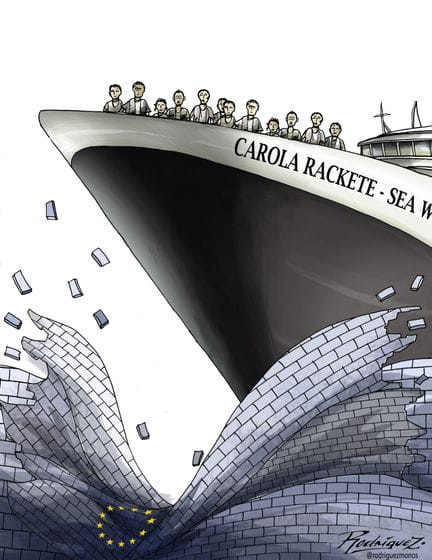
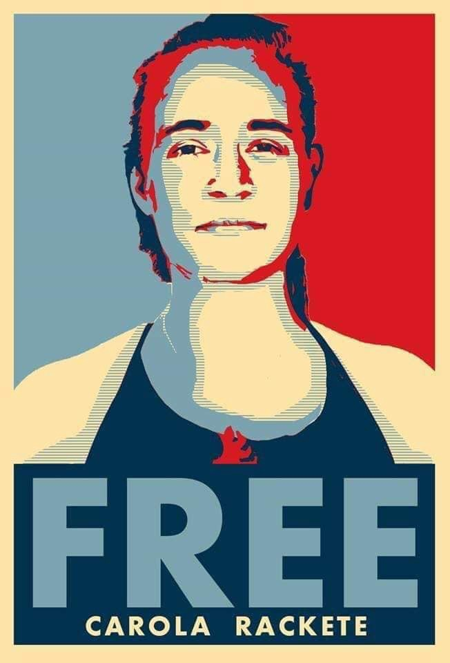
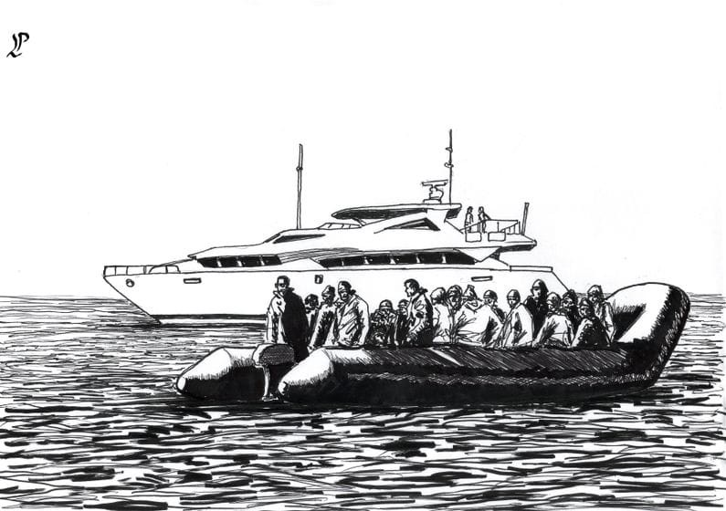
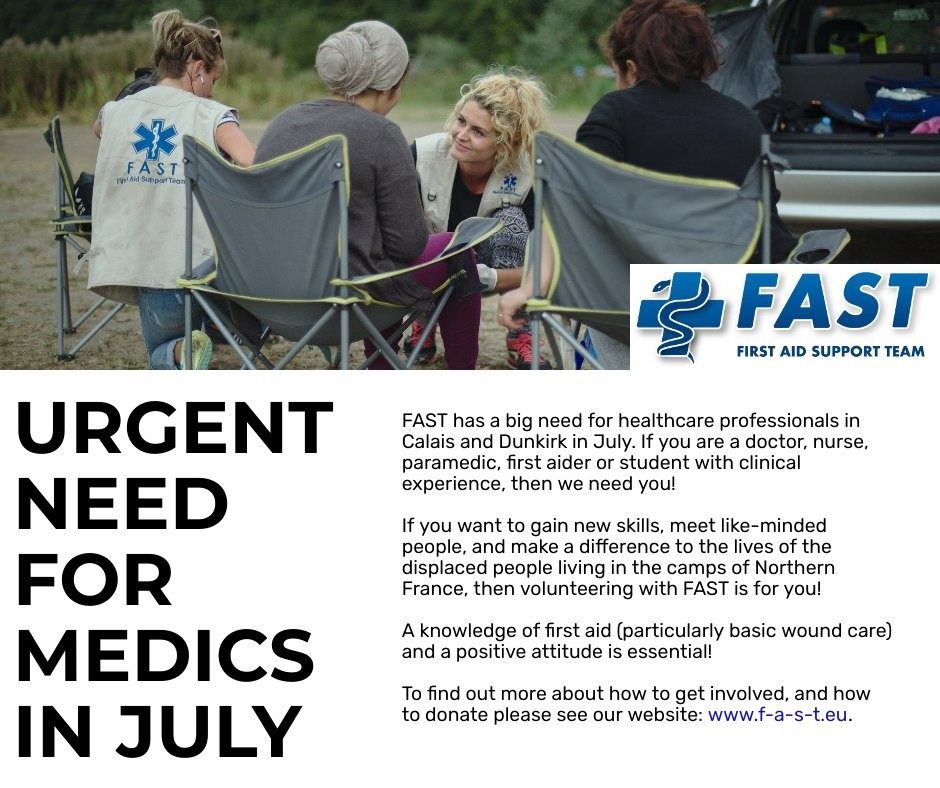

### AYS News Digest 29–30/6/19: Will we allow a courageous moral lead to save lives be defined as a crime?
#### The case of Carola Rackete — the case of all of us // Afghan refugees living in Manshera had to vacate the camp / In Spain, SAR vessels are being moved from the zone where they are needed the most/ Spain’s age assessments for unaccompanied minors in violation of the Convention / France: urgent need for professionals from the healthcare sector in Dunkirk and Calais / **overturned decision of the Danish Immigration Service to withdraw temporary subsidiary protection from 6 Syrians /** Middlesbrough Council has backed the \#liftTheBan campaign in the UK

By Antonio Rodriguez Garcia
#### FEATURED

Unfortunately, what has lately been going on in the Mediterranean and along the routes people are taking is amounting to the degrading kind of human behaviour depicted in Black Mirror and similar seemingly SF scenarios, as the world is watching the inhumane and degrading treatment of people ‘in front of their doors’, on board the SAR vessels\.

To recall what happened recently, leading to an escalation in the worst possible manner of the entire question of the right to save lives: on 12th June, Sea\-Watch 3 rescued 47 migrants in distress at sea\. Since then, the vessel had waited for over two weeks for a solution from the European States to disembark those rescued persons to a place of safety\. No solution came, no European unity was demonstrated, and there was a lacuna of ownership, as Human Rights at Sea put it\. Also, the doctors on board the Sea\-Watch 3 [posted reports](https://twitter.com/seawatch_intl/status/1142032588707643393) calling for assistance to allow them to disembark the rescued persons to the closest place of safety\.
After 14 days spent waiting for a national or international authority to grant a safe haven to the shipwrecked people on board the Sea Watch 3 \(as defined and required by international laws and treaties\), the ship’s captain Carola Rackete decided to try to enter the port of Lampedusa on 26th June in order to bring the rescued passengers on board the vessel to safety\.

■■■■■■■■■■■■■■ 
> **[Sea-Watch International](https://twitter.com/seawatch_intl) @ Twitter Says:** 

> > 🔵 Statement of our Captain, #CarolaRackete, before entering Port with the #SeaWatch3.

“We are proud of our captain, she did exactly the right thing. She upheld the law of the sea and brought people to safety." – #SeaWatch chairman Johannes Bayer https://t.co/lfZ16Pq9F1 

> **Tweeted at [2019-06-29 00:10:30](https://twitter.com/seawatch_intl/status/1144760012839018496).** 

■■■■■■■■■■■■■■ 

This Monday afternoon she will be brought before a judge to decide if she is going to be detained and tried\.

The alleged crimes are: refusal of obedience to warships, resistance or violence against warships and navigation in prohibited areas\. 
The prosecutors are [reportedly](https://www.repubblica.it/cronaca/2019/07/01/news/carola-230033015/?refresh_ce) only requesting a ban on staying in the province of Agrigento\.

Unlike the imposed ban on disembarking migrants saved from a rubber dinghy off the coast of Libya, the action taken by the Sea Watch 3 captain \(after waiting for 14 days for an official solution\) was completely in line with international and maritime law, complying with her duties as per UNCLOS, SOLAS, the SAR Convention, and other customary international law principles\.

It is worth repeating that fundamental human rights and a basic sense of humanity are far superior to unjust laws and orders, such as the infamous Salvini Decree, that cause the further suffering of innocent people\.

> **It is unconscionable to continue in support of this spectacle of wickedness staged on the bodies of women, men, and children, while every day people fleeing Libya by sea in makeshift boats arrive in Lampedusa and on our coasts\.** 

Everything we do next shows how valid, strong and legitimate the fundamental human rights of **all of us** really are\. We must not stand aside, wait and watch\. All citizens of the EU member states have the right and duty to urge their representatives to act according to what the Union declares it stands for\.

We must all urge the European institutions, the Council of Europe and the European Court of Human Rights to take action and protect Carola, Pia, and all other individuals and organisations under the pressure of criminalisation of their acts of solidarity with humanity\.

> Are You Syrious fully stands by the Sea Watch crew and captain Carola Rackete, supporting their decision to lawfully safeguard life at sea and deliver the rescued people to a place of safety\. 

#### PAKISTAN

The Khyber Pakhtunkhwa administration has served a final notice to the Afghan refugees living in Manshera to vacate the camp by June 30 in a bid to ensure the ‘security’ for the China\-Pakistan Economic Corridor \(CPEC\) project\.
As many as 2,397 families are living in the three camps situated in the area\.
Yet another instance in which the most vulnerable are suffering because of the gain of political and economical elites\.

Pakistan is hosting over 1\.4 million Afghan refugees, making the country the second largest host of the refugee population in the world\.
#### AFGHANISTAN

Dozens of people were wounded with fatalities feared as a powerful car bomb rocked Kabul early on Monday and gunmen battled special forces in an area housing military and government buildings, officials [said](https://www.dawn.com/news/1491476/at-least-65-wounded-as-powerful-car-bomb-rocks-kabul) \.

> \#AfghanistanIsNotSafe 

#### GREECE

As of June 27, the Aegean Boat Report team documented 17,374 people on the Greek islands\. Waiting for years and poor sanitary conditions are causing many to fall ill\.
Unfortunately, under the current circumstances reportedly all of the new arrivals on Chios are staying in small pop\-up tents because Vial camp is over capacity\.

](assets/add8271babf9/1*4-erdwLSgviAhPgdlzouRQ.jpeg)

Photo: [Gary Capshaw](https://www.facebook.com/gary.capshaw.9?__tn__=%2Cd%2AF%2AF-R&eid=ARDIVI3OwN8gvPvJbAxJ-MHUvS9_VW-hTOv9ZETT3GuxDCeQu3V9nZicKOPb-8aSFS8__l5YEGMpfbzb&tn-str=%2AF)

Here is the monthly report:

LESVOS:
Arrivals June: 1,448
Total arrivals this year: 4,782
Boats June: 41
Total boats this year: 141
Transfers June: 716
Total transfers this year: 5,453
Total refugees on the island: 7,370

CHIOS:
Arrivals June: 252
Total arrivals this year: 1,477
Boats June: 9
Total boats this year: 51
Transfers June: 226
Total transfers this year: 1,700
Total refugees on the island: 2,020

SAMOS:
Arrivals June: 465
Total arrivals this year: 3,224
Boats June: 13
Total boats this year: 80
Transfer June: 262
Total transfers this year: 2,550
Total refugees on the island: 4,109

KOS:
Arrivals June: 353
Total arrivals this year: 1,147
Boats June: 19
Total boats this year: 49
Transfers June: 33
Total transfers this year: 512
Total refugees on the island: 2,291

LEROS:
Arrivals June: 256
Total arrivals this year: 1,243
Boats June: 10
Total boats this year: 37
Transfers June: 166
Total transfers this year: 1,005
Total refugees on the island: 1,357

OTHER ISLANDS:
Arrivals June: 169
Total arrivals this year: 877
Boats June: 10
Total boats this year: 37
Transfers June: 61
Total transfers this year: 112
Total refugees on the other islands: 227

BOATS STOPPED BY TCG/POLICE:
Refugees June: 4,958
Boats June: 160
Total refugees this year: 21,869
Total boats this year: 690

](assets/add8271babf9/1*1CzKFUwkijxUmWIzAgDnLg.jpeg)

by [Aegean Boat Report](https://www.facebook.com/AegeanBoatReport/?__xts__%5B0%5D=68.ARDra8WZWjCasYtxO86Fj3HOy6VAgeWVoNa7oeGQhpZ3SVYyIf_qCdiSu2chivW0ALWuS3fOt6HFyHO9THkHP7y4p7-og6JxUR_84Sj8l8-v2dVa0F4Cb18R930vhuLvxXIDicbCzr3Mvb5strajuiSc-tfARPc-muwFZzwsGsgFQNWJKS-fz3CR1I7RSmkI_OTgSX2Tyfeg8mD1nYuVldugSiMgzEnLdQuQBhrqbKODvHcuw_5oLBiWFwD86XjcgKjV9a_uobDgbnEZ7G_qP13d1QY-RJ4raoL82YO4Qun1WvZHz2aOBizuxQDOQNJoWLBBlUhpbE3B28iH2aQIDQg&__xts__%5B1%5D=68.ARDugPKiArhNw2Tt7xHLMIDaXXnwuOI3oT28OT7zP0YeO8faMd-LBceymTLl7ZSd9m2u6XgZe4UbCZhJ-RBFrrw1BA2DC2dVWUBorBvFzmXARKjIx18ioLPCkOn8eC-lA4J4a-CuVwebywVdeRWoYMFh2pGBFlO-0mzG4QbvVZL4K3rcLTJzpYh8Ja3B0Ch-EfHk5WOaOFrB4L8g3VCCPxBCifbIciYJuf6PU7HHRZblJ2W8Zr78eji12JSOP351dGZLSwEoe6688tQdr36as2k6hOD6vn39WhvswDbE1uEnzP9VuryTLO1cBRLl-17K0v2nqd0t0xgER8zczN1yQjk&__tn__=kC-R&eid=ARCcpTcw2p5T407H9K88RuLoPvL--KaTTGylthPPT3xkM71H15mNSpaybdwMbEXKzd-s0xYR3cnG2z8m&hc_ref=ARSYNwTsOCgNq5ohnIQhAAQuZiqnAYd0WPfsOt-SSr9TzchbwWyowrh7f6COFmMZI7g&fref=nf)
### Weather warning

A heat wave with temperatures reaching up to 41 degrees Celsius is forecast to strike Greece in the upcoming week\. The temperature will rise as of Monday, July 1st, and remain high until at least Friday, July 5th 2019\. The hottest days are Wednesday and Thursday, July 3 and 5\.
#### SPAIN

Salvamento Marítimo says that arrivals are very likely to surge during the upcoming summer, but at the same time the government’s policy is shifting — there are no extra efforts or resources being allocated for this, instead vessels are being moved from the zone where they are needed the most\.

By Paolo Lombardi
### Spain’s age assessments for unaccompanied minors in violation of the Convention

**The United Nations Committee on the Rights of the Child \(the UNCRC\) has issued decisions in two separate cases on age assessments conducted on unaccompanied children\.** 
The Committee recalled that the determination of the age of a young person claiming to be a minor is of fundamental importance, since the outcome determines whether that person will be entitled to protection as a child and the rights that flow from this, or will be excluded from such protection\.

In cases of uncertainty, the individual should be given the benefit of the doubt, so that, in the case of a child, they are treated as such\. With regard to legal representation, the Committee held that the appointment of a legal guardian or a representative is an essential guarantee during the age assessment process\.
- The Committee held that a child’s age and date of birth are part of their identity and that states have an obligation to respect the child’s right to preserve their identity without depriving the child of any of its elements\. Consequently, the Committee concluded that Spain violated Article 8 in respect of both applicants\.
- The denial of access to legal representation constitutes a violation of the right to be heard\. In that light, the Committee found a violation of both applicants’ rights under Articles 3 and 12 of the Convention on the Rights of the Child\.

#### FRANCE

First Aid Support Team has an urgent need for nurses, doctors and other professional from the healthcare sector in July in Dunkirk and Calais\.

If you are interested in volunteering please check out [First Aid Support Team — FAST](https://www.facebook.com/FASTFirstAidSupportTeam/?__tn__=%2CdK%2AF-R&eid=ARCQs1cBIE3usV46MIl23umBL-rHj2B8yygpjZqDd3mlppz8x7xNc4AXQGkT_Ru4NPEy4eqSXXqv71Pd) or [www\.f\-a\-s\-t\.eu](http://www.f-a-s-t.eu/?fbclid=IwAR1Jn1tsK4qrXXWPGZMppGWkBUjd4z9DQdZLBlttJ7UE3CS1oCgLwl7Es38)
#### GERMANY

**The package of several new laws concerning asylum, immigration and deportation drafted and accepted by the German parliament in early June was passed by the federal council on Friday and can therefore enter into force\.**

The package that [we reported about](ays-daily-digest-07-06-2019-small-victory-italian-ports-open-to-62-people-saved-by-merchant-437cab3c4a8b) earlier includes a law that is intended to make it easier for qualified non\-Europeans to come to Germany in order to work\. But the main impact is a different one: one law aims at enforcing more deportations, making it permissible, inter alia, to detain people who are scheduled for deportation in regular prisons\. People who have been granted asylum in other European countries will receive support for only two weeks after arriving in Germany\.
#### DENMARK

**In Denmark, the Asylum Appeal Board has overturned a decision by the Danish Immigration Service to withdraw temporary subsidiary protection status from six Syrians from the province of Damascus\.**

In February 2019 the Danish Immigration Service had withdrawn or refused to extend the residence permit of the six Syrians, stating that the general security situation in Damascus would no longer allow for a temporary subsidiary protection status in these cases\. The Asylum Appeal Board has now rejected this decision and granted conventional protection status in three cases and subsidiary protection status in three more cases\.

This is seen as a success that improves the situation of many Syrians with only temporary [protection status](https://reliefweb.int/report/denmark/denmark-appeal-board-overturns-withdrawals-protection-status-syrians) who are under constant threat of return\.
### Memorial March and Demonstration

This Sunday, a Memorial March and Demonstration was held in Copenhagen, organized by Black Lives Matter Denmark\. The March was meant to commemorate an Ethiopian man who committed suicide in the closed deportation camp in Ellebæk and to ask for an end to the criminalizing and racist deportation system in Denmark\.
#### NORWAY

Refugees and asylum seekers without a permanent residence permit can have their temporary permit terminated in cases where the assessment by the Norwegian authorities on the situation in the homeland is changed\.

The government insists that returning asylum seekers to other areas in the homeland considered safe \(internal refuge\) is within the law\. This is in line with what has been the practice in Denmark for some time\.

Read more \(in Norwegian\) [here](https://www.noas.no/risikerer-tvangsretur-som-folge-av-opphor/?fbclid=IwAR16o32sTQe-hnhNfijPmNuAuTySt63TzH2vw_vc-0sklIVEskdfe3apziw) \.
#### EU

The European Asylum Support Office \(EASO\) has [published](https://l.facebook.com/l.php?u=https%3A%2F%2Fwww.easo.europa.eu%2Fsites%2Fdefault%2Ffiles%2Feaso-annual-report-2018-web.pdf%3Ffbclid%3DIwAR2IbkGZFUSk3ZQzLNXxr17S1ieB4MVgBGCH8AN4qBuwog9iy6rd5AwaJJM&h=AT24wQNTjHNaxHb4oDjw5KnWUg8OeLhlr-9Fo8cKB6t_HYHpbEF4zs0cyVPPapjpmNdHCKk8baaoeoSGvTMyKVVIMg3ASTx0k7xVaYSNlU4nPFZpD1U5YQ-e_39wz5IVOltAEw0) its Annual Report for 2018\. The report states the following:

The majority of applications for international protection were lodged in Germany, France, Greece, Italy and Spain, accounting for almost 75% of all applications lodged in the EU\+ \. Germany and Italy continued to have the highest number of pending cases, despite reductions on previous years, and Spain and Greece saw notable increases in pending cases\.

Approximately 39% of applicants were granted international protection status, however, **recognition rates across the EU continue to vary significantly\.** With regard to Dublin III transfer requests, the overall acceptance rate for decisions on Dublin requests in 2018 was 67%, down 8% on previous years\.
#### UK

**Middlesbrough Council has backed a campaign to lift the ban preventing people seeking asylum from working while awaiting a decision on their future**

Since 2002, people seeking asylum have only been able to apply for the right to work after they have been waiting for a decision on their asylum claim for over a year, and only if they can be employed into one of the narrow, highly\-skilled professions included on the Government’s Shortage Occupation List\.

At a meeting of Middlesbrough Council, Cllr Matthew Storey proposed a motion that the authority should join the Lift the Ban Coalition which already has more than 150 organisations from across the UK\.

“The UK spends between £70 and £100 million per year housing and supporting asylum seekers who could be working, earning, and fending for themselves”, they report\.
#### AYS and the Daily News Digest — how to get involved

**We strive to echo correct news from the ground through collaboration and fairness\. Every effort has been made to credit organizations and individuals with regard to the supply of information, video, and photo material \(in cases where the source wanted to be accredited\) \. Please notify us regarding corrections\.**

**Apart from daily news in English, we also publish weekly summaries in Arabic and Persian\. Find specials in both languages on our [medium site](https://medium.com/are-you-syrious/ays-weekly-in-arabic-and-persian/home) \.**

**If there’s anything you want to share or comment, contact us through Facebook, Twitter or write to: areyousyrious@gmail\.com\.**

**We’re open to expanding our team of volunteer researchers, editors, and info gatherers\. Get in touch\!**

_Converted [Medium Post](https://medium.com/are-you-syrious/ays-news-digest-29-30-6-19-will-we-allow-a-courageous-moral-lead-to-save-lives-be-defined-as-a-add8271babf9) by [ZMediumToMarkdown](https://github.com/ZhgChgLi/ZMediumToMarkdown)._
