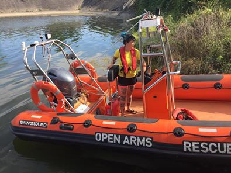
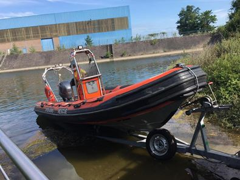

### AYS Daily Digest 2/7/19: Italian judge ordered the release of Carola Rackete from house arrest
#### _Helpful resources in Greece // anti\-Syrian language in Turkey // baby needs in Serbia // events in France // and more…_

](assets/27652687d935/1*JFsh4D-NXnjd_B5Hmzg92A.jpeg)

Photo by [Alagon](https://www.facebook.com/alagooon/photos/a.1652245135065220/2369795286643531/?type=3&theater)
#### UPDATE: At least 40 people died in the night when Tajoura Migrant Detention Centre in Libya was bombed by airstrikes\.

Tajoura migrant detention centre, in a suburb of the Libyan capital Tripoli, was bombed last night\. Media [report](https://www.theguardian.com/world/2019/jul/03/air-strike-kill-libya-tripoli-migrant-detention-centre?fbclid=IwAR2IzM53dgHhrJ8fH2HG12_KRU68prYMsPuCxrcJ70gY_vEfbllJca8wtKU) that the camp has been destroyed\. At least 40 people had been killed and other 80 were wounded\.

“ [Osama Ali, a spokesman for the emergency services, told AFP that 120 migrants had been in a hangar which was directly hit by the strike in Tajoura\. He added that more people may have been killed because the death toll so far was ‘a preliminary assessment’](https://www.theguardian.com/world/2019/jul/03/air-strike-kill-libya-tripoli-migrant-detention-centre?fbclid=IwAR2IzM53dgHhrJ8fH2HG12_KRU68prYMsPuCxrcJ70gY_vEfbllJca8wtKU) ”\.

Tajoura detention centre holds up to 600/700 people\. Both side of the armed conflict blame each others for the airstrikes\.

■■■■■■■■■■■■■■ 
> **[Sara Creta](https://twitter.com/saracreta) @ Twitter Says:** 

> > #Libya warplanes targeting the detention center of Tajoura, east of #Tripoli. There are reports of #refugees &amp; #migrants injured and dead. 
This is not the first time. 

@[UNHCRLibya](https://twitter.com/UNHCRLibya) refugees need to be evacuated. https://t.co/XdzGC2IAJx 

> **Tweeted at [2019-07-02 22:32:09](https://twitter.com/saracreta/status/1146184814841737217).** 

■■■■■■■■■■■■■■ 

■■■■■■■■■■■■■■ 
> **[Sara Creta](https://twitter.com/saracreta) @ Twitter Says:** 

> > @[UNHCRLibya](https://twitter.com/UNHCRLibya) #Tajoura Building destroyed, body parts all over the place. Witness confirmed 2 raids. Dozens injured brought to local hospitals. In Tajoura there are ~600ppl &amp; in the building that was shelled ~120. 

Refugees were caught at sea &amp; brought back by the Eu-funded Libyan coastguard. https://t.co/6ejkRHndwe 

> **Tweeted at [2019-07-03 00:27:18](https://twitter.com/saracreta/status/1146213794651267074).** 

■■■■■■■■■■■■■■ 

Sally Hayden was in contact with people in the detention centre:

■■■■■■■■■■■■■■ 
> **[Sally Hayden](https://twitter.com/sallyhayd) @ Twitter Says:** 

> > Messages last night from Tajoura migrant detention centre, where more than 40 were killed following an air strike, according to health &amp; emergency workers. Horrific news. https://t.co/kQQl6vNPTy 

> **Tweeted at [2019-07-03 05:18:39](https://twitter.com/sallyhayd/status/1146287112041500674).** 

■■■■■■■■■■■■■■ 

In the last weeks Italian government voted to continue its mission in Libya, and Italian embassy’s officers went to visit Tajoura detention centre, stating that their key priorities include promoting “better living conditions which fully respect human rights”\. The mission in Libya was initiated in 2017\. We all saw the condition of migrant detention centres in the country\.

We will keep updating on the situation in our next digests\.
#### Feature: Criminalizing Sea Rescue

ProActiva Open Arms is calling for the end of criminalizing sea rescue by docking Wednesday morning at 8:30am at the European Parliament in Strasbourg\. A press conference with Anabel Montes from Proactiva Open Arms will follow at 10am with an introduction by Miguel Urbán MEP\.

**At least 597 people died** in the Mediterranean so far in 2019\. By refusing to help and protect sea rescue, it is Europe committing a criminal act, not the brave rescuers like captain Carola Rackete\.

[An Italian judge](https://www.theguardian.com/world/2019/jul/02/more-than-1m-raised-for-rescue-ship-captain-carola-rackete-italy) ordered the release of Carola Rackete from house arrest on Tuesday\. Judge Alessandra Vella “ _ruled that Rackete had been carrying out her duty to protect life and had not committed any act of violence_ \.” AYS continues to stay in solidarity with Carola and every sea rescuer\.

■■■■■■■■■■■■■■ 
> **[Sea-Watch International](https://twitter.com/seawatch_intl) @ Twitter Says:** 

> > We are relieved our captain is free! ❤️🚀 There were no grounds to keep her arrested, as here only 'wrongdoing' was to enforce human rights on the Mediterranean and to take responsibility where none of the European governments did. #FreeCarola #FreeCarolaRackete #CarolaRackete 

> **Tweeted at [2019-07-02 18:50:40](https://twitter.com/seawatch_intl/status/1146129076719144960).** 

■■■■■■■■■■■■■■ 

[MSF Sea](https://twitter.com/MSF_Sea/status/1146165932764618754?fbclid=IwAR2DXYM9TXPwL44-tTtYWKxSa58iERmkVcycL2xX63p25fIpaNKcvYFq7Vc) reiterates Sea\-Watch’s sentiments and warns:

■■■■■■■■■■■■■■ 
> **[MSF Sea](https://twitter.com/MSF_Sea) @ Twitter Says:** 

> > Support must now be turned into action.

#EU governments must not wait for another stand-off at sea. 

Sustainable, reliable &amp; predictable disembarkation systems for survivors in places of safety must be put into place now! 

> **Tweeted at [2019-07-02 21:17:07](https://twitter.com/msf_sea/status/1146165932764618754).** 

■■■■■■■■■■■■■■ 

#### Turkey

Anti\-Syrian language is only continuing post Istanbul elections\. Some Syrians was even lynched after false claims arose of an underage Syrian boy sexually harassed a underage Turkish girl\. Turkey is not a safe third country for refugees and it’s becoming almost impossible for Syrians to even cross into Turkey\. Learn more [here](https://harekact.bordermonitoring.eu/2019/07/02/harekacts-weekly-digest-01-07-2019/?fbclid=IwAR3sPMXXu5ZqwHutPby1oij7jK0OipUn8vkSNABqIxwtWEQSQE-Sdh8JbfA) \.
#### Sea

](assets/27652687d935/1*w1CPX6JTrErsOIbibHl5Kw.png)

Back at sea\! “Once again we are at sea to save ourselves, but we are not alone\. Proactiva Open Arms and Alan Kurdi of sea\-eye will be with us, a fleet of civil society that does not give up defending the right to life\.” Photo by [Mediterranea Saving Humans](https://www.facebook.com/Mediterranearescue/photos/a.275129016441663/391488888139008/?type=3&theater)
#### GREECE

Refugee Info released a helpful guide in navigating relevant Greek Law and ways to access medical care for Gender base violence\. The guide is available in many languages and explains different forms of gender base violence\. You can find the English version [here](https://www.refugee.info/selectors) and just go to the top “En” to change languages\.
#### Islands

](assets/27652687d935/1*7WXdfIwyq_WfKO98aR9WOA.jpeg)

Photo by [Starfish Foundation](https://www.facebook.com/photo.php?fbid=10215156380489607&set=gm.1150777815129664&type=3&theater)

Mobil Info Team compiled a packet of all the necessary information concerning the first asylum interview\. Find it [here](https://www.facebook.com/mobileinfoteam/posts/2475153386046709?hc_location=ufi) \.

> “You can find answers about how to prepare for your asylum interview, what kind of questions you will be asked or you will receive some tips how to behave in your asylum interview\. Remember that preparing for your interview is very important and can make the difference if you will get accepted or not\.” 

[Legal Centre Lesvos](https://www.facebook.com/notes/legal-centre-lesvos/baseless-smuggling-charges-not-only-in-italy-but-are-a-regular-occurrence-in-les/2484056258299739/) explain how baseless smuggling charges happen frequently in on the Greek hotspot:

> “ it is common practice of the local police to arrest the driver of the boat and charge him \(in most cases it is men who are driving\) with smuggling\.” 

> “As we at the Legal Centre and our partners at [Christian Peacemakers Lesvos](https://web.facebook.com/CPTLesvos/) have documented, **it is often migrants themselves who are forced to drive…** The individuals charged are denied the basic rights to a fair trial, guaranteed under Article 6 of the European Convention of Human Rights, as they are routinely denied adequate interpretation, are denied a fair hearing, and convictions are based on the sole fact that the individual was driving…” 

In other words, the drivers are never the smugglers themselves\. They are found in the very unlucky position, in order to get everyone on the boat to Europe\.

Aegean Boat Report’s monthly statistics: **402 boats** arrived to the Greek islands in June while **707 boats** were stopped by the Turkish Coast Guard\. **almost 13,000 people** have arrived to the islands so far in 2019\. Find more it [here](https://www.facebook.com/AegeanBoatReport/photos/a.285312485325196/604448703411571/?type=3&theater) \.

[Salvamento Marítimo Humanitario](https://www.facebook.com/smhumanitario/photos/a.921278434630674/2329868710438299/?type=3&theater) reports that a boat arrived on Chios on Tuesday: 35 people \(6 Minors, 12 women, 17 men\)

 \! Photo by [Boat Refugee Foundation](https://www.facebook.com/photo.php?fbid=10213494577710872&set=gm.1150994265108019&type=3&theater)](assets/27652687d935/1*1zakWEtcWwIVEUVsL2IkiQ.jpeg)

“Boat Refugee Foundation is urgently looking for teachers, pedagogues, psychologists and social workers who can come and strengthen our PSS \(psychosocial\) team on Lesvos from mid July to the end of August\.” They are also looking for french [interpreters](https://www.facebook.com/photo.php?fbid=10213494037977379&set=gm.1150924878448291&type=3&theater) \! Photo by [Boat Refugee Foundation](https://www.facebook.com/photo.php?fbid=10213494577710872&set=gm.1150994265108019&type=3&theater)
#### Mainland

[A Greek NGO](https://www.facebook.com/resistevictions/photos/a.2125658524398393/2125655051065407/?type=3&theater) provides an update on the situation of throwing Afghan refugees out of apartments: Learn more here\.

> “The evictions of refugees from apartments living with the support of the dormitory programme continue to be performed “normally”, throwing families and people on the street without any further basic care for their housing and food\. There has been a process of exclusion, in front of our eyes for two months, following the decision of the ministry of migration policy and the high commissioner for refugees to remove the “refugees” from the apartments, without any meaningful preparation or conditions of equal living and without \(the ability to\) take their lives into their own hands\.” 

The Center for Social Integration and Employability of Caritas Hellas in Kipseli is holding a JOB WORKSHOP every Friday in July from 12\.00 to 14\.30\! Find out more about each workshop’s topic [here](https://www.facebook.com/refucomm/photos/gm.920519358287485/879591082392695/?type=3&theater&ifg=1) \.

[Hestia Hellas](https://www.hestiahellas.org/join-our-team?fbclid=IwAR0-tU7w2SPrZ1OtgUi0HEr_qzsbdh-0fsmMYm-9gvcwE8g79xNmT8nhj6U) in Athens is looking to grow their team\! They are especially in need of: Arabic\-speaking Psychologist, Admin/HR volunteer, and a Physiotherapy Volunteer\.
#### SERBIA

In an update from Subotica by the Asylum Protection Centre:

![“Many of refugee families with children and babies accommodated in the reception center in Subotica are in need of psycho social support/counseling because they have problems withstanding difficult conditions in the reception center, from high temperature, heat and insufficient humanitarian aid…\(Our necessities include\) are baby cradles/baby carriers, because parents do not have place to put their babies to sleep at night, they often use carton boxes as cradles\.” Photo by Azil u Srbiji Asylum in Serbia](assets/27652687d935/1*F5VaNEaSqgKaamV5avwgSw.jpeg)

“Many of refugee families with children and babies accommodated in the reception center in Subotica are in need of psycho social support/counseling because they have problems withstanding difficult conditions in the reception center, from high temperature, heat and insufficient humanitarian aid…\(Our necessities include\) are baby cradles/baby carriers, because parents do not have place to put their babies to sleep at night, they often use carton boxes as cradles\.” Photo by Azil u Srbiji Asylum in Serbia
#### HUNGARY

](assets/27652687d935/1*qH9Yxr1TddaPGAUrLDX7Aw.png)

“ONE YEAR AFTER: How legal changes resulted in blanket rejections, refoulement and systemic starvation in detention\.” Info graphic by [RefuComm](https://www.facebook.com/refucomm/photos/a.147610778924066/879447622407041/?type=3&theater)
#### FRANCE

](assets/27652687d935/1*DbcaaNmbDThVNDwLilfiwQ.png)

Photo by [Calais Light 12](https://www.facebook.com/events/2362948593985411/?acontext=%7B%22ref%22%3A%22106%22%2C%22action_history%22%3A%22null%22%7D)

A German Court now considers France as an unsafe country for transfers due to “the risks of inhuman and degrading treatment of asylum seekers have been proven in the meaning of the European Convention on Human Rights\.” Find out more [here](https://blogs.mediapart.fr/fini-de-rire/blog/010719/traitements-inhumains-et-degradants-pour-des-demandeurs-dasile-en-france?fbclid=IwAR0anrC7Blgpe9r3AsMQ8VdCzHXxo9nwevQif_YKnKuituznxoIwISEEZfU)
#### AYS and the Daily News Digest — how to get involved

**We strive to echo correct news from the ground through collaboration and fairness\. Every effort has been made to credit organizations and individuals with regard to the supply of information, video, and photo material \(in cases where the source wanted to be accredited\) \. Please notify us regarding corrections\.**

**Apart from daily news in English, we also publish weekly summaries in Arabic and Persian\. Find specials in both languages on our [medium site](https://medium.com/are-you-syrious/ays-weekly-in-arabic-and-persian/home) \.**

**If there’s anything you want to share or comment, contact us through Facebook, Twitter or write to: areyousyrious@gmail\.com\.**

**We’re open to expanding our team of volunteer researchers, editors, and info gatherers\. Get in touch\!**

_Converted [Medium Post](https://medium.com/are-you-syrious/ays-daily-digest-2-7-19-an-italian-judge-ordered-the-release-of-carola-rackete-from-house-arrest-27652687d935) by [ZMediumToMarkdown](https://github.com/ZhgChgLi/ZMediumToMarkdown)._
