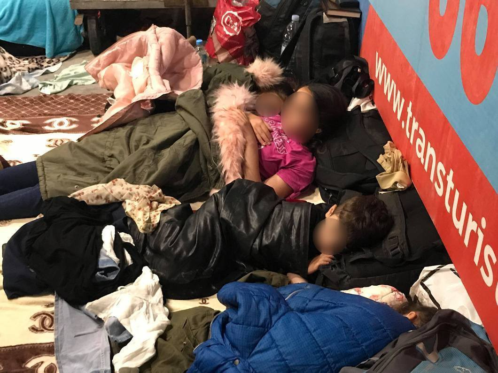
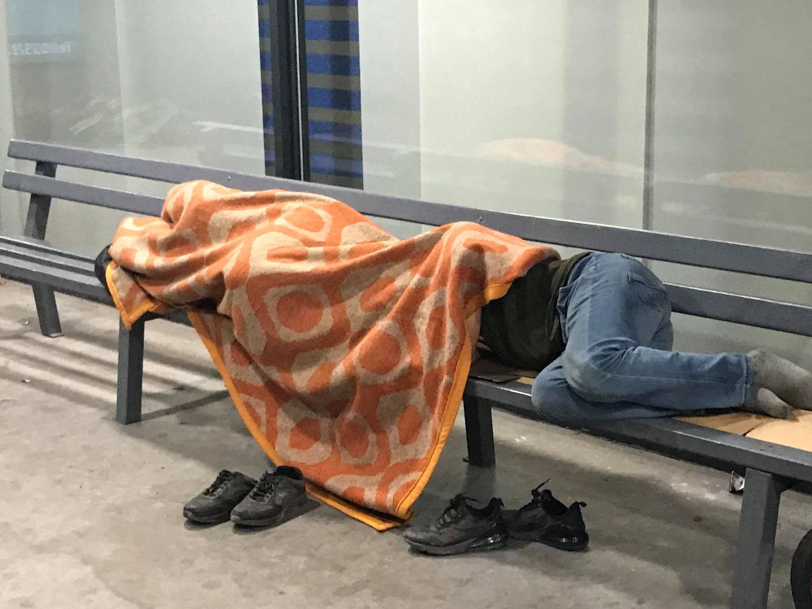

### المزيد والمزيد من الناس يصلون إلى توزلا ، البوسنة والهرسك
#### AYS Weekly News Summary in Arabic, June 24–30

توزلا
### ليبيا

احتجاجات وصيحات طلب المساعدة من مراكز الاحتجاز الليبية

لليوم العالمي للاجئين ، نظم المحتجزون في مركز احتجاز أبو سليم للمهاجرين احتجاجًا\.
### المغرب

نقلت السلطات المغربية يوم الأربعاء قسراً ٢١٥ شخصاً من مدينة الناظور الساحلية إلى تيزنيت ،

وهي بلدة نائية في جبال الأطلس ، وفقًا لقسم الناظور التابع للجمعية المغربية لحقوق الإنسان\.
### البحر

تتحدى سفينة انقاذ خيرية ألمانية على متنها ٤٠مهاجرا السلطات ورست في ميناء جزيرة لامبيدوزا الإيطالية بعد أن كانت في البحر لأكثر من أسبوعين\. قبطان السفينة الألمانية كارولا راكيت ، ٣١ سنة ، ألقي القبض عليه

ونزل المهاجرون الأربعون بعد وقت قصير من رصيف السفينة في وقت مبكر يوم السبت\.

### مالطا

تم انقاذ اجمالى ٣٧ شخصا قبالة ساحل مالطا ونزلوا بسلام يوم الاحد الماضى\.
### إيطاليا
#### سعر سياسة بورتي تشيوسي

تذكر منظمة أطباء بلا حدود المواطنين الإيطاليين والأوروبيين بتكلفة السياسة الإجرامية التي تمنع سفن الإنقاذ من النزول في الموانئ الإيطالية\.

في سنة واحدة من سياسة بورتي تشيوسي \(الأبواب المغلقة\) ، توفي ما مجموعه ١١١٥ شخصًا ، وأُعيد أكثر من ١٠ آلاف شخص قسراً إلى ليبيا ، حيث يتعرضون لمزيد من العنف\.

### البوسنة والهرسك

نشر الاتحاد الدولي لجمعيات الصليب الأحمر والهلال الأحمر \(ا ف ر س\) نشرة إعلامية حول الوضع في البوسنة والهرسك منذ بداية العام\.

المزيد والمزيد من الناس يصلون إلى توزلا ، حيث الظروف صعبة حيث لا توجد أي من المنظمات الدولية\. الأشخاص الوحيدون الذين يعملون على تقديم المساعدات \(الطعام والملابس والمرافق الأساسية\) لكل شخص يمر عبر المدينة ، أثناء انتظار استلام المستندات اللازمة من مكتب الأجانب \(ساعات العمل من الساعة ٩ صباحًا حتى الساعة ١٦ مساءً\) \.

كثير من الناس يعودون من فوخاك ، المعسكر المؤقت الذي أقامه مسؤولو مدينة بيهاتش خارج المدينة ، حيث لا يوجد مكان للاستحمام والاستحمام ، ولا توجد دورات مياه ، ولا متاجر ، ولا أسرة ولا مساعدة طبية\. يقدم الصليب الأحمر المحلي وجبتين بسيطتين في اليوم ، ولكن الظروف هناك تفوق المروعة ، حيث أن الرائحة الكريهة والبعوض وانعدام الأمن والحرية تضيف إلى المخاطر الموجودة في المنطقة — حقول الألغام والعديد من الثعابين والحياة البرية في المنطقة\.

](assets/15fb9cda0c61/1*cgvFj-cSfQEXQ6UK3PiLiw.jpeg)

[Dirk Planert](https://www.facebook.com/dirk.planert?__tn__=%2Cd%2AF%2AF-R&eid=ARDXNUf3Jrf-fp8fRP9RsW23ObOMeW0hDqOVH_mPoUBE5Br26HSb-AypjhrMOBOc7FyIRKI0BQPZ-xQN&tn-str=%2AF)

إذا كنت قاصرًا أو أسرة انتهى بها المطاف في المخيم ، فمن المحتمل أن تقوم المنظمات العاملة داخل مخيم بيرا بإزالتك ونقلك إلى المخيم إذا كان هناك أي مكان\. كما أن المخيم ليس هو المكان الأكثر أمانًا ، وكثير من الأشخاص الذين يتم مواجهتهم في جميع أنحاء المدينة — حتى لو كانوا يحملون بطاقة المخيم — يتم نقلهم إلى فوجيك ولا يُسمح لهم بالتنقل بحرية\.

في فيليكا كلادوسا ، يقيم الكثير من الناس خارج مخيم ميرال ، خاصةً من المغرب العربي ، بسبب المعارك الداخلية الأخيرة في المخيم\. يقدم المتطوعون في كلادوشا المساعدة من خلال المتجر المجاني ، وهناك عيادة صغيرة حيث يقوم المتطوع بمساعدة المصابين بجروح من المشي ، أو الأشخاص الذين يحتاجون إلى ضمادات أو مسكنات للألم ، إلخ\.

البوسنة والهرسك , Ključ

اعتبارًا من٨ يوليو ، سيكون فريق من أطباء بلا حدود \(أطباء بلا حدود\) نشطًا في منطقة كلدوشا والقرى المحيطة بها لمساعدة جميع من هم خارج المعسكرات الرسمية ، وبالتالي هم بلا مساعدة طبية في الوقت الحالي\.
### كرواتيا

لا تزال الشرطة الكرواتية تحمي الحدود مع البوسنة والهرسك بقوة ، وتمولها وتدعمها بقية الدول الأوروبية لمنع الناس من الوصول إلى الدول الغربية الأعضاء في الاتحاد الأوروبي\. من الخطر المرور عبر المناطق التي يحاول فيها معظم الناس عندما يذهبون إلى “اللعبة” ، ويعود الكثير من الجرحى الذين يتعرضون للضرب ، وتتخذ ممتلكاتهم بعيداً عنهم\. هذه الممارسة غير قانونية\.

كل شخص موجود على أراضي بلد ما له الحق في طلب الحماية الدولية — اللجوء ، والعنف العنيف من قبل الشرطة غير قانوني\. إذا واجهت شيئًا كهذا ، فسيكون من المفيد جدًا أن ترسل إلينا شهادتك لأننا نقوم ببناء دعوى ضد معاملة الشرطة ، ونشرنا حتى الآن ٥ تقارير عن عمليات الطرد الجماعي العنيفة\. يمكنك الاتصال بنا على فيسبووك أو عن طريق البريد الإلكتروني\.

**يتوفر أيضًا تطبيق مفيد يخزّن صورتك مباشرةً \(حتى لو أخذ هاتفك لاحقًا\) هنا:**

### سلوفينيا
#### استراتيجية البلد الأولى بشأن الهجرة

في الآونة الأخيرة ، قدم فريق عامل مشترك بين الإدارات يتألف من مختلف الوزارات والشرطة ووكالة الاستخبارات والأمن والمكتب الحكومي لدعم المهاجرين وإدماجهم وغيرهم استراتيجية سلوفينيا الأولى للهجرة في تاريخ البلد\. على الرغم من أن المجتمع المدني قد رحب بالمبادرة ، فقد أعرب الكثيرون أيضًا عن عدم موافقتهم على الإجراء وكذلك مع محتوى الاستراتيجية\.

لم تكن الإستراتيجية تم تنفيذها فقط\. ترك تنسيق العملية لوزارة الداخلية \(بدلاً من مجلس الوزراء على سبيل المثال\) \. وقد انعكس هذا بوضوح في محتوى الوثيقة ، حيث أعدت الشرطة قسمين من أصل ستة أقسام ، ركزت بشكل كبير على “الهجرة غير الشرعية والترحيل” و “الأمن”\. على الرغم من أن الهجرة المنتظمة \(خاصة العمال المهاجرين\) تمثل أعلى نسبة من الهجرة إلى سلوفينيا \(في نهاية ديسمبر ٢٠١٨ ، كان هناك ما مجموعه ١٧٦٠٠٠ أجنبي لديهم تصريح إقامة ساري المفعول\) قسم واحد فقط ، بعنوان “الهجرة القانونية” ، ويتناول هذا المجال\. ثلاثة أقسام أخرى تشمل الحماية الدولية والتكامل والإطار الدولي للهجرة\.

**يتوفر الكثير من الأخبار باللغة الإنجليزية يوميًا على صفحتنا في موقع الميديوم**

**في حال كان لديك أسئلة أو ترغب في نشر معلومات معينة ذات صلة بإجراءات اللجوء أو بلد اخباره مهمة ، يرجى عدم التردد في الكتابة إلينا — إما عن طريق إرسال رسالة إلينا على فيسبوك أو إرسال بريد إلكتروني إلى**

[**areyousyrious@gmail\.com**](mailto:areyousyrious@gmail.com)

_Converted [Medium Post](https://medium.com/are-you-syrious/%D8%A7%D9%84%D9%85%D8%B2%D9%8A%D8%AF-%D9%88%D8%A7%D9%84%D9%85%D8%B2%D9%8A%D8%AF-%D9%85%D9%86-%D8%A7%D9%84%D9%86%D8%A7%D8%B3-%D9%8A%D8%B5%D9%84%D9%88%D9%86-%D8%A5%D9%84%D9%89-%D8%AA%D9%88%D8%B2%D9%84%D8%A7-%D8%A7%D9%84%D8%A8%D9%88%D8%B3%D9%86%D8%A9-%D9%88%D8%A7%D9%84%D9%87%D8%B1%D8%B3%D9%83-15fb9cda0c61) by [ZMediumToMarkdown](https://github.com/ZhgChgLi/ZMediumToMarkdown)._
