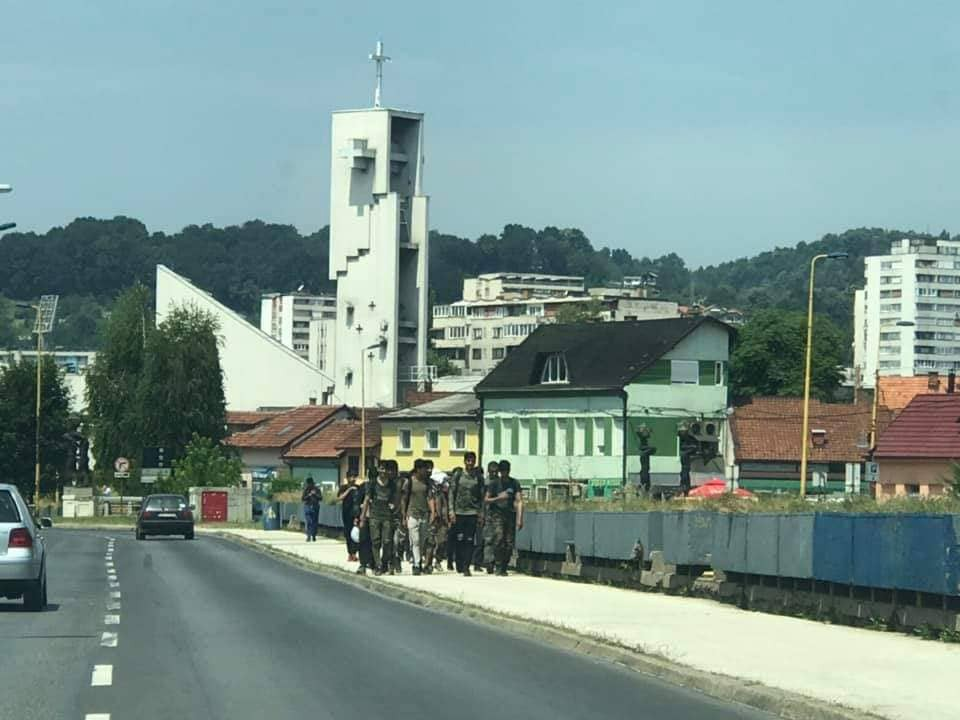
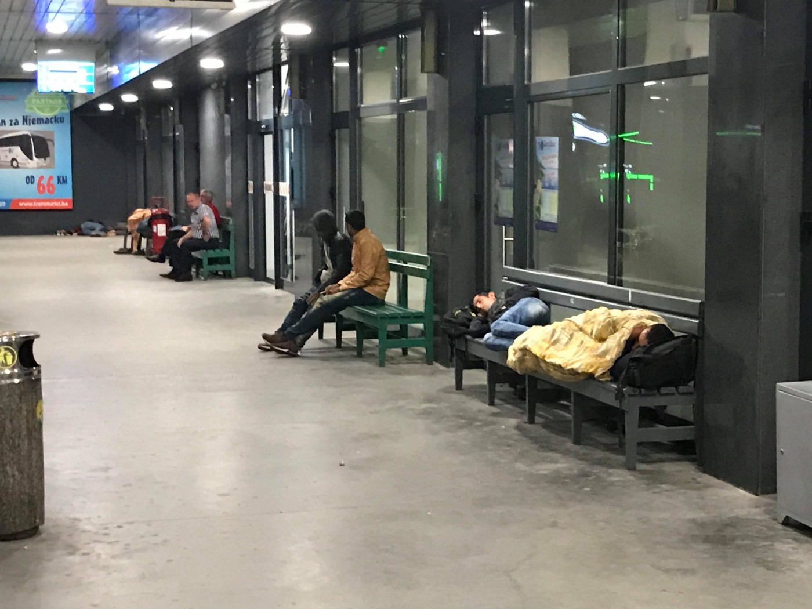
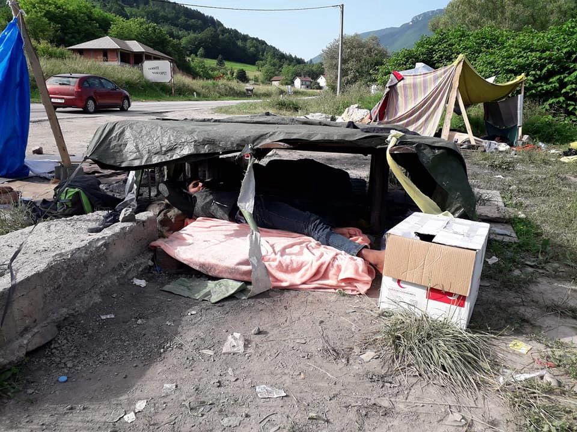

### تعداد بیشتری از مردم به توزلا می‌رسند ,بوسنی و هرزگوین
#### AYS Weekly News Summary in Persian, June 24–30

### **لیبی**

اعتراضات و فریاد کمک از مراکز بازداشت لیبی برای روز جهانی پناهندگان ، افرادی که در بازداشتگاه مهاجران ابو سلیم بازداشت شدند ، اعتراضی را بر روی صحنه بردند \.
### **مراکش**

براساس گزارش گروه نا\.در انجمن حقوق بشر مراکش در چند روز گذشته ، مقامات مراکش به اجبار ۲۱۵ تن را از شهر ساحلی نادر به تیزنیت ، یک شهر دوردست در کوهستان‌های اطلس منتقل کردند \.
### **دریا**

یک کشتی نجات خیریه آلمان با ۴۰ مهاجر سوار کشتی مقامات را شکست داده و در بندر جزیره ایتالیایی پس از اینکه بیش از دو هفته است در دریا بسر می‌برند ، لنگر انداخته‌است \. راکت کارولا ، کاپیتان قایق آلمانی ، در روز ۳۱ ژانویه دستگیر شد \.

این ۴۰ مهاجر به زودی پس از پهلو گرفتن قایق در اوائل روز شنبه پیاده شدند \.

### **مالتا**

در روز یکشنبه گذشته ، مجموعا ً ۳۷ نفر از سواحل مالت نجات یافتند و به سلامت پیاده شدند \.
### **ایتالیا**

هزینه اداره سیاست م\.س\.ف ایتالیا و شهروندان اروپایی را به یاد هزینه جنایی می‌اندازد که کشتی‌های نجات را از پیاده شدن از کشتی در بندرگاه‌های ایتالیا منع می‌کند \.

در یک سال سیاست‌های درهای چیوسی \( درهای بسته \) ، مجموعا ً 1\.151 نفر کشته شده‌اند و بیش از 10,000 نفر به زور به لیبی بازگشته اند و در آنجا در معرض خشونت‌های بیشتر قرار دارند \.

### **بوسنی و هرزگویین**

فدراسیون بین‌المللی صلیب‌سرخ و جوامع هلال‌احمر \( آی\.ف\.ر\.س \) یک بولتن اطلاعاتی درباره وضعیت از ابتدای سال منتشر کردند \.

تعداد بیشتری از مردم به توزلا می‌رسند , جایی که شرایط سخت است چون هیچ یک از سازمان‌های بین‌المللی حاضر نیستند \. تنها افرادی که در حال کار برای تامین کمک \( غذا , لباس و امکانات پایه\) برای هر کسی که از شهر عبور می‌کنند , در حالی که منتظر دریافت مدارک لازم از دفتر کار خارجی‌ها \( ساعات کار ساعت ۹ صبح تا ساعت ۱۶ \) هستند \.

بسیاری از مردم از ووچیاک , اردوگاه موقتی که مقامات شهر بیهاچ در خارج از شهر نصب کرده‌اند , بازگشته اند , جایی که هیچ جایی برای داشتن حمام مناسب , توالت , هیچ فروشگاه , هیچ تخت و هیچ کمک‌های پزشکی وجود ندارد \. صلیب‌سرخ محلی دو وعده غذای ساده در روز ارائه می‌کند , اما شرایط در آنجا فراتر از حد وحشتناک است , چون بوی بد , پشه‌های و فقدان امنیت و آزادی به خطرات موجود در میدان ‌های مین , بسیاری از مارها و حیات وحش در این منطقه اضافه می‌کنند \.

](assets/2d2647447eae/1*cgvFj-cSfQEXQ6UK3PiLiw.jpeg)

[Dirk Planert](https://www.facebook.com/dirk.planert?__tn__=%2Cd%2AF%2AF-R&eid=ARDXNUf3Jrf-fp8fRP9RsW23ObOMeW0hDqOVH_mPoUBE5Br26HSb-AypjhrMOBOc7FyIRKI0BQPZ-xQN&tn-str=%2AF)

اگر شما یک خانواده کوچک و یا خانواده‌ای هستید که در اردوگاه به سر می‌برند ، ممکن است سازمان‌هایی که در اردوگاه بیرا کار می‌کنند شما را از بین ببرند و شما را به اردوگاه ببرند اگر جایی وجود داشته باشد\.

کمپ همچنین امن‌ترین مکان نیست و بسیاری از افرادی که در اطراف شهر می‌بینند — حتی اگر کارت کمپ داشته باشند — به ووچنیاک برده می‌شوند و اجازه حرکت آزادانه را ندارند \. در ولیکا کلادوشا ، بسیاری از مردم خارج از اردوگاه میرال ، به ویژه آن‌هایی که از مغرب هستند ، به خاطر جنگ‌های داخلی اخیر در این کمپ زندگی می‌کنند \. داوطلبان در کلادوشا کمک‌های خود را از طریق یک مغازه رایگان تامین می‌کنند و یک درمانگاه کوچک وجود دارد که در آن یک داوطلب به کسانی که نیاز به باند دارند کمک می‌کند ، یا افرادی که نیاز به باند دارند ، مصرف مسکن و روستاهای اطراف برای کمک به همه کسانی که خارج از اردوگاه‌های رسمی هستند و بنابراین بدون کمک پزشکی به آن‌ها کمک می‌کنند \.

### **کرواسی**

پلیس کرواسی هنوز به شدت از مرز با بوسنی و هرزگوین محافظت می‌کند و توسط بقیه کشورهای اروپایی حمایت می‌شود تا از رسیدن مردم به کشورهای عضو اتحادیه اروپا جلوگیری کند \. عبور از مناطقی که اغلب مردم هنگامی که به “ مسیر ادامه “ می‌روند ، بسیار خطرناک است ، بسیاری از آن‌ها مجروح ، کتک‌خورده و وسایل از آن‌ها گرفته می‌شوند \. این عمل غیر قانونی است \. هر کسی که در قلمرو یک کشور قرار دارد حق دارد تقاضای پناهندگی بین‌المللی کند و فشار شدید نیروهای پلیس غیر قانونی است \. اگر شما چیزی مانند این را تجربه کنید ، بسیار مفید خواهد بود اگر شما بتوانید شهادت خود را برای ما ارسال کنید چون ما در حال ساخت پرونده‌ای علیه عملیات پلیس هستیم و تاکنون ۵ گزارش درباره اخراج جمعی خشن منتشر کرده‌ایم \. با ما در فیس بوک یا از طریق ایمیل ارتباط برقرار می‌کنید \.

**همچنین یک برنامه مفید که مستقیما ً مواد غذایی شما را ذخیره می‌کند \( حتی اگر گوشی شما را بعدا ً بگیرند \) در اینجا در دسترس است** :

### **اسلوونی**

اولین استراتژی کشور در رابطه با مهاجرت اخیرا ً، گروهی متشکل از وزارتخانه‌های مختلف ، پلیس ، اداره استخبارات و امنیت ، دفتر دولتی برای حمایت و ادغام مهاجران و دیگران ، اولین استراتژی اسلوونی برای مهاجرت در تاریخ کشور را ارائه کردند \. اگرچه این ابتکار از سوی جامعه مدنی مورد استقبال قرار گرفت ، اما بسیاری از آن‌ها با این روش و نیز محتوای استراتژی مخالفت کردند \.

نه تنها استراتژی به سرعت انجام شد ؛ هماهنگی این فرآیند به وزارت کشور واگذار شد \( به عنوان مثال ، کابینه نخست ‌وزیر \) \. این موضوع بطور مشهودی در محتوای این سند منعکس شده‌است که در آن دو بخش از شش بخش توسط پلیس تهیه‌شده و عمدتا ً بر “ مهاجرت غیرقانونی و اخراج “ و “ امنیت “ تمرکز دارند \. اگرچه مهاجرت منظم \( به ویژه کارگران مهاجر \) بالاترین درصد مهاجرت به اسلوونی را نشان می‌دهد \( در پایان دسامبر ۲۰۱۸ ، مجموع از 176\.000 خارجی اجازه اقامت معتبر داشتند \) تنها یک بخش با عنوان “ مهاجرت قانونی “ با این زمینه سر و کار دارد \. سه بخش دیگر شامل حفاظت بین‌المللی ، یکپارچه‌سازی و چارچوب بین‌المللی مهاجرت است \.

**اخبار بیشتری به انگلیسی در صفحه رسانه ما در دسترس است \. در مواردی که شما سوالاتی دارید و یا مایلید برخی اطلاعات مربوط به روند پناهندگی شما یا کشور مورد نظر را منتشر کنید , لطفا ً برای نوشتن پیغام روی فیس بوک یا نوشتن یک ایمیل به آر\.یو\.س تردید نکنید**

[**areyousyrious@gmail\.com**](mailto:areyousyrious@gmail.com)

_Converted [Medium Post](https://medium.com/are-you-syrious/%D8%AA%D8%B9%D8%AF%D8%A7%D8%AF-%D8%A8%DB%8C%D8%B4%D8%AA%D8%B1%DB%8C-%D8%A7%D8%B2-%D9%85%D8%B1%D8%AF%D9%85-%D8%A8%D9%87-%D8%AA%D9%88%D8%B2%D9%84%D8%A7-%D9%85%DB%8C-%D8%B1%D8%B3%D9%86%D8%AF-%D8%A8%D9%88%D8%B3%D9%86%DB%8C-%D9%88-%D9%87%D8%B1%D8%B2%DA%AF%D9%88%DB%8C%D9%86-2d2647447eae) by [ZMediumToMarkdown](https://github.com/ZhgChgLi/ZMediumToMarkdown)._
