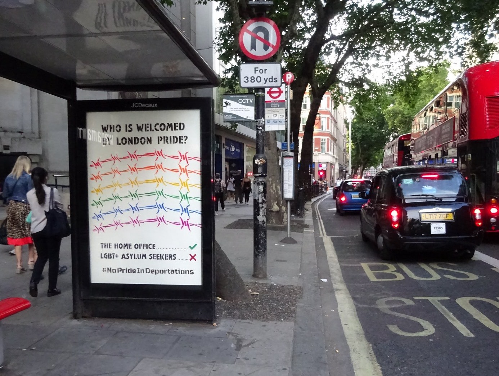
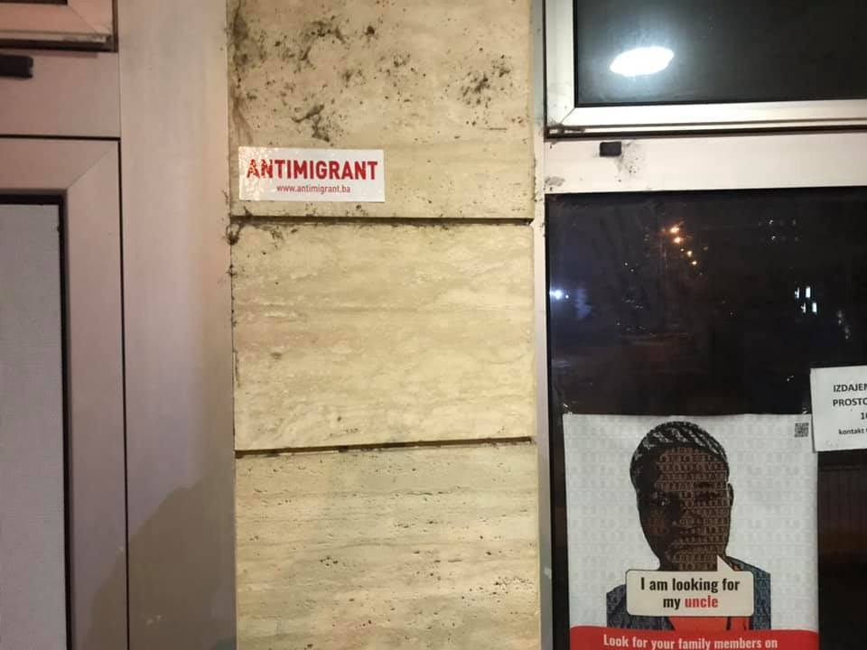
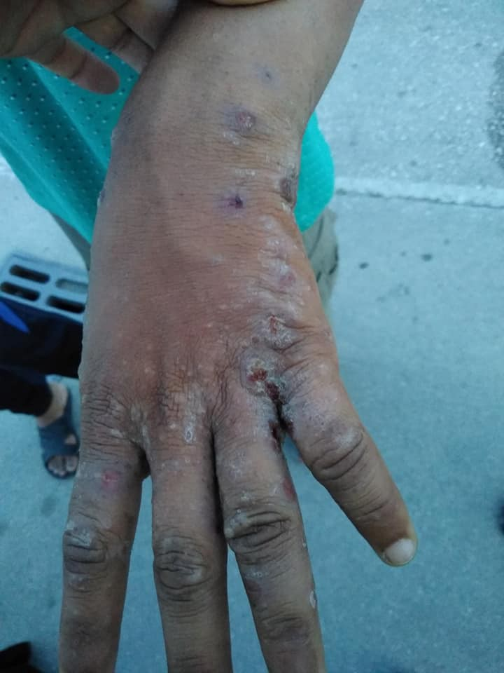

### AYS Weekend Digest 6–7\.7\.2019: What to be ashamed of at London Pride

_The Shame of Pinkwashing // Over 500 people killed by airstrikes in Syria in last two months // Increased presence and desperate need for support across the Western Balkans // Protest against unsafe detention in Libya enters third day…_

Photo Credit: Lesbians and Gays Support the Migrants\.

Numerous members of the LGBT community have pointed out the extreme hypocrisy of the UK Home Office’s attempt to pinkwash its actions\. Help Refugees pointed out that recently the high court ruled that the Home Office’s fast\-track detention/deportation program was unfair\. This program is what resulted in a lesbian woman being deported to Uganda, where being LGBT is illegal\. In spite of the Home Office’s [nauseating overtures and draping their brand in rainbow flags](https://www.facebook.com/HelpRefugeesUK/photos/a.123267671367248/889363831424291/?type=3) , they still are fighting this decision\.

The Home Office became increasingly draconian and oppressive against LGBT asylum seekers under Theresa May’s government, causing a justifiable backlash when she posted this saccharine tweet\.

■■■■■■■■■■■■■■ 
> **[Theresa May](https://twitter.com/theresa_may) @ Twitter Says:** 

> > I will only be your Prime Minister for a few more weeks. But I will be your ally for the rest of my life.

#Pride⁠ ⁠#PrideInLondon⁠ ⁠ 

> **Tweeted at [2019-07-06 13:17:24](https://twitter.com/theresa_may/status/1147494759361122304).** 

■■■■■■■■■■■■■■ 

Commenters pointed out that it was under her leadership that LGBT asylum seekers [deported to Afghanistan were simply given the advice to “act straight\.”](http://www.npwj.org/content/Deported-gay-Afghans-told-%E2%80%98pretend-be-straight%E2%80%99.html) For the rest of their lives\. Several notable cases wherein LGBT asylum seekers were deported, or their deportations were halted at the very last minute, thanks to terrifyingly stringent policies\. Similar to those in Austria where a man was denied asylum in 2018 as he did not “act gay” enough\. This broader issue of having to prove one’s sexuality through a particular aesthetic or through performing stereotypes is more often then not just an excuse\. There are also cases where people are denied asylum based on not seeming traumatized enough or for seeming performatively traumatized\. Gut feelings are obnoxious enough for door policies, but are deadly when it comes to someone’s life or death asylum case\.

LGBT asylum seekers face discrimination and harassment from inside of and outside of the refugee community\. Their persecution is leveraged by “pro\-LGBT” nationalist movements throughout Europe to justify attacks on their countries of origin and to justify stricter immigration controls\. Let us not forget that the now\-disgraced white nationalist former editor of Breitbart Milo Yiannopoulos is an openly gay man, who regularly invokes anti\-LGBT discrimination as justification for Islamophobia\. The establishment will always seek to tokenize members of a marginalized community, either to add a faux\-progressive glaze onto their bigotry or to serve as a “human shield” from criticism\.

In this vein, various activist groups such as The Outside Movement and Lesbians and Gays Support the Migrants [“hacked” bus stops](https://www.facebook.com/lgsmigrants/photos/a.1651205455149282/2381634555439698/?type=3&theater) along the route of London Pride this year, highlighting corporate entities or oppressive government structures participating in Pride to attempt to pinkwash their way out of accountability\.

_“While the Home Office are celebrated on Pride in London, the LGBT\+ migrants that they have dehumanised, detained and forced to live in fear of deportation are forced to watch from the sidelines\.”_

Additionally after outspoken criticism, UK Black Pride rescinded the permit to the UK Home Office to participate in UK Black Pride with a booth\. For LGSM’s statement on this, go [here](https://www.facebook.com/lgsmigrants/posts/2381088488827638?hc_location=ufi) \.

For a detailed explanation of the interaction between oppressive structures, whether corporate or governmental, [we gladly refer you to this fantastic article](https://www.huckmag.com/perspectives/opinion-perspectives/those-complicit-with-oppression-have-no-place-at-pride/) \.

No pride in deportations\.
### SYRIA

At least 130 children were killed over the last two months as part of the Russian\-SAA airstrikes on Idlib\. The total number of civilians killed during this campaign is 544\. Although Russia and Syria deny targeting or neglecting to avoid civilian areas, there is confirmation that most medical facilities in the city have been decimated\.

For more, go [here](https://www.independent.co.uk/news/world/middle-east/syria-russia-civilians-130-children-dead-death-toll-idlib-hospitals-cluster-bombs-a8992096.html?utm_medium=Social&utm_source=Facebook#Echobox=1562502128) \.
### GREECE

> One boat landed on Lesvos with 31 people on the weekend\. 

Source: [Aegean Boat Report](https://www.facebook.com/AegeanBoatReport/photos/a.285312485325196/607606949762413/?type=3&theater)

Refugee Biryani and Bananas posted a photoset showing the horrific conditions in Vial camp\. Now called “Vial Jungle”, Calais has spread all across Europe, with impromptu tents and shelters being erected in the absence of sufficient support\.

Photo credit; Refugee Biryani and Bananas

If you wish to help, donate [here](https://www.facebook.com/RefugeeBiriyaniAndBananas/photos/pcb.1345818315576231/1345812942243435/?type=3&theater&ifg=1) \.

Additionally Arash Hampay has posted a video with the report from a man discussing the despicable conditions on the Nea Kavala camp near Thessaloniki:

■■■■■■■■■■■■■■ 
> **[Arash Hampay](https://twitter.com/ahampay) @ Twitter Says:** 

> > 2/2

Mohammed from Syria speak about situations of nea kavala camp in Greece!
#RefugeesWelcome #refugees #refugeesgr #noborder #greece #neakavala https://t.co/7KgJY63bkH 

> **Tweeted at [2019-07-06 16:58:50](https://twitter.com/ahampay/status/1147550485601275906).** 

■■■■■■■■■■■■■■ 

#### VOLUNTEER OPPORTUNITIES:
#### The Med’EqualiTeam is in need of volunteer interpreters on Samos

_We treat refugees from Vathy camp, where the population is at least 3500\. The camp was made for 650 people, and there is only one doctor present in the camp\. The location of work is in Vathy with 6 consultations rooms, one wound dressing room, and a big waiting area\. We see up to 130 patients a day\._

_\* \*We are looking for serious and commited volunteers to join and help during the medical consultations, for the numerous patients coming from Syria, Iraq, Afghanistan, Congo, Cameroon, etc\. \* \*_

_\* \*Requirements:\* \*_

_• Enough knowledge to translate from English to either Farsi or Arabic, since these are the most spoken languages\. If apart from one of the above mentioned languages you also speak Sorani, Kurmanji, Pashto, Urdu, Somali, Amharic, Tigrinya, Greek or any other languages that are spoken in the camp, it would be extremely useful_

_• Intermediate English level\. The more fluent the better of course, but it is more important that you are fluent in the native language of our patients\. As long as you think you have a good understanding of English and are able to express yourself on an intermediate level to the English speaking members of the team in order to provide a clear medical consultation, then that is what we are looking for\!_

_• Realisation that translating medical consultations is an intense job for which you need a lot of patience\. Due to the circumstances patients might be unfocused, frustrated, angry, or emotional in a different way\. You will see some patients with mental health problems which might cause consultations to be intense\. Also, due to traumatic events the patients have been through, the stories you translate might affect you\. As a team, we will always do everything in our power to support each other when someone feels the need to share feelings that are caused by the work we do\._

_• Always ensure patient confidentiality\. Everything that is discussed inside the consultation room should not be shared with anyone except for the doctor, the patient and you as a translator, unless decided otherwise with the consent of the patient\. It is a small community, and one of our priorities is that the patients trust us\. This is a big responsibility which we should ensure with all members of the team\._

_\* \*Assets:\* \*_

_• Previous experience with working with displaced people_

_• Knowledge/experience about mental health problems in patients with a refugee background_

_\* \*Further informations :\* \*_

_The working hours will be during the day, currently 6 days a week \(Thursday off\) from 7am to 3pm, but they are somewhat flexible\. Each volunteer can also ask for an extra day off every 10 days\._

_\* \*Conditions:\* \*_

_Because we are a grassroots organisation, we want to use all our funds for the direct benefit of our patients\. That is why we work with volunteers, and why we ask you to cover your own expenses such as your travel and food costs\. Accommodation is secured with the exception of August\. We rent a shared house on Samos where you can stay for a tiny fee\. Accommodation can also be arranged privately and it's not expensive\. Distances on Samos are short so you will have no transportation costs for work\-related travel\. You must ensure your own insurance\._

_\* \*To learn more, send us a message or email us at volunteer@medequali\.team\* \*_
#### Asylum Seekers Information Services Team, Chios is in need of volunteers\. Apply [here](https://www.facebook.com/groups/1666846223566047/permalink/2273871942863469/?hc_location=ufi) \.

_“Do you share our passion for Fair Process? Do you want to contribute to make the application process for asylum seekers seeking international protection more accessible?_

_As our Volunteer, you will support asylum seekers seeking international protection\. These are some of the most disadvantaged people in the EU soil\._

_You will assist them to exercise their rights to information, to fair process; and to ensure individuals are fully aware of their rights and be prepared for one of the most important interviews in their lives, whether they will be able to seek international protection\._

_Join our mission to improve the access to justice for vulnerable individuals because:_

_Every individual has the right to a Fair Process… has the right to Information and Legal Aid\.”_
#### Khora in Athens also needs volunteers\.

_“We are in need of some more volunteers to join us at Khora\. We are are waiting any day for our KITCHEN to be up and running and will need help there as well as in the FREE SHOP asap\. Please if you have some time or know anyone that would be interested let them know\. It would also be very nice to have some volunteers with experience working with mental health\._ 
_You can contact us for more information on Facebook, by email; khora\.athens@gmail\.com or feel free to drop into the shop at Asklipiou 113 in the week days\. Thank you”_
### Western Balkan Region

Info park has identified 53 new arrivals to _Belgrade, Serbia_ \. [Asylum Protection Centre](https://www.instagram.com/p/Bzf2r52i49K/?igshid=xk49lwhj8edb) is also reporting an increase in new arrivals to Serbia, with new arrivals particularly congregating in parks\.

There was a disturbing incident where six underage boys came to Info Park after a failed attempt to cross the Hungarian border by boat\. The boat began to sink, and they were pulled out of the river by the police, who heard their calls for help\. The adults in the group are prohibiting the minors from going to an official facility and one of the boys is in need of medical attention\. Info Park is referring them and providing what assistance is possible\.

In _Tuzla, Bosnia_ , there has been a growing number of people arriving during the weekend and the local volunteers are overwhelmed as they have been providing meals, clothes, medical first aid and all kinds of help to those in need, day in day out, for months and months now\.

The mayor has reportedly said that “there is no welcome for them in Tuzla”, in spite of the fact that these Tuzlans have shown great heart struggling to welcome everyone they could with warm food, hugs, and whatever is needed\. No international organization seems to find it necessary to establish a local team in Tuzla or to provide other types of support for the hundreds that are really hard to ignore as they’re all sleeping rough while in Tuzla\.

Photo Credit: Senad Cupo, fb\. Anti\-migration stickers appear in Tuzla\. The website appears to have existed since June 2018

Another fight they keep fighting is the one with their fellow Tuzlans who have been additionally influenced by the biased reporting lately and the overall situation, so the anti\-sentiment is also more present but the volunteers in Tuzla don’t give up\. If you can support them \(they are a group of individuals, not an organization\), it would be of great help, let us know and we will connect you to the right people\.

Near Bihać and the newly “established” “camp” in Vučjak, Udruženje Solidarnost Bosnia is providing support to the hundreds of people there\. They report on the squalid conditions and the pervasive skin diseases that are resulting from the unsanitary living situation\. They are in need of donations in order to provide medication to these serious skin conditions: Please contact them [here](http://Udruženje Solidarnost - Bosnia) \.

Photo Credit: Udruzenje Solidarnost Bosnia

Finally, at the [Italian\-Slovenian border](https://www.facebook.com/permalink.php?story_fbid=2334492126643740&id=1245970425495921&__tn__=-R) , where there was a recently announced increased collaboration between border police forces, a group of people was intercepted in Gorizia\. 16 of them were returned to Slovenia as part of the bi\-lateral agreement\. One of them, a minor, is now in the care of the relevant authority in Italy\.
### MEDITERRANEAN AND ITS SURROUNDINGS

In response to the horrific airstrike on the Tajoura detention facility in Libya, which killed dozens, prisoners of the detention facility held a protest\. They are sleeping outside, some are refusing food, demanding to be evacuated\.

■■■■■■■■■■■■■■ 
> **[Sara Creta](https://twitter.com/saracreta) @ Twitter Says:** 

> > Our brothers died.
UN is just watching, doing nothing. 
We are not animals. 

2 years in prison 
Is that what you call humanity?
Is that what you call justice?

We need freedom.
we are human beings. 

#Refugees from #Eritrea #Somalia #Yemen #Sudan in #Tajoura detention center. https://t.co/eRAu7YMmqs 

> **Tweeted at [2019-07-06 16:09:33](https://twitter.com/saracreta/status/1147538082251661315).** 

■■■■■■■■■■■■■■ 

[Sally Hayden reports that residents](https://twitter.com/sallyhayd/status/1147875724889600002) have told her that their detention cells are located next to a weapons cache, making them an even more deadly target for air raids\.

■■■■■■■■■■■■■■ 
> **[Sally Hayden](https://twitter.com/sallyhayd) @ Twitter Says:** 

> > Messages today from survivors of the Tajoura air strike still trapped in the detention centre. They’ve been sleeping outside since Tuesday & say air strikes are still happening around them. They’re asking for help from UNHCR. https://t.co/zuEUX4lcN8 

> **Tweeted at [2019-07-06 09:41:13](https://twitter.com/sallyhayd/status/1147440354834243584).** 

■■■■■■■■■■■■■■ 

Sara Creta also reports on how the whole world saw and condemned the attack but how with no further action, nothing is better\.

■■■■■■■■■■■■■■ 
> **[Sara Creta](https://twitter.com/saracreta) @ Twitter Says:** 

> > All the world saw #Tajoura attack, many states condemned it, but none offer a solution.  

450 people from #Sudan #SouthSudan #Eritrea #Somalia #Ethiopia #Syria & #Yemen are still  sleeping outside. “We need a safe solution. We started hunger strike. We want to get out of here.†https://t.co/0N9E3MrbEY 

> **Tweeted at [2019-07-07 14:57:47](https://twitter.com/saracreta/status/1147882407405731845).** 

■■■■■■■■■■■■■■ 

Meanwhile, a sadly predictable shuffle in the Mediterranean\. The charity run ship, the Alex, decided to port in Lampedusa in spite of warnings by the Italian government\. [After hours of waiting as security officers reviewed the situation, 41 people aboard disembarked](https://www.bbc.com/news/world-europe-48896038) \.

The hotspost on Lampedusa [has exploded recently, having 223 people, up from the 93 it had before](https://twitter.com/alessandrazinit/status/1147786723457478656) \. Salvini insists that autonomous landings are on the decrease, but this is in direct contradiction to the truth\. Another landing from Tunisia noted here:

■■■■■■■■■■■■■■ 
> **[Mediterranean Hope](https://twitter.com/Medhope_FCEI) @ Twitter Says:** 

> > 🔴 #Lampedusa. Sbarco autonomo nei pressi di Cala Galera. Alle 19.00 sono stati rintracciate a terra 10 persone originarie della #Tunisia. https://t.co/cRRRFUQGgT 

> **Tweeted at [2019-07-07 17:28:06](https://twitter.com/medhope_fcei/status/1147920237314105345).** 

■■■■■■■■■■■■■■ 

Additionally, more people are expelled onto the street thanks to the Salvini decree which makes it increasingly harder for anyone seeking asylum or without proper paperwork to have legitimate shelter or protection\. For more, in Italian, go [here](https://milano.corriere.it/19_luglio_07/milano-tornano-bivacchi-stazione-espulsi-centri-profughi-ea4d691e-a091-11e9-b20c-12356eab285e.shtml?refresh_ce-cp=) \.

The rescue ship ‘Alan Kurdi’ which was following the Alex, opted not to go to Lampedusa after the tense notification from Salvini that they would not be allowed to port, instead going to Malta\. The Maltese government allowed the 65 people to disembark, but they will not stay on Malta, instead being put into the [EU wide relocation program](https://twitter.com/Reuters/status/1147956236467527680) \.

**We strive to echo correct news from the ground through collaboration and fairness\. Every effort has been made to credit organizations and individuals with regard to the supply of information, video, and photo material \(in cases where the source wanted to be accredited\) \. Please notify us regarding corrections\.**

**If there’s anything you want to share or comment, contact us through Facebook or write to: areyousyrious@gmail\.com**

**If you are interested in becoming involved in AYS, please don’t hestiate to contact us\. We are always excited to share perspectives with those who are intent on shining a light and boosting the voices of those at the margins\. :\)**

_Converted [Medium Post](https://areyousyrious.medium.com/ays-weekend-digest-6-7-7-2019-what-to-be-ashamed-of-at-london-pride-16c36db8391) by [ZMediumToMarkdown](https://github.com/ZhgChgLi/ZMediumToMarkdown)._
