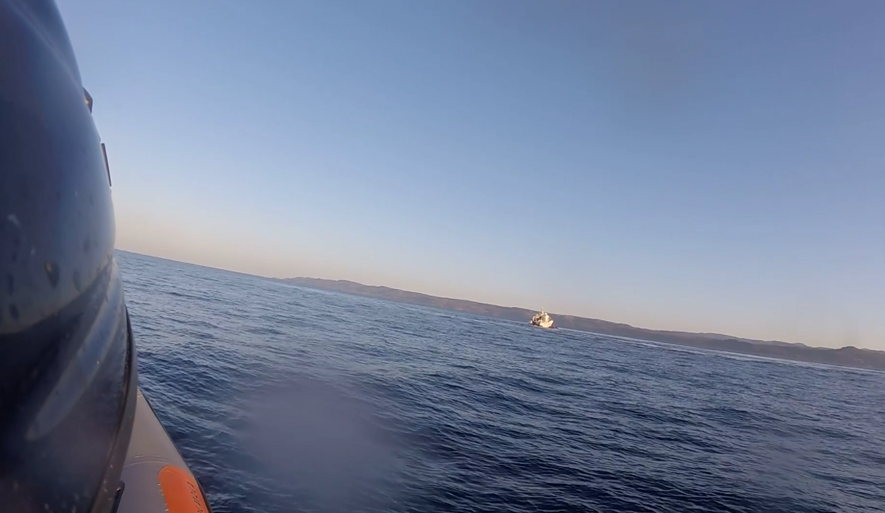

### AYS News Digest 9/7/19: Frontex watches illegal pushback, report says
#### Video published off Lesvos documenting dangerous maneuvers of the Turkish Coast Guard in Greek waters / Mineo camp in Italy closed / 350 detainees in Libya released, UNHCR promises to help / Field report from Calais and Dunkirk

Photo: Screenshot/Refugee Rescue
### Greece: Pushback witnessed off Lesvos

Refugee Recscue / ‘Mo Chara’ and Lighthouse Relief reported about a suspected pushback by the Turkish Coast Guard in Greek waters on 2nd July\. “Dutch and Portguegese Frontex vessel were on scene within visual distance, and stood by without interfering,” both NGOs reported in a joint statement\.

They also criticize, that the TCG performed dangerous maneuvers, which could have caused the small vessel to capsize\.

> “Mo Chara witnessed the passengers screaming in response to the agression\. More than one person jumped into the sea\.” 

In the end, the people were rescued and the boat towed back on Turkish land\.

Now, both demand a full investigation of the incident\. An eye\-witness testimony of two volunteers can be found [here](https://scontent-frx5-1.xx.fbcdn.net/v/t1.0-9/66478246_2308768589190578_9084198646739632128_n.jpg?_nc_cat=107&_nc_oc=AQkOOiG9QBhx0kLr8lZ4h827gTws5N4B3vX5d98zqwB7WpKxVI95toWOw4K2sDT2ligJfXLuIQdjpY1ohXAjREat&_nc_ht=scontent-frx5-1.xx&oh=133e964083be38ac5ca35174eccf5bac&oe=5DB6DBEF) \.

In the recent [weeks](http://watchthemed.net/reports/view/1172) and [months](https://alarmphone.org/en/2019/05/21/the-mediterranean-border-mass-abductions-push-backs-people-left-to-die/) , there [have](https://alarmphone.org/en/2019/05/04/people-refugees-push-back-samos-turkey-greece-coast-guard-refoul-alarm-phone-border-control/) been numerous cases of documented pushbacks \(also on the land route\) \. At the same time, some 160 people arrived on the Greek islangs today, [according](https://www.facebook.com/AegeanBoatReport/posts/608734742982967?hc_location=ufi) to Aegean Boat Report\.

■■■■■■■■■■■■■■ 
> **[Veysel Cebe](https://twitter.com/Veysel_Cebe) @ Twitter Says:** 

> > A total number of 63 people from Turkey have been pushed back between April 23 and May 5, after they arrived in Greece through Evros. 44 of them detained/arrested back home by Turkish security forces/courts. #StopPushBacksInGreece #deport #pushback https://t.co/PrKefnlkTs 

> **Tweeted at [2019-05-05 10:40:50](https://twitter.com/veysel_cebe/status/1124987309974335488).** 

■■■■■■■■■■■■■■ 

#### More needs to be done for inclusion

In a housing [report](https://rosalux.gr/sites/default/files/publications/katoikia_en_final.pdf) , the Rosa Luxemburg Foundation also shifts the focus on the conditions of refugees in Greece\. “ The housing of migrants in Greece was never the subject of public policy,” the study concludes, seeing that the country needed to take care of some 60,000 people after the borders were shut down\. But still they the need for a strategic planning for a long term inclusion of all the people\.

■■■■■■■■■■■■■■ 
> **[Nikolas Georgiou](https://twitter.com/mpodil) @ Twitter Says:** 

> > In other news, away from the greek national elections, #refugees at the Olive Grove, next to #Moria camp in Lesvos, live in filthy conditions and soaring temperatures makes things even direr. #Greece #refugeesgr https://t.co/reKWmyFY8T 

> **Tweeted at [2019-07-09 12:57:42](https://twitter.com/mpodil/status/1148576964778831873).** 

■■■■■■■■■■■■■■ 

#### Migration Ministry renamed

Many people and groups highlight, that the election in Greece likely will also impact the migration and foreigner policy of the country\. In a first step, the Minsitry of Migration has been [integrated](https://www.keeptalkinggreece.com/2019/07/09/migration-ministry-citizen-protection-greece/) into the Ministry of citizen protection\. “The allocation of departments already shows that migration is regarded as a threat in Greece,” Equal Rights Beyond Borders [comments](https://www.facebook.com/EqualRightsBB/posts/2317646801684431?hc_location=ufi) \.

#### Provisional agreements

Meanwhile, EU’s Migration and Home Affairs Commissioner, Dimitris Avramopoulos called for “provisional agreements” between EU member states in order to deal with rescued people until a reform of the Dublin system\. “The challenges of migration cannot only be the responsibility of Italy and Malta simply because these states are located on the Mediterranean,” Avramopoulos told Die Welt newspaper \(via [Ekathimerini](http://www.ekathimerini.com/242367/article/ekathimerini/news/avramopoulos-calls-for-provisional-agreements-between-eu-states-on-rescued-migrants?fbclid=IwAR1RjyTypSsjYVMKWsEx3VDSTHMjbxyVG8HUzti2xDTvtWuiJCYYoSC8cIs) \) \.
### Belgium: One person dies on highway

A young man died some days ago at the on the way to Rotterdam, getting the voice out [reports](http://www.gettingthevoiceout.org/death-at-the-border-of-an-exile-based-in-belgium-8-july-2019/?fbclid=IwAR0l_fJrJmpI43_wDRdvTRLdjJZu7x3RP5jDilom2YvsIlnBbmi_Daxje5M) \. According to the blog, Geri died on the highway\. It is not sure, if he jumped out the lorry as the driver was about to be controlled by police\. Others say, the felt out as the driver accelerated and throttled in order to make the people stay in the lorry without raising anyone’s attention\.
### Italy: Mineo camp closed

The Mineo reception center on Sicily has been officially shut down now with a visit of Italy’s far\-right interior minister Matteo Salvini\. In 2014 the camp became famous for being the largest in Europe with more than 4000 people; at the moment it is [Lesvos](http://mindigital.gr/index.php/%CF%80%CF%81%CE%BF%CF%83%CF%86%CF%85%CE%B3%CE%B9%CE%BA%CF%8C-%CE%B6%CE%AE%CF%84%CE%B7%CE%BC%CE%B1-refugee-crisis/4015-national-situational-picture-regarding-the-islands-at-eastern-aegean-sea-18-06-2019) with more than 5000 people\.

■■■■■■■■■■■■■■ 
> **[Amien Essif](https://twitter.com/AmienEssif) @ Twitter Says:** 

> > Protests against #Salvini’s immigration “crackdown” as he fomally closes what was once Europe’s largest refugee camps. #Mineo https://t.co/Pc8J7c7TTh 

> **Tweeted at [2019-07-09 13:48:30](https://twitter.com/amienchicago/status/1148589748157636610).** 

■■■■■■■■■■■■■■ 

However, lately only some 150 people have been housed, according to Ansa/Aljazeera, while 400 people were employed at the camp\. “Mineo’s Mayor, Giuseppe Mistretta, has threatened to resign if the state does not help with the post\-migration transition,” the news channel [reports](https://www.aljazeera.com/news/2019/07/italy-salvini-closes-europe-largest-migrant-centre-190709141806722.html?fbclid=IwAR2oRgLT4loLAvhF8uofT1iZZkfkGJZwuDbLXV4mN-j8DwP37ODfP8ZSv-A) \.

MEDU [welcomes](https://www.facebook.com/MEDUonlus/posts/10157350693809817?hc_location=ufi) the closure itself, but criticizes some practices of it: For example the NGO complains, that most of the vulnerable people were transferred to camp in Isola die Capo Rizzuto, which has similar conditions like Mineo\. Centers for vulerable cases in the area were about to open\. Additionally, some 30 people were left abandoned and only did not end up on the streets thanks to the local church\. Anoher person with psychological was abandoned in the night from 6th to 7th July and another one has been missing\.

■■■■■■■■■■■■■■ 
> **[Medici per i Diritti Umani (MEDU)](https://twitter.com/MEDUonlus) @ Twitter Says:** 

> > Chiude il CARA di #Mineo. Perché MEDU oggi non può festeggiare
[mediciperidirittiumani.org/chiude-il-cara…](https://mediciperidirittiumani.org/chiude-il-cara-di-mineo-perche-medu-oggi-non-puo-festeggiare/) https://t.co/hRxB7Yj2UP 

> **Tweeted at [2019-07-09 15:28:44](https://twitter.com/meduonlus/status/1148614971485560833).** 

■■■■■■■■■■■■■■ 

Intersos recently [published](https://www.intersos.org/wp-content/uploads/2019/07/Scheda-accoglienza-MSNA-dopo-i-18-anni.pdf) a report, analysis the 2018 law about the recognition of minors\.

### Sea: Higher fees for sea rescue

Italian media report about a couple of changes with regards to sea rescue\. According to [Ansa](http://www.ansa.it/sito/notizie/politica/2019/07/09/dl-sicurezza-emendamento-lega-multe-a-ong-fino-a-1-milione_735bb312-87a0-4a00-a8e4-d989de40d116.html?fbclid=IwAR0ZXbWrbMBLCsbk1uF24rXKO21EF_cmLxVpRaHGCt75_EVP2W1kx55k4m0) , fees can now be risen to up to one million Euro for NGOs who disobey the law\. At the same time the Italian navy shall be deployed to the sea in order to prevent such NGOs from entering Italian waters, la Republicca [adds](https://www.repubblica.it/cronaca/2019/07/08/news/migranti_navi_militari_a_difesa_dei_porti_italiani_e_nuovi_accordi_con_libia_e_tunisia_per_fermare_le_partenze-230732707/?fbclid=IwAR3s7CLI8jstqOwRjBcShxjUumpMn_6nm2DBnXW4lsHWHKumEjA8YInJr6U) \. Guardia fi Finanza meanwhile rescued 47 people and brought them on shore\.

■■■■■■■■■■■■■■ 
> **[Migrant Rescue Watch](https://twitter.com/rgowans) @ Twitter Says:** 

> > 🔴#SAR Op 09.07.19 - Libyan Coast Guard currently responding to 1 boat in distress with ca. 60 #migrants on board #Migrantcrisis #TogetherForRescue #UNHCR #Seenotrettung #SeaWatch3 #fluechtlinge #Refugees #LibyscheKüstenwache #Frontex #Europol #EU 

> **Tweeted at [2019-07-09 17:22:14](https://twitter.com/rgowans/status/1148643537468174339).** 

■■■■■■■■■■■■■■ 

### Hungary: Analysis on legal changes

The Hungarian Helsiniki Committee \(HHC\) released a report analysing the situation in the country since the legal chamges one year ago:

> This past year saw threats of imprisonment up to one year for those who assist asylum\-seekers; the automatic rejection of almost all asylum claims; deliberate starvation of detainees in the transit zones; attempted deportations to the country of origin of applicants whose claims were never examined on their substance; and finally, the re\-integration of the asylum authority into the Policeand the dissolution, after two decades, of the Immigration and Asylum Office\. 

[www\.helsinki\.hu/wp\-content/uploads/One\-year\-after\-2019\.pdf](http://www.helsinki.hu/wp-content/uploads/One-year-after-2019.pdf)
### Libya: 350 people leave Tajoura centre

350 people of the Tajoura centre, which has been attacked last week, have been released now, according to [la Repubblica](https://www.repubblica.it/esteri/2019/07/09/news/libia_il_governo_libera_350_migranti_del_centro_profughi_bombardato-230818892/?ref=fbpr&fbclid=IwAR2oi7x3vhlk0DiwgkB7imFccFaI4waqRXuc1PSYliVudqyJ4DDTY1YNaBs) \. Journalist Sally Hayden and UNHCR Libya in the morning confirmed the news\. While Hayden said, people started walking to a UNHCR centre by themselves as they did not know where to go, the UN body promised to provide assistance through its urban response programme\.

> To be clear: the word “released” in a Libyan detention centre context can mean being kicked out in the middle of a war zone with no protection, no money, & no help\. It’s always necessarily to investigate further\. 

■■■■■■■■■■■■■■ 
> **[Sally Hayden](https://twitter.com/sallyhayd) @ Twitter Says:** 

> > There were also refugees/migrants left behind in Tajoura dc. Three sources all saying guards fired on them to try force them inside halls again, but it now sounds like no one was injured. https://t.co/wzoAXXOq7s 

> **Tweeted at [2019-07-09 20:56:03](https://twitter.com/sallyhayd/status/1148697345472774150).** 

■■■■■■■■■■■■■■ 

### France: Field report from Calais and Dunkirk

Help Refugees published a report focussing on the situation in Calais und Dunkirk since the eviction of the Calais jungle\. “We can see that the French state has still not been able to guarantee dignified living standards to displaced people in Northern France,” the organisation summarizes\. They criticize the violation of fundamental human rights\.

> “The living conditions for them in France serve only to add to their accumulated trauma\.” 

And once again, there has been an eviction in Calais this morning, says [Care4Calais](https://www.facebook.com/care4calais/posts/2560690540630554?hc_location=ufi) \. Around 30 people are said to have been arrested\.

### Denmark: 19000 Euro for leaving the country

These days, several people in Denmark receive the offer of a repatration support\. The government in letters offers some 18\.700 Euro plus travel expenses, if people return to their country of origin \(or the one of their parents\), [Euronews](https://de.euronews.com/2019/07/07/danemark-ruckfuhrhilfe-bei-fremden-wurzeln) found out\. In 2018 360 people made use of it\.
#### AYS and the Daily News Digest — how to get involved

**We strive to echo correct news from the ground through collaboration and fairness\. Every effort has been made to credit organizations and individuals with regard to the supply of information, video, and photo material \(in cases where the source wanted to be accredited\) \. Please notify us regarding corrections\.**

**Apart from daily news in English, we also publish weekly summaries in Arabic and Persian\. Find specials in both languages on our [medium site](https://medium.com/are-you-syrious/ays-weekly-in-arabic-and-persian/home) \.**

**If there’s anything you want to share or comment, contact us through Facebook, Twitter or write to: areyousyrious@gmail\.com\.**

**We’re open to expanding our team of volunteer researchers, editors, and info gatherers\. Get in touch\!**

_Converted [Medium Post](https://areyousyrious.medium.com/ays-news-digest-9-7-19-frontex-watches-illegal-pushback-report-says-305ee7995e11) by [ZMediumToMarkdown](https://github.com/ZhgChgLi/ZMediumToMarkdown)._
