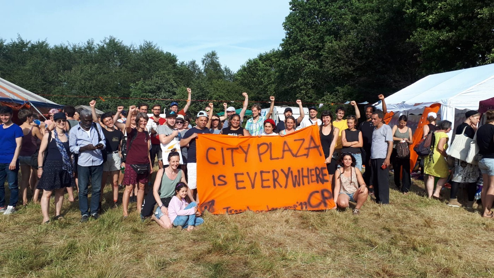

### AYS Daily Digest 10/07/2019: The Times Are A\-Changin’: City Plaza Evacuates

_Endings, reflections and beginnings // Abuse and degradation in Bosnia // Suicide attempt thwarted in Italy // New immigration law in Sweden // More…_

City Plaza is Everywhere, Photo Credit: City Plaza

After 39 months, City Plaza in Athens evacuated quietly, and quickly\. In a long reflection on the role, origin and impact of the community at City Plaza, important topics were explored\.

_“Today, July 10, 2019, the keys to the occupied City Plaza Hotel were handed over to the former hotel workers who own mobile equipment\. All the refugees who lived at City Plaza have been transferred to secure accommodation on the urban fabric\._

_On 22 April 2016, the Solidarity Initiative on Economic and Political Refugees captured the empty building of the City Plaza Hotel with a double objective: to create a safe and decent accommodation for refugees in the center of the city, and to fight against racism, and exclusion\. For freedom of movement and the right to stay…\._

_The decision to take possession took place at a very specific political juncture\. On 18 March 2016, one month before the seizure, the Euro\-Turkish Agreement on the limitation of refugee travel to Europe was signed\. It was the agreement that sealed the end of the “summer of immigration” of the period that began in July 2015, when under the pressure of about one million people “opened” the borders of Europe\. It was the deal that turned the Aegean islands into idyllic prisons for immigrants and turned the continental Greece into a place of encroachment for over 60,000 people\. The SYRIZA\-ANEL government, following its submission to the neoliberal management of the economic crisis, undertook the implementation of a policy of controlling, deterring and discouraging immigration\. With Frontex and NATO patrolling the Aegean Sea, with detention centers like Moria on the islands, camps in miserable conditions are the only refugee policy in the hinterland, criminalizing solidarity and the struggle of refugees\. At that time the problem of housing was imperative…\._

_City Plaza has in fact proved that refugees and locals can live together when solidarity, struggle and community dominate instead of isolation, punishment and hatred\. So in the opposite of the camp outside the urban centers and under miserable conditions, the CP in a neighborhood difficult for the movement, sometimes the neo\-Nazi bastion, managed to establish exemplary relations with a large part of the neighborhood’s people and give the former dark the corner of Acharnon and Kathivanos, the security features that are really needed by the bottom: the safety of dignified survival, the community, the solidarity and the liveliness of people fighting for life unselfishly…\.”_

Although the reflection is much longer, the conclusion to leave City Plaza came after a long and ongoing discussion on the ability of the cooperative to continue, taking into account the gradually decreasing resources and the transient nature of the occupiers — City Plaza was a transit point, which provided unique challenges to the coordination of the community\. This discussion and debate on how to move forward, whether to “normalize” or discontinue is one that many people involved in support and solidarity efforts have encountered, and have resolved in a variety of ways\.

It should also be noted that the change in political policy will continue to have an impact on how solidarity with people on the move will be expressed\.

The incoming conservative government is expected to have an even more strict attitude on border security and although they argue that they will attempt for “more swift processing of applications” often “speed” and “denial” go hand\-in\-hand\.

If there is something to take away from the evacuation of City Plaza, it must stem from their own statement — City Plaza is Everywhere\. Although perhaps we might be unable to cultivate and sustain a community so large, we can learn from the example of shared solidarity, responsibility, and respect\. To value humans over numbers\. Make the spirit of the community go Viral\.

The impact of City Plaza on the lives of everyone who spent time there is undeniable\. We strongly encourage everyone to go and read their full statement \(In Greek\) [here](https://www.elaliberta.gr/%CE%BA%CE%B9%CE%BD%CE%AE%CE%BC%CE%B1%CF%84%CE%B1/%CE%B1%CE%BD%CF%84%CE%B9%CF%86%CE%B1%CF%83%CE%B9%CF%83%CF%84%CE%B9%CE%BA%CF%8C-%CE%B1%CE%BD%CF%84%CE%B9%CF%81%CE%B1%CF%84%CF%83%CE%B9%CF%83%CF%84%CE%B9%CE%BA%CF%8C/5471-39-%CE%BC%CE%AE%CE%BD%CE%B5%CF%82-city-plaza-%CE%BF%CE%BB%CE%BF%CE%BA%CE%BB%CE%AE%CF%81%CF%89%CF%83%CE%B7-%CE%B5%CE%BD%CF%8C%CF%82-%CE%BA%CF%8D%CE%BA%CE%BB%CE%BF%CF%85,-%CE%B1%CF%81%CF%87%CE%AE-%CE%B5%CE%BD%CF%8C%CF%82-%CE%BD%CE%AD%CE%BF%CF%85) \. As part of the evacuation, all previous residents have been relocated to other safe housing\. ❤
### EASTERN MEDITERRANEAN \+ BALKANS

In **_Turkey_** , there are increasing reports on the ongoing hostility against Syrian refugees\. Under Erdogan’s leadership, over three million Syrian refugees are in Turkey\. Many of them are relegated to making a living in the black market, and the hardships faced by the Turkish economy have also resulted in Turkish citizens viewing Syrian refugees as a threat to their wellbeing\. Even the recently\-elected opposition mayor of Istanbul, who is considered “inclusive” argues that it is time for Syrians to return to their “free land”\.

In a recent well\-publicized attack, two Syrian men saw their clothing shop in Istanbul destroyed by masked men\. Many more are receiving death threats\. The conflict in Syria is still not halting and even after that were to occur, the political situation makes it unsafe for those displaced to return\. Read more [here](https://uk.reuters.com/article/uk-turkey-syria-refugees/they-want-to-kill-you-anger-at-syrians-erupts-in-istanbul-idUKKCN1U40XB?utm_source=NEWS&utm_medium=email&utm_content=2nd+section+1st+story+reuters&utm_campaign=HQ_EN_therefugeebrief_external_20190710) \.

Additionally the reception centres in **_Cyprus_** are overwhelmed\. The current capacity is at 350 but there are plans to increase the size of possible accommodation to 1000\. However this is most likely too little too late, with the inadequate system resulting in the trafficking and exploitation of people having to sleep rough\. There is also a concern over the recent jump in support for Elam, an offshoot of the far right Golden Dawn, which is up to over 8% of the vote from last European elections\. For more, go [here](https://www.politico.eu/article/cyprus-buffeted-by-influx-of-asylum-seekers-kofinou-camp-migration/) \.

Aegean Boat Report published a video of a pushback from deep inside **_Greek_** waters\. You can watch it [here](https://www.facebook.com/AegeanBoatReport/videos/454118582052016/) \.

Additionally ABR notes that 71 people arrived to Greek Islands, with three boats arriving to Lesvos, and one to Chios\.

Below you can find ABR’s monthly snapshot:

](assets/11cd61e99bdf/1*_AZEHMPN2vjgr67dKegX2g.jpeg)

Photo Credit: [Aegean Boat Report](https://www.facebook.com/AegeanBoatReport)

On Samos, there is a new computer lab\!

_“The Computer Lab, Samos_ 
_The first dedicated IT Centre for Refugees on the Island_

_We are delighted to announce the launch of our latest project on Samos\. Run in partnership with [Glocal Roots](https://www.facebook.com/GlocalRoots/?__xts__%5B0%5D=68.ARCKtW6RhzyVvIm3z4eKFlJ_rzCIe0uO_VXhaIyxmy_J-vLGu945nyvEOzKdXbqUKKm7Ubiiz4IBzOoEZoUhfoP3DdhofonHnDPc9QV1A4CtXzoTnKcfMvCkDHNc97Z4cyPjHb-XgWenb6PRQZGeoUchjeQpyOwZp-hu2CCEoxWUvX0PHCH4kbA7ievW5tYhBOQm8ogE2UWxg6gpD-mP7vsFriLDECFnjyshPtj9Q6KGoPF22QKDvgBhHn-NEdWmnBhPipkNTkhmqmuo_IuIJT_7QvXB2X8TTXqp7nwlzCG4HaI01t2e7arMCQTfgPwjx4V23akE4jEUZ8VAUw&__xts__%5B1%5D=68.ARBUFhYVwvaVFA8ZkmYnGt1NZeQNY10BPaHQi4tZn6_J_WsnFKf4oJSz66X9Vy5YRpRx85RwalQCRTvUXjjzzbS5JrT6tDpDPkvSwt3LLiv_q31ScKYkuRDenhg6jEUA48zXg05QMsb3nQ5roElyNxrpr8E3jao6TuGXas0m09PVYylaq62PQlUhgBFSkHIkWKGvSFTKGgCL-OVZkiLQkGF_4ImedSzy6jqJ7fldcNDr8TeWQ1exyxx9y0oWcHwtZuU1ihPS12YZh6CGUa0rIAtMrZHQysq5FVncGnJXMWqkDuNPq9tBxcvlZIL6AMFhFuhMRs0tSZSVDNV4F0aNfFw&__tn__=K-R&eid=ARAEXoHu8YuDgdeZ2OO2MT5FION5xIoHbY8BLG9QWnP-xfwuoPsBG0bYIA1QBbGWx2gSWat-u58ZU1ph&fref=mentions) / [WE ARE ONE SAMOS](https://www.facebook.com/weareonesamos/?__xts__%5B0%5D=68.ARCKtW6RhzyVvIm3z4eKFlJ_rzCIe0uO_VXhaIyxmy_J-vLGu945nyvEOzKdXbqUKKm7Ubiiz4IBzOoEZoUhfoP3DdhofonHnDPc9QV1A4CtXzoTnKcfMvCkDHNc97Z4cyPjHb-XgWenb6PRQZGeoUchjeQpyOwZp-hu2CCEoxWUvX0PHCH4kbA7ievW5tYhBOQm8ogE2UWxg6gpD-mP7vsFriLDECFnjyshPtj9Q6KGoPF22QKDvgBhHn-NEdWmnBhPipkNTkhmqmuo_IuIJT_7QvXB2X8TTXqp7nwlzCG4HaI01t2e7arMCQTfgPwjx4V23akE4jEUZ8VAUw&__xts__%5B1%5D=68.ARBUFhYVwvaVFA8ZkmYnGt1NZeQNY10BPaHQi4tZn6_J_WsnFKf4oJSz66X9Vy5YRpRx85RwalQCRTvUXjjzzbS5JrT6tDpDPkvSwt3LLiv_q31ScKYkuRDenhg6jEUA48zXg05QMsb3nQ5roElyNxrpr8E3jao6TuGXas0m09PVYylaq62PQlUhgBFSkHIkWKGvSFTKGgCL-OVZkiLQkGF_4ImedSzy6jqJ7fldcNDr8TeWQ1exyxx9y0oWcHwtZuU1ihPS12YZh6CGUa0rIAtMrZHQysq5FVncGnJXMWqkDuNPq9tBxcvlZIL6AMFhFuhMRs0tSZSVDNV4F0aNfFw&__tn__=K-R&eid=ARDxIqPQfYPUiUozfQtrdV5uYgMdYdbluQa3ByyYRd_I56zQ8iZqaPVvg9lvcFqqH-cvtxaVv38AJQrp&fref=mentions) , The Computer Lab is a dedicated centre for asylum seekers to receive quality IT lessons and free access to computers\._

_With 14 fully\-equipped machines, complete with keyboards, mice and headphones, The Computer Lab offers the chance to begin or continue developing essential IT skills\._

_Open 6 days a week, each morning the space opens specially for women, each evening, as an open door Internet Cafe\._

_Amid the noise, indignities and hardships of life as an asylum\-seeker on Samos, this new space is a place for quiet, self\-directed study and opens up a world of information and communication\._

_A huge thank you to [Help Refugees](https://www.facebook.com/HelpRefugeesUK/?__xts__%5B0%5D=68.ARCKtW6RhzyVvIm3z4eKFlJ_rzCIe0uO_VXhaIyxmy_J-vLGu945nyvEOzKdXbqUKKm7Ubiiz4IBzOoEZoUhfoP3DdhofonHnDPc9QV1A4CtXzoTnKcfMvCkDHNc97Z4cyPjHb-XgWenb6PRQZGeoUchjeQpyOwZp-hu2CCEoxWUvX0PHCH4kbA7ievW5tYhBOQm8ogE2UWxg6gpD-mP7vsFriLDECFnjyshPtj9Q6KGoPF22QKDvgBhHn-NEdWmnBhPipkNTkhmqmuo_IuIJT_7QvXB2X8TTXqp7nwlzCG4HaI01t2e7arMCQTfgPwjx4V23akE4jEUZ8VAUw&__xts__%5B1%5D=68.ARBUFhYVwvaVFA8ZkmYnGt1NZeQNY10BPaHQi4tZn6_J_WsnFKf4oJSz66X9Vy5YRpRx85RwalQCRTvUXjjzzbS5JrT6tDpDPkvSwt3LLiv_q31ScKYkuRDenhg6jEUA48zXg05QMsb3nQ5roElyNxrpr8E3jao6TuGXas0m09PVYylaq62PQlUhgBFSkHIkWKGvSFTKGgCL-OVZkiLQkGF_4ImedSzy6jqJ7fldcNDr8TeWQ1exyxx9y0oWcHwtZuU1ihPS12YZh6CGUa0rIAtMrZHQysq5FVncGnJXMWqkDuNPq9tBxcvlZIL6AMFhFuhMRs0tSZSVDNV4F0aNfFw&__tn__=K-R&eid=ARB1i9fu39amAQcvTd1Z-D9DmVJXNCG5ccdkYjcJA4k5K8CeFgNUSRwumfo8KyVB0A_j-bMnx5Iv0At_&fref=mentions) , [The Zoë Sarojini Education Trust](https://www.facebook.com/zoetrust/?__xts__%5B0%5D=68.ARCKtW6RhzyVvIm3z4eKFlJ_rzCIe0uO_VXhaIyxmy_J-vLGu945nyvEOzKdXbqUKKm7Ubiiz4IBzOoEZoUhfoP3DdhofonHnDPc9QV1A4CtXzoTnKcfMvCkDHNc97Z4cyPjHb-XgWenb6PRQZGeoUchjeQpyOwZp-hu2CCEoxWUvX0PHCH4kbA7ievW5tYhBOQm8ogE2UWxg6gpD-mP7vsFriLDECFnjyshPtj9Q6KGoPF22QKDvgBhHn-NEdWmnBhPipkNTkhmqmuo_IuIJT_7QvXB2X8TTXqp7nwlzCG4HaI01t2e7arMCQTfgPwjx4V23akE4jEUZ8VAUw&__xts__%5B1%5D=68.ARBUFhYVwvaVFA8ZkmYnGt1NZeQNY10BPaHQi4tZn6_J_WsnFKf4oJSz66X9Vy5YRpRx85RwalQCRTvUXjjzzbS5JrT6tDpDPkvSwt3LLiv_q31ScKYkuRDenhg6jEUA48zXg05QMsb3nQ5roElyNxrpr8E3jao6TuGXas0m09PVYylaq62PQlUhgBFSkHIkWKGvSFTKGgCL-OVZkiLQkGF_4ImedSzy6jqJ7fldcNDr8TeWQ1exyxx9y0oWcHwtZuU1ihPS12YZh6CGUa0rIAtMrZHQysq5FVncGnJXMWqkDuNPq9tBxcvlZIL6AMFhFuhMRs0tSZSVDNV4F0aNfFw&__tn__=K-R&eid=ARBlJ9LWYxrMYXSjHMgQ-iKoDF-z39R0s4ZAEqxqK0bkIFEq2F_rISOSg01b2OsO7O0hPE8NjMgdNuvv&fref=mentions) and [Be Aware And Share — BAAS](https://www.facebook.com/beawareandshare.baas/?__xts__%5B0%5D=68.ARCKtW6RhzyVvIm3z4eKFlJ_rzCIe0uO_VXhaIyxmy_J-vLGu945nyvEOzKdXbqUKKm7Ubiiz4IBzOoEZoUhfoP3DdhofonHnDPc9QV1A4CtXzoTnKcfMvCkDHNc97Z4cyPjHb-XgWenb6PRQZGeoUchjeQpyOwZp-hu2CCEoxWUvX0PHCH4kbA7ievW5tYhBOQm8ogE2UWxg6gpD-mP7vsFriLDECFnjyshPtj9Q6KGoPF22QKDvgBhHn-NEdWmnBhPipkNTkhmqmuo_IuIJT_7QvXB2X8TTXqp7nwlzCG4HaI01t2e7arMCQTfgPwjx4V23akE4jEUZ8VAUw&__xts__%5B1%5D=68.ARBUFhYVwvaVFA8ZkmYnGt1NZeQNY10BPaHQi4tZn6_J_WsnFKf4oJSz66X9Vy5YRpRx85RwalQCRTvUXjjzzbS5JrT6tDpDPkvSwt3LLiv_q31ScKYkuRDenhg6jEUA48zXg05QMsb3nQ5roElyNxrpr8E3jao6TuGXas0m09PVYylaq62PQlUhgBFSkHIkWKGvSFTKGgCL-OVZkiLQkGF_4ImedSzy6jqJ7fldcNDr8TeWQ1exyxx9y0oWcHwtZuU1ihPS12YZh6CGUa0rIAtMrZHQysq5FVncGnJXMWqkDuNPq9tBxcvlZIL6AMFhFuhMRs0tSZSVDNV4F0aNfFw&__tn__=K-R&eid=ARBRYC_tjn16BTNdjcREftoMi3pffLLjGPIJiZqDzq4pJ4uWnq4FVnOAGeGy-4oPIvfNLxfgW7iX6k5n&fref=mentions) for their financial support towards this project\!”_

For more information and to follow the project, go to [Action for Education](https://www.facebook.com/ActionforEdu/?__xts__%5B0%5D=68.ARCKtW6RhzyVvIm3z4eKFlJ_rzCIe0uO_VXhaIyxmy_J-vLGu945nyvEOzKdXbqUKKm7Ubiiz4IBzOoEZoUhfoP3DdhofonHnDPc9QV1A4CtXzoTnKcfMvCkDHNc97Z4cyPjHb-XgWenb6PRQZGeoUchjeQpyOwZp-hu2CCEoxWUvX0PHCH4kbA7ievW5tYhBOQm8ogE2UWxg6gpD-mP7vsFriLDECFnjyshPtj9Q6KGoPF22QKDvgBhHn-NEdWmnBhPipkNTkhmqmuo_IuIJT_7QvXB2X8TTXqp7nwlzCG4HaI01t2e7arMCQTfgPwjx4V23akE4jEUZ8VAUw&__xts__%5B1%5D=68.ARBUFhYVwvaVFA8ZkmYnGt1NZeQNY10BPaHQi4tZn6_J_WsnFKf4oJSz66X9Vy5YRpRx85RwalQCRTvUXjjzzbS5JrT6tDpDPkvSwt3LLiv_q31ScKYkuRDenhg6jEUA48zXg05QMsb3nQ5roElyNxrpr8E3jao6TuGXas0m09PVYylaq62PQlUhgBFSkHIkWKGvSFTKGgCL-OVZkiLQkGF_4ImedSzy6jqJ7fldcNDr8TeWQ1exyxx9y0oWcHwtZuU1ihPS12YZh6CGUa0rIAtMrZHQysq5FVncGnJXMWqkDuNPq9tBxcvlZIL6AMFhFuhMRs0tSZSVDNV4F0aNfFw&__tn__=kC-R&eid=ARC0HLSqX0PJQcsKLNuCQ_k5YYcjgYXldGhzk4xaDMxY2Us78R82EU19ncBetLjQ9k4Lf-Yy-3PV-Qnr&hc_ref=ARR4ECiuytDfFeWMQXdPedxguDddM3j7qiKjQFPUEAP3a0TLuM1TYMvKDP7DJiDCxJg&fref=nf) \.

A video posted from Ušivak camp in **_Sarajevo, Bosnia_** details the IOM\-paid security staff engaging in violence against multiple residents\. You can see the video [here](https://www.youtube.com/watch?v=DIaYAGXVGVA&) \.

The Operational Group for Coordination of Activities and Supervision of the Migrant Crisis had a meeting yesterday and reported that since the beginning of the year, 18,000 people had entered Una\-Sana Canton\. They stated that the situation in Vučjak, the former garbage dumpsite where people in USC were taken to, is “improving”

We received a video of how those who are apprehended around Bihać are taken to Vučjak:

■■■■■■■■■■■■■■ 
> **[Are You Syrious?](https://twitter.com/areyousyrious) @ Twitter Says:** 

> > This is how people are escorted from Bihać to Vučjak "Camp"  in Bosnia. https://t.co/Lzbz9P54Qj 

> **Tweeted at [2019-07-11 10:50:47](https://twitter.com/areyousyrious/status/1149269801048707072).** 

■■■■■■■■■■■■■■ 

“According to the USH Health Minister Nermin Cemalovic, four donated containers with shower and toilet have been donated to German donors, which will significantly contribute to better hygiene conditions, and hence the health situation in the area\. They will be in operation in 2–3 days\. A container will soon be used as an outpatient clinic, and one has already been set up for police officers at the entrance\.”

Furthermore, there is debate as to whether **_Miral and Bira_** camps will be closed, with there being increasing pressure from local representatives to close the camps\. For more information, in Bosnian, go [here](https://www.klix.ba/vijesti/bih/situacija-na-vucijaku-se-poboljsava-zatvaraju-se-miral-i-bira/190709113) \.
### WESTERN MEDITERRANEAN

IN the wake of all the handwringing over the criminal targeting and attack on the Tajoura Detention Centre in Libya, the Libyan Coast Guard intercepted and returned 90 people from the Mediterrranean to the same camp\.

> 60 people were killed in the bombing last week\. 

Stay enraged\.

> MSF UK points out that for every one person evacuated from Libya, four are returned\. 

For people who survive and escape to Italy, there is not much relief\.

According to [L’ ALTRA VOCE,](https://www.facebook.com/L-ALTRA-VOCE-1245970425495921/?__tn__=%2CdkCH-R-R&eid=ARDmWD2ufIKI9JL_yZHphsgNW_e3AYOkYPDl5U8VbZ2NZGPoWsr_OGzp9Qc3uz5mPgL2qE9ElSR-Imzr&hc_ref=ARQqBhx2RDt0gYNwVdxq5MbM24dws-f2eIMkz4NcadS0f9enx6um2ZNhVi6Sd5TJ7fM&fref=nf&hc_location=group) Another Pakistani boy, a guest of Gradisca’s Cara, tried to kill himself by jumping off the bridge on Monday\. Fortunately, a good person grabbed him and saved him\. This poor boy, for a year and a half inside the Cara, wants to return home\. But it seems that his practice is also blocked\.

In Ventimiglia, during the first quarter of the year, 758 people were supported, according to [Caritas](https://www.facebook.com/caritasventimiglia/photos/a.2057289990965816/2732172003477608?type=3&sfns=mo&hc_location=ufi) \.

On Monday, July 15th there will be a protest in Rome against the increasing criminalization of solidarity and persecution of the freedom of speech and practice of democratic outcry in Italy\.

Please go [here](https://www.facebook.com/events/588839424976680/) for more details\.

In Spain, there is a new project of free coding courses for refugees\!

The project is managed by [Open Cultural Center — OCC,](https://www.facebook.com/OpenCulturalCenter/?__tn__=%2CdkCH-R-R&eid=ARDPQNqz900HW_SgP_yt_IRxFqBxjWh42xNPsOn5hKRk5ZNNIi4j6Sd_8f6P3QQr6aldOWpWnQ4XKPe_&hc_ref=ARTyXbpElaA0T05iPREBnWYDUJ_8tE-9s5bymzAlY38T314emkBVDbGPO3-wgQfh0qE&fref=nf&hc_location=group)

“Our new project Migracode has officially launched\! In autumn 2019 we will start with the first 7\-month coding course at our center in Barcelona\. Are you someone or do you know someone with a migrant or refugee background between 18 and 30 years old, who is interested in computers and coding? Applications are now open\! \! Spread the message and find more information here: [www\.migracode\.openculturalcenter\.org](http://www.migracode.openculturalcenter.org/?fbclid=IwAR0t6EM8UGOKuUYWmJDcPbwQakP6xILmq9mQWL8qEl5Wh_2gZMkIGdwWSlI) ”
### SCANDINAVIA

The European Court has today ruled against in the case described in [this article](http://cphpost.dk/news/potential-timebomb-under-danish-family-reunification-rules.html) concerning the rules that apply to family reunification of people of Turkish nationality\. The outcome could potentially mean that thousands of cases regarding family reunification will have to be reopened\. The case involved a Turkish man who was a legal resident of Denmark and was forbidden from bringing is wife under their legislation\.

The main issue in the case is the requirement of attachment \(Tilknytningskravet\), stating that a person’s attachment to Denmark is a core factor in determining the right to family reunification\. The decision in case is solely regarding Turkish citizens, and the wider implication for the Danish legislation in the area is yet not known\.

By the 15th of August 2020 a new, long\-term, migration policy will be presented in **_Sweden_** — if everything is going according to the plan\. Recently the parliament declared that a committee will be designated in order to discuss and evaluate future solutions and the Swedish migration laws\. The committee will analyze and take the developments around the world into consideration, and suggest a sustainable policy based on both this and the resources and whats suitable for Sweden\. The work will begin the 15th of August this year\.

All of the political parties represented in the government, including the Sweden Democrats \(SD\), will participate in the committee\. The goal is to negotiate and come up with a sustainable policy\. Recently the so\-called temporary asylum law was prolonged for two more years\. The prolonged asylum law \(which still is very strict, but allows family reunification for more people than the first version of the law\) will expire the summer of 2021\.

Since the parties participating in the committee are very fragmented in opinion it won’t be easy to find joint, sustainable solutions\. Moderaterna \(M/ the conservative party\) first said that they wouldn’t participate, but later regretted the decision\.

The party’s leader Ulf Kristersson then said that the purpose obviously was to increase the migration to Sweden — and that is not a committee that his party wanna participate in\. But as another representative phrased it — that are needed in the committee\. The Sweden Democrat’s participation have been strongly criticized and questioned\. Jimmie Åkesson \(SD:s leader\) will represent the party himself — something that according to him is a signal about how important they think the work of the committee is\.

The Social Democrats \(S\), the Green Party \(MP\), The Left party \(V\) and the Liberal party \(L\) are likely to promote more generous migration politics\. The Christian Democrats also, to some extent: they wish to increase the possibility to reunite with family members\. Read more, in Swedish, [Here](https://www.sydsvenskan.se/2019-07-10/tungviktare-in-i-snarig-migrationsutredning) \.
#### AYS and the Daily News Digest — how to get involved

**We strive to echo correct news from the ground through collaboration and fairness\. Every effort has been made to credit organizations and individuals with regard to the supply of information, video, and photo material \(in cases where the source wanted to be accredited\) \. Please notify us regarding corrections\.**

**Apart from daily news in English, we also publish weekly summaries in Arabic and Persian\. Find specials in both languages on our [medium site](https://medium.com/are-you-syrious/ays-weekly-in-arabic-and-persian/home) \.**

**If there’s anything you want to share or comment, contact us through Facebook, Twitter or write to: areyousyrious@gmail\.com\.**

**We’re open to expanding our team of volunteer researchers, editors, and info gatherers\. Get in touch\!**

_Converted [Medium Post](https://areyousyrious.medium.com/ays-daily-digest-10-07-2019-the-times-are-a-changin-city-plaza-evacuates-11cd61e99bdf) by [ZMediumToMarkdown](https://github.com/ZhgChgLi/ZMediumToMarkdown)._
