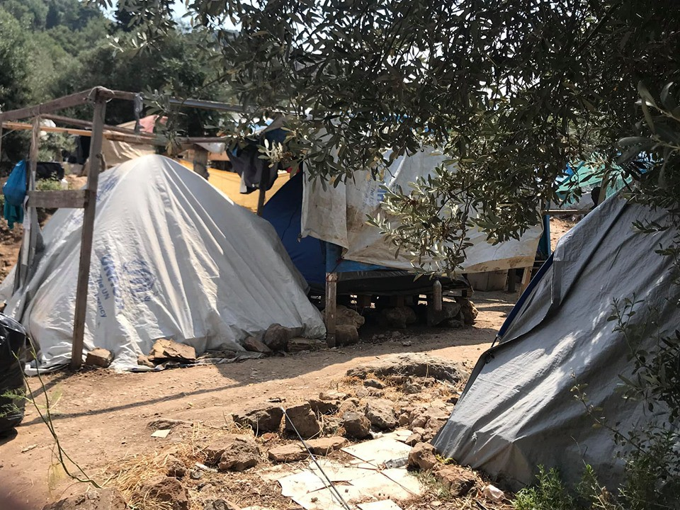

### AYS Daily Digest 07/11/19: Italy — How do evictions solve a refugee housing crisis?
#### _Evictions in Italy // Over 300 new arrivals in Greece // Solidarity housing initiative suspended // Medical needs in Dunkirk // Deportation and attack on protestors in Leipzig_

](assets/451d708da1d3/1*pQWkMgoftlyJZ4F6qTwqEA.jpeg)

Residents of the settlement stand on roofs to save their houses\. Photo Credit: [Comitato Lavoratori delle Campagne](https://www.facebook.com/comitatolavoratoridellecampagne/)
#### Feature: Evictions at Piazzale Spadolini and Borgo Mezanone

There was another clearing operation this week at the Presidium in Rome, according to volunteers from Baobab\. The group stated that approximately 12 people were taken from the Piazzale Spadolini and brought to the local police station\.

> Here we go again, again a facade operation to collect more votes, without finding political solutions that protect refugees and asylum seekers forced to stay on the street because the reception system does not work\. 

Another series of evictions took place at the settlement in Borgo Mezanone today, where police announced their intention to demolish over 40 self\-made shacks\. This was met with resistance from the inhabitants of the settlement\. After a couple shacks were destroyed, some residents stood on the roofs of their homes in order to prevent them from being bulldozed\. Others surrounded the machines to prevent them from destroying the settlement\.

A collective of organizatons working in Foggia published an open letter explaining their opposition to these clearances\. It stated:

> These actions do not in any way affect the presence of ghettos and indeed strengthen the chain of exploitation and exacerbate the fragility that this territory already structurally suffers from\. **These \[forceful\] actions represent only a fictitious solution that does not limit the exploitation of workers in the fields, nor does it offer concrete solutions for the dignified reception of seasonal workers and for the right to housing of the resident population\.** 

You can read the letter in full \[Italian\] [here](https://www.intersos.org/ex-pista-borgo-mezzanone-lo-sgombero-dei-diritti/?fbclid=IwAR3AasDyl7kX3q-HnBTCkpIQ9ua_or3khokGSbeSPvx9H4B95fSX6l8SaVs) \.

Video footage of the clearances can be seen [here](https://www.facebook.com/comitatolavoratoridellecampagne/videos/vb.904745212924938/583922458802569/?type=2&theater) \.
### Libya
#### Update on Tajoura Missile Attack

The Tajoura detention center where over 100 refugees were killed last week in a missile attack was next to a weapons depot, [according to a New York Times report released today](https://www.youtube.com/watch?v=dpPTlm_OJjI) \. The location made it a primary target for attacks, and the both the E\.U\. and Libyan authorities were warned of this by both the U\.N\. and people being detained in the center\. Despite the warnings, no action was taken\. Officials from the UNHCR have not been seen making any inspections at the detention facility\. Some refugees from the prison are sleeping outside the local UNHCR office, asking for help from seemingly unresponsive ears\.

■■■■■■■■■■■■■■ 
> **[Sally Hayden](https://twitter.com/sallyhayd) @ Twitter Says:** 

> > @[guardian](https://twitter.com/guardian) @[IrishTimes](https://twitter.com/IrishTimes) @[nytimes](https://twitter.com/nytimes) Dozens of Tajoura survivors were apparently sleeping outside the UNHCR GDF centre last night &amp; not allowed in. https://t.co/vvPspsbfVJ 

> **Tweeted at [2019-07-11 18:09:03](https://twitter.com/sallyhayd/status/1149380093996781568).** 

■■■■■■■■■■■■■■ 

■■■■■■■■■■■■■■ 
> **[MSF Sea](https://twitter.com/MSF_Sea) @ Twitter Says:** 

> > “It’s really the biggest contradiction – the #EU saying the detention centres must close, while saying at the same time the Libyan coastguard must continue to intercept people and return them to Libya,” Sam Turner @[MSF_Sea](https://twitter.com/MSF_Sea) tells @[guardian](https://twitter.com/guardian) 
[theguardian.com/global-develop…](https://www.theguardian.com/global-development/2019/jul/10/under-fire-libya-refugee-detention-centres) 

> **Tweeted at [2019-07-10 13:24:58](https://twitter.com/msf_sea/status/1148946212864831489).** 

■■■■■■■■■■■■■■ 

### Turkey
#### Study by Istanbul University Suggests Widespread Unwelcome Attitudes Towards Syrian Refugees in Turkey

A study undertaken by the Kadir Has university on the Turkish citizens’ attitudes towards Syrian refugees showed that the majority of citizens were “not satisfied” with their presence in the country\. The study was organized according to political party\. Interestingly, Erdogan’s AKP party has the second highest rate of respondents who said they were “satisfied” with the presence of Syrian refugees \(at a mere 10\.3%\), and the lowest number of respondents who said that they were unsatisfied\.

Source: Center for Turkish Studies, Kadir Has University, Istanbul, Turkey
### Greece
#### Over 300 Refugees and Migrants Arrive on Aegean Islands

_\(Via [Aegean Boat Report](https://www.facebook.com/AegeanBoatReport/) \)_

Nine boats arrived on the Aegean islands today, carrying 303 people\. Five boats arrived on Lesvos, three boats on Leros and one boat on Chios\.

First boats were picked up outside Chios by HCG, and arrived in the port of Chios at 01\.42\. Carrying 31 people — 12 children, 7 women and 12 men\.

The Second boat was picked up outside Agrilia Kratigou, Lesvos south, by HCG 01\.45\.
49 people \(No breakdown available\. \)

The third boat landed east of Kalo Limani, Lesvos north west 03\.30, carrying 31 people — 12 children, 5 women and 14 men\.

The fourth boat was picked up outside Tokmakia, Lesvos north east by HCG at 04\.50, carrying 51 people\. \(No breakdown available\. \)

The fifth boat landed in Tsonia, Lesvos north east, at 04\.50\.
There were 37 people on board — 13 children, 9 women and 15 men\.

The sixth boat landed east of Eftalou, old IRC camp, Lesvos north, at 11\.30\.
There were 27 people on board — 12 children, 8 women and 7 men\.

The seventh boat landed in Alinda bay, Leros east, at 07\.00, carrying 11 people\. \(No breakdown\. \)

The eighth boat was carrying 30 people, and in the ninth boat there were 36 people\. Both arrived on Farmakonisi during the night and were transported to the port on Leros\. \(No breakdown available\. \)
#### Photos from Samos Camp

Photographs were released today from the “hotspot” \(read: detention camp\) on Samos\. The camp has become one of the most overcrowded refugee camps in Greece, with over 4,000 refugees crammed into a hillside space intended for 700\. The Samos camp has become increasingly hard to access for volunteer groups and NGOs, as local authorities have prohibited access to the camp further and further\.

Trash piles up in the Samos camp, where trash collection is inadequate and infrequent\. The rubbish attracts rats to the camp, which in turn bring snakes\. Photo Credit: AYS

Makeshift tent structures are the only accomodation for most residents in the camp\. Photo Credit: AYS\.

■■■■■■■■■■■■■■ 
> **[RSA](https://twitter.com/rspaegean) @ Twitter Says:** 

> > After the decongestion of early spring, many tents im Moria #hotspot went down and never built again, so there are more people and fewer tents. #RefugeesGr #Stopthetoxicdeal https://t.co/A2EQ3BxAnO 

> **Tweeted at [2019-07-11 13:27:03](https://twitter.com/rspaegean/status/1149309124791930884).** 

■■■■■■■■■■■■■■ 

> Volunteers Needed\! 
 

> I AM YOU is currently recruiting for a Preschool Assistant Volunteer\.
 

> Volunteers are the engine of our organization\. Be the change and join us in helping improve the lives of Ritsona Residents\. 
 

> Check out our website to apply: [https://iamyou\.se/volunteer](https://iamyou.se/volunteer?fbclid=IwAR3B8PFhMBrzwur0rrk97hz_XU8XOAdSjj6e5FAGbgjiEv1nk6G2CI7nJKI) 

### BiH

A group of refugees were taken from the Bihać center to Vucjiak today in a degrading manner by Bosnian police and military\. The people on the move were marched along the street with their hands on each others’ backs, as if thy were criminals or prisoners of war\. Is this how people fleeing war should be treated in Bosnia?

■■■■■■■■■■■■■■ 
> **[Are You Syrious?](https://twitter.com/areyousyrious) @ Twitter Says:** 

> > This is how people are escorted from Bihać to Vučjak "Camp"  in Bosnia. https://t.co/Lzbz9P54Qj 

> **Tweeted at [2019-07-11 10:50:47](https://twitter.com/areyousyrious/status/1149269801048707072).** 

■■■■■■■■■■■■■■ 

### Western Mediterranean
#### “Solidarity Accommodation” Program Suspended in Paris

The solidarity accommodation program, which provided temporary shelter for refugees in Paris, has been suspended\. The deicision was announced by the [Utopia 56 group in a post](https://www.facebook.com/U56ParisIDF/posts/2137435389889243?__xts__[0]=68.ARBA_urQpAqwtNXIczj12jTR4e3skJ6Z4WIJ1048slwBUVAcJmtRI-lnYDZDPTomh39NHN3yH-ir1qEgeceheOKwJDIexYGENJT2WpIXHOkG65aixGJDwcf6wfjO_8GIJ8Ts39wxZHYhFS6WLbuskXG9szSNniKu95Grt0YDDOdHub8dL4ftbv6SVhoRYhjjeIqk9qFbcW57rgOjckiKIbWff9hZ1fDKVA7xZwKxxXrSO9sNnNNL_ACyldCan3kSxZOIMDRJOZegwXmomIGNmFSdjz7kkgeqGyUgO9vPTvlSsr2-VLgMHwQeG2SEWXIy7v-MDWfdKOdgEOQN_BYsQwi1TkPd&__tn__=-R) \. The program worked by matching refugees, often couples, single women, or families with children, with citizens offering nightly housing\. According to the group’s statement, this program has become a “bandage” that is covering up larger wounds caused by political decisions\. This is the primary reason for the suspension of the program, which volunteers and refugees hope will put pressure on municipal authorities to a find a long\-term solution for the thousands of refugees living homeless in Paris\.

“We can no longer continue to silence the gravity of this situation…\. Since the launch of this network, we have not seen any improvement of the conditions of reception for people who are exhausted and psychologically vulnerable\.”

According to the group’s statement, this decision was not made alone, but in discussions with refugees and beneficiaries of the accommodation program\. A group of refugees have set up a protest camp at the Aubervilliers rail station, and do not intend to leave until there is a real proposal made by the city government\.

](assets/451d708da1d3/1*N6eYyQdxAMzvJylyb6Xyyg.jpeg)

The cap at porte d’Aubervilliers\. Photo Credit: [Utopia 56 Paris et Ile\-de\-France](https://www.facebook.com/U56ParisIDF/)
#### Continued Lack of Medical Care for Refugees in Dunkirk

Volunteers working in Dunkirk described rising cases of chicken pox this week, whcih has been spreading to unacceptable living conditions and a near\-total lack of medical care provided by French authorites\. The NGO Gent 4 Humanity discussed the case of one little girl with chickenpox in Dunkirk\.

> “Where is the much needed medical help from the French authorities? Why is her family forced to sleep in an overcrowded gym where the kids are unwittingly spreading this infection from one to another?” 

> “This is a family like many others who have fled war and ISIS who deserve the right to asylum, yet so far don’t have it\. Her father had tears in his eyes when we explained what he had to do with the medication we gave for her\. He looked lost and so worried when she started to cry and we had to fight to keep our emotions in check\. Fifty years from now what will the world say when they see the photographic and written evidence of how we as a world, especially Europe, handled the refugee crisis? How will they react?? Expect it will be with shame and anger that we strayed so far from humanity\! \!” 

#### Hunger Strike on Melilla

A Palestinian refugee named Alaa Sami has gone on hunger strike in the Spanish enclave of Melilla, according to the Nador section of the [Moroccan Human Rights Association](https://www.facebook.com/AmdhNador/?__tn__=%2CdkCH-R-R&eid=ARDC9DM277NzKE0gdHMIbH5tS7UMqSMvifpIMg-yeAg7pbErzzunk-VV-fGY1h0rH898f5j8K2dpusMU&hc_ref=ARQ3PeqLoOF9pXjftZnj8Hp1NicfAi-onDZWb8O297Q5tPunTn3-rEuf0El_f7Lo2BE&fref=nf&hc_location=group) \. Sami has been on hunger strike for the past four days to call attention to his case\. He entered Melilla nearly one year ago, and has still not received any response from Spanish authorities on his asylum case\.
### Germany
#### Leipzig Police Deport Kurdish Refugee and Break Up Protest with Pepper Spray and Beatings

A Kurdish man was scheduled to be deported from Germany, away from his family members, to Spain last night at 8:30 pm\. When news of his protest began to circulate in the neighborhood and on social media, a group of protestors, including many of the Kurdish man’s neighbors, began to accumulate outside his apartment\. By the time the police arrived the crowd was reportedly around 500\.

When the protestors formed a barrier around the apartment, the police scuffled with them and attempted to encircle the crowd\. The police then announced that the Kurdish man was in detention and no longer in the apartment\. It is believed that he may have been taken out through a back exit\. When a number of protestors stayed, the police got more aggressive, pepper\-spraying the crowd and beating them\. It is reported that two people were beaten unconcsious\.

Even journalists were beaten by the police\. ND reporter Nina Boeckmann stated that there were [targeted attacks](https://twitter.com/nnzb_/status/1148769689482473472) on members of the press\. “I myself, as well as other members of the press were — despite clearly visible press cards — pushed so hard that we were knocked over\. I was sprayed several times specifically with pepper spray\. The last spray was right in my face\.”

You can read the full account \[German\] [here\.](https://perspektive-online.net/2019/07/leipzig-hunderte-menschen-verzoegern-abschiebung-von-syrischen-kurden-polizei-loest-blockade-brutal-auf/?fbclid=IwAR3HyaWcsh3agxLGNMkV4vsWmvv5WyJszxrDOHpx9kTmm-0uecLYkklgGTc)
### AYS and the Daily News Digest — how to get involved

**We strive to echo correct news from the ground through collaboration and fairness\. Every effort has been made to credit organizations and individuals with regard to the supply of information, video, and photo material \(in cases where the source wanted to be accredited\) \. Please notify us regarding corrections\.**

**Apart from daily news in English, we also publish weekly summaries in Arabic and Persian\. Find specials in both languages on our [medium site](https://medium.com/are-you-syrious/ays-weekly-in-arabic-and-persian/home) \.**

**If there’s anything you want to share or comment, contact us through Facebook, Twitter or write to: areyousyrious@gmail\.com\.**

**We’re open to expanding our team of volunteer researchers, editors, and info gatherers\. Get in touch\!**

_Converted [Medium Post](https://medium.com/are-you-syrious/ays-daily-digest-07-11-19-italy-how-do-evictions-solve-a-refugee-housing-crisis-451d708da1d3) by [ZMediumToMarkdown](https://github.com/ZhgChgLi/ZMediumToMarkdown)._
