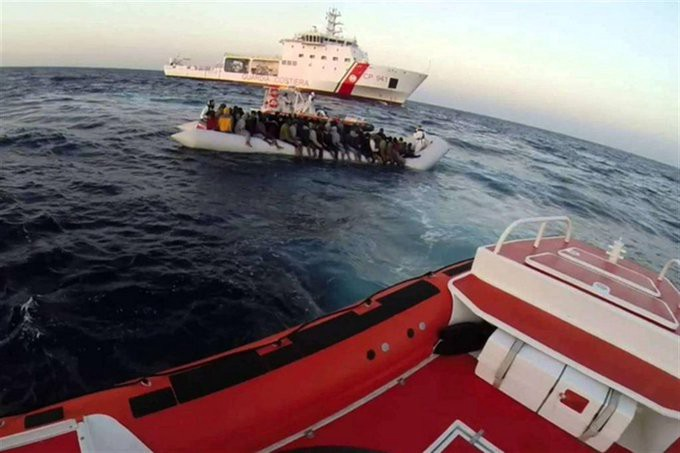
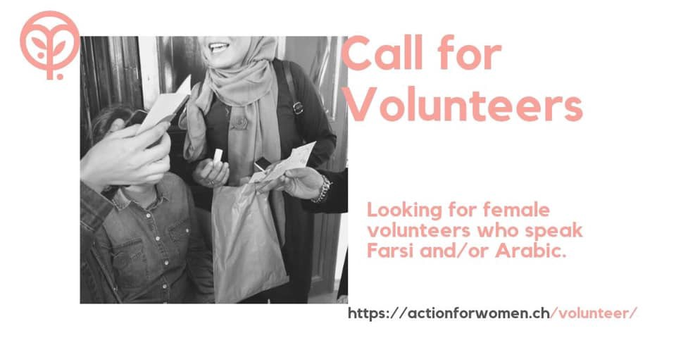
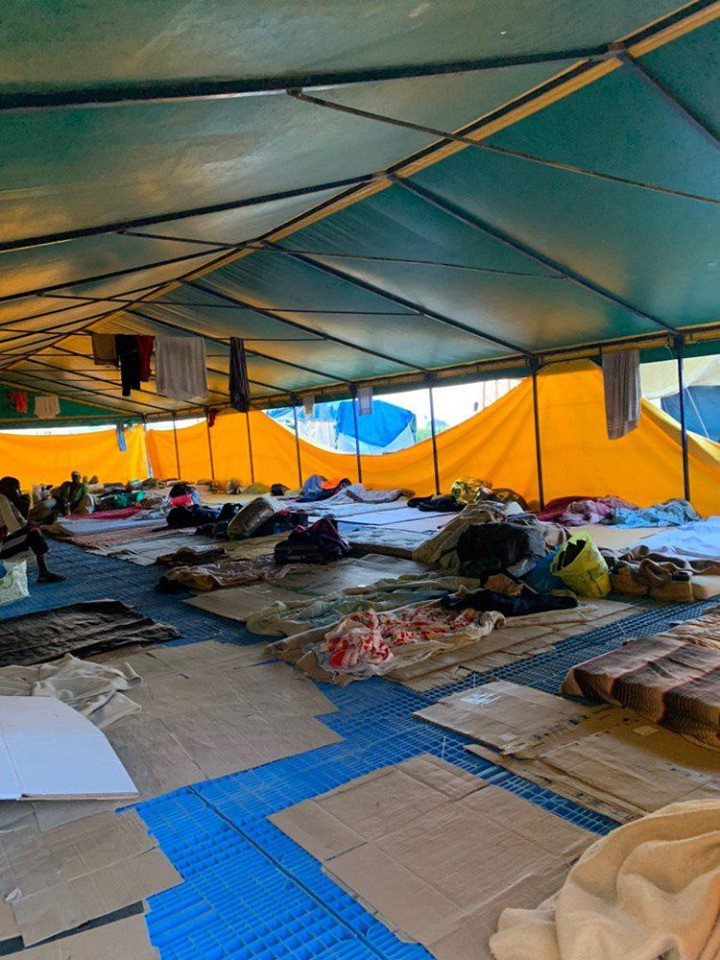
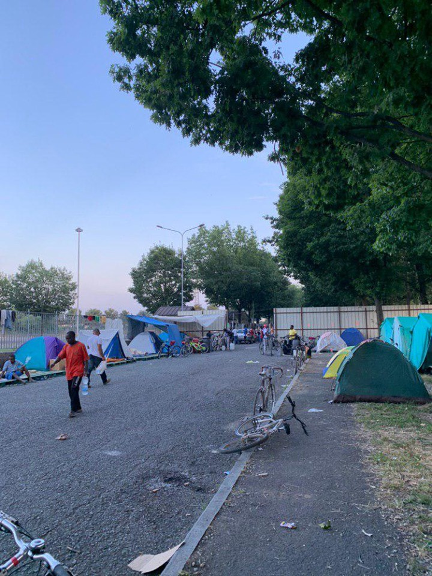

### AYS Daily Digest 25/7/2019: Up to 150 people feared drowned, while Italy approves infamous law
#### New report on victims of sex trafficking against minors in Italy//Violence against migrants in Morocco//Creative measures to be adopted by Frontex in Samos to patrol the sea//Racist attacks in Athens//Hungary referred to the Court of Justice for its treatment of people on the move//Slovenia to add 40 km barbed wire fence to its border with Croatia//New arrivals in Malta and Lampedusa//Deteriorating living conditions of migrant workers in Italian fields//Racist attack in Italy against field workers…

Credit: Angela Caponnetto
### FEATURED STORIES

Another tragedy in the **_Central Mediterranean_** occurred today, when two boats capsized off the Libyan coast, around Khoms, putting 300 people’s lives at risk\. Half of them are still missing and feared drowned, while 145 were rescued and taken back to Libyan territory, according to IOM and UNHCR, where they received medical assistance\.

This represents the worst tragedy at sea so far in 2019\.

■■■■■■■■■■■■■■ 
> **[IOM Libya](https://twitter.com/IOM_Libya) @ Twitter Says:** 

> > 🚨Urgent: tragic shipwreck may have occurred in the central mediterranean. 
Nearly 150 migrants are reported missing and 145 more returned to Libyan shore. 

> **Tweeted at [2019-07-25 13:32:19](https://twitter.com/iom_libya/status/1154383880075583488).** 

■■■■■■■■■■■■■■ 

At the same time this tragedy occurred, the Camera dei Deputati in the Italian Parliament approved the infamous _Decreto Sicurezza Bis_ , proposed by Salvini, that must be either approved or dismissed by the Senato by mid August\. If this decree becomes law, it would represent an additional attack to humanitarian legislation and an additional fascist drift for the country and a danger for SAR operations\.

> In summary: 

> It will allow the Interior Minister to limit or deny entry into Italian ports and waters for security reasons; 

> Captains of the vessels who disobey the orders could be fined from a minimum of 150\.000 to a maximum of 1 million euro; 

> The boat will be seized and will be owned by the State, which could decide to sell it or destroy it after 2 years from the seizure; 

> Up to 1\.5 million euro \(by 2021\) to finance police under\-covered investigations for those suspected of aiding illegal immigration; 

> 2 million euro in 2019 for deportations to countries of origin\. 

Read a deeper analysis [here](https://left.it/2019/07/25/il-decreto-sicurezza-bis-passa-alla-camera-nel-giorno-in-cui-avviene-una-nuova-strage-in-mare/?fbclid=IwAR1I9NTI3Zfw5MhAmotxeUVw1SI6zEhmgfS0Xwd3EgJNRVA7vRT8urubzyM) and [here](https://www.internazionale.it/bloc-notes/annalisa-camilli/2019/07/24/decreto-sicurezza-bis) \.

Save the Children Italia has published a new report regarding **_victims of sex trafficking_** \. In 2018, in 5 regions, 2\.210 minors and young adults were intercepted by the organisation, 58% more compared to the previous year\. 74 of them managed to escape the slavery system in which they were held and testify that 1 out 5 is less than 15 years old and 9 out of 10 were sexually exploited\.

The countries of origin of the victims are mainly Nigeria and Eastern European countries\.

Read more in Italian [here](https://www.savethechildren.it/blog-notizie/tratta-e-sfruttamento-italia-crescita-lo-sfruttamento-sessuale?fbclid=IwAR3Q6fFpkA-9XGjHPwe7zhbOK48Uxn4mdPADY2dhtkjCXn3iwGx_PkJE-W4) \.
### MOROCCO

More violence against people on the move in Nador\. Police raiding and destroying people’s belongings in the name of European security\.

### EASTERN MEDITERRANEAN AND BALKAN ROUTE

**_Greece_**

A [boat with 50 people](https://www.facebook.com/AegeanBoatReport/posts/618442612012180?hc_location=ufi) landed today north of **_Lesvos_** \.

**_Samos_**

■■■■■■■■■■■■■■ 
> **[RSA](https://twitter.com/rspaegean) @ Twitter Says:** 

> > Greek authorities and #Frontex plan to install surveillance zeppelin above #Samos next week. 
#RefugeesGr
[efsyn.gr/ellada/dikaiom…](https://www.efsyn.gr/ellada/dikaiomata/205036_ena-zepelin-ston-oyrano-tis-samoy-enantion-prosfygon) 

> **Tweeted at [2019-07-25 19:50:42](https://twitter.com/rspaegean/status/1154479106697732096).** 

■■■■■■■■■■■■■■ 

Migrants detained at **_Chania_** Police Headquarters should be immediately released\. Two weeks ago, migrants taking part in language classes and other activities at a local center, which doubled as shelter for them, were detained at the police station as a summer move to “clear” the city for the summer season\.

Find more information [here](http://www.haniotika-nea.gr/to-kinoniko-steki-steki-metanaston-gia-tis-kratisis-metanaston-sto-astinomiko-megaro/?fbclid=IwAR2W6e5R-28RUWyEY139Nt_03U6MD_i4CqIv7JE06fsF0oa5E0PdpPwuPxI&source=post_page---------------------------) \.

A 17\-year\-old boy was [found dead](https://www.efsyn.gr/ellada/koinonia/205099_17hronos-prosfygas-anasyrthike-nekros-ap-ti-thalassa-stin-anatoliki-mani) at the bottom of the sea in **_East Mani_** , after entering Greece from Lesvos in spring 2018\.

Investigations are ongoing\.

26 out of a total of 109 migrants, family members and vulnerable groups, are expected to be transferred in structures, as well as the 23 unaccompanied minors who will receive NGO support to take them to youth centers\. We recall that these migrants \(66 men, 10 women, 29 underage boys and 4 underage girls\) from Afghanistan, Pakistan, Sri Lanka, Iran and Nepal were rescued on Saturday 50 nautical miles west of Pylos and were transported to the port of **_Kalamata_** \. For the remaining 60 out of a total of 109 migrants \(all adult males\), the return procedure will be followed in their country\.

Original source [here](https://www.eleftheriaonline.gr/local/koinonia/item/191014-kalamata-se-anoiktes-domes-kai-kentra-filoksenias-oi-misoi-metanastes?fbclid=IwAR2yVA0RUmWC2cxqzWQcUWTZb-cYr5nUdmoVZBGITwF_4XR4RWvV7fqoCS8) \.

A [racist attack](https://3pointmagazine.gr/άγρια-ρατσιστική-επίθεση-κατά-μετανά/?fbclid=IwAR1A2-L7aisWtuFsRCJKxbIATzBJbD460NTxjxEs0n29QvwWtenuUULq02A) has been reported on Tuesday in **_Athens_** , when six to seven people attacked a refugee who was returning from work and was waiting at a bus station\.

Mobile Info Team has published [information](https://www.facebook.com/mobileinfoteam/posts/2491716721057042) on how it is possible to share your experience if you have been pushed back from Greece to Turkey\.

**_Volunteering Possibilities_**

Credit: Action for women

**_Hungary_**

■■■■■■■■■■■■■■ 
> **[HunHelsinkiCommittee](https://twitter.com/hhc_helsinki) @ Twitter Says:** 

> > 🔴 Breaking: @[EU_Commission](https://twitter.com/EU_Commission) taking strong action to protect human rights and civil society:  1. refers #Hungary to @[EUCourtPress](https://twitter.com/EUCourtPress) for criminalising activities in support of asylum-seekers 2. opens new infringement for non-provision of food in transit zones

[europa.eu/rapid/press-re…](http://europa.eu/rapid/press-release_IP-19-4260_en.htm) https://t.co/cPYOWMcd4A 

> **Tweeted at [2019-07-25 10:37:08](https://twitter.com/hhc_helsinki/status/1154339797227442176).** 

■■■■■■■■■■■■■■ 

**_The Balkan Corridor_**

Even though **_Slovenia_** has stated it will not build a wall along the Italian border, at least not before seeing what the results of the deployment of mixed border patrols are, it has put in action [two important measures](https://www.ilgazzettino.it/nordest/trieste/migranti_slovenia_muro_filo_spinato-4637798.html) : the deployment of 35 more soldiers along the Croatian border, to assist the work of the border agents, with drones and armoured vehicles and the construction of a barbed wire fence for additional 40 km\.
### CENTRAL MEDITERRANEAN ROUTE

76 people arrived today in **_Malta_** , after being intercepted by authorities\.

> Earlier in July, 44 migrants, [including a baby](https://timesofmalta.com/articles/view/baby-among-44-migrants-brought-to-malta-after-another-rescue-at-sea.720475) , were brought to Malta after a rescue at sea\. 

Original source [here](https://timesofmalta.com/articles/view/armed-forces-rescue-76-migrants-off-maltese-coast.724591.amp?__twitter_impression=true&fbclid=IwAR0MtnqIpRrKFtY8eZrPj0fMHqu5lSynKver-8xG4QIeJ6cHE96SqBbahBs) \.

In **_Lampedusa_** , other [2 boats landed last night](https://www.facebook.com/permalink.php?story_fbid=1130062070516198&id=252231521632595&hc_location=ufi) , one carrying 15 people \(2 women and 1 minor among them\) and the other carrying 21 people \(11 minors and 5 women among them\) \. Presumably from Tunisia\.

Additionally, 20 more people were rescued by the ICG and brought to the island, 7 men from Tunisia in one boat, 13 people \(including 1 woman and 1 minor\) from Egypt, Tunisia, and Morocco on the other\.

■■■■■■■■■■■■■■ 
> **[Mediterranean Hope](https://twitter.com/Medhope_FCEI) @ Twitter Says:** 

> > #Lampedusa 20 persone a bordo di due barchini sono state salvate dalla @[guardiacostiera](https://twitter.com/guardiacostiera). Su un'imbarcazione viaggiavano 7 persone, tutti uomini tunisini partiti da Mahdia 3 giorni fa. Sull'altra 13 persone: 11 uomini, 1 donna e 1 MSNA. Erano originari di Egitto Tunisia e Marocco. https://t.co/SAW4wJKKVG 

> **Tweeted at [2019-07-25 20:53:10](https://twitter.com/medhope_fcei/status/1154494824973787136).** 

■■■■■■■■■■■■■■ 

An Italian fishing boat rescued 50 migrants in the waters between Malta and Lampedusa and was forced to stay 12 hours at sea, after Malta denied landing and Italian authorities were awaiting for their answers\. Finally, they were taken by ICG in the evening\.

Nevertheless, the vessel still doesn’t have a defined port to dock\.

[Updates to follow](https://twitter.com/angikappa/status/1154509997822205952?s=21&fbclid=IwAR3Ir-aRd_9xpXn0huUu8BMZihSbE-3fyFBoB_hBGhTrVgvQbyBRHFlTozU) \.

Spontaneous landings continue in other parts of Southern Italy, especially in **_Calabria_** , where 9 people \(2 adults and 7 minors\) disembarked from a sailing boat presumably in the past days\. They are thought to be Kurdish\.

Original source [here](http://www.lametino.it/Cronaca/sbarco-migranti-nel-catanzarese-in-9-trovati-per-strada.html?fbclid=IwAR2yVA0RUmWC2cxqzWQcUWTZb-cYr5nUdmoVZBGITwF_4XR4RWvV7fqoCS8) \.

This accompanies the news that on Tuesday morning, in **_Foggia \(Puglia\)_** , a group of migrant workers who was cycling to work were [victims of a racist attack](http://www.foggiatoday.it/cronaca/aggressione-migranti-foggia-via-manfredonia-23-luglio-2019.html?fbclid=IwAR0cEuD6W-PALxizCLlbO8y-NJcduB44SlhiB41uMMD-cUUtJe9bCVg4ZRI) , as Italians threw stones at them from a car\.

Three people were heavily wounded in the head and eyes and had to stay in hospital for hours\. This represents the fourth attack in two weeks, meaning that there is a clear will to organize and voluntarily commit these attacks, a worrying consequence of the fascist policies implemented more and more often in the country: violent attacks, evacuations, forced deportations are unfortunately becoming daily routines, supported by the government and put into action by obedient armed forces\.

As mentioned before, this is not an isolated case; on the 13th of July, another two workers were victims of a similar attack in the same area and with the same methodology and Intersos, an NGO working the area, reports of an increased number of dead threats towards the migrants present in the area\. Similarly, on the 15th of July, three people were wounded and on the 17th of July, another worker was hit by a car while riding to work with his scooter\.

Read more, in Italian, [here](https://www.meltingpot.org/In-Capitanata-continuano-le-violenze-e-le-intimidazioni.html?fbclid=IwAR3nqhB00BvZ0Kaza-0rxsBkve_L3lVi9UGxFcZposUF3bY4ACGCnY9_VHs#.XTqmly2B2fV) \.

Meanwhile, in **_Rome_** , 15 people from the Senegalese community have been forced outside the building they were living in and the entrance has been walled up by the authorities\. This community has been living in the area for 27 years, always paying rent and working regularly, but since February this year, it has been targeted with evacuation orders because apparently some foraged goods were found in the building\.

They need already cooked food for lunch and dinner, as they don’t have facilities to cook themselves, in addition to water, juices, milk, biscuits, crackers, cool boxes, sleeping bags\.

The living conditions for field workers in **_Saluzzo \(Piemonte\)_** are still extremely bad\. Only 368 places are allotted in closed structures, so a bed spot inside tents is not guaranteed for all, evidenced by the number of people still sleeping rough on cardboards at night\.

There are just 15 tents for up to eight people made available for the workers, the rest are camping tents for two people and a big tent for 50 people all together, with little space to move from one cardboard space to the other\. This is a makeshift accommodation found outside the Foro Boario, the structure that used to host seasonal workers and allow them to at least have a roof over their heads\.

No water points, toilets, showers, kitchen, nor electricity are present for these people forced to sleep outside the PAS — the structure available now for people to sleep, which is a no\-go area without permission\.

Big question marks remain job possibilities, housing solutions, work contracts, and legal and medical assistance for the hundreds of people \(around 200\) who are now present in the area\.

Read more on the situation and context [here](https://openmigration.org/analisi/la-difficile-situazione-dei-braccianti-di-saluzzo/?fbclid=IwAR0pcXVm77qznS1Qq546ZEfCW-YLMC7WAJ-HZRUMvPphEGmP7-PXCe6oiKs) \(in Italian\) \.

Credit: Csoa Gabrio
### AYS and the Daily News Digest — how to get involved?

**We strive to echo correct news from the ground through collaboration and fairness\. Every effort has been made to credit organisations and individuals with regard to the supply of information, video, and photo material \(in cases where the source wanted to be accredited\) \. Please notify us regarding corrections\.**

**Apart from daily news in English, we also publish weekly summaries in Arabic and Persian\. Find specials in both languages on our [medium site](https://medium.com/are-you-syrious/ays-weekly-in-arabic-and-persian/home?source=post_page---------------------------) \.**

**If there’s anything you want to share or comment, contact us through Facebook, Twitter or write to: areyousyrious@gmail\.com\.**

_Converted [Medium Post](https://medium.com/are-you-syrious/ays-daily-digest-25-7-2019-up-to-150-people-feared-drowned-while-italy-approves-infamous-law-a5623497fa89) by [ZMediumToMarkdown](https://github.com/ZhgChgLi/ZMediumToMarkdown)._
