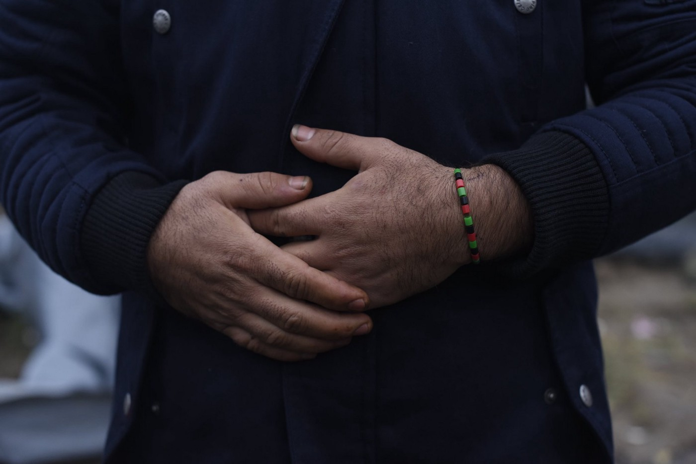

### AYS Daily Digest 30/07/19: World day against trafficking in persons
#### Human trafficking and deportations to Libya // arrests in Greece // information and support for people in French centres of administrative detention // SAR operations

Peace by Arcadio Esquivel
#### FEATURED
### World day against Trafficking in persons: European Governments should act now in the interest of the victims

According to UNODOC \(UN\-Office on Drugs and Crime\), “Trafficking in persons is the acquisition of people by improper means such as force, fraud or deception, with the aim of exploiting them\.”

In 2000, the United Nations Convention against Transnational Organized Crime with the Protocol to Prevent, Suppress and Punish Trafficking in Persons, Especially Women and Children and the Protocol against the Smuggling of Migrants by Land, Sea and Air was adopted by the General Assembly\.

Although many countries adopted laws that are in line with the Convention, according to UN in many countries victims of trafficking are still criminalized while traffickers remain unpunished\.

As Europe is not providing save migration routes and is instead supporting criminal structures for detention of migrants in Libya and elsewhere, the risk for migrants to become a victim of human trafficking is highly increased\. Smugglers and criminals profit and exploit desperate people\. Migrants in Libya are extremely vulnerable to trafficking\. Libyan criminal law does not capture the crime of trafficking in persons appropriately\. Large parts of the country are not under state control but controlled by militias and extra\-legal military groups that profit from forced labour and sexual abuse of migrants\.

> In order to effectively fight against trafficking of persons, Europe must end the deportation of people rescued on the Mediterranean back to Libya now and provide save routes to escape the horrendous conditions in Libya\! 

#### LIBYA

Libya has become the terrain for experimentation with new military technologies and the recycling of old weapons, and the geographical scope of the violence has also spread\. Civilian infrastructure must not be used for military purposes and civilians must not be used as human shields, as it has been done so far, including with the refugees detained across the country\. Terrorists and criminal groups are the only winners in the ongoing fighting\.

Some of the biggest reoccurring problems we report about and warn are precisely these:

■■■■■■■■■■■■■■ 
> **[Charlie Yaxley](https://twitter.com/yaxle) @ Twitter Says:** 

> > Very worrying news. Some survivors of last week's shipwreck taken to Souq AlKhamis detention centre

Conditions are dire. Food delivery has been inconsistent. Detainees have reported people being sold.

This is why no 1 should be returned to Libya. Immediate end to detention! 

> **Tweeted at [2019-07-29 11:10:45](https://twitter.com/yaxle/status/1155797808211009536).** 

■■■■■■■■■■■■■■ 

#### SEARCH AND RESCUE

Sea Watch team writes:

> If there is a word that describes today’s situation in the Mediterranean, then it is “uncertainty”\. especially for those who dare the dangerous journey across the world’s most deadly border, but also for our knowledge of what happens\. Without our civil aircraft flying across the territory, without any other Ngos monitoring the sar zone, we would not even have known that last week hundreds of people in distress were either drunk or illegally brought back to Libya\. Even today, we can’t say with certainty what the actual extent of the tragic events of last Thursday was\. What we know without a doubt: our eu governments are guilty of the death and suffering of hundreds of people last week, and thousands more whose fate continues to be in the hands of smuggler, militias and the so\-called Libyan coast guard\. 

](assets/647fd009960b/1*awiLbXcWtEFqhjrE_2oaEw.jpeg)

by [Sea\-Watch](https://www.facebook.com/seawatchprojekt/?tn-str=k%2AF&hc_location=group_dialog)
#### GREECE

The Greek police arrested about 100 people at airports and in raids all across Greece\. About 60 persons were arrested in Thessaloniki for failing to present valid residence permits\.

Another 13 persons were arrested at airports in Kos and Santorini for travelling with forged documents\. Within the last week, another 21 persons were arrested at smaller airports for the same offence\.
#### Arrivals

In the past week 88 boats started from Turkey, according to the weekly Aegean Boat Report\. 61 boats carrying 1807 people were stopped by Turkish coast guard or police\. 27 boats carrying 799 people arrived at the Greek islands\. 357 people have been transferred to the Greek mainland\. The population of refugees on the islands in total is **19,907** \.

As for Monday, five boats arrived at the Greek Islands, carrying 158 people in total\.
#### FRANCE

Many people are worried about their friends and family in France who are in the so called centres for administrative detention\. There are several associations present in relation with the question of detention, who can inform detainees and help them exercise their rights\. They also release reports annually on the situation in detention centers and facilities across France\. Their contacts are listed on this page:

> Today it is July 30, World Day Against Trafficking in Persons\. According to the international bodies, “human trafficking” refers to the crime that exploits women, children and men for many purposes, including forced labour and sex\. 

> We feel that they are forgetting to talk about the human trafficking that is taking place at Europe’s doors: closed borders for people that are fleeing from wars, dictatorships and persecution, and the lack of safe and legal routes to claim for asylum, which forces them to leave their lives in the hands of traffickers\. 

> As for the Eastern European borders, the ones we know best about, over the past two years we have seen that the tighter the borders are closed, the higher the cost people have to pay to traffickers\. When the obstacles increase, the price increases too\. The European Union pays lip service to providing great sums of money to fight against trafficking but it is actually allocated to strengthening the closed borders\. The official rhetoric talks about fighting against human trafficking with this money\. But we all know — and they also know — that this is only benefiting the powerful people, rather than the most vulnerable ones, those who have lost everything in this insane journey — from the moment they left their countries, until they reached Serbia and Bosnia and found that the borders were sealed\. 

> We know that some day, leaving millions of people’s lives in the hands of traffickers will be considered a crime\. We know that not providing these people with safe routes to enable them to claim for asylum without having to risk their lives will be considered a crime\. We know that someday — and it won’t be long — this part of our history will be a shame on Europe\. On the meanwhile, now, we allow it to happen\. 

Text and photo: No Name Kitchen
### AYS and the Daily News Digest — how to get involved?

**We strive to echo correct news from the ground through collaboration and fairness\. Every effort has been made to credit organisations and individuals with regard to the supply of information, video, and photo material \(in cases where the source wanted to be accredited\) \. Please notify us regarding corrections\.**

**Apart from daily news in English, we also publish weekly summaries in Arabic and Persian\. Find specials in both languages on our [medium site](https://medium.com/are-you-syrious/ays-weekly-in-arabic-and-persian/home?source=post_page---------------------------) \.**

**If there’s anything you want to share or comment, contact us through Facebook, Twitter or write to: areyousyrious@gmail\.com\.** 

_Converted [Medium Post](https://medium.com/are-you-syrious/ays-daily-digest-30-07-19-world-day-against-trafficking-in-persons-647fd009960b) by [ZMediumToMarkdown](https://github.com/ZhgChgLi/ZMediumToMarkdown)._
