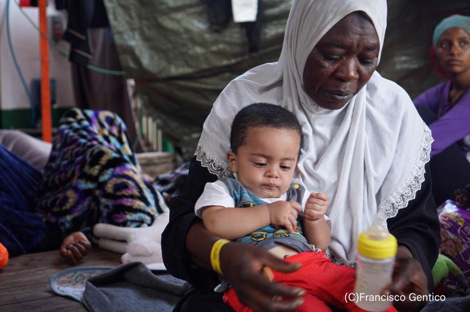
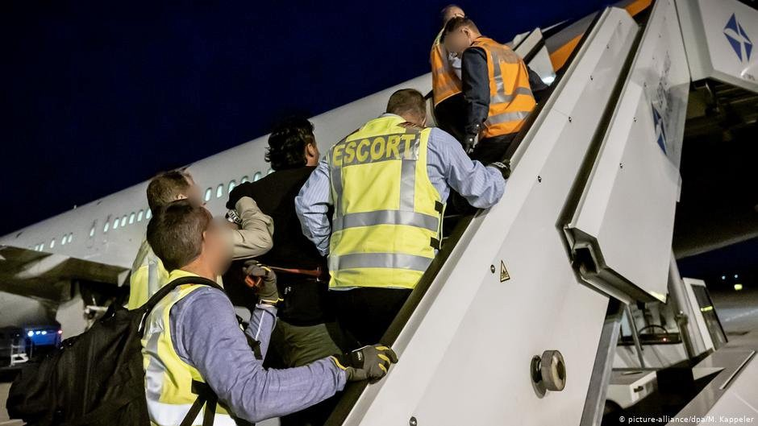
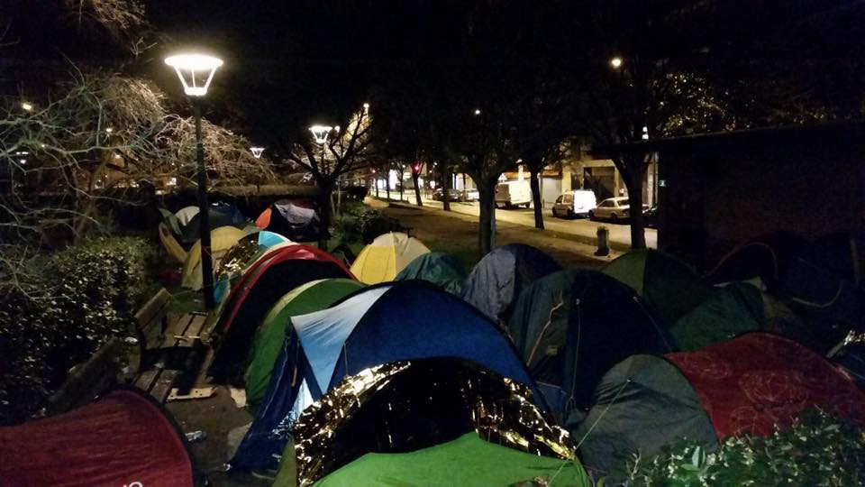

### AYS Daily Digest 8/8/2019 — Bosnian police chief admits 7000 push\-backs
#### Harder to get citizenship, easier to be deported: Changes in German law digested / Day seven without a safe harbour for Proactiva Open Arms / French government\-issued cash cards for refugees will become pay cards for limited spending in stores

Zoran Galić says they need more reinforcements to tackle illegal migration\. Photo: Granična policija BiH
#### Bosnian Border Police Chief Openly Admits 7000 Push\-Backs to Serbia and Montenegro, Calls for Help from EU

In a [recent interview](https://avaz.ba/vijesti/intervju/506859/zoran-galic-ne-mozemo-sami-odbraniti-granicu) \(in Bosnian\) for the local newspapers Avaz, chief of Bosnian border police Zoran Galić openly admitted 7000 push\-backs to Serbia and Montenegro that have been carried out by Bosnian officers\. He did this to raise awareness about the lack of their human capacity to “protect the border,” as he called for reinforcements and more funding in order to buy better border surveillance equipment\.

> “The BH Border Police, in cooperation with officials of other police agencies, have prevented more than 7,000 illegal border crossing from the beginning of this year\. Economic migrants account for the largest percentage of such border crossings, most of them being Pakistanis, Iraqis, Syrians, Iranians and Afghans\. Our entire border police has 2,051 officers in total, while Croatia has more than six thousand border officers\. EU countries can also rely on more sophisticated, expensive equipment which is unavailable to us\. We are now expecting donations of such equipment from the Czech Republic and we were given some recent donations from Germany, but we need more support”, he said\. 

Galić further explained how they lack surveillance equipment such as scout\-guard cameras, drones and specially equipped vehicles, and also equipment used to check the cargo spaces of trucks and vans, such as heartbeat detectors, CO2 detectors and endoscopes\. Answering the hypothetical question about the deployment of the army troops to Bosnian borders, he did not repudiate such a scenario\.

It is currently estimated that up to 8,000 migrants are present in Bosnia and Herzegovina, around 5,000 them being registered in official camps and settlements\. One of the recently opened “official” settlements include Vučijak, an open\-air camp with 70 large tents built on the toxic soil of an ex\-dump in the Una\-Sana canton, northern Bosnia\. Most of the people living there hope to reach Europe via Croatia, which holds one of the most violent and dangerous borders on the route\.

](assets/baeff3db99/1*8A_CRLngT2b360Pr3QpBwA.jpeg)

Refugees in Vučijak, a camp built on polluted Bosnian soil\. Photo: [Graz: Donations convoy](https://www.facebook.com/GrazSpendenkonvoi/)
#### Croatian Ministry of Interior Denies Violence, Admits “Discouragement Measures”

Following the media frenzy about a group of 18 migrants who were found severely injured after a push\-back from Croatia to Velika Kladuša area in Bosnia, the Croatian Ministry of Interior published a statement claiming that no violence has been used in “discouragement of the illegal border crossing\.” It is interesting that they have not denied unlawful return of the group to Bosnia, they’ve just used the term “discouragement” instead of “push\-back\.” In a recent interview for Swiss television, the Croatian president [openly said](https://www.hrw.org/news/2019/07/15/croatia-president-admits-unlawful-migrant-pushbacks) that Croatia is pushing people off of EU soil\. Only after she became aware that she had admitted the illegal practice, did she decide to say that her \( [filmed](https://www.srf.ch/play/tv/tagesschau/video/kroatiens-praesidentin-grabar-kitarovi-zur-balkanroute?id=68ae3d79-230b-4af6-a318-717b9aa8a514&fbclid=IwAR0thheIG9J0CfzWBYn1aRqtM1m4Z7KPA-d_k8WkPvcQnEyS8AMeVZuZdgA) \) testimony was somehow misinterpreted and accused foreign journalists of working against Croatian interest\.
### Sea
#### Day Seven without Safe Harbor for Proactiva Open Arms

A rescue ship carrying 121 refugees is still not allowed to disembark in any EU port, Italy and Malta being the nearest EU countries\. The ship is floating in the middle of the Mediterranean, with sick people, children, and victims of abuse on deck, including a person with two gunshot wounds inflicted by guards at a Libyan detention center\. According to the Proactiva crew, it is increasingly difficult to explain to the people on board why they cannot land in a safe harbor where they will not be in danger\.

121 people on board the ship are waiting for EU mercy\. Photo: Francisco Gentico via Proactiva
### Germany
#### Changes in the Migration Package: Integration and Deportation Made Easier at the Same Time?

Tomorrow, two new laws come into effect: the first one facilitates the data exchange between authorities for residence and asylum purposes, the other changes the German Nationality Act\. The changes are the following:
- German citizenship can be withdrawn if a person is actively participating in the combat operations of terrorist groups abroad and has another nationality, so that he/she would not become stateless, §§ 17, 28;
- naturalization now requires the “adaptation to German living conditions”, § 8 and § 10\. This means, for example, not being married to more than one person;
- and naturalization can now be withdrawn within the first 10 years, instead of only within 5 years, § 35\.

These changes are part of a larger package of legal measures that have been introduced in recent days\. Two days ago, change of the employment regulation also came into force\. The so\-called priority check for asylum seekers was permanently terminated in order to reduce bureaucracy\. The government says these measures are intended to make integration of immigrants smoother, but some of the changes also made it easier for Germany to deport rejected asylum\-seekers or have excluded people from so\-called “safe countries” of origin\. According to [DW](https://www.dw.com/en/germanys-new-refugee-labor-laws-slammed-as-lacking-common-sense/a-49095320) , legal experts say these changes not only send mixed signals but also may be unconstitutional\. A full list of legal changes \(in German\) can be found [here](https://www.asyl.net/view/detail/News/inkrafttreten-von-gesetzen-aus-dem-migrationspaket/?fbclid=IwAR0TEHpKZBoEIhrAD1qe5j6pVT8g5pFcFQzhYN3yiPNecGpBTz5Z4jOMhCg) , while changes to employment regulation are explained \(also in German\) [here](https://www.asyl.net/view/detail/News/abschaffung-der-vorrangpruefung-beim-arbeitsmarktzugang-fuer-asylsuchende-und-geduldete/?fbclid=IwAR2Xwe8-4sXjjbxP8ZkZlzrXhVXAVc91PNg17Aq6mYQJBVyxptgNbkaBcDE) \.
#### Explained in Detail: How Deportation from Germany Works

Despite sharp increase of violence in the past several months and years of non\-stop danger for many of the citizens of Afghanistan, Germany is one of the European countries that considers Afghanistan a “safe country,” which enables deportation flights to be carried out on regular basis\. DPA journalists boarded one of the deportation flights from Leipzig to Kabul and explained the process in detail\. InfoMigrants have published an extensive article about their trip to a war\-torn land\.

Deportation from Leipzig to Kabul\. Photo: picture\-alliance/dpa/M\. Kappeler via InfoMigrants\.net

> “The deportees are brought to the airport by armed policemen and women from the states from which they are being deported and handed over to unarmed federal policemen and women at the airport\. \(…\) After being instructed on what they should expect from the beginning to the end of their journey with the help of a translator, the deportees are each individually inspected behind closed doors in a room away from the heavily guarded waiting area\. \(…\) Chartered deportation flights carry no regular passengers, even if there are only a few deportees to be returned\. \(…\) Those that prove to be particularly reluctant by resisting either actively or passively are restricted in what is referred to as a “body cuff,” a garment that limits upper body movement\. \(…\) Like any other flight, there are also air hostesses present on board the aircraft on this journey, who according to the DPA journalists, continue to smile in a professional manner as if this was just like any other flight\. \(…\) Upon landing in Kabul, things are a bit different than an average flight\. Four officers storm off the aircraft to secure it, making sure there are no threats from outside the plane as Kabul continues to be the scene of suicide bombings and other attacks\. \(…\) Not everything goes according to plan\. The security forces have to be able to accommodate last\-minute changes and improvise accordingly\. Some more fortunate migrants might receive a last minute stay after a review of their asylum application case\. However, this is rare\.” 

The full article describing deportation to Afghanistan can be found [here](https://www.infomigrants.net/en/post/18672/at-the-end-of-the-road-a-look-at-deportations-from-germany) \.
### France
#### Government\-Issued Withdrawal Cards for Refugees Will Become Pay Cards for Limited Spending in Stores

The French office for immigration and integration has announced a change of operation of the ADA \(Asylum\-seeker benefit\) \. This is financial aid granted to people who have applied for asylum in France and it ranges from €6\.80 to €7\.40 per day\. For those who don’t have a French bank account, withdrawal cards were issued, allowing them to collect cash at ATMs up to three times per month\. From 5 September, people with these cards will no longer be able to withdraw money, but will only be able to pay for goods in general stores, within a limit of 25 payments per month\. In addition, €0\.50 will be charged per operation\. Payments over the internet will not be allowed\.

A [petition](https://www.change.org/p/l-office-fran%C3%A7ais-de-l-immigration-et-de-l-int%C3%A9gration-non-au-changement-de-fonctionnement-de-la-carte-d-allocation-des-demandeurs-d-asile?recruiter=62963798&utm_source=share_petition&utm_medium=facebook&utm_campaign=petition_dashboard&recruited_by_id=3a085ad4-c8a6-4cae-ac12-56c891a5cee5&utm_content=starter_fb_share_content_fr-fr%3Av1&fbclid=IwAR1u89W5yD5rv0w8Voi5X1GFw3PNR61VC3gVPsroWge5xBoDreZyKYqFJos) was started to oppose this decision, which might further complicate the lives of asylum seekers, especially those who are still sleeping rough and who more often need smaller amounts of money for basic necessities such as bread and bus tickets instead of doing all of the shopping at once\.

For refugees sleeping rough, having their own cash was a single drop of dignity\. Photo: PRGS
#### It Took 27 Days to Free a Minor Who Was Illegally Placed in Detention

Legal abuse of refugees is widespread throughout the EU, with France being one of the hardest points for many\. La Cabane Juridique, legal team from Calais, describes the most recent situation in which it took 27 days to free a young Algerian, aged 16, placed in the detention center\. He was freed on 3 August, but authorities have appealed the decision to release him from detention\.

> This absurd case of detention for almost a month demonstrates the inhumanity of the French authorities: repression and lock\-up of people in forced migration, rather than unconditional defence of the rights and integrity of children, guaranteed by French law and the European convention on human rights\. We would like to highlight the violence and trauma of the detention suffered by minors and remind France of its obligation to take into account the best interest of the child, said La Cabane Juridique staff\. 

**We strive to echo correct news from the ground through collaboration and fairness\. Every effort has been made to credit organisations and individuals with regard to the supply of information, video, and photo material \(in cases where the source wanted to be accredited\) \. Please notify us regarding corrections\.**

**Apart from daily news in English, we also publish weekly summaries in Arabic and Persian\. Find specials in both languages on our [medium site](https://medium.com/are-you-syrious/ays-weekly-in-arabic-and-persian/home?source=post_page---------------------------) \.**

**If there’s anything you want to share or comment, contact us through Facebook, Twitter or write to: areyousyrious@gmail\.com\.**

_Converted [Medium Post](https://medium.com/are-you-syrious/ays-daily-digest-8-8-2019-bosnian-police-chief-admits-7000-push-backs-baeff3db99) by [ZMediumToMarkdown](https://github.com/ZhgChgLi/ZMediumToMarkdown)._
