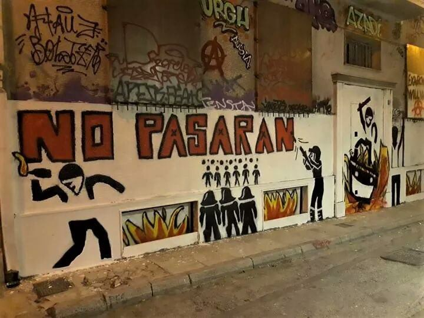
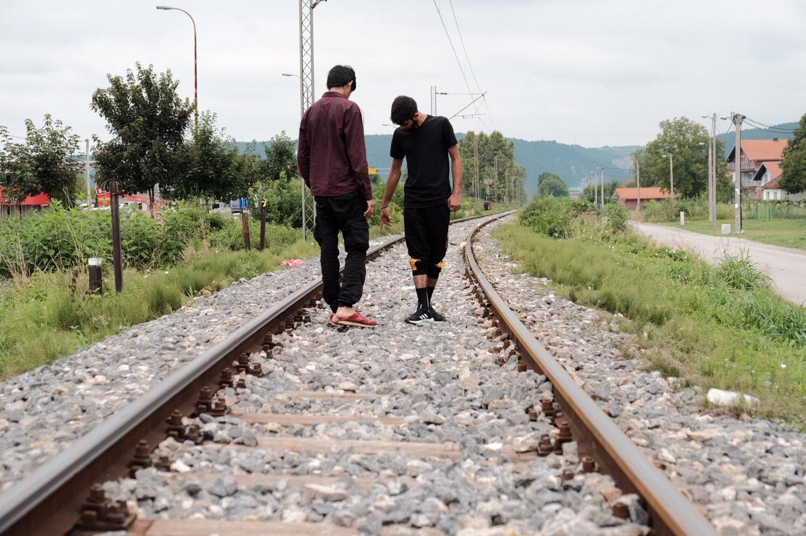

### AYS Daily Digest 9/8/19: When in doubt, Europe deports
#### EU states’ inhumane decisions of deportations are sending thousands \(back\) to danger, or leaving people without a chance of a normal life due to stateless status / 20,500 people on the Greek islands / IOM’s VRR programme on hold in Greece / The European Commission expects urgent answer of Croatian authorities to the allegations / & more news

Athens\. Exarcheia \(Source: @stack\_ff\)
#### FEATURED

The broken migration and asylum system of the EU, its inconsistent decisions of deportations, collective expulsions and charters sending people off to certain danger, to name a few, are serious and dangerous decisions that have put thousands of people into even greater jeopardy or a hopeless state that doesn’t allow them to live a life that even resembles normality\.

Recently, in an open letter to UDI \(Norwegian Directorate of Immigration\) Director Frode Forfang, Prime Minister Erna Solberg and leader of the Labor Party Jonas Gahr Støre, Kristin Ingstad Sandberg, formerly employed by the UDI and now senior researcher in international politics / global health, addressed the Norwegian practice of handling applications for asylum from Afghan citizens and families\. The question is very much relevant today\.

Based on a [case from 2015 in which a family was deported back to Kabul](https://www.theguardian.com/global-development/2015/feb/26/norway-crackdown-asylum-seekers-afganistan-immigration?fbclid=IwAR3OI8F7xjvgrr4JvcJViu8JGBLwewhCQhFGOUKqLDwApfGnPbBSlLt0oSU) after having their application in Norway rejected on very questionable grounds, she expresses her concern for the systematic failure of the authorities to protect families in need of protection\.

Sandberg claims that these Afghanistan cases highlight an inhumanity inconsistent with the Foreign Ministry’s intended image of Norway as a country with a moral compass and its ambitions of Norway as having an important role in the global cooperation and society\. And she asks the question: **What are you going to do about it?**

Similar stories about rejections and deportations are \(re\)appearing in **Denmark, Sweden** and other countries, based on the same kind of practice in which even small discrepancies in the background stories of asylum seekers are used as a pretense\.

More individual cases where hopeless situations arise due to the need to leave the country, either via deportation or refused demands for prolongation of international protection\. 
A [27\-year old Palestinian girl and her father](https://www.infomigrants.net/fr/post/18726/une-jeune-palestinienne-de-syrie-expulsee-de-suede-je-n-ai-nulle-part-ou-aller) have recently been struggling with the question — where to go from here on?
Their 16\-months prolonged asylum in Sweden has ended, and according to the decision both should join her mother in Lebanon, but neither the daughter nor the father can enter Lebanon because of their status as Palestinian refugees\. For several years, Palestinians there have been finding it increasingly difficult to obtain visas\. With the stronger influx of Syrian refugees, the country has locked the entrances to its territory\.

According to the law in force in Lebanon, Line’s mother can not give her nationality to her children\. On the other hand, due to her mother having Lebanese documents, Line supposedly cannot get a visa from the Swiss state\. Due to her previously obtained asylum and status of a refugee in Sweden, she cannot go to another EU member state, and she is without a solution in sight\. She now has to leave, but has no idea where to go\. Many more are in a similar situation\.

For this and other similar reasons, there are reportedly about **30,000 stateless people** in Sweden at the moment\.

Collective expulsions of Nigerians from **Austria** reportedly take place every few weeks now\.

> “The return of Sudanese migrants and asylum seekers of any destination, particularly European destinations such as Italy or France, are likely to cause enforced disappearances and brutal ill\-treatment on arrival, inflicted by the Sudanese authorities\. \(…\) The ill\-treatment of unsuccessful asylum seekers ranges from interrogation accompanied by violence to arrival at the airport, to arbitrary detention and torture, and to disappearance\. force of the returned migrant\. \(…\) » 

A decision granting refugee status in **France** to an asylum seeker of Sudanese nationality from May this year stated that these are grounds for decision\. 
However, on 3 August, without being able to challenge OFPRA’s decision and despite the serious risks to his life, a young Sudanese was forcibly taken to the airport and escorted by French police to Sudan\. He was arrested by the Sudanese security forces when he arrived, La Cimade reports **calling on the French authorities to respect the European Convention on Human Rights and the United Nations Convention against Torture by preserving Sudanese nationals from any risk of ill\-treatment\.**
#### LIBYA

■■■■■■■■■■■■■■ 
> **[MSF France](https://twitter.com/MSF_france) @ Twitter Says:** 

> > #Libye : Patrick Maza, coordinateur de projet #MSF, est de retour de Libye, où MSF fournit des soins de #santé dans des centres de détention. Il revient sur le cycle infernal dans lequel sont pris les #migrants et #réfugiés qui tentent de fuir. https://t.co/h9VY1etBF5 

> **Tweeted at [2019-08-09 16:00:00](https://twitter.com/msf_france/status/1159856867121569793).** 

■■■■■■■■■■■■■■ 

#### SEA

Days after being rescued by the Proactiva Open Arms ship, the 121 people \(including 30 children and two babies\) remain on board the overcrowded vessel, in heat and tough conditions\. They are located about 30 nautical miles from Italy, between Malta and Lampedusa\. Many have expressed their support, the latest \(and most prominent\) being the American actor Richard Gere, who visited the people on board the ship\.

](assets/6bc32a8ed2b7/1*tCwrpRB0-yO7ZQwEPIXBoQ.jpeg)

Photo: [**Oscar Camps**](https://twitter.com/campsoscar)

Many claim to have suffered extreme forms of abuse whilst in detention in Libya and some reportedly have third degree burns and gunshot wounds\. At least one man claims to have sustained his injuries during last month’s attack on the Tajoura detention centre in Tripoli, Amnesty International [reports\.](https://www.amnesty.org/en/latest/news/2019/08/italy-malta-spain-121-people-including-babies-and-children-stranded-at-sea-in-searing-heat-must-be-allowed-to-dock/?fbclid=IwAR30EuCAoNiyTIdXIvXPh0q7O8eVT1w3WGYE4Xs2krYe7kiqg_6ZDXHkCBc)

■■■■■■■■■■■■■■ 
> **[Stefan Simanowitz](https://twitter.com/StefSimanowitz) @ Twitter Says:** 

> > @[amnesty](https://twitter.com/amnesty) @[AmnestyUK](https://twitter.com/AmnestyUK) @[amnesty](https://twitter.com/amnesty)italia @[AmnestyGreece](https://twitter.com/AmnestyGreece) @[amnistiaespana](https://twitter.com/amnistiaespana) @[amnesty](https://twitter.com/amnesty)_de @[openarms_fund](https://twitter.com/openarms_fund) @[seawatch_intl](https://twitter.com/seawatch_intl) @[hrw](https://twitter.com/hrw) @[RefugeesChief](https://twitter.com/RefugeesChief) @[BiancaJagger](https://twitter.com/BiancaJagger) The current migration system in Europe is broken.

It is failing both frontline EU states &amp; the men, women and children desperately seeking safety.

To understand how we got into this situation and what needs to be done, check out this #THREAD.
[twitter.com/StefSimanowitz…](https://twitter.com/StefSimanowitz/status/1086239986251415552) 

> **Tweeted at [2019-08-09 11:56:38](https://twitter.com/stefsimanowitz/status/1159795618950328321).** 

■■■■■■■■■■■■■■ 

#### Update on the Ocean Viking SAR mission:

85 people including four children were rescued from a rubber boat in distress spotted by an EU aircraft\. The two\-hour operation took place in international waters, 60 nautical miles from Libyan shores\. The Ocean Viking remains in the area, ready to assist other potential boats in distress\.

■■■■■■■■■■■■■■ 
> **[Alarm Phone](https://twitter.com/alarm_phone) @ Twitter Says:** 

> > BREAKING: We were alerted to a wooden boat with 45 ppl in distress in the Maltese Search &amp; Rescue zone. We alerted RCC #Malta at 21:02 CEST. According to the ppl the boat is sinking. 
We demand immediate rescue by Maltese forces! 

> **Tweeted at [2019-08-09 19:57:48](https://twitter.com/alarm_phone/status/1159916710213763072).** 

■■■■■■■■■■■■■■ 

#### GREECE

According to the UN statistics, more than 5,700 people arrived in Greece during the past month\.

About 20,500 reside on the Aegean islands\. The majority are from Afghanistan \(42%\), Syria \(11%\) and the Democratic Republic of Congo \(10%\) \.

Women account for 22% of the population and children for 36%, of whom nearly six out of 10 are younger than 12 years old\.

Approximately **15% of the children are unaccompanied or separated** , mainly from Afghanistan\.
### Athens

There is a growing tension and an increased police presence in several areas of Athens, and several arrests for drugs among non\-Greeks have been seen as another example of a changed practice\.

3 different police patrols in Piraeus metro station were present this Friday morning, asking for papers, holding people off and prosecuting people for skin color or appearance, under heatwave, even refugee women with babies, [NoBorders](https://www.facebook.com/nobordersnetwork/?__tn__=%2CdkCH-R-R&eid=ARB4JrkfbxK7GOf_bfmpkASmrPfQ41dp3D_LohEE6C0YNCX4mSkYfRbLxppBHt8xjPtwsPfTLTuFUr5_&hc_ref=ARSqDAatj613-x0okOGdJZN_aHLkOwsnDgA6bNq_J-wwULHAUci21PjmRlt4LYasnCg&fref=nf&hc_location=group) team has reported\.

](assets/6bc32a8ed2b7/1*xH3wQcIH8meW8wjxdB6R2w.png)

Photo: [NoBorders](https://www.facebook.com/nobordersnetwork/?__tn__=%2CdkCH-R-R&eid=ARB4JrkfbxK7GOf_bfmpkASmrPfQ41dp3D_LohEE6C0YNCX4mSkYfRbLxppBHt8xjPtwsPfTLTuFUr5_&hc_ref=ARSqDAatj613-x0okOGdJZN_aHLkOwsnDgA6bNq_J-wwULHAUci21PjmRlt4LYasnCg&fref=nf&hc_location=group)
### Heatwave continues

Greece’s National Meteorological Service EMY has issued a warning about the heat wave as well as about the very **high risk of forest fires** due to expected winds reaching an intensity of up to 7–8 Beaufort\.

Affected by the heatwave’s soaring temperatures on Friday are the following regions in Central and West mainland: **39–40°C** in Larissa and Agrinio, **37–38°C** in Patras\. **36–37°C** Athens and Lesvos\. Temperatures on the islands of the Ionian Sea are expected to reach **37°C** \.

Make sure the people are well hydrated, with enough airflow in the spaces where they are, with minimum risk of fires in the area, and stay in shade whenever possible\.
### The ‘voluntary return programme’ of IOM in Greece temporarily suspended

IOM has confirmed to the [Mobile Info Team for refugees in Greece](https://www.facebook.com/mobileinfoteam/?__xts__%5B0%5D=68.ARBuqxJtQPAgm2H4YGaP13eRIVZcJVK5QO1a5xwuc44be-iSxyCFCIdlqKJguQrhCt9uLLv45jvHu6WNNwcUzQsYE3fD5FXCpt3uKyr5jaOooGWmwOC-EwkVrQLOo0knOhM_XtPxk3lQ6jYPyfgxW2SJE3NsmcnzuYHmvuXrSjqdyz1tpCUxKDO7M0gn1gndjrYVnYWCakwwx2W_SHOdkV_y877az0QDwJgfZG-xY_2oO5sQQTUxDXzQIgcstXCtqpRPdy7jbzgg0y2BpRboiEvFMt7Dn8Mz2zqnbZqDRwetY7xZ9iARrkUF0gqQeoXrtPyUJqS_9kxiM6KZIC_4fel11jhh&__xts__%5B1%5D=68.ARCGznJEcH6cJxkqJHH8wS5YcEc0bLq5e3eyy9xy_J1wayMvGN1W3A78KcAmDw-85SQphJhcx2XMoGP-sZwDa8YU5qrw8N_q-uZsrgYS-j_Bq8SAF0n0Ky11AnQysZlzoVHkaCvu4X9bsfc_EpYlCg0wrYEbnHUS1F1XrqE4AanFbQLCuzhw6KGEAowQkGTTtAJ2GF4Dd2PuMl5_wpdcz3tQJUI47OC9H2RE1oiriEblTHTp_USyP_QU7Bz_2vjd53YJcIhdPwhYmZyXejyARjcjjnqEfF8mXjNY5zDTWj7AuvVRvAQThEa4uVR8alMXqvQ0wcwa_nOcef4SUwgjubt7YYLy&__tn__=kC-R&eid=ARCx6OHLsjOQTVSP3H0xomIFYCMgk1F1q-gE7_4Z7LlgzNexCOB4aadXMrDs9PLjG46DOr1eQTjlQUiC&hc_ref=ARQrNj7iCdRlG7TxMv1EHkT8oIQXJvFMsViCKTcMr0gnpG6kQFzfjsUVQuKAFBblGaE&fref=nf) that the current [Voluntary Return Program](https://www.mobileinfoteam.org/voluntary-return) in Greece has temporarily stopped\. This is due to the fact that the program had an implementation period of only three years, and now it needs to be renewed\. If you applied for Voluntary Return before the program stopped, your application will most likely still be processed\. IOM confirmed that the Voluntary Return Program will continue in the near future, according to the Mobile Info Team, it could be sometime in September or October\. However, those interested can go to their offices and check if they are eligible for it, and wait for the continuation\.
#### BULGARIA

The following excerpts from an interview done by Maddie Harris of [Humans for Rights](http://www.humansforrights.com/) describe a recent experience at a short\-term holding facility in Vidin:

> \[…\] \(The police\) took pictures of us, they said because the interpreter was not our language, he was Arabic and didn’t explain anything\. they made us sign some documents without us knowing what it was, by force\. They took us to Vidin for three months and some days then they took us to court again, and they said you have to sign this document, that you are on probation for three years, if you cross the border again they will put me in jail for five years\. 

> After that, they took me to Busmantsi in Sofia \(after the three months in Vidin\) The papers were in Bulgarian and we couldn’t even read it, they said you have to sign them and if you don’t sign them you will stay here \(in Vidin\), in this border prison, if we sign it, you go to the camps for 15 days and then you will be free, so we signed it, this is force\. We signed the papers, they took us from court, the interpreter said you are going to go to the Vidin place for 72 hours and after that you will be free, you will be taken to the camps\. We were then in Vidin prison for 72 hours, after that, they took us back to court, and then the court said, that we were going to stay in Vidin for 15 days, we were so mad, they took us back to the prison, but it wasn’t 15 days it was three months and some days\. \(In the prison\) there was three times use of the toilet every day, there was so dirty, the room was so dirty, there was fleas in the room the mattress was like two years old, there was no pillow, there was no glass in the window, so air was coming and we was three people that had to go to the toilet at the same time and we had to piss and shit in front of each other\. \[…\] 

The ECHR ruled against Bulgaria a violation of Article 3 \(inhuman and degrading treatment\) concerning a family with its three children during their detainment in 2015, and the Vidin centre is also mentioned in a [ruling of 2017](https://bulgaria.bordermonitoring.eu/2017/12/12/violation-of-article-3-echr-rules-against-bulgaria/) , [Bordermonitoring Bulgaria](https://bulgaria.bordermonitoring.eu/) reminds\.
#### BOSNIA AND HERZEGOVINA

Authorities in northwestern Bosnia\-Herzegovina say they will start recording injuries sustained by migrants after 18 of them were allegedly beaten by Croatian police near the two countries’ border, Radio Free Europe [reported](https://www.rferl.org/a/bosnia-tracking-migrant-injuries-alleged-beatings-croatian-police/30100316.html?fbclid=IwAR0KPU0nKspVLxiBf1tQnKgi4H6TNCSNih6s49B36CoNtZHIu8MVa4_kKvg) \.

Una Sana Canton’s Health Minister made the announcement on August 8, a day after 14 Pakistanis and four Iraqis were found with signs of physical trauma while trying to illegally cross the border into EU\-member Croatia\.

Bosnian media and a Croatian refugee assistance center said they were beaten by Croatian police, an allegation that Zagreb authorities \(once again\) deny\.

Photo copyrights: Daniel Dzyak \(ARD\)
#### CROATIA

The European Commission is reportedly “always worried regarding reports of bad treatment of refugees”, and they “take all such accusations very seriously”, a recent statement of the EC says\. They also claim that the EC is in contact with Croatian authorities regarding accusations of abuse and not enabling people to apply for asylum”\.
They have reportedly stated that the first and most important responsibility of Croatia is that towards the people arriving from Bosnia and Herzegovina, “to ensure the rights of the migrants to be respected and to have access to the procedures for asylum, that must be given in accordance with the EU laws\. The EC expects the urgent answer of Croatian authorities to the allegations and will monitor the situation closely”, they say\.

However, the unlawful practice of the Croatian border police, especially the “team for special missions” has been documented many times, reported about by activists, NGOs monitoring the situation daily, through reports of the people who went through all the described atrocities, as well as many media, even some of the politicians\. Still, the situation is treated as if the notion of such treatment has only just appeared\. We are aware that Croatia would not be able to rest assured that no consequences would follow such violent behaviour if they would not have the support \(political and financial\) from the EU itself, whose ‘dirty work’ they are doing, as an extended hand of the common two\-faced policies\.

With all this in mind, we eagerly await for the EC’s \(however slow\) reactions\.
#### SPAIN

■■■■■■■■■■■■■■ 
> **[Irish Times Video](https://twitter.com/irishtimesvideo) @ Twitter Says:** 

> > ► VIDEO: Eyewitness video captures a dinghy full of migrants landing on a packed tourist beach in Cadiz, Spain https://t.co/DkAsyqK2lj 

> **Tweeted at [2019-08-09 11:05:28](https://twitter.com/irishtimesvideo/status/1159782742864945152).** 

■■■■■■■■■■■■■■ 

**We strive to echo correct news from the ground through collaboration and fairness\. Every effort has been made to credit organisations and individuals with regard to the supply of information, video, and photo material \(in cases where the source wanted to be accredited\) \. Please notify us regarding corrections\.**

**Apart from daily news in English, we also publish weekly summaries in Arabic and Persian\. Find specials in both languages on our [medium site](https://medium.com/are-you-syrious/ays-weekly-in-arabic-and-persian/home?source=post_page---------------------------) \.**

**If there’s anything you want to share or comment, contact us through Facebook, Twitter or write to: areyousyrious@gmail\.com\.**

_Converted [Medium Post](https://medium.com/are-you-syrious/ays-daily-digest-9-8-19-when-in-doubt-europe-deports-6bc32a8ed2b7) by [ZMediumToMarkdown](https://github.com/ZhgChgLi/ZMediumToMarkdown)._
