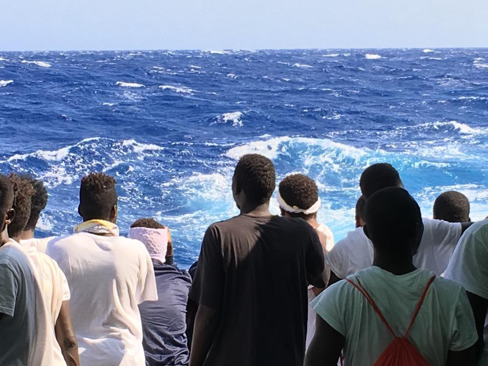
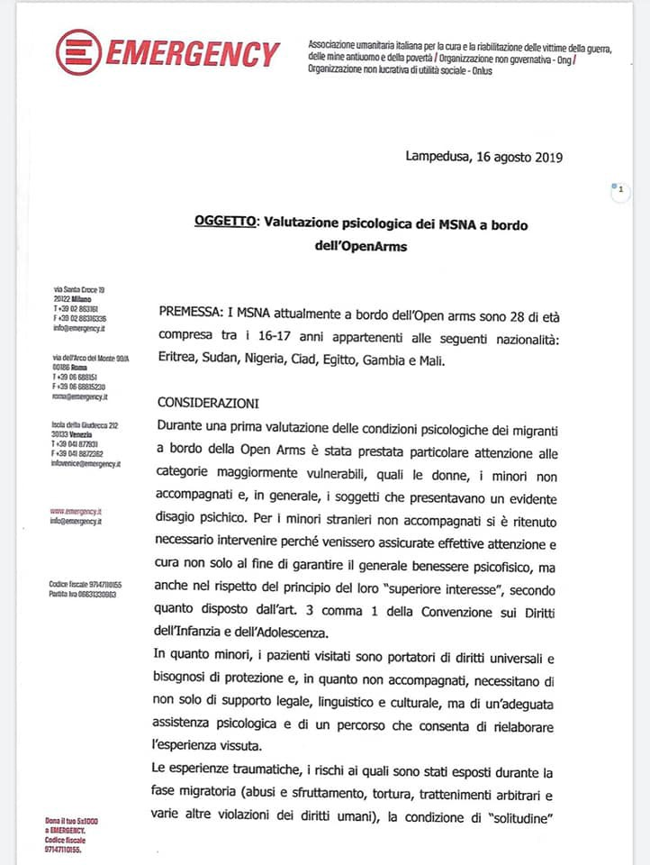
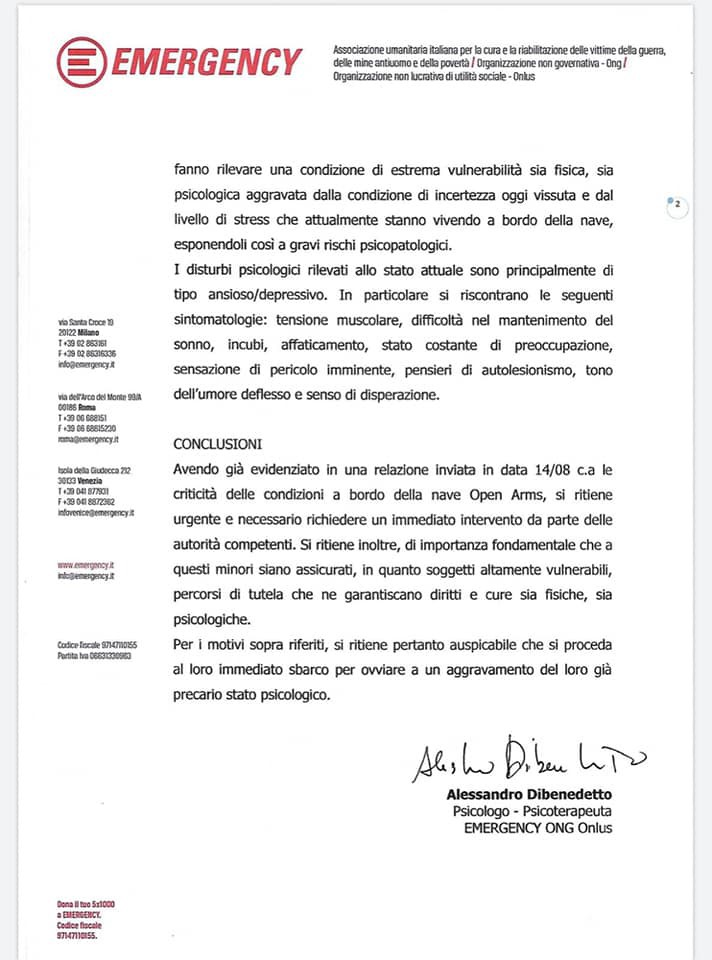
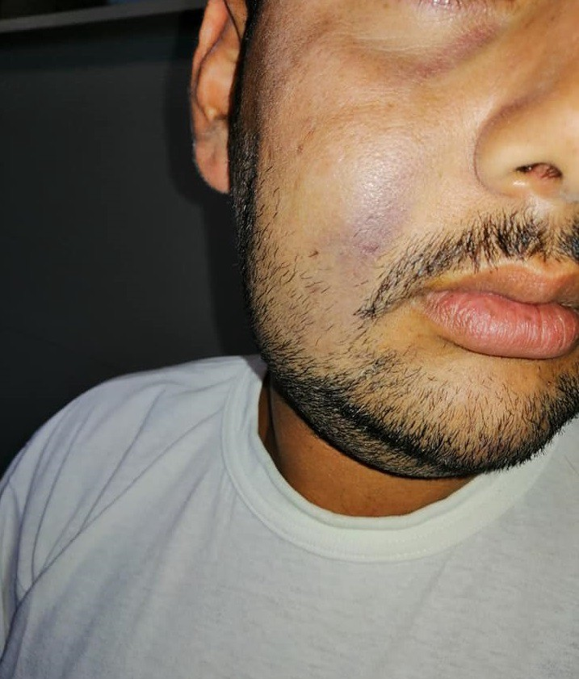
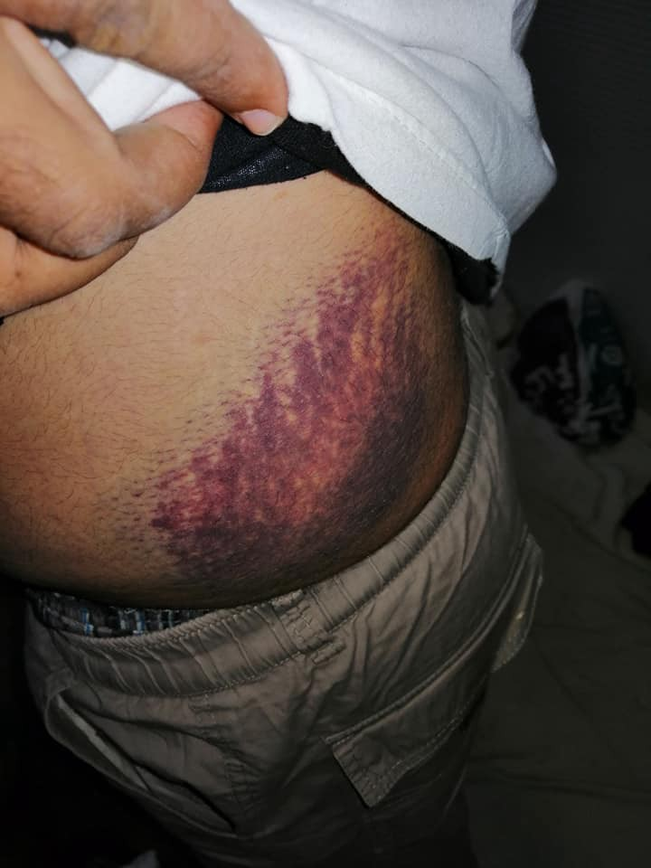

### AYS Daily Digest 16/8/19: Land in sight but still no allowance to dock
#### Open Arms and Ocean Viking still at sea with about 500 rescued people // Overcrowding on Greek islands // Sole survivor from Malta talks about 11 days at sea // People return to Bosnia and Herzegovina with wounds consistent to beatings // Racist statements from politicians of Croatia and Serbia // & more news

Day 16 on board of Open Arms for the 135 recued persons\. Copyright: SOS Mediterranee
#### FEATURED
### Half a mile from the coast of Lampedusa: tensions and desperation

Three people were urgently evacuated from **Open Arms’** vessel, together with 1 other person who accompanied them off\-board, due to medical complications that required specialised care\.
Urgent and immediate evacuation is requested for all people on board\. The conditions of both adults and minors are critical\. According to the psychologist who examined four of the minors on board, the safety of all on board is at risk\. She stated that there a total of 28 minors, aged between 16 and 17\. They are already are classed as vulnerable due to their age, but also because of their traumatic journey, the things that they have experienced and lived through, and as they are demonstrating signs of depression and anxiety\. They should, along with everyone else on board the vessel, be disembarked to safety, and treated according to their needs and rights:

The Palermo juvenile prosecutor has since appointed the guardians for all of the minors aboard Open Arms’ rescue vessel\. As they state, it’s an important step, but we agree they must land as soon as possible\.

However, many others are still stranded away from land, in unacceptable and alarming circumstances\. There was an attempted suicide, and several people have tried to throw themselves overboard\.

■■■■■■■■■■■■■■ 
> **[Open Arms](https://twitter.com/openarms_fund) @ Twitter Says:** 

> > La situación a bordo es insostenible. 
Amenazas de suicido. Conatos de violencia. Todas las personas están física y psicológicamente rotas. Al límite.
Necesitan ser evacuadas de forma inmediata. 
#PuertoSeguroYA https://t.co/j47kXyXNy3 

> **Tweeted at [2019-08-16 15:49:07](https://twitter.com/openarms_fund/status/1162390840943267840).** 

■■■■■■■■■■■■■■ 

“With conditions on board now scarcely tolerable, I call on the Italian authorities to allow an immediate disembarkation of those on board”, David Sassoli, the President of the European Parliament said\.

■■■■■■■■■■■■■■ 
> **[Open Arms](https://twitter.com/openarms_fund) @ Twitter Says:** 

> > Una noche más.
Una noche menos.
Ojalá mañana despierten el sentido común y la humanidad, y abran un puerto donde desembarcar. 
Buenas noches desde las aguas de Lampedusa.
#PuertoSeguroYa https://t.co/dwAWnzRnC8 

> **Tweeted at [2019-08-16 20:48:05](https://twitter.com/openarms_fund/status/1162466079152717829).** 

■■■■■■■■■■■■■■ 

“They are now giving up and are inflicting acts of self\-harm, while they lose sense of reality\. The hygiene conditions on board are worse than ever and it is necessary to allow an immediate disembarkation of those on board\. I hope that the Italian authorities understand the gravity of the humanitarian emergency on board the vessel and agree to let them enter the port today,” Sassoli concluded\.

Here is the latest view to the state the people are trapped in:

MSF’s vessel **Ocean Viking** , which is now carrying 365 people on board, is also asking for a safe disembarkation, urgently\.
A week ago [this](https://www.facebook.com/hashtag/oceanviking?hc_location=ufi) ship made its first rescue\. Now it is still waiting for a safe harbour\.

> Only 11 of the 103 minors on board are accompanied\. The smallest of them is 1 year old 

■■■■■■■■■■■■■■ 
> **[MSF Sea](https://twitter.com/MSF_Sea) @ Twitter Says:** 

> > UPDATE: It has been one week since our first rescue. 356 survivors are now onboard the #OceanViking, waiting for a place of #safety to be assigned. 

Some of them have been at sea for 10 days, they all need to disembark. Now. https://t.co/qfVZniBHE1 

> **Tweeted at [2019-08-16 14:59:43](https://twitter.com/msf_sea/status/1162378410972405760).** 

■■■■■■■■■■■■■■ 

■■■■■■■■■■■■■■ 
> **[MSF Prensa](https://twitter.com/MSF_Prensa) @ Twitter Says:** 

> > Los 500 rescatados por el #OceanViking y el @[openarms_fund](https://twitter.com/openarms_fund) deben ser los últimos en padecer este sufrimiento. Necesitamos mecanismos sostenibles y predecibles que faciliten lugares seguros donde los supervivientes reciban un trato humano y reciban servicios adecuados https://t.co/Tnr0VMenXN 

> **Tweeted at [2019-08-16 11:24:00](https://twitter.com/msf_prensa/status/1162324123110039553).** 

■■■■■■■■■■■■■■ 

In the past 14 months, since Italy forbid landing of SAR ships to Italian ports, more than 20 vessels have been denied entry\.

844 people lost their lives in the Mediterranean from January 1 to August 15, 2019\.
### SYRIA

Due to bombings by the Syrian Regime and Russian forces, 124,000 civilians have been displaced from Idlib area towards the Syrian\-Turkish border during the holiday of Eid al\-Adha\. For more information see:

### TURKEY

The situation for Syrians in Turkey remains tense\. People are, [reportedly](https://harekact.bordermonitoring.eu/2019/08/15/syrians-in-turkey-strangled-by-fear/?fbclid=IwAR230-A6jVt5nWFl4Y5sKOrOeIdg4QDptGY_K8VOpn6UN1eNuomAkFQSz_U) , afraid to leave their houses as the risk of being arrested for not having temporary protection ID or being registered in different provinces is extremely high\.
### GREECE
#### Arrivals

As for Friday morning, twelve boats arrived to the Greek islands, carrying a total of 388 people\. Five of them arrived to Samos, four to Lesvos, another two on Chios and one on Pserimos\.
#### Arrivals increased

Infomigrant reports that the number of people coming to Greece has increased by 25% in some parts of the country\.
#### Overcrowded Reception Centres

All of the housing facilities on the islands are highly overcrowded\. In Samos Reception and Identification Centre has a capacity of 648\. Currently, 3949 people are there\. Numbers for other Centres are similarly inacceptable: Leros: 1253 \(Occupancy\)/ 860 \(Capacity\); Kos: 1971/816; Lesvos: 7933/3000; Chios: 2330/1014\. In total that makes up to 17436 people being accommodated in R\.I\.C\. with a capacity of 6338\. Numbers from Geek Ministry for citizen protection, can be found here:

#### Volunteers needed

Volunteers are needed to support the work of Elliniko Warehouse in Athens from Tuesday to Friday 11 a\.m\. to 5 p\.m\. One can work with them on a regular base, but they also accept sporadic or once off volunteers\.

Also, IHA is in [urgent need](https://www.facebook.com/iha.help/posts/1354788011337570?__xts__[0]=68.ARAQmTcV-XFxQyK73ozvq2lz3pRk-fSi4dEM0t5dujPoiQV7ttSuaqdXfmxBW2MMbF1_UhvTBZfXbcf1ao5OqZAH1Ul0f2BgIPHsUiRnKsq-WnNRPtZ316hEMLpldzoog19o1NLUDWu79U0STnaaNmrIjJLOhIPuVcCCyx4m2VW0Hl8YkSB8oR6yQS6RNGSj5kprEOPSgC_PFewtD8IfjRBoqPg4IEuQ5G3zXmnCt1G2-C6UOieGTjyfnWNgJW0GvErrqEmPPubLXJXpJ-bCavd0JYnHVhyj5Ufmii8xfkngWUbOcURN6KHQCMQhkHEiGPKmd5sT7XirCovKRymCP8Bl6w&__tn__=-R) of volunteers for its community centre and warehouse outside of Thessaloniki\.

Contact:

### MALTA
#### Sole Survivor

In our Daily Digest on [the 13th of August](ays-daily-digest-13-08-19-3-people-died-attempting-to-reach-europe-b7190c4fb655) , we reported about the dingy that was found off the coast of Malta carrying one dead body and one man alive\. As reported by Times of Malta, it turned out that there were originally 15 people on the boat when it started from Libya\. The sole survivor, Mohammed Adam Oga, had to watch 14 people die, one of them being a pregnant women, due to lack of water and exhaustion during the 11 days he spent on the sea\. “After five days two people died\. Then every day two people died\.” An article about him can be found here:

A video showing his rescue here:

\(Disclaimer: The video shows Mohammed Adam Oga being collapsed over the dead body of his friend\. \)

Mohammed Adam Oga claims that during the 11 days, various ships and helicopters passed nearby but nobody came to their rescue\.

Maltas Archbishop Charles Scicluna called for a moment of prayer for “our brothers and sisters who are in the middle of the Mediterranean Sea, waiting for Europe to open the gates of mercy”\.
### BALKAN ROUTE
#### Racist lapses from politicians in Croatia and Serbia

Racist language is on the rise in both Serbia and Croatia\. Croatian Diplomat in Berlin Elizabeta Mađarević is, via Facebook, spreading racist conspiracy theories about a so called “great replacement” of “white Europe” claiming refugees are coming to Europe for political reasons aiming at the total islamification of the continent\. In Serbia, Petar Radojcic, retired lieutenant general and member of the Political Council and Democratic Party Main Committee gives similar worrying statements, saying migrants lead to a demographic destabilization of Serbia\.

In [this article](https://www.newyorker.com/magazine/2017/12/04/the-french-origins-of-you-will-not-replace-us?fbclid=IwAR3iQJNUhX4cYoNy1VcDGrWHhWYElMTz_Mdrb7DNQkKjCv6ssYTso61STew) , the author eloquently shows how the term “great replacement” was invented and coined by the French right\-wing pseudointellectual Renaud Camus\.

This video dismantles the arguments from Lauren Southern, an alt\-right activist, about the “great replacement” in great detail\.

The Border Violence Monitoring Network in collaboration with No Name Kitchen published a new report on the situation at the EU\-borders in July 2019\. Again, it reports of massive use of violence and pushbacks\. Among other things, the report covers:

> · BiH politicians’ rhetoric on Croatian push\-backs 

> · Whistle\-blowers increasing pressure on Croatian authorities 

> · Frontex presence in Hungarian push\-backs to Serbia 

> · The use of k9 units in the apprehension of transit groups in Slovenia 

> · The spatial dispersion of push\-backs in the Una\-Sana Canton 

It can be found here:

#### BOSNIA AND HERZEGOVINA

Volunteer doctors in Bosnia and Herzegovina report people coming \(back\) to Tuzla with injuries consistent with beatings:

Photos: Danijel Vasilj

In Bihać, the ex\-factory building Bira, where people are staying \(an official camp run by IOM\), is being put up for sale, thus confirming the Una Sana Canton’s plan to move people from Miral and Bira to some other places in the city outskirts, at best\. Last time they came up with suggestions to ‘remove people from the city centre’ it ended up with putting up Vučjak, which was a disaster of a ‘camp’, and was not supported by any of the international organisations\. Nobody did anything to secure placing people into a humane accommodation\. We wait and see how the \(long\) ongoing politically and money driven debate between the federal, cantonal, local and international powers, but also those of the international organisations, will drag on\. 
In the meantime, the people they are supposedly having this elongated debate over, will continue to suffer\.
### ITALY
#### Closing of public fontanelle

As Melting Pot Europa reports, in the Italian border city Ventimiglia a public water source that was used by refugees and homeless people for washing was closed by the local government\. The official reasons for closing it are that the fontanelle was indecorous and faulty\. For the activists of Progetto20k the removal is a clear sign for the majors desire to make Ventigiglia more exclusive and expel refugees and homeless people from the cities appearance\. On Saturday, 17th of August, a demonstration was held at 10 a\.m\. to demand the rebuilding of the fontanelle\.
#### Need for donations

L’Altra Voce is in need for Sneakers, trousers, shorts, socks and backpacks\. To support, please contact via FB :

#### Arrivals decreased

According to Infomigrants, arrivals in Italy went down by almost 80% compared to last year, with a total of 4040 landings so far in 2019\.
#### SPAIN
#### Arrivals

Until now, 14\.891 people arrived in Spain by boat in 2019\. This is an decrease of 42\.5 % compared to the same period in 2018\. According to IOM, 208 people have died on their way to the Spanish coast\.

On the Canary Islands, a total of 549 people arrived in 2019\.
### BELGIUM
#### Need for support

In Bruxelles Porte d’Ulysse is in urgent need of support in the kitchen team until the 21th of August\.

For contact:

### GERMANY

After 3 Afghans have been deported from Finland to Kabul a few days ago, another mass deportations flight from Germany to Kabul is scheduled for 27th of August\.
### NETHERLANDS

In the Netherlands, rights of LGBTI refugees are still not adhered to probably\. The IND \(Immigration and Naturalisation Service\) is still using terms that should have been banned earlier, following a new work instruction form September 2018\. LGBT Asylum Support has launched a petition named NietGayGenoeg 2\.0 \(not gay enough\) to call on the State Secretary and House of Representative to end this practices and guarantee the rights of LGBT refugees\.

**We strive to echo correct news from the ground through collaboration and fairness\. Every effort has been made to credit organisations and individuals with regard to the supply of information, video, and photo material \(in cases where the source wanted to be accredited\) \. Please notify us regarding corrections\.**

**Apart from daily news in English, we also publish weekly summaries in Arabic and Persian\. Find specials in both languages on our [medium site](https://medium.com/are-you-syrious/ays-weekly-in-arabic-and-persian/home?source=post_page---------------------------) \.**

**If there’s anything you want to share or comment, contact us through Facebook, Twitter or write to: areyousyrious@gmail\.com\.**

_Converted [Medium Post](https://medium.com/are-you-syrious/ays-daily-digest-16-8-19-land-in-sight-but-still-no-allowance-to-dock-3a87f3db41db) by [ZMediumToMarkdown](https://github.com/ZhgChgLi/ZMediumToMarkdown)._
