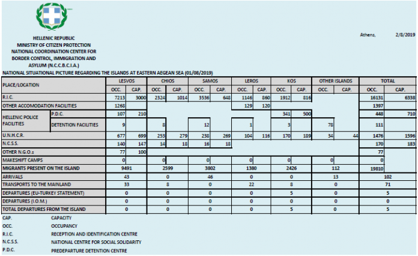

### اکثریت قاطع تصمیم‌ها منفی بوده و باقی مانده‌اند
#### AYS Weekly News Summary in Persian, July 29 — August 4

](assets/b2106d86cd04/1*UHVKhXhxeZ-i-zw3wZjB0A.jpeg)

[Fabio Magnasciutti](http://www.cartoonmovement.com/p/5317)
### **بوسنی**
#### اطلاع رسانی از ووتسیاک

طبق گفته داوطلبان پزشکی که در این منطقه کار می‌کنند ، تعداد زیادی از مردم در این حرکت به اردوگاه ووتسیاک توسط پلیس بوسنی رانده شده‌اند \. در حال حاضر بیش از ۱۰۰۰ نفر در این اردوگاه زندگی می‌کنند \. تیم پزشکی در طی این هفته بیش از ۱۰۰ نفر را مشاهده کرده‌است \. اردوگاه در حال شلوغ شدن است و فضای کمی بین چادرها باقی مانده‌است \. صلیب‌سرخ غذا را تحویل می‌دهد ، اما اغلب برای تغذیه اردوگاه کافی نیست \.

](assets/b2106d86cd04/0*bD4byyTCG2fvVyv-.jpeg)

Photo Credit: [Dirk Planert](https://www.facebook.com/dirk.planert?__tn__=%2CdCH-R-R&eid=ARAthPMK9L0V_OynZxA4UWI7c-4swZTxu_DgaUj03pMAT0nVw-CHhuW7c5WKp2D87jze_P_-gl94asqH&hc_ref=ARSyC23lBENzPLq6-zX9rIIlL09bBVGrKqAtQE2UYhvEmNvFFOV2liHP8oJ4Q-qV_lE&fref=nf&hc_location=group)
### **ایتالیا**

حدود ۶۰۰ نفر از پناهندگان از فریوولی — ونز جولیا به مناطق دیگر منتقل شده‌اند \. تعدادی از این افراد به گریزیا نقل‌مکان کرده‌اند و برخی نیز به بازداشتگاه کارا نقل‌مکان کرده‌اند \.

پلیس ۱۱ پناهجو را در زیرزمین برخی از ساختمان‌ها در نزدیکی ورزشگاه شهر کشف کرده‌است \. همه آن‌ها بازداشت شدند \.
### **فرانسه**
#### شورای قوانین ایالتی در برابر تلاش برای استفاده از حقوق مسکن و مسکن “ Dublined “

شورای دولتی فرانسه روز چهارشنبه علیه حکمی که در قانون مهاجرت و مهاجرت قرار داشت رای داد \. این حکم به اداره مهاجرت و ادغام حق امتناع از مهاجران و کمک پناهندگان به مسکن و کمک‌هزینه به ویژه برای افرادی که تحت مقررات “ دوبلین “ به فرانسه برگردانده شده بودند ، داده شد \. دادگاه دریافت که این حکم “ مطابق با قانون اروپا نیست “ \. اتوبوس اطلاعات پناهنده به دنبال بودجه برای پروژه تلفن همراه خود برای پناهندگان در کاله است \. هر هفته ، تلفن‌های آن‌ها برای تماس‌های فوری ده‌ها پناهنده مورد استفاده قرار می‌گیرد \. شما می‌توانید از آن‌ها در اینجا پشتیبانی کنید \.
### **ترکیه**

در چند هفته گذشته خبر تبعید دسته‌جمعی پناهندگان سوری از شهرهای ترکیه به ویژه استانبول به سوریه به صورت نمایی افزایش‌یافته است \. مقامات هر دو افراد مستند و مستند را هدف قرار داده و آن‌ها را وادار کرده‌اند تا پیش از اخراج آن‌ها “ مرخصی داوطلبانه “ را امضا کنند \. این آخرین باری است که ما از آن خبر داریم \.

طبق گزارش خبرات پناهندگی ، مقامات ترک این ادعاها را رد کردند ، اما اخیرا ً لاف زده بودند که آن‌ها “ 15,000 مهاجر غیرقانونی را از استانبول در ۲۰ روز گذشته اخراج کرده‌اند “ ، که گفته می‌شود آن‌ها را به بازداشتگاه خارج از شهر منتقل کرده‌اند \.
### **وضعیت جزایر**

براساس اطلاعات دولت , مردم در جزایر شرقی یونان هستند \. این شهر به رغم دارا بودن ظرفیت حمل و نقل, در نقاط قوت قلب خود نگه‌داشته شده‌است \.

### **اروپا**
#### روندهای پناهندگی

براساس آمار منتشر شده از ابتدای سال , درخواست‌های 287\.500 پناهندگی از آغاز سال جاری تاکنون ارائه شده‌است که از همان بازه زمانی در سال 2018 , 14% درصد افزایش‌یافته است \. علاوه بر این, با وجود این واقعیت که برنامه‌های کاربردی معمولا ً در طول ماه‌های تابستان و پاییز در اوج اوج خود قرار می‌گیرند , افراد بیشتری به دنبال پناهندگی هستند \. در مجموع , روند پناهندگی در قرقیزستان , تداوم افزایش تعداد درخواست‌های پناهندگی ارائه‌شده در اتحادیه اروپا در پاییز امسال , به ویژه توسط گروهه‌ای شهروندی خاص می‌باشد \.

سه درصد از همه برنامه‌های کاربردی در ماه مه توسط افراد غیر قانونی بدون همراهی ارائه شد \. گزارش‌ها حاکی از آن است که تعداد زیادی متقاضی طلاق از افغانستان در دو سال و نیم گذشته دیده نشده است \.

برخلاف تصورات عمومی اروپایی‌ها , رایج‌ترین کشورهای مبدا متقاضی در ماه می , سوریه , افغانستان و ونزوئلا بودند \.

**در نقشه تعاملی خود می‌توانید ببینید که اکثریت قاطع تصمیم‌ها منفی بوده و باقی مانده‌اند \.**

### **لیبی**

بنا به گفته سالی هایدن روزنامه‌نگار , تعداد افرادی که مبتلا به بیماری سل تشخیص‌داده شده‌اند , در حال افزایش است ; زیرا msf در اردوگاه کار می‌کند \. تخمین زده می‌شود

■■■■■■■■■■■■■■ 
> **[Sally Hayden](https://twitter.com/sallyhayd) @ Twitter Says:** 

> > Germany's ARD TV @[mittagsmagazin](https://twitter.com/mittagsmagazin) did a segment on the situation in Libyan migrant detention centres today, here from 34.40 minutes in: [daserste.de/information/po…](https://www.daserste.de/information/politik-weltgeschehen/mittagsmagazin/videos/ard-mittagsmagazin-video-1742.html) https://t.co/hl34tR1DkA 

> **Tweeted at [2019-07-29 13:21:45](https://twitter.com/sallyhayd/status/1155830772865130498).** 

■■■■■■■■■■■■■■ 

**اخبار بیشتری به انگلیسی در صفحه رسانه ما در دسترس است \. در مواردی که شما سوالاتی دارید و یا مایلید برخی اطلاعات مربوط به روند پناهندگی شما یا کشور مورد نظر را منتشر کنید , لطفا ً برای نوشتن پیغام روی فیس بوک یا نوشتن یک ایمیل به آر\.یو\.س تردید نکنید**

[**areyousyrious@gmail\.com**](mailto:areyousyrious@gmail.com)

_Converted [Medium Post](https://medium.com/are-you-syrious/%D8%A7%DA%A9%D8%AB%D8%B1%DB%8C%D8%AA-%D9%82%D8%A7%D8%B7%D8%B9-%D8%AA%D8%B5%D9%85%DB%8C%D9%85-%D9%87%D8%A7-%D9%85%D9%86%D9%81%DB%8C-%D8%A8%D9%88%D8%AF%D9%87-%D9%88-%D8%A8%D8%A7%D9%82%DB%8C-%D9%85%D8%A7%D9%86%D8%AF%D9%87-%D8%A7%D9%86%D8%AF-b2106d86cd04) by [ZMediumToMarkdown](https://github.com/ZhgChgLi/ZMediumToMarkdown)._
